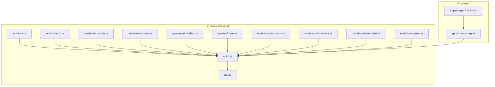
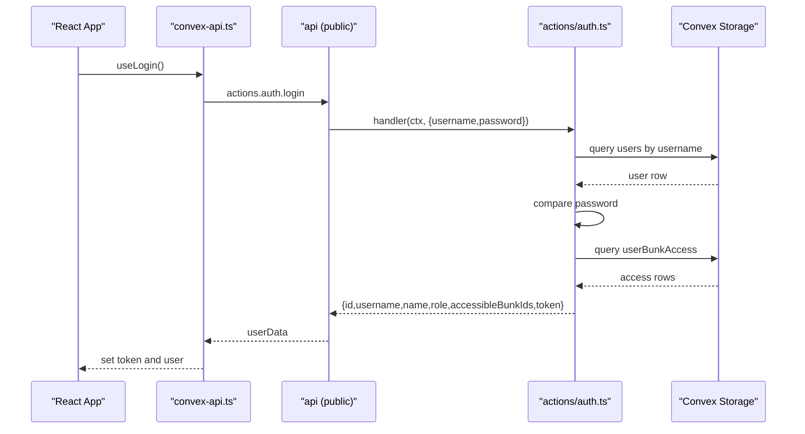
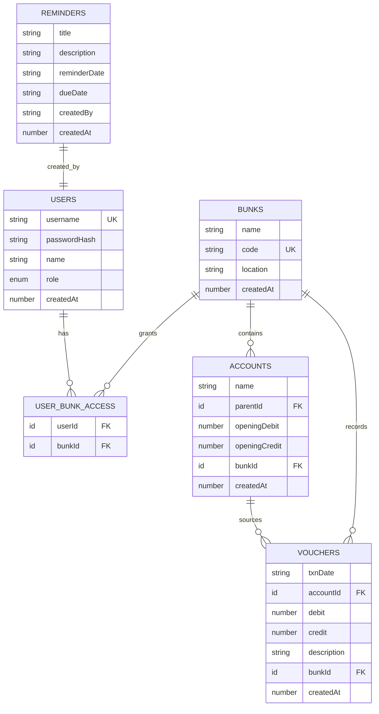
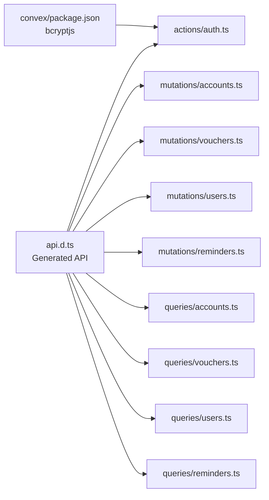

# API Reference

<cite>
**Referenced Files in This Document**
- [schema.ts](file://convex/schema.ts)
- [api.d.ts](file://convex/_generated/api.d.ts)
- [api.js](file://convex/_generated/api.js)
- [auth.ts](file://convex/actions/auth.ts)
- [accounts.ts](file://convex/mutations/accounts.ts)
- [vouchers.ts](file://convex/mutations/vouchers.ts)
- [users.ts](file://convex/mutations/users.ts)
- [reminders.ts](file://convex/mutations/reminders.ts)
- [accounts.ts](file://convex/queries/accounts.ts)
- [vouchers.ts](file://convex/queries/vouchers.ts)
- [users.ts](file://convex/queries/users.ts)
- [reminders.ts](file://convex/queries/reminders.ts)
- [convex-api.ts](file://apps/convex-api.ts)
- [Login.tsx](file://apps/pages/Login.tsx)
- [package.json](file://convex/package.json)
</cite>

## Table of Contents
1. [Introduction](#introduction)
2. [Project Structure](#project-structure)
3. [Core Components](#core-components)
4. [Architecture Overview](#architecture-overview)
5. [Detailed Component Analysis](#detailed-component-analysis)
6. [Dependency Analysis](#dependency-analysis)
7. [Performance Considerations](#performance-considerations)
8. [Troubleshooting Guide](#troubleshooting-guide)
9. [Conclusion](#conclusion)
10. [Appendices](#appendices)

## Introduction
This document provides a comprehensive API reference for the KR-FUELS backend built with Convex. It covers authentication endpoints, CRUD operations for accounts, vouchers, users, and reminders, query endpoints for retrieval and filtering, mutation operations with validation and error handling, authentication and authorization mechanisms, and practical integration guidance for clients.

## Project Structure
The backend is organized into:
- Schema definition for data models and indexes
- Public API generation for client access
- Actions for authentication
- Mutations for write operations
- Queries for read operations
- Frontend integration hooks for React

**Diagram sources**
- [schema.ts](file://convex/schema.ts#L1-L85)
- [api.d.ts](file://convex/_generated/api.d.ts#L32-L60)
- [api.js](file://convex/_generated/api.js#L21-L23)
- [auth.ts](file://convex/actions/auth.ts#L18-L56)
- [accounts.ts](file://convex/queries/accounts.ts#L4-L12)
- [vouchers.ts](file://convex/queries/vouchers.ts#L4-L12)
- [reminders.ts](file://convex/queries/reminders.ts#L12-L26)
- [users.ts](file://convex/queries/users.ts#L4-L21)
- [accounts.ts](file://convex/mutations/accounts.ts#L4-L22)
- [vouchers.ts](file://convex/mutations/vouchers.ts#L4-L24)
- [reminders.ts](file://convex/mutations/reminders.ts#L12-L47)
- [users.ts](file://convex/mutations/users.ts#L13-L41)
- [convex-api.ts](file://apps/convex-api.ts#L1-L33)
- [Login.tsx](file://apps/pages/Login.tsx#L22-L56)

**Section sources**
- [schema.ts](file://convex/schema.ts#L1-L85)
- [api.d.ts](file://convex/_generated/api.d.ts#L32-L60)
- [api.js](file://convex/_generated/api.js#L21-L23)
- [convex-api.ts](file://apps/convex-api.ts#L1-L33)

## Core Components
- Authentication actions: login, register, change password
- CRUD mutations: accounts, vouchers, users, reminders
- Query functions: accounts, vouchers, users, reminders
- Public API surface via generated api utility

Key capabilities:
- Username/password authentication with bcrypt
- Access control via user-bunk junction table
- Hierarchical accounts with self-referencing parent
- Indexed lookups for performance
- Basic validation and error signaling

**Section sources**
- [auth.ts](file://convex/actions/auth.ts#L18-L147)
- [accounts.ts](file://convex/mutations/accounts.ts#L4-L61)
- [vouchers.ts](file://convex/mutations/vouchers.ts#L4-L57)
- [users.ts](file://convex/mutations/users.ts#L13-L80)
- [reminders.ts](file://convex/mutations/reminders.ts#L12-L115)
- [accounts.ts](file://convex/queries/accounts.ts#L4-L18)
- [vouchers.ts](file://convex/queries/vouchers.ts#L4-L18)
- [users.ts](file://convex/queries/users.ts#L4-L34)
- [reminders.ts](file://convex/queries/reminders.ts#L12-L70)

## Architecture Overview
The API is exposed through a generated public surface. Frontend React components consume Convex hooks to call actions and mutations. Authentication actions return a simple token derived from the user identifier.

**Diagram sources**
- [convex-api.ts](file://apps/convex-api.ts#L7-L9)
- [auth.ts](file://convex/actions/auth.ts#L18-L56)
- [users.ts](file://convex/queries/users.ts#L4-L21)
- [users.ts](file://convex/queries/users.ts#L14-L21)

**Section sources**
- [api.d.ts](file://convex/_generated/api.d.ts#L57-L60)
- [api.js](file://convex/_generated/api.js#L21-L23)
- [convex-api.ts](file://apps/convex-api.ts#L1-L33)
- [Login.tsx](file://apps/pages/Login.tsx#L22-L56)

## Detailed Component Analysis

### Authentication Endpoints
Authentication is handled via actions. The frontend integrates login and stores a token locally.

- Action: login
  - Purpose: Authenticate user and return profile plus accessible bunks
  - Request arguments:
    - username: string
    - password: string
  - Response fields:
    - id: string (user identifier)
    - username: string
    - name: string
    - role: "admin" | "super_admin"
    - accessibleBunkIds: string[]
    - token: string (derived from user id)
  - Errors:
    - Invalid username or password
  - Security:
    - Password verification performed with bcrypt
    - Token is a simple identifier; consider adding JWT for production

- Action: registerUser
  - Purpose: Create a new user with hashed password and grant bunk access
  - Request arguments:
    - username: string
    - password: string (minimum length validated)
    - name: string
    - role: "admin" | "super_admin"
    - accessibleBunkIds: string[] (array of bunk ids)
  - Response fields:
    - id: string
    - username: string
    - name: string
    - role: string
  - Errors:
    - Username already exists
    - Password too short

- Action: changePassword
  - Purpose: Update user password after verifying old password
  - Request arguments:
    - userId: string
    - oldPassword: string
    - newPassword: string (minimum length validated)
  - Response fields:
    - success: boolean
  - Errors:
    - User not found
    - Current password is incorrect
    - New password too short

Authorization and headers:
- No explicit Authorization header is used in the current implementation
- The token returned by login is stored in local storage by the frontend
- For production, integrate token-based bearer authentication with Convex

Practical example:
- Frontend login flow:
  - Collect username and password
  - Call login action
  - On success, persist token and user id
  - Redirect to dashboard

Integration pattern:
- Use useAction from Convex React hooks
- Handle errors and loading states in the UI
- Store token securely (consider HttpOnly cookies in a server-side deployment)

**Section sources**
- [auth.ts](file://convex/actions/auth.ts#L18-L147)
- [users.ts](file://convex/queries/users.ts#L4-L21)
- [convex-api.ts](file://apps/convex-api.ts#L7-L9)
- [Login.tsx](file://apps/pages/Login.tsx#L22-L56)

### Accounts CRUD
Accounts represent a hierarchical chart of accounts per fuel station (bunk).

- Mutation: createAccount
  - Arguments:
    - name: string
    - parentId: optional string (self-reference)
    - openingDebit: number
    - openingCredit: number
    - bunkId: string
  - Response: inserted account row

- Mutation: updateAccount
  - Arguments:
    - id: string
    - name: string
    - parentId: optional string
    - openingDebit: number
    - openingCredit: number
  - Response: updated account row
  - Errors:
    - Account not found

- Mutation: deleteAccount
  - Arguments:
    - id: string
  - Response: { success: boolean }
  - Errors:
    - Account not found
    - Cannot delete account with sub-accounts

Validation and constraints:
- Parent-child relationship is self-referencing via parentId
- Debits and credits are numeric amounts
- Hierarchical deletion prevents orphaned children

**Section sources**
- [accounts.ts](file://convex/mutations/accounts.ts#L4-L61)
- [schema.ts](file://convex/schema.ts#L44-L54)

### Vouchers CRUD
Vouchers represent daily transaction records linked to accounts and bunks.

- Mutation: createVoucher
  - Arguments:
    - txnDate: string (ISO date)
    - accountId: string
    - debit: number
    - credit: number
    - description: string
    - bunkId: string
  - Response: inserted voucher row

- Mutation: updateVoucher
  - Arguments:
    - id: string
    - txnDate: string
    - accountId: string
    - debit: number
    - credit: number
    - description: string
  - Response: updated voucher row
  - Errors:
    - Voucher not found

- Mutation: deleteVoucher
  - Arguments:
    - id: string
  - Response: { success: boolean }
  - Errors:
    - Voucher not found

Indexes and retrieval:
- Query: getVouchersByBunk
  - Arguments:
    - bunkId: string
  - Response: array of vouchers ordered by bunk and date

- Query: getAllVouchers
  - Response: array of all vouchers

**Section sources**
- [vouchers.ts](file://convex/mutations/vouchers.ts#L4-L57)
- [vouchers.ts](file://convex/queries/vouchers.ts#L4-L18)
- [schema.ts](file://convex/schema.ts#L59-L69)

### Users CRUD
User management supports creation, password updates, and deletion with associated bunk access.

- Mutation: createUser
  - Arguments:
    - username: string
    - passwordHash: string
    - name: string
    - role: "admin" | "super_admin"
    - accessibleBunkIds: string[]
  - Response: userId
  - Behavior:
    - Inserts user
    - Creates multiple user-bunk access records

- Mutation: updatePassword
  - Arguments:
    - userId: string
    - newPasswordHash: string
  - Response: { success: boolean }

- Mutation: deleteUser
  - Arguments:
    - userId: string
  - Response: { success: boolean }
  - Behavior:
    - Removes all user-bunk access records
    - Deletes user

Queries:
- getUserByUsername
  - Arguments:
    - username: string
  - Response: user row or null

- getUserBunks
  - Arguments:
    - userId: string
  - Response: array of access records

- getAllUsers
  - Response: array of all users

- getAllUserBunkAccess
  - Response: array of all access records

**Section sources**
- [users.ts](file://convex/mutations/users.ts#L13-L80)
- [users.ts](file://convex/queries/users.ts#L4-L34)
- [schema.ts](file://convex/schema.ts#L23-L40)

### Reminders CRUD
Reminders provide task and reminder management with date-based filtering.

- Mutation: createReminder
  - Arguments:
    - title: string (required)
    - description: string
    - reminderDate: string (YYYY-MM-DD)
    - dueDate: string (YYYY-MM-DD)
  - Response: inserted reminder row
  - Validation:
    - Title required
    - Date format enforced

- Mutation: updateReminder
  - Arguments:
    - id: string
    - title: string
    - description: string
    - reminderDate: string
    - dueDate: string
  - Response: updated reminder row
  - Errors:
    - Reminder not found

- Mutation: deleteReminder
  - Arguments:
    - id: string
  - Response: { success: boolean, id: string }
  - Errors:
    - Reminder not found

Queries:
- getAllReminders
  - Response: array sorted ascending by due date

- getUpcomingReminders
  - Response: reminders due within the next 7 days, sorted by reminderDate

- getOverdueReminders
  - Response: reminders whose dueDate is in the past, sorted by dueDate

**Section sources**
- [reminders.ts](file://convex/mutations/reminders.ts#L12-L115)
- [reminders.ts](file://convex/queries/reminders.ts#L12-L70)
- [schema.ts](file://convex/schema.ts#L74-L83)

### Data Models Overview
The schema defines six tables with indexes optimized for common queries.

**Diagram sources**
- [schema.ts](file://convex/schema.ts#L13-L83)

**Section sources**
- [schema.ts](file://convex/schema.ts#L1-L85)

## Dependency Analysis
Public API exposure and runtime dependencies:

- Public API surface
  - Generated via api utility for modules under actions, mutations, and queries
  - Filters to public functions only

- Runtime dependencies
  - bcryptjs for password hashing in Node runtime actions

**Diagram sources**
- [api.d.ts](file://convex/_generated/api.d.ts#L32-L47)
- [auth.ts](file://convex/actions/auth.ts#L6-L6)
- [package.json](file://convex/package.json#L7-L7)

**Section sources**
- [api.d.ts](file://convex/_generated/api.d.ts#L32-L60)
- [api.js](file://convex/_generated/api.js#L21-L23)
- [package.json](file://convex/package.json#L1-L10)

## Performance Considerations
- Indexes
  - bunks.code: unique, indexed
  - users.by_username: unique, indexed
  - userBunkAccess.by_user, by_bunk, by_user_and_bunk: composite and single-field indexes
  - accounts.by_bunk, by_parent: hierarchical navigation
  - vouchers.by_bunk_and_date, by_account: transaction lookup
  - reminders.by_due_date, by_reminder_date: date-range queries

- Query patterns
  - Use indexed fields for equality filters
  - Prefer index-backed queries for bulk reads
  - Sorting by date fields leverages indexes where available

- Mutation safety
  - Existence checks before updates/deletes
  - Hierarchical deletion guards against orphaned nodes

[No sources needed since this section provides general guidance]

## Troubleshooting Guide
Common issues and resolutions:
- Authentication failures
  - Cause: invalid username or password
  - Resolution: verify credentials; ensure bcrypt comparison succeeds

- Registration conflicts
  - Cause: username already exists
  - Resolution: choose a unique username

- Password policy violations
  - Cause: password too short
  - Resolution: enforce minimum length during client-side validation

- Entity not found
  - Accounts/Vouchers/Users/Reminders
  - Resolution: check identifiers and existence before mutating

- Hierarchical deletion blocked
  - Cause: account has sub-accounts
  - Resolution: delete children first or re-parent

- Date format errors
  - Cause: reminderDate/dueDate not in YYYY-MM-DD
  - Resolution: format dates accordingly before sending

- Access control
  - Current token is a simple identifier; implement bearer auth for secure environments

**Section sources**
- [auth.ts](file://convex/actions/auth.ts#L29-L37)
- [auth.ts](file://convex/actions/auth.ts#L76-L78)
- [auth.ts](file://convex/actions/auth.ts#L81-L83)
- [accounts.ts](file://convex/mutations/accounts.ts#L48-L57)
- [reminders.ts](file://convex/mutations/reminders.ts#L23-L34)
- [reminders.ts](file://convex/mutations/reminders.ts#L70-L81)

## Conclusion
The KR-FUELS backend provides a clear, typed API surface for authentication and domain operations. The schema and indexes enable efficient queries, while mutations encapsulate validation and safety checks. For production readiness, integrate bearer authentication, consider pagination for large datasets, and add rate limiting and API versioning.

[No sources needed since this section summarizes without analyzing specific files]

## Appendices

### API Endpoints Summary
- Authentication
  - actions.auth.login: POST login with username/password
  - actions.auth.registerUser: POST register with password hash and access
  - actions.auth.changePassword: POST change password with old/new passwords

- Accounts
  - mutations.accounts.createAccount: POST create account
  - mutations.accounts.updateAccount: PATCH update account
  - mutations.accounts.deleteAccount: DELETE account
  - queries.accounts.getAccountsByBunk: GET accounts by bunk
  - queries.accounts.getAllAccounts: GET all accounts

- Vouchers
  - mutations.vouchers.createVoucher: POST create voucher
  - mutations.vouchers.updateVoucher: PATCH update voucher
  - mutations.vouchers.deleteVoucher: DELETE voucher
  - queries.vouchers.getVouchersByBunk: GET vouchers by bunk
  - queries.vouchers.getAllVouchers: GET all vouchers

- Users
  - mutations.users.createUser: POST create user
  - mutations.users.updatePassword: PATCH update password
  - mutations.users.deleteUser: DELETE user
  - queries.users.getUserByUsername: GET user by username
  - queries.users.getUserBunks: GET user's bunk access
  - queries.users.getAllUsers: GET all users
  - queries.users.getAllUserBunkAccess: GET all access records

- Reminders
  - mutations.reminders.createReminder: POST create reminder
  - mutations.reminders.updateReminder: PATCH update reminder
  - mutations.reminders.deleteReminder: DELETE reminder
  - queries.reminders.getAllReminders: GET all reminders (sorted by due date)
  - queries.reminders.getUpcomingReminders: GET upcoming reminders (next 7 days)
  - queries.reminders.getOverdueReminders: GET overdue reminders

**Section sources**
- [api.d.ts](file://convex/_generated/api.d.ts#L32-L47)
- [auth.ts](file://convex/actions/auth.ts#L18-L147)
- [accounts.ts](file://convex/mutations/accounts.ts#L4-L61)
- [accounts.ts](file://convex/queries/accounts.ts#L4-L18)
- [vouchers.ts](file://convex/mutations/vouchers.ts#L4-L57)
- [vouchers.ts](file://convex/queries/vouchers.ts#L4-L18)
- [users.ts](file://convex/mutations/users.ts#L13-L80)
- [users.ts](file://convex/queries/users.ts#L4-L34)
- [reminders.ts](file://convex/mutations/reminders.ts#L12-L115)
- [reminders.ts](file://convex/queries/reminders.ts#L12-L70)

### Client Implementation Guidelines
- Use Convex React hooks
  - Import api from the generated module
  - Wrap actions and mutations with useAction/useMutation/useQuery
  - Example patterns are visible in the frontend integration file

- Token handling
  - The login action returns a token; the frontend persists it in local storage
  - For production, pass the token via Authorization header in Convex requests

- Error handling
  - Catch thrown errors from actions/mutations
  - Display user-friendly messages and retry logic where appropriate

- Pagination
  - Current queries return full collections
  - Add pagination parameters to queries for large datasets

- Rate limiting and versioning
  - Implement client-side throttling for frequent mutations
  - Version API endpoints and maintain backward compatibility

**Section sources**
- [convex-api.ts](file://apps/convex-api.ts#L1-L33)
- [Login.tsx](file://apps/pages/Login.tsx#L22-L56)