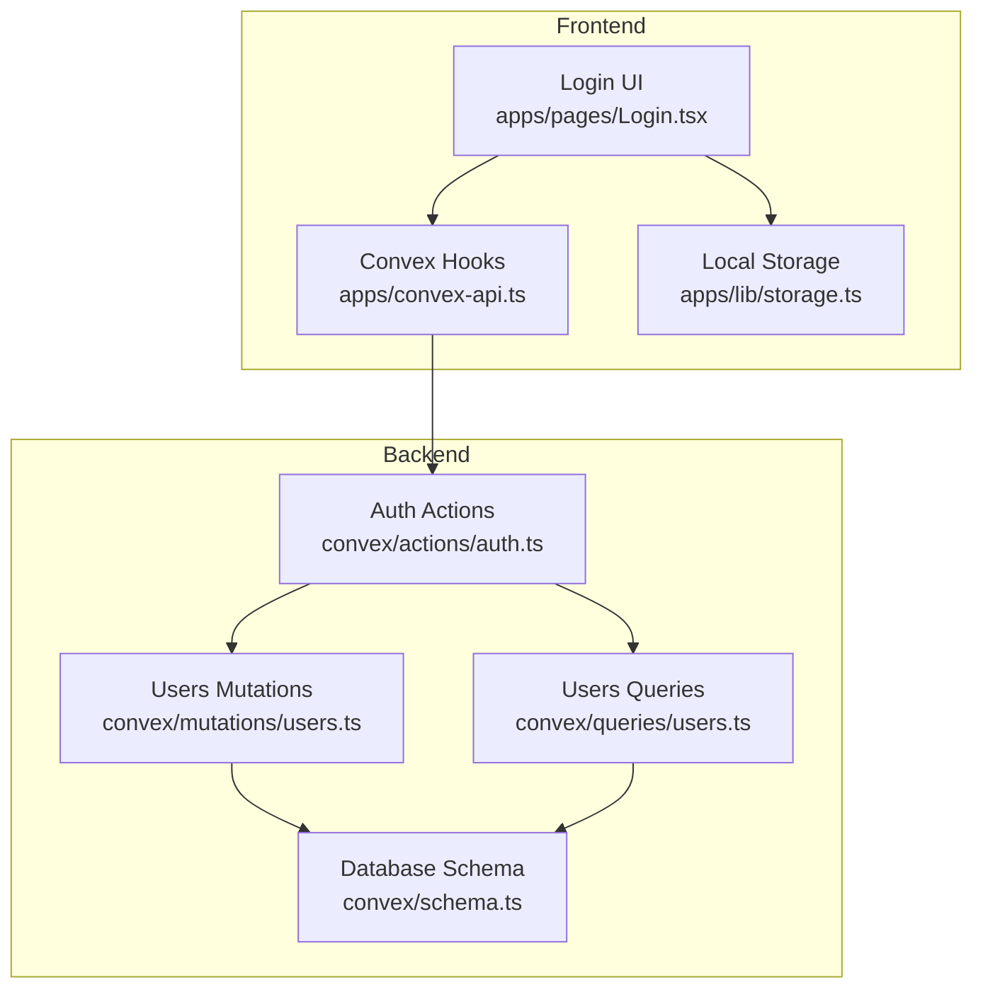
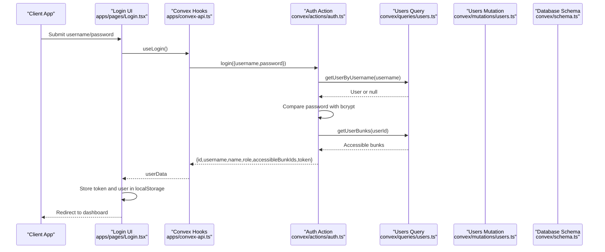
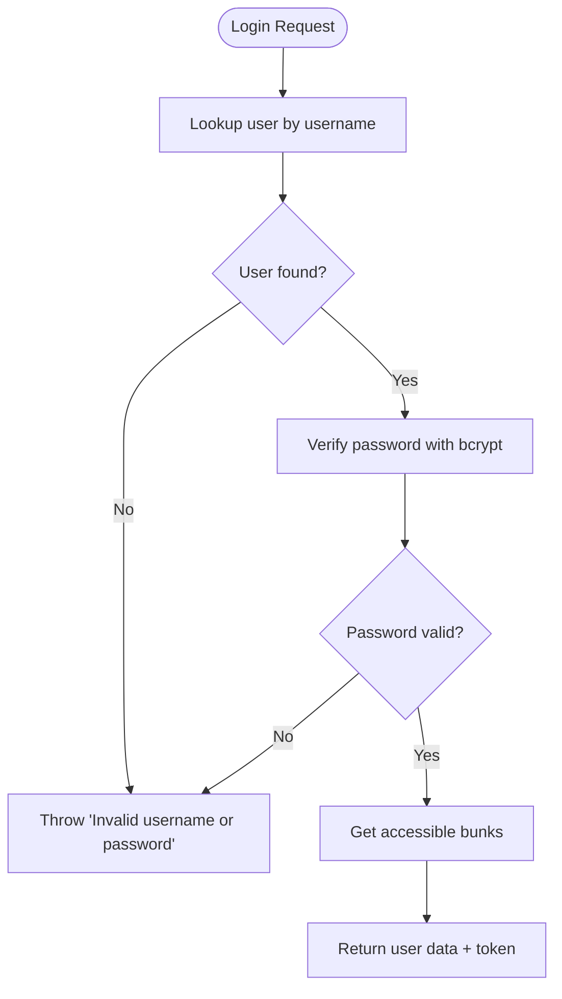
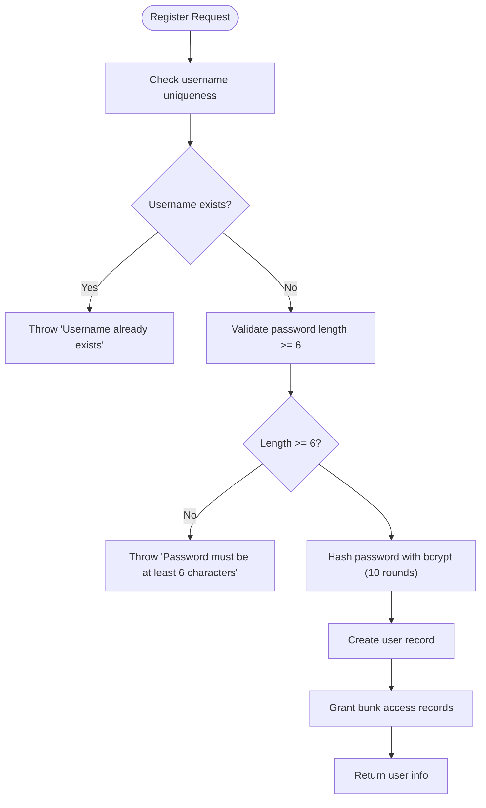
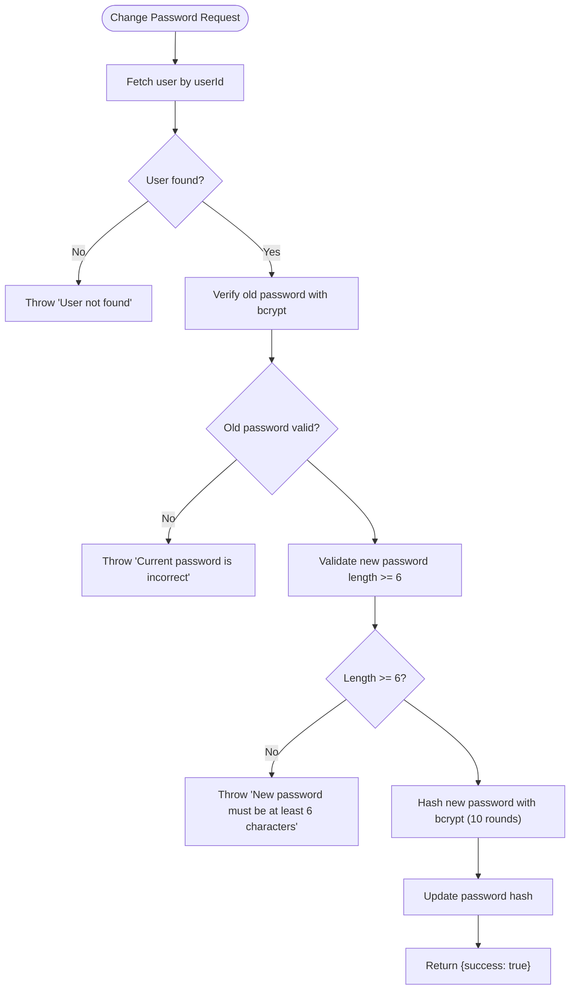
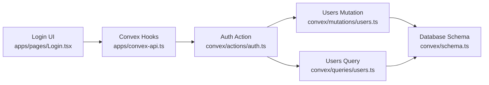

# Authentication API

<cite>
**Referenced Files in This Document**
- [auth.ts](file://convex/actions/auth.ts)
- [users.ts](file://convex/mutations/users.ts)
- [users.ts](file://convex/queries/users.ts)
- [schema.ts](file://convex/schema.ts)
- [api.d.ts](file://convex/_generated/api.d.ts)
- [convex-api.ts](file://apps/convex-api.ts)
- [Login.tsx](file://apps/pages/Login.tsx)
- [App.tsx](file://apps/App.tsx)
- [storage.ts](file://apps/lib/storage.ts)
- [types.ts](file://apps/types.ts)
</cite>

## Table of Contents
1. [Introduction](#introduction)
2. [Project Structure](#project-structure)
3. [Core Components](#core-components)
4. [Architecture Overview](#architecture-overview)
5. [Detailed Component Analysis](#detailed-component-analysis)
6. [Dependency Analysis](#dependency-analysis)
7. [Performance Considerations](#performance-considerations)
8. [Troubleshooting Guide](#troubleshooting-guide)
9. [Conclusion](#conclusion)
10. [Appendices](#appendices)

## Introduction
This document provides comprehensive API documentation for the KR-FUELS authentication endpoints. It covers the login, user registration, and password change workflows, including request/response schemas, error handling, security considerations, and practical examples for clients.

## Project Structure
The authentication system spans the backend Convex actions and the frontend React components:
- Backend actions implement login, registration, and password change using bcrypt for hashing.
- Frontend components integrate with Convex actions and manage local session storage.
- The database schema defines the users table and access controls.

**Diagram sources**
- [Login.tsx](file://apps/pages/Login.tsx#L22-L56)
- [convex-api.ts](file://apps/convex-api.ts#L7-L9)
- [auth.ts](file://convex/actions/auth.ts#L18-L56)
- [users.ts](file://convex/queries/users.ts#L4-L12)
- [users.ts](file://convex/mutations/users.ts#L13-L41)
- [schema.ts](file://convex/schema.ts#L23-L29)
- [storage.ts](file://apps/lib/storage.ts#L1-L34)

**Section sources**
- [auth.ts](file://convex/actions/auth.ts#L1-L148)
- [users.ts](file://convex/queries/users.ts#L1-L35)
- [users.ts](file://convex/mutations/users.ts#L1-L81)
- [schema.ts](file://convex/schema.ts#L1-L85)
- [convex-api.ts](file://apps/convex-api.ts#L1-L33)
- [Login.tsx](file://apps/pages/Login.tsx#L1-L167)
- [storage.ts](file://apps/lib/storage.ts#L1-L34)

## Core Components
- Login action validates credentials, verifies password with bcrypt, and returns user data plus a simple token.
- Registration action enforces password length, checks username uniqueness, hashes the password with bcrypt (10 rounds), and assigns roles.
- Password change action verifies the old password, validates the new password length, hashes the new password, and updates it.

Key behaviors:
- Password hashing uses bcrypt with 10 rounds.
- Username uniqueness is enforced via a database index.
- Roles are restricted to admin or super_admin.
- Token is a simple user identifier stored in local storage by the frontend.

**Section sources**
- [auth.ts](file://convex/actions/auth.ts#L18-L56)
- [auth.ts](file://convex/actions/auth.ts#L62-L104)
- [auth.ts](file://convex/actions/auth.ts#L109-L147)
- [users.ts](file://convex/mutations/users.ts#L13-L41)
- [users.ts](file://convex/mutations/users.ts#L47-L57)
- [schema.ts](file://convex/schema.ts#L23-L29)

## Architecture Overview
The authentication flow integrates frontend UI, Convex hooks, and backend actions with database queries and mutations.

**Diagram sources**
- [Login.tsx](file://apps/pages/Login.tsx#L30-L56)
- [convex-api.ts](file://apps/convex-api.ts#L7)
- [auth.ts](file://convex/actions/auth.ts#L18-L56)
- [users.ts](file://convex/queries/users.ts#L4-L22)
- [schema.ts](file://convex/schema.ts#L23-L29)

## Detailed Component Analysis

### Login Endpoint
- Purpose: Authenticate a user with username/password and return user data and a simple token.
- Request body:
  - username: string (non-empty)
  - password: string (non-empty)
- Response body:
  - id: string (user identifier)
  - username: string
  - name: string
  - role: "admin" | "super_admin"
  - accessibleBunkIds: string[]
  - token: string (simple token equal to user id)
- Error responses:
  - Invalid username or password
- Security:
  - Password verified using bcrypt compare.
  - No sensitive fields returned in response.

**Diagram sources**
- [auth.ts](file://convex/actions/auth.ts#L18-L56)
- [users.ts](file://convex/queries/users.ts#L4-L22)

**Section sources**
- [auth.ts](file://convex/actions/auth.ts#L18-L56)
- [users.ts](file://convex/queries/users.ts#L4-L22)

### RegisterUser Endpoint
- Purpose: Create a new user with validated password and role assignment.
- Request body:
  - username: string (unique)
  - password: string (minimum 6 characters)
  - name: string
  - role: "admin" | "super_admin"
  - accessibleBunkIds: string[] (bunk identifiers)
- Response body:
  - id: string (new user identifier)
  - username: string
  - name: string
  - role: "admin" | "super_admin"
- Error responses:
  - Username already exists
  - Password must be at least 6 characters
- Security:
  - Password hashed with bcrypt (10 rounds) before storage.
  - Username uniqueness enforced by database index.

**Diagram sources**
- [auth.ts](file://convex/actions/auth.ts#L62-L104)
- [users.ts](file://convex/mutations/users.ts#L13-L41)
- [schema.ts](file://convex/schema.ts#L23-L29)

**Section sources**
- [auth.ts](file://convex/actions/auth.ts#L62-L104)
- [users.ts](file://convex/mutations/users.ts#L13-L41)
- [schema.ts](file://convex/schema.ts#L23-L29)

### ChangePassword Endpoint
- Purpose: Update a user’s password after verifying the old password.
- Request body:
  - userId: string (user identifier)
  - oldPassword: string (current password)
  - newPassword: string (minimum 6 characters)
- Response body:
  - success: boolean (true on success)
- Error responses:
  - Current password is incorrect
  - New password must be at least 6 characters
- Security:
  - Old password verified with bcrypt compare.
  - New password hashed with bcrypt (10 rounds) before update.

**Diagram sources**
- [auth.ts](file://convex/actions/auth.ts#L109-L147)
- [users.ts](file://convex/mutations/users.ts#L47-L57)

**Section sources**
- [auth.ts](file://convex/actions/auth.ts#L109-L147)
- [users.ts](file://convex/mutations/users.ts#L47-L57)

## Dependency Analysis
- Frontend depends on Convex hooks to call backend actions.
- Backend actions depend on queries for user lookup and mutations for writes.
- Database schema defines constraints and indexes for usernames and access relations.

**Diagram sources**
- [Login.tsx](file://apps/pages/Login.tsx#L28)
- [convex-api.ts](file://apps/convex-api.ts#L7-L9)
- [auth.ts](file://convex/actions/auth.ts#L18-L56)
- [users.ts](file://convex/queries/users.ts#L4-L22)
- [users.ts](file://convex/mutations/users.ts#L13-L41)
- [schema.ts](file://convex/schema.ts#L23-L29)

**Section sources**
- [api.d.ts](file://convex/_generated/api.d.ts#L32-L60)
- [convex-api.ts](file://apps/convex-api.ts#L1-L33)
- [auth.ts](file://convex/actions/auth.ts#L1-L148)
- [users.ts](file://convex/queries/users.ts#L1-L35)
- [users.ts](file://convex/mutations/users.ts#L1-L81)
- [schema.ts](file://convex/schema.ts#L1-L85)

## Performance Considerations
- bcrypt hashing cost: 10 rounds are used for password hashing. While secure, this adds CPU overhead; consider monitoring latency under load.
- Index usage: Username lookups rely on a database index, minimizing query time.
- Token simplicity: Using the user id as a token avoids cryptographic overhead but limits token capabilities.

## Troubleshooting Guide
Common errors and resolutions:
- Invalid username or password:
  - Cause: User not found or password mismatch.
  - Resolution: Verify credentials; ensure bcrypt compare succeeds.
- Username already exists:
  - Cause: Duplicate username detected during registration.
  - Resolution: Choose a unique username.
- Password must be at least 6 characters:
  - Cause: New or provided password shorter than 6 characters.
  - Resolution: Enforce minimum length before sending request.
- Current password is incorrect:
  - Cause: Old password does not match stored hash.
  - Resolution: Prompt user to re-enter current password.

**Section sources**
- [auth.ts](file://convex/actions/auth.ts#L29-L37)
- [auth.ts](file://convex/actions/auth.ts#L76-L83)
- [auth.ts](file://convex/actions/auth.ts#L121-L129)
- [auth.ts](file://convex/actions/auth.ts#L132-L134)

## Conclusion
The KR-FUELS authentication system provides a straightforward username/password login, secure user registration with bcrypt hashing, and a safe password change process. The frontend manages a simple token and user state locally, while the backend enforces validation and security policies.

## Appendices

### API Reference

- Base URL
  - The API is accessed via Convex actions exposed through the generated client. The base URL is determined by your Convex deployment configuration.

- Authentication Headers
  - Not applicable. The system stores a simple token in local storage and does not require Authorization headers for these endpoints.

- Session Management
  - Token: stored as kr_fuels_token in local storage.
  - User data: stored as kr_fuels_user in local storage.
  - Logout clears stored user and token.

- Practical Examples

  - Login
    - curl command:
      - curl -X POST https://your-convex-app.convex.cloud/api/actions/auth.login \
        -H "Content-Type: application/json" \
        -d '{"username":"<USERNAME>","password":"<PASSWORD>"}'
    - Client pattern:
      - Use the provided hook to call the login action and store the returned token and user data.

  - Register User
    - curl command:
      - curl -X POST https://your-convex-app.convex.cloud/api/actions/auth.registerUser \
        -H "Content-Type: application/json" \
        -d '{"username":"<USERNAME>","password":"<PASSWORD>","name":"<NAME>","role":"admin","accessibleBunkIds":["<BUNK_ID>"]}'
    - Client pattern:
      - Validate password length and uniqueness before calling the registration action.

  - Change Password
    - curl command:
      - curl -X POST https://your-convex-app.convex.cloud/api/actions/auth.changePassword \
        -H "Content-Type: application/json" \
        -d '{"userId":"<USER_ID>","oldPassword":"<OLD_PASSWORD>","newPassword":"<NEW_PASSWORD>"}'
    - Client pattern:
      - Verify old password before allowing new password submission.

- Request/Response Schemas

  - Login
    - Request: { username: string, password: string }
    - Response: { id: string, username: string, name: string, role: "admin"|"super_admin", accessibleBunkIds: string[], token: string }

  - RegisterUser
    - Request: { username: string, password: string, name: string, role: "admin"|"super_admin", accessibleBunkIds: string[] }
    - Response: { id: string, username: string, name: string, role: "admin"|"super_admin" }

  - ChangePassword
    - Request: { userId: string, oldPassword: string, newPassword: string }
    - Response: { success: boolean }

- Security Considerations
  - Password hashing: bcrypt with 10 rounds is used for both registration and password changes.
  - Token: simple user id stored in local storage; consider rotating tokens and adding expiration for production.
  - Role-based access: enforced by backend and reflected in accessible bunk ids.

**Section sources**
- [Login.tsx](file://apps/pages/Login.tsx#L30-L56)
- [convex-api.ts](file://apps/convex-api.ts#L7-L9)
- [auth.ts](file://convex/actions/auth.ts#L18-L56)
- [auth.ts](file://convex/actions/auth.ts#L62-L104)
- [auth.ts](file://convex/actions/auth.ts#L109-L147)
- [storage.ts](file://apps/lib/storage.ts#L26-L33)
- [types.ts](file://apps/types.ts#L9-L15)