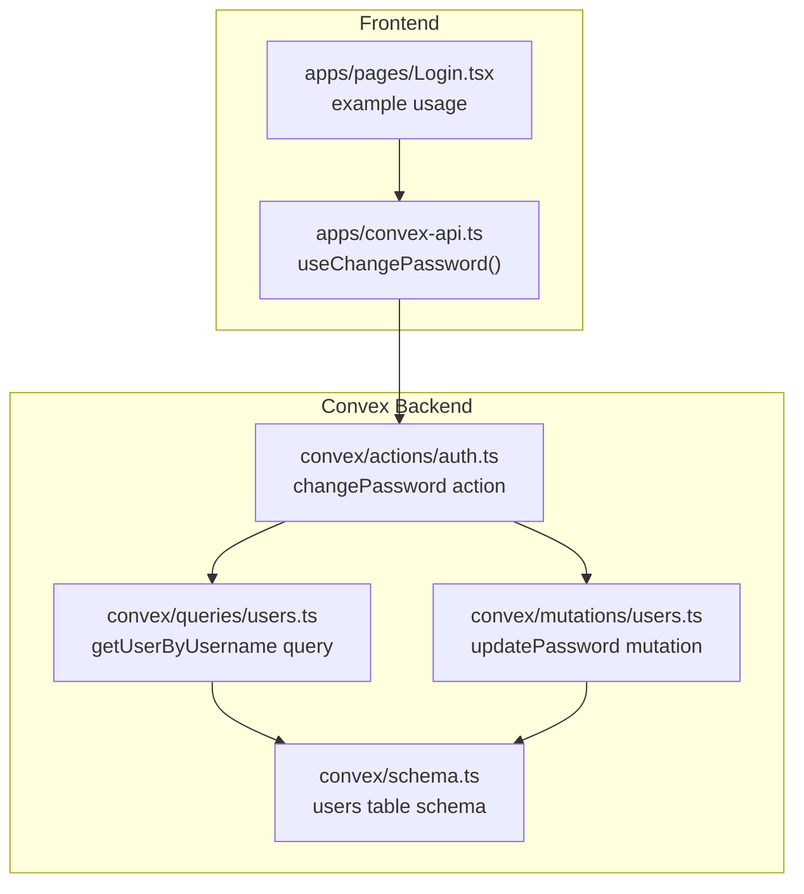
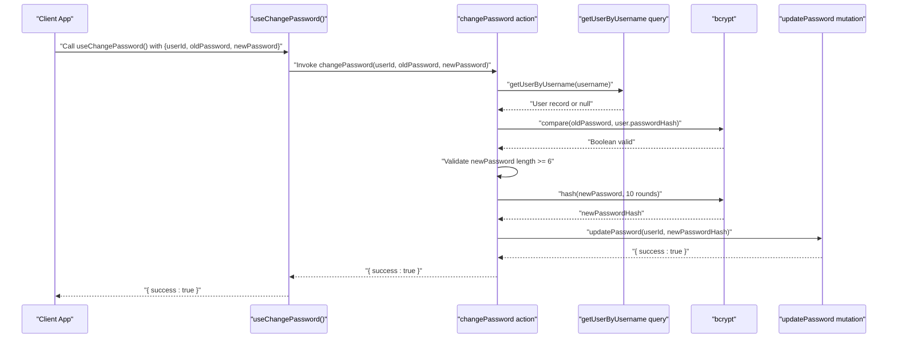
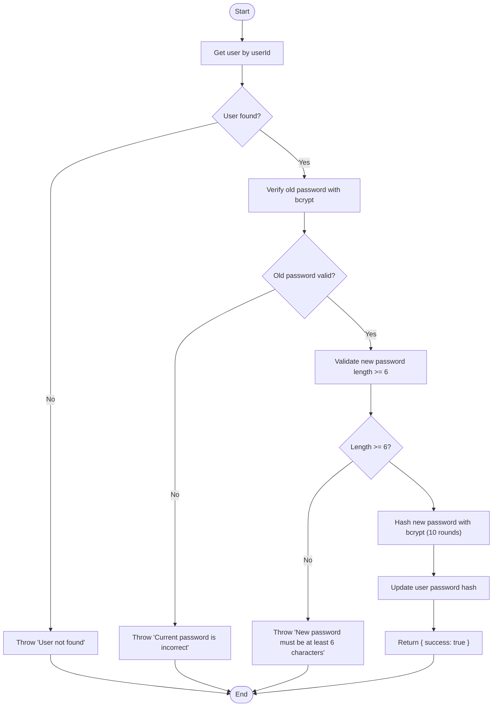
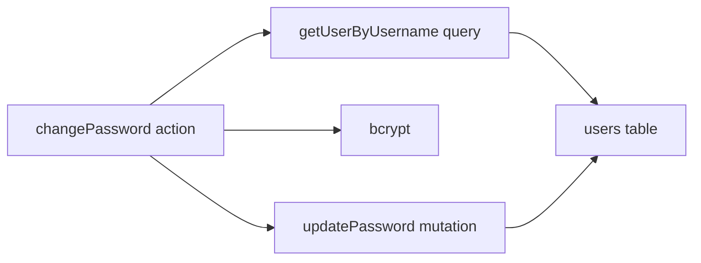

# Change Password Endpoint

<cite>
**Referenced Files in This Document**
- [auth.ts](file://convex/actions/auth.ts)
- [users.ts](file://convex/mutations/users.ts)
- [users.ts](file://convex/queries/users.ts)
- [schema.ts](file://convex/schema.ts)
- [convex-api.ts](file://apps/convex-api.ts)
- [Login.tsx](file://apps/pages/Login.tsx)
</cite>

## Table of Contents
1. [Introduction](#introduction)
2. [Project Structure](#project-structure)
3. [Core Components](#core-components)
4. [Architecture Overview](#architecture-overview)
5. [Detailed Component Analysis](#detailed-component-analysis)
6. [Dependency Analysis](#dependency-analysis)
7. [Performance Considerations](#performance-considerations)
8. [Troubleshooting Guide](#troubleshooting-guide)
9. [Conclusion](#conclusion)

## Introduction
This document provides comprehensive API documentation for the changePassword endpoint used to update user passwords. It covers the endpoint definition, request schema, validation rules, workflow, error handling, and security considerations. The endpoint is implemented as a Convex action and integrates with bcrypt for password hashing and verification.

## Project Structure
The changePassword endpoint is part of the Convex backend and is exposed via the public API. The relevant files are organized as follows:
- Action implementation: convex/actions/auth.ts
- Mutation for updating password: convex/mutations/users.ts
- Query for retrieving user by username: convex/queries/users.ts
- Database schema for users: convex/schema.ts
- Frontend hook exposing the action: apps/convex-api.ts
- Example frontend usage pattern: apps/pages/Login.tsx

**Diagram sources**
- [auth.ts](file://convex/actions/auth.ts#L134-L172)
- [users.ts](file://convex/mutations/users.ts#L47-L58)
- [users.ts](file://convex/queries/users.ts#L4-L12)
- [schema.ts](file://convex/schema.ts#L23-L29)
- [convex-api.ts](file://apps/convex-api.ts#L9)
- [Login.tsx](file://apps/pages/Login.tsx#L29-L66)

**Section sources**
- [auth.ts](file://convex/actions/auth.ts#L134-L172)
- [users.ts](file://convex/mutations/users.ts#L47-L58)
- [users.ts](file://convex/queries/users.ts#L4-L12)
- [schema.ts](file://convex/schema.ts#L23-L29)
- [convex-api.ts](file://apps/convex-api.ts#L9)
- [Login.tsx](file://apps/pages/Login.tsx#L29-L66)

## Core Components
- Action: changePassword
  - Purpose: Validates old password, checks new password strength, hashes the new password, and updates the user's password hash.
  - Arguments:
    - userId: Identifier of the user whose password is being changed.
    - oldPassword: Current password provided by the user.
    - newPassword: New password requested by the user.
  - Validation:
    - Old password verification using bcrypt compare.
    - New password minimum length check (6 characters).
  - Processing:
    - Retrieves user by username (note: implementation uses username argument incorrectly).
    - Verifies old password.
    - Validates new password length.
    - Hashes new password with bcrypt (10 rounds).
    - Updates the user's password hash via mutation.
  - Response: { success: true } on success.

- Mutation: updatePassword
  - Purpose: Updates the stored password hash for a given user.
  - Arguments:
    - userId: Identifier of the user.
    - newPasswordHash: The bcrypt-hashed new password.
  - Response: { success: true }.

- Query: getUserByUsername
  - Purpose: Retrieves a user by username.
  - Arguments:
    - username: Username string.
  - Response: User record or null.

- Schema: users
  - Fields:
    - username: Unique identifier for the user.
    - passwordHash: Bcrypt-hashed password.
    - name: Full name of the user.
    - role: Role of the user (admin or super_admin).
    - createdAt: Timestamp when the user was created.

**Section sources**
- [auth.ts](file://convex/actions/auth.ts#L134-L172)
- [users.ts](file://convex/mutations/users.ts#L47-L58)
- [users.ts](file://convex/queries/users.ts#L4-L12)
- [schema.ts](file://convex/schema.ts#L23-L29)

## Architecture Overview
The changePassword endpoint follows a layered architecture:
- Frontend invokes a React hook that wraps the Convex action.
- The action orchestrates:
  - User retrieval via query.
  - Old password verification with bcrypt.
  - New password validation.
  - New password hashing with bcrypt.
  - Password update via mutation.
- The mutation writes the new password hash to the users table.

**Diagram sources**
- [auth.ts](file://convex/actions/auth.ts#L134-L172)
- [users.ts](file://convex/mutations/users.ts#L47-L58)
- [users.ts](file://convex/queries/users.ts#L4-L12)

## Detailed Component Analysis

### Endpoint Definition
- Method: POST (via Convex action invocation)
- Path: Not a traditional HTTP path; exposed as a Convex action named changePassword.
- Authentication: Requires a valid session/token depending on how the frontend invokes the action.
- Content-Type: JSON payload containing arguments userId, oldPassword, newPassword.

**Section sources**
- [auth.ts](file://convex/actions/auth.ts#L134-L172)
- [convex-api.ts](file://apps/convex-api.ts#L9)

### Request Schema and Validation
- Required fields:
  - userId: String representing a valid user identifier.
  - oldPassword: String representing the current password.
  - newPassword: String representing the new password.
- Validation rules:
  - Old password must match the stored hash (bcrypt compare).
  - New password must be at least 6 characters long.
- Error responses:
  - User not found: "User not found".
  - Incorrect current password: "Current password is incorrect".
  - Weak new password: "New password must be at least 6 characters".

Note: The current implementation incorrectly passes an empty username to the getUserByUsername query, which will prevent proper user lookup. This needs correction to accept userId directly.

**Section sources**
- [auth.ts](file://convex/actions/auth.ts#L134-L172)
- [users.ts](file://convex/queries/users.ts#L4-L12)

### Password Change Workflow
1. Retrieve user:
   - Current implementation attempts to fetch by username with an empty string, which will fail.
   - Expected behavior: Accept userId and fetch by user identifier.
2. Verify old password:
   - Compare provided oldPassword against stored passwordHash using bcrypt.
3. Validate new password:
   - Enforce minimum length of 6 characters.
4. Hash new password:
   - Use bcrypt with 10 rounds to produce a secure hash.
5. Update password:
   - Invoke updatePassword mutation with the new hashed password.
6. Respond:
   - Return { success: true } upon successful update.

**Diagram sources**
- [auth.ts](file://convex/actions/auth.ts#L134-L172)
- [users.ts](file://convex/mutations/users.ts#L47-L58)

**Section sources**
- [auth.ts](file://convex/actions/auth.ts#L134-L172)
- [users.ts](file://convex/mutations/users.ts#L47-L58)

### Successful Response
- Body: { success: true }
- Status: 200 OK

**Section sources**
- [auth.ts](file://convex/actions/auth.ts#L170)

### Error Responses
- User not found:
  - Message: "User not found"
  - Status: 400 Bad Request
- Incorrect current password:
  - Message: "Current password is incorrect"
  - Status: 400 Bad Request
- Weak new password:
  - Message: "New password must be at least 6 characters"
  - Status: 400 Bad Request

**Section sources**
- [auth.ts](file://convex/actions/auth.ts#L146-L159)

### Practical Usage Examples
Note: These examples demonstrate how to call the endpoint conceptually. Replace placeholders with actual values.

- Successful password change:
  - curl command (conceptual):
    - POST /api/action/auth.changePassword
    - Headers: Authorization: Bearer <your-jwt-token>
    - Body: { "userId": "<user-id>", "oldPassword": "<current-password>", "newPassword": "<new-password>" }
    - Expected response: { "success": true }

- Error: User not found:
  - Body: { "userId": "nonexistent-user-id", "oldPassword": "any", "newPassword": "newpass" }
  - Expected response: Error message "User not found"

- Error: Incorrect current password:
  - Body: { "userId": "<valid-user-id>", "oldPassword": "wrong", "newPassword": "newpass123" }
  - Expected response: Error message "Current password is incorrect"

- Error: Weak new password:
  - Body: { "userId": "<valid-user-id>", "oldPassword": "correct-old", "newPassword": "123" }
  - Expected response: Error message "New password must be at least 6 characters"

[No sources needed since this section provides conceptual usage examples]

## Dependency Analysis
The changePassword action depends on:
- getUserByUsername query to locate the user.
- bcrypt for password verification and hashing.
- updatePassword mutation to persist the new password hash.

**Diagram sources**
- [auth.ts](file://convex/actions/auth.ts#L134-L172)
- [users.ts](file://convex/mutations/users.ts#L47-L58)
- [users.ts](file://convex/queries/users.ts#L4-L12)
- [schema.ts](file://convex/schema.ts#L23-L29)

**Section sources**
- [auth.ts](file://convex/actions/auth.ts#L134-L172)
- [users.ts](file://convex/mutations/users.ts#L47-L58)
- [users.ts](file://convex/queries/users.ts#L4-L12)
- [schema.ts](file://convex/schema.ts#L23-L29)

## Performance Considerations
- bcrypt cost: The implementation uses 10 rounds for hashing. This provides a good balance between security and performance for typical workloads. Adjust cost based on hardware capabilities and security requirements.
- Query efficiency: The users table has an index on username, enabling efficient lookups by username. For changePassword, ensure the correct lookup mechanism is used (userId vs username) to avoid unnecessary overhead.
- Network latency: Since this is a Convex action, minimize payload size by sending only required fields (userId, oldPassword, newPassword).

[No sources needed since this section provides general guidance]

## Troubleshooting Guide
Common issues and resolutions:
- User not found error:
  - Cause: Incorrect userId or failed user lookup.
  - Resolution: Verify the userId and ensure the user exists in the database.
- Incorrect current password error:
  - Cause: oldPassword does not match the stored hash.
  - Resolution: Ensure the old password is correct and transmitted accurately.
- Weak new password error:
  - Cause: newPassword shorter than 6 characters.
  - Resolution: Enforce client-side validation to require at least 6 characters before submission.
- Incorrect user lookup in action:
  - Cause: The action attempts to query by username with an empty string.
  - Resolution: Modify the action to accept userId and query by user identifier.

**Section sources**
- [auth.ts](file://convex/actions/auth.ts#L146-L159)

## Conclusion
The changePassword endpoint provides a secure mechanism for updating user passwords using bcrypt hashing and verification. Proper validation of old and new passwords ensures robust authentication. Address the current user lookup issue in the action to ensure correct operation, and enforce client-side validation for improved UX and security.