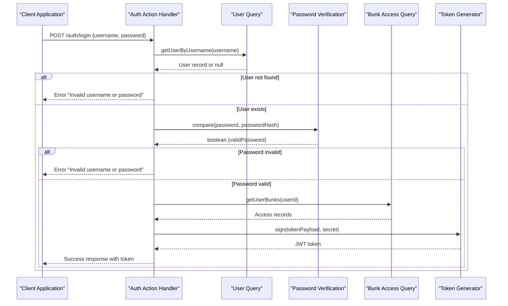
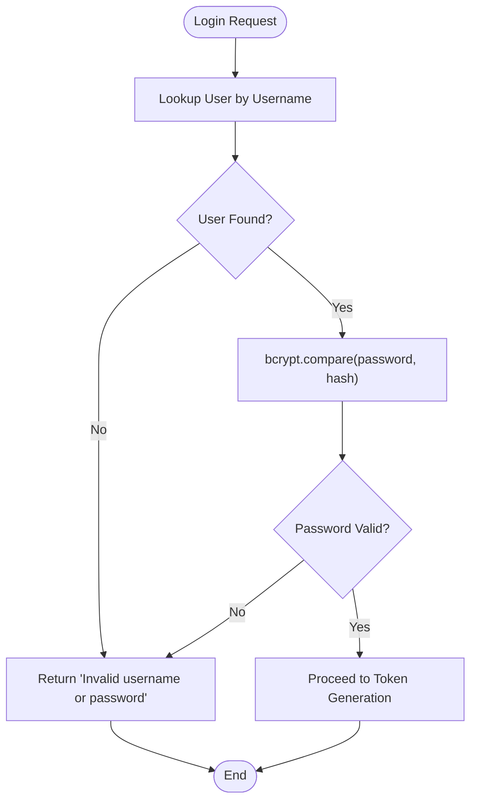
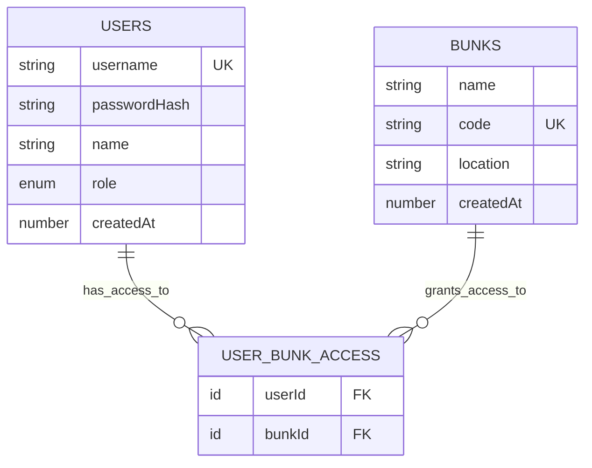
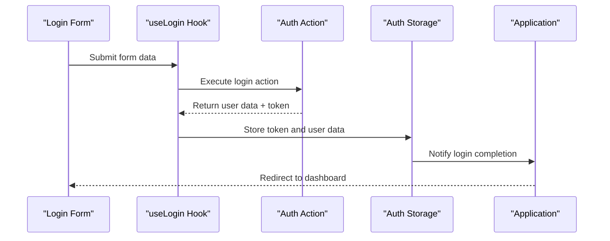

# Login Endpoint

<cite>
**Referenced Files in This Document**
- [auth.ts](file://convex/actions/auth.ts)
- [users.ts](file://convex/queries/users.ts)
- [users.ts](file://convex/mutations/users.ts)
- [schema.ts](file://convex/schema.ts)
- [Login.tsx](file://apps/pages/Login.tsx)
- [convex-api.ts](file://apps/convex-api.ts)
- [types.ts](file://apps/types.ts)
</cite>

## Table of Contents
1. [Introduction](#introduction)
2. [Endpoint Definition](#endpoint-definition)
3. [Request Schema](#request-schema)
4. [Authentication Flow](#authentication-flow)
5. [Successful Response](#successful-response)
6. [Error Responses](#error-responses)
7. [Security Considerations](#security-considerations)
8. [Implementation Details](#implementation-details)
9. [Practical Examples](#practical-examples)
10. [Troubleshooting Guide](#troubleshooting-guide)
11. [Conclusion](#conclusion)

## Introduction

This document provides comprehensive API documentation for the POST /auth/login endpoint, which authenticates users with username/password credentials in the KR-FUELS accounting system. The endpoint implements secure authentication using bcrypt password verification and JWT token generation for session management.

## Endpoint Definition

**POST /auth/login**

The login endpoint accepts username/password credentials and returns an authenticated user session with associated permissions and access controls.

## Request Schema

The login request requires the following JSON payload structure:

| Parameter | Type | Required | Description |
|-----------|------|----------|-------------|
| username | string | Yes | User's unique identifier (case-sensitive) |
| password | string | Yes | Plain text password for authentication |

**Example Request Body:**
```json
{
  "username": "johnsmith007",
  "password": "securePassword123"
}
```

**Section sources**
- [auth.ts](file://convex/actions/auth.ts#L31-L35)

## Authentication Flow

The authentication process follows a secure, multi-step verification procedure:



**Diagram sources**
- [auth.ts](file://convex/actions/auth.ts#L36-L81)
- [users.ts](file://convex/queries/users.ts#L4-L22)

### Step-by-Step Process

1. **User Lookup**: The system queries the users table using the provided username
2. **Credential Validation**: If user exists, compares the provided password with the stored bcrypt hash
3. **Access Control Retrieval**: Fetches all fuel station locations (bunks) the user has access to
4. **Token Generation**: Creates a signed JWT containing user identification and role information
5. **Response Delivery**: Returns comprehensive user data along with the authentication token

**Section sources**
- [auth.ts](file://convex/actions/auth.ts#L36-L81)

## Successful Response

On successful authentication, the endpoint returns a structured JSON object containing user information and session data:

| Field | Type | Description |
|-------|------|-------------|
| id | string | Unique user identifier (Convex document ID) |
| username | string | User's unique username |
| name | string | User's full name |
| role | string | User's role ("admin" or "super_admin") |
| accessibleBunkIds | array[string] | Array of fuel station IDs the user can access |
| token | string | JWT authentication token |
| expiresIn | string | Token expiration duration (default: "24h") |

**Example Success Response:**
```json
{
  "id": "users#1234567890abcdef",
  "username": "johnsmith007",
  "name": "John Smith",
  "role": "admin",
  "accessibleBunkIds": ["bunks#abc123def456", "bunks#ghi789jkl012"],
  "token": "eyJhbGciOiJIUzI1NiIsInR5cCI6IkpXVCJ9...",
  "expiresIn": "24h"
}
```

**Section sources**
- [auth.ts](file://convex/actions/auth.ts#L70-L80)

## Error Responses

The login endpoint returns standardized error responses for authentication failures:

### Invalid Credentials
- **Status**: 400 Bad Request
- **Message**: "Invalid username or password"
- **Cause**: Username not found or password verification failed

### Missing Environment Configuration
- **Status**: 500 Internal Server Error  
- **Message**: "JWT_SECRET environment variable not set"
- **Cause**: Required JWT secret not configured in environment

**Section sources**
- [auth.ts](file://convex/actions/auth.ts#L42-L50)
- [auth.ts](file://convex/actions/auth.ts#L19-L25)

## Security Considerations

### Password Verification
The system implements robust password security using bcrypt with 10 rounds of hashing:



**Diagram sources**
- [auth.ts](file://convex/actions/auth.ts#L46-L50)

### Timing Attack Protection
The bcrypt library automatically handles timing attack prevention through constant-time comparison algorithms, eliminating side-channel vulnerabilities that could reveal password characteristics.

### Token Security
- **Expiration**: 24-hour token lifetime
- **Storage**: JWT tokens stored client-side for session management
- **Validation**: Tokens verified server-side before granting access to protected resources

### Access Control
The system enforces granular access control by:
- Restricting users to specific fuel station locations
- Validating user permissions before allowing data access
- Implementing role-based access control (admin vs super_admin)

**Section sources**
- [auth.ts](file://convex/actions/auth.ts#L16-L25)
- [auth.ts](file://convex/actions/auth.ts#L66-L68)

## Implementation Details

### Database Schema Integration

The authentication system integrates with the following schema components:



**Diagram sources**
- [schema.ts](file://convex/schema.ts#L23-L40)

### Frontend Integration

The React frontend implements the login flow with proper error handling and state management:



**Diagram sources**
- [Login.tsx](file://apps/pages/Login.tsx#L31-L66)
- [convex-api.ts](file://apps/convex-api.ts#L7)

**Section sources**
- [schema.ts](file://convex/schema.ts#L23-L40)
- [Login.tsx](file://apps/pages/Login.tsx#L31-L66)
- [convex-api.ts](file://apps/convex-api.ts#L7)

## Practical Examples

### Successful Login Example

**curl Command:**
```bash
curl -X POST https://your-domain.com/auth/login \
  -H "Content-Type: application/json" \
  -d '{
    "username": "johnsmith007",
    "password": "securePassword123"
  }'
```

**Expected Response:**
```json
{
  "id": "users#1234567890abcdef",
  "username": "johnsmith007",
  "name": "John Smith",
  "role": "admin",
  "accessibleBunkIds": ["bunks#abc123def456", "bunks#ghi789jkl012"],
  "token": "eyJhbGciOiJIUzI1NiIsInR5cCI6IkpXVCJ9...",
  "expiresIn": "24h"
}
```

### Authentication Failure Example

**curl Command:**
```bash
curl -X POST https://your-domain.com/auth/login \
  -H "Content-Type: application/json" \
  -d '{
    "username": "invaliduser",
    "password": "wrongpassword"
  }'
```

**Expected Response:**
```json
{
  "error": "Invalid username or password"
}
```

## Troubleshooting Guide

### Common Issues and Solutions

**Issue**: "Invalid username or password" error
- **Cause**: Incorrect credentials or user doesn't exist
- **Solution**: Verify username and password combination, ensure user account exists

**Issue**: "JWT_SECRET environment variable not set" error  
- **Cause**: Missing JWT secret configuration
- **Solution**: Set JWT_SECRET environment variable with a strong random string

**Issue**: Token validation failures
- **Cause**: Expired tokens or tampered JWT signatures
- **Solution**: Generate new tokens using the refresh endpoint or re-authenticate

**Issue**: Access denied to fuel stations
- **Cause**: User lacks permission for requested station
- **Solution**: Contact administrator to grant appropriate access permissions

**Section sources**
- [auth.ts](file://convex/actions/auth.ts#L19-L25)
- [auth.ts](file://convex/actions/auth.ts#L42-L50)

## Conclusion

The POST /auth/login endpoint provides a secure, comprehensive authentication solution for the KR-FUELS system. It implements industry-standard security practices including bcrypt password hashing, JWT tokenization, and granular access control. The endpoint offers clear error messaging, proper security measures against timing attacks, and seamless integration with the frontend application for a smooth user experience.

The authentication flow ensures that only authorized users with valid credentials can access the system, while maintaining security through proper token management and access control enforcement across fuel station locations.