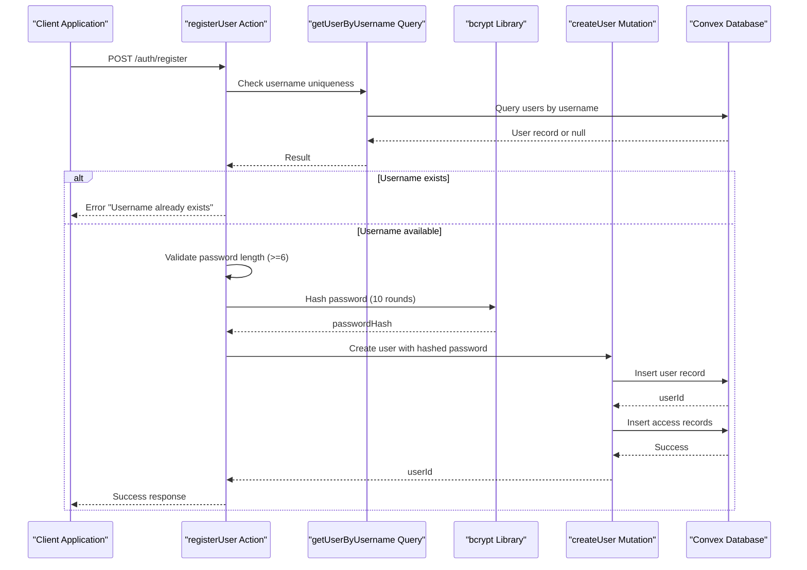
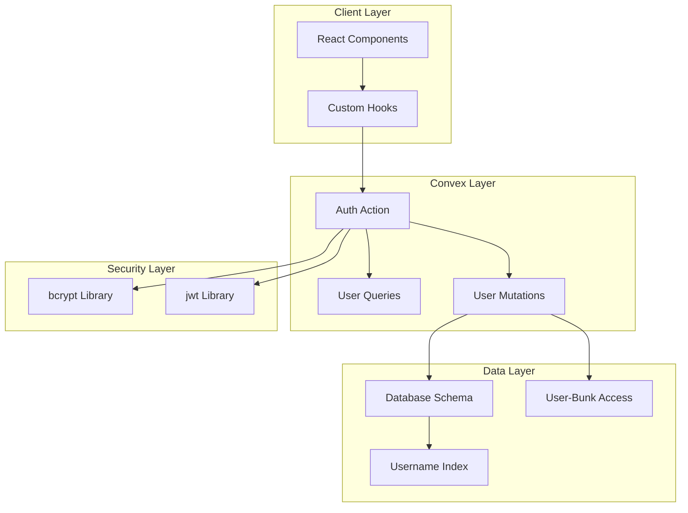

# Register User Endpoint

<cite>
**Referenced Files in This Document**
- [auth.ts](file://convex/actions/auth.ts)
- [users.ts](file://convex/mutations/users.ts)
- [users.ts](file://convex/queries/users.ts)
- [schema.ts](file://convex/schema.ts)
- [Administration.tsx](file://apps/pages/Administration.tsx)
- [convex-api.ts](file://apps/convex-api.ts)
- [package.json](file://convex/package.json)
</cite>

## Table of Contents
1. [Introduction](#introduction)
2. [Endpoint Definition](#endpoint-definition)
3. [Request Schema](#request-schema)
4. [Registration Workflow](#registration-workflow)
5. [Response Specifications](#response-specifications)
6. [Error Responses](#error-responses)
7. [Security Considerations](#security-considerations)
8. [Practical Examples](#practical-examples)
9. [Client-Side Implementation Patterns](#client-side-implementation-patterns)
10. [Architecture Overview](#architecture-overview)
11. [Troubleshooting Guide](#troubleshooting-guide)
12. [Conclusion](#conclusion)

## Introduction
This document provides comprehensive API documentation for the POST /auth/register endpoint used for user registration in the KR-FUELS application. The endpoint enables administrators to create new user accounts with proper validation, secure password hashing, and access control assignment.

## Endpoint Definition
- **Method**: POST
- **Path**: `/auth/register`
- **Purpose**: Create a new user account with specified credentials and permissions
- **Authentication**: Requires administrative privileges
- **Response Format**: JSON

## Request Schema
The registration endpoint accepts the following request parameters:

### Required Fields
| Field | Type | Description | Validation |
|-------|------|-------------|------------|
| username | string | Unique user identifier | Must be unique, trimmed to lowercase |
| password | string | User's password | Minimum 6 characters |
| name | string | Display name for the user | Trimmed for whitespace |
| role | enum | User role assignment | admin or super_admin |
| accessibleBunkIds | array | Array of bunk IDs for access control | Required for admin users |

### Field Details

#### Username Validation
- **Uniqueness**: Enforced through database index on users.username
- **Format**: Lowercase conversion performed during registration
- **Trimming**: Whitespace removed from both ends

#### Password Validation
- **Minimum Length**: 6 characters required
- **Security**: Automatically hashed using bcrypt with 10 rounds
- **Storage**: Plain text password is never stored

#### Role Selection
Available roles:
- `admin`: Limited access to specific fuel stations
- `super_admin`: Full system access across all stations

#### Accessible Bunk IDs
- **Purpose**: Defines which fuel stations an admin user can access
- **Format**: Array of Convex document IDs
- **Requirement**: Mandatory for admin users; optional for super_admin

**Section sources**
- [auth.ts](file://convex/actions/auth.ts#L87-L94)
- [schema.ts](file://convex/schema.ts#L23-L29)

## Registration Workflow
The registration process follows a structured workflow with multiple validation and processing steps:



**Diagram sources**
- [auth.ts](file://convex/actions/auth.ts#L96-L120)
- [users.ts](file://convex/mutations/users.ts#L21-L40)

### Step-by-Step Process

1. **Duplicate Username Check**
   - Queries the database using the unique username index
   - Returns error if username already exists

2. **Password Validation**
   - Validates minimum length requirement (6+ characters)
   - Returns error for insufficient length

3. **Password Hashing**
   - Uses bcrypt with 10 rounds for security
   - Generates cryptographically secure hash

4. **User Creation**
   - Creates user record with trimmed username and name
   - Stores hashed password instead of plain text
   - Assigns specified role

5. **Access Control Assignment**
   - Creates user-bunk access relationships
   - Grants permission to specified fuel stations

**Section sources**
- [auth.ts](file://convex/actions/auth.ts#L96-L120)
- [users.ts](file://convex/mutations/users.ts#L21-L40)

## Response Specifications
Successful registration returns a simplified user object containing essential information:

### Success Response Structure
```json
{
  "id": "users:abc123",
  "username": "john.doe",
  "name": "John Doe",
  "role": "admin"
}
```

### Response Fields
| Field | Type | Description |
|-------|------|-------------|
| id | string | Convex document ID of the newly created user |
| username | string | Lowercase username as registered |
| name | string | Display name as provided |
| role | enum | User role assigned (admin or super_admin) |

### Response Status Codes
- **200 OK**: User created successfully
- **400 Bad Request**: Validation errors or duplicate username
- **500 Internal Server Error**: Database or system errors

**Section sources**
- [auth.ts](file://convex/actions/auth.ts#L122-L127)

## Error Responses
The endpoint handles various error scenarios with specific error messages:

### Common Error Scenarios

#### Duplicate Username
- **Error Message**: "Username already exists"
- **HTTP Status**: 400 Bad Request
- **Cause**: Username already present in database
- **Prevention**: Check username availability before registration

#### Weak Password
- **Error Message**: "Password must be at least 6 characters"
- **HTTP Status**: 400 Bad Request
- **Cause**: Password shorter than 6 characters
- **Prevention**: Enforce minimum length validation

#### Database Errors
- **Error Message**: Varies by specific failure
- **HTTP Status**: 500 Internal Server Error
- **Cause**: Database connectivity or constraint violations

### Error Response Format
```json
{
  "error": "Error message describing the issue"
}
```

**Section sources**
- [auth.ts](file://convex/actions/auth.ts#L101-L108)

## Security Considerations
The registration endpoint implements several security measures:

### Password Security
- **Hashing Algorithm**: bcrypt with 10 rounds
- **Salt Generation**: Automatic salt generation by bcrypt
- **Memory Hardness**: Resistant to brute force attacks
- **Rounds Configuration**: 10 rounds provides balanced security/performance

### Input Sanitization
- **Username Trimming**: Removes leading/trailing whitespace
- **Lowercase Conversion**: Ensures consistent username format
- **Name Trimming**: Removes unnecessary whitespace from display names

### Access Control
- **Role-Based Permissions**: Restricts admin users to specific fuel stations
- **Super Admin Privileges**: Full system access for elevated users
- **Bunk Access Validation**: Ensures requested bunk IDs exist

### Environment Security
- **JWT Secret Management**: Requires JWT_SECRET environment variable
- **Secure Token Storage**: Tokens stored securely in client applications

**Section sources**
- [auth.ts](file://convex/actions/auth.ts#L110-L111)
- [auth.ts](file://convex/actions/auth.ts#L19-L25)
- [package.json](file://convex/package.json#L6-L7)

## Practical Examples

### Basic Registration Example
```bash
curl -X POST https://your-app.convex.cloud/api/auth/register \
  -H "Content-Type: application/json" \
  -d '{
    "username": "john.doe",
    "password": "securePass123",
    "name": "John Doe",
    "role": "admin",
    "accessibleBunkIds": ["bunks:abc123", "bunks:def456"]
  }'
```

### Super Admin Registration
```bash
curl -X POST https://your-app.convex.cloud/api/auth/register \
  -H "Content-Type: application/json" \
  -d '{
    "username": "admin.user",
    "password": "adminPass456",
    "name": "Admin User",
    "role": "super_admin",
    "accessibleBunkIds": []
  }'
```

### Client-Side Implementation Pattern
```javascript
// React Hook Pattern
const useRegisterUser = () => {
  const registerUser = useAction((api.actions.auth as any).registerUser);
  
  const handleRegister = async (userData) => {
    try {
      const result = await registerUser({
        username: userData.username.toLowerCase().trim(),
        password: userData.password,
        name: userData.name.trim(),
        role: userData.role,
        accessibleBunkIds: userData.accessibleBunkIds
      });
      
      // Handle success
      console.log('User created:', result);
      return result;
    } catch (error) {
      // Handle error
      console.error('Registration failed:', error.message);
      throw error;
    }
  };
  
  return handleRegister;
};
```

**Section sources**
- [Administration.tsx](file://apps/pages/Administration.tsx#L67-L83)
- [convex-api.ts](file://apps/convex-api.ts#L8)

## Client-Side Implementation Patterns

### Form Validation Strategy
```typescript
// Frontend validation before API call
const validateUserData = (userData) => {
  const errors = [];
  
  if (!userData.username || userData.username.length < 3) {
    errors.push('Username must be at least 3 characters');
  }
  
  if (!userData.password || userData.password.length < 6) {
    errors.push('Password must be at least 6 characters');
  }
  
  if (!userData.name || userData.name.length < 2) {
    errors.push('Name must be at least 2 characters');
  }
  
  if (userData.role === 'admin' && (!userData.accessibleBunkIds || userData.accessibleBunkIds.length === 0)) {
    errors.push('Admin users must have at least one bunk access');
  }
  
  return errors;
};
```

### State Management Pattern
```typescript
const [newUser, setNewUser] = useState({
  username: '',
  password: '',
  name: '',
  role: 'admin' as 'admin' | 'super_admin',
  accessibleBunkIds: [] as string[]
});

const handleAddUser = async (e: React.FormEvent) => {
  e.preventDefault();
  
  // Client-side validation
  const errors = validateUserData(newUser);
  if (errors.length > 0) {
    alert(errors.join('\n'));
    return;
  }
  
  try {
    await registerUser({
      username: newUser.username.toLowerCase(),
      password: newUser.password,
      name: newUser.name,
      role: newUser.role,
      accessibleBunkIds: newUser.accessibleBunkIds,
    });
    
    // Reset form
    setNewUser({ 
      username: '', 
      password: '', 
      name: '', 
      role: 'admin', 
      accessibleBunkIds: [] 
    });
    
  } catch (err: any) {
    alert('Failed to create user: ' + (err.message || err));
  }
};
```

**Section sources**
- [Administration.tsx](file://apps/pages/Administration.tsx#L26-L30)
- [Administration.tsx](file://apps/pages/Administration.tsx#L67-L83)

## Architecture Overview
The registration endpoint follows a layered architecture pattern:



**Diagram sources**
- [auth.ts](file://convex/actions/auth.ts#L87-L129)
- [users.ts](file://convex/mutations/users.ts#L13-L41)
- [users.ts](file://convex/queries/users.ts#L4-L12)
- [schema.ts](file://convex/schema.ts#L23-L40)

### Component Responsibilities

#### Authentication Action (`registerUser`)
- Validates input parameters
- Checks username uniqueness
- Handles password validation and hashing
- Coordinates user creation and access assignment

#### User Queries
- `getUserByUsername`: Enforces uniqueness constraint
- `getUserBunks`: Retrieves user access permissions

#### User Mutations
- `createUser`: Performs actual database insertion
- `updatePassword`: Updates existing user passwords
- `deleteUser`: Removes user and associated access records

#### Database Schema
- Enforces data integrity constraints
- Provides efficient indexing for username lookups
- Supports many-to-many relationships for access control

**Section sources**
- [auth.ts](file://convex/actions/auth.ts#L87-L129)
- [users.ts](file://convex/mutations/users.ts#L13-L81)
- [users.ts](file://convex/queries/users.ts#L4-L34)
- [schema.ts](file://convex/schema.ts#L23-L40)

## Troubleshooting Guide

### Common Issues and Solutions

#### Username Already Exists
**Symptoms**: Error message "Username already exists"
**Causes**: 
- Username collision with existing user
- Case sensitivity issues
**Solutions**:
- Verify username availability before registration
- Ensure username is unique across the system
- Check for case-insensitive duplicates

#### Password Validation Failures
**Symptoms**: Error message "Password must be at least 6 characters"
**Causes**:
- Password shorter than 6 characters
- Empty password field
**Solutions**:
- Implement client-side validation
- Provide clear password requirements
- Use password strength indicators

#### Access Control Issues
**Symptoms**: Admin user cannot access expected fuel stations
**Causes**:
- Invalid bunk IDs in accessibleBunkIds array
- Missing required bunk IDs for admin users
**Solutions**:
- Validate bunk IDs against existing records
- Ensure admin users have at least one bunk access
- Check bunk existence before assignment

#### Database Connection Problems
**Symptoms**: Registration fails with database errors
**Causes**:
- Network connectivity issues
- Database constraints violation
- Index corruption
**Solutions**:
- Check database connection status
- Verify schema integrity
- Review database logs for specific error details

### Debugging Steps
1. **Network Level**: Verify API endpoint accessibility
2. **Authentication**: Confirm JWT_SECRET environment variable
3. **Database**: Check username uniqueness constraints
4. **Validation**: Test input validation logic
5. **Logging**: Enable detailed error logging

**Section sources**
- [auth.ts](file://convex/actions/auth.ts#L101-L108)
- [auth.ts](file://convex/actions/auth.ts#L19-L25)

## Conclusion
The POST /auth/register endpoint provides a secure and robust mechanism for user registration in the KR-FUELS application. It implements comprehensive validation, secure password handling, and flexible access control mechanisms. The endpoint follows modern security practices while maintaining simplicity for administrative users.

Key strengths include:
- **Security**: bcrypt hashing with configurable rounds, input sanitization
- **Validation**: Comprehensive field validation with clear error messages
- **Flexibility**: Role-based access control with granular permissions
- **Reliability**: Database constraints and transaction support
- **Developer Experience**: Clear API contract and error handling

The implementation demonstrates best practices for user registration in modern web applications, balancing security requirements with usability considerations.