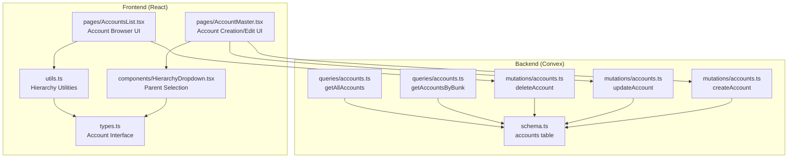
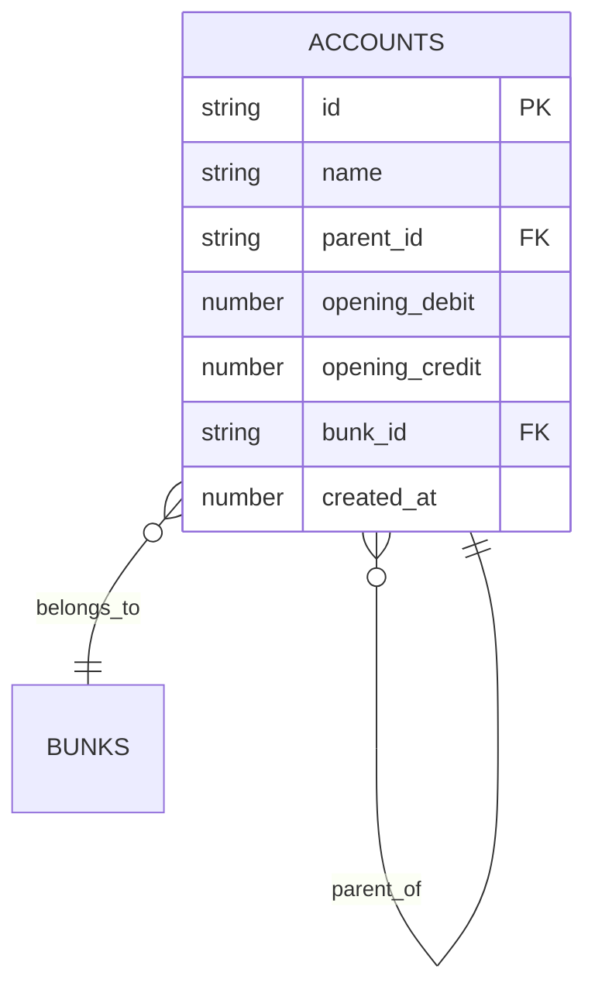
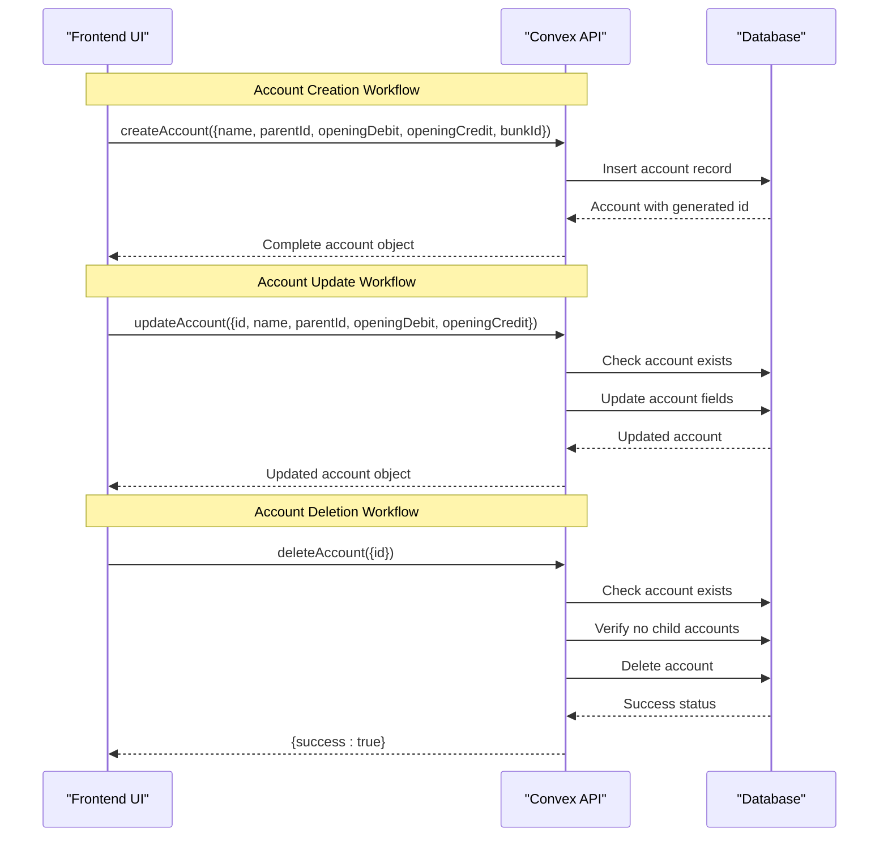
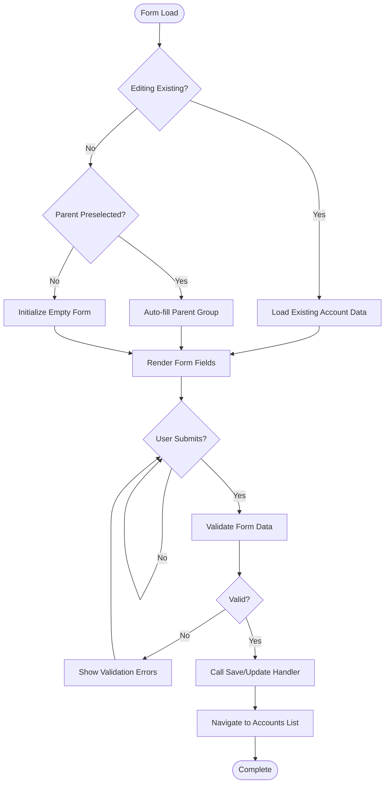
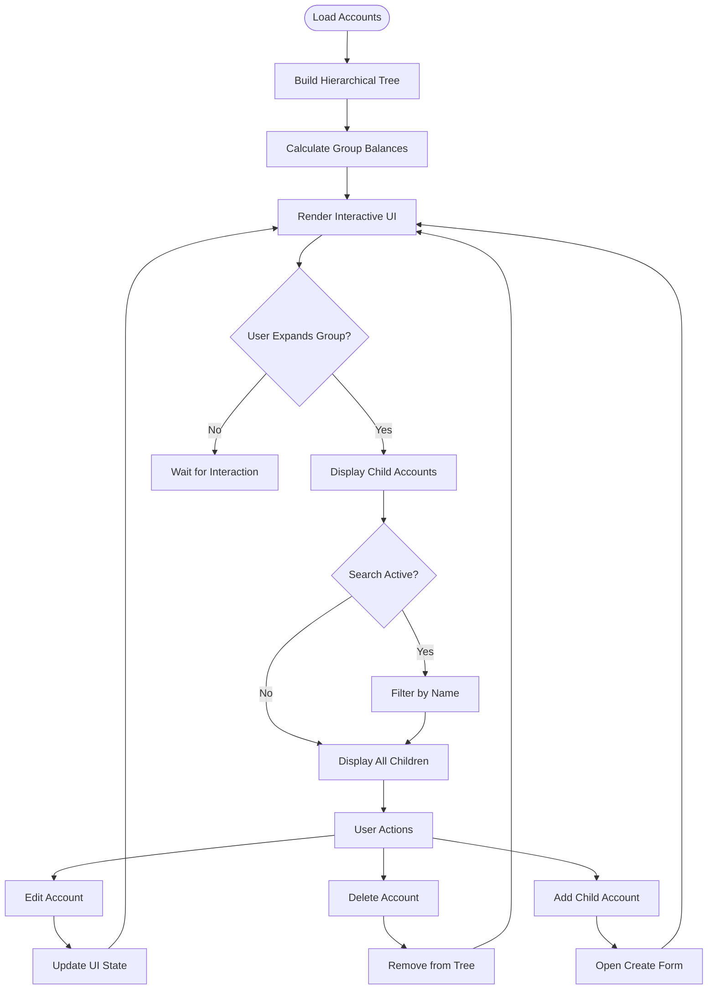
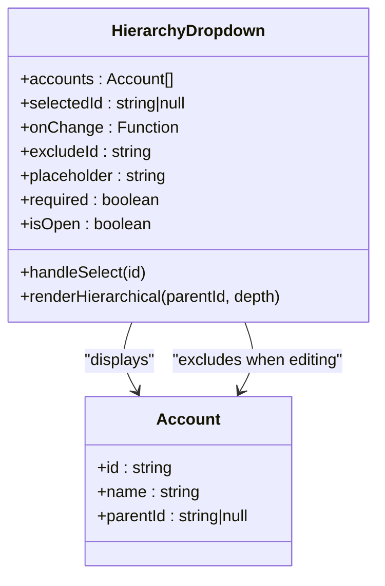
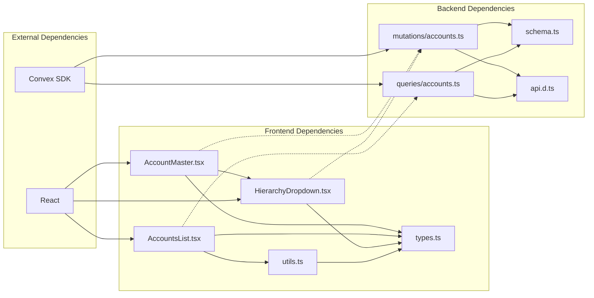

# Account Management API

<cite>
**Referenced Files in This Document**
- [accounts.ts](file://convex/mutations/accounts.ts)
- [accounts.ts](file://convex/queries/accounts.ts)
- [schema.ts](file://convex/schema.ts)
- [api.d.ts](file://convex/_generated/api.d.ts)
- [AccountMaster.tsx](file://apps/pages/AccountMaster.tsx)
- [AccountsList.tsx](file://apps/pages/AccountsList.tsx)
- [HierarchyDropdown.tsx](file://apps/components/HierarchyDropdown.tsx)
- [types.ts](file://apps/types.ts)
- [utils.ts](file://apps/utils.ts)
</cite>

## Table of Contents
1. [Introduction](#introduction)
2. [Project Structure](#project-structure)
3. [Core Components](#core-components)
4. [Architecture Overview](#architecture-overview)
5. [Detailed Component Analysis](#detailed-component-analysis)
6. [Dependency Analysis](#dependency-analysis)
7. [Performance Considerations](#performance-considerations)
8. [Troubleshooting Guide](#troubleshooting-guide)
9. [Conclusion](#conclusion)

## Introduction
This document provides comprehensive API documentation for account management operations in KR-FUELS. It covers the hierarchical chart of accounts system, including account creation, updates, deletions, and queries. The documentation details request/response schemas, parameter validation rules, business logic constraints for parent-child relationships, and practical examples for common workflows.

## Project Structure
The account management functionality spans both the backend Convex functions and the frontend React components:

- Backend (Convex):
  - Mutations: createAccount, updateAccount, deleteAccount
  - Queries: getAccountsByBunk, getAllAccounts
  - Schema: accounts table definition with self-referencing parent relationship
- Frontend (React):
  - AccountMaster page for creating/editing accounts
  - AccountsList page for browsing and managing accounts
  - HierarchyDropdown component for parent selection
  - Utility functions for hierarchy navigation and calculations

**Diagram sources**
- [accounts.ts](file://convex/mutations/accounts.ts#L1-L63)
- [accounts.ts](file://convex/queries/accounts.ts#L1-L19)
- [schema.ts](file://convex/schema.ts#L43-L54)
- [AccountMaster.tsx](file://apps/pages/AccountMaster.tsx#L1-L228)
- [AccountsList.tsx](file://apps/pages/AccountsList.tsx#L1-L254)
- [HierarchyDropdown.tsx](file://apps/components/HierarchyDropdown.tsx#L1-L138)
- [utils.ts](file://apps/utils.ts#L1-L69)
- [types.ts](file://apps/types.ts#L17-L25)

**Section sources**
- [accounts.ts](file://convex/mutations/accounts.ts#L1-L63)
- [accounts.ts](file://convex/queries/accounts.ts#L1-L19)
- [schema.ts](file://convex/schema.ts#L43-L54)
- [AccountMaster.tsx](file://apps/pages/AccountMaster.tsx#L1-L228)
- [AccountsList.tsx](file://apps/pages/AccountsList.tsx#L1-L254)
- [HierarchyDropdown.tsx](file://apps/components/HierarchyDropdown.tsx#L1-L138)
- [utils.ts](file://apps/utils.ts#L1-L69)
- [types.ts](file://apps/types.ts#L17-L25)

## Core Components

### Account Data Model
The accounts table defines a hierarchical chart of accounts with self-referencing parent-child relationships:

**Diagram sources**
- [schema.ts](file://convex/schema.ts#L45-L52)

Key characteristics:
- Self-referencing foreign key (parentId) enables unlimited nesting levels
- Indexes on bunkId and parentId for efficient queries
- Opening balances stored separately for historical tracking
- Bunk association for multi-location support

**Section sources**
- [schema.ts](file://convex/schema.ts#L45-L52)
- [types.ts](file://apps/types.ts#L17-L25)

### Mutation Functions

#### createAccount
Creates a new account with validation and persistence.

**Request Parameters:**
- name: string (required)
- parentId: string (optional, must reference existing account)
- openingDebit: number (required)
- openingCredit: number (required)
- bunkId: string (required, must reference existing bunk)

**Response:** Full account object with generated id and timestamps

**Validation Rules:**
- Name must be non-empty string
- ParentId must reference existing account if provided
- openingDebit and openingCredit must be numeric
- bunkId must reference existing bunk location

**Section sources**
- [accounts.ts](file://convex/mutations/accounts.ts#L4-L22)

#### updateAccount
Updates existing account properties with validation.

**Request Parameters:**
- id: string (required, account identifier)
- name: string (required)
- parentId: string (optional, must reference existing account)
- openingDebit: number (required)
- openingCredit: number (required)

**Response:** Updated account object

**Validation Rules:**
- Account must exist (throws "Account not found" if missing)
- All validation rules from createAccount apply

**Section sources**
- [accounts.ts](file://convex/mutations/accounts.ts#L24-L43)

#### deleteAccount
Deletes an account with cascade protection.

**Request Parameters:**
- id: string (required)

**Response:** { success: true }

**Constraints:**
- Account must exist (throws "Account not found" if missing)
- Cannot delete account if child accounts exist
- Returns success status upon successful deletion

**Section sources**
- [accounts.ts](file://convex/mutations/accounts.ts#L45-L61)

### Query Functions

#### getAccountsByBunk
Retrieves all accounts for a specific bunk location.

**Request Parameters:**
- bunkId: string (required)

**Response:** Array of account objects

**Section sources**
- [accounts.ts](file://convex/queries/accounts.ts#L4-L12)

#### getAllAccounts
Retrieves all accounts across all locations.

**Request Parameters:** None

**Response:** Array of all account objects

**Section sources**
- [accounts.ts](file://convex/queries/accounts.ts#L14-L18)

## Architecture Overview

**Diagram sources**
- [accounts.ts](file://convex/mutations/accounts.ts#L12-L61)
- [accounts.ts](file://convex/queries/accounts.ts#L4-L18)

## Detailed Component Analysis

### Frontend Account Management Components

#### AccountMaster Page
The primary interface for creating and editing accounts:

**Diagram sources**
- [AccountMaster.tsx](file://apps/pages/AccountMaster.tsx#L31-L56)

Key features:
- Dynamic form generation based on edit/create mode
- Auto-selection of parent account via URL parameters
- Real-time validation feedback
- Group creation modal for new parent accounts

**Section sources**
- [AccountMaster.tsx](file://apps/pages/AccountMaster.tsx#L1-L228)

#### AccountsList Page
Hierarchical account browser with balance calculations:

**Diagram sources**
- [AccountsList.tsx](file://apps/pages/AccountsList.tsx#L39-L127)

**Section sources**
- [AccountsList.tsx](file://apps/pages/AccountsList.tsx#L1-L254)

#### HierarchyDropdown Component
Self-referencing parent selection with exclusion logic:

**Diagram sources**
- [HierarchyDropdown.tsx](file://apps/components/HierarchyDropdown.tsx#L6-L44)

**Section sources**
- [HierarchyDropdown.tsx](file://apps/components/HierarchyDropdown.tsx#L1-L138)

### Business Logic Constraints

#### Parent-Child Relationship Rules
The system enforces strict hierarchy constraints:

1. **Self-Referencing Validation**: parentId must reference existing account
2. **Circular Reference Prevention**: Excludes current account from selection during edits
3. **Cascade Protection**: Prevents deletion of accounts with child accounts
4. **Hierarchical Integrity**: Maintains tree structure consistency

#### Balance Calculation Logic
Opening balances are calculated as:
- Balance = openingDebit - openingCredit
- Positive values indicate debit balances (asset-like)
- Negative values indicate credit balances (liability-like)

**Section sources**
- [AccountsList.tsx](file://apps/pages/AccountsList.tsx#L41-L51)
- [utils.ts](file://apps/utils.ts#L27-L64)

## Dependency Analysis

**Diagram sources**
- [AccountMaster.tsx](file://apps/pages/AccountMaster.tsx#L1-L228)
- [AccountsList.tsx](file://apps/pages/AccountsList.tsx#L1-L254)
- [HierarchyDropdown.tsx](file://apps/components/HierarchyDropdown.tsx#L1-L138)
- [accounts.ts](file://convex/mutations/accounts.ts#L1-L63)
- [accounts.ts](file://convex/queries/accounts.ts#L1-L19)
- [schema.ts](file://convex/schema.ts#L1-L85)
- [api.d.ts](file://convex/_generated/api.d.ts#L1-L76)

**Section sources**
- [api.d.ts](file://convex/_generated/api.d.ts#L32-L47)
- [schema.ts](file://convex/schema.ts#L43-L54)

## Performance Considerations

### Query Optimization
- **Index Usage**: Accounts table has indexes on bunkId and parentId for efficient filtering
- **Collection Queries**: getAllAccounts uses full table scan, suitable for moderate data volumes
- **Hierarchical Traversal**: Frontend JavaScript handles tree building, O(n log n) complexity

### Memory Management
- **Lazy Loading**: Account lists expand only when user interacts with groups
- **State Management**: React memoization prevents unnecessary re-renders
- **Search Filtering**: Client-side filtering reduces server load

### Scalability Guidelines
- Consider pagination for large account hierarchies
- Implement server-side hierarchical queries for deep nesting
- Add caching layer for frequently accessed account trees

## Troubleshooting Guide

### Common Error Scenarios

#### Account Not Found
**Symptoms:** "Account not found" error on update/delete operations
**Causes:**
- Attempting to modify non-existent account
- Data synchronization delays
- Incorrect account ID passed

**Solutions:**
- Verify account exists before operations
- Refresh account list after creation
- Check for ID format consistency

#### Hierarchy Violations
**Symptoms:** "Cannot delete account with sub-accounts" error
**Causes:**
- Attempting to delete parent account with child accounts
- Circular reference attempts
- Invalid parent assignment

**Solutions:**
- Delete child accounts first
- Reassign child accounts to different parents
- Validate parent-child relationships before assignment

#### Validation Failures
**Symptoms:** Parameter validation errors during account creation
**Common Issues:**
- Missing required fields (name, openingDebit, openingCredit, bunkId)
- Invalid numeric values
- Non-existent bunk or parent account IDs

**Prevention:**
- Implement client-side validation
- Use dropdown selectors for bunk and parent accounts
- Validate input formats before submission

### Debugging Strategies

#### Frontend Debugging
- Enable React DevTools to inspect component state
- Monitor network requests in browser developer tools
- Check console for validation error messages

#### Backend Debugging
- Review Convex logs for mutation execution
- Verify database constraints and indexes
- Test individual mutations in isolation

**Section sources**
- [accounts.ts](file://convex/mutations/accounts.ts#L34-L56)
- [AccountsList.tsx](file://apps/pages/AccountsList.tsx#L53-L62)

## Conclusion

The KR-FUELS account management system provides a robust foundation for hierarchical chart of accounts with strong validation and constraint enforcement. The implementation balances simplicity with flexibility, supporting complex organizational structures while maintaining data integrity.

Key strengths include:
- Clear separation between frontend UI and backend data operations
- Comprehensive validation at both client and server levels
- Intuitive hierarchical navigation and management
- Flexible balance calculation supporting various accounting needs

Areas for potential enhancement:
- Server-side hierarchical queries for improved performance
- Advanced search and filtering capabilities
- Audit trail for account modifications
- Bulk operations for account management

The documented APIs and workflows provide a solid foundation for extending the system with additional features while maintaining consistency with the existing architecture.