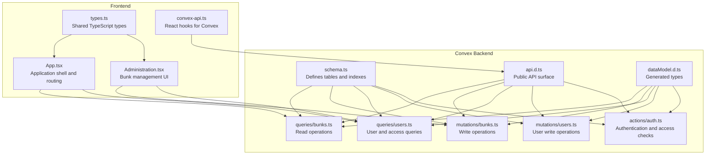
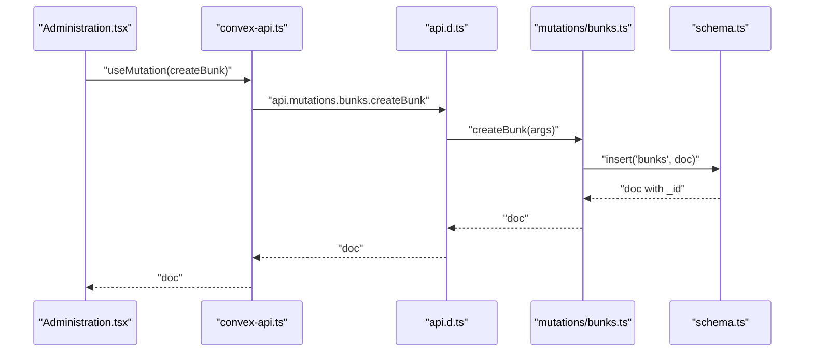
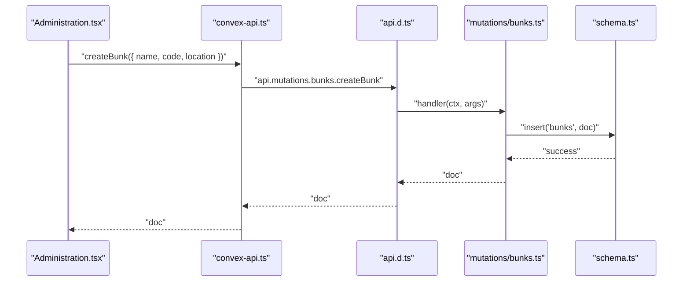
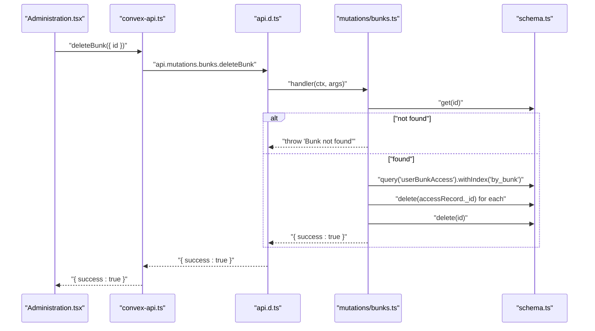
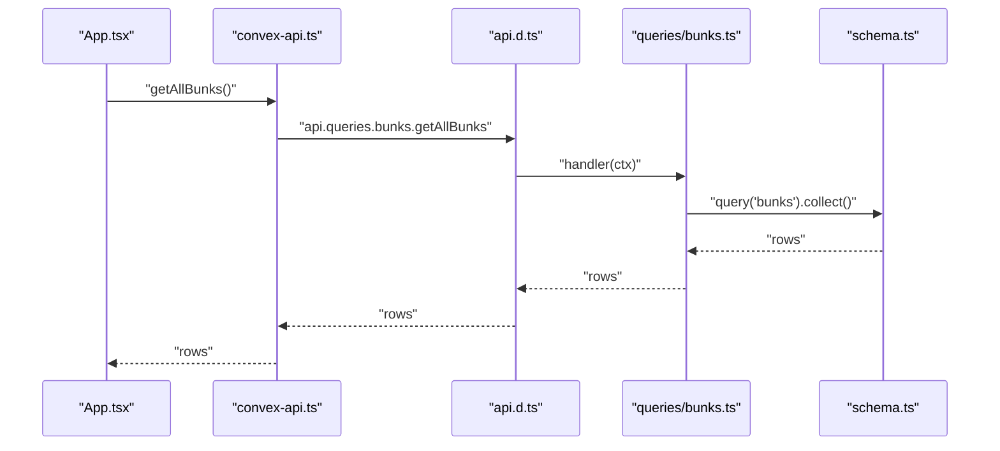
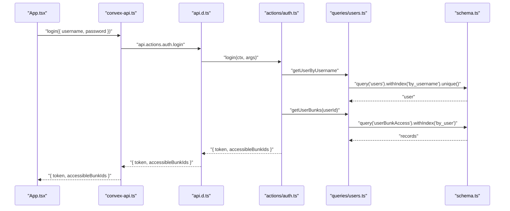
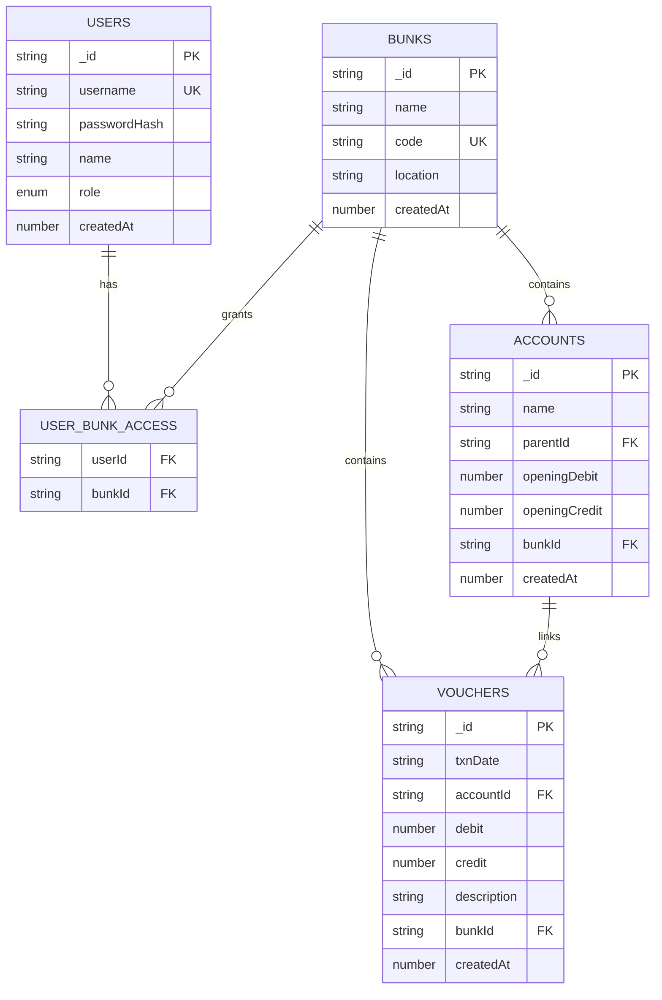
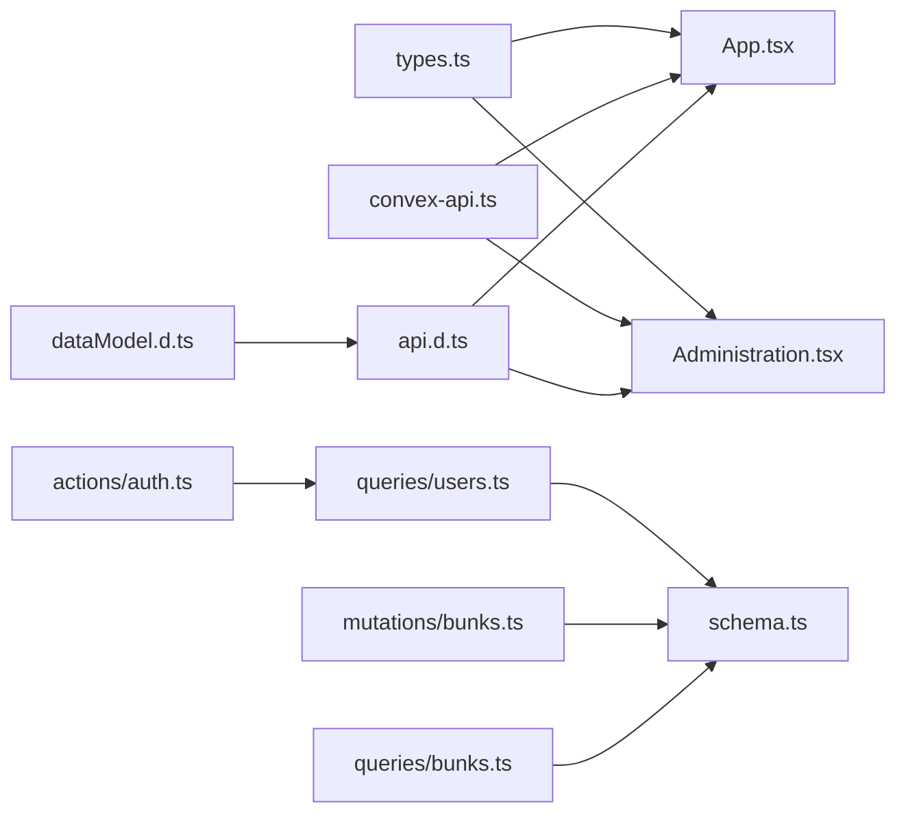

# Bunk Management API

<cite>
**Referenced Files in This Document**
- [schema.ts](file://convex/schema.ts)
- [bunks.ts](file://convex/mutations/bunks.ts)
- [bunks.ts](file://convex/queries/bunks.ts)
- [users.ts](file://convex/queries/users.ts)
- [users.ts](file://convex/mutations/users.ts)
- [auth.ts](file://convex/actions/auth.ts)
- [api.d.ts](file://convex/_generated/api.d.ts)
- [dataModel.d.ts](file://convex/_generated/dataModel.d.ts)
- [Administration.tsx](file://apps/pages/Administration.tsx)
- [App.tsx](file://apps/App.tsx)
- [types.ts](file://apps/types.ts)
- [convex-api.ts](file://apps/convex-api.ts)
</cite>

## Table of Contents
1. [Introduction](#introduction)
2. [Project Structure](#project-structure)
3. [Core Components](#core-components)
4. [Architecture Overview](#architecture-overview)
5. [Detailed Component Analysis](#detailed-component-analysis)
6. [Dependency Analysis](#dependency-analysis)
7. [Performance Considerations](#performance-considerations)
8. [Troubleshooting Guide](#troubleshooting-guide)
9. [Conclusion](#conclusion)
10. [Appendices](#appendices)

## Introduction
This document provides comprehensive API documentation for multi-location fuel station management operations focused on bunk (location) lifecycle management. It covers:
- Creating new bunks with unique identifiers and location details
- Deleting bunks and cascading access removal
- Querying bunks for administrative and operational views
- Multi-location data segregation via user-to-bunk access controls
- Practical examples for new location setup, configuration, and cross-location reporting
- Validation rules, error handling, and access control enforcement

Note: The current backend schema does not include explicit operational status fields for bunks. Reporting across locations is supported by aggregating data filtered by bunk identifiers.

## Project Structure
The system is organized into:
- Convex backend (schema, queries, mutations, actions)
- Frontend React application (pages, hooks, types, and API bindings)

**Diagram sources**
- [schema.ts](file://convex/schema.ts#L9-L84)
- [bunks.ts](file://convex/queries/bunks.ts#L11-L15)
- [bunks.ts](file://convex/mutations/bunks.ts#L4-L36)
- [users.ts](file://convex/queries/users.ts#L4-L34)
- [users.ts](file://convex/mutations/users.ts#L13-L80)
- [auth.ts](file://convex/actions/auth.ts#L31-L81)
- [api.d.ts](file://convex/_generated/api.d.ts#L85-L166)
- [dataModel.d.ts](file://convex/_generated/dataModel.d.ts#L30-L60)
- [App.tsx](file://apps/App.tsx#L22-L149)
- [Administration.tsx](file://apps/pages/Administration.tsx#L36-L65)
- [types.ts](file://apps/types.ts#L2-L7)
- [convex-api.ts](file://apps/convex-api.ts#L1-L35)

**Section sources**
- [schema.ts](file://convex/schema.ts#L9-L84)
- [api.d.ts](file://convex/_generated/api.d.ts#L85-L166)
- [dataModel.d.ts](file://convex/_generated/dataModel.d.ts#L30-L60)
- [App.tsx](file://apps/App.tsx#L22-L149)
- [Administration.tsx](file://apps/pages/Administration.tsx#L36-L65)
- [types.ts](file://apps/types.ts#L2-L7)
- [convex-api.ts](file://apps/convex-api.ts#L1-L35)

## Core Components
- Bunks table: stores fuel station locations with unique station codes and timestamps.
- Users table: stores admin/super-admin credentials and roles.
- User-Bunk Access junction: enforces multi-location data segregation and access control.
- Authentication actions: JWT-based login, registration, and token verification.
- Bunk mutations: create and delete bunks.
- Bunk queries: fetch all bunks for administrative views.

Key validation and constraints:
- Unique station code enforced by a database index.
- Access control enforced via user-bunk access records.
- No operational status field currently exists in the schema.

**Section sources**
- [schema.ts](file://convex/schema.ts#L13-L18)
- [schema.ts](file://convex/schema.ts#L34-L40)
- [users.ts](file://convex/queries/users.ts#L14-L22)
- [auth.ts](file://convex/actions/auth.ts#L31-L81)
- [bunks.ts](file://convex/mutations/bunks.ts#L4-L36)
- [bunks.ts](file://convex/queries/bunks.ts#L11-L15)

## Architecture Overview
The API follows a client-driven pattern using Convex’s generated public API. Frontend components call Convex actions and queries through React hooks. Authentication ensures users only access permitted bunks.

**Diagram sources**
- [Administration.tsx](file://apps/pages/Administration.tsx#L36-L56)
- [convex-api.ts](file://apps/convex-api.ts#L1-L11)
- [api.d.ts](file://convex/_generated/api.d.ts#L85-L91)
- [bunks.ts](file://convex/mutations/bunks.ts#L4-L18)
- [schema.ts](file://convex/schema.ts#L13-L18)

## Detailed Component Analysis

### Bunk Creation API
Purpose: Create a new fuel station location with a unique station code and location details.

- Endpoint: Public mutation
- Path: api.mutations.bunks.createBunk
- Request arguments:
  - name: string (required)
  - code: string (required, unique)
  - location: string (optional)
- Response: Full document including generated identifier and timestamp
- Validation rules:
  - Unique station code enforced by database index
  - Arguments validated by Convex runtime
- Error handling:
  - Throws on invalid inputs (handled by Convex)
  - No explicit duplicate code handling in mutation; rely on database constraint

**Diagram sources**
- [Administration.tsx](file://apps/pages/Administration.tsx#L42-L56)
- [convex-api.ts](file://apps/convex-api.ts#L1-L11)
- [api.d.ts](file://convex/_generated/api.d.ts#L85-L91)
- [bunks.ts](file://convex/mutations/bunks.ts#L4-L18)
- [schema.ts](file://convex/schema.ts#L13-L18)

**Section sources**
- [bunks.ts](file://convex/mutations/bunks.ts#L4-L18)
- [Administration.tsx](file://apps/pages/Administration.tsx#L42-L56)
- [convex-api.ts](file://apps/convex-api.ts#L1-L11)
- [api.d.ts](file://convex/_generated/api.d.ts#L85-L91)

### Bunk Deletion API
Purpose: Delete a bunk and cascade removal of associated user access records.

- Endpoint: Public mutation
- Path: api.mutations.bunks.deleteBunk
- Request arguments:
  - id: Id<"bunks"> (required)
- Response: { success: true }
- Behavior:
  - Fetches the bunk; throws if not found
  - Removes all user-bunk access records for the bunk
  - Deletes the bunk
- Error handling:
  - Throws "Bunk not found" if id is invalid

**Diagram sources**
- [Administration.tsx](file://apps/pages/Administration.tsx#L58-L65)
- [convex-api.ts](file://apps/convex-api.ts#L1-L11)
- [api.d.ts](file://convex/_generated/api.d.ts#L85-L91)
- [bunks.ts](file://convex/mutations/bunks.ts#L20-L36)
- [schema.ts](file://convex/schema.ts#L34-L40)

**Section sources**
- [bunks.ts](file://convex/mutations/bunks.ts#L20-L36)
- [Administration.tsx](file://apps/pages/Administration.tsx#L58-L65)
- [convex-api.ts](file://apps/convex-api.ts#L1-L11)
- [api.d.ts](file://convex/_generated/api.d.ts#L85-L91)

### Bunk Query API
Purpose: Retrieve all bunks for administrative listings.

- Endpoint: Public query
- Path: api.queries.bunks.getAllBunks
- Request arguments: none
- Response: Array of bunks
- Notes:
  - No filtering by location or operational status is implemented
  - Use frontend filtering or extend with additional query parameters

**Diagram sources**
- [App.tsx](file://apps/App.tsx#L22-L28)
- [convex-api.ts](file://apps/convex-api.ts#L1-L11)
- [api.d.ts](file://convex/_generated/api.d.ts#L148-L149)
- [bunks.ts](file://convex/queries/bunks.ts#L11-L15)
- [schema.ts](file://convex/schema.ts#L13-L18)

**Section sources**
- [bunks.ts](file://convex/queries/bunks.ts#L11-L15)
- [App.tsx](file://apps/App.tsx#L22-L28)
- [convex-api.ts](file://apps/convex-api.ts#L1-L11)
- [api.d.ts](file://convex/_generated/api.d.ts#L148-L149)

### Authentication and Access Control
Purpose: Authenticate users, enforce role-based access, and limit data visibility to permitted bunks.

- Login:
  - Endpoint: actions.auth.login
  - Returns JWT token and accessible bunk IDs
- Registration:
  - Endpoint: actions.auth.registerUser
  - Validates password length and prevents duplicate usernames
- Access enforcement:
  - Users with role "super_admin" can access all bunks
  - Regular admins are restricted to assigned bunks via user-bunk access records

**Diagram sources**
- [App.tsx](file://apps/App.tsx#L39-L54)
- [convex-api.ts](file://apps/convex-api.ts#L7-L11)
- [api.d.ts](file://convex/_generated/api.d.ts#L10-L11)
- [auth.ts](file://convex/actions/auth.ts#L31-L81)
- [users.ts](file://convex/queries/users.ts#L4-L22)
- [schema.ts](file://convex/schema.ts#L23-L29)
- [schema.ts](file://convex/schema.ts#L34-L40)

**Section sources**
- [auth.ts](file://convex/actions/auth.ts#L31-L81)
- [users.ts](file://convex/queries/users.ts#L4-L22)
- [App.tsx](file://apps/App.tsx#L39-L54)
- [convex-api.ts](file://apps/convex-api.ts#L7-L11)
- [api.d.ts](file://convex/_generated/api.d.ts#L10-L11)

### Data Model and Relationships

**Diagram sources**
- [schema.ts](file://convex/schema.ts#L13-L18)
- [schema.ts](file://convex/schema.ts#L23-L29)
- [schema.ts](file://convex/schema.ts#L34-L40)
- [schema.ts](file://convex/schema.ts#L45-L54)
- [schema.ts](file://convex/schema.ts#L59-L69)

**Section sources**
- [schema.ts](file://convex/schema.ts#L13-L18)
- [schema.ts](file://convex/schema.ts#L23-L29)
- [schema.ts](file://convex/schema.ts#L34-L40)
- [schema.ts](file://convex/schema.ts#L45-L54)
- [schema.ts](file://convex/schema.ts#L59-L69)

## Dependency Analysis
- Frontend depends on generated API types and hooks to call backend functions.
- Authentication actions depend on user queries to compute accessible bunks.
- Bunk mutations depend on database tables and indexes defined in the schema.
- Access control is enforced at runtime via user-bunk access records.

**Diagram sources**
- [types.ts](file://apps/types.ts#L2-L7)
- [App.tsx](file://apps/App.tsx#L22-L28)
- [Administration.tsx](file://apps/pages/Administration.tsx#L36-L65)
- [convex-api.ts](file://apps/convex-api.ts#L1-L11)
- [api.d.ts](file://convex/_generated/api.d.ts#L85-L166)
- [dataModel.d.ts](file://convex/_generated/dataModel.d.ts#L30-L60)
- [auth.ts](file://convex/actions/auth.ts#L31-L81)
- [users.ts](file://convex/queries/users.ts#L4-L22)
- [schema.ts](file://convex/schema.ts#L13-L18)
- [bunks.ts](file://convex/mutations/bunks.ts#L4-L36)
- [bunks.ts](file://convex/queries/bunks.ts#L11-L15)

**Section sources**
- [convex-api.ts](file://apps/convex-api.ts#L1-L11)
- [api.d.ts](file://convex/_generated/api.d.ts#L85-L166)
- [dataModel.d.ts](file://convex/_generated/dataModel.d.ts#L30-L60)
- [auth.ts](file://convex/actions/auth.ts#L31-L81)
- [users.ts](file://convex/queries/users.ts#L4-L22)
- [schema.ts](file://convex/schema.ts#L13-L18)
- [bunks.ts](file://convex/mutations/bunks.ts#L4-L36)
- [bunks.ts](file://convex/queries/bunks.ts#L11-L15)

## Performance Considerations
- Index usage:
  - bunks.by_code: supports fast lookup by station code during creation and validation
  - users.by_username: supports fast user lookup during login
  - userBunkAccess.by_user and by_bunk: support efficient access checks and cascading deletions
- Query patterns:
  - getAllBunks collects all rows; consider pagination or filtering if the dataset grows
  - getUserBunks returns access records per user; keep lists small by limiting assignments
- Token lifetime:
  - JWT expiry is configured at 24 hours; ensure clients refresh tokens proactively

[No sources needed since this section provides general guidance]

## Troubleshooting Guide
Common issues and resolutions:
- Duplicate station code:
  - Symptom: Failure when creating a bunk with an existing code
  - Cause: Unique index constraint on code
  - Resolution: Ensure station code is unique before creation
- Bunk not found on deletion:
  - Symptom: Error message indicating bunk not found
  - Cause: Invalid bunk ID passed to delete mutation
  - Resolution: Validate ID before calling delete
- Access violation:
  - Symptom: User cannot view or modify data for a specific bunk
  - Cause: Missing user-bunk access assignment
  - Resolution: Assign bunk access to the user via registration or updates
- Cross-location data exposure:
  - Symptom: Data from other locations appears
  - Cause: Missing filter by bunkId in queries
  - Resolution: Always filter by bunkId; leverage user-accessible bunk IDs for visibility

**Section sources**
- [bunks.ts](file://convex/mutations/bunks.ts#L20-L36)
- [users.ts](file://convex/queries/users.ts#L14-L22)
- [auth.ts](file://convex/actions/auth.ts#L31-L81)

## Conclusion
The Bunk Management API provides a solid foundation for multi-location fuel station operations with strong data segregation through user-bunk access controls. While operational status fields are not present in the current schema, the system supports robust creation, deletion, and querying of bunks, along with secure authentication and access enforcement. Extending the schema to include operational status and adding query filters will further enhance reporting and operational workflows.

[No sources needed since this section summarizes without analyzing specific files]

## Appendices

### Request/Response Schemas

- Create Bunk
  - Request: { name: string, code: string, location: string }
  - Response: Bunk document with generated identifier and timestamp
  - Validation: Unique station code enforced by database index

- Delete Bunk
  - Request: { id: string }
  - Response: { success: true }
  - Side effects: Cascades removal of user-bunk access records

- Get All Bunks
  - Request: none
  - Response: Array of Bunk documents

- Login
  - Request: { username: string, password: string }
  - Response: { id, username, name, role, accessibleBunkIds, token, expiresIn }

- Register User
  - Request: { username: string, password: string, name: string, role: "admin"|"super_admin", accessibleBunkIds: string[] }
  - Response: { id, username, name, role }

**Section sources**
- [bunks.ts](file://convex/mutations/bunks.ts#L4-L36)
- [bunks.ts](file://convex/queries/bunks.ts#L11-L15)
- [auth.ts](file://convex/actions/auth.ts#L31-L129)
- [users.ts](file://convex/mutations/users.ts#L13-L41)

### Business Logic Examples

- New Location Setup Workflow
  - Steps:
    1. Admin logs in with sufficient privileges
    2. Navigate to Administration page
    3. Fill station name, code, and location
    4. Submit form to create bunk
    5. Assign bunk access to branch admins as needed
  - UI references:
    - Form submission and mutation call
    - Access assignment for admins

- Location Configuration Scenarios
  - Assign multiple bunks to an admin
  - Restrict a user to a single bunk
  - Super admin can access all bunks

- Cross-Location Reporting Patterns
  - Aggregate accounts and vouchers per bunk
  - Filter by bunkId to isolate data
  - Combine with user-accessible bunk IDs for visibility

**Section sources**
- [Administration.tsx](file://apps/pages/Administration.tsx#L42-L65)
- [Administration.tsx](file://apps/pages/Administration.tsx#L320-L362)
- [App.tsx](file://apps/App.tsx#L82-L100)
- [users.ts](file://convex/queries/users.ts#L14-L22)