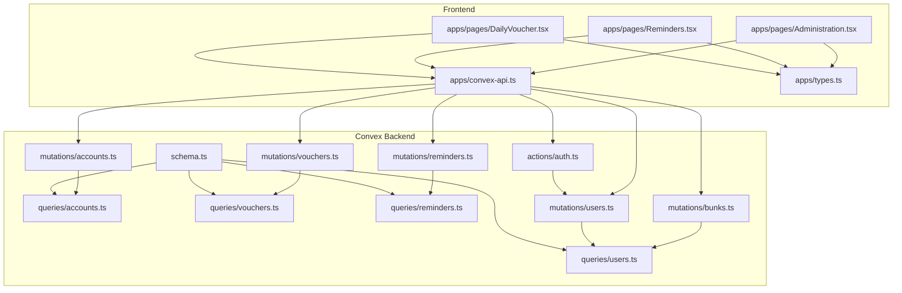
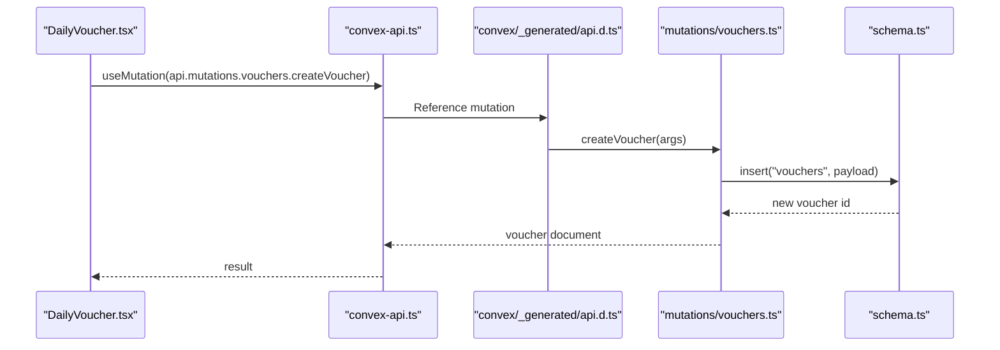
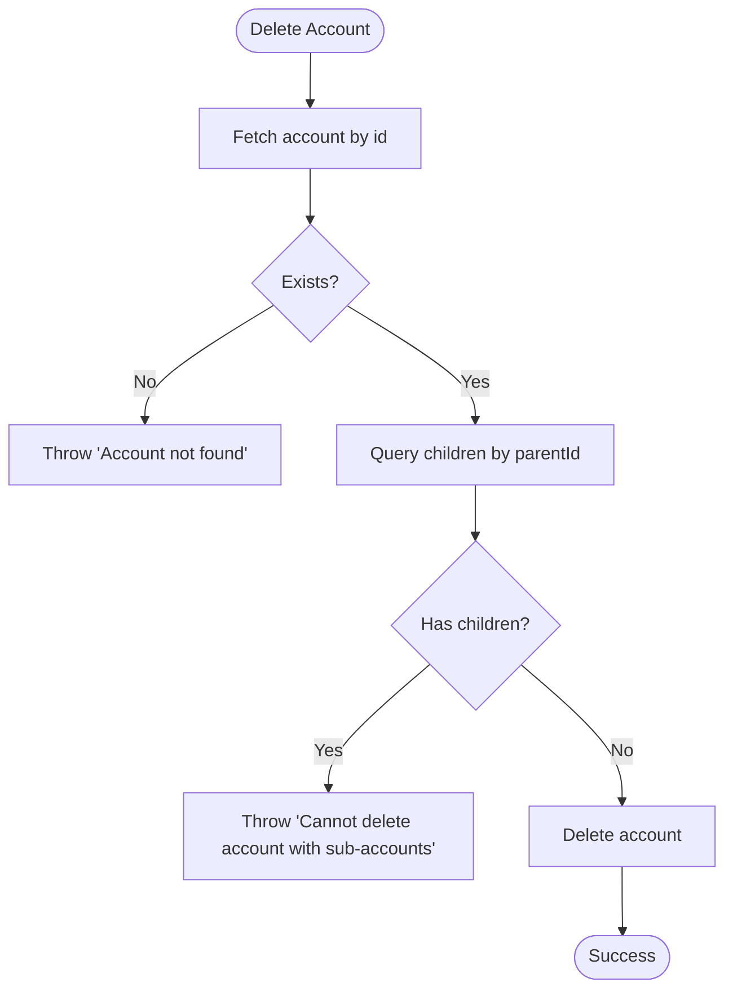
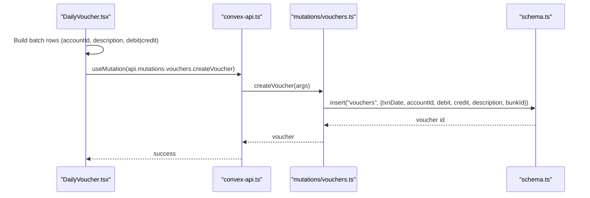
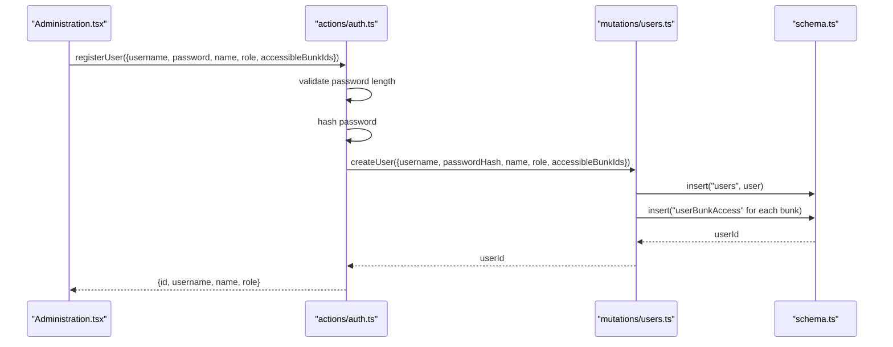
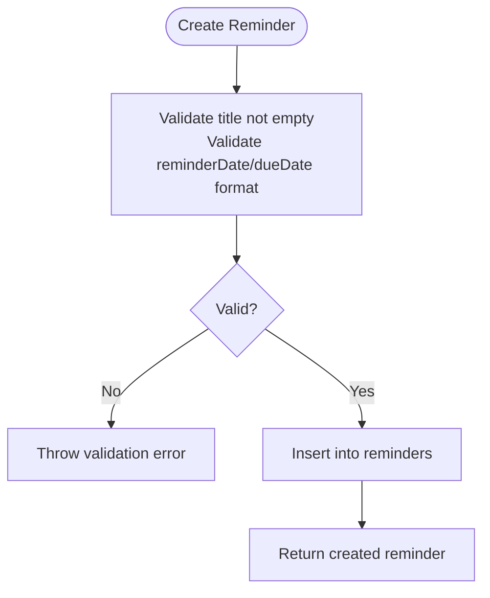
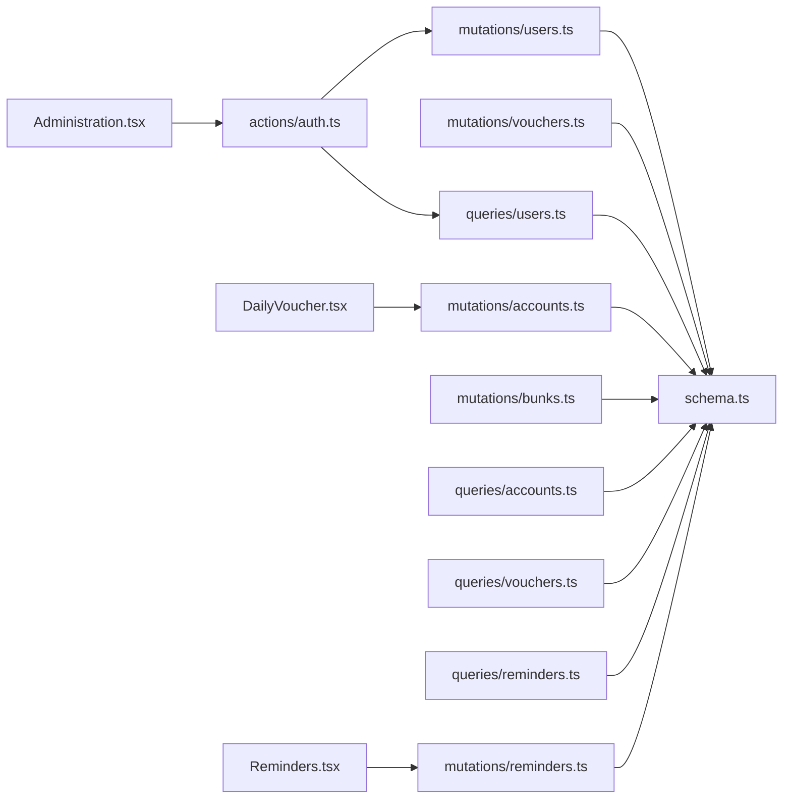

# Data Management API

<cite>
**Referenced Files in This Document**
- [schema.ts](file://convex/schema.ts)
- [accounts.ts](file://convex/mutations/accounts.ts)
- [vouchers.ts](file://convex/mutations/vouchers.ts)
- [users.ts](file://convex/mutations/users.ts)
- [reminders.ts](file://convex/mutations/reminders.ts)
- [bunks.ts](file://convex/mutations/bunks.ts)
- [accounts.ts](file://convex/queries/accounts.ts)
- [vouchers.ts](file://convex/queries/vouchers.ts)
- [reminders.ts](file://convex/queries/reminders.ts)
- [users.ts](file://convex/queries/users.ts)
- [auth.ts](file://convex/actions/auth.ts)
- [DailyVoucher.tsx](file://apps/pages/DailyVoucher.tsx)
- [Reminders.tsx](file://apps/pages/Reminders.tsx)
- [Administration.tsx](file://apps/pages/Administration.tsx)
- [convex-api.ts](file://apps/convex-api.ts)
- [types.ts](file://apps/types.ts)
- [api.d.ts](file://convex/_generated/api.d.ts)
</cite>

## Table of Contents
1. [Introduction](#introduction)
2. [Project Structure](#project-structure)
3. [Core Components](#core-components)
4. [Architecture Overview](#architecture-overview)
5. [Detailed Component Analysis](#detailed-component-analysis)
6. [Dependency Analysis](#dependency-analysis)
7. [Performance Considerations](#performance-considerations)
8. [Troubleshooting Guide](#troubleshooting-guide)
9. [Conclusion](#conclusion)
10. [Appendices](#appendices)

## Introduction
This document provides comprehensive API documentation for the KR-FUELS data management system built with Convex. It covers:
- CRUD operations for accounts, vouchers, users, reminders, and bunks
- Authentication actions for login, registration, and password changes
- Hierarchical account structure operations and validation
- Daily voucher processing with batch entry and real-time validation
- User management including role updates and location access
- Reminder management with task creation, due date tracking, and activity monitoring
- Request/response schemas, parameter validation rules, error handling, and business logic constraints
- Practical examples and integration patterns

## Project Structure
The system is organized into:
- Convex backend modules: schema, queries, mutations, and actions
- Frontend pages and hooks that consume the Convex API
- Shared TypeScript types for consistent data modeling

**Diagram sources**
- [schema.ts](file://convex/schema.ts#L9-L84)
- [accounts.ts](file://convex/queries/accounts.ts#L4-L18)
- [vouchers.ts](file://convex/queries/vouchers.ts#L4-L18)
- [reminders.ts](file://convex/queries/reminders.ts#L12-L70)
- [users.ts](file://convex/queries/users.ts#L4-L34)
- [accounts.ts](file://convex/mutations/accounts.ts#L4-L62)
- [vouchers.ts](file://convex/mutations/vouchers.ts#L4-L58)
- [users.ts](file://convex/mutations/users.ts#L13-L80)
- [reminders.ts](file://convex/mutations/reminders.ts#L12-L115)
- [bunks.ts](file://convex/mutations/bunks.ts#L4-L36)
- [auth.ts](file://convex/actions/auth.ts#L18-L147)
- [DailyVoucher.tsx](file://apps/pages/DailyVoucher.tsx#L34-L336)
- [Reminders.tsx](file://apps/pages/Reminders.tsx#L6-L388)
- [Administration.tsx](file://apps/pages/Administration.tsx#L20-L376)
- [convex-api.ts](file://apps/convex-api.ts#L1-L33)
- [types.ts](file://apps/types.ts#L1-L56)

**Section sources**
- [schema.ts](file://convex/schema.ts#L9-L84)
- [api.d.ts](file://convex/_generated/api.d.ts#L32-L60)

## Core Components
- Accounts: Hierarchical chart of accounts per fuel station (bunk)
- Vouchers: Daily transaction entries with debit/credit and date indexing
- Users: Admin/super_admin with bcrypt-hashed passwords and location access
- Reminders: Task reminders with reminderDate and dueDate
- Bunks: Fuel station locations with unique codes

Key validations and constraints:
- String and numeric types enforced via Convex values
- Unique indexes on usernames and bunk codes
- Parent-child relationships validated during deletion
- Date strings validated as ISO-like "YYYY-MM-DD"
- Password length minimum enforced during registration and change

**Section sources**
- [schema.ts](file://convex/schema.ts#L13-L83)
- [accounts.ts](file://convex/mutations/accounts.ts#L4-L62)
- [vouchers.ts](file://convex/mutations/vouchers.ts#L4-L58)
- [users.ts](file://convex/mutations/users.ts#L13-L80)
- [reminders.ts](file://convex/mutations/reminders.ts#L12-L115)
- [bunks.ts](file://convex/mutations/bunks.ts#L4-L36)

## Architecture Overview
The frontend pages use Convex hooks to call public mutations and queries. Authentication actions are invoked for login/register/change-password flows.

**Diagram sources**
- [DailyVoucher.tsx](file://apps/pages/DailyVoucher.tsx#L111-L150)
- [convex-api.ts](file://apps/convex-api.ts#L1-L33)
- [api.d.ts](file://convex/_generated/api.d.ts#L32-L60)
- [vouchers.ts](file://convex/mutations/vouchers.ts#L4-L24)
- [schema.ts](file://convex/schema.ts#L59-L69)

## Detailed Component Analysis

### Accounts API
- Purpose: Manage chart of accounts hierarchy per fuel station
- Endpoints:
  - Create account
  - Update account
  - Delete account (prevents deletion if children exist)
- Validation:
  - Parent ID must reference an existing account
  - Opening debit/credit are numeric
  - Bunk ID must reference an existing bunk
- Business logic:
  - Deletion checks for child accounts via parent index
  - Hierarchical structure maintained via self-reference

**Diagram sources**
- [accounts.ts](file://convex/mutations/accounts.ts#L45-L61)

**Section sources**
- [accounts.ts](file://convex/mutations/accounts.ts#L4-L62)
- [accounts.ts](file://convex/queries/accounts.ts#L4-L18)
- [schema.ts](file://convex/schema.ts#L45-L54)

### Vouchers API
- Purpose: Daily transaction processing with batch entry support
- Endpoints:
  - Create voucher
  - Update voucher
  - Delete voucher
- Validation:
  - Date string format enforced
  - Debit/credit numeric
  - Account and bunk IDs must exist
- Business logic:
  - Frontend supports batch rows with mutual exclusion of debit/credit per row
  - Real-time totals computed client-side
  - Posted transactions are saved with bunk association

**Diagram sources**
- [DailyVoucher.tsx](file://apps/pages/DailyVoucher.tsx#L111-L150)
- [vouchers.ts](file://convex/mutations/vouchers.ts#L4-L24)
- [schema.ts](file://convex/schema.ts#L59-L69)

**Section sources**
- [vouchers.ts](file://convex/mutations/vouchers.ts#L4-L58)
- [vouchers.ts](file://convex/queries/vouchers.ts#L4-L18)
- [DailyVoucher.tsx](file://apps/pages/DailyVoucher.tsx#L34-L336)
- [types.ts](file://apps/types.ts#L27-L36)

### Users API
- Purpose: Admin user lifecycle and access control
- Endpoints:
  - Create user (hashed password)
  - Update password (hashed)
  - Delete user (cleans up access records)
- Validation:
  - Username uniqueness enforced
  - Password minimum length
  - Role union ("admin" | "super_admin")
- Business logic:
  - Access granted via junction table "userBunkAccess"
  - Super admin bypasses location restrictions

**Diagram sources**
- [Administration.tsx](file://apps/pages/Administration.tsx#L67-L83)
- [auth.ts](file://convex/actions/auth.ts#L62-L104)
- [users.ts](file://convex/mutations/users.ts#L13-L41)
- [schema.ts](file://convex/schema.ts#L23-L40)

**Section sources**
- [users.ts](file://convex/mutations/users.ts#L13-L80)
- [users.ts](file://convex/queries/users.ts#L4-L34)
- [auth.ts](file://convex/actions/auth.ts#L18-L147)
- [Administration.tsx](file://apps/pages/Administration.tsx#L20-L376)

### Reminders API
- Purpose: Task and reminder management with due date tracking
- Endpoints:
  - Create reminder
  - Update reminder
  - Delete reminder
- Validation:
  - Title required
  - Date strings validated as "YYYY-MM-DD"
- Business logic:
  - Frontend computes stats (total, active now, upcoming)
  - Queries filter upcoming and overdue reminders

**Diagram sources**
- [reminders.ts](file://convex/mutations/reminders.ts#L12-L48)

**Section sources**
- [reminders.ts](file://convex/mutations/reminders.ts#L12-L115)
- [reminders.ts](file://convex/queries/reminders.ts#L12-L70)
- [Reminders.tsx](file://apps/pages/Reminders.tsx#L6-L388)

### Bunks API
- Purpose: Fuel station location management
- Endpoints:
  - Create bunk
  - Delete bunk (cleans up access records)
- Validation:
  - Unique code enforced by index
- Business logic:
  - Deletion cascades removal of user bunk access records

**Section sources**
- [bunks.ts](file://convex/mutations/bunks.ts#L4-L36)
- [schema.ts](file://convex/schema.ts#L13-L18)

### Authentication Actions
- Login: verifies credentials and returns accessible bunk IDs
- Register user: validates password length, hashes, creates user and access
- Change password: verifies old password, validates new password length, hashes and updates

**Section sources**
- [auth.ts](file://convex/actions/auth.ts#L18-L147)

## Dependency Analysis
- Mutations depend on schema-defined tables and indexes
- Queries rely on indexes for efficient filtering (e.g., by bunk, by parent, by dates)
- Frontend pages depend on generated API references for type-safe calls
- Authentication actions orchestrate user creation and access management

**Diagram sources**
- [accounts.ts](file://convex/mutations/accounts.ts#L4-L62)
- [vouchers.ts](file://convex/mutations/vouchers.ts#L4-L58)
- [users.ts](file://convex/mutations/users.ts#L13-L80)
- [reminders.ts](file://convex/mutations/reminders.ts#L12-L115)
- [bunks.ts](file://convex/mutations/bunks.ts#L4-L36)
- [accounts.ts](file://convex/queries/accounts.ts#L4-L18)
- [vouchers.ts](file://convex/queries/vouchers.ts#L4-L18)
- [reminders.ts](file://convex/queries/reminders.ts#L12-L70)
- [users.ts](file://convex/queries/users.ts#L4-L34)
- [auth.ts](file://convex/actions/auth.ts#L62-L104)
- [DailyVoucher.tsx](file://apps/pages/DailyVoucher.tsx#L34-L336)
- [Reminders.tsx](file://apps/pages/Reminders.tsx#L6-L388)
- [Administration.tsx](file://apps/pages/Administration.tsx#L20-L376)

**Section sources**
- [api.d.ts](file://convex/_generated/api.d.ts#L32-L60)

## Performance Considerations
- Index usage:
  - Accounts: by_bunk, by_parent
  - Vouchers: by_bunk_and_date, by_account
  - Reminders: by_due_date, by_reminder_date
  - Users: by_username
  - Bunks: by_code
- Query patterns:
  - Use indexed fields for filtering (e.g., getVouchersByBunk)
  - Minimize client-side sorting when server-side ordering is available
- Batch operations:
  - Frontend batches voucher rows; server inserts each row individually
  - Consider batching at the client level to reduce network calls

[No sources needed since this section provides general guidance]

## Troubleshooting Guide
Common errors and resolutions:
- "Account not found" during update/delete: Ensure the account ID exists
- "Cannot delete account with sub-accounts": Remove children first or re-parent
- "Voucher not found" during update/delete: Verify voucher ID
- "Username already exists": Choose a unique username
- "Invalid username or password": Check credentials and hashing
- "Title is required" or invalid date format: Validate reminder fields before submit
- Password too short: Enforce minimum length during registration/change

**Section sources**
- [accounts.ts](file://convex/mutations/accounts.ts#L33-L58)
- [vouchers.ts](file://convex/mutations/vouchers.ts#L36-L55)
- [auth.ts](file://convex/actions/auth.ts#L76-L83)
- [reminders.ts](file://convex/mutations/reminders.ts#L24-L34)

## Conclusion
The KR-FUELS API provides a robust foundation for financial data management with clear CRUD boundaries, strong validation, and practical frontend integrations. The schema enforces referential integrity and indexes, while mutations encapsulate business rules such as hierarchical account deletion and password hashing. The frontend pages demonstrate real-world usage patterns for daily voucher posting, reminder management, and administration workflows.

[No sources needed since this section summarizes without analyzing specific files]

## Appendices

### Request/Response Schemas

- Accounts
  - Create: { name, parentId?, openingDebit, openingCredit, bunkId }
  - Update: { id, name, parentId?, openingDebit, openingCredit }
  - Delete: { id }
  - Response: Account document or success object

- Vouchers
  - Create: { txnDate, accountId, debit, credit, description, bunkId }
  - Update: { id, txnDate, accountId, debit, credit, description }
  - Delete: { id }
  - Response: Voucher document or success object

- Users
  - Create: { username, password, name, role, accessibleBunkIds[] }
  - Update Password: { userId, newPassword }
  - Delete: { userId }
  - Response: User ID, success object

- Reminders
  - Create: { title, description?, reminderDate, dueDate }
  - Update: { id, title, description?, reminderDate, dueDate }
  - Delete: { id }
  - Response: Reminder document or success object

- Bunks
  - Create: { name, code, location }
  - Delete: { id }
  - Response: Success object

Validation rules:
- Strings: required where applicable
- Dates: "YYYY-MM-DD" format
- Numbers: non-negative amounts
- Passwords: minimum 6 characters
- Uniqueness: usernames, bunk codes

Integration patterns:
- Use convex-api.ts hooks for type-safe calls
- Frontend pages coordinate batch posting and real-time totals
- Authentication actions manage secure user lifecycle

**Section sources**
- [accounts.ts](file://convex/mutations/accounts.ts#L4-L62)
- [vouchers.ts](file://convex/mutations/vouchers.ts#L4-L58)
- [users.ts](file://convex/mutations/users.ts#L13-L80)
- [reminders.ts](file://convex/mutations/reminders.ts#L12-L115)
- [bunks.ts](file://convex/mutations/bunks.ts#L4-L36)
- [convex-api.ts](file://apps/convex-api.ts#L1-L33)
- [types.ts](file://apps/types.ts#L17-L55)