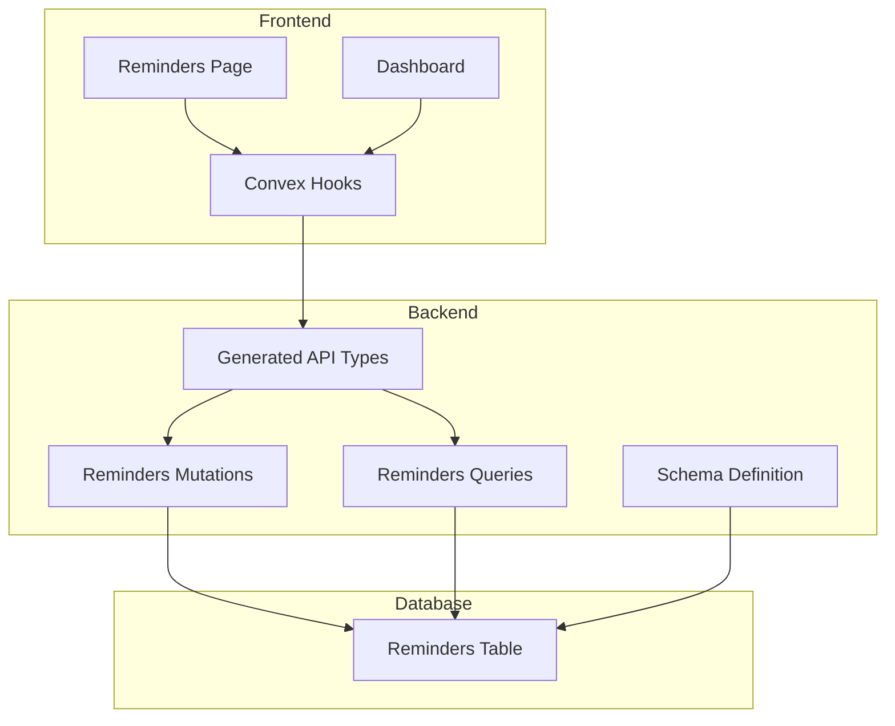
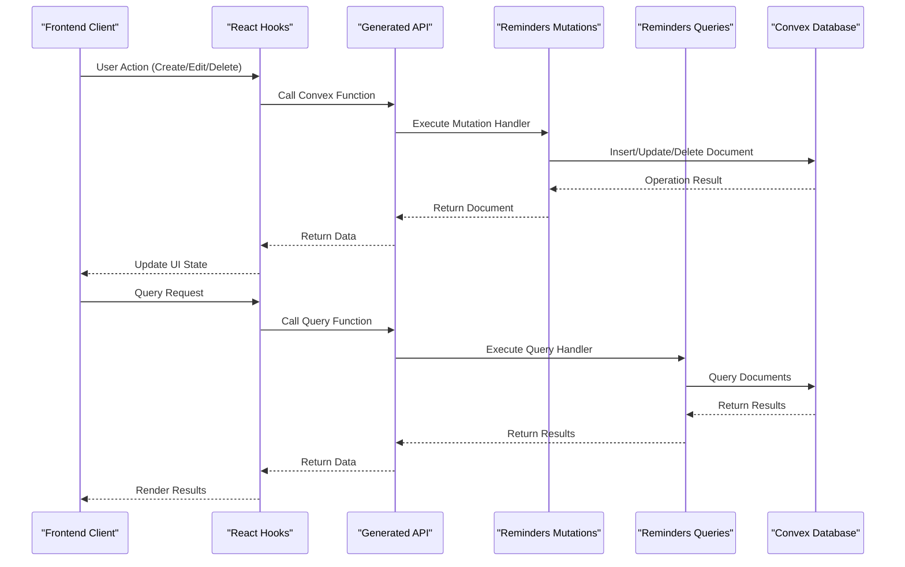
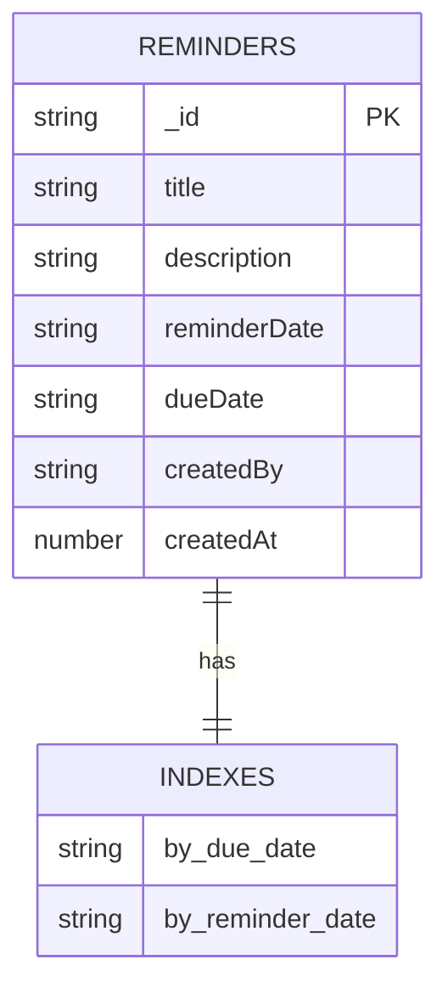
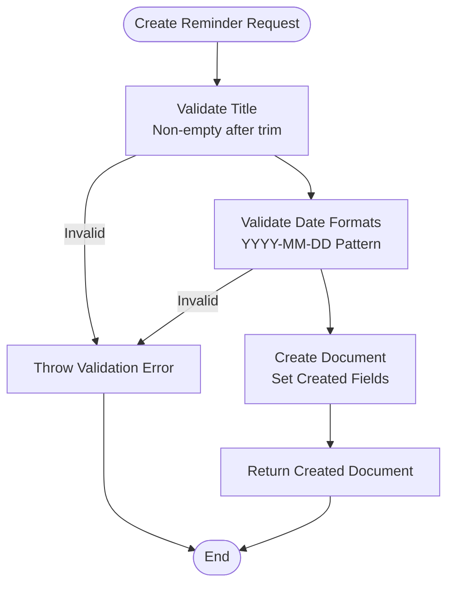
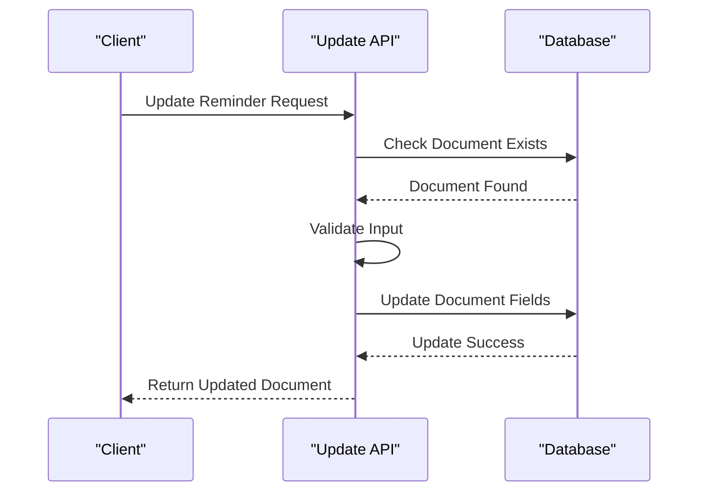
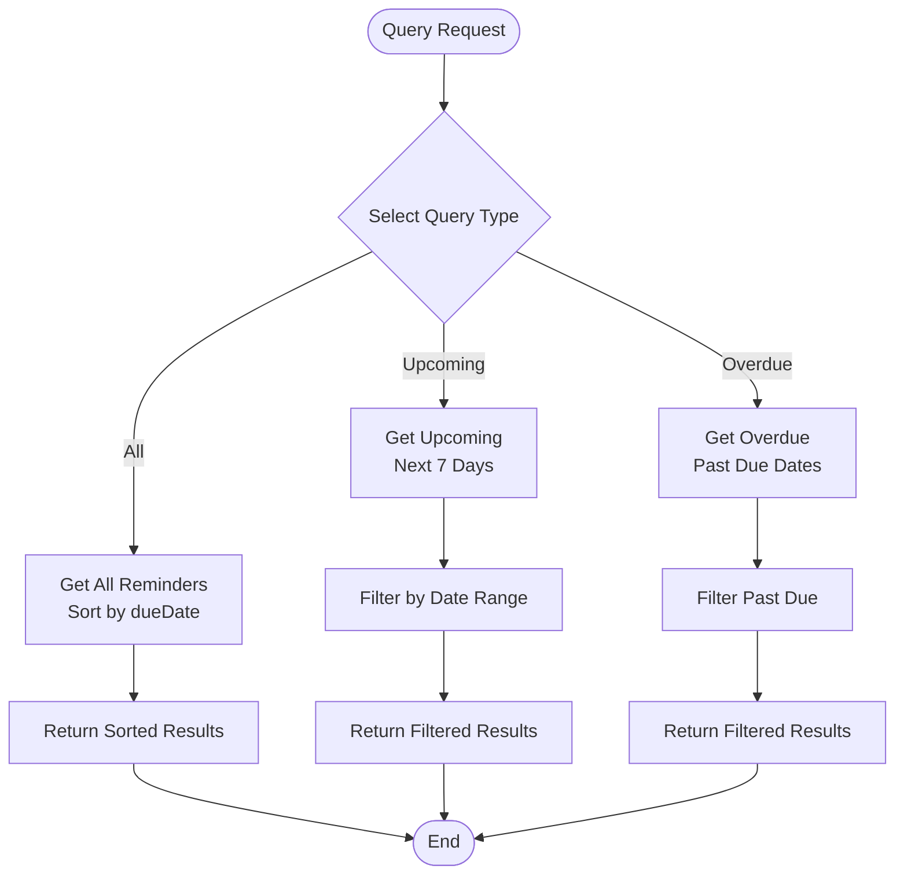
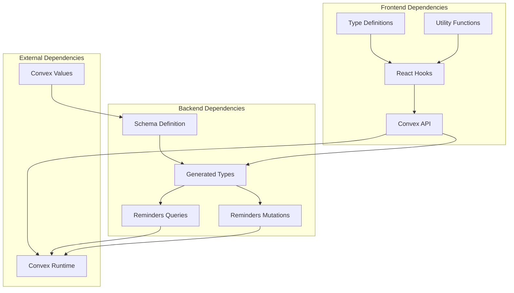

# Reminder Management API

<cite>
**Referenced Files in This Document**
- [schema.ts](file://convex/schema.ts)
- [reminders.ts](file://convex/mutations/reminders.ts)
- [reminders.ts](file://convex/queries/reminders.ts)
- [api.d.ts](file://convex/_generated/api.d.ts)
- [convex-api.ts](file://apps/convex-api.ts)
- [Reminders.tsx](file://apps/pages/Reminders.tsx)
- [Dashboard.tsx](file://apps/pages/Dashboard.tsx)
- [types.ts](file://apps/types.ts)
- [dataModel.d.ts](file://convex/_generated/dataModel.d.ts)
</cite>

## Table of Contents
1. [Introduction](#introduction)
2. [Project Structure](#project-structure)
3. [Core Components](#core-components)
4. [Architecture Overview](#architecture-overview)
5. [Detailed Component Analysis](#detailed-component-analysis)
6. [Dependency Analysis](#dependency-analysis)
7. [Performance Considerations](#performance-considerations)
8. [Troubleshooting Guide](#troubleshooting-guide)
9. [Conclusion](#conclusion)

## Introduction
This document provides comprehensive API documentation for reminder and task management operations in the KR-FUELS application. It covers reminder creation, updates, deletion, and querying capabilities, including due date filtering, completion status reporting, and user-specific task management. The documentation includes request/response schemas, validation rules, business logic for reminder notifications and overdue handling, practical examples, and error handling procedures.

## Project Structure
The reminder system is implemented using Convex for backend operations and React for the frontend. The structure follows a clear separation of concerns with dedicated files for schema definition, mutations (write operations), queries (read operations), and frontend integration.



**Diagram sources**
- [schema.ts](file://convex/schema.ts#L72-L84)
- [reminders.ts](file://convex/mutations/reminders.ts#L1-L116)
- [reminders.ts](file://convex/queries/reminders.ts#L1-L71)
- [api.d.ts](file://convex/_generated/api.d.ts#L85-L153)

**Section sources**
- [schema.ts](file://convex/schema.ts#L1-L85)
- [api.d.ts](file://convex/_generated/api.d.ts#L1-L182)

## Core Components
The reminder management system consists of four primary components:

### Data Model
The reminders table stores task information with the following structure:
- Title: String (required)
- Description: String (optional)
- Reminder Date: String (ISO format 'YYYY-MM-DD')
- Due Date: String (ISO format 'YYYY-MM-DD')
- Created By: String (username)
- Created At: Number (Unix timestamp)

### API Endpoints
The system exposes the following Convex functions:
- Create Reminder: Mutation for creating new reminders
- Update Reminder: Mutation for modifying existing reminders
- Delete Reminder: Mutation for removing reminders
- Get All Reminders: Query for retrieving all reminders
- Get Upcoming Reminders: Query for reminders within next 7 days
- Get Overdue Reminders: Query for past-due reminders

### Frontend Integration
React components integrate with the Convex API through custom hooks that provide type-safe access to reminder operations.

**Section sources**
- [schema.ts](file://convex/schema.ts#L72-L84)
- [reminders.ts](file://convex/mutations/reminders.ts#L1-L116)
- [reminders.ts](file://convex/queries/reminders.ts#L1-L71)
- [convex-api.ts](file://apps/convex-api.ts#L14-L22)

## Architecture Overview
The reminder management architecture follows a client-server pattern with Convex providing serverless backend functionality:



**Diagram sources**
- [convex-api.ts](file://apps/convex-api.ts#L1-L35)
- [reminders.ts](file://convex/mutations/reminders.ts#L12-L48)
- [reminders.ts](file://convex/queries/reminders.ts#L12-L27)

## Detailed Component Analysis

### Data Model and Validation

#### Reminder Schema
The reminder data model defines the structure and validation rules for reminder documents:



**Diagram sources**
- [schema.ts](file://convex/schema.ts#L72-L84)

#### Validation Rules
The system enforces the following validation rules:
- Title: Required, must be non-empty after trimming
- Date Formats: Both reminderDate and dueDate must follow 'YYYY-MM-DD' format
- Date Logic: Business logic ensures reminderDate ≤ dueDate for active reminders

**Section sources**
- [schema.ts](file://convex/schema.ts#L72-L84)
- [reminders.ts](file://convex/mutations/reminders.ts#L23-L34)

### Reminder Creation API

#### Request Schema
| Field | Type | Required | Description | Validation |
|-------|------|----------|-------------|------------|
| title | string | Yes | Reminder title | Non-empty after trim |
| description | string | No | Task description | Optional |
| reminderDate | string | Yes | Reminder date | 'YYYY-MM-DD' format |
| dueDate | string | Yes | Due date | 'YYYY-MM-DD' format |

#### Response Schema
Returns the created reminder document with all fields populated including system-generated identifiers.

#### Business Logic
- Validates input parameters before creation
- Sets createdBy field to current user (in full implementation)
- Generates createdAt timestamp
- Returns the newly created document



**Diagram sources**
- [reminders.ts](file://convex/mutations/reminders.ts#L12-L48)

**Section sources**
- [reminders.ts](file://convex/mutations/reminders.ts#L12-L48)
- [types.ts](file://apps/types.ts#L47-L55)

### Reminder Update API

#### Request Schema
| Field | Type | Required | Description | Validation |
|-------|------|----------|-------------|------------|
| id | Id | Yes | Reminder document ID | Valid Convex ID |
| title | string | Yes | Reminder title | Non-empty after trim |
| description | string | No | Task description | Optional |
| reminderDate | string | Yes | Reminder date | 'YYYY-MM-DD' format |
| dueDate | string | Yes | Due date | 'YYYY-MM-DD' format |

#### Business Logic
- Verifies reminder existence before update
- Applies same validation rules as creation
- Updates only provided fields
- Returns updated document



**Diagram sources**
- [reminders.ts](file://convex/mutations/reminders.ts#L53-L93)

**Section sources**
- [reminders.ts](file://convex/mutations/reminders.ts#L53-L93)

### Reminder Deletion API

#### Request Schema
| Field | Type | Required | Description |
|-------|------|----------|-------------|
| id | Id | Yes | Reminder document ID |

#### Response Schema
```typescript
{
  success: boolean,
  id: string
}
```

#### Business Logic
- Validates document existence
- Deletes the specified reminder
- Returns success confirmation

**Section sources**
- [reminders.ts](file://convex/mutations/reminders.ts#L98-L116)

### Query Operations

#### Get All Reminders
Retrieves all reminders sorted by due date in ascending order.

#### Get Upcoming Reminders
Filters reminders within the next 7 days based on reminderDate.

#### Get Overdue Reminders
Filters reminders that are past their due date.



**Diagram sources**
- [reminders.ts](file://convex/queries/reminders.ts#L12-L27)
- [reminders.ts](file://convex/queries/reminders.ts#L33-L50)
- [reminders.ts](file://convex/queries/reminders.ts#L56-L70)

**Section sources**
- [reminders.ts](file://convex/queries/reminders.ts#L12-L71)

### Frontend Integration

#### React Hooks
The frontend provides convenient hooks for all reminder operations:
- useReminders: Get all reminders
- useUpcomingReminders: Get upcoming reminders
- useOverdueReminders: Get overdue reminders
- useCreateReminder: Create new reminders
- useUpdateReminder: Update existing reminders
- useDeleteReminder: Delete reminders

#### UI Components
The Reminders page provides:
- Form for creating/editing reminders
- Table display of all reminders
- Statistics dashboard (total, active, upcoming)
- Modal dialogs for user interactions

**Section sources**
- [convex-api.ts](file://apps/convex-api.ts#L14-L22)
- [Reminders.tsx](file://apps/pages/Reminders.tsx#L1-L388)

## Dependency Analysis



**Diagram sources**
- [api.d.ts](file://convex/_generated/api.d.ts#L1-L182)
- [dataModel.d.ts](file://convex/_generated/dataModel.d.ts#L1-L61)
- [convex-api.ts](file://apps/convex-api.ts#L1-L35)

**Section sources**
- [api.d.ts](file://convex/_generated/api.d.ts#L85-L153)
- [dataModel.d.ts](file://convex/_generated/dataModel.d.ts#L10-L61)

## Performance Considerations

### Database Indexing
The schema includes optimized indexes for efficient querying:
- `by_due_date`: Enables fast overdue reminder queries
- `by_reminder_date`: Supports upcoming reminder filtering

### Query Optimization
- All queries use appropriate indexes for optimal performance
- Sorting is performed efficiently using database-level ordering
- Date filtering leverages index usage for better performance

### Frontend Caching
- React hooks provide automatic caching of query results
- Efficient re-rendering through memoization
- Minimal re-computation of derived statistics

## Troubleshooting Guide

### Common Validation Errors
- **Invalid Date Format**: Ensure dates follow 'YYYY-MM-DD' format
- **Missing Required Fields**: Title, reminderDate, and dueDate are mandatory
- **Reminder Not Found**: Verify the reminder ID exists before updating/deleting

### Error Handling Patterns
The system throws descriptive errors for various failure scenarios:
- Input validation failures
- Document not found errors
- Permission validation issues (in full implementation)

### Debugging Tips
- Check browser console for Convex runtime errors
- Verify network requests in developer tools
- Monitor database operations in Convex dashboard
- Use React DevTools to inspect hook states

**Section sources**
- [reminders.ts](file://convex/mutations/reminders.ts#L23-L34)
- [reminders.ts](file://convex/mutations/reminders.ts#L65-L68)

## Conclusion
The reminder management API provides a robust foundation for task and reminder tracking in the KR-FUELS application. The system offers comprehensive CRUD operations with built-in validation, efficient querying capabilities, and seamless frontend integration. The modular architecture supports future enhancements including user assignment, permission validation, and advanced notification systems.

Key strengths of the implementation include:
- Clear separation of concerns between frontend and backend
- Strong typing through generated API definitions
- Efficient database indexing for optimal query performance
- Comprehensive validation at multiple layers
- Extensible architecture for future feature additions

The current implementation focuses on core reminder functionality with placeholders for authentication and user assignment that can be easily integrated in future development phases.