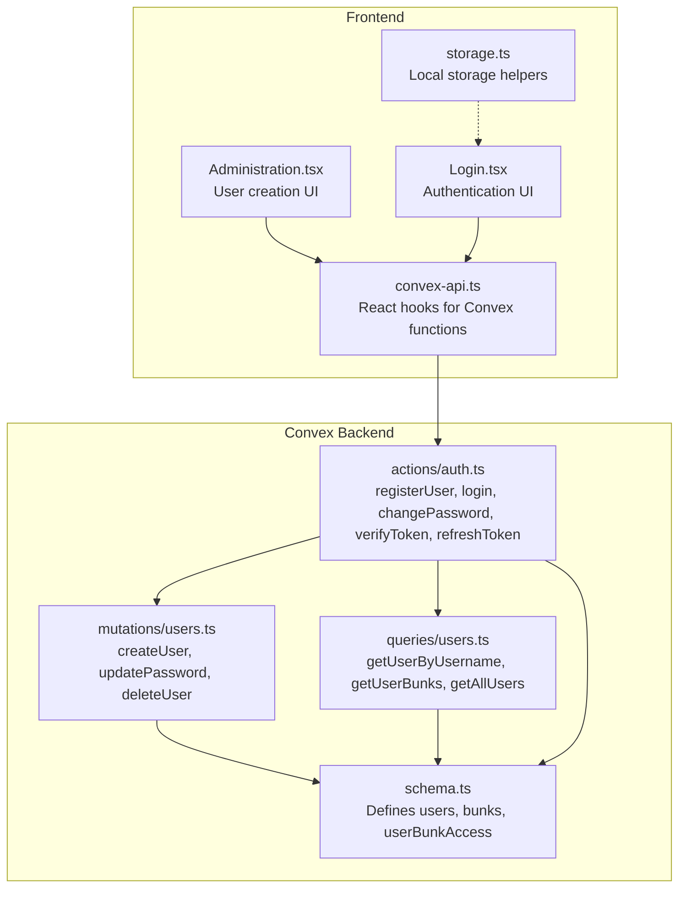
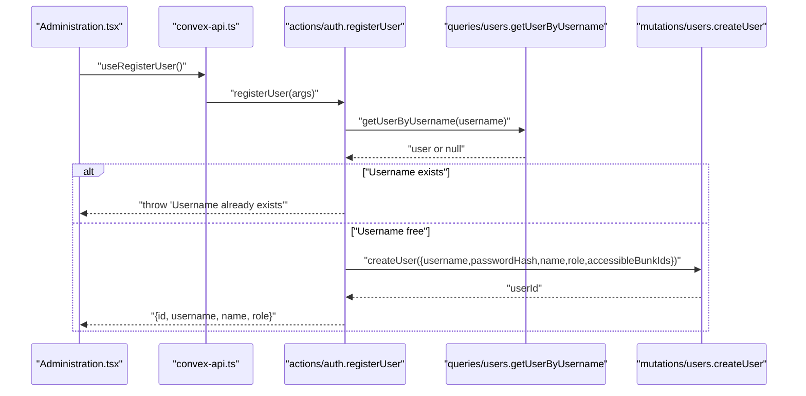
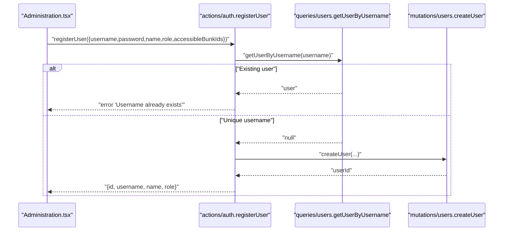
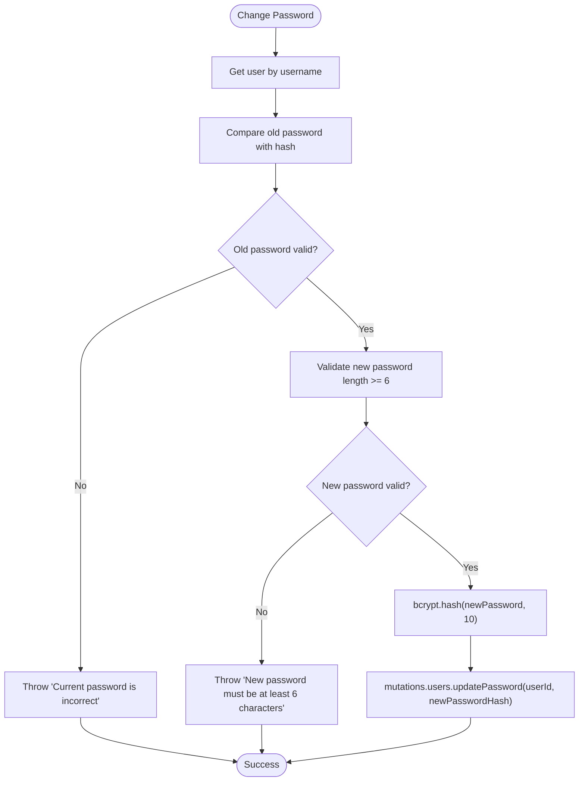
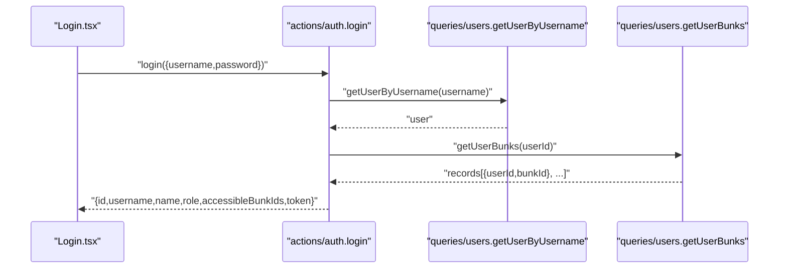
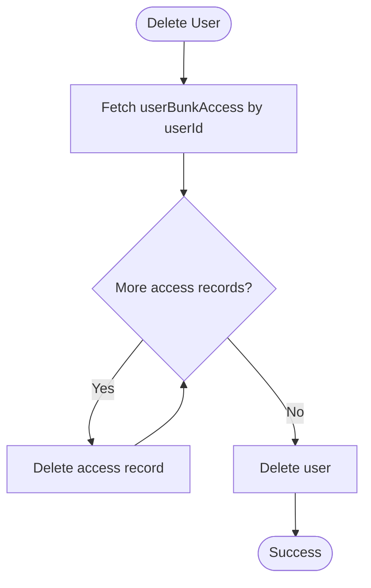
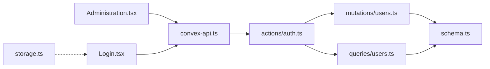

# User Management API

<cite>
**Referenced Files in This Document**
- [schema.ts](file://convex/schema.ts)
- [users.ts](file://convex/mutations/users.ts)
- [users.ts](file://convex/queries/users.ts)
- [auth.ts](file://convex/actions/auth.ts)
- [Administration.tsx](file://apps/pages/Administration.tsx)
- [Login.tsx](file://apps/pages/Login.tsx)
- [convex-api.ts](file://apps/convex-api.ts)
- [storage.ts](file://apps/lib/storage.ts)
- [api.d.ts](file://convex/_generated/api.d.ts)
</cite>

## Table of Contents
1. [Introduction](#introduction)
2. [Project Structure](#project-structure)
3. [Core Components](#core-components)
4. [Architecture Overview](#architecture-overview)
5. [Detailed Component Analysis](#detailed-component-analysis)
6. [Dependency Analysis](#dependency-analysis)
7. [Performance Considerations](#performance-considerations)
8. [Troubleshooting Guide](#troubleshooting-guide)
9. [Conclusion](#conclusion)
10. [Appendices](#appendices)

## Introduction
This document provides comprehensive API documentation for user management operations in the KR-FUELS system. It covers user registration with role assignment (admin/super_admin), password hashing, and location-specific access permissions. It also documents user profile updates (role changes, password modifications, and location access updates), user querying operations (user lists, role filtering, and location-based retrieval), and the business logic for role-based access control and multi-location user assignments. Practical examples demonstrate user onboarding workflows, role management scenarios, and access control patterns. Error handling for duplicate users, permission violations, and role hierarchy conflicts is addressed.

## Project Structure
The user management system spans three primary areas:
- Convex backend schema and functions (mutations, queries, actions)
- Frontend pages and hooks for administration and authentication
- Local storage utilities for secure token and user data persistence

**Diagram sources**
- [schema.ts](file://convex/schema.ts#L13-L40)
- [users.ts](file://convex/mutations/users.ts#L13-L81)
- [users.ts](file://convex/queries/users.ts#L4-L35)
- [auth.ts](file://convex/actions/auth.ts#L31-L265)
- [Administration.tsx](file://apps/pages/Administration.tsx#L39-L83)
- [Login.tsx](file://apps/pages/Login.tsx#L29-L66)
- [convex-api.ts](file://apps/convex-api.ts#L7-L11)
- [storage.ts](file://apps/lib/storage.ts#L1-L34)

**Section sources**
- [schema.ts](file://convex/schema.ts#L1-L85)
- [users.ts](file://convex/mutations/users.ts#L1-L81)
- [users.ts](file://convex/queries/users.ts#L1-L35)
- [auth.ts](file://convex/actions/auth.ts#L1-L266)
- [Administration.tsx](file://apps/pages/Administration.tsx#L1-L376)
- [Login.tsx](file://apps/pages/Login.tsx#L1-L177)
- [convex-api.ts](file://apps/convex-api.ts#L1-L35)
- [storage.ts](file://apps/lib/storage.ts#L1-L34)

## Core Components
- Users table: stores username, passwordHash, name, role, and createdAt.
- Bunks table: fuel station locations with code, name, location, and createdAt.
- userBunkAccess junction table: many-to-many relationship between users and bunks for location-specific access.
- Authentication actions: registerUser, login, changePassword, verifyToken, refreshToken.
- User mutations: createUser, updatePassword, deleteUser.
- User queries: getUserByUsername, getUserBunks, getAllUsers, getAllUserBunkAccess.

Key capabilities:
- Role-based access control with admin (specific bunks) and super_admin (global).
- Location-specific access via userBunkAccess.
- Password hashing with bcrypt and JWT-based session management.
- Frontend administration page for user creation and deletion.

**Section sources**
- [schema.ts](file://convex/schema.ts#L23-L40)
- [auth.ts](file://convex/actions/auth.ts#L87-L129)
- [users.ts](file://convex/mutations/users.ts#L13-L81)
- [users.ts](file://convex/queries/users.ts#L4-L35)

## Architecture Overview
The system follows a React frontend with Convex backend functions. Authentication actions handle password hashing and JWT generation. User mutations manage CRUD operations with automatic location access grants. Queries support user lookup and access enumeration.

**Diagram sources**
- [Administration.tsx](file://apps/pages/Administration.tsx#L67-L83)
- [convex-api.ts](file://apps/convex-api.ts#L8-L8)
- [auth.ts](file://convex/actions/auth.ts#L87-L129)
- [users.ts](file://convex/queries/users.ts#L4-L12)
- [users.ts](file://convex/mutations/users.ts#L13-L41)

## Detailed Component Analysis

### User Registration and Role Assignment
- Endpoint: actions.auth.registerUser
- Request arguments:
  - username: string (unique)
  - password: string (minimum 6 characters)
  - name: string
  - role: "admin" | "super_admin"
  - accessibleBunkIds: array of bunks ids (required for admin)
- Validation rules:
  - Username uniqueness enforced via getUserByUsername.
  - Password minimum length validated.
  - Role must be one of the allowed literals.
  - Accessible bunks required for admin role.
- Processing logic:
  - Hash password with bcrypt (10 rounds).
  - Insert user into users table.
  - Insert userBunkAccess records for each bunk id.
- Response: { id, username, name, role }.

**Diagram sources**
- [Administration.tsx](file://apps/pages/Administration.tsx#L67-L83)
- [auth.ts](file://convex/actions/auth.ts#L87-L129)
- [users.ts](file://convex/queries/users.ts#L4-L12)
- [users.ts](file://convex/mutations/users.ts#L13-L41)

**Section sources**
- [auth.ts](file://convex/actions/auth.ts#L87-L129)
- [users.ts](file://convex/mutations/users.ts#L13-L41)
- [users.ts](file://convex/queries/users.ts#L4-L12)

### Password Hashing and Updates
- Registration: actions.auth.registerUser hashes password before storing.
- Update: actions.auth.changePassword verifies old password, validates new password length, hashes, and updates via mutations.users.updatePassword.
- Storage: users.passwordHash is bcrypt hash.

**Diagram sources**
- [auth.ts](file://convex/actions/auth.ts#L134-L172)
- [users.ts](file://convex/mutations/users.ts#L47-L58)

**Section sources**
- [auth.ts](file://convex/actions/auth.ts#L134-L172)
- [users.ts](file://convex/mutations/users.ts#L47-L58)

### Location-Specific Access Control
- Access model:
  - super_admin: global access (no location restrictions).
  - admin: restricted to accessibleBunkIds via userBunkAccess.
- Retrieval:
  - actions.auth.login and actions.auth.verifyToken fetch accessibleBunkIds for the user.
  - queries.users.getUserBunks returns user's bunk access records.

**Diagram sources**
- [Login.tsx](file://apps/pages/Login.tsx#L31-L66)
- [auth.ts](file://convex/actions/auth.ts#L31-L81)
- [users.ts](file://convex/queries/users.ts#L4-L22)

**Section sources**
- [auth.ts](file://convex/actions/auth.ts#L31-L81)
- [users.ts](file://convex/queries/users.ts#L14-L22)

### User Deletion and Cleanup
- actions.auth.registerUser creates user and grants bunk access.
- mutations.users.deleteUser removes all userBunkAccess records for the user, then deletes the user.

**Diagram sources**
- [users.ts](file://convex/mutations/users.ts#L63-L81)
- [users.ts](file://convex/queries/users.ts#L14-L22)

**Section sources**
- [users.ts](file://convex/mutations/users.ts#L63-L81)

### User Querying Operations
- getAllUsers: returns all users.
- getUserByUsername: returns a single user by username.
- getUserBunks: returns all bunk access records for a user.
- getAllUserBunkAccess: returns all user-bunk access records.

These queries enable:
- Listing users for administration.
- Role filtering client-side (super_admin vs admin).
- Location-based user retrieval via access records.

**Section sources**
- [users.ts](file://convex/queries/users.ts#L24-L35)

### Frontend Integration
- Administration.tsx:
  - Provides UI for adding users with role selection and bunk access toggles.
  - Calls useRegisterUser and useDeleteUser hooks.
  - Displays user roles and accessible bunks.
- Login.tsx:
  - Handles login flow, stores JWT token and user data via local storage.
- convex-api.ts:
  - Exposes useAction/useQuery/useMutation wrappers for Convex functions.
- storage.ts:
  - Manages secure storage of token and user data.

**Section sources**
- [Administration.tsx](file://apps/pages/Administration.tsx#L26-L114)
- [Administration.tsx](file://apps/pages/Administration.tsx#L67-L92)
- [Login.tsx](file://apps/pages/Login.tsx#L29-L66)
- [convex-api.ts](file://apps/convex-api.ts#L7-L11)
- [storage.ts](file://apps/lib/storage.ts#L1-L34)

## Dependency Analysis
- Actions depend on queries for user lookup and on mutations for write operations.
- Mutations operate on schema-defined tables and indices.
- Frontend pages depend on convex-api hooks, which wrap Convex functions.

**Diagram sources**
- [auth.ts](file://convex/actions/auth.ts#L31-L265)
- [users.ts](file://convex/queries/users.ts#L4-L35)
- [users.ts](file://convex/mutations/users.ts#L13-L81)
- [schema.ts](file://convex/schema.ts#L13-L40)
- [Administration.tsx](file://apps/pages/Administration.tsx#L39-L40)
- [Login.tsx](file://apps/pages/Login.tsx#L29-L37)
- [convex-api.ts](file://apps/convex-api.ts#L7-L11)
- [storage.ts](file://apps/lib/storage.ts#L26-L33)

**Section sources**
- [api.d.ts](file://convex/_generated/api.d.ts#L85-L166)

## Performance Considerations
- Index usage:
  - users.by_username ensures O(1) lookup by username.
  - userBunkAccess.by_user and by_bunk optimize access queries.
- Batch operations:
  - createUser inserts multiple access records in a loop; consider batching if performance becomes a concern.
- Token lifecycle:
  - JWT expiry is 24 hours; use refreshToken action to renew without re-authentication.

[No sources needed since this section provides general guidance]

## Troubleshooting Guide
Common errors and resolutions:
- Duplicate username during registration:
  - Error thrown when username already exists.
  - Resolution: Choose a unique username.
- Invalid credentials:
  - login throws error for invalid username or password.
  - Resolution: Verify username and password.
- Current password incorrect:
  - changePassword throws error if old password does not match.
  - Resolution: Provide correct current password.
- New password too short:
  - changePassword requires minimum 6 characters.
  - Resolution: Use a stronger password.
- Token verification failures:
  - verifyToken returns valid:false with error message for invalid/expired tokens.
  - Resolution: Re-login or refresh token.

**Section sources**
- [auth.ts](file://convex/actions/auth.ts#L42-L50)
- [auth.ts](file://convex/actions/auth.ts#L101-L103)
- [auth.ts](file://convex/actions/auth.ts#L150-L154)
- [auth.ts](file://convex/actions/auth.ts#L220-L226)

## Conclusion
The KR-FUELS user management API provides robust role-based access control with location-specific permissions. It supports secure user onboarding, password management, and administrative oversight. The frontend integrates seamlessly with Convex actions and queries to deliver a smooth user experience while enforcing validation and security constraints.

[No sources needed since this section summarizes without analyzing specific files]

## Appendices

### API Definitions and Schemas

- Users table
  - Fields: username (unique), passwordHash, name, role ("admin" | "super_admin"), createdAt.
  - Indices: by_username.

- Bunks table
  - Fields: name, code (unique), location, createdAt.
  - Indices: by_code.

- userBunkAccess junction table
  - Fields: userId, bunkId.
  - Indices: by_user, by_bunk, by_user_and_bunk.

- Authentication actions
  - registerUser: Creates user and grants bunk access.
  - login: Returns user data with JWT token and accessibleBunkIds.
  - changePassword: Verifies old password, validates new password, hashes, and updates.
  - verifyToken: Validates token and returns user data.
  - refreshToken: Issues a new token if current token is valid.

- User mutations
  - createUser: Inserts user and access records.
  - updatePassword: Patches passwordHash.
  - deleteUser: Removes access records then user.

- User queries
  - getUserByUsername: Lookup by username.
  - getUserBunks: Access records for a user.
  - getAllUsers: List all users.
  - getAllUserBunkAccess: All access records.

**Section sources**
- [schema.ts](file://convex/schema.ts#L23-L40)
- [auth.ts](file://convex/actions/auth.ts#L87-L129)
- [auth.ts](file://convex/actions/auth.ts#L134-L172)
- [auth.ts](file://convex/actions/auth.ts#L31-L81)
- [auth.ts](file://convex/actions/auth.ts#L232-L265)
- [users.ts](file://convex/mutations/users.ts#L13-L81)
- [users.ts](file://convex/queries/users.ts#L4-L35)

### Practical Examples

- User onboarding workflow
  - Admin selects role (admin or super_admin) and assigns bunks (for admin).
  - Frontend calls registerUser with hashed password.
  - Backend enforces uniqueness and access requirements.

- Role management scenario
  - Changing a user from admin to super_admin requires administrative privileges.
  - Current implementation focuses on creation and access updates; role elevation would require additional backend validation.

- Access control pattern
  - On login, accessibleBunkIds are returned.
  - Frontend filters data based on role and accessibleBunkIds.

**Section sources**
- [Administration.tsx](file://apps/pages/Administration.tsx#L67-L114)
- [Login.tsx](file://apps/pages/Login.tsx#L31-L66)
- [auth.ts](file://convex/actions/auth.ts#L31-L81)