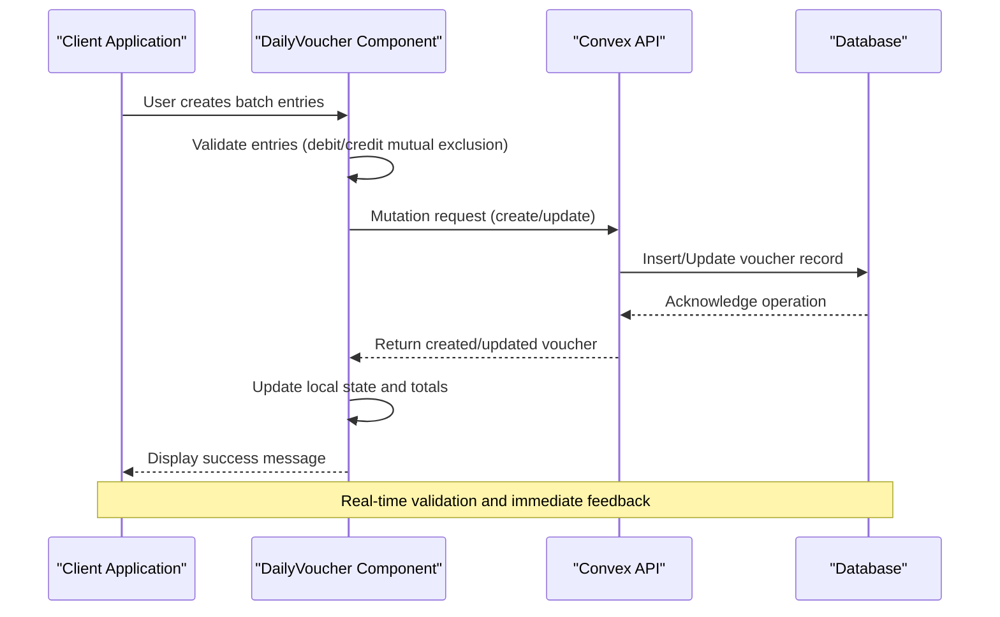
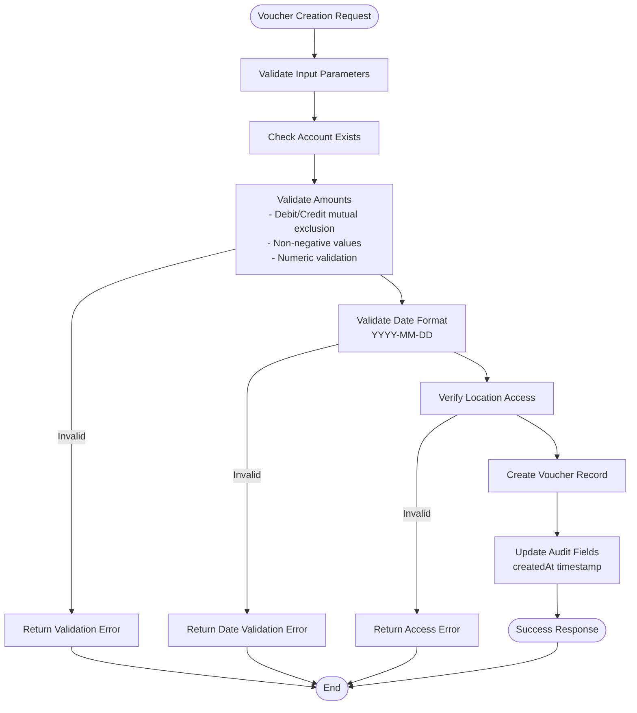
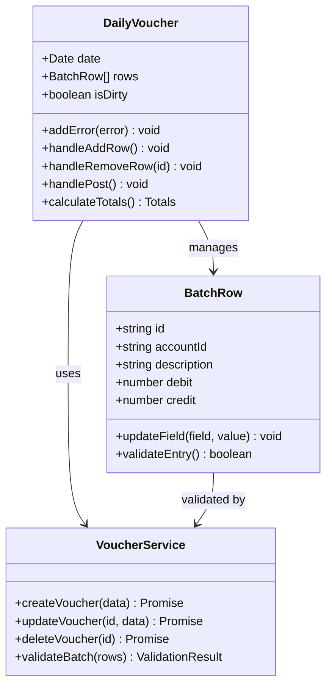
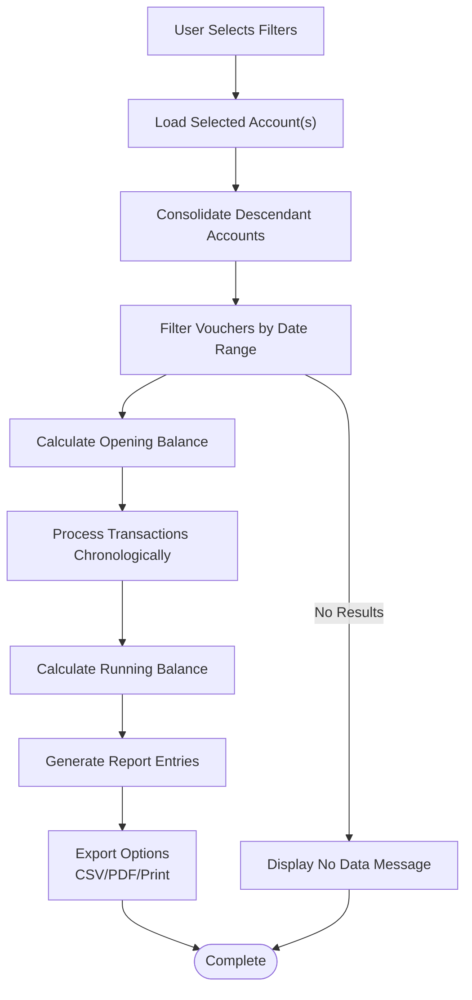
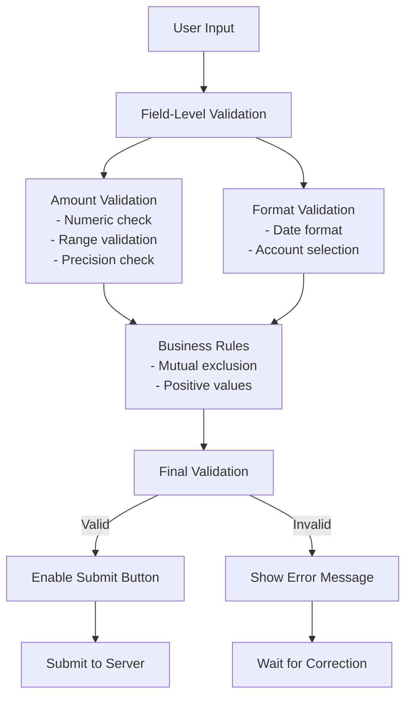
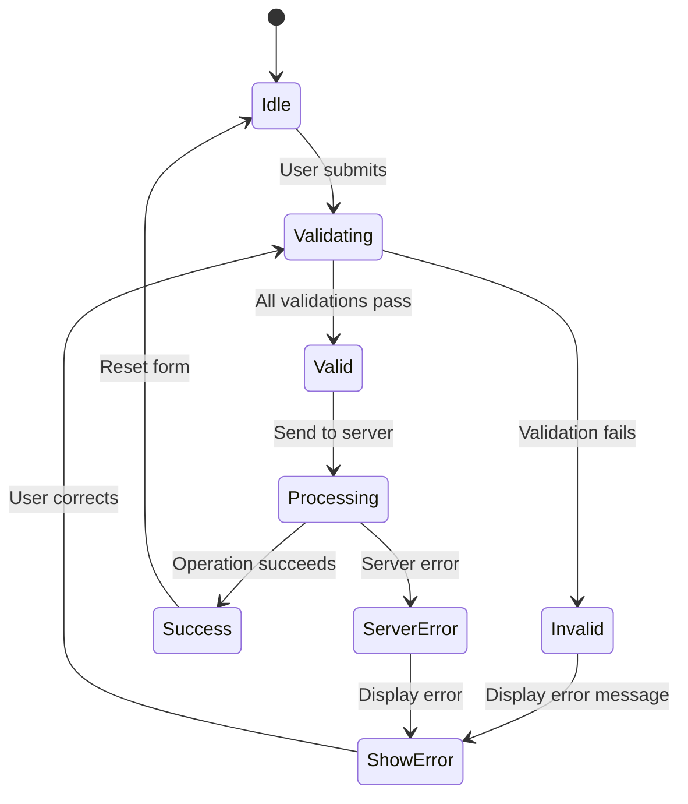

# Voucher Management API

<cite>
**Referenced Files in This Document**
- [schema.ts](file://convex/schema.ts)
- [vouchers.ts](file://convex/mutations/vouchers.ts)
- [vouchers.ts](file://convex/queries/vouchers.ts)
- [accounts.ts](file://convex/queries/accounts.ts)
- [DailyVoucher.tsx](file://apps/pages/DailyVoucher.tsx)
- [LedgerReport.tsx](file://apps/pages/LedgerReport.tsx)
- [CashReport.tsx](file://apps/pages/CashReport.tsx)
- [utils.ts](file://apps/utils.ts)
- [types.ts](file://apps/types.ts)
- [api.d.ts](file://convex/_generated/api.d.ts)
</cite>

## Table of Contents
1. [Introduction](#introduction)
2. [Project Structure](#project-structure)
3. [Core Components](#core-components)
4. [Architecture Overview](#architecture-overview)
5. [Detailed Component Analysis](#detailed-component-analysis)
6. [API Reference](#api-reference)
7. [Business Logic Constraints](#business-logic-constraints)
8. [Validation Rules](#validation-rules)
9. [Practical Examples](#practical-examples)
10. [Error Handling](#error-handling)
11. [Performance Considerations](#performance-considerations)
12. [Troubleshooting Guide](#troubleshooting-guide)
13. [Conclusion](#conclusion)

## Introduction
This document provides comprehensive API documentation for the voucher management system used for daily transaction processing. It covers voucher creation, batch processing, querying operations, and ledger reporting capabilities. The system follows double-entry accounting principles with debit/credit validations, supports real-time posting operations, and provides robust querying mechanisms for date-range filtering, account-specific retrievals, and ledger report generation.

## Project Structure
The voucher management system spans three main layers:
- Convex backend with database schema and server-side functions
- Frontend React components for user interaction and batch processing
- Utility functions for calculations and formatting

```mermaid
graph TB
subgraph "Frontend Layer"
DV[DailyVoucher.tsx]
LR[LedgerReport.tsx]
CR[CashReport.tsx]
UT[utils.ts]
TY[types.ts]
end
subgraph "Convex Backend"
SC[schema.ts]
MQ[vouchers.ts (Mutations)]
QQ[vouchers.ts (Queries)]
AQ[accounts.ts (Queries)]
GD[Generated API Types]
end
subgraph "Database"
VB[vouchers table]
AB[accounts table]
BB[bunks table]
end
DV --> MQ
DV --> QQ
LR --> QQ
LR --> UT
CR --> UT
MQ --> SC
QQ --> SC
AQ --> SC
SC --> VB
SC --> AB
SC --> BB
GD --> MQ
GD --> QQ
```

**Diagram sources**
- [DailyVoucher.tsx](file://apps/pages/DailyVoucher.tsx#L1-L336)
- [LedgerReport.tsx](file://apps/pages/LedgerReport.tsx#L1-L257)
- [CashReport.tsx](file://apps/pages/CashReport.tsx#L1-L267)
- [utils.ts](file://apps/utils.ts#L1-L69)
- [types.ts](file://apps/types.ts#L1-L56)
- [schema.ts](file://convex/schema.ts#L1-L85)
- [vouchers.ts](file://convex/mutations/vouchers.ts#L1-L59)
- [vouchers.ts](file://convex/queries/vouchers.ts#L1-L19)
- [accounts.ts](file://convex/queries/accounts.ts#L1-L19)
- [api.d.ts](file://convex/_generated/api.d.ts#L1-L182)

**Section sources**
- [schema.ts](file://convex/schema.ts#L1-L85)
- [api.d.ts](file://convex/_generated/api.d.ts#L1-L182)

## Core Components
The voucher management system consists of four primary components:

### Database Schema
The system uses a normalized schema with three main collections:
- **Vouchers**: Daily transaction records with debit/credit entries
- **Accounts**: Hierarchical chart of accounts with parent-child relationships
- **Bunks**: Fuel station locations serving as organizational units

### Server-Side Functions
- **Mutations**: Create, update, and delete voucher operations
- **Queries**: Retrieve vouchers by location and date ranges
- **Account Queries**: Fetch accounts by location for dropdown selection

### Frontend Components
- **DailyVoucher**: Real-time batch processing with live validation
- **LedgerReport**: Detailed account activity with export capabilities
- **CashReport**: Cash flow summary with multiple filter options

**Section sources**
- [schema.ts](file://convex/schema.ts#L45-L70)
- [vouchers.ts](file://convex/mutations/vouchers.ts#L1-L59)
- [vouchers.ts](file://convex/queries/vouchers.ts#L1-L19)

## Architecture Overview
The system follows a client-server architecture with real-time synchronization:



**Diagram sources**
- [DailyVoucher.tsx](file://apps/pages/DailyVoucher.tsx#L111-L150)
- [vouchers.ts](file://convex/mutations/vouchers.ts#L4-L24)

## Detailed Component Analysis

### Voucher Creation and Validation
The voucher creation process enforces strict validation rules:



**Diagram sources**
- [vouchers.ts](file://convex/mutations/vouchers.ts#L4-L24)
- [DailyVoucher.tsx](file://apps/pages/DailyVoucher.tsx#L111-L150)

### Batch Processing Operations
The DailyVoucher component supports sophisticated batch processing:



**Diagram sources**
- [DailyVoucher.tsx](file://apps/pages/DailyVoucher.tsx#L18-L150)
- [vouchers.ts](file://convex/mutations/vouchers.ts#L26-L59)

### Ledger Reporting Engine
The ledger reporting system provides comprehensive financial insights:



**Diagram sources**
- [LedgerReport.tsx](file://apps/pages/LedgerReport.tsx#L49-L75)
- [utils.ts](file://apps/utils.ts#L27-L64)

**Section sources**
- [DailyVoucher.tsx](file://apps/pages/DailyVoucher.tsx#L1-L336)
- [LedgerReport.tsx](file://apps/pages/LedgerReport.tsx#L1-L257)
- [utils.ts](file://apps/utils.ts#L1-L69)

## API Reference

### Voucher Mutations

#### createVoucher
Creates a new voucher entry with validation.

**Request Parameters:**
- `txnDate` (string): Transaction date in YYYY-MM-DD format
- `accountId` (string): Account identifier
- `debit` (number): Debit amount (non-negative)
- `credit` (number): Credit amount (non-negative)
- `description` (string): Transaction description
- `bunkId` (string): Location identifier

**Response:**
- Returns the created voucher object with audit fields

**Section sources**
- [vouchers.ts](file://convex/mutations/vouchers.ts#L4-L24)

#### updateVoucher
Updates an existing voucher entry.

**Request Parameters:**
- `id` (string): Voucher identifier
- `txnDate` (string): Updated transaction date
- `accountId` (string): Updated account identifier
- `debit` (number): Updated debit amount
- `credit` (number): Updated credit amount
- `description` (string): Updated description

**Response:**
- Returns the updated voucher object

**Section sources**
- [vouchers.ts](file://convex/mutations/vouchers.ts#L26-L47)

#### deleteVoucher
Deletes a voucher entry.

**Request Parameters:**
- `id` (string): Voucher identifier

**Response:**
- `{ success: true }` on successful deletion

**Section sources**
- [vouchers.ts](file://convex/mutations/vouchers.ts#L49-L59)

### Voucher Queries

#### getVouchersByBunk
Retrieves all vouchers for a specific location.

**Request Parameters:**
- `bunkId` (string): Location identifier

**Response:**
- Array of voucher objects sorted by date

**Section sources**
- [vouchers.ts](file://convex/queries/vouchers.ts#L4-L12)

#### getAllVouchers
Retrieves all vouchers in the system.

**Response:**
- Array of all voucher objects

**Section sources**
- [vouchers.ts](file://convex/queries/vouchers.ts#L14-L19)

### Account Queries

#### getAccountsByBunk
Retrieves all accounts for a specific location.

**Request Parameters:**
- `bunkId` (string): Location identifier

**Response:**
- Array of account objects

**Section sources**
- [accounts.ts](file://convex/queries/accounts.ts#L4-L12)

#### getAllAccounts
Retrieves all accounts in the system.

**Response:**
- Array of all account objects

**Section sources**
- [accounts.ts](file://convex/queries/accounts.ts#L14-L19)

**Section sources**
- [api.d.ts](file://convex/_generated/api.d.ts#L85-L153)

## Business Logic Constraints

### Double-Entry Accounting Principles
The system enforces fundamental accounting rules:
- Every transaction must have equal debit and credit amounts
- Debit and credit fields are mutually exclusive (only one can be non-zero per entry)
- Asset accounts maintain normal debit balances
- Liability and income accounts maintain normal credit balances

### Voucher Numbering
- System-generated unique identifiers for all voucher records
- Automatic timestamp tracking for audit trails
- Sequential creation order maintained through timestamps

### Posting Validation
- Real-time validation during batch entry creation
- Immediate feedback for invalid entries
- Atomic operation support through Convex mutations
- Conflict resolution for concurrent updates

**Section sources**
- [DailyVoucher.tsx](file://apps/pages/DailyVoucher.tsx#L89-L100)
- [vouchers.ts](file://convex/mutations/vouchers.ts#L13-L23)

## Validation Rules

### Input Validation
All voucher operations enforce strict validation:

**Date Validation:**
- Format: YYYY-MM-DD
- Range: Valid calendar dates
- Future date restrictions (configurable)

**Amount Validation:**
- Must be numeric
- Non-negative values only
- Mutual exclusion: debit XOR credit (one must be zero)

**Account Validation:**
- Account must exist in the system
- Account belongs to the requesting user's accessible locations
- Hierarchical validation for parent-child relationships

**Business Rule Validation:**
- Debit/Credit mutual exclusion enforced
- Amount precision: up to 2 decimal places
- Description length limits

### Frontend Validation Patterns
The DailyVoucher component implements comprehensive client-side validation:



**Diagram sources**
- [DailyVoucher.tsx](file://apps/pages/DailyVoucher.tsx#L111-L150)
- [utils.ts](file://apps/utils.ts#L27-L64)

**Section sources**
- [DailyVoucher.tsx](file://apps/pages/DailyVoucher.tsx#L89-L150)

## Practical Examples

### Daily Voucher Entry Workflow
This example demonstrates a typical daily cash receipt transaction:

**Scenario:** Recording fuel sales payment via cash
- **Date:** 2024-01-15
- **Account:** Cash Account (Asset)
- **Description:** Customer Payment - Fuel Sales
- **Amount:** ₹50,000.00 (Debit)

**Implementation Steps:**
1. User selects transaction date
2. Searches and selects appropriate ledger account
3. Enters transaction description
4. Inputs debit amount (auto-clears credit field)
5. Submits for posting
6. System validates and creates voucher record

### Batch Processing Scenario
Multiple simultaneous transactions processed as a single batch:

**Scenario:** End-of-day cash reconciliation
- **Entries:**
  - Petty Cash Payment: ₹2,500.00 (Credit)
  - Bank Deposit: ₹47,500.00 (Credit)
  - Staff Advance: ₹1,000.00 (Debit)

**Processing Logic:**
1. All entries validated simultaneously
2. Batch submitted as single operation
3. System ensures atomic processing
4. Real-time balance calculations performed

### Ledger Report Generation
Generating financial statements with hierarchical filtering:

**Scenario:** Monthly profit and loss statement
- **Account Group:** Revenue Accounts
- **Date Range:** January 2024
- **Consolidation:** Sum of all descendant accounts
- **Output:** Detailed transaction history with running balances

**Section sources**
- [DailyVoucher.tsx](file://apps/pages/DailyVoucher.tsx#L111-L150)
- [LedgerReport.tsx](file://apps/pages/LedgerReport.tsx#L49-L75)

## Error Handling

### Validation Errors
Common validation failures and their handling:

**Input Validation Failures:**
- Invalid date format: "Date must be in YYYY-MM-DD format"
- Missing required fields: "All fields marked with * are required"
- Invalid account selection: "Selected account does not exist"
- Amount validation: "Amount must be a positive number"

**Business Logic Errors:**
- Debit/Credit conflict: "Only one of debit or credit can be non-zero"
- Insufficient funds: "Available balance exceeds withdrawal amount"
- Account access denied: "You do not have permission to access this account"

### Server-Side Error Responses
All server errors return standardized JSON responses:

```json
{
  "error": {
    "type": "ValidationError",
    "message": "Invalid transaction amount",
    "details": {
      "field": "debit",
      "value": -100,
      "constraint": "must be non-negative"
    }
  }
}
```

### Client-Side Error Management
The DailyVoucher component implements comprehensive error handling:



**Diagram sources**
- [DailyVoucher.tsx](file://apps/pages/DailyVoucher.tsx#L111-L150)

**Section sources**
- [DailyVoucher.tsx](file://apps/pages/DailyVoucher.tsx#L42-L43)
- [vouchers.ts](file://convex/mutations/vouchers.ts#L36-L56)

## Performance Considerations

### Database Indexing Strategy
The schema implements optimized indexing for common query patterns:
- **vouchers.by_bunk_and_date**: Composite index for location-date filtering
- **vouchers.by_account**: Single-field index for account-based queries
- **accounts.by_bunk**: Location-based account retrieval
- **accounts.by_parent**: Hierarchical account navigation

### Query Optimization
- Use indexed fields for filtering operations
- Leverage composite indexes for multi-dimensional queries
- Implement pagination for large result sets
- Cache frequently accessed account hierarchies

### Frontend Performance
- Memoized calculations for large datasets
- Debounced input validation for better UX
- Efficient rendering of large transaction tables
- Lazy loading for report generation

## Troubleshooting Guide

### Common Issues and Solutions

**Issue:** Voucher creation failing with validation errors
- **Cause:** Invalid debit/credit combination
- **Solution:** Ensure only one field (debit or credit) is populated

**Issue:** Ledger report showing incorrect balances
- **Cause:** Missing opening balance calculation
- **Solution:** Verify account opening balances are properly set

**Issue:** Batch processing not working
- **Cause:** Client-side validation blocking submission
- **Solution:** Check browser console for validation errors

**Issue:** Performance degradation with large datasets
- **Cause:** Unindexed queries or excessive re-renders
- **Solution:** Implement pagination and optimize queries

### Debugging Tools
- Browser developer tools for client-side debugging
- Convex dashboard for server-side monitoring
- Database query logs for performance analysis
- Network tab for API response inspection

**Section sources**
- [utils.ts](file://apps/utils.ts#L27-L64)
- [DailyVoucher.tsx](file://apps/pages/DailyVoucher.tsx#L165-L190)

## Conclusion
The voucher management system provides a robust foundation for daily transaction processing with strong validation, real-time feedback, and comprehensive reporting capabilities. The implementation follows industry best practices for double-entry accounting while maintaining excellent user experience through intuitive batch processing and powerful analytical tools. The modular architecture ensures scalability and maintainability for future enhancements.