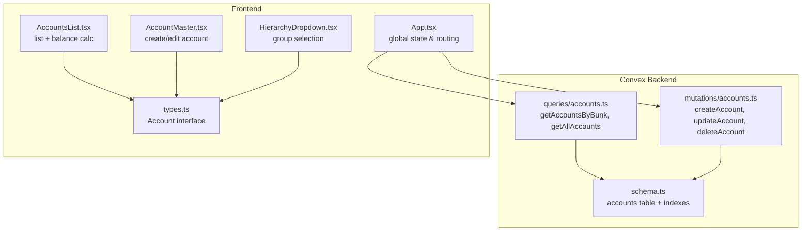
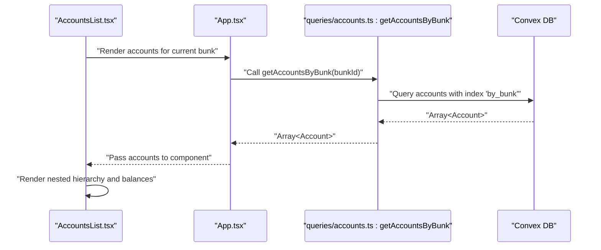
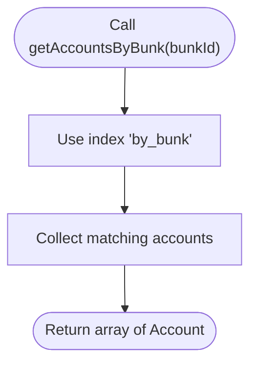
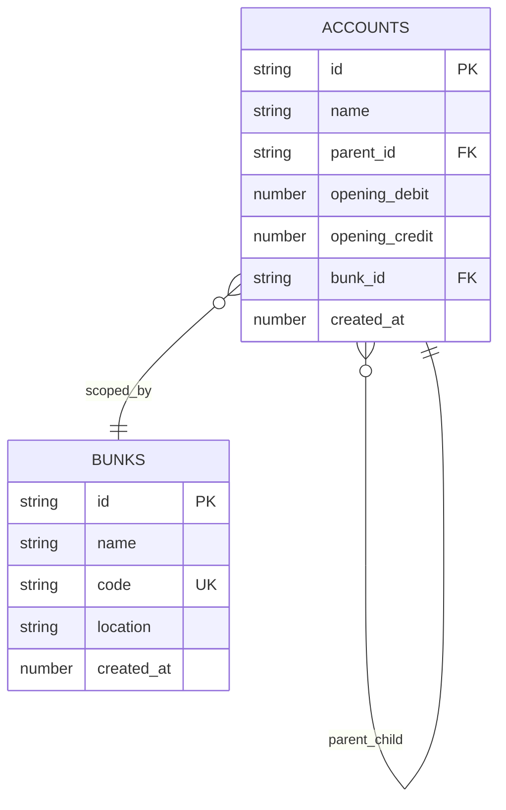
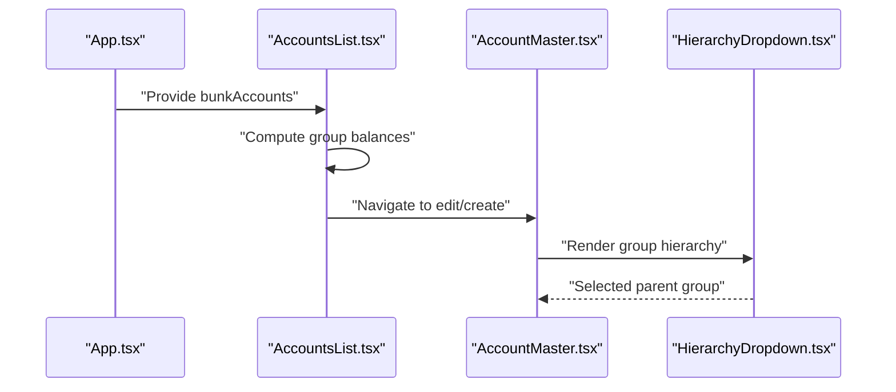
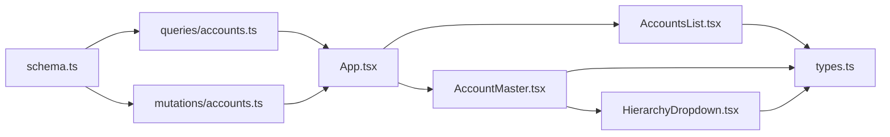

# Account Queries

<cite>
**Referenced Files in This Document**
- [schema.ts](file://convex/schema.ts)
- [accounts.ts](file://convex/queries/accounts.ts)
- [accounts.ts](file://convex/mutations/accounts.ts)
- [AccountsList.tsx](file://apps/pages/AccountsList.tsx)
- [AccountMaster.tsx](file://apps/pages/AccountMaster.tsx)
- [HierarchyDropdown.tsx](file://apps/components/HierarchyDropdown.tsx)
- [App.tsx](file://apps/App.tsx)
- [types.ts](file://apps/types.ts)
</cite>

## Table of Contents
1. [Introduction](#introduction)
2. [Project Structure](#project-structure)
3. [Core Components](#core-components)
4. [Architecture Overview](#architecture-overview)
5. [Detailed Component Analysis](#detailed-component-analysis)
6. [Dependency Analysis](#dependency-analysis)
7. [Performance Considerations](#performance-considerations)
8. [Troubleshooting Guide](#troubleshooting-guide)
9. [Conclusion](#conclusion)

## Introduction
This document provides detailed API documentation for account query endpoints in KR-FUELS focused on hierarchical chart-of-accounts. It covers:
- getAccountsByBunk: Retrieve hierarchical account structures filtered by a bunk/location identifier.
- getAllAccounts: Retrieve complete account listings without location filtering.
It explains parameter specifications, response format, indexing strategy, account hierarchy relationships, self-referencing parent-child structures, opening balance calculations, and practical usage patterns. It also documents performance optimization, data validation, relationship integrity, and cross-location access patterns.

## Project Structure
The account-related functionality spans Convex backend queries and mutations, and frontend pages/components that consume and render account data.

**Diagram sources**
- [accounts.ts](file://convex/queries/accounts.ts#L1-L18)
- [accounts.ts](file://convex/mutations/accounts.ts#L1-L63)
- [schema.ts](file://convex/schema.ts#L43-L54)
- [App.tsx](file://apps/App.tsx#L1-L301)
- [AccountsList.tsx](file://apps/pages/AccountsList.tsx#L1-L254)
- [AccountMaster.tsx](file://apps/pages/AccountMaster.tsx#L1-L228)
- [HierarchyDropdown.tsx](file://apps/components/HierarchyDropdown.tsx#L1-L138)
- [types.ts](file://apps/types.ts#L17-L25)

**Section sources**
- [schema.ts](file://convex/schema.ts#L43-L54)
- [accounts.ts](file://convex/queries/accounts.ts#L1-L18)
- [accounts.ts](file://convex/mutations/accounts.ts#L1-L63)
- [App.tsx](file://apps/App.tsx#L1-L301)
- [AccountsList.tsx](file://apps/pages/AccountsList.tsx#L1-L254)
- [AccountMaster.tsx](file://apps/pages/AccountMaster.tsx#L1-L228)
- [HierarchyDropdown.tsx](file://apps/components/HierarchyDropdown.tsx#L1-L138)
- [types.ts](file://apps/types.ts#L17-L25)

## Core Components
- getAccountsByBunk(query): Fetches all accounts for a given bunkId using a secondary index on bunkId.
- getAllAccounts(query): Fetches all accounts in the system without filtering.
- Account schema: Self-referencing hierarchy via parentId, with bunkId for location scoping and openingDebit/openingCredit for balances.
- Frontend consumption: Global state aggregates accounts per bunk and renders hierarchical lists and forms.

Key implementation references:
- Query definitions and handlers: [accounts.ts](file://convex/queries/accounts.ts#L1-L18)
- Schema indexes: [schema.ts](file://convex/schema.ts#L43-L54)
- Frontend state wiring: [App.tsx](file://apps/App.tsx#L23-L134)

**Section sources**
- [accounts.ts](file://convex/queries/accounts.ts#L1-L18)
- [schema.ts](file://convex/schema.ts#L43-L54)
- [App.tsx](file://apps/App.tsx#L23-L134)

## Architecture Overview
The account query architecture follows a clean separation of concerns:
- Backend: Convex queries encapsulate data retrieval with explicit indexing.
- Frontend: React components consume queries via Convex hooks, manage local state, and render hierarchical views.

**Diagram sources**
- [AccountsList.tsx](file://apps/pages/AccountsList.tsx#L1-L254)
- [App.tsx](file://apps/App.tsx#L99-L134)
- [accounts.ts](file://convex/queries/accounts.ts#L4-L12)
- [schema.ts](file://convex/schema.ts#L53-L54)

## Detailed Component Analysis

### getAccountsByBunk Query
Purpose:
- Retrieve the complete hierarchical account tree scoped to a specific bunk/location.

Parameters:
- bunkId: Convex document ID referencing the bunks table.

Response:
- Array of Account objects (see Account interface below).

Implementation highlights:
- Uses a secondary index "by_bunk" on the accounts table to efficiently filter by bunkId.
- Returns all rows matching the bunkId; the frontend constructs the hierarchy.

**Diagram sources**
- [accounts.ts](file://convex/queries/accounts.ts#L4-L12)
- [schema.ts](file://convex/schema.ts#L53-L54)

**Section sources**
- [accounts.ts](file://convex/queries/accounts.ts#L4-L12)
- [schema.ts](file://convex/schema.ts#L53-L54)

### getAllAccounts Query
Purpose:
- Retrieve all accounts in the system without location filtering.

Parameters:
- None.

Response:
- Array of Account objects.

Usage pattern:
- Used by the app to populate global account state; downstream filtering is performed client-side by bunkId.

**Section sources**
- [accounts.ts](file://convex/queries/accounts.ts#L14-L18)
- [App.tsx](file://apps/App.tsx#L24-L134)

### Account Schema and Indexing Strategy
Fields:
- id: Convex document ID.
- name: Account name.
- parentId: Optional self-reference to parent account (null for root groups).
- openingDebit/openingCredit: Opening balances.
- bunkId: Location reference.
- createdAt: Timestamp.

Indexes:
- by_bunk: Supports efficient filtering by bunkId.
- by_parent: Supports efficient lookup of children for hierarchy traversal.

**Diagram sources**
- [schema.ts](file://convex/schema.ts#L43-L54)

**Section sources**
- [schema.ts](file://convex/schema.ts#L43-L54)

### Frontend Consumption and Rendering
- App.tsx:
  - Subscribes to getAllAccounts and maps to the Account interface.
  - Filters accounts by current bunkId to build bunkAccounts.
  - Passes accounts to AccountsList and AccountMaster.

- AccountsList.tsx:
  - Renders a hierarchical list of accounts.
  - Calculates group-level balances recursively from openingDebit/openingCredit.
  - Provides search and expand/collapse controls.

- AccountMaster.tsx:
  - Form for creating/editing accounts with parent group selection.
  - Integrates HierarchyDropdown for group selection.

- HierarchyDropdown.tsx:
  - Builds a hierarchical dropdown of available groups and subgroups.
  - Excludes the current account being edited to prevent self-parenting.

- types.ts:
  - Defines the Account interface used across components.

**Diagram sources**
- [App.tsx](file://apps/App.tsx#L99-L134)
- [AccountsList.tsx](file://apps/pages/AccountsList.tsx#L41-L51)
- [AccountMaster.tsx](file://apps/pages/AccountMaster.tsx#L16-L38)
- [HierarchyDropdown.tsx](file://apps/components/HierarchyDropdown.tsx#L61-L91)
- [types.ts](file://apps/types.ts#L17-L25)

**Section sources**
- [App.tsx](file://apps/App.tsx#L99-L134)
- [AccountsList.tsx](file://apps/pages/AccountsList.tsx#L41-L51)
- [AccountMaster.tsx](file://apps/pages/AccountMaster.tsx#L16-L38)
- [HierarchyDropdown.tsx](file://apps/components/HierarchyDropdown.tsx#L61-L91)
- [types.ts](file://apps/types.ts#L17-L25)

### Account Hierarchy Relationships and Calculations
- Self-referencing parent-child:
  - Root groups have parentId null.
  - Child accounts reference their parent by ID.
- Opening balance calculation:
  - Each account stores openingDebit and openingCredit.
  - Group-level balances are computed by summing (openingDebit - openingCredit) across the subtree.

Practical examples:
- Filtering by location:
  - Use getAccountsByBunk(bunkId) to fetch accounts for a specific bunk.
  - Client-side filter accounts by bunkId to isolate per-location data.
- Account group retrieval:
  - Root groups are those with parentId null; children are those with parentId equal to a group’s ID.
- Ledger account listing:
  - Ledgers are accounts where parentId is not null; they appear as leaves under their respective groups.

**Section sources**
- [AccountsList.tsx](file://apps/pages/AccountsList.tsx#L39-L51)
- [schema.ts](file://convex/schema.ts#L47-L50)

### Cross-Location Access Patterns
- The system scopes accounts by bunkId at creation and retrieval time.
- App.tsx builds availableBunks based on user role and accessible bunk IDs, then filters accounts to the current bunk.
- getAllAccounts provides a global view; downstream filtering ensures isolation per location.

**Section sources**
- [App.tsx](file://apps/App.tsx#L82-L99)
- [accounts.ts](file://convex/queries/accounts.ts#L14-L18)

## Dependency Analysis
- Backend dependencies:
  - queries/accounts.ts depends on schema.ts indexes for efficient filtering.
  - mutations/accounts.ts validates existence and enforces referential integrity by preventing deletion of accounts with children.
- Frontend dependencies:
  - App.tsx orchestrates data fetching and state management.
  - AccountsList.tsx and AccountMaster.tsx depend on the Account interface and HierarchyDropdown for UI behavior.

**Diagram sources**
- [schema.ts](file://convex/schema.ts#L43-L54)
- [accounts.ts](file://convex/queries/accounts.ts#L1-L18)
- [accounts.ts](file://convex/mutations/accounts.ts#L1-L63)
- [App.tsx](file://apps/App.tsx#L1-L301)
- [AccountsList.tsx](file://apps/pages/AccountsList.tsx#L1-L254)
- [AccountMaster.tsx](file://apps/pages/AccountMaster.tsx#L1-L228)
- [HierarchyDropdown.tsx](file://apps/components/HierarchyDropdown.tsx#L1-L138)
- [types.ts](file://apps/types.ts#L17-L25)

**Section sources**
- [schema.ts](file://convex/schema.ts#L43-L54)
- [accounts.ts](file://convex/queries/accounts.ts#L1-L18)
- [accounts.ts](file://convex/mutations/accounts.ts#L1-L63)
- [App.tsx](file://apps/App.tsx#L1-L301)
- [AccountsList.tsx](file://apps/pages/AccountsList.tsx#L1-L254)
- [AccountMaster.tsx](file://apps/pages/AccountMaster.tsx#L1-L228)
- [HierarchyDropdown.tsx](file://apps/components/HierarchyDropdown.tsx#L1-L138)
- [types.ts](file://apps/types.ts#L17-L25)

## Performance Considerations
- Index usage:
  - getAccountsByBunk leverages the "by_bunk" index to avoid full-table scans.
  - by_parent index supports efficient child lookups when building hierarchies.
- Collection patterns:
  - getAllAccounts returns all accounts; prefer getAccountsByBunk for location-scoped views to reduce payload size.
  - Client-side filtering by bunkId minimizes network overhead.
- Query optimization tips:
  - Prefer getAccountsByBunk for UI rendering to limit dataset size.
  - Avoid unnecessary re-computation; memoize derived values like group balances.
  - Use hierarchical rendering components to traverse only visible subtrees.

**Section sources**
- [accounts.ts](file://convex/queries/accounts.ts#L4-L12)
- [schema.ts](file://convex/schema.ts#L53-L54)
- [AccountsList.tsx](file://apps/pages/AccountsList.tsx#L41-L51)

## Troubleshooting Guide
Common issues and resolutions:
- Empty account list for a bunk:
  - Verify bunkId correctness and that accounts exist for the bunk.
  - Ensure the "by_bunk" index is present and up to date.
- Incorrect balances:
  - Confirm openingDebit/openingCredit values are set during account creation.
  - Recompute group balances client-side using (openingDebit - openingCredit).
- Parent-child integrity errors:
  - Attempting to delete an account with children fails; remove or reassign children first.
- Cross-location access:
  - Ensure current bunk is set and accounts are filtered accordingly in App.tsx.

Validation references:
- Mutation error handling for missing accounts and child constraints.
- Frontend checks for valid selections before posting transactions.

**Section sources**
- [accounts.ts](file://convex/mutations/accounts.ts#L45-L61)
- [App.tsx](file://apps/App.tsx#L99-L134)

## Conclusion
The account query endpoints in KR-FUELS are designed around a clear, indexed model:
- getAccountsByBunk provides efficient, location-scoped account retrieval.
- getAllAccounts offers a global view for administrative tasks.
- The schema’s self-referencing parent-child model and opening balance fields enable straightforward hierarchy construction and balance computation.
- Frontend components leverage these queries to deliver responsive, hierarchical account management with robust validation and integrity checks.