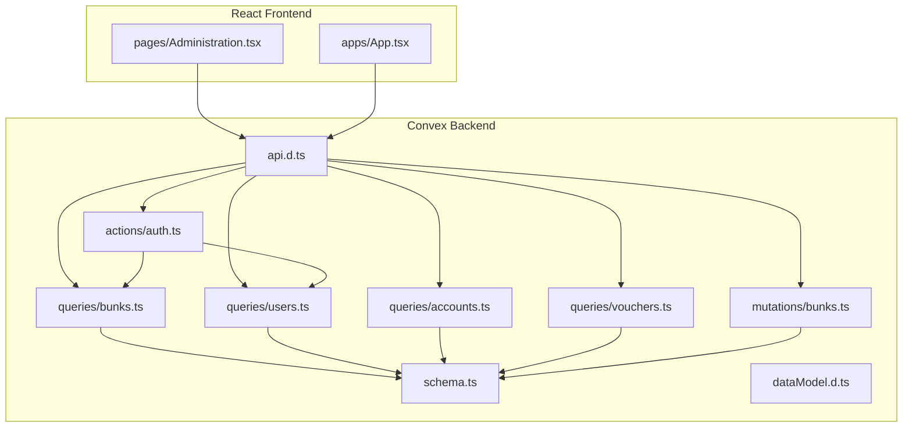
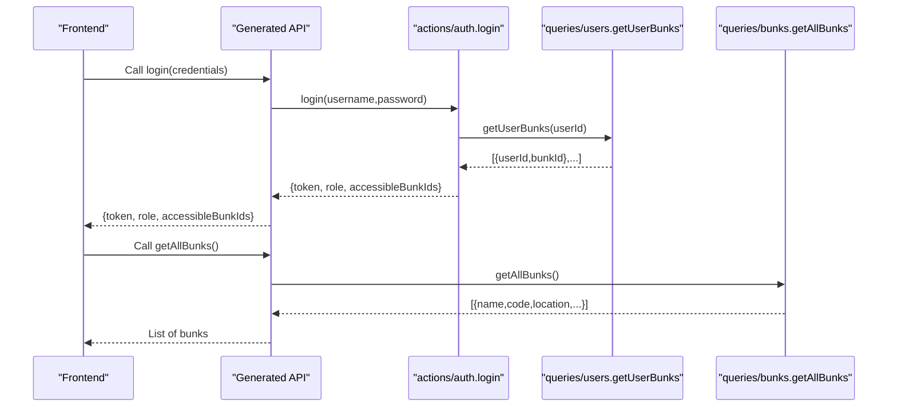
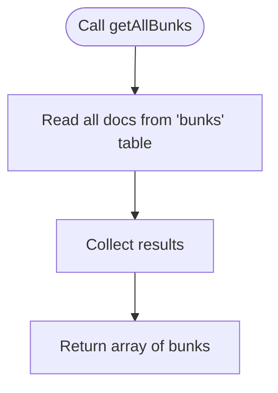
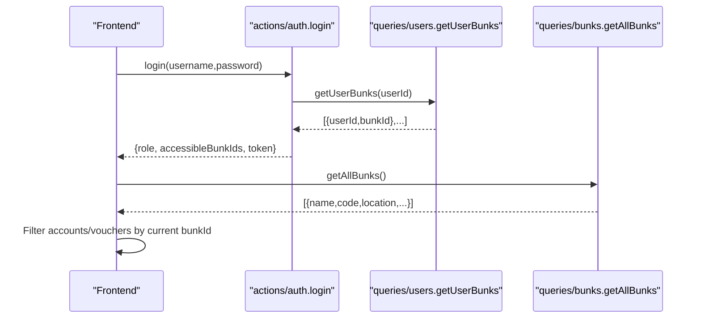
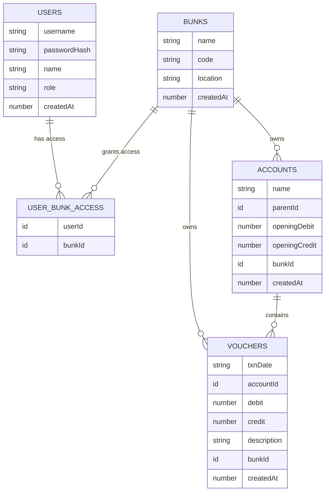
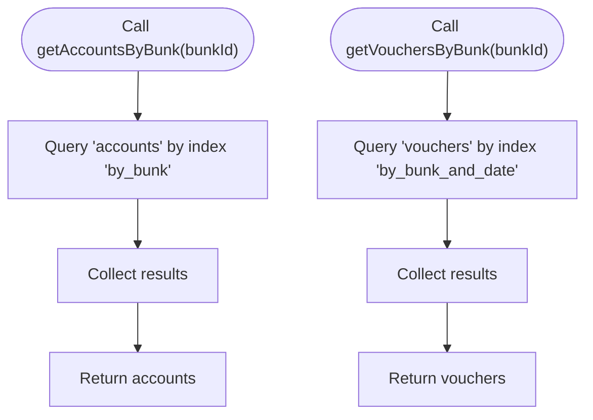
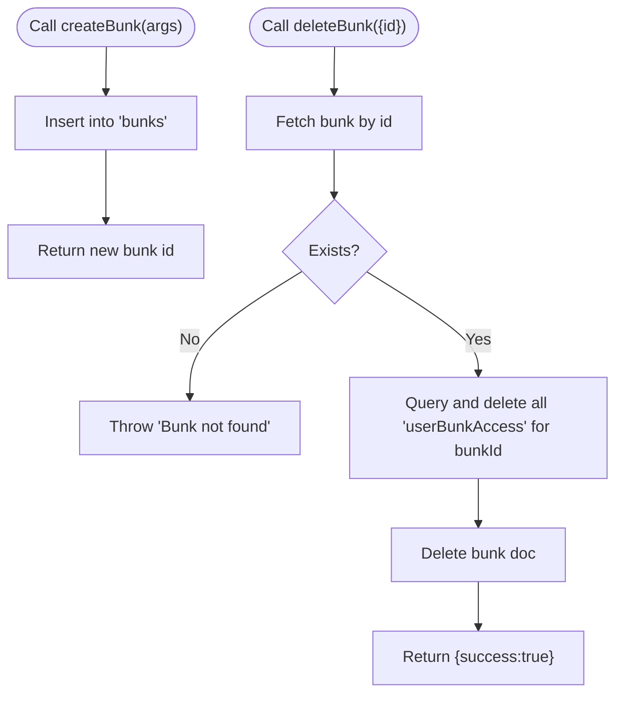
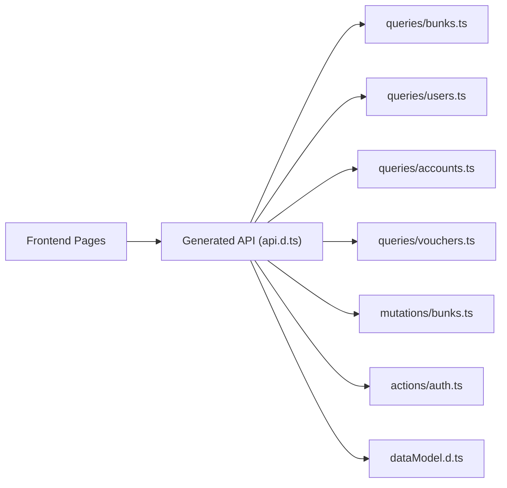

# Bunk Queries

<cite>
**Referenced Files in This Document**
- [schema.ts](file://convex/schema.ts)
- [bunks.ts](file://convex/queries/bunks.ts)
- [bunks.ts](file://convex/mutations/bunks.ts)
- [users.ts](file://convex/queries/users.ts)
- [accounts.ts](file://convex/queries/accounts.ts)
- [vouchers.ts](file://convex/queries/vouchers.ts)
- [auth.ts](file://convex/actions/auth.ts)
- [api.d.ts](file://convex/_generated/api.d.ts)
- [dataModel.d.ts](file://convex/_generated/dataModel.d.ts)
- [Administration.tsx](file://apps/pages/Administration.tsx)
- [App.tsx](file://apps/App.tsx)
</cite>

## Table of Contents
1. [Introduction](#introduction)
2. [Project Structure](#project-structure)
3. [Core Components](#core-components)
4. [Architecture Overview](#architecture-overview)
5. [Detailed Component Analysis](#detailed-component-analysis)
6. [Dependency Analysis](#dependency-analysis)
7. [Performance Considerations](#performance-considerations)
8. [Troubleshooting Guide](#troubleshooting-guide)
9. [Conclusion](#conclusion)

## Introduction
This document provides detailed API documentation for bunk/location query endpoints that support multi-location management operations. It focuses on:
- Listing bunks and filtering by location and administrative permissions
- Administrative access validation via JWT and user-to-bunk access mapping
- Data relationships among bunks, users, accounts, and transactions
- Examples of location-specific filtering, cross-location reporting, and access verification
- Performance optimization strategies for geographic filtering and location-based retrieval
- Security and multi-location data isolation patterns

## Project Structure
The system is built with Convex backend functions and a React frontend:
- Backend: Queries, mutations, and actions under convex/
- Frontend: Pages and components under apps/
- Generated API types under convex/_generated/

**Diagram sources**
- [schema.ts](file://convex/schema.ts#L9-L84)
- [bunks.ts](file://convex/queries/bunks.ts#L11-L15)
- [users.ts](file://convex/queries/users.ts#L4-L34)
- [accounts.ts](file://convex/queries/accounts.ts#L4-L18)
- [vouchers.ts](file://convex/queries/vouchers.ts#L4-L18)
- [bunks.ts](file://convex/mutations/bunks.ts#L4-L36)
- [auth.ts](file://convex/actions/auth.ts#L31-L81)
- [api.d.ts](file://convex/_generated/api.d.ts#L85-L153)
- [dataModel.d.ts](file://convex/_generated/dataModel.d.ts#L11-L61)
- [Administration.tsx](file://apps/pages/Administration.tsx#L32-L40)
- [App.tsx](file://apps/App.tsx#L95-L144)

**Section sources**
- [schema.ts](file://convex/schema.ts#L9-L84)
- [api.d.ts](file://convex/_generated/api.d.ts#L85-L153)

## Core Components
- Bunk listing query: Retrieves all bunks with name, code, location, and creation timestamp.
- User-to-bunk access mapping: Maintains per-user authorized bunk IDs.
- JWT-based authentication: Provides role and accessible bunk IDs to enforce access control.
- Location-aware downstream queries: Accounts and vouchers are filtered by bunk ID.

Key implementation references:
- Bunk listing query: [getAllBunks](file://convex/queries/bunks.ts#L11-L15)
- User access lookup: [getUserBunks](file://convex/queries/users.ts#L14-L22)
- JWT login returning accessible bunk IDs: [login](file://convex/actions/auth.ts#L31-L81)
- Bunk-to-account relationship: [getAccountsByBunk](file://convex/queries/accounts.ts#L4-L12)
- Bunk-to-voucher relationship: [getVouchersByBunk](file://convex/queries/vouchers.ts#L4-L12)

**Section sources**
- [bunks.ts](file://convex/queries/bunks.ts#L11-L15)
- [users.ts](file://convex/queries/users.ts#L14-L22)
- [auth.ts](file://convex/actions/auth.ts#L31-L81)
- [accounts.ts](file://convex/queries/accounts.ts#L4-L12)
- [vouchers.ts](file://convex/queries/vouchers.ts#L4-L12)

## Architecture Overview
The bunk query architecture enforces multi-location access control through:
- JWT payload containing role and accessible bunk IDs
- Frontend filtering of accounts and vouchers by current bunk ID
- Backend indexing on bunks, user-bunk access, accounts, and vouchers

**Diagram sources**
- [auth.ts](file://convex/actions/auth.ts#L31-L81)
- [users.ts](file://convex/queries/users.ts#L14-L22)
- [bunks.ts](file://convex/queries/bunks.ts#L11-L15)

## Detailed Component Analysis

### Bunk Listing Query
Purpose:
- Retrieve all bunks for administrative display and selection.

Behavior:
- No filtering parameters exposed in the current implementation.
- Returns name, code, location, and createdAt.

Usage:
- Called by frontend administration page to render station cards.

References:
- [getAllBunks](file://convex/queries/bunks.ts#L11-L15)

**Diagram sources**
- [bunks.ts](file://convex/queries/bunks.ts#L11-L15)

**Section sources**
- [bunks.ts](file://convex/queries/bunks.ts#L11-L15)

### Administrative Access Validation
Purpose:
- Enforce multi-location access by validating JWT claims and user-access mapping.

Components:
- JWT login returns role and accessibleBunkIds.
- Frontend stores current bunk ID and filters accounts/vouchers accordingly.
- Backend downstream queries filter by bunk ID.

References:
- [login](file://convex/actions/auth.ts#L31-L81)
- [getUserBunks](file://convex/queries/users.ts#L14-L22)
- [App.tsx](file://apps/App.tsx#L95-L144)

**Diagram sources**
- [auth.ts](file://convex/actions/auth.ts#L31-L81)
- [users.ts](file://convex/queries/users.ts#L14-L22)
- [bunks.ts](file://convex/queries/bunks.ts#L11-L15)
- [App.tsx](file://apps/App.tsx#L95-L144)

**Section sources**
- [auth.ts](file://convex/actions/auth.ts#L31-L81)
- [users.ts](file://convex/queries/users.ts#L14-L22)
- [App.tsx](file://apps/App.tsx#L95-L144)

### Data Relationships: Bunks, Users, Accounts, Vouchers
Relationships:
- Bunks ↔ Users: Many-to-many via userBunkAccess
- Bunks → Accounts: One-to-many via bunkId
- Bunks → Vouchers: One-to-many via bunkId

Indexes:
- bunks: by_code(code)
- users: by_username(username)
- userBunkAccess: by_user(userId), by_bunk(bunkId), by_user_and_bunk(userId,bunkId)
- accounts: by_bunk(bunkId), by_parent(parentId)
- vouchers: by_bunk_and_date(bunkId,txnDate), by_account(accountId)

References:
- [schema.ts](file://convex/schema.ts#L13-L69)
- [accounts.ts](file://convex/queries/accounts.ts#L4-L12)
- [vouchers.ts](file://convex/queries/vouchers.ts#L4-L12)

**Diagram sources**
- [schema.ts](file://convex/schema.ts#L13-L69)

**Section sources**
- [schema.ts](file://convex/schema.ts#L13-L69)
- [accounts.ts](file://convex/queries/accounts.ts#L4-L12)
- [vouchers.ts](file://convex/queries/vouchers.ts#L4-L12)

### Downstream Queries: Accounts and Vouchers by Bunk
Purpose:
- Provide location-specific financial data for a given bunk.

Behavior:
- Accounts: filter by bunkId using index by_bunk
- Vouchers: filter by bunkId using index by_bunk_and_date

References:
- [getAccountsByBunk](file://convex/queries/accounts.ts#L4-L12)
- [getVouchersByBunk](file://convex/queries/vouchers.ts#L4-L12)

**Diagram sources**
- [accounts.ts](file://convex/queries/accounts.ts#L4-L12)
- [vouchers.ts](file://convex/queries/vouchers.ts#L4-L12)

**Section sources**
- [accounts.ts](file://convex/queries/accounts.ts#L4-L12)
- [vouchers.ts](file://convex/queries/vouchers.ts#L4-L12)

### Administrative Operations: Create/Delete Bunk
Purpose:
- Manage bunk lifecycle and maintain access integrity.

Behavior:
- Create: Insert new bunk with name, code, location, createdAt
- Delete: Remove bunk and cascade-delete related userBunkAccess records

References:
- [createBunk](file://convex/mutations/bunks.ts#L4-L18)
- [deleteBunk](file://convex/mutations/bunks.ts#L20-L36)

**Diagram sources**
- [bunks.ts](file://convex/mutations/bunks.ts#L4-L36)

**Section sources**
- [bunks.ts](file://convex/mutations/bunks.ts#L4-L36)

### Frontend Integration Examples
- Administration page renders all bunks and allows adding/deleting bunks.
- App page filters accounts and vouchers by current bunk ID.

References:
- [Administration.tsx](file://apps/pages/Administration.tsx#L32-L40)
- [App.tsx](file://apps/App.tsx#L95-L144)

**Section sources**
- [Administration.tsx](file://apps/pages/Administration.tsx#L32-L40)
- [App.tsx](file://apps/App.tsx#L95-L144)

## Dependency Analysis
- Generated API types expose all queries/mutations/actions for client-side consumption.
- Runtime types define Convex document IDs and table names.
- Frontend components depend on generated API references.

**Diagram sources**
- [api.d.ts](file://convex/_generated/api.d.ts#L85-L153)
- [dataModel.d.ts](file://convex/_generated/dataModel.d.ts#L11-L61)

**Section sources**
- [api.d.ts](file://convex/_generated/api.d.ts#L85-L153)
- [dataModel.d.ts](file://convex/_generated/dataModel.d.ts#L11-L61)

## Performance Considerations
- Index usage:
  - bunks.by_code for station code lookups
  - users.by_username for login
  - userBunkAccess.by_user, by_bunk, by_user_and_bunk for access checks
  - accounts.by_bunk for account filtering
  - vouchers.by_bunk_and_date for transaction filtering
- Geographic filtering:
  - Current schema does not include spatial indexes or coordinates.
  - Location filtering is string-based (location field).
  - Recommendation: Introduce spatial indexes or coordinate fields if precise geo-filtering is required.
- Cross-location reporting:
  - Aggregate across bunks by fetching all bunks and iterating client-side (as seen in frontend filtering).
  - For large datasets, consider server-side aggregation or materialized summaries.
- Multi-location data isolation:
  - Enforce access via JWT accessibleBunkIds and frontend filtering.
  - Ensure all downstream reads (accounts, vouchers) filter by bunkId.

[No sources needed since this section provides general guidance]

## Troubleshooting Guide
Common issues and resolutions:
- Invalid username or password during login:
  - Thrown when user not found or bcrypt comparison fails.
  - Reference: [login](file://convex/actions/auth.ts#L31-L81)
- Bunk not found on deletion:
  - deleteBunk throws error if bunk does not exist.
  - Reference: [deleteBunk](file://convex/mutations/bunks.ts#L20-L36)
- Access denied:
  - Ensure JWT role and accessibleBunkIds are validated before rendering sensitive data.
  - References: [login](file://convex/actions/auth.ts#L31-L81), [getUserBunks](file://convex/queries/users.ts#L14-L22)
- Downstream data mismatch:
  - Verify that accounts and vouchers are filtered by bunkId.
  - References: [getAccountsByBunk](file://convex/queries/accounts.ts#L4-L12), [getVouchersByBunk](file://convex/queries/vouchers.ts#L4-L12)

**Section sources**
- [auth.ts](file://convex/actions/auth.ts#L31-L81)
- [bunks.ts](file://convex/mutations/bunks.ts#L20-L36)
- [users.ts](file://convex/queries/users.ts#L14-L22)
- [accounts.ts](file://convex/queries/accounts.ts#L4-L12)
- [vouchers.ts](file://convex/queries/vouchers.ts#L4-L12)

## Conclusion
The bunk/location query system provides a clear foundation for multi-location management:
- Bunk listing is straightforward and can be extended with filters.
- Administrative access is enforced via JWT and user-bunk access mapping.
- Downstream financial data is naturally scoped to a bunk via foreign keys and indexes.
- Security and isolation are achieved through role-based access and per-request filtering.
- Future enhancements can include spatial indexes, server-side aggregation, and expanded filtering parameters.