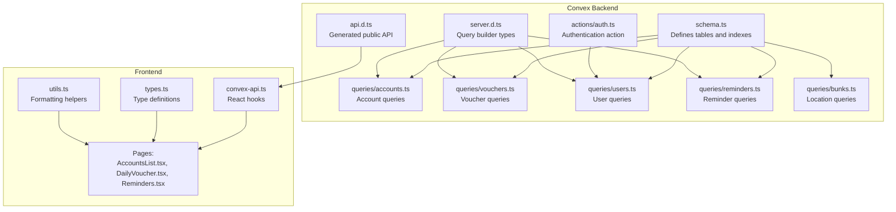
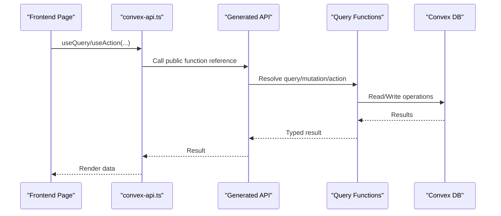
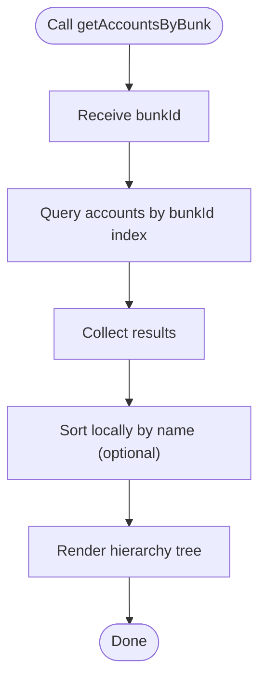
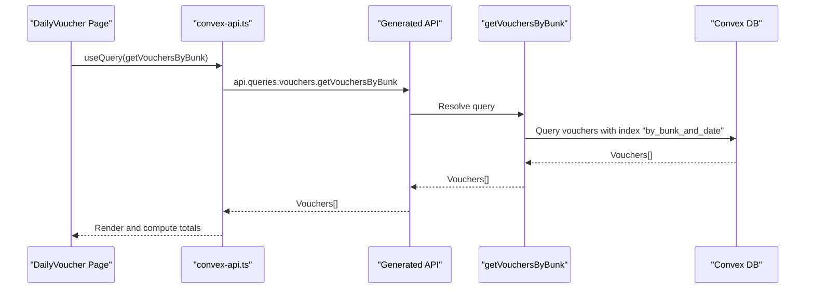
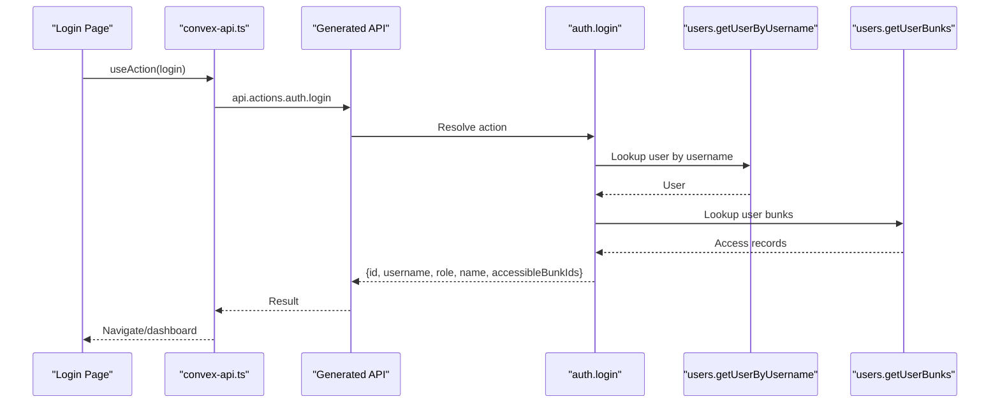
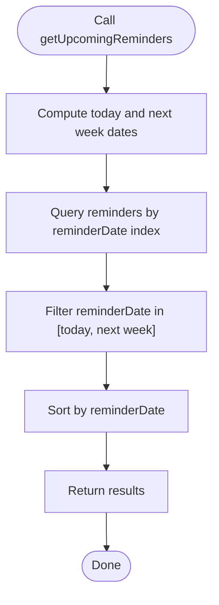
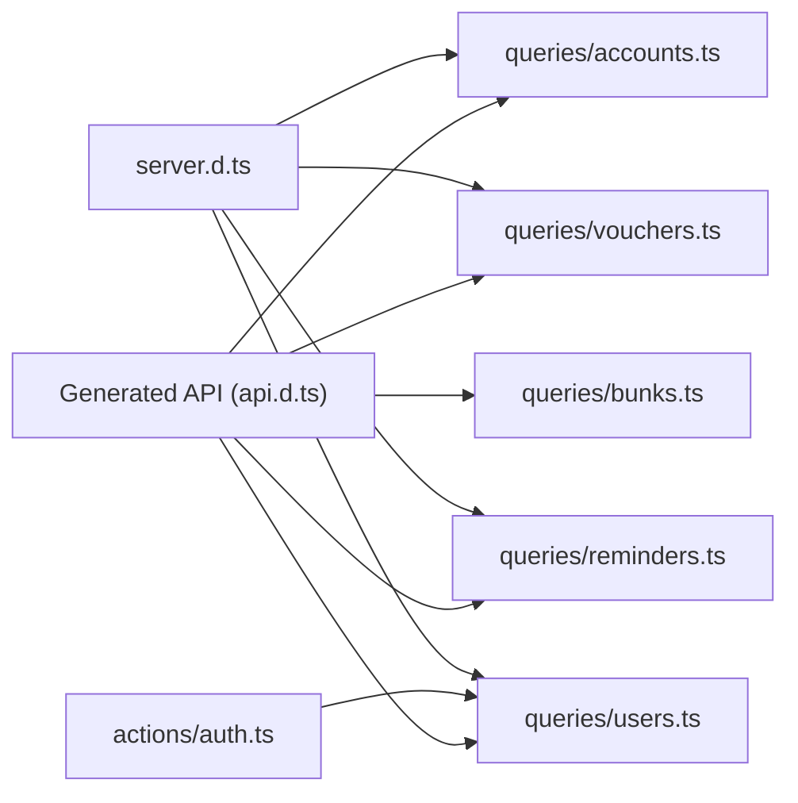

# Query API

<cite>
**Referenced Files in This Document**
- [schema.ts](file://convex/schema.ts)
- [accounts.ts](file://convex/queries/accounts.ts)
- [vouchers.ts](file://convex/queries/vouchers.ts)
- [users.ts](file://convex/queries/users.ts)
- [reminders.ts](file://convex/queries/reminders.ts)
- [bunks.ts](file://convex/queries/bunks.ts)
- [auth.ts](file://convex/actions/auth.ts)
- [api.d.ts](file://convex/_generated/api.d.ts)
- [server.d.ts](file://convex/_generated/server.d.ts)
- [convex-api.ts](file://apps/convex-api.ts)
- [types.ts](file://apps/types.ts)
- [utils.ts](file://apps/utils.ts)
- [AccountsList.tsx](file://apps/pages/AccountsList.tsx)
- [DailyVoucher.tsx](file://apps/pages/DailyVoucher.tsx)
- [Reminders.tsx](file://apps/pages/Reminders.tsx)
</cite>

## Table of Contents
1. [Introduction](#introduction)
2. [Project Structure](#project-structure)
3. [Core Components](#core-components)
4. [Architecture Overview](#architecture-overview)
5. [Detailed Component Analysis](#detailed-component-analysis)
6. [Dependency Analysis](#dependency-analysis)
7. [Performance Considerations](#performance-considerations)
8. [Troubleshooting Guide](#troubleshooting-guide)
9. [Conclusion](#conclusion)
10. [Appendices](#appendices)

## Introduction
This document provides comprehensive API documentation for the KR-FUELS query endpoints that power data retrieval and reporting. It covers:
- Account queries: hierarchical account listing, opening balances, and group filtering
- Voucher queries: transaction history retrieval, daily voucher listings, and financial statement generation
- User queries: user listing, role-based filtering, and location-specific access
- Reminder queries: due date filtering, status tracking, and activity monitoring

It also documents query parameter specifications, filtering options, sorting capabilities, pagination support, performance optimization techniques, indexing strategies, result formatting, security considerations, and practical examples.

## Project Structure
The API is implemented using Convex with TypeScript. The backend defines typed queries and mutations, while the frontend integrates with Convex via generated bindings and custom hooks.

**Diagram sources**
- [schema.ts](file://convex/schema.ts#L1-L85)
- [accounts.ts](file://convex/queries/accounts.ts#L1-L19)
- [vouchers.ts](file://convex/queries/vouchers.ts#L1-L19)
- [users.ts](file://convex/queries/users.ts#L1-L35)
- [reminders.ts](file://convex/queries/reminders.ts#L1-L71)
- [bunks.ts](file://convex/queries/bunks.ts#L1-L16)
- [auth.ts](file://convex/actions/auth.ts#L1-L51)
- [api.d.ts](file://convex/_generated/api.d.ts#L1-L76)
- [server.d.ts](file://convex/_generated/server.d.ts#L1-L138)
- [convex-api.ts](file://apps/convex-api.ts#L1-L33)
- [types.ts](file://apps/types.ts#L1-L56)
- [utils.ts](file://apps/utils.ts#L1-L69)
- [AccountsList.tsx](file://apps/pages/AccountsList.tsx#L1-L254)
- [DailyVoucher.tsx](file://apps/pages/DailyVoucher.tsx#L1-L336)
- [Reminders.tsx](file://apps/pages/Reminders.tsx#L1-L388)

**Section sources**
- [schema.ts](file://convex/schema.ts#L1-L85)
- [api.d.ts](file://convex/_generated/api.d.ts#L1-L76)
- [server.d.ts](file://convex/_generated/server.d.ts#L1-L138)
- [convex-api.ts](file://apps/convex-api.ts#L1-L33)

## Core Components
- Account queries
  - getAccountsByBunk: Retrieve accounts filtered by location
  - getAllAccounts: Retrieve all accounts
- Voucher queries
  - getVouchersByBunk: Retrieve vouchers filtered by location
  - getAllVouchers: Retrieve all vouchers
- User queries
  - getUserByUsername: Lookup user by username
  - getUserBunks: Retrieve user’s location access
  - getAllUsers: Retrieve all users
  - getAllUserBunkAccess: Retrieve all user-location mappings
- Reminder queries
  - getAllReminders: Retrieve all reminders (sorted by due date)
  - getUpcomingReminders: Upcoming reminders within a time window
  - getOverdueReminders: Overdue reminders
- Location queries
  - getAllBunks: Retrieve all locations

These queries are typed and exposed via the generated public API and consumed by React hooks.

**Section sources**
- [accounts.ts](file://convex/queries/accounts.ts#L1-L19)
- [vouchers.ts](file://convex/queries/vouchers.ts#L1-L19)
- [users.ts](file://convex/queries/users.ts#L1-L35)
- [reminders.ts](file://convex/queries/reminders.ts#L1-L71)
- [bunks.ts](file://convex/queries/bunks.ts#L1-L16)
- [api.d.ts](file://convex/_generated/api.d.ts#L32-L47)
- [convex-api.ts](file://apps/convex-api.ts#L1-L33)

## Architecture Overview
The frontend uses Convex React hooks to call public queries. Authentication is handled by an action that validates credentials and returns accessible locations for the user.

**Diagram sources**
- [convex-api.ts](file://apps/convex-api.ts#L1-L33)
- [api.d.ts](file://convex/_generated/api.d.ts#L57-L73)
- [server.d.ts](file://convex/_generated/server.d.ts#L32-L96)

## Detailed Component Analysis

### Account Queries
Purpose: Retrieve chart-of-accounts data with hierarchical grouping and per-location filtering.

Available endpoints:
- GET accounts by location
  - Path: api.queries.accounts.getAccountsByBunk
  - Arguments:
    - bunkId: string (Convex ID)
  - Sorting: Not applied in query; clients may sort locally
  - Filtering: by bunkId via index
  - Pagination: Not supported; returns all matching records
  - Example usage: AccountsList page renders grouped accounts and computes balances
- GET all accounts
  - Path: api.queries.accounts.getAllAccounts
  - Arguments: none
  - Sorting: Not applied in query; clients may sort locally
  - Filtering: none
  - Pagination: Not supported; returns all records

Key behaviors:
- Hierarchical rendering: Parent-child relationships are computed client-side using parentId
- Balance calculation: Opening balances are summed recursively for groups
- Local filtering/search: AccountsList applies a case-insensitive search on account names

Practical examples:
- Listing accounts for a specific location: Pass the bunk ID to getAccountsByBunk
- Building a hierarchy tree: Use parentId to build nested rows
- Computing group totals: Sum openingDebit/openingCredit for all descendants

**Diagram sources**
- [accounts.ts](file://convex/queries/accounts.ts#L4-L12)
- [AccountsList.tsx](file://apps/pages/AccountsList.tsx#L70-L127)

**Section sources**
- [accounts.ts](file://convex/queries/accounts.ts#L1-L19)
- [AccountsList.tsx](file://apps/pages/AccountsList.tsx#L1-L254)
- [utils.ts](file://apps/utils.ts#L66-L69)

### Voucher Queries
Purpose: Retrieve transaction history and daily voucher lists for financial reporting.

Available endpoints:
- GET vouchers by location
  - Path: api.queries.vouchers.getVouchersByBunk
  - Arguments:
    - bunkId: string (Convex ID)
  - Sorting: Not applied in query; clients may sort locally
  - Filtering: by bunkId via compound index (bunkId, txnDate)
  - Pagination: Not supported; returns all matching records
  - Example usage: DailyVoucher page loads posted transactions for a selected date
- GET all vouchers
  - Path: api.queries.vouchers.getAllVouchers
  - Arguments: none
  - Sorting: Not applied in query; clients may sort locally
  - Filtering: none
  - Pagination: Not supported; returns all records

Key behaviors:
- Transaction aggregation: DailyVoucher computes totals and closing balance
- Periodic ledger generation: utils.calculateLedger builds a ledger for a date range
- Local filtering: Frontend filters by date and merges posted/unposted rows

Practical examples:
- Daily transaction listing: Filter by bunkId and date
- Financial statements: Use utils.calculateLedger to compute per-account balances over a period
- Batch posting: Merge posted rows with new rows for the selected date

**Diagram sources**
- [vouchers.ts](file://convex/queries/vouchers.ts#L4-L12)
- [DailyVoucher.tsx](file://apps/pages/DailyVoucher.tsx#L152-L159)
- [utils.ts](file://apps/utils.ts#L27-L64)

**Section sources**
- [vouchers.ts](file://convex/queries/vouchers.ts#L1-L19)
- [DailyVoucher.tsx](file://apps/pages/DailyVoucher.tsx#L1-L336)
- [utils.ts](file://apps/utils.ts#L27-L64)

### User Queries
Purpose: Manage user listing, role-based filtering, and location-specific access.

Available endpoints:
- GET user by username
  - Path: api.queries.users.getUserByUsername
  - Arguments:
    - username: string
  - Sorting: Not applicable
  - Filtering: by unique username via index
  - Pagination: Not applicable; unique result
- GET user’s accessible locations
  - Path: api.queries.users.getUserBunks
  - Arguments:
    - userId: string (Convex ID)
  - Sorting: Not applicable
  - Filtering: by userId via index
  - Pagination: Not applicable; returns all mappings
- GET all users
  - Path: api.queries.users.getAllUsers
  - Arguments: none
  - Sorting: Not applicable
  - Filtering: none
  - Pagination: Not applicable; returns all records
- GET all user-location mappings
  - Path: api.queries.users.getAllUserBunkAccess
  - Arguments: none
  - Sorting: Not applicable
  - Filtering: none
  - Pagination: Not applicable; returns all records

Authentication integration:
- The login action retrieves accessible bunks for a validated user and returns role, name, and accessible bunk IDs

Practical examples:
- Login flow: Use getUserByUsername to validate credentials, then getUserBunks to determine access
- Role-based UI: Super admin sees full system; branch admin sees only authorized bunks
- User administration: Use getAllUsers and getAllUserBunkAccess to manage permissions

**Diagram sources**
- [auth.ts](file://convex/actions/auth.ts#L18-L51)
- [users.ts](file://convex/queries/users.ts#L4-L22)
- [convex-api.ts](file://apps/convex-api.ts#L7-L11)

**Section sources**
- [users.ts](file://convex/queries/users.ts#L1-L35)
- [auth.ts](file://convex/actions/auth.ts#L1-L51)
- [convex-api.ts](file://apps/convex-api.ts#L1-L33)

### Reminder Queries
Purpose: Retrieve reminders with due-date and status-based filtering for task management.

Available endpoints:
- GET all reminders
  - Path: api.queries.reminders.getAllReminders
  - Arguments: none
  - Sorting: Ascending by dueDate
  - Filtering: none
  - Pagination: Not applicable; returns all records
- GET upcoming reminders
  - Path: api.queries.reminders.getUpcomingReminders
  - Arguments: none
  - Sorting: Ascending by reminderDate
  - Filtering: reminderDate within today and next week
  - Pagination: Not applicable; returns filtered subset
- GET overdue reminders
  - Path: api.queries.reminders.getOverdueReminders
  - Arguments: none
  - Sorting: Ascending by dueDate
  - Filtering: dueDate before today
  - Pagination: Not applicable; returns filtered subset

Practical examples:
- Dashboard widgets: Show upcoming and overdue counts
- Task lists: Render all reminders sorted by due date
- Status monitoring: Use overdue to highlight urgent tasks

**Diagram sources**
- [reminders.ts](file://convex/queries/reminders.ts#L33-L50)

**Section sources**
- [reminders.ts](file://convex/queries/reminders.ts#L1-L71)
- [Reminders.tsx](file://apps/pages/Reminders.tsx#L1-L388)

### Location Queries
Purpose: Retrieve fuel station locations for selection and access control.

Available endpoints:
- GET all locations
  - Path: api.queries.bunks.getAllBunks
  - Arguments: none
  - Sorting: Not applied in query; clients may sort locally
  - Filtering: none
  - Pagination: Not applicable; returns all records

Practical examples:
- Location dropdowns: Populate selection controls
- Access checks: Combine with user queries to enforce cross-location restrictions

**Section sources**
- [bunks.ts](file://convex/queries/bunks.ts#L1-L16)

## Dependency Analysis
The public API is generated and exposes only public functions. Query builders and types are provided for strong typing. Authentication depends on user queries to resolve accessible locations.

**Diagram sources**
- [api.d.ts](file://convex/_generated/api.d.ts#L32-L47)
- [server.d.ts](file://convex/_generated/server.d.ts#L32-L96)
- [accounts.ts](file://convex/queries/accounts.ts#L1-L19)
- [vouchers.ts](file://convex/queries/vouchers.ts#L1-L19)
- [users.ts](file://convex/queries/users.ts#L1-L35)
- [reminders.ts](file://convex/queries/reminders.ts#L1-L71)
- [bunks.ts](file://convex/queries/bunks.ts#L1-L16)
- [auth.ts](file://convex/actions/auth.ts#L1-L51)

**Section sources**
- [api.d.ts](file://convex/_generated/api.d.ts#L1-L76)
- [server.d.ts](file://convex/_generated/server.d.ts#L1-L138)

## Performance Considerations
- Index usage
  - accounts: by_bunk (location filtering), by_parent (hierarchical traversal)
  - vouchers: by_bunk_and_date (location + date filtering)
  - users: by_username (unique lookup)
  - reminders: by_due_date, by_reminder_date (status/time filtering)
- Query patterns
  - Prefer index-backed filters (bunkId, username) to avoid full scans
  - Compound indexes enable efficient location-and-date queries
- Sorting
  - Some queries apply order/sort in the database; others rely on client-side sorting
- Pagination
  - Current queries return full collections; consider adding limit/offset or cursor-based pagination for large datasets
- Computation offloading
  - Hierarchical rendering and ledger calculations are performed client-side; cache results when feasible

[No sources needed since this section provides general guidance]

## Troubleshooting Guide
Common issues and resolutions:
- Invalid username or password during login
  - Symptom: Error thrown by auth.login
  - Resolution: Verify username exists and password matches hash
- Empty account list for a location
  - Symptom: getAccountsByBunk returns [] for a valid bunkId
  - Resolution: Confirm accounts exist under that bunkId; check index usage
- Missing vouchers for a date
  - Symptom: getVouchersByBunk returns [] for a specific date
  - Resolution: Ensure txnDate matches the queried date and bunkId
- Incorrect reminder ordering
  - Symptom: getAllReminders not sorted by dueDate
  - Resolution: Use the provided query which sorts ascending by dueDate
- Overly broad user access
  - Symptom: Super admin sees unauthorized locations
  - Resolution: Verify userBunkAccess records and login action logic

**Section sources**
- [auth.ts](file://convex/actions/auth.ts#L29-L37)
- [accounts.ts](file://convex/queries/accounts.ts#L4-L12)
- [vouchers.ts](file://convex/queries/vouchers.ts#L4-L12)
- [reminders.ts](file://convex/queries/reminders.ts#L12-L27)

## Conclusion
The KR-FUELS query API provides a solid foundation for retrieving accounts, vouchers, users, reminders, and locations. It leverages Convex indexes for efficient filtering and exposes typed public functions for safe client consumption. For production, consider adding pagination, stricter authentication, and server-side sorting/filtering to scale effectively.

[No sources needed since this section summarizes without analyzing specific files]

## Appendices

### Query Parameter Specifications
- Accounts
  - getAccountsByBunk
    - bunkId: string (Convex ID)
- Vouchers
  - getVouchersByBunk
    - bunkId: string (Convex ID)
- Users
  - getUserByUsername
    - username: string
  - getUserBunks
    - userId: string (Convex ID)
- Reminders
  - getAllReminders: none
  - getUpcomingReminders: none
  - getOverdueReminders: none
- Locations
  - getAllBunks: none

**Section sources**
- [accounts.ts](file://convex/queries/accounts.ts#L4-L12)
- [vouchers.ts](file://convex/queries/vouchers.ts#L4-L12)
- [users.ts](file://convex/queries/users.ts#L4-L22)
- [reminders.ts](file://convex/queries/reminders.ts#L12-L71)
- [bunks.ts](file://convex/queries/bunks.ts#L11-L15)

### Filtering, Sorting, and Pagination
- Filtering
  - By location: accounts.bunkId, vouchers.bunkId
  - By username: users.username (unique)
  - By dates: reminders.reminderDate, reminders.dueDate
- Sorting
  - reminders.getAllReminders: ascending dueDate
  - reminders.getUpcomingReminders: ascending reminderDate
  - reminders.getOverdueReminders: ascending dueDate
  - Other queries: client-side sorting recommended
- Pagination
  - Not implemented; consider adding limit/offset or cursor-based pagination

**Section sources**
- [reminders.ts](file://convex/queries/reminders.ts#L12-L71)
- [accounts.ts](file://convex/queries/accounts.ts#L4-L12)
- [vouchers.ts](file://convex/queries/vouchers.ts#L4-L12)
- [users.ts](file://convex/queries/users.ts#L4-L22)

### Security and Access Control
- Authentication
  - Login action verifies credentials and returns accessible bunks
- Authorization
  - Cross-location filtering enforced by userBunkAccess
  - Role differentiation: super_admin vs admin with restricted access
- Recommendations
  - Enforce per-query access checks server-side
  - Add rate limiting and input validation
  - Audit sensitive operations

**Section sources**
- [auth.ts](file://convex/actions/auth.ts#L18-L51)
- [users.ts](file://convex/queries/users.ts#L14-L22)

### Practical Examples
- Account hierarchy
  - Use getAccountsByBunk with a bunkId; render parent-child relationships client-side
- Daily voucher listing
  - Use getVouchersByBunk with a bunkId and filter by date; merge with new rows for batch posting
- Financial statement
  - Use utils.calculateLedger to compute per-account balances for a date range
- Reminder dashboard
  - Use getAllReminders for a sorted list; use getUpcomingReminders/getOverdueReminders for widgets

**Section sources**
- [AccountsList.tsx](file://apps/pages/AccountsList.tsx#L70-L127)
- [DailyVoucher.tsx](file://apps/pages/DailyVoucher.tsx#L152-L159)
- [utils.ts](file://apps/utils.ts#L27-L64)
- [reminders.ts](file://convex/queries/reminders.ts#L12-L71)