# Reminder Queries

<cite>
**Referenced Files in This Document**
- [reminders.ts](file://convex/queries/reminders.ts)
- [reminders.ts](file://convex/mutations/reminders.ts)
- [schema.ts](file://convex/schema.ts)
- [convex-api.ts](file://apps/convex-api.ts)
- [Reminders.tsx](file://apps/pages/Reminders.tsx)
- [Dashboard.tsx](file://apps/pages/Dashboard.tsx)
- [types.ts](file://apps/types.ts)
- [utils.ts](file://apps/utils.ts)
</cite>

## Table of Contents
1. [Introduction](#introduction)
2. [Project Structure](#project-structure)
3. [Core Components](#core-components)
4. [Architecture Overview](#architecture-overview)
5. [Detailed Component Analysis](#detailed-component-analysis)
6. [Dependency Analysis](#dependency-analysis)
7. [Performance Considerations](#performance-considerations)
8. [Troubleshooting Guide](#troubleshooting-guide)
9. [Conclusion](#conclusion)
10. [Appendices](#appendices)

## Introduction
This document provides comprehensive API documentation for reminder and task management query endpoints. It focuses on:
- Listing reminders with due date filtering
- Identifying overdue reminders
- Filtering reminders by upcoming date ranges
- Understanding reminder data relationships with users and deadlines
- Explaining query parameters and data model fields
- Demonstrating task management workflows and activity monitoring patterns
- Outlining performance optimization strategies for date-based filtering and aggregation
- Addressing data validation, deadline calculation, and notification triggering patterns

## Project Structure
The reminder system spans Convex backend queries and mutations, a React frontend page, and shared types. The relevant files are organized as follows:
- Backend queries and schema define read operations and data model
- Mutations define write operations and validation
- Frontend exposes hooks and UI components that consume the backend APIs
- Shared types unify data shapes across the app

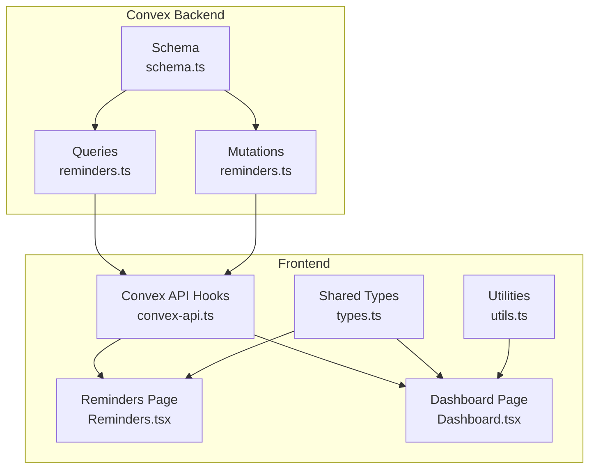

**Diagram sources**
- [reminders.ts](file://convex/queries/reminders.ts#L1-L71)
- [reminders.ts](file://convex/mutations/reminders.ts#L1-L116)
- [schema.ts](file://convex/schema.ts#L71-L84)
- [convex-api.ts](file://apps/convex-api.ts#L1-L35)
- [Reminders.tsx](file://apps/pages/Reminders.tsx#L1-L388)
- [Dashboard.tsx](file://apps/pages/Dashboard.tsx#L162-L219)
- [types.ts](file://apps/types.ts#L47-L56)
- [utils.ts](file://apps/utils.ts#L12-L18)

**Section sources**
- [reminders.ts](file://convex/queries/reminders.ts#L1-L71)
- [reminders.ts](file://convex/mutations/reminders.ts#L1-L116)
- [schema.ts](file://convex/schema.ts#L71-L84)
- [convex-api.ts](file://apps/convex-api.ts#L1-L35)
- [Reminders.tsx](file://apps/pages/Reminders.tsx#L1-L388)
- [Dashboard.tsx](file://apps/pages/Dashboard.tsx#L162-L219)
- [types.ts](file://apps/types.ts#L47-L56)
- [utils.ts](file://apps/utils.ts#L12-L18)

## Core Components
- Reminder data model: title, description, reminderDate, dueDate, createdBy, createdAt
- Query endpoints:
  - List all reminders
  - Upcoming reminders (next 7 days)
  - Overdue reminders
- Mutation endpoints:
  - Create reminder
  - Update reminder
  - Delete reminder
- Frontend hooks:
  - useReminders, useUpcomingReminders, useOverdueReminders
  - useCreateReminder, useUpdateReminder, useDeleteReminder

Key behaviors:
- Due date filtering uses date indices for efficient queries
- Reminder date filtering uses a dedicated index for upcoming reminders
- Validation enforces date format and presence of required fields
- Frontend computes statistics and displays reminders with due-date-aware sorting

**Section sources**
- [schema.ts](file://convex/schema.ts#L74-L83)
- [reminders.ts](file://convex/queries/reminders.ts#L12-L70)
- [reminders.ts](file://convex/mutations/reminders.ts#L12-L115)
- [convex-api.ts](file://apps/convex-api.ts#L14-L21)
- [Reminders.tsx](file://apps/pages/Reminders.tsx#L33-L37)

## Architecture Overview
The reminder query architecture consists of:
- Convex schema defining the reminders table and indexes
- Queries that leverage indexes for efficient date filtering
- Frontend hooks that expose query results to UI components
- UI pages that render reminders and compute active/upcoming counts

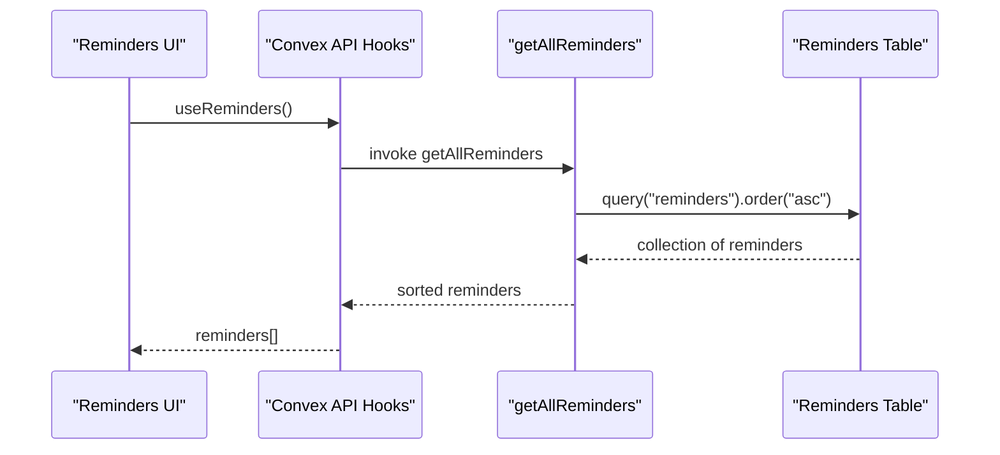

**Diagram sources**
- [convex-api.ts](file://apps/convex-api.ts#L16-L16)
- [reminders.ts](file://convex/queries/reminders.ts#L12-L27)
- [schema.ts](file://convex/schema.ts#L74-L83)

## Detailed Component Analysis

### Reminder Data Model
The reminders table defines the core fields and indexes used by queries:
- Fields: title, description, reminderDate (YYYY-MM-DD), dueDate (YYYY-MM-DD), createdBy, createdAt
- Indexes: by_due_date, by_reminder_date

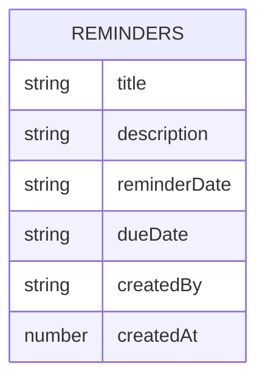

**Diagram sources**
- [schema.ts](file://convex/schema.ts#L74-L83)

**Section sources**
- [schema.ts](file://convex/schema.ts#L74-L83)

### Reminder Queries

#### getAllReminders
- Purpose: Retrieve all reminders and sort by dueDate ascending
- Behavior: Uses table order and client-side sort by dueDate
- Output: Array of reminders ordered by dueDate

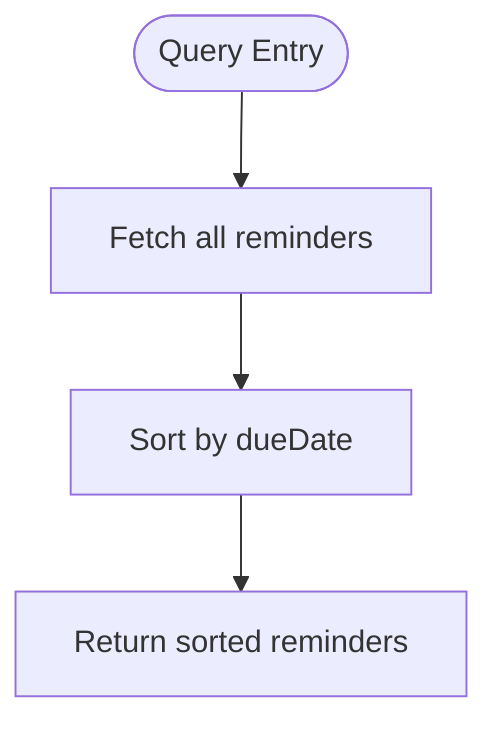

**Diagram sources**
- [reminders.ts](file://convex/queries/reminders.ts#L12-L27)

**Section sources**
- [reminders.ts](file://convex/queries/reminders.ts#L12-L27)

#### getUpcomingReminders
- Purpose: Retrieve reminders due within the next 7 days
- Behavior: Computes today and next week dates, queries by reminderDate index, filters by date range, sorts by reminderDate
- Output: Array of upcoming reminders

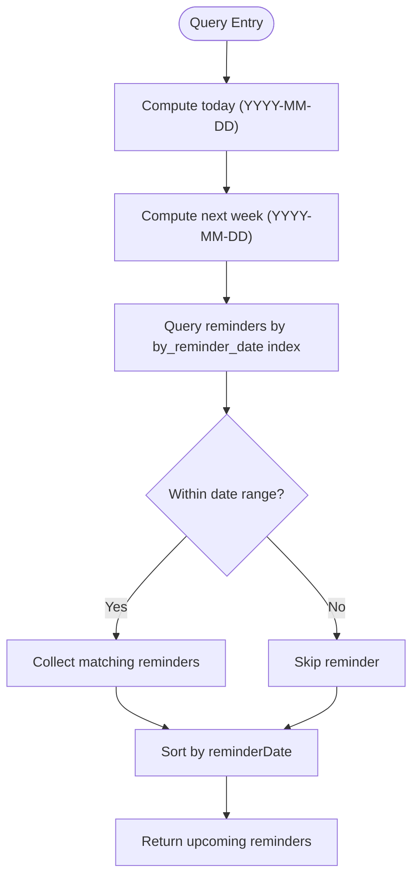

**Diagram sources**
- [reminders.ts](file://convex/queries/reminders.ts#L33-L49)
- [schema.ts](file://convex/schema.ts#L82-L83)

**Section sources**
- [reminders.ts](file://convex/queries/reminders.ts#L33-L49)

#### getOverdueReminders
- Purpose: Retrieve reminders whose dueDate is earlier than today
- Behavior: Computes today, queries by dueDate index, filters overdue, sorts by dueDate ascending
- Output: Array of overdue reminders

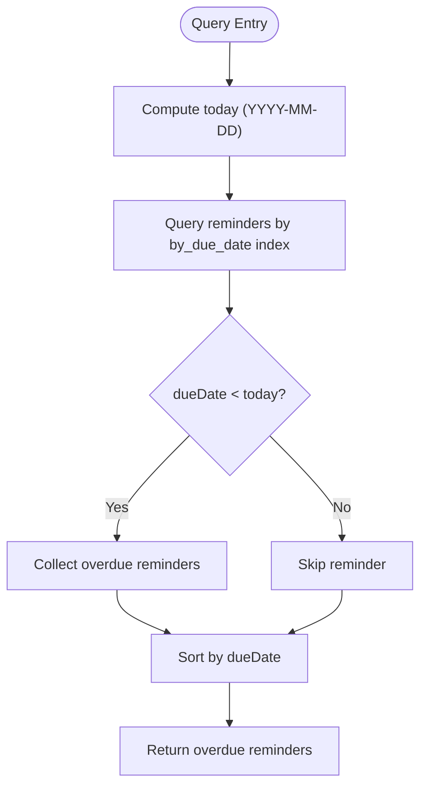

**Diagram sources**
- [reminders.ts](file://convex/queries/reminders.ts#L56-L69)
- [schema.ts](file://convex/schema.ts#L82-L83)

**Section sources**
- [reminders.ts](file://convex/queries/reminders.ts#L56-L69)

### Reminder Mutations

#### createReminder
- Purpose: Create a new reminder
- Validation:
  - Title required
  - reminderDate must match YYYY-MM-DD format
  - dueDate must match YYYY-MM-DD format
- Output: Newly created reminder record

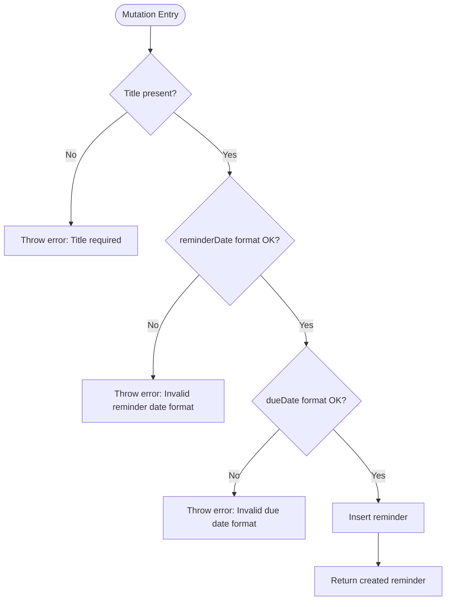

**Diagram sources**
- [reminders.ts](file://convex/mutations/reminders.ts#L19-L47)

**Section sources**
- [reminders.ts](file://convex/mutations/reminders.ts#L12-L48)

#### updateReminder
- Purpose: Update an existing reminder
- Validation:
  - Title required
  - reminderDate must match YYYY-MM-DD format
  - dueDate must match YYYY-MM-DD format
- Output: Updated reminder record

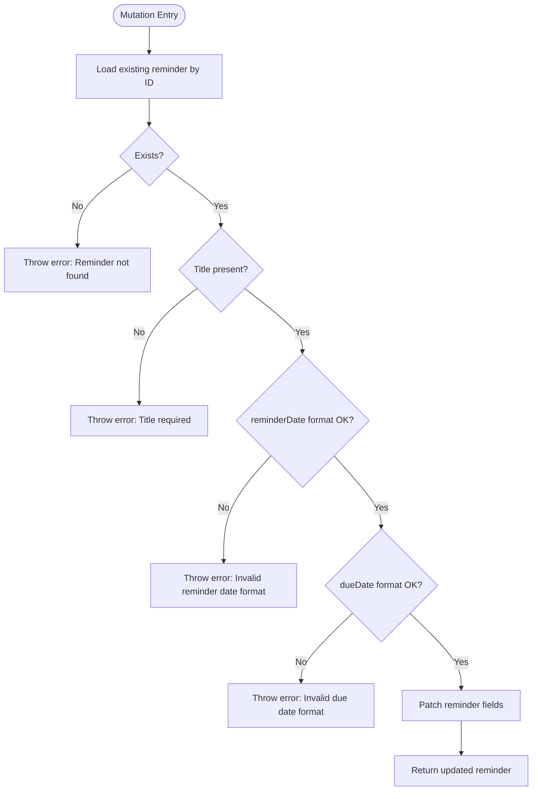

**Diagram sources**
- [reminders.ts](file://convex/mutations/reminders.ts#L61-L92)

**Section sources**
- [reminders.ts](file://convex/mutations/reminders.ts#L53-L93)

#### deleteReminder
- Purpose: Delete a reminder by ID
- Validation: Ensures reminder exists
- Output: Deletion result object

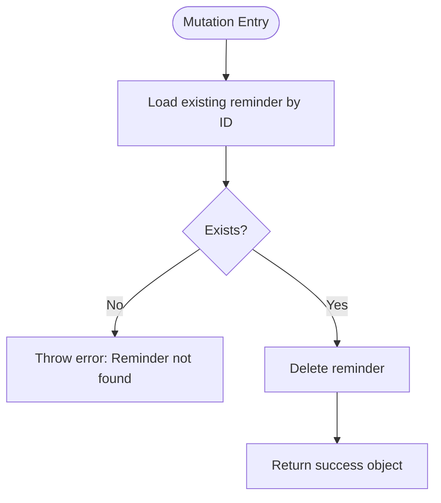

**Diagram sources**
- [reminders.ts](file://convex/mutations/reminders.ts#L102-L115)

**Section sources**
- [reminders.ts](file://convex/mutations/reminders.ts#L98-L116)

### Frontend Integration

#### Convex API Hooks
- Expose queries and mutations to React components
- Provide typed ConvexReminder shape for consumption

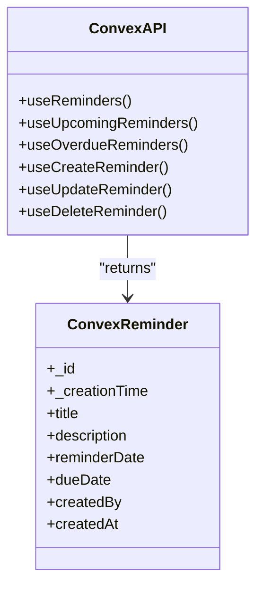

**Diagram sources**
- [convex-api.ts](file://apps/convex-api.ts#L14-L34)

**Section sources**
- [convex-api.ts](file://apps/convex-api.ts#L14-L34)
- [types.ts](file://apps/types.ts#L25-L34)

#### Reminders Page
- Displays all reminders in a table
- Computes statistics: total, active now, upcoming
- Provides forms to add/update reminders and delete confirmation

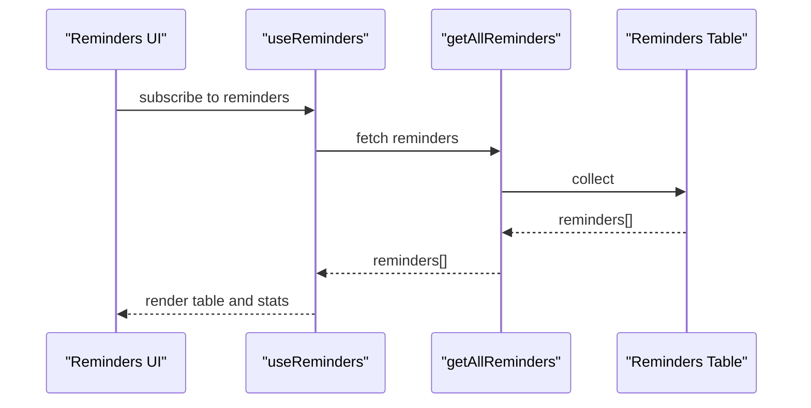

**Diagram sources**
- [Reminders.tsx](file://apps/pages/Reminders.tsx#L6-L10)
- [convex-api.ts](file://apps/convex-api.ts#L16-L16)
- [reminders.ts](file://convex/queries/reminders.ts#L12-L27)

**Section sources**
- [Reminders.tsx](file://apps/pages/Reminders.tsx#L33-L37)
- [Reminders.tsx](file://apps/pages/Reminders.tsx#L39-L60)

#### Dashboard Activity Monitoring
- Computes active reminders (reminderDate <= today AND dueDate >= today)
- Counts due-today reminders
- Renders a prioritized list with due-today highlighted

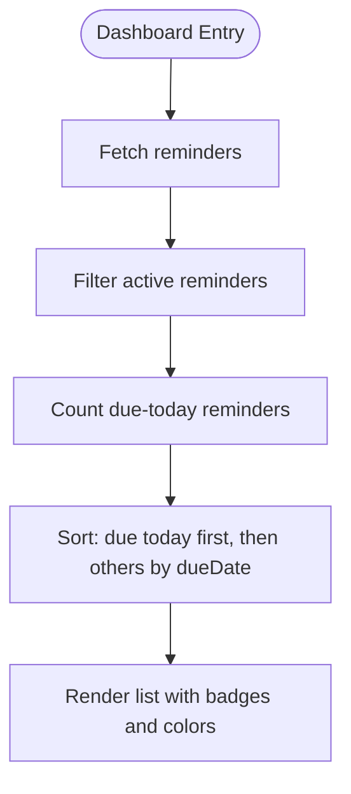

**Diagram sources**
- [Dashboard.tsx](file://apps/pages/Dashboard.tsx#L171-L211)
- [utils.ts](file://apps/utils.ts#L12-L18)

**Section sources**
- [Dashboard.tsx](file://apps/pages/Dashboard.tsx#L162-L219)
- [utils.ts](file://apps/utils.ts#L12-L18)

## Dependency Analysis
- Queries depend on:
  - Schema-defined indexes (by_due_date, by_reminder_date)
  - Client-side sorting by dueDate
- Mutations depend on:
  - Validation of date formats and required fields
  - CRUD operations on reminders table
- Frontend depends on:
  - Convex API hooks for data fetching and mutations
  - Shared types for type safety
  - Utilities for date formatting

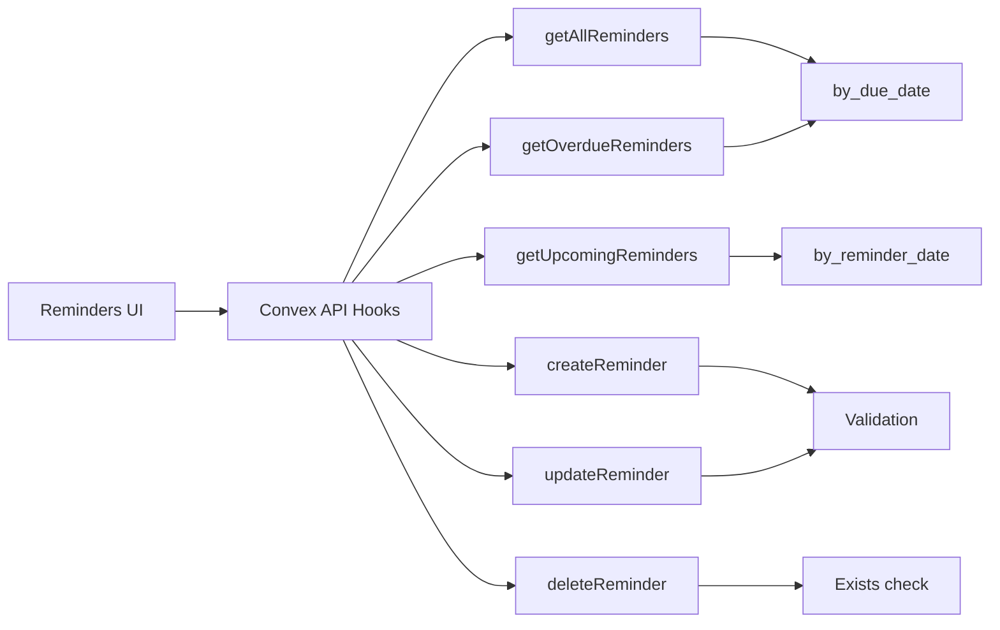

**Diagram sources**
- [reminders.ts](file://convex/queries/reminders.ts#L12-L70)
- [reminders.ts](file://convex/mutations/reminders.ts#L19-L115)
- [schema.ts](file://convex/schema.ts#L82-L83)
- [convex-api.ts](file://apps/convex-api.ts#L14-L21)
- [Reminders.tsx](file://apps/pages/Reminders.tsx#L6-L10)

**Section sources**
- [reminders.ts](file://convex/queries/reminders.ts#L12-L70)
- [reminders.ts](file://convex/mutations/reminders.ts#L19-L115)
- [schema.ts](file://convex/schema.ts#L82-L83)
- [convex-api.ts](file://apps/convex-api.ts#L14-L21)
- [Reminders.tsx](file://apps/pages/Reminders.tsx#L6-L10)

## Performance Considerations
- Index usage:
  - by_due_date: Used by getOverdueReminders to efficiently filter reminders whose dueDate is earlier than today
  - by_reminder_date: Used by getUpcomingReminders to efficiently filter reminders within the next 7 days
- Sorting:
  - getAllReminders performs client-side sorting by dueDate; consider adding server-side ordering by dueDate to reduce client work
- Aggregation:
  - Frontend computes active/upcoming counts; consider moving aggregation to the server for large datasets
- Date comparison:
  - Queries compare date strings lexicographically; ensure consistent date format (YYYY-MM-DD) to maintain correctness

[No sources needed since this section provides general guidance]

## Troubleshooting Guide
Common issues and resolutions:
- Invalid date format errors during creation or update:
  - Ensure reminderDate and dueDate follow YYYY-MM-DD format
- Reminder not found errors:
  - Verify the reminder ID exists before attempting updates or deletions
- Unexpected empty results:
  - Confirm date ranges and index usage align with expected data
- Sorting inconsistencies:
  - Ensure client-side sorting by dueDate is applied consistently

**Section sources**
- [reminders.ts](file://convex/mutations/reminders.ts#L23-L34)
- [reminders.ts](file://convex/mutations/reminders.ts#L65-L68)
- [reminders.ts](file://convex/queries/reminders.ts#L23-L25)
- [reminders.ts](file://convex/queries/reminders.ts#L46-L48)
- [reminders.ts](file://convex/queries/reminders.ts#L66-L68)

## Conclusion
The reminder system provides essential query and mutation capabilities for managing reminders with date-based filtering and overdue detection. By leveraging schema indexes and client-side sorting, it offers efficient retrieval and display of reminders. The frontend integrates these capabilities to support task management workflows and activity monitoring. Future enhancements can include server-side aggregation, additional filters (status, assignee), and richer notification triggers.

[No sources needed since this section summarizes without analyzing specific files]

## Appendices

### Reminder Query Parameters and Filters
- getAllReminders
  - No parameters
  - Returns all reminders sorted by dueDate ascending
- getUpcomingReminders
  - No parameters
  - Returns reminders whose reminderDate falls within today and next week
- getOverdueReminders
  - No parameters
  - Returns reminders whose dueDate is earlier than today

**Section sources**
- [reminders.ts](file://convex/queries/reminders.ts#L12-L27)
- [reminders.ts](file://convex/queries/reminders.ts#L33-L49)
- [reminders.ts](file://convex/queries/reminders.ts#L56-L69)

### Data Validation Rules
- Title must be present for create and update
- reminderDate must match YYYY-MM-DD format
- dueDate must match YYYY-MM-DD format

**Section sources**
- [reminders.ts](file://convex/mutations/reminders.ts#L23-L34)
- [reminders.ts](file://convex/mutations/reminders.ts#L70-L81)

### Deadline Calculation and Notification Patterns
- Deadline calculation:
  - Overdue reminders identified by dueDate < today
  - Active reminders identified by reminderDate <= today AND dueDate >= today
- Notification patterns:
  - Dashboard highlights due-today reminders
  - Upcoming reminders list targets next 7 days

**Section sources**
- [reminders.ts](file://convex/queries/reminders.ts#L56-L69)
- [Dashboard.tsx](file://apps/pages/Dashboard.tsx#L171-L211)