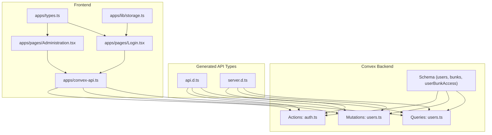
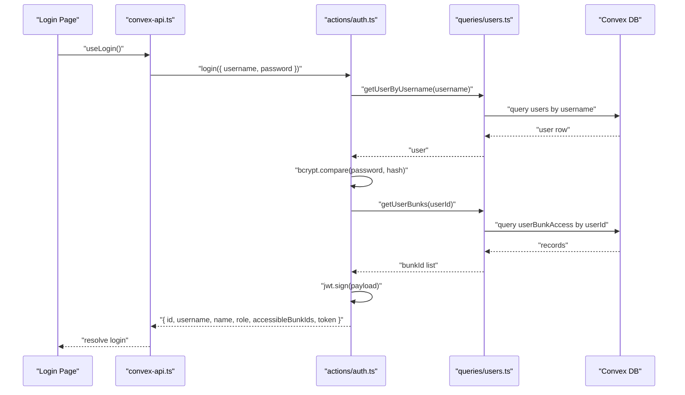
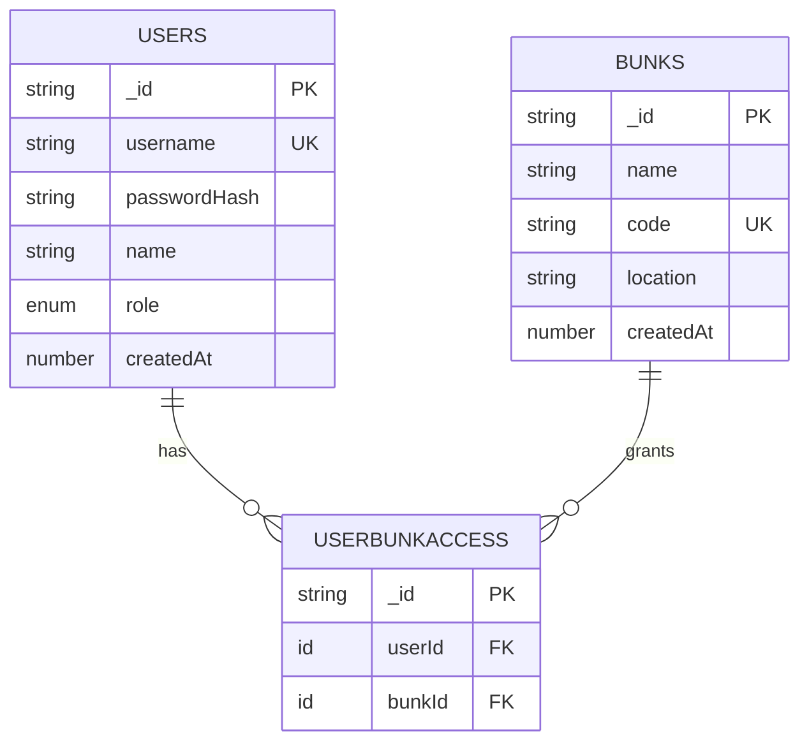
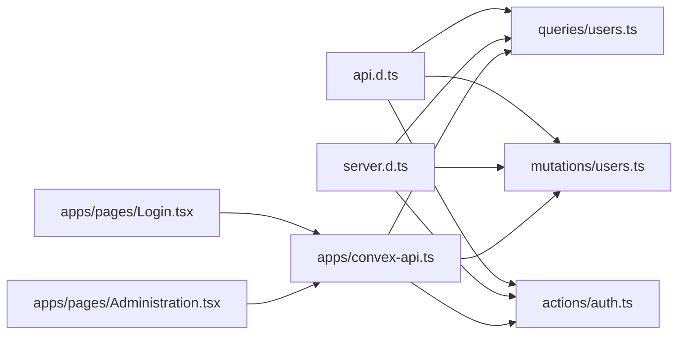

# User Queries

<cite>
**Referenced Files in This Document**
- [schema.ts](file://convex/schema.ts)
- [users.ts](file://convex/queries/users.ts)
- [users.ts](file://convex/mutations/users.ts)
- [auth.ts](file://convex/actions/auth.ts)
- [api.d.ts](file://convex/_generated/api.d.ts)
- [server.d.ts](file://convex/_generated/server.d.ts)
- [convex-api.ts](file://apps/convex-api.ts)
- [Login.tsx](file://apps/pages/Login.tsx)
- [Administration.tsx](file://apps/pages/Administration.tsx)
- [types.ts](file://apps/types.ts)
- [storage.ts](file://apps/lib/storage.ts)
</cite>

## Table of Contents
1. [Introduction](#introduction)
2. [Project Structure](#project-structure)
3. [Core Components](#core-components)
4. [Architecture Overview](#architecture-overview)
5. [Detailed Component Analysis](#detailed-component-analysis)
6. [Dependency Analysis](#dependency-analysis)
7. [Performance Considerations](#performance-considerations)
8. [Troubleshooting Guide](#troubleshooting-guide)
9. [Conclusion](#conclusion)
10. [Appendices](#appendices)

## Introduction
This document provides detailed API documentation for user query endpoints that support user management and access control operations. It focuses on:
- Listing users and enumerating user–location access relationships
- Retrieving individual user profiles and validating permissions
- Role-based filtering (admin vs super_admin)
- Location-specific user access validation via user–location junction table
- Session-based user context retrieval and token verification
- Practical workflows for user management, role assignment, and cross-location access patterns
- Security considerations, access control validation, and performance optimization guidance

## Project Structure
The user query and related functionality spans three layers:
- Convex schema and queries: define data model and expose read APIs
- Convex actions and mutations: implement authentication, user creation/update/delete, and token lifecycle
- Frontend integration: React hooks and pages consume the APIs for login, administration, and user listing

**Diagram sources**
- [schema.ts](file://convex/schema.ts#L23-L40)
- [users.ts](file://convex/queries/users.ts#L4-L34)
- [users.ts](file://convex/mutations/users.ts#L13-L80)
- [auth.ts](file://convex/actions/auth.ts#L31-L81)
- [api.d.ts](file://convex/_generated/api.d.ts#L75-L152)
- [server.d.ts](file://convex/_generated/server.d.ts#L32-L62)
- [convex-api.ts](file://apps/convex-api.ts#L1-L35)
- [Login.tsx](file://apps/pages/Login.tsx#L23-L66)
- [Administration.tsx](file://apps/pages/Administration.tsx#L20-L41)
- [types.ts](file://apps/types.ts#L9-L15)
- [storage.ts](file://apps/lib/storage.ts#L1-L34)

**Section sources**
- [schema.ts](file://convex/schema.ts#L23-L40)
- [users.ts](file://convex/queries/users.ts#L4-L34)
- [users.ts](file://convex/mutations/users.ts#L13-L80)
- [auth.ts](file://convex/actions/auth.ts#L31-L81)
- [api.d.ts](file://convex/_generated/api.d.ts#L75-L152)
- [server.d.ts](file://convex/_generated/server.d.ts#L32-L62)
- [convex-api.ts](file://apps/convex-api.ts#L1-L35)
- [Login.tsx](file://apps/pages/Login.tsx#L23-L66)
- [Administration.tsx](file://apps/pages/Administration.tsx#L20-L41)
- [types.ts](file://apps/types.ts#L9-L15)
- [storage.ts](file://apps/lib/storage.ts#L1-L34)

## Core Components
- User listing and enumeration
  - getAllUsers: returns all users
  - getAllUserBunkAccess: returns all user–location access records
- User profile and access queries
  - getUserByUsername: retrieves a user by unique username
  - getUserBunks: retrieves all locations accessible to a given user
- Authentication and session management
  - login: authenticates a user, returns JWT and accessible location IDs
  - verifyToken: validates a JWT and refreshes user context
  - refreshToken: renews a valid token
- User management mutations
  - createUser: creates a user and grants location access
  - updatePassword: updates a user’s password hash
  - deleteUser: removes a user and associated location access records

Key parameters and types:
- Role filter: admin | super_admin
- Location filter: array of bunk IDs
- Status: implicit via presence of user record (no explicit “active” flag)

**Section sources**
- [users.ts](file://convex/queries/users.ts#L4-L34)
- [users.ts](file://convex/mutations/users.ts#L13-L80)
- [auth.ts](file://convex/actions/auth.ts#L31-L81)
- [types.ts](file://apps/types.ts#L9-L15)

## Architecture Overview
The user query architecture integrates frontend hooks, Convex-generated API types, and backend queries/actions. The login flow demonstrates session-based user context retrieval and access control validation.

**Diagram sources**
- [Login.tsx](file://apps/pages/Login.tsx#L23-L66)
- [convex-api.ts](file://apps/convex-api.ts#L7-L11)
- [auth.ts](file://convex/actions/auth.ts#L31-L81)
- [users.ts](file://convex/queries/users.ts#L4-L22)

## Detailed Component Analysis

### User Listing Queries
- getAllUsers
  - Purpose: Enumerate all users for administrative views
  - Behavior: Reads all users from the users table
  - Output: Array of user documents
  - Complexity: O(n) over total users
- getAllUserBunkAccess
  - Purpose: Enumerate all user–location access relationships
  - Behavior: Reads all records from the userBunkAccess table
  - Output: Array of access records with userId and bunkId
  - Complexity: O(m) over total access records

Usage in frontend:
- Administration page consumes getAllUsers and getAllUserBunkAccess to render user directory and compute accessible bunk names per user

**Section sources**
- [users.ts](file://convex/queries/users.ts#L24-L34)
- [Administration.tsx](file://apps/pages/Administration.tsx#L32-L33)

### User Profile and Permission Queries
- getUserByUsername
  - Purpose: Retrieve a single user by unique username
  - Behavior: Index-based lookup on users.by_username
  - Output: Single user document or null
  - Complexity: O(1) due to index
- getUserBunks
  - Purpose: Retrieve all locations accessible to a user
  - Behavior: Index-based lookup on userBunkAccess.by_user
  - Output: Array of access records
  - Complexity: O(k) over user’s accesses

Frontend integration:
- Login page stores returned accessibleBunkIds and role in local storage for session-based access control

**Section sources**
- [users.ts](file://convex/queries/users.ts#L4-L22)
- [Login.tsx](file://apps/pages/Login.tsx#L31-L66)
- [storage.ts](file://apps/lib/storage.ts#L1-L34)

### Authentication and Session Management
- login
  - Validates credentials against stored hash
  - Returns user profile, accessible bunk IDs, and signed JWT
  - Access control: role and accessibleBunkIds embedded in token payload
- verifyToken
  - Verifies JWT signature and decodes payload
  - Re-fetches user and recomputes accessible bunk IDs from DB
  - Returns validated user context and expiration
- refreshToken
  - Issues a new token if the current one is valid

Security considerations:
- JWT secret must be configured in environment
- Token expiry is 24 hours
- Password hashing performed server-side using bcrypt

**Section sources**
- [auth.ts](file://convex/actions/auth.ts#L31-L81)
- [auth.ts](file://convex/actions/auth.ts#L178-L227)
- [auth.ts](file://convex/actions/auth.ts#L232-L265)

### User Management Mutations
- createUser
  - Creates a user with role and name
  - Inserts multiple userBunkAccess records for granted locations
  - Returns new user ID
- updatePassword
  - Patches user’s passwordHash
- deleteUser
  - Removes all userBunkAccess records for the user, then deletes the user

Frontend integration:
- Administration page uses registerUser action and deleteUser mutation to manage users

**Section sources**
- [users.ts](file://convex/mutations/users.ts#L13-L80)
- [Administration.tsx](file://apps/pages/Administration.tsx#L67-L92)

### Data Model and Access Control
The schema defines:
- users: username (unique), passwordHash, name, role, createdAt
- bunks: fuel station locations with code and location
- userBunkAccess: many-to-many relationship between users and bunks

Access control:
- Role determines access scope: super_admin has unrestricted global access; admin has specific bunk access controlled by userBunkAccess

**Diagram sources**
- [schema.ts](file://convex/schema.ts#L23-L40)

**Section sources**
- [schema.ts](file://convex/schema.ts#L23-L40)

## Dependency Analysis
- Generated API types
  - api.d.ts exposes typed references to queries, mutations, and actions
  - server.d.ts defines builder types for query, mutation, and action declarations
- Frontend hooks
  - convex-api.ts exports typed hooks for login, register, change password, verify token, refresh token, and user listing
- Runtime dependencies
  - actions/auth.ts depends on bcrypt and jsonwebtoken for secure operations
  - frontend pages depend on typed hooks and local storage utilities

**Diagram sources**
- [api.d.ts](file://convex/_generated/api.d.ts#L75-L152)
- [server.d.ts](file://convex/_generated/server.d.ts#L32-L62)
- [users.ts](file://convex/queries/users.ts#L4-L34)
- [users.ts](file://convex/mutations/users.ts#L13-L80)
- [auth.ts](file://convex/actions/auth.ts#L31-L81)
- [convex-api.ts](file://apps/convex-api.ts#L1-L35)
- [Login.tsx](file://apps/pages/Login.tsx#L23-L66)
- [Administration.tsx](file://apps/pages/Administration.tsx#L20-L41)

**Section sources**
- [api.d.ts](file://convex/_generated/api.d.ts#L75-L152)
- [server.d.ts](file://convex/_generated/server.d.ts#L32-L62)
- [convex-api.ts](file://apps/convex-api.ts#L1-L35)

## Performance Considerations
- Index usage
  - getUserByUsername leverages users.by_username index for O(1) lookup
  - getUserBunks leverages userBunkAccess.by_user index for O(k) retrieval of accesses
- Enumeration costs
  - getAllUsers and getAllUserBunkAccess are O(n) and O(m) respectively; suitable for moderate datasets
- Recommendations
  - Paginate user listings in the UI for large user bases
  - Cache frequently accessed user–location mappings on the client for reduced round-trips
  - Use selective queries (by role or location) when adding filters in future enhancements
  - Keep JWT payloads minimal; derive additional context server-side during verification

[No sources needed since this section provides general guidance]

## Troubleshooting Guide
Common issues and resolutions:
- Invalid username or password
  - Symptom: login throws an error
  - Cause: user not found or bcrypt compare fails
  - Resolution: verify username exists and password matches hash
- Token verification failures
  - Symptom: verifyToken returns invalid or expired
  - Cause: invalid signature, expired token, or user deleted
  - Resolution: refresh token or require re-login
- Access denied due to missing location permissions
  - Symptom: user cannot view data for a specific bunk
  - Cause: user lacks userBunkAccess record for that bunk
  - Resolution: grant bunk access via createUser or adjust userBunkAccess
- Username already exists
  - Symptom: registerUser throws an error
  - Cause: duplicate username detected
  - Resolution: choose a unique username

**Section sources**
- [auth.ts](file://convex/actions/auth.ts#L42-L50)
- [auth.ts](file://convex/actions/auth.ts#L198-L200)
- [auth.ts](file://convex/actions/auth.ts#L221-L225)
- [users.ts](file://convex/mutations/users.ts#L96-L103)

## Conclusion
The user query and access control system provides:
- Efficient user enumeration and access relationship listing
- Indexed user profile retrieval and location access validation
- Secure authentication with JWT and server-side password hashing
- Clear separation of concerns between queries, mutations, and actions
- Practical frontend integration for login, administration, and session management

Future enhancements could include:
- Role-based and location-based filters for user listing
- Pagination and caching strategies for large datasets
- Audit logging for sensitive user management operations

[No sources needed since this section summarizes without analyzing specific files]

## Appendices

### API Reference Summary

- Queries
  - getUserByUsername
    - Arguments: username
    - Returns: user document or null
    - Index: users.by_username
  - getUserBunks
    - Arguments: userId
    - Returns: array of access records
    - Index: userBunkAccess.by_user
  - getAllUsers
    - Arguments: none
    - Returns: array of users
  - getAllUserBunkAccess
    - Arguments: none
    - Returns: array of access records

- Mutations
  - createUser
    - Arguments: username, passwordHash, name, role, accessibleBunkIds[]
    - Returns: userId
  - updatePassword
    - Arguments: userId, newPasswordHash
    - Returns: { success: true }
  - deleteUser
    - Arguments: userId
    - Returns: { success: true }

- Actions
  - login
    - Arguments: username, password
    - Returns: { id, username, name, role, accessibleBunkIds, token, expiresIn }
  - verifyToken
    - Arguments: token
    - Returns: { valid, user, expiresAt } or { valid: false, error, expired }
  - refreshToken
    - Arguments: token
    - Returns: { success, token, expiresIn }

**Section sources**
- [users.ts](file://convex/queries/users.ts#L4-L34)
- [users.ts](file://convex/mutations/users.ts#L13-L80)
- [auth.ts](file://convex/actions/auth.ts#L31-L81)
- [auth.ts](file://convex/actions/auth.ts#L178-L227)
- [auth.ts](file://convex/actions/auth.ts#L232-L265)

### Example Workflows

- User listing and access computation
  - Fetch all users and all access records
  - Group access records by userId and map to bunk names for display

- Role assignment verification
  - On registration, pass role and accessibleBunkIds to createUser
  - Verify assignment by retrieving user and userBunks

- Cross-location access pattern
  - Super admin can access all locations; admin access is constrained by userBunkAccess
  - Use verifyToken to refresh user context and accessibleBunkIds after token renewal

**Section sources**
- [Administration.tsx](file://apps/pages/Administration.tsx#L32-L33)
- [Administration.tsx](file://apps/pages/Administration.tsx#L67-L92)
- [auth.ts](file://convex/actions/auth.ts#L52-L57)
- [auth.ts](file://convex/actions/auth.ts#L246-L254)