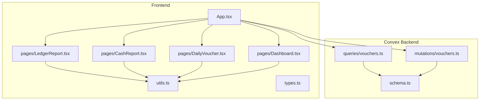
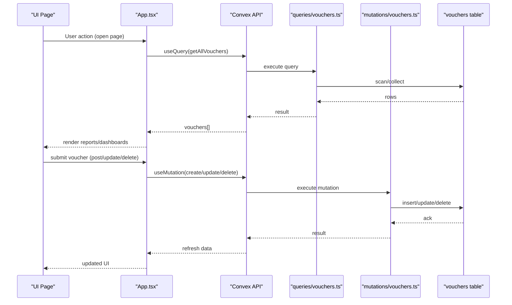
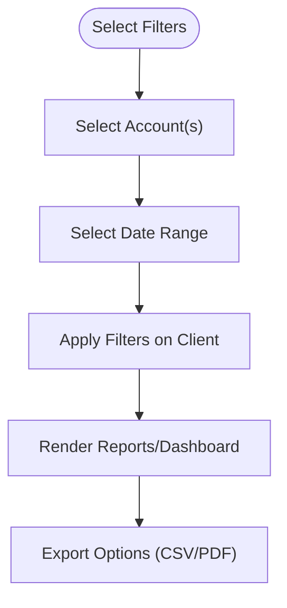
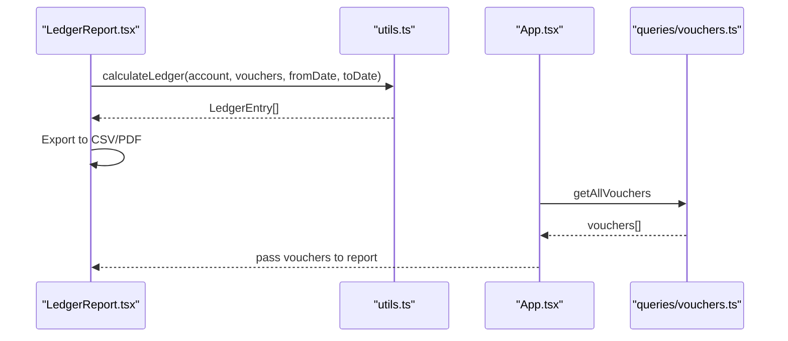
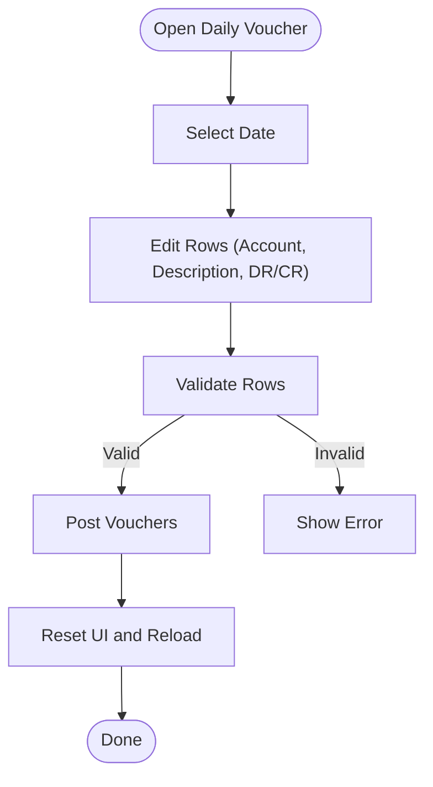
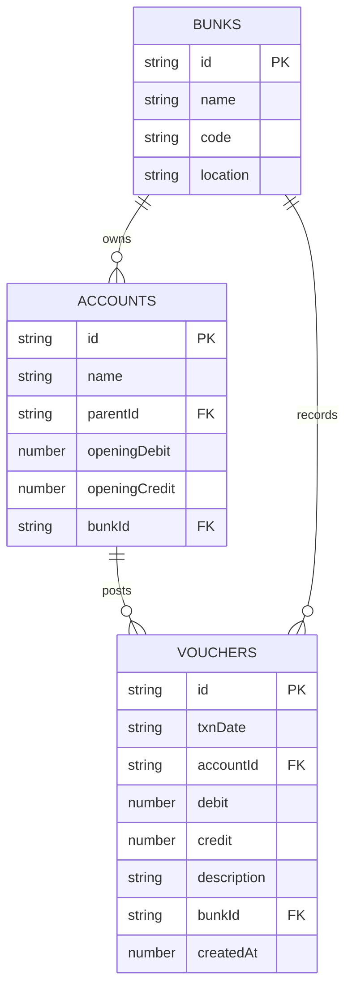
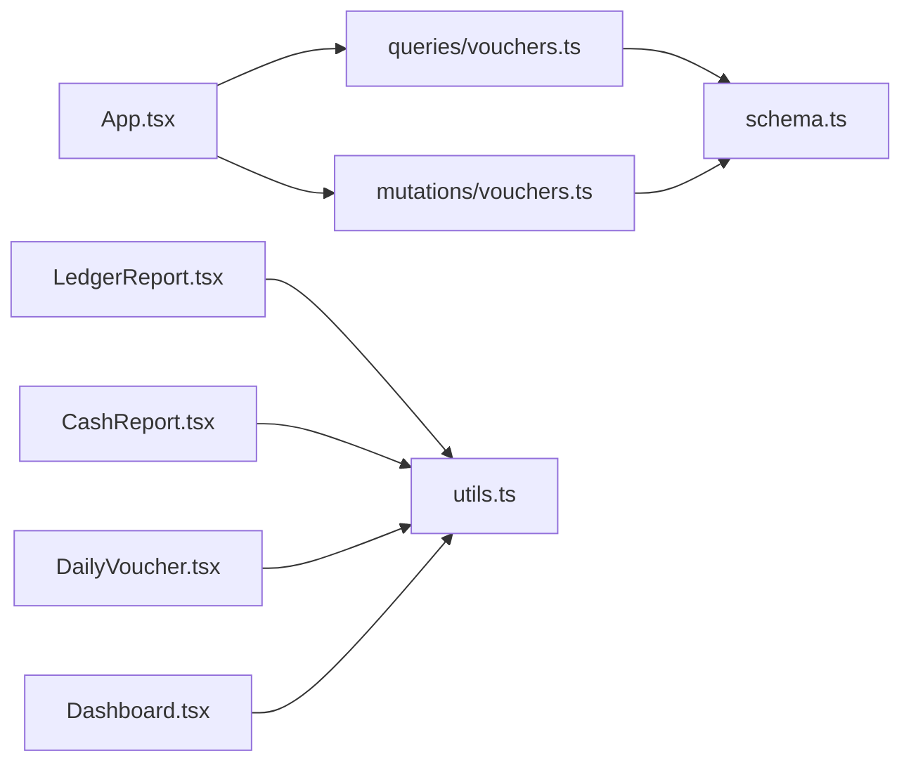

# Voucher Queries

<cite>
**Referenced Files in This Document**
- [schema.ts](file://convex/schema.ts)
- [vouchers.ts](file://convex/queries/vouchers.ts)
- [vouchers.ts](file://convex/mutations/vouchers.ts)
- [App.tsx](file://apps/App.tsx)
- [DailyVoucher.tsx](file://apps/pages/DailyVoucher.tsx)
- [LedgerReport.tsx](file://apps/pages/LedgerReport.tsx)
- [CashReport.tsx](file://apps/pages/CashReport.tsx)
- [Dashboard.tsx](file://apps/pages/Dashboard.tsx)
- [utils.ts](file://apps/utils.ts)
- [types.ts](file://apps/types.ts)
</cite>

## Table of Contents
1. [Introduction](#introduction)
2. [Project Structure](#project-structure)
3. [Core Components](#core-components)
4. [Architecture Overview](#architecture-overview)
5. [Detailed Component Analysis](#detailed-component-analysis)
6. [Dependency Analysis](#dependency-analysis)
7. [Performance Considerations](#performance-considerations)
8. [Troubleshooting Guide](#troubleshooting-guide)
9. [Conclusion](#conclusion)
10. [Appendices](#appendices)

## Introduction
This document provides comprehensive API documentation for voucher query endpoints that enable transaction history retrieval and financial statement generation. It covers:
- Voucher listing queries with date range filtering, transaction type categorization, and account-specific retrieval
- Daily voucher processing queries with real-time transaction aggregation and posting validation
- Query parameters including date filters, account filters, and pagination support
- Examples of financial report generation, cash flow statements, and transaction reconciliation workflows
- Voucher data relationships with accounts, debits/credits, and balance calculations
- Query performance optimization for large transaction datasets and real-time synchronization patterns

## Project Structure
The system is organized into:
- Convex backend (queries, mutations, schema)
- Frontend React application (pages, utilities, types)

**Diagram sources**
- [schema.ts](file://convex/schema.ts#L59-L69)
- [vouchers.ts](file://convex/queries/vouchers.ts#L4-L12)
- [vouchers.ts](file://convex/mutations/vouchers.ts#L4-L24)
- [App.tsx](file://apps/App.tsx#L24-L149)
- [LedgerReport.tsx](file://apps/pages/LedgerReport.tsx#L49-L75)
- [CashReport.tsx](file://apps/pages/CashReport.tsx#L1-L50)
- [DailyVoucher.tsx](file://apps/pages/DailyVoucher.tsx#L34-L150)
- [Dashboard.tsx](file://apps/pages/Dashboard.tsx#L50-L81)
- [utils.ts](file://apps/utils.ts#L27-L64)

**Section sources**
- [schema.ts](file://convex/schema.ts#L59-L69)
- [vouchers.ts](file://convex/queries/vouchers.ts#L4-L12)
- [vouchers.ts](file://convex/mutations/vouchers.ts#L4-L24)
- [App.tsx](file://apps/App.tsx#L24-L149)

## Core Components
- Voucher schema defines the transaction model with date, account linkage, debit/credit, description, and bunk association.
- Voucher queries expose:
  - Listing by bunk with date-indexed retrieval
  - Full listing across all records
- Voucher mutations support creation, updates, and deletions with validation.
- Frontend pages consume these APIs to render reports and dashboards.

Key data relationships:
- Vouchers link to Accounts via accountId and to Bunks via bunkId.
- Debitor/Credit balances are computed per account and aggregated per day.

**Section sources**
- [schema.ts](file://convex/schema.ts#L59-L69)
- [vouchers.ts](file://convex/queries/vouchers.ts#L4-L12)
- [vouchers.ts](file://convex/mutations/vouchers.ts#L4-L59)
- [types.ts](file://apps/types.ts#L27-L36)

## Architecture Overview
The runtime flow connects frontend pages to Convex queries and mutations, then to the schema-backed database.

**Diagram sources**
- [App.tsx](file://apps/App.tsx#L24-L149)
- [vouchers.ts](file://convex/queries/vouchers.ts#L4-L12)
- [vouchers.ts](file://convex/mutations/vouchers.ts#L4-L59)
- [schema.ts](file://convex/schema.ts#L59-L69)

## Detailed Component Analysis

### Voucher Queries
- getVouchersByBunk
  - Purpose: Retrieve vouchers for a given bunk, leveraging the by_bunk_and_date index for efficient date-range scans.
  - Parameters: bunkId (required)
  - Returns: Array of vouchers ordered implicitly by the index (bunkId, txnDate)
- getAllVouchers
  - Purpose: Fetch all vouchers for administrative or export use.
  - Parameters: none
  - Returns: Array of all vouchers

Usage in frontend:
- App.tsx initializes global vouchers state by calling getAllVouchers and mapping Convex IDs to the local Voucher type.

**Section sources**
- [vouchers.ts](file://convex/queries/vouchers.ts#L4-L12)
- [App.tsx](file://apps/App.tsx#L24-L149)

### Voucher Mutations
- createVoucher
  - Purpose: Insert a new voucher with validated fields.
  - Parameters: txnDate, accountId, debit, credit, description, bunkId
  - Behavior: Inserts createdAt timestamp and returns the inserted record.
- updateVoucher
  - Purpose: Modify an existing voucher by ID.
  - Parameters: id, txnDate, accountId, debit, credit, description
  - Behavior: Validates existence and patches fields; returns updated record.
- deleteVoucher
  - Purpose: Remove a voucher by ID.
  - Parameters: id
  - Behavior: Validates existence and deletes; returns success indicator.

Integration:
- App.tsx wires these mutations to DailyVoucher and LedgerReport pages for posting and editing.

**Section sources**
- [vouchers.ts](file://convex/mutations/vouchers.ts#L4-L59)
- [App.tsx](file://apps/App.tsx#L188-L232)

### Voucher Query Parameters and Filtering
- Date range filtering
  - Implemented in LedgerReport and CashReport via client-side filtering by fromDate/toDate.
  - DailyVoucher aggregates totals per day using the selected date.
- Account filtering
  - LedgerReport supports hierarchical account selection and descendant consolidation.
  - CashReport and LedgerReport filter by selected accountId(s).
- Transaction type categorization
  - Debit vs Credit classification is implicit in the voucher fields; downstream UIs color-code and summarize accordingly.
- Pagination support
  - Current queries return full collections. No built-in pagination exists in the backend; frontend pages manage rendering and filtering.

**Diagram sources**
- [LedgerReport.tsx](file://apps/pages/LedgerReport.tsx#L24-L75)
- [CashReport.tsx](file://apps/pages/CashReport.tsx#L15-L50)
- [DailyVoucher.tsx](file://apps/pages/DailyVoucher.tsx#L38-L62)

**Section sources**
- [LedgerReport.tsx](file://apps/pages/LedgerReport.tsx#L24-L75)
- [CashReport.tsx](file://apps/pages/CashReport.tsx#L15-L50)
- [DailyVoucher.tsx](file://apps/pages/DailyVoucher.tsx#L38-L62)

### Financial Report Generation
- Ledger Report
  - Aggregates transactions for a selected account (including descendants) within a date range.
  - Computes running balance and movement summary.
- Cash Flow Statement
  - Generates a cash statement with opening/closing balances and summarized inflows/outflows.
  - Supports daily, monthly, YTD, financial year, and custom date ranges.
- Dashboard
  - Summarizes daily activity, inflow/outflow counts, and closing cash for a selected date.

**Diagram sources**
- [LedgerReport.tsx](file://apps/pages/LedgerReport.tsx#L49-L75)
- [utils.ts](file://apps/utils.ts#L27-L64)
- [App.tsx](file://apps/App.tsx#L24-L149)
- [vouchers.ts](file://convex/queries/vouchers.ts#L14-L18)

**Section sources**
- [LedgerReport.tsx](file://apps/pages/LedgerReport.tsx#L49-L75)
- [CashReport.tsx](file://apps/pages/CashReport.tsx#L53-L182)
- [Dashboard.tsx](file://apps/pages/Dashboard.tsx#L50-L81)
- [utils.ts](file://apps/utils.ts#L27-L64)

### Daily Voucher Processing and Real-Time Aggregation
- DailyVoucher enables batch creation/editing of vouchers for a selected date.
- Totals computation:
  - Opening balance derived from account hierarchy
  - Total inflow (credit) and outflow (debit) computed per row
  - Closing balance calculated as opening + inflow - outflow
- Posting workflow:
  - Validates rows, posts new or updates existing vouchers, and resets UI state.

**Diagram sources**
- [DailyVoucher.tsx](file://apps/pages/DailyVoucher.tsx#L34-L150)

**Section sources**
- [DailyVoucher.tsx](file://apps/pages/DailyVoucher.tsx#L34-L150)

### Voucher Data Relationships and Balance Calculations
- Entities
  - Vouchers: date, accountId, debit, credit, description, bunkId, createdAt
  - Accounts: hierarchical chart of accounts linked to bunks
  - Bunks: fuel station locations
- Relationships
  - One account has many vouchers; one bunk has many accounts and vouchers
- Balance calculations
  - Per-account opening balance difference (debit - credit)
  - Running ledger balance during a period computed by sorting vouchers by date and applying running differences

**Diagram sources**
- [schema.ts](file://convex/schema.ts#L13-L69)

**Section sources**
- [schema.ts](file://convex/schema.ts#L13-L69)
- [utils.ts](file://apps/utils.ts#L27-L64)
- [types.ts](file://apps/types.ts#L17-L36)

## Dependency Analysis
- Frontend depends on Convex queries and mutations for data access.
- Reports depend on shared utility functions for ledger calculation and formatting.
- Queries rely on schema indexes for efficient retrieval.

**Diagram sources**
- [App.tsx](file://apps/App.tsx#L24-L149)
- [vouchers.ts](file://convex/queries/vouchers.ts#L4-L12)
- [vouchers.ts](file://convex/mutations/vouchers.ts#L4-L59)
- [LedgerReport.tsx](file://apps/pages/LedgerReport.tsx#L49-L75)
- [CashReport.tsx](file://apps/pages/CashReport.tsx#L15-L50)
- [DailyVoucher.tsx](file://apps/pages/DailyVoucher.tsx#L34-L150)
- [Dashboard.tsx](file://apps/pages/Dashboard.tsx#L50-L81)
- [utils.ts](file://apps/utils.ts#L27-L64)
- [schema.ts](file://convex/schema.ts#L59-L69)

**Section sources**
- [App.tsx](file://apps/App.tsx#L24-L149)
- [vouchers.ts](file://convex/queries/vouchers.ts#L4-L12)
- [vouchers.ts](file://convex/mutations/vouchers.ts#L4-L59)
- [utils.ts](file://apps/utils.ts#L27-L64)

## Performance Considerations
- Index usage
  - getVouchersByBunk leverages by_bunk_and_date index for efficient date-scoped retrieval.
- Query volume
  - getAllVouchers returns full collections; consider adding pagination or server-side filtering for very large datasets.
- Client-side filtering
  - LedgerReport and CashReport apply date and account filters on the client; ensure dataset sizes remain manageable for responsive UI.
- Real-time synchronization
  - Frontend re-fetches data after mutations; consider optimistic updates for smoother UX.
- Sorting and aggregation
  - calculateLedger sorts by date; avoid repeated sorts by pre-sorting at ingestion or caching.

[No sources needed since this section provides general guidance]

## Troubleshooting Guide
- Missing or invalid bunkId
  - Ensure current bunk is selected before posting vouchers.
- Voucher not found errors
  - updateVoucher/deleteVoucher throw if ID does not exist; verify IDs and retry.
- Empty report results
  - LedgerReport displays guidance when no records are found; select an account/date range.
- Posting validation
  - DailyVoucher requires a valid account and non-zero DR/CR; ensure rows are filled before posting.

**Section sources**
- [App.tsx](file://apps/App.tsx#L91-L109)
- [vouchers.ts](file://convex/mutations/vouchers.ts#L36-L56)
- [DailyVoucher.tsx](file://apps/pages/DailyVoucher.tsx#L111-L150)
- [LedgerReport.tsx](file://apps/pages/LedgerReport.tsx#L228-L234)

## Conclusion
The voucher query system provides robust foundations for transaction history retrieval and financial reporting. By leveraging schema indexes and client-side aggregation, it supports daily processing, hierarchical ledger views, and cash flow statements. Extending with pagination and optimized indexing will further improve performance for large datasets.

[No sources needed since this section summarizes without analyzing specific files]

## Appendices

### API Definitions

- Query: getVouchersByBunk
  - Method: GET (via Convex query)
  - Path: Not exposed as HTTP endpoint; invoked via Convex client
  - Arguments:
    - bunkId: string (required)
  - Returns: Array of voucher objects
  - Notes: Uses by_bunk_and_date index for efficient retrieval

- Query: getAllVouchers
  - Method: GET (via Convex query)
  - Path: Not exposed as HTTP endpoint; invoked via Convex client
  - Arguments: none
  - Returns: Array of all voucher objects

- Mutation: createVoucher
  - Method: POST (via Convex mutation)
  - Path: Not exposed as HTTP endpoint; invoked via Convex client
  - Arguments:
    - txnDate: string (required)
    - accountId: string (required)
    - debit: number (required)
    - credit: number (required)
    - description: string (required)
    - bunkId: string (required)
  - Returns: Created voucher object

- Mutation: updateVoucher
  - Method: PATCH (via Convex mutation)
  - Path: Not exposed as HTTP endpoint; invoked via Convex client
  - Arguments:
    - id: string (required)
    - txnDate: string (required)
    - accountId: string (required)
    - debit: number (required)
    - credit: number (required)
    - description: string (required)
  - Returns: Updated voucher object

- Mutation: deleteVoucher
  - Method: DELETE (via Convex mutation)
  - Path: Not exposed as HTTP endpoint; invoked via Convex client
  - Arguments:
    - id: string (required)
  - Returns: { success: true }

**Section sources**
- [vouchers.ts](file://convex/queries/vouchers.ts#L4-L12)
- [vouchers.ts](file://convex/queries/vouchers.ts#L14-L18)
- [vouchers.ts](file://convex/mutations/vouchers.ts#L4-L59)

### Example Workflows

- Financial Report Generation (Ledger Report)
  - Select account(s) and date range
  - Apply filters and compute ledger entries
  - Export to CSV/PDF

- Cash Flow Statement
  - Choose filter type (daily/monthly/YTD/financial year/custom)
  - Generate PDF with opening/closing balances and movement summary

- Transaction Reconciliation
  - Filter by date range and account(s)
  - Compare reported balances with external records
  - Adjust postings as needed

**Section sources**
- [LedgerReport.tsx](file://apps/pages/LedgerReport.tsx#L49-L75)
- [CashReport.tsx](file://apps/pages/CashReport.tsx#L53-L182)
- [utils.ts](file://apps/utils.ts#L27-L64)