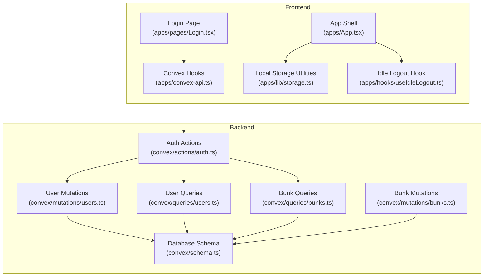
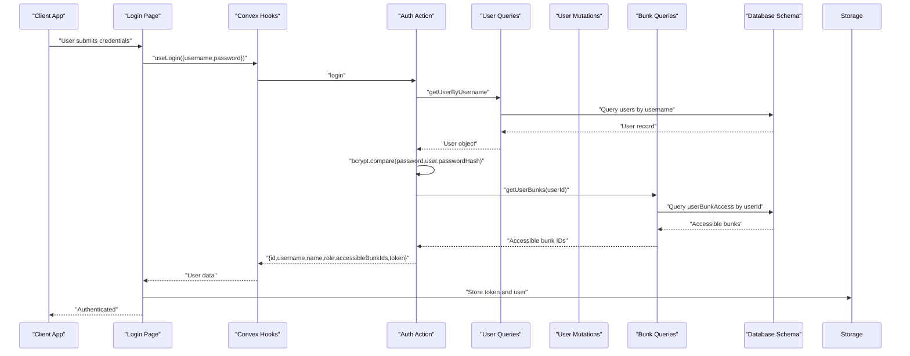
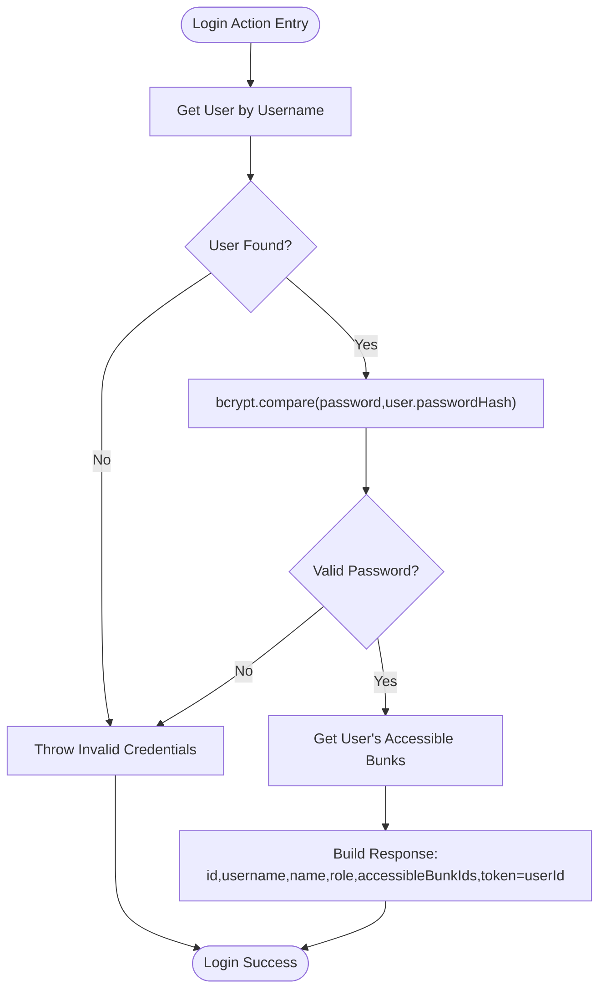
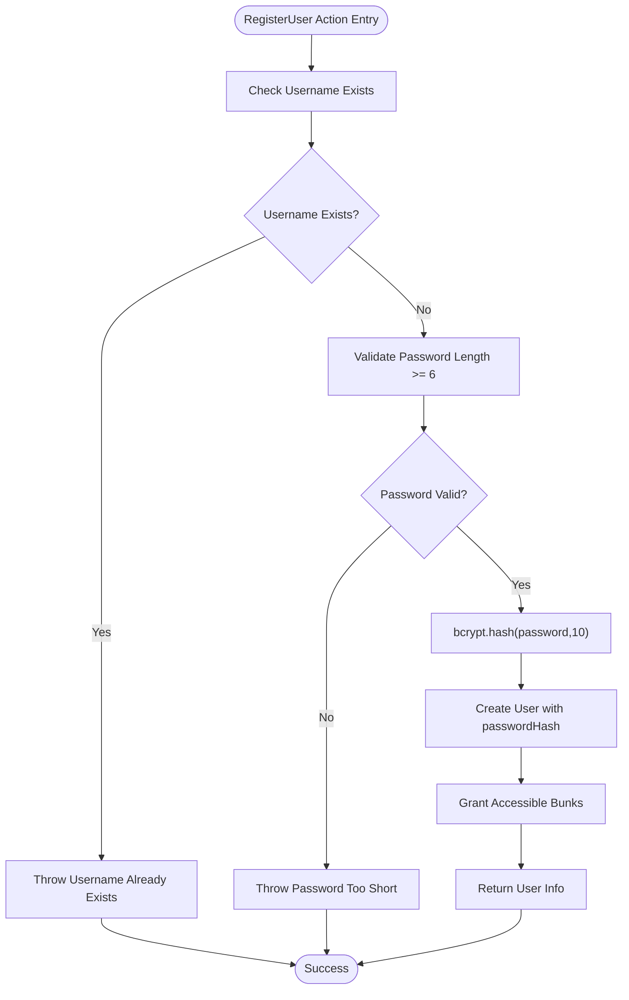
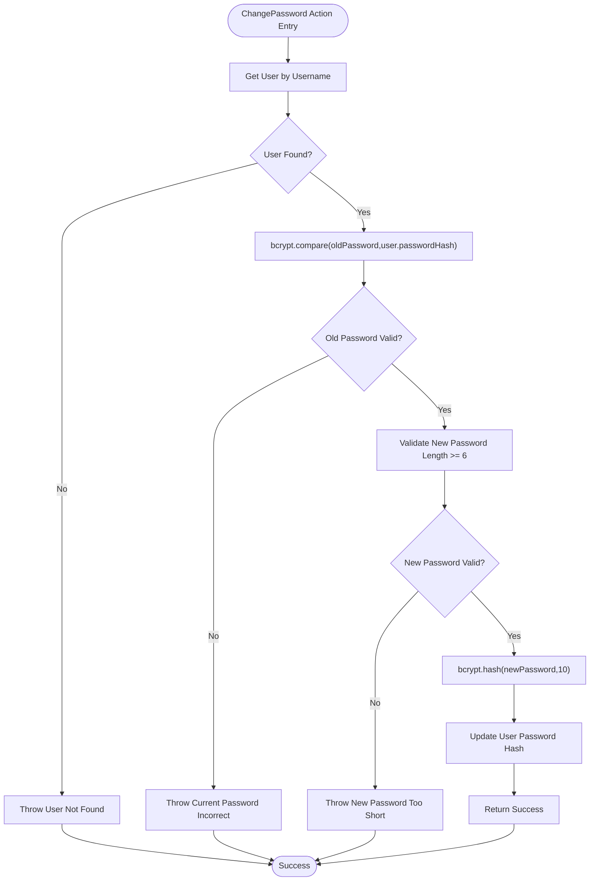
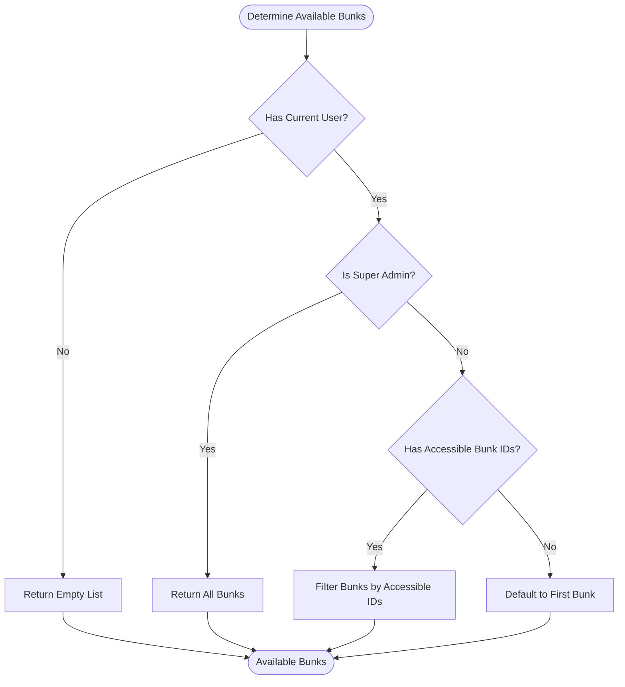
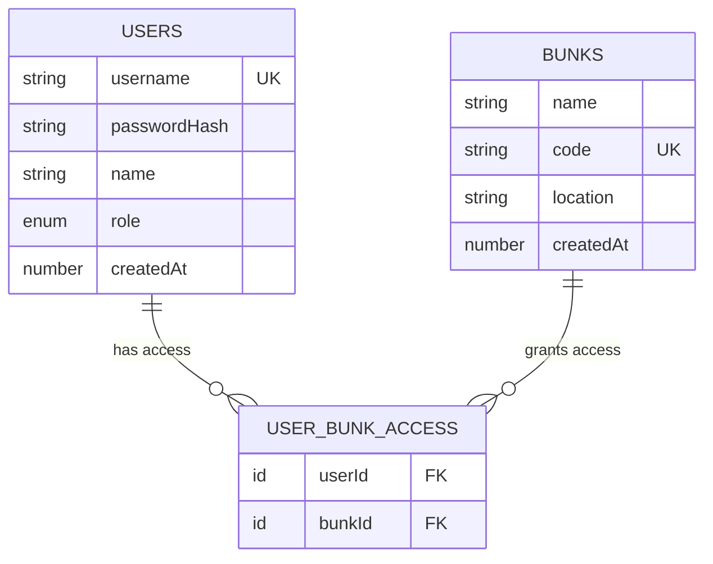
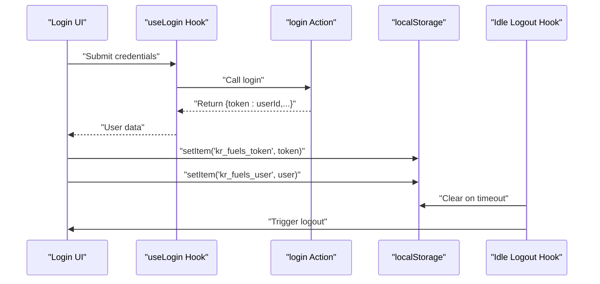
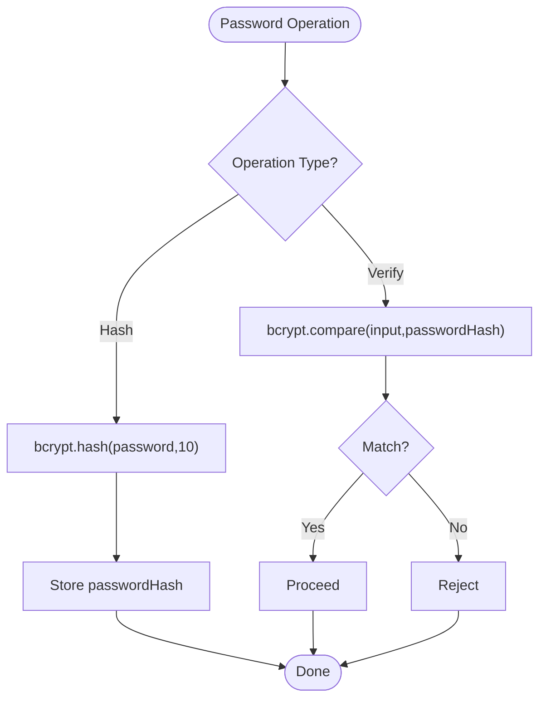
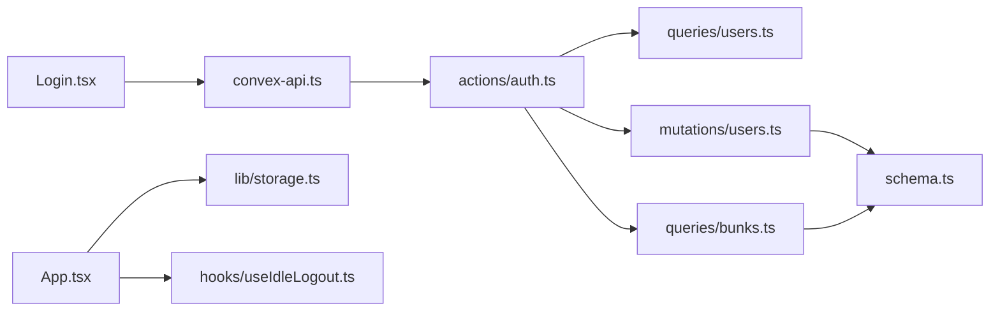

# Authentication System

<cite>
**Referenced Files in This Document**
- [auth.ts](file://convex/actions/auth.ts)
- [users.ts](file://convex/queries/users.ts)
- [users.ts](file://convex/mutations/users.ts)
- [schema.ts](file://convex/schema.ts)
- [Login.tsx](file://apps/pages/Login.tsx)
- [convex-api.ts](file://apps/convex-api.ts)
- [App.tsx](file://apps/App.tsx)
- [storage.ts](file://apps/lib/storage.ts)
- [useIdleLogout.ts](file://apps/hooks/useIdleLogout.ts)
- [bunks.ts](file://convex/queries/bunks.ts)
- [bunks.ts](file://convex/mutations/bunks.ts)
- [package.json](file://convex/package.json)
- [package.json](file://package.json)
</cite>

## Table of Contents
1. [Introduction](#introduction)
2. [Project Structure](#project-structure)
3. [Core Components](#core-components)
4. [Architecture Overview](#architecture-overview)
5. [Detailed Component Analysis](#detailed-component-analysis)
6. [Dependency Analysis](#dependency-analysis)
7. [Performance Considerations](#performance-considerations)
8. [Troubleshooting Guide](#troubleshooting-guide)
9. [Conclusion](#conclusion)
10. [Appendices](#appendices)

## Introduction
This document provides comprehensive documentation for the authentication system in KR-FUELS. It covers the three primary authentication actions—login, registerUser, and changePassword—along with the bcrypt password hashing implementation, role-based access control (RBAC) model, user session management, and accessible bunks system for multi-location access control. It also outlines error handling strategies, security measures, and practical examples of authentication flows.

## Project Structure
The authentication system spans both the frontend and backend layers:
- Frontend: Login page, Convex API hooks, local storage utilities, and idle logout hook
- Backend: Convex actions (authentication), queries (user and bunks), mutations (user management), and database schema

**Diagram sources**
- [Login.tsx](file://apps/pages/Login.tsx#L22-L56)
- [convex-api.ts](file://apps/convex-api.ts#L7-L9)
- [auth.ts](file://convex/actions/auth.ts#L18-L56)
- [users.ts](file://convex/queries/users.ts#L4-L12)
- [users.ts](file://convex/mutations/users.ts#L13-L41)
- [bunks.ts](file://convex/queries/bunks.ts#L11-L15)
- [bunks.ts](file://convex/mutations/bunks.ts#L4-L18)
- [schema.ts](file://convex/schema.ts#L13-L39)
- [App.tsx](file://apps/App.tsx#L38-L70)
- [storage.ts](file://apps/lib/storage.ts#L1-L34)
- [useIdleLogout.ts](file://apps/hooks/useIdleLogout.ts#L10-L32)

**Section sources**
- [Login.tsx](file://apps/pages/Login.tsx#L1-L167)
- [convex-api.ts](file://apps/convex-api.ts#L1-L33)
- [auth.ts](file://convex/actions/auth.ts#L1-L148)
- [users.ts](file://convex/queries/users.ts#L1-L35)
- [users.ts](file://convex/mutations/users.ts#L1-L81)
- [bunks.ts](file://convex/queries/bunks.ts#L1-L16)
- [bunks.ts](file://convex/mutations/bunks.ts#L1-L37)
- [schema.ts](file://convex/schema.ts#L1-L85)
- [App.tsx](file://apps/App.tsx#L1-L266)
- [storage.ts](file://apps/lib/storage.ts#L1-L34)
- [useIdleLogout.ts](file://apps/hooks/useIdleLogout.ts#L1-L33)

## Core Components
- Authentication Actions: login, registerUser, changePassword
- User Management: create, update, delete users; manage accessible bunks
- Session Management: token generation and storage; idle logout
- RBAC Model: admin and super_admin roles with distinct permissions
- Access Control: accessible bunks system for multi-location access
- Security: bcrypt password hashing with 10-round salt; password validation rules

**Section sources**
- [auth.ts](file://convex/actions/auth.ts#L18-L148)
- [users.ts](file://convex/mutations/users.ts#L13-L58)
- [users.ts](file://convex/queries/users.ts#L4-L22)
- [schema.ts](file://convex/schema.ts#L23-L39)
- [App.tsx](file://apps/App.tsx#L47-L54)
- [storage.ts](file://apps/lib/storage.ts#L1-L34)
- [useIdleLogout.ts](file://apps/hooks/useIdleLogout.ts#L10-L32)

## Architecture Overview
The authentication architecture follows a client-server pattern:
- Frontend triggers authentication actions via Convex hooks
- Backend actions validate credentials, enforce security policies, and manage sessions
- RBAC and accessible bunks determine permitted locations and routes
- Local storage persists tokens and user preferences

**Diagram sources**
- [Login.tsx](file://apps/pages/Login.tsx#L30-L56)
- [convex-api.ts](file://apps/convex-api.ts#L7-L9)
- [auth.ts](file://convex/actions/auth.ts#L18-L56)
- [users.ts](file://convex/queries/users.ts#L4-L12)
- [users.ts](file://convex/mutations/users.ts#L13-L41)
- [bunks.ts](file://convex/queries/bunks.ts#L11-L15)
- [schema.ts](file://convex/schema.ts#L23-L39)
- [storage.ts](file://apps/lib/storage.ts#L1-L34)

## Detailed Component Analysis

### Authentication Actions

#### Login Workflow
- Validates username existence
- Verifies password using bcrypt compare
- Retrieves accessible bunks for the user
- Returns user data with a simple token (user ID)

**Diagram sources**
- [auth.ts](file://convex/actions/auth.ts#L18-L56)
- [users.ts](file://convex/queries/users.ts#L4-L12)
- [users.ts](file://convex/mutations/users.ts#L13-L41)

**Section sources**
- [auth.ts](file://convex/actions/auth.ts#L18-L56)
- [users.ts](file://convex/queries/users.ts#L4-L12)

#### RegisterUser Workflow
- Checks for existing username
- Enforces password length validation (minimum 6 characters)
- Hashes password using bcrypt with 10 rounds
- Creates user and grants accessible bunks

**Diagram sources**
- [auth.ts](file://convex/actions/auth.ts#L62-L104)
- [users.ts](file://convex/mutations/users.ts#L13-L41)
- [schema.ts](file://convex/schema.ts#L23-L29)

**Section sources**
- [auth.ts](file://convex/actions/auth.ts#L62-L104)
- [users.ts](file://convex/mutations/users.ts#L13-L41)

#### ChangePassword Workflow
- Retrieves user by username (note: implementation uses a placeholder query)
- Verifies old password with bcrypt compare
- Validates new password length (minimum 6 characters)
- Hashes new password with bcrypt (10 rounds)
- Updates stored password hash

**Diagram sources**
- [auth.ts](file://convex/actions/auth.ts#L109-L147)
- [users.ts](file://convex/queries/users.ts#L4-L12)
- [users.ts](file://convex/mutations/users.ts#L47-L58)

**Section sources**
- [auth.ts](file://convex/actions/auth.ts#L109-L147)
- [users.ts](file://convex/queries/users.ts#L4-L12)
- [users.ts](file://convex/mutations/users.ts#L47-L58)

### Role-Based Access Control (RBAC)
- Roles: admin, super_admin
- Super-admin can access all bunks; admin is restricted to accessibleBunkIds
- Route protection: only super_admin can access administration route

**Diagram sources**
- [App.tsx](file://apps/App.tsx#L47-L54)
- [schema.ts](file://convex/schema.ts#L27-L29)

**Section sources**
- [App.tsx](file://apps/App.tsx#L47-L54)
- [schema.ts](file://convex/schema.ts#L27-L29)

### Accessible Bunks System
- Many-to-many relationship between users and bunks via userBunkAccess
- On user creation, accessible bunks are granted
- On bunk deletion, associated access records are removed

**Diagram sources**
- [schema.ts](file://convex/schema.ts#L13-L39)
- [users.ts](file://convex/mutations/users.ts#L32-L37)
- [bunks.ts](file://convex/mutations/bunks.ts#L26-L32)

**Section sources**
- [schema.ts](file://convex/schema.ts#L13-L39)
- [users.ts](file://convex/mutations/users.ts#L32-L37)
- [bunks.ts](file://convex/mutations/bunks.ts#L26-L32)

### Session Management and Token Handling
- Token: simple user ID string generated upon successful login
- Storage: tokens and user data persisted in localStorage
- Idle logout: automatic logout after configurable inactivity

**Diagram sources**
- [Login.tsx](file://apps/pages/Login.tsx#L38-L50)
- [convex-api.ts](file://apps/convex-api.ts#L7-L9)
- [auth.ts](file://convex/actions/auth.ts#L53-L54)
- [storage.ts](file://apps/lib/storage.ts#L1-L34)
- [useIdleLogout.ts](file://apps/hooks/useIdleLogout.ts#L10-L32)

**Section sources**
- [Login.tsx](file://apps/pages/Login.tsx#L38-L50)
- [auth.ts](file://convex/actions/auth.ts#L53-L54)
- [storage.ts](file://apps/lib/storage.ts#L1-L34)
- [useIdleLogout.ts](file://apps/hooks/useIdleLogout.ts#L10-L32)

### Password Hashing and Verification
- bcryptjs library used for hashing and verification
- 10 rounds salt generation for password hashing
- Secure comparison during login and password change

**Diagram sources**
- [auth.ts](file://convex/actions/auth.ts#L85-L86)
- [auth.ts](file://convex/actions/auth.ts#L125-L129)
- [auth.ts](file://convex/actions/auth.ts#L136-L137)
- [package.json](file://convex/package.json#L7)

**Section sources**
- [auth.ts](file://convex/actions/auth.ts#L85-L86)
- [auth.ts](file://convex/actions/auth.ts#L125-L129)
- [auth.ts](file://convex/actions/auth.ts#L136-L137)
- [package.json](file://convex/package.json#L7)

### Practical Examples

#### Login Flow Example
- User enters credentials on the Login page
- Frontend calls useLogin hook
- Backend validates credentials and returns user data with token
- Frontend stores token and user data, then navigates to the dashboard

**Section sources**
- [Login.tsx](file://apps/pages/Login.tsx#L30-L56)
- [convex-api.ts](file://apps/convex-api.ts#L7-L9)
- [auth.ts](file://convex/actions/auth.ts#L18-L56)
- [storage.ts](file://apps/lib/storage.ts#L1-L34)

#### User Registration Example
- Admin initiates registration with username, password, name, role, and accessible bunks
- Backend enforces password length and uniqueness checks
- Password is hashed with bcrypt (10 rounds) and stored
- Accessible bunks are granted to the user

**Section sources**
- [auth.ts](file://convex/actions/auth.ts#L62-L104)
- [users.ts](file://convex/mutations/users.ts#L13-L41)
- [schema.ts](file://convex/schema.ts#L23-L29)

#### Password Change Example
- User provides old and new passwords
- Backend verifies old password and validates new password length
- New password is hashed with bcrypt (10 rounds) and updated

**Section sources**
- [auth.ts](file://convex/actions/auth.ts#L109-L147)
- [users.ts](file://convex/mutations/users.ts#L47-L58)

## Dependency Analysis
The authentication system exhibits clear separation of concerns:
- Frontend depends on Convex hooks for backend interactions
- Backend actions depend on queries and mutations for data operations
- Database schema defines relationships and constraints
- Local storage utilities support session persistence

**Diagram sources**
- [Login.tsx](file://apps/pages/Login.tsx#L28)
- [convex-api.ts](file://apps/convex-api.ts#L7-L9)
- [auth.ts](file://convex/actions/auth.ts#L18-L56)
- [users.ts](file://convex/queries/users.ts#L4-L12)
- [users.ts](file://convex/mutations/users.ts#L13-L41)
- [bunks.ts](file://convex/queries/bunks.ts#L11-L15)
- [schema.ts](file://convex/schema.ts#L13-L39)
- [App.tsx](file://apps/App.tsx#L38-L70)
- [storage.ts](file://apps/lib/storage.ts#L1-L34)
- [useIdleLogout.ts](file://apps/hooks/useIdleLogout.ts#L10-L32)

**Section sources**
- [Login.tsx](file://apps/pages/Login.tsx#L28)
- [convex-api.ts](file://apps/convex-api.ts#L7-L9)
- [auth.ts](file://convex/actions/auth.ts#L18-L56)
- [users.ts](file://convex/queries/users.ts#L4-L12)
- [users.ts](file://convex/mutations/users.ts#L13-L41)
- [bunks.ts](file://convex/queries/bunks.ts#L11-L15)
- [schema.ts](file://convex/schema.ts#L13-L39)
- [App.tsx](file://apps/App.tsx#L38-L70)
- [storage.ts](file://apps/lib/storage.ts#L1-L34)
- [useIdleLogout.ts](file://apps/hooks/useIdleLogout.ts#L10-L32)

## Performance Considerations
- bcrypt hashing cost: 10 rounds provide a good balance between security and performance for this application scale
- Index usage: username and userBunkAccess indices optimize lookups
- Minimal payload: login response excludes sensitive fields and returns only necessary data
- Idle logout reduces resource consumption by clearing sessions after inactivity

[No sources needed since this section provides general guidance]

## Troubleshooting Guide
Common issues and resolutions:
- Invalid credentials: thrown when username does not exist or password mismatch occurs
- Username already exists: thrown during registration if username is taken
- Password validation errors: thrown for insufficient length during registration and password change
- User not found: thrown during password change if user lookup fails
- Access denied: route protection prevents non-super_admin users from accessing administration

**Section sources**
- [auth.ts](file://convex/actions/auth.ts#L29-L37)
- [auth.ts](file://convex/actions/auth.ts#L76-L78)
- [auth.ts](file://convex/actions/auth.ts#L81-L83)
- [auth.ts](file://convex/actions/auth.ts#L121-L123)
- [auth.ts](file://convex/actions/auth.ts#L131-L134)
- [App.tsx](file://apps/App.tsx#L255-L257)

## Conclusion
The KR-FUELS authentication system provides a robust, secure, and scalable foundation for user management and access control. It leverages bcrypt for password security, implements a clear RBAC model, and integrates seamlessly with the frontend through Convex hooks. The accessible bunks system enables fine-grained multi-location access control, while local storage and idle logout enhance user experience and security.

## Appendices

### Security Measures
- Password hashing with bcrypt (10 rounds)
- Input validation for usernames and passwords
- Role-based route protection
- Automatic idle logout
- Minimal data exposure in responses

**Section sources**
- [auth.ts](file://convex/actions/auth.ts#L85-L86)
- [auth.ts](file://convex/actions/auth.ts#L81-L83)
- [auth.ts](file://convex/actions/auth.ts#L131-L134)
- [useIdleLogout.ts](file://apps/hooks/useIdleLogout.ts#L10-L32)
- [App.tsx](file://apps/App.tsx#L255-L257)

### Password Validation Rules
- Minimum length: 6 characters
- Enforcement during registration and password change

**Section sources**
- [auth.ts](file://convex/actions/auth.ts#L81-L83)
- [auth.ts](file://convex/actions/auth.ts#L131-L134)