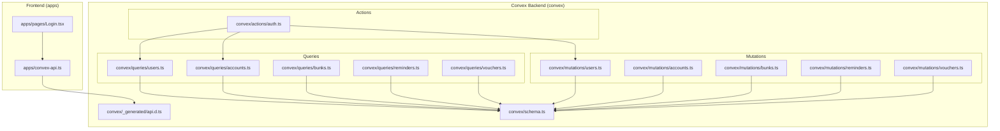
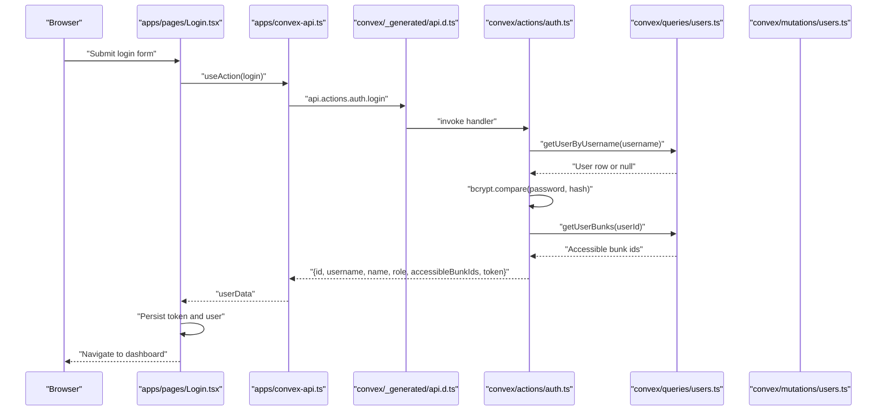
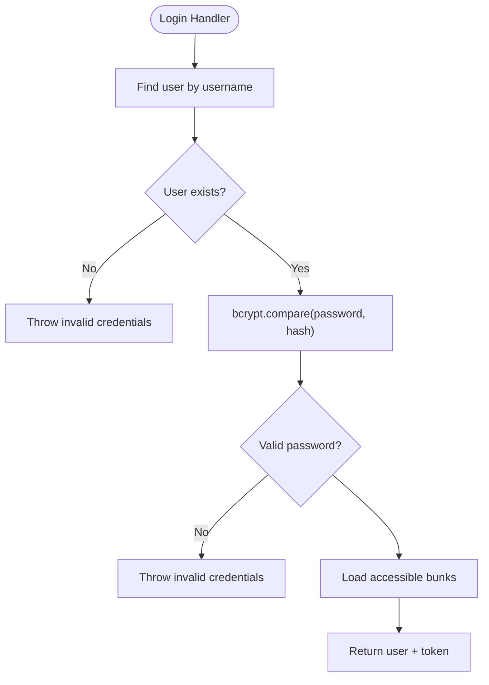
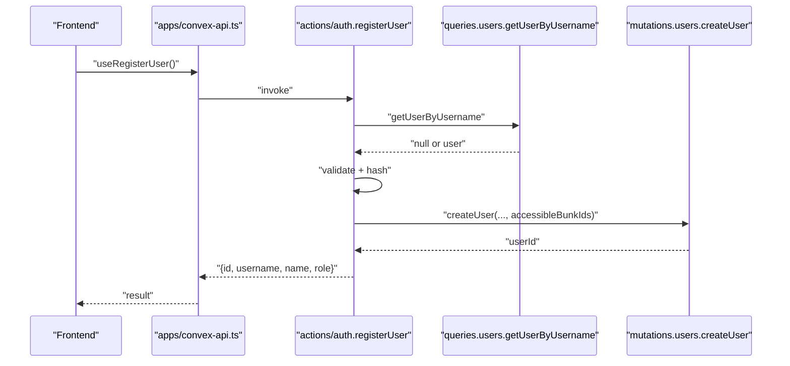
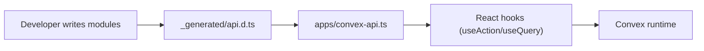
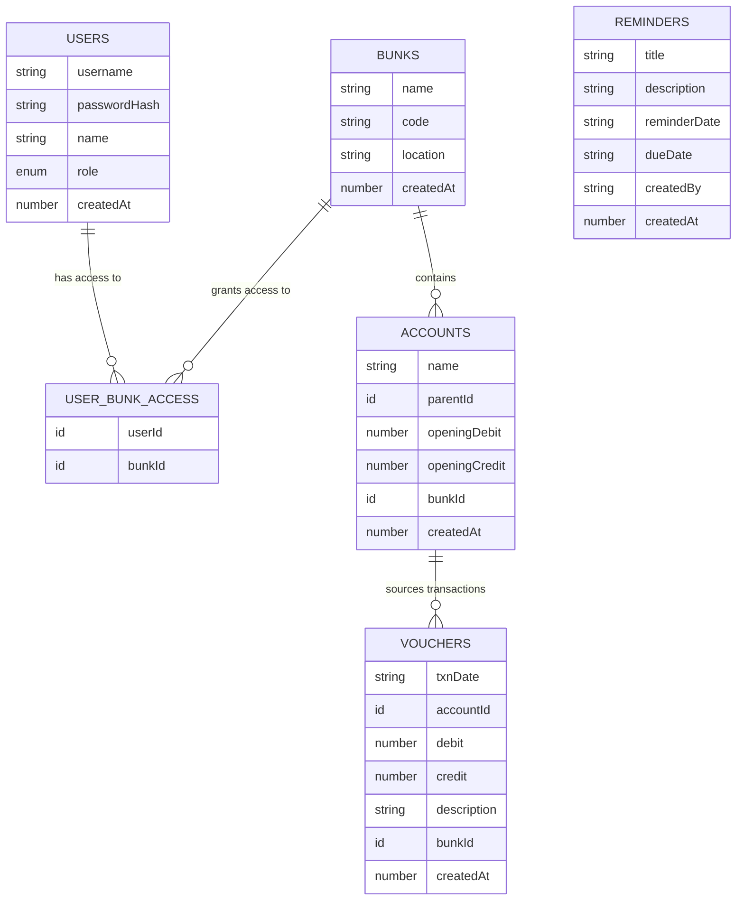
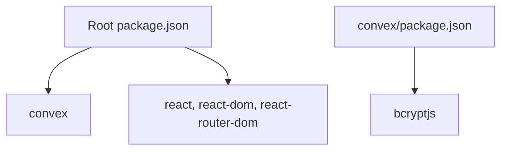

# Backend Architecture

<cite>
**Referenced Files in This Document**
- [schema.ts](file://convex/schema.ts)
- [api.d.ts](file://convex/_generated/api.d.ts)
- [auth.ts](file://convex/actions/auth.ts)
- [users.ts (mutations)](file://convex/mutations/users.ts)
- [users.ts (queries)](file://convex/queries/users.ts)
- [accounts.ts (mutations)](file://convex/mutations/accounts.ts)
- [accounts.ts (queries)](file://convex/queries/accounts.ts)
- [bunks.ts (mutations)](file://convex/mutations/bunks.ts)
- [bunks.ts (queries)](file://convex/queries/bunks.ts)
- [reminders.ts (mutations)](file://convex/mutations/reminders.ts)
- [reminders.ts (queries)](file://convex/queries/reminders.ts)
- [vouchers.ts (mutations)](file://convex/mutations/vouchers.ts)
- [vouchers.ts (queries)](file://convex/queries/vouchers.ts)
- [convex-api.ts](file://apps/convex-api.ts)
- [Login.tsx](file://apps/pages/Login.tsx)
- [package.json (root)](file://package.json)
- [package.json (convex)](file://convex/package.json)
- [README.md](file://README.md)
</cite>

## Table of Contents
1. [Introduction](#introduction)
2. [Project Structure](#project-structure)
3. [Core Components](#core-components)
4. [Architecture Overview](#architecture-overview)
5. [Detailed Component Analysis](#detailed-component-analysis)
6. [Dependency Analysis](#dependency-analysis)
7. [Performance Considerations](#performance-considerations)
8. [Troubleshooting Guide](#troubleshooting-guide)
9. [Conclusion](#conclusion)
10. [Appendices](#appendices)

## Introduction
This document describes the backend architecture of KR-FUELS, a Convex-based serverless application. It focuses on the Action-Mutation pattern, Convex integration (API generation and type safety), authentication and access control, data access and indexing, caching and performance, error handling and logging, deployment and scaling, and security best practices. The backend is organized around typed Convex functions generated automatically from modules under convex/, and consumed by the frontend via a thin wrapper in apps/.

## Project Structure
The backend is split into:
- convex/: Convex serverless functions (queries, mutations, actions) and schema
- apps/: React frontend and a small API wrapper for Convex functions
- Root and convex package.json files manage dependencies and scripts

**Diagram sources**
- [api.d.ts](file://convex/_generated/api.d.ts#L32-L76)
- [schema.ts](file://convex/schema.ts#L9-L84)
- [auth.ts](file://convex/actions/auth.ts#L18-L56)
- [users.ts (mutations)](file://convex/mutations/users.ts#L13-L41)
- [users.ts (queries)](file://convex/queries/users.ts#L4-L22)
- [accounts.ts (mutations)](file://convex/mutations/accounts.ts#L4-L22)
- [accounts.ts (queries)](file://convex/queries/accounts.ts#L4-L12)
- [bunks.ts (mutations)](file://convex/mutations/bunks.ts#L4-L18)
- [bunks.ts (queries)](file://convex/queries/bunks.ts#L11-L15)
- [reminders.ts (mutations)](file://convex/mutations/reminders.ts#L12-L48)
- [reminders.ts (queries)](file://convex/queries/reminders.ts#L12-L27)
- [vouchers.ts (mutations)](file://convex/mutations/vouchers.ts#L4-L24)
- [vouchers.ts (queries)](file://convex/queries/vouchers.ts#L4-L12)
- [convex-api.ts](file://apps/convex-api.ts#L1-L33)
- [Login.tsx](file://apps/pages/Login.tsx#L22-L56)

**Section sources**
- [README.md](file://README.md#L3-L12)
- [package.json (root)](file://package.json#L1-L26)
- [package.json (convex)](file://convex/package.json#L1-L10)

## Core Components
- Convex schema defines six tables with explicit indexes for efficient reads and joins:
  - bunks, users, userBunkAccess, accounts, vouchers, reminders
- Action-Mutation pattern:
  - Actions orchestrate cross-function calls and enforce preconditions (e.g., authentication, password hashing).
  - Mutations encapsulate write operations with validation and referential checks.
  - Queries encapsulate read operations with indexes.
- Frontend integration:
  - apps/convex-api.ts exposes typed hooks for actions and queries.
  - apps/pages/Login.tsx demonstrates invoking the login action and persisting a simple token.

Key implementation references:
- Schema and indexes: [schema.ts](file://convex/schema.ts#L9-L84)
- Generated API surface: [api.d.ts](file://convex/_generated/api.d.ts#L32-L76)
- Authentication actions: [auth.ts](file://convex/actions/auth.ts#L18-L56)
- User mutations: [users.ts (mutations)](file://convex/mutations/users.ts#L13-L41)
- User queries: [users.ts (queries)](file://convex/queries/users.ts#L4-L22)
- Account mutations and queries: [accounts.ts (mutations)](file://convex/mutations/accounts.ts#L4-L22), [accounts.ts (queries)](file://convex/queries/accounts.ts#L4-L12)
- Bunk mutations and queries: [bunks.ts (mutations)](file://convex/mutations/bunks.ts#L4-L18), [bunks.ts (queries)](file://convex/queries/bunks.ts#L11-L15)
- Reminder mutations and queries: [reminders.ts (mutations)](file://convex/mutations/reminders.ts#L12-L48), [reminders.ts (queries)](file://convex/queries/reminders.ts#L12-L27)
- Voucher mutations and queries: [vouchers.ts (mutations)](file://convex/mutations/vouchers.ts#L4-L24), [vouchers.ts (queries)](file://convex/queries/vouchers.ts#L4-L12)
- Frontend API wrapper: [convex-api.ts](file://apps/convex-api.ts#L1-L33)
- Frontend login page: [Login.tsx](file://apps/pages/Login.tsx#L22-L56)

**Section sources**
- [schema.ts](file://convex/schema.ts#L9-L84)
- [api.d.ts](file://convex/_generated/api.d.ts#L32-L76)
- [auth.ts](file://convex/actions/auth.ts#L18-L56)
- [users.ts (mutations)](file://convex/mutations/users.ts#L13-L41)
- [users.ts (queries)](file://convex/queries/users.ts#L4-L22)
- [accounts.ts (mutations)](file://convex/mutations/accounts.ts#L4-L22)
- [accounts.ts (queries)](file://convex/queries/accounts.ts#L4-L12)
- [bunks.ts (mutations)](file://convex/mutations/bunks.ts#L4-L18)
- [bunks.ts (queries)](file://convex/queries/bunks.ts#L11-L15)
- [reminders.ts (mutations)](file://convex/mutations/reminders.ts#L12-L48)
- [reminders.ts (queries)](file://convex/queries/reminders.ts#L12-L27)
- [vouchers.ts (mutations)](file://convex/mutations/vouchers.ts#L4-L24)
- [vouchers.ts (queries)](file://convex/queries/vouchers.ts#L4-L12)
- [convex-api.ts](file://apps/convex-api.ts#L1-L33)
- [Login.tsx](file://apps/pages/Login.tsx#L22-L56)

## Architecture Overview
The backend follows a strict separation of concerns:
- Actions handle authentication and cross-module coordination.
- Mutations encapsulate write-side logic with validation and referential integrity checks.
- Queries encapsulate read-side logic with indexed lookups.
- The frontend consumes typed Convex functions via a small wrapper.

**Diagram sources**
- [Login.tsx](file://apps/pages/Login.tsx#L22-L56)
- [convex-api.ts](file://apps/convex-api.ts#L7-L10)
- [api.d.ts](file://convex/_generated/api.d.ts#L32-L60)
- [auth.ts](file://convex/actions/auth.ts#L18-L56)
- [users.ts (queries)](file://convex/queries/users.ts#L4-L22)
- [users.ts (mutations)](file://convex/mutations/users.ts#L13-L41)

## Detailed Component Analysis

### Authentication and Authorization
- Action: login
  - Reads user by username via a query.
  - Verifies password using bcrypt.
  - Loads accessible bunks via a query.
  - Returns user profile and a simple token derived from the user id.
- Action: registerUser
  - Validates uniqueness of username.
  - Enforces minimum password length.
  - Hashes password using bcrypt.
  - Creates user and grants bunk access via a mutation.
- Action: changePassword
  - Validates current password.
  - Enforces minimum length for new password.
  - Hashes new password and updates via mutation.
- Access control model
  - Role-based roles: admin and super_admin.
  - User-to-bunk access controlled via userBunkAccess table with indexes.
  - Current queries and mutations demonstrate per-bunk scoping via bunkId fields.

**Diagram sources**
- [auth.ts](file://convex/actions/auth.ts#L18-L56)
- [users.ts (queries)](file://convex/queries/users.ts#L4-L22)

**Section sources**
- [auth.ts](file://convex/actions/auth.ts#L18-L56)
- [users.ts (mutations)](file://convex/mutations/users.ts#L13-L41)
- [users.ts (queries)](file://convex/queries/users.ts#L4-L22)
- [schema.ts](file://convex/schema.ts#L23-L40)

### Action-Mutation Pattern Examples
- Authentication registration
  - Action validates inputs and delegates hashing to the action.
  - Mutation persists the user and access records.
- Account lifecycle
  - Create: mutation inserts with createdAt.
  - Update: mutation validates existence, checks for children before deletion.
  - Delete: mutation enforces referential integrity.
- Voucher lifecycle
  - Create: mutation inserts transaction with createdAt.
  - Update: mutation validates existence and patches fields.
  - Delete: mutation validates existence and deletes.

**Diagram sources**
- [convex-api.ts](file://apps/convex-api.ts#L8-L10)
- [auth.ts](file://convex/actions/auth.ts#L62-L104)
- [users.ts (queries)](file://convex/queries/users.ts#L4-L12)
- [users.ts (mutations)](file://convex/mutations/users.ts#L13-L41)

**Section sources**
- [auth.ts](file://convex/actions/auth.ts#L62-L104)
- [users.ts (mutations)](file://convex/mutations/users.ts#L13-L41)
- [accounts.ts (mutations)](file://convex/mutations/accounts.ts#L4-L62)
- [vouchers.ts (mutations)](file://convex/mutations/vouchers.ts#L4-L59)

### Convex Integration Patterns
- Automatic API generation
  - The generated api object exposes modules and functions with compile-time type safety.
  - Public/internal filtering ensures only intended functions are exposed to the client.
- Type safety
  - Strongly typed arguments and return values via Convex values.
  - Frontend wrappers use typed hooks for actions and queries.
- Automatic migrations
  - Schema changes trigger Convex regeneration of the api surface and data model.

**Diagram sources**
- [api.d.ts](file://convex/_generated/api.d.ts#L32-L76)
- [convex-api.ts](file://apps/convex-api.ts#L1-L33)

**Section sources**
- [api.d.ts](file://convex/_generated/api.d.ts#L32-L76)
- [convex-api.ts](file://apps/convex-api.ts#L1-L33)

### Data Access Patterns and Indexing
- Indexed lookups
  - users.by_username, userBunkAccess.by_user, userBunkAccess.by_bunk, userBunkAccess.by_user_and_bunk
  - accounts.by_bunk, accounts.by_parent
  - vouchers.by_bunk_and_date, vouchers.by_account
  - reminders.by_due_date, reminders.by_reminder_date
- Read/write patterns
  - Queries use withIndex for targeted scans.
  - Mutations validate existence and enforce referential constraints.

**Diagram sources**
- [schema.ts](file://convex/schema.ts#L13-L84)

**Section sources**
- [schema.ts](file://convex/schema.ts#L13-L84)
- [users.ts (queries)](file://convex/queries/users.ts#L14-L22)
- [accounts.ts (queries)](file://convex/queries/accounts.ts#L4-L12)
- [vouchers.ts (queries)](file://convex/queries/vouchers.ts#L4-L12)
- [reminders.ts (queries)](file://convex/queries/reminders.ts#L12-L27)

### Caching Strategies and Performance
- Built-in caching
  - Convex caches query results and indexes for fast reads.
- Index-driven reads
  - Queries leverage indexes to avoid full-table scans.
- Recommendations
  - Prefer indexed fields in filters.
  - Batch related writes to minimize round-trips.
  - Use pagination for large collections.

[No sources needed since this section provides general guidance]

### Error Handling and Logging
- Error propagation
  - Actions and mutations throw errors for invalid inputs or state.
  - Frontend catches and displays user-friendly messages.
- Logging
  - Use Convex logs for diagnostics during development and production runs.
  - Centralize error surfaces in actions for consistent UX.

**Section sources**
- [auth.ts](file://convex/actions/auth.ts#L29-L37)
- [users.ts (mutations)](file://convex/mutations/users.ts#L63-L79)
- [reminders.ts (mutations)](file://convex/mutations/reminders.ts#L24-L34)
- [Login.tsx](file://apps/pages/Login.tsx#L51-L52)

### Security Implementation
- Password hashing
  - bcrypt is used in actions for hashing and verification.
- Tokenization
  - Simple token derived from user id is stored in localStorage by the frontend.
- Access control
  - Role-based roles and user-bunk access records restrict data visibility.
- Input validation
  - Actions and mutations validate presence and formats (e.g., dates).

**Section sources**
- [auth.ts](file://convex/actions/auth.ts#L34-L36)
- [users.ts (mutations)](file://convex/mutations/users.ts#L23-L37)
- [reminders.ts (mutations)](file://convex/mutations/reminders.ts#L24-L34)
- [Login.tsx](file://apps/pages/Login.tsx#L39-L50)

### Extensibility and Custom Business Logic
- Adding a new domain module
  - Define schema table(s) with indexes.
  - Add queries and mutations.
  - Expose actions if needed for cross-module workflows.
  - Update apps/convex-api.ts with typed hooks.
- Enforcing access control
  - Scope reads/writes by bunkId and join via userBunkAccess.
  - Add role checks in actions for sensitive operations.

[No sources needed since this section provides general guidance]

## Dependency Analysis
Runtime dependencies:
- Root app depends on Convex client and React ecosystem.
- Convex backend depends on bcryptjs for password hashing.

**Diagram sources**
- [package.json (root)](file://package.json#L11-L24)
- [package.json (convex)](file://convex/package.json#L6-L8)

**Section sources**
- [package.json (root)](file://package.json#L11-L24)
- [package.json (convex)](file://convex/package.json#L6-L8)

## Performance Considerations
- Use indexes for all frequently filtered fields (already present in schema).
- Minimize cross-table reads by passing ids and leveraging queries with indexes.
- Keep action handlers small; delegate heavy work to mutations and queries.
- Avoid unnecessary writes and batch related updates.

[No sources needed since this section provides general guidance]

## Troubleshooting Guide
- Common issues
  - Invalid credentials: thrown when username not found or password mismatch.
  - Validation errors: thrown for missing fields or invalid formats.
  - Not found errors: thrown when attempting to update/delete non-existent entities.
- Debugging steps
  - Inspect action/mutation arguments and return values.
  - Verify indexes exist and are used in queries.
  - Check bcrypt hashing and compare flows in authentication actions.

**Section sources**
- [auth.ts](file://convex/actions/auth.ts#L29-L37)
- [reminders.ts (mutations)](file://convex/mutations/reminders.ts#L24-L34)
- [accounts.ts (mutations)](file://convex/mutations/accounts.ts#L48-L57)

## Conclusion
KR-FUELS leverages Convex’s Action-Mutation pattern to cleanly separate concerns, enforce validation close to the boundary, and maintain type-safe integrations. The schema and indexes enable efficient reads, while bcrypt-based authentication and role-based access control provide strong security foundations. The frontend integrates seamlessly via typed hooks, and the architecture supports incremental expansion to new domains.

[No sources needed since this section summarizes without analyzing specific files]

## Appendices

### Deployment and Scaling
- Local development
  - Use the provided scripts to run locally.
- Production
  - Deploy Convex functions and database via Convex CLI.
  - Scale horizontally as Convex handles function autoscaling.

**Section sources**
- [README.md](file://README.md#L3-L12)
- [package.json (root)](file://package.json#L6-L10)

### Cost Optimization
- Optimize queries with indexes to reduce compute.
- Limit payload sizes by selecting only necessary fields.
- Use batched writes where appropriate.

[No sources needed since this section provides general guidance]