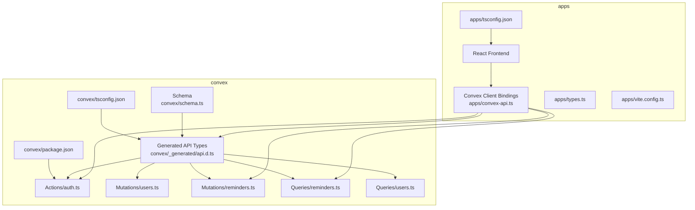
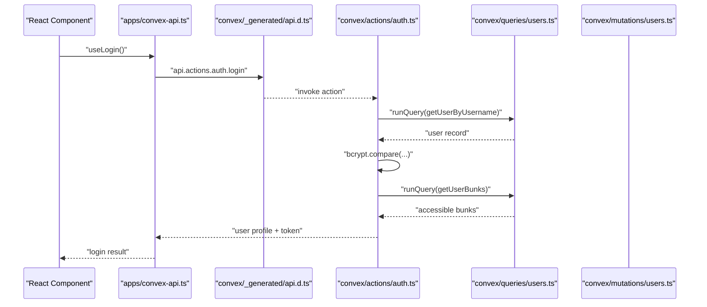
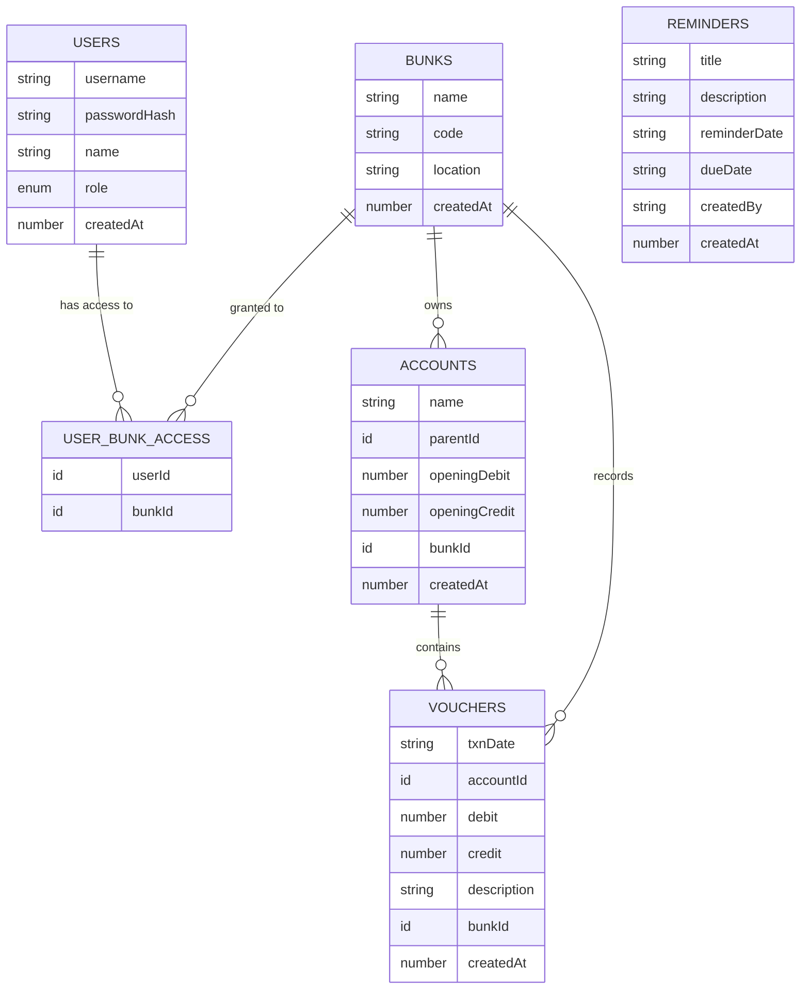
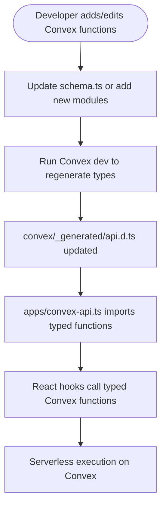
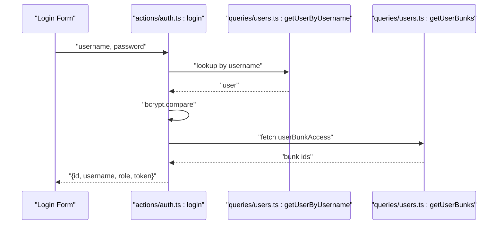
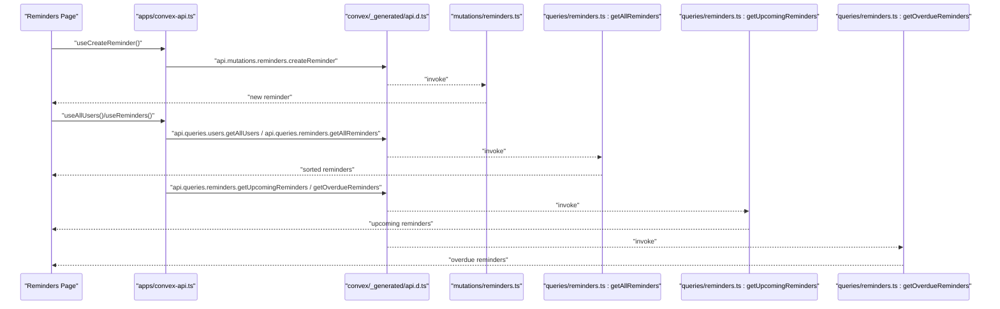
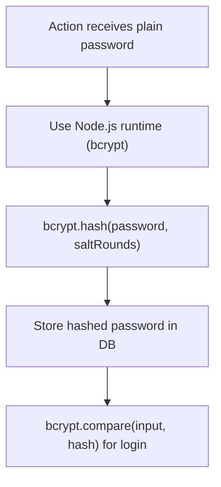
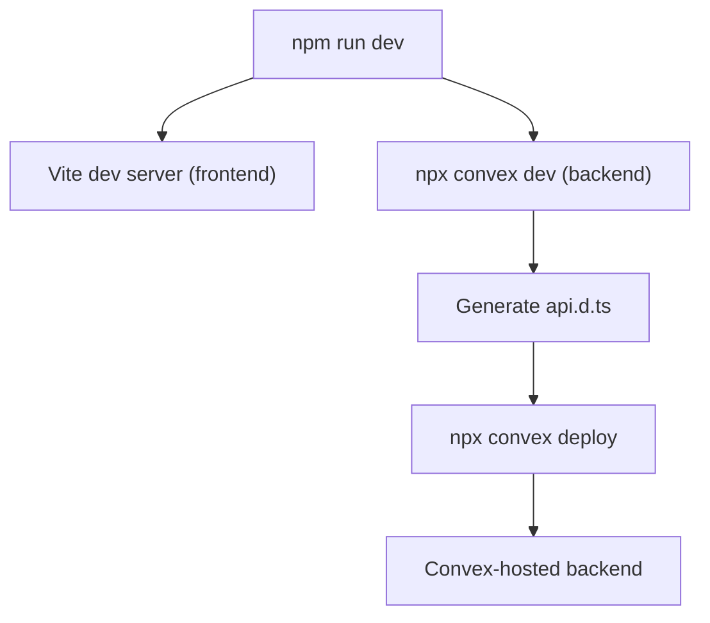
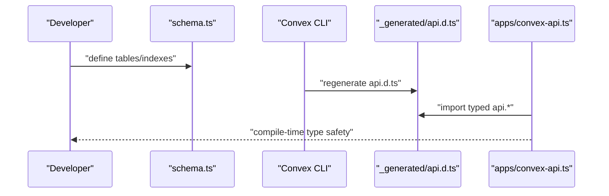
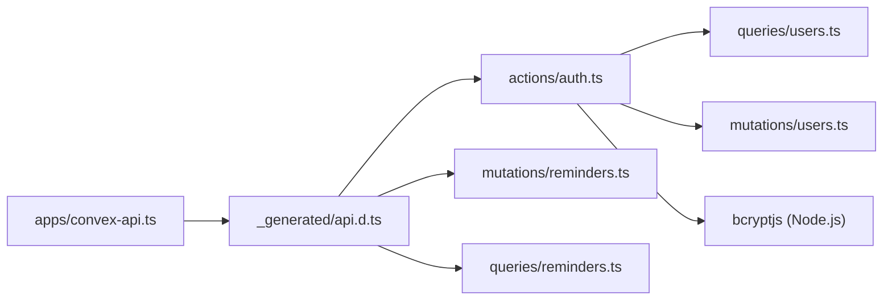

# Convex Integration

<cite>
**Referenced Files in This Document**
- [schema.ts](file://convex/schema.ts)
- [api.d.ts](file://convex/_generated/api.d.ts)
- [convex-api.ts](file://apps/convex-api.ts)
- [auth.ts](file://convex/actions/auth.ts)
- [users.ts](file://convex/mutations/users.ts)
- [reminders.ts](file://convex/queries/reminders.ts)
- [reminders.ts](file://convex/mutations/reminders.ts)
- [users.ts](file://convex/queries/users.ts)
- [package.json](file://convex/package.json)
- [package.json](file://package.json)
- [tsconfig.json](file://convex/tsconfig.json)
- [tsconfig.json](file://apps/tsconfig.json)
- [vite.config.ts](file://apps/vite.config.ts)
- [types.ts](file://apps/types.ts)
- [metadata.json](file://apps/metadata.json)
- [README.md](file://README.md)
</cite>

## Table of Contents
1. [Introduction](#introduction)
2. [Project Structure](#project-structure)
3. [Core Components](#core-components)
4. [Architecture Overview](#architecture-overview)
5. [Detailed Component Analysis](#detailed-component-analysis)
6. [Dependency Analysis](#dependency-analysis)
7. [Performance Considerations](#performance-considerations)
8. [Troubleshooting Guide](#troubleshooting-guide)
9. [Conclusion](#conclusion)
10. [Appendices](#appendices)

## Introduction
This document explains how KR-FUELS integrates Convex to deliver a serverless backend with automatic API generation, type-safe client–server communication, and schema-driven development. It covers the Convex metadata system, the Action–Mutation–Query pattern, the Node.js runtime for password hashing, and the build and deployment pipeline. Practical examples are drawn from the codebase to illustrate how TypeScript types are generated from the schema and how the frontend consumes typed Convex APIs.

## Project Structure
The repository is organized into two primary parts:
- apps: React frontend and Convex client bindings
- convex: Convex backend with schema, actions, mutations, queries, and generated artifacts

**Diagram sources**
- [convex-api.ts](file://apps/convex-api.ts#L1-L33)
- [api.d.ts](file://convex/_generated/api.d.ts#L1-L76)
- [schema.ts](file://convex/schema.ts#L1-L85)
- [auth.ts](file://convex/actions/auth.ts#L1-L148)
- [users.ts](file://convex/mutations/users.ts#L1-L81)
- [reminders.ts](file://convex/mutations/reminders.ts#L1-L116)
- [reminders.ts](file://convex/queries/reminders.ts#L1-L71)
- [users.ts](file://convex/queries/users.ts#L1-L35)
- [package.json](file://convex/package.json#L1-L10)
- [tsconfig.json](file://convex/tsconfig.json#L1-L27)
- [tsconfig.json](file://apps/tsconfig.json#L1-L24)
- [vite.config.ts](file://apps/vite.config.ts#L1-L16)

**Section sources**
- [README.md](file://README.md#L1-L13)
- [package.json](file://package.json#L1-L26)
- [convex/package.json](file://convex/package.json#L1-L10)
- [convex/tsconfig.json](file://convex/tsconfig.json#L1-L27)
- [apps/tsconfig.json](file://apps/tsconfig.json#L1-L24)

## Core Components
- Schema-driven data model: Defines tables, indexes, and relationships for bunks, users, user–bunk access, accounts, vouchers, and reminders.
- Generated API types: Automatic TypeScript types for actions, mutations, and queries enable compile-time safety and IDE support.
- Action–Mutation–Query pattern:
  - Actions orchestrate server-side logic and can use the Node.js runtime (e.g., bcrypt).
  - Mutations perform writes to the database.
  - Queries perform reads and can leverage indexes for efficient retrieval.
- Frontend client bindings: Typed wrappers around Convex functions simplify usage in React components.

Key implementation references:
- Schema definition and indexes: [schema.ts](file://convex/schema.ts#L1-L85)
- Generated API surface: [api.d.ts](file://convex/_generated/api.d.ts#L1-L76)
- Authentication actions using Node.js runtime: [auth.ts](file://convex/actions/auth.ts#L1-L148)
- User mutations: [users.ts](file://convex/mutations/users.ts#L1-L81)
- Reminder mutations and queries: [reminders.ts](file://convex/mutations/reminders.ts#L1-L116), [reminders.ts](file://convex/queries/reminders.ts#L1-L71)
- Frontend typed bindings: [convex-api.ts](file://apps/convex-api.ts#L1-L33)

**Section sources**
- [schema.ts](file://convex/schema.ts#L1-L85)
- [api.d.ts](file://convex/_generated/api.d.ts#L1-L76)
- [auth.ts](file://convex/actions/auth.ts#L1-L148)
- [users.ts](file://convex/mutations/users.ts#L1-L81)
- [reminders.ts](file://convex/mutations/reminders.ts#L1-L116)
- [reminders.ts](file://convex/queries/reminders.ts#L1-L71)
- [convex-api.ts](file://apps/convex-api.ts#L1-L33)

## Architecture Overview
The system follows a schema-first, serverless architecture:
- The schema defines the domain model and indexes.
- Convex generates a strongly typed API module reflecting all actions, mutations, and queries.
- The frontend imports the generated API and invokes typed functions via Convex React hooks.
- Actions can call queries and mutations, and may use the Node.js runtime for cryptographic operations.

**Diagram sources**
- [convex-api.ts](file://apps/convex-api.ts#L1-L33)
- [api.d.ts](file://convex/_generated/api.d.ts#L1-L76)
- [auth.ts](file://convex/actions/auth.ts#L1-L148)
- [users.ts](file://convex/queries/users.ts#L1-L35)
- [users.ts](file://convex/mutations/users.ts#L1-L81)

## Detailed Component Analysis

### Schema-Driven Data Model
The schema defines six tables with explicit indexes to optimize queries:
- bunks: station locations with a unique, indexed code.
- users: admin/super_admin users with indexed usernames and hashed passwords.
- userBunkAccess: many-to-many relationship between users and bunks.
- accounts: hierarchical chart of accounts with self-reference and indexes.
- vouchers: daily transaction records with composite indexes for date and account.
- reminders: task items with indexes for due dates and reminder dates.

**Diagram sources**
- [schema.ts](file://convex/schema.ts#L1-L85)

**Section sources**
- [schema.ts](file://convex/schema.ts#L1-L85)

### Automatic API Generation and Type-Safe Client Communication
Convex generates a strongly typed API module that reflects all backend functions. The frontend imports this module and uses React hooks to call typed functions. The generated module exposes:
- api: public functions callable from the client.
- internal: internal functions used by other serverless functions.

**Diagram sources**
- [api.d.ts](file://convex/_generated/api.d.ts#L1-L76)
- [convex-api.ts](file://apps/convex-api.ts#L1-L33)

**Section sources**
- [api.d.ts](file://convex/_generated/api.d.ts#L1-L76)
- [convex-api.ts](file://apps/convex-api.ts#L1-L33)

### Action–Mutation–Query Pattern Examples

#### Authentication Flow (Action)
The login action validates credentials using bcrypt (Node.js runtime), retrieves accessible bunks, and returns a safe user profile with a simple token.

**Diagram sources**
- [auth.ts](file://convex/actions/auth.ts#L18-L56)
- [users.ts](file://convex/queries/users.ts#L4-L22)

**Section sources**
- [auth.ts](file://convex/actions/auth.ts#L1-L148)
- [users.ts](file://convex/queries/users.ts#L1-L35)

#### Reminder CRUD (Mutation + Query)
Create, update, and delete reminders are implemented as mutations; queries fetch lists and filtered sets.

**Diagram sources**
- [convex-api.ts](file://apps/convex-api.ts#L10-L20)
- [reminders.ts](file://convex/mutations/reminders.ts#L12-L48)
- [reminders.ts](file://convex/queries/reminders.ts#L12-L71)

**Section sources**
- [reminders.ts](file://convex/mutations/reminders.ts#L1-L116)
- [reminders.ts](file://convex/queries/reminders.ts#L1-L71)
- [convex-api.ts](file://apps/convex-api.ts#L1-L33)

### Node.js Runtime Usage for Password Hashing
The Node.js runtime is enabled in actions to use bcrypt for secure password hashing and verification. The bcrypt dependency is declared in the Convex package configuration.

**Diagram sources**
- [auth.ts](file://convex/actions/auth.ts#L1-L148)
- [package.json](file://convex/package.json#L6-L8)

**Section sources**
- [auth.ts](file://convex/actions/auth.ts#L1-L148)
- [package.json](file://convex/package.json#L1-L10)

### Build Process and Deployment Pipeline
- Local development: The root project runs Vite for the frontend; Convex development is managed by the Convex CLI.
- Build: The frontend builds via Vite; Convex generates API types during development.
- Deployment: The Convex CLI manages deployment of backend functions and schema migrations.

**Diagram sources**
- [README.md](file://README.md#L3-L11)
- [package.json](file://package.json#L6-L10)
- [api.d.ts](file://convex/_generated/api.d.ts#L7-L8)

**Section sources**
- [README.md](file://README.md#L1-L13)
- [package.json](file://package.json#L1-L26)

### How TypeScript Types Are Automatically Created from the Schema
- The schema defines tables and indexes.
- Convex regenerates the API type module, exporting strongly typed references to actions, mutations, and queries.
- The frontend imports these types to ensure compile-time safety when calling backend functions.

**Diagram sources**
- [schema.ts](file://convex/schema.ts#L1-L85)
- [api.d.ts](file://convex/_generated/api.d.ts#L1-L76)
- [convex-api.ts](file://apps/convex-api.ts#L1-L3)

**Section sources**
- [schema.ts](file://convex/schema.ts#L1-L85)
- [api.d.ts](file://convex/_generated/api.d.ts#L1-L76)
- [convex-api.ts](file://apps/convex-api.ts#L1-L33)

## Dependency Analysis
- Frontend depends on the generated API module and Convex React hooks.
- Backend actions depend on queries and mutations; mutations depend on the database context.
- The bcrypt library is a runtime dependency for actions requiring cryptographic operations.

**Diagram sources**
- [convex-api.ts](file://apps/convex-api.ts#L1-L33)
- [api.d.ts](file://convex/_generated/api.d.ts#L1-L76)
- [auth.ts](file://convex/actions/auth.ts#L1-L148)
- [reminders.ts](file://convex/mutations/reminders.ts#L1-L116)
- [reminders.ts](file://convex/queries/reminders.ts#L1-L71)
- [users.ts](file://convex/queries/users.ts#L1-L35)
- [users.ts](file://convex/mutations/users.ts#L1-L81)
- [package.json](file://convex/package.json#L6-L8)

**Section sources**
- [convex-api.ts](file://apps/convex-api.ts#L1-L33)
- [api.d.ts](file://convex/_generated/api.d.ts#L1-L76)
- [auth.ts](file://convex/actions/auth.ts#L1-L148)
- [reminders.ts](file://convex/mutations/reminders.ts#L1-L116)
- [reminders.ts](file://convex/queries/reminders.ts#L1-L71)
- [users.ts](file://convex/queries/users.ts#L1-L35)
- [users.ts](file://convex/mutations/users.ts#L1-L81)
- [package.json](file://convex/package.json#L1-L10)

## Performance Considerations
- Use indexes defined in the schema to speed up lookups (e.g., by_username, by_code, by_bunk_and_date).
- Prefer single-query reads where possible; batch related reads within a single action if needed.
- Keep action handlers small and delegate write operations to mutations.
- Leverage query ordering and filtering to reduce payload sizes on the client.
- Avoid unnecessary data transfer; return only the fields required by the UI.

## Troubleshooting Guide
- Invalid credentials errors during login indicate mismatched username or password; verify the stored hash and input.
- Username already exists errors during registration suggest a duplicate; ensure uniqueness checks pass.
- Reminder date format errors occur when dates are not in the required format; validate inputs before invoking mutations.
- Missing user or reminder errors indicate missing records; confirm existence before updates or deletes.
- Type errors after schema changes require regeneration of the API types; run the Convex dev command to refresh types.

**Section sources**
- [auth.ts](file://convex/actions/auth.ts#L23-L54)
- [reminders.ts](file://convex/mutations/reminders.ts#L23-L34)
- [reminders.ts](file://convex/mutations/reminders.ts#L106-L114)

## Conclusion
KR-FUELS leverages Convex’s schema-first approach to achieve type-safe, serverless backend development. The Action–Mutation–Query pattern cleanly separates concerns, while the Node.js runtime enables secure operations like password hashing. Automatic API generation ensures strong typing across the client and server, simplifying development and reducing runtime errors. The build and deployment pipeline integrates seamlessly with Vite for the frontend and Convex for the backend.

## Appendices

### Best Practices for Extending the Backend
- Define schema changes first; regenerate types and update frontend bindings.
- Keep actions minimal and focused; compose queries and mutations as needed.
- Add indexes for frequently queried fields to improve read performance.
- Centralize validation in mutations and queries to maintain consistency.
- Use enums and literals in the schema to constrain data and improve type safety.

### Example Frontend Types for Reference
The frontend maintains local TypeScript interfaces for domain entities to align with the schema.

**Section sources**
- [types.ts](file://apps/types.ts#L1-L56)

### Application Metadata
Application metadata is configured for the frontend runtime.

**Section sources**
- [metadata.json](file://apps/metadata.json#L1-L5)