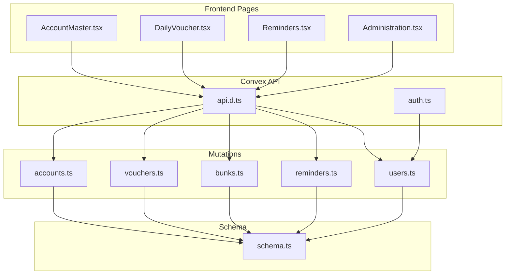
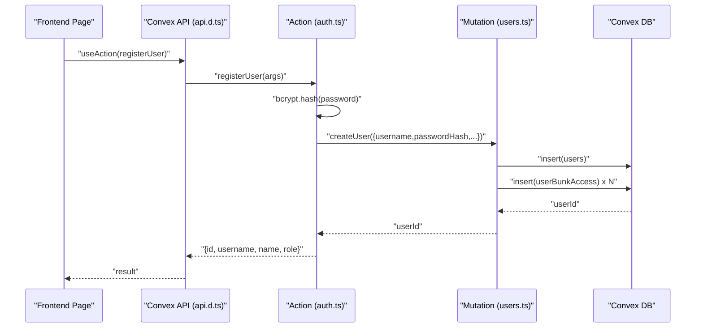
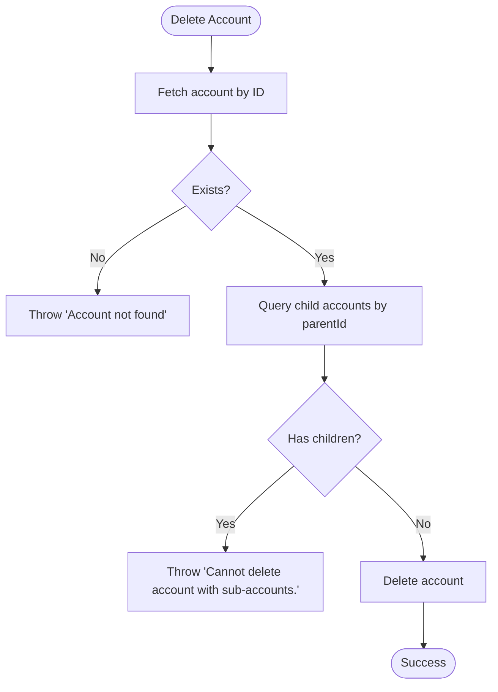
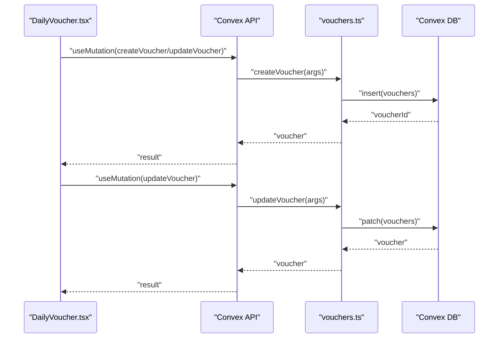
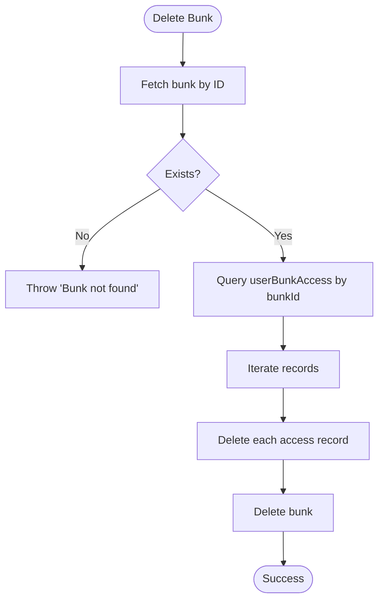
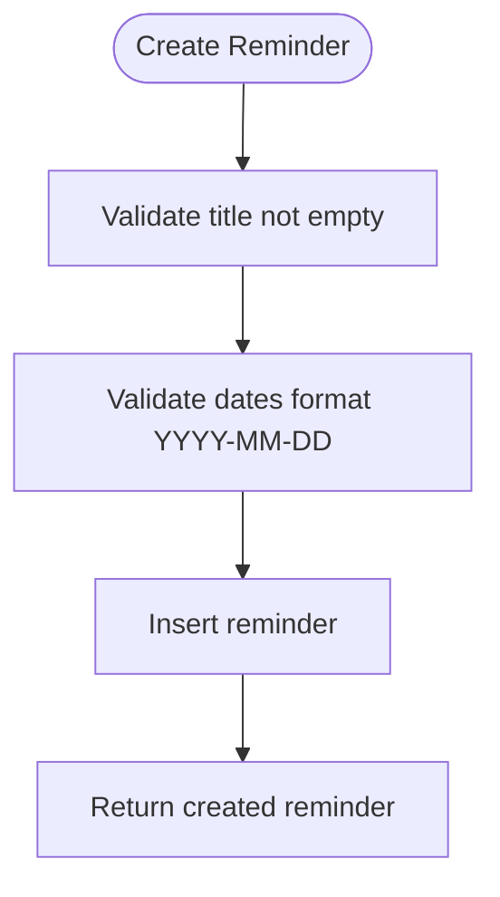
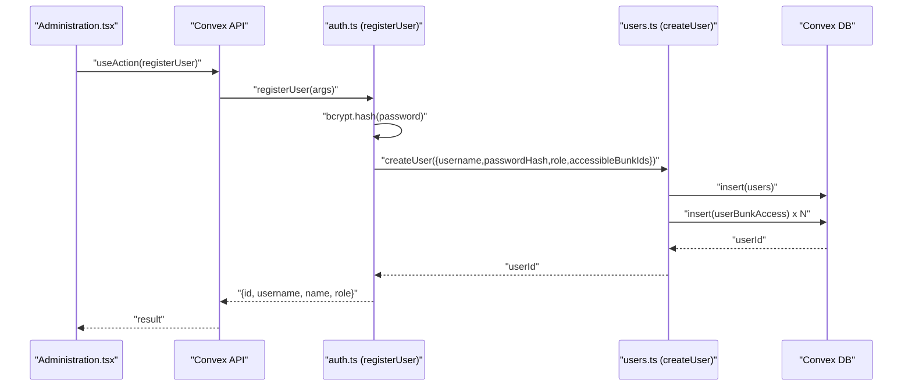
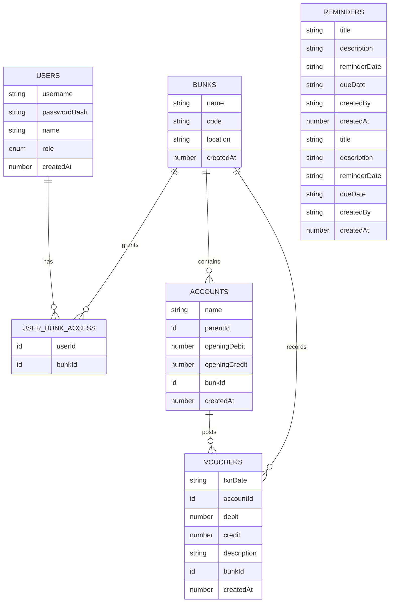

# Data Operations

<cite>
**Referenced Files in This Document**
- [accounts.ts](file://convex/mutations/accounts.ts)
- [vouchers.ts](file://convex/mutations/vouchers.ts)
- [bunks.ts](file://convex/mutations/bunks.ts)
- [reminders.ts](file://convex/mutations/reminders.ts)
- [users.ts](file://convex/mutations/users.ts)
- [schema.ts](file://convex/schema.ts)
- [api.d.ts](file://convex/_generated/api.d.ts)
- [convex-api.ts](file://apps/convex-api.ts)
- [types.ts](file://apps/types.ts)
- [utils.ts](file://apps/utils.ts)
- [AccountMaster.tsx](file://apps/pages/AccountMaster.tsx)
- [DailyVoucher.tsx](file://apps/pages/DailyVoucher.tsx)
- [Reminders.tsx](file://apps/pages/Reminders.tsx)
- [Administration.tsx](file://apps/pages/Administration.tsx)
- [auth.ts](file://convex/actions/auth.ts)
</cite>

## Table of Contents
1. [Introduction](#introduction)
2. [Project Structure](#project-structure)
3. [Core Components](#core-components)
4. [Architecture Overview](#architecture-overview)
5. [Detailed Component Analysis](#detailed-component-analysis)
6. [Dependency Analysis](#dependency-analysis)
7. [Performance Considerations](#performance-considerations)
8. [Troubleshooting Guide](#troubleshooting-guide)
9. [Conclusion](#conclusion)
10. [Appendices](#appendices)

## Introduction
This document explains the Convex mutation operations that power data write operations in KR-FUELS. It focuses on the Action-Mutation pattern, detailing how frontend components trigger mutations and how backend mutations enforce validation, manage relationships, and maintain data consistency. It covers:
- Hierarchical account structure and balance calculations
- Voucher posting with debit/credit processing and real-time balance updates
- Reminder creation and management workflows
- User management operations including CRUD and permission updates
- Transaction management, error handling, and performance optimization strategies

## Project Structure
The data write layer is organized around Convex mutations and actions, with frontend pages orchestrating user interactions and state transitions. The schema defines tables and indexes that underpin these operations.

**Diagram sources**
- [api.d.ts](file://convex/_generated/api.d.ts#L32-L47)
- [accounts.ts](file://convex/mutations/accounts.ts#L1-L63)
- [vouchers.ts](file://convex/mutations/vouchers.ts#L1-L59)
- [bunks.ts](file://convex/mutations/bunks.ts#L1-L37)
- [reminders.ts](file://convex/mutations/reminders.ts#L1-L116)
- [users.ts](file://convex/mutations/users.ts#L1-L81)
- [schema.ts](file://convex/schema.ts#L9-L84)
- [auth.ts](file://convex/actions/auth.ts#L1-L148)

**Section sources**
- [api.d.ts](file://convex/_generated/api.d.ts#L1-L76)
- [schema.ts](file://convex/schema.ts#L1-L85)

## Core Components
This section outlines the primary mutation modules and their responsibilities, along with validation and error handling strategies.

- Accounts: Create, update, and delete hierarchical chart-of-accounts entries with opening balances and parent-child relationships.
- Vouchers: Create, update, and delete daily transaction entries with debit/credit amounts linked to accounts and bunks.
- Bunks: Create fuel station locations and cascade-delete associated user access records.
- Reminders: Create, update, and delete reminder items with strict date format validation.
- Users: Create users with hashed passwords and manage permissions via a junction table; update/delete users and their access records.

Validation and error handling:
- Mutations validate arguments and throw explicit errors for missing records or invalid states (e.g., deleting an account with sub-accounts).
- Frontend pages surface errors and coordinate safe state transitions.

**Section sources**
- [accounts.ts](file://convex/mutations/accounts.ts#L1-L63)
- [vouchers.ts](file://convex/mutations/vouchers.ts#L1-L59)
- [bunks.ts](file://convex/mutations/bunks.ts#L1-L37)
- [reminders.ts](file://convex/mutations/reminders.ts#L1-L116)
- [users.ts](file://convex/mutations/users.ts#L1-L81)

## Architecture Overview
The Action-Mutation pattern separates concerns:
- Actions (Node runtime): Perform tasks requiring external libraries (e.g., password hashing) and orchestrate cross-table operations.
- Mutations (Server runtime): Persist writes and enforce referential and structural constraints.

**Diagram sources**
- [api.d.ts](file://convex/_generated/api.d.ts#L11-L24)
- [auth.ts](file://convex/actions/auth.ts#L62-L104)
- [users.ts](file://convex/mutations/users.ts#L13-L41)

**Section sources**
- [auth.ts](file://convex/actions/auth.ts#L1-L148)
- [users.ts](file://convex/mutations/users.ts#L1-L81)

## Detailed Component Analysis

### Accounts: Hierarchical Structure and Balance Calculations
Accounts form a self-referencing hierarchy with opening debit/credit balances. The mutation handlers enforce referential integrity and prevent deletion of accounts with sub-accounts.

Key behaviors:
- Create account with optional parent, opening balances, and bunk association.
- Update account details and enforce existence.
- Delete account only if no child accounts exist.

**Diagram sources**
- [accounts.ts](file://convex/mutations/accounts.ts#L45-L61)

Frontend integration:
- The Account Master page supports creating groups, selecting parents, and saving/updating accounts.
- Utilities compute hierarchy paths and child accounts for display.

**Section sources**
- [accounts.ts](file://convex/mutations/accounts.ts#L1-L63)
- [AccountMaster.tsx](file://apps/pages/AccountMaster.tsx#L1-L228)
- [utils.ts](file://apps/utils.ts#L20-L25)
- [utils.ts](file://apps/utils.ts#L66-L69)

### Vouchers: Debit/Credit Posting and Real-Time Balances
Vouchers represent daily transactions linked to accounts and bunks. The mutation handlers insert/update/delete voucher records and rely on client-side calculations for real-time balances.

Key behaviors:
- Create voucher with date, account, debit/credit, description, and bunk.
- Update voucher with validation and existence checks.
- Delete voucher after confirming existence.

**Diagram sources**
- [vouchers.ts](file://convex/mutations/vouchers.ts#L4-L59)
- [DailyVoucher.tsx](file://apps/pages/DailyVoucher.tsx#L111-L150)

Frontend balance computation:
- Opening balance equals sum of all accounts’ openingDebit minus openingCredit.
- Totals credit and debit are computed per batch row.
- Closing balance equals opening plus total credit minus total debit.

**Section sources**
- [vouchers.ts](file://convex/mutations/vouchers.ts#L1-L59)
- [DailyVoucher.tsx](file://apps/pages/DailyVoucher.tsx#L47-L150)
- [utils.ts](file://apps/utils.ts#L27-L64)

### Bunks: Fuel Station Locations and Access Cleanup
Bunks represent fuel station locations. Deleting a bunk cascades to remove associated user access records.

Key behaviors:
- Create bunk with name, code, and location.
- Delete bunk and all userBunkAccess records for that bunk.

**Diagram sources**
- [bunks.ts](file://convex/mutations/bunks.ts#L20-L36)

**Section sources**
- [bunks.ts](file://convex/mutations/bunks.ts#L1-L37)

### Reminders: Creation, Updates, and Validation
Reminders support task/reminder management with strict date validation.

Key behaviors:
- Create reminder with title, description, reminderDate, and dueDate; validates presence and format (YYYY-MM-DD).
- Update reminder with the same validations.
- Delete reminder after existence check.

**Diagram sources**
- [reminders.ts](file://convex/mutations/reminders.ts#L12-L48)

**Section sources**
- [reminders.ts](file://convex/mutations/reminders.ts#L1-L116)
- [Reminders.tsx](file://apps/pages/Reminders.tsx#L39-L66)

### Users: CRUD and Permission Management
User management integrates with authentication actions for secure registration and password changes.

Key behaviors:
- Create user with username, hashed password, name, role, and accessible bunk IDs; grants access via userBunkAccess records.
- Update user password by hashing the new password in an action and patching the stored hash.
- Delete user and all associated userBunkAccess records.

**Diagram sources**
- [Administration.tsx](file://apps/pages/Administration.tsx#L67-L83)
- [auth.ts](file://convex/actions/auth.ts#L62-L104)
- [users.ts](file://convex/mutations/users.ts#L13-L41)

**Section sources**
- [users.ts](file://convex/mutations/users.ts#L1-L81)
- [Administration.tsx](file://apps/pages/Administration.tsx#L67-L92)
- [auth.ts](file://convex/actions/auth.ts#L1-L148)

## Dependency Analysis
The schema defines tables and indexes that enable efficient queries and maintain referential integrity. Mutations depend on these definitions to enforce constraints.

**Diagram sources**
- [schema.ts](file://convex/schema.ts#L13-L83)

**Section sources**
- [schema.ts](file://convex/schema.ts#L1-L85)

## Performance Considerations
- Index usage: Queries leverage indexes (e.g., by_code, by_username, by_parent, by_bunk, by_account, by_bunk_and_date, by_due_date, by_reminder_date) to minimize scan costs.
- Batch operations: The Daily Voucher page supports batching multiple rows and posting them in a single operation, reducing round-trips.
- Client-side computations: Ledger balances and hierarchy paths are computed on the client to avoid frequent server calls.
- Cascading deletes: Bunk deletion removes dependent access records in a loop; consider consolidating deletions for very large datasets.
- Validation early exit: Mutations validate inputs and throw early to reduce unnecessary database work.

[No sources needed since this section provides general guidance]

## Troubleshooting Guide
Common issues and resolutions:
- Account deletion fails with “Cannot delete account with sub-accounts”: Ensure the account has no child accounts before deletion.
- Voucher not found errors: Verify the voucher ID exists before attempting updates/deletes.
- Reminder validation failures: Ensure reminderDate and dueDate match the required format (YYYY-MM-DD) and title is non-empty.
- User creation failures: Check for duplicate usernames and password length constraints.
- Bunk deletion affects access: Confirm that user access records are removed alongside the bunk.

**Section sources**
- [accounts.ts](file://convex/mutations/accounts.ts#L45-L61)
- [vouchers.ts](file://convex/mutations/vouchers.ts#L49-L57)
- [reminders.ts](file://convex/mutations/reminders.ts#L12-L48)
- [users.ts](file://convex/mutations/users.ts#L13-L41)
- [bunks.ts](file://convex/mutations/bunks.ts#L20-L36)

## Conclusion
KR-FUELS leverages Convex’s Action-Mutation pattern to implement robust, validated, and consistent data write operations. Hierarchical accounts, voucher posting, reminder management, and user administration are supported by clear schemas, targeted mutations, and thoughtful frontend integrations. By combining server-side validation, client-side computations, and efficient indexing, the system maintains performance and reliability across complex financial workflows.

[No sources needed since this section summarizes without analyzing specific files]

## Appendices

### Example Workflows

- Batch voucher processing:
  - The Daily Voucher page aggregates rows, validates entries, and posts them in a single operation. See [DailyVoucher.tsx](file://apps/pages/DailyVoucher.tsx#L111-L150).

- Hierarchical account updates:
  - Use the Account Master page to select a parent, adjust opening balances, and save changes. See [AccountMaster.tsx](file://apps/pages/AccountMaster.tsx#L46-L75).

- Reminder lifecycle:
  - Add reminders via the Reminders page, validate dates, and manage updates/deletions. See [Reminders.tsx](file://apps/pages/Reminders.tsx#L39-L86).

- User registration and permissions:
  - Use the Administration page to register users and assign bunk access; actions hash passwords and mutations grant permissions. See [Administration.tsx](file://apps/pages/Administration.tsx#L67-L83) and [auth.ts](file://convex/actions/auth.ts#L62-L104).

**Section sources**
- [DailyVoucher.tsx](file://apps/pages/DailyVoucher.tsx#L111-L150)
- [AccountMaster.tsx](file://apps/pages/AccountMaster.tsx#L46-L75)
- [Reminders.tsx](file://apps/pages/Reminders.tsx#L39-L86)
- [Administration.tsx](file://apps/pages/Administration.tsx#L67-L83)
- [auth.ts](file://convex/actions/auth.ts#L62-L104)