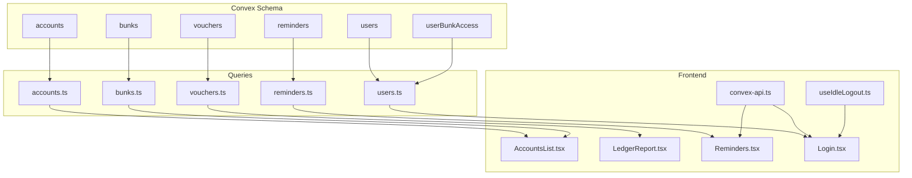
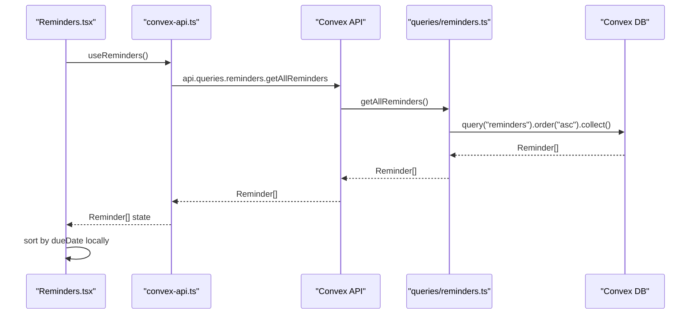
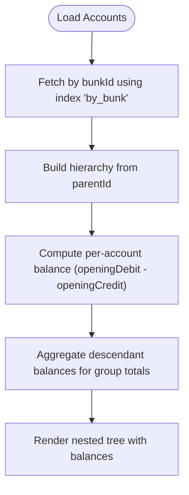
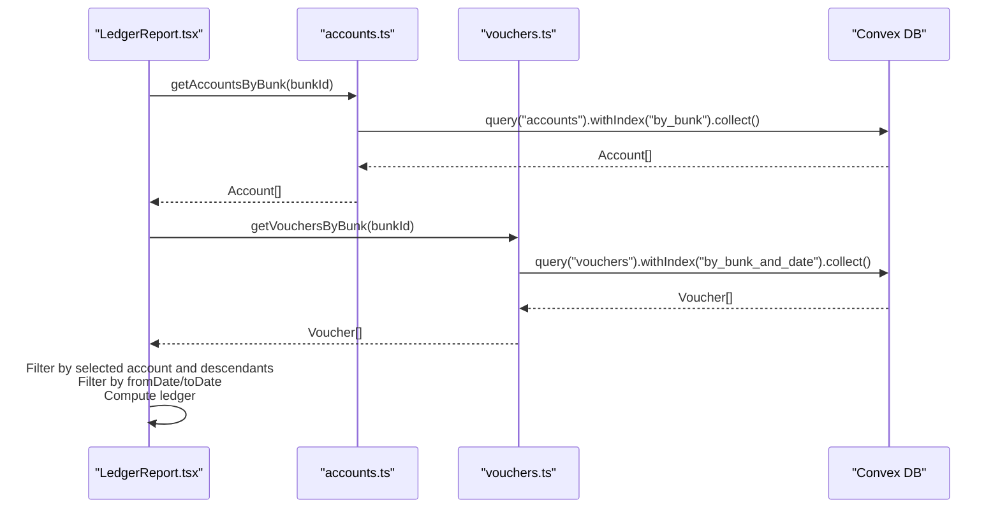
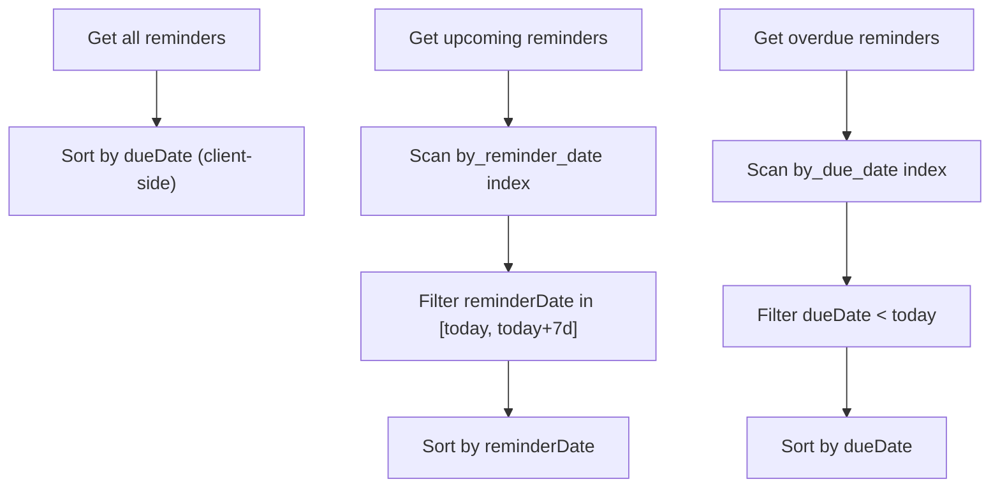
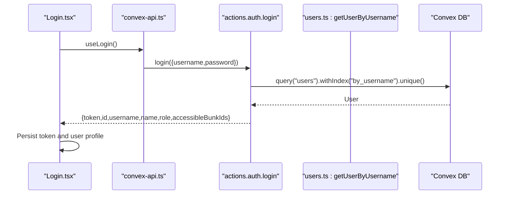
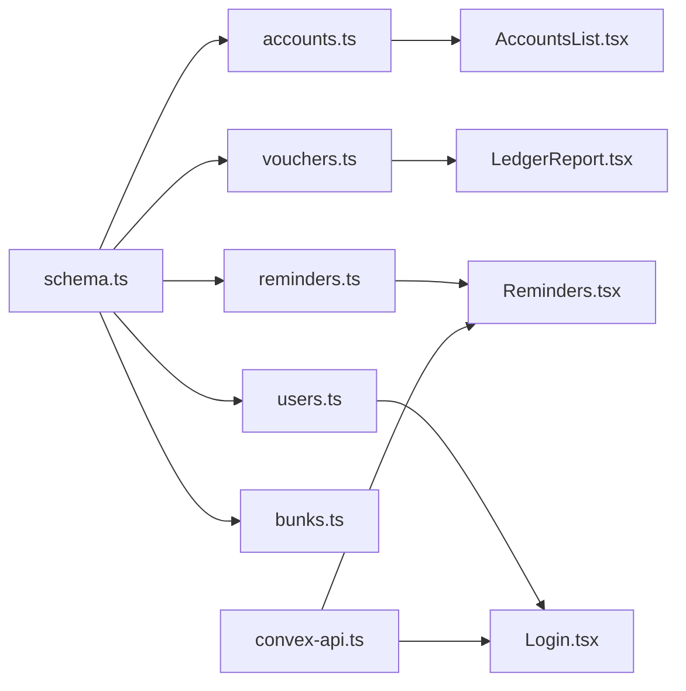

# Query Operations

<cite>
**Referenced Files in This Document**
- [schema.ts](file://convex/schema.ts)
- [accounts.ts](file://convex/queries/accounts.ts)
- [vouchers.ts](file://convex/queries/vouchers.ts)
- [bunks.ts](file://convex/queries/bunks.ts)
- [reminders.ts](file://convex/queries/reminders.ts)
- [users.ts](file://convex/queries/users.ts)
- [AccountsList.tsx](file://apps/pages/AccountsList.tsx)
- [LedgerReport.tsx](file://apps/pages/LedgerReport.tsx)
- [Reminders.tsx](file://apps/pages/Reminders.tsx)
- [Login.tsx](file://apps/pages/Login.tsx)
- [convex-api.ts](file://apps/convex-api.ts)
- [useIdleLogout.ts](file://apps/hooks/useIdleLogout.ts)
</cite>

## Table of Contents
1. [Introduction](#introduction)
2. [Project Structure](#project-structure)
3. [Core Components](#core-components)
4. [Architecture Overview](#architecture-overview)
5. [Detailed Component Analysis](#detailed-component-analysis)
6. [Dependency Analysis](#dependency-analysis)
7. [Performance Considerations](#performance-considerations)
8. [Troubleshooting Guide](#troubleshooting-guide)
9. [Conclusion](#conclusion)
10. [Appendices](#appendices)

## Introduction
This document explains the Convex query operations powering KR-FUELS data retrieval across accounts, vouchers, bunks, reminders, and users. It covers filtering, sorting, pagination strategies, hierarchical account resolution and balance aggregation, voucher date-range filtering and ledger reporting, reminder due-date filtering and status management, and user authentication and accessible bunks retrieval. It also outlines performance optimization techniques, query composition patterns, and integration with frontend components and real-time synchronization approaches.

## Project Structure
The query layer is implemented in Convex under the convex/queries directory, with frontend pages and hooks under apps/pages and apps/hooks. The Convex schema defines tables and indexes that enable efficient querying.

**Diagram sources**
- [schema.ts](file://convex/schema.ts#L13-L83)
- [accounts.ts](file://convex/queries/accounts.ts#L4-L18)
- [vouchers.ts](file://convex/queries/vouchers.ts#L4-L18)
- [bunks.ts](file://convex/queries/bunks.ts#L11-L15)
- [reminders.ts](file://convex/queries/reminders.ts#L12-L70)
- [users.ts](file://convex/queries/users.ts#L4-L34)
- [AccountsList.tsx](file://apps/pages/AccountsList.tsx#L1-L254)
- [LedgerReport.tsx](file://apps/pages/LedgerReport.tsx#L1-L257)
- [Reminders.tsx](file://apps/pages/Reminders.tsx#L1-L388)
- [Login.tsx](file://apps/pages/Login.tsx#L1-L167)
- [convex-api.ts](file://apps/convex-api.ts#L1-L33)
- [useIdleLogout.ts](file://apps/hooks/useIdleLogout.ts#L1-L33)

**Section sources**
- [schema.ts](file://convex/schema.ts#L1-L85)
- [accounts.ts](file://convex/queries/accounts.ts#L1-L19)
- [vouchers.ts](file://convex/queries/vouchers.ts#L1-L19)
- [bunks.ts](file://convex/queries/bunks.ts#L1-L16)
- [reminders.ts](file://convex/queries/reminders.ts#L1-L71)
- [users.ts](file://convex/queries/users.ts#L1-L35)
- [AccountsList.tsx](file://apps/pages/AccountsList.tsx#L1-L254)
- [LedgerReport.tsx](file://apps/pages/LedgerReport.tsx#L1-L257)
- [Reminders.tsx](file://apps/pages/Reminders.tsx#L1-L388)
- [Login.tsx](file://apps/pages/Login.tsx#L1-L167)
- [convex-api.ts](file://apps/convex-api.ts#L1-L33)
- [useIdleLogout.ts](file://apps/hooks/useIdleLogout.ts#L1-L33)

## Core Components
- Accounts: Hierarchical chart-of-accounts with parent-child relationships and per-account balances derived from opening debit/credit.
- Vouchers: Daily transaction records with date, account linkage, and debits/credits for ledger reporting.
- Bunks: Fuel station locations with unique codes enabling cross-module filtering.
- Reminders: Task items with reminderDate and dueDate for status management.
- Users: Admin/super-admin users with roles and many-to-many access to bunks via userBunkAccess.

Key query patterns:
- Index-backed lookups for fast filtering by bunk, username, parent, and dates.
- Sorting and client-side filtering for reminders and general lists.
- Aggregation and consolidation in the UI for hierarchical totals and ledger reports.

**Section sources**
- [schema.ts](file://convex/schema.ts#L13-L83)
- [accounts.ts](file://convex/queries/accounts.ts#L4-L18)
- [vouchers.ts](file://convex/queries/vouchers.ts#L4-L18)
- [reminders.ts](file://convex/queries/reminders.ts#L12-L70)
- [users.ts](file://convex/queries/users.ts#L4-L34)

## Architecture Overview
The frontend integrates with Convex via typed hooks and actions. Pages subscribe to query results and drive UI updates. Mutations and actions manage write operations and authentication.

**Diagram sources**
- [Reminders.tsx](file://apps/pages/Reminders.tsx#L6-L31)
- [convex-api.ts](file://apps/convex-api.ts#L14-L16)
- [reminders.ts](file://convex/queries/reminders.ts#L12-L26)

**Section sources**
- [Reminders.tsx](file://apps/pages/Reminders.tsx#L1-L388)
- [convex-api.ts](file://apps/convex-api.ts#L1-L33)
- [reminders.ts](file://convex/queries/reminders.ts#L1-L71)

## Detailed Component Analysis

### Accounts Queries
- Purpose: Retrieve accounts per bunk and fetch all accounts for administrative views.
- Filtering: Index "by_bunk" ensures O(1) lookup by bunkId.
- Sorting: Not applied in the query; clients can sort by name or hierarchy.
- Pagination: Not implemented; use collect() for small to medium datasets.
- Hierarchical resolution and balance aggregation:
  - Parent-child relationships resolved client-side by traversing parentId.
  - Balances computed as openingDebit minus openingCredit per account.
  - Group balances computed recursively across descendants.

**Diagram sources**
- [accounts.ts](file://convex/queries/accounts.ts#L4-L11)
- [AccountsList.tsx](file://apps/pages/AccountsList.tsx#L41-L51)

**Section sources**
- [accounts.ts](file://convex/queries/accounts.ts#L1-L19)
- [AccountsList.tsx](file://apps/pages/AccountsList.tsx#L1-L254)

### Vouchers Queries
- Purpose: Retrieve vouchers per bunk and for global views.
- Filtering: Index "by_bunk_and_date" supports efficient date-range queries.
- Sorting: Not applied in the query; clients can sort by date.
- Pagination: Not implemented; use collect() for manageable sets.
- Ledger report generation:
  - Select target account(s) including descendants.
  - Consolidate openingDebit/openingCredit across descendants.
  - Filter vouchers by target account IDs and apply date range.
  - Compute running ledger entries client-side.

**Diagram sources**
- [LedgerReport.tsx](file://apps/pages/LedgerReport.tsx#L49-L75)
- [accounts.ts](file://convex/queries/accounts.ts#L4-L11)
- [vouchers.ts](file://convex/queries/vouchers.ts#L4-L11)

**Section sources**
- [vouchers.ts](file://convex/queries/vouchers.ts#L1-L19)
- [LedgerReport.tsx](file://apps/pages/LedgerReport.tsx#L1-L257)

### Bunks Queries
- Purpose: Retrieve all bunks for selection and administrative views.
- Filtering: None; collect all bunks.
- Sorting: Not applied; clients can sort by name/code.
- Pagination: Not applicable for small location datasets.

**Section sources**
- [bunks.ts](file://convex/queries/bunks.ts#L1-L16)

### Reminders Queries
- Purpose: Retrieve reminders with due-date and reminder-date filtering and status computation.
- Filtering:
  - getAllReminders: Returns all reminders sorted by dueDate client-side.
  - getUpcomingReminders: Uses index "by_reminder_date" and filters by reminderDate within a future window.
  - getOverdueReminders: Uses index "by_due_date" and filters reminders whose dueDate is in the past.
- Sorting: Ascending order by dueDate for the base query; client-side locale comparison.
- Pagination: Not implemented; use collect() for small reminder sets.
- Status management: Computed client-side using today’s date for active/upcoming/overdue counts.

**Diagram sources**
- [reminders.ts](file://convex/queries/reminders.ts#L12-L70)

**Section sources**
- [reminders.ts](file://convex/queries/reminders.ts#L1-L71)
- [Reminders.tsx](file://apps/pages/Reminders.tsx#L1-L388)

### Users Queries
- Purpose: Authenticate users, resolve accessible bunks, and list users.
- Authentication:
  - getUserByUsername uses index "by_username" for O(1) lookup.
  - Frontend login stores token and user info in localStorage.
- Access control:
  - getUserBunks resolves userBunkAccess records by userId for accessible bunks.
- Pagination: Not implemented; use collect() for small user sets.

**Diagram sources**
- [Login.tsx](file://apps/pages/Login.tsx#L22-L56)
- [users.ts](file://convex/queries/users.ts#L4-L11)
- [convex-api.ts](file://apps/convex-api.ts#L7)

**Section sources**
- [users.ts](file://convex/queries/users.ts#L1-L35)
- [Login.tsx](file://apps/pages/Login.tsx#L1-L167)
- [convex-api.ts](file://apps/convex-api.ts#L1-L33)

## Dependency Analysis
- Queries depend on Convex indexes defined in the schema for efficient filtering.
- Frontend pages depend on typed hooks from convex-api.ts to consume query results.
- Authentication depends on actions.auth.login and user queries for credential verification.

**Diagram sources**
- [schema.ts](file://convex/schema.ts#L13-L83)
- [accounts.ts](file://convex/queries/accounts.ts#L4-L18)
- [vouchers.ts](file://convex/queries/vouchers.ts#L4-L18)
- [reminders.ts](file://convex/queries/reminders.ts#L12-L70)
- [users.ts](file://convex/queries/users.ts#L4-L34)
- [bunks.ts](file://convex/queries/bunks.ts#L11-L15)
- [AccountsList.tsx](file://apps/pages/AccountsList.tsx#L1-L254)
- [LedgerReport.tsx](file://apps/pages/LedgerReport.tsx#L1-L257)
- [Reminders.tsx](file://apps/pages/Reminders.tsx#L1-L388)
- [Login.tsx](file://apps/pages/Login.tsx#L1-L167)
- [convex-api.ts](file://apps/convex-api.ts#L1-L33)

**Section sources**
- [schema.ts](file://convex/schema.ts#L1-L85)
- [convex-api.ts](file://apps/convex-api.ts#L1-L33)

## Performance Considerations
Indexing strategies
- bunks: "by_code" enables fast lookup by fuel station code.
- users: "by_username" enables O(1) user lookup during login.
- userBunkAccess: "by_user", "by_bunk", "by_user_and_bunk" support efficient access checks and joins.
- accounts: "by_bunk", "by_parent" support hierarchical queries and parent-child traversal.
- vouchers: "by_bunk_and_date", "by_account" support date-range filtering and account-specific retrieval.
- reminders: "by_due_date", "by_reminder_date" support overdue and upcoming filtering.

Query composition and data loading patterns
- Prefer index-backed queries for filtering (e.g., withIndex).
- Minimize payload sizes by selecting only required fields in queries.
- Apply client-side sorting and filtering judiciously; keep datasets small where possible.
- For hierarchical aggregates, compute totals client-side after fetching minimal data.

Real-time synchronization
- Convex React hooks automatically subscribe to query results and update components on data changes.
- For long-running sessions, pair with idle logout to reduce stale subscriptions.

[No sources needed since this section provides general guidance]

## Troubleshooting Guide
Common issues and resolutions
- Empty results for accounts or vouchers:
  - Verify bunkId passed to queries matches existing records.
  - Ensure indexes exist and are correctly named in the schema.
- Incorrect balances in account lists:
  - Confirm openingDebit and openingCredit values are set.
  - Validate parent-child relationships and recursion logic.
- Ledger report gaps:
  - Check selected account and descendant expansion logic.
  - Confirm date range formatting matches stored 'YYYY-MM-DD'.
- Reminder status mismatches:
  - Validate today’s date calculation and timezone handling.
  - Confirm index usage for dueDate and reminderDate filters.
- Authentication failures:
  - Ensure username uniqueness and correct index usage.
  - Verify action login returns accessibleBunkIds and token.

**Section sources**
- [schema.ts](file://convex/schema.ts#L13-L83)
- [AccountsList.tsx](file://apps/pages/AccountsList.tsx#L41-L51)
- [LedgerReport.tsx](file://apps/pages/LedgerReport.tsx#L49-L75)
- [reminders.ts](file://convex/queries/reminders.ts#L33-L70)
- [users.ts](file://convex/queries/users.ts#L4-L11)
- [Login.tsx](file://apps/pages/Login.tsx#L30-L56)

## Conclusion
KR-FUELS leverages Convex queries with carefully designed indexes to deliver efficient data retrieval for accounts, vouchers, bunks, reminders, and users. Client-side computations handle hierarchical aggregation and ledger reporting, while typed hooks integrate seamlessly with frontend pages. By adhering to indexing best practices and mindful query composition, the system maintains responsiveness and accuracy across core accounting workflows.

[No sources needed since this section summarizes without analyzing specific files]

## Appendices

### API Surface Summary
- Accounts
  - getAccountsByBunk(bunkId): returns accounts for a given bunk.
  - getAllAccounts(): returns all accounts.
- Vouchers
  - getVouchersByBunk(bunkId): returns vouchers for a given bunk.
  - getAllVouchers(): returns all vouchers.
- Bunks
  - getAllBunks(): returns all bunks.
- Reminders
  - getAllReminders(): returns all reminders ordered by dueDate.
  - getUpcomingReminders(): returns reminders due within a week.
  - getOverdueReminders(): returns reminders past due.
- Users
  - getUserByUsername(username): returns a unique user by username.
  - getUserBunks(userId): returns user-bunk access records.
  - getAllUsers(): returns all users.
  - getAllUserBunkAccess(): returns all access records.

**Section sources**
- [accounts.ts](file://convex/queries/accounts.ts#L4-L18)
- [vouchers.ts](file://convex/queries/vouchers.ts#L4-L18)
- [bunks.ts](file://convex/queries/bunks.ts#L11-L15)
- [reminders.ts](file://convex/queries/reminders.ts#L12-L70)
- [users.ts](file://convex/queries/users.ts#L4-L34)