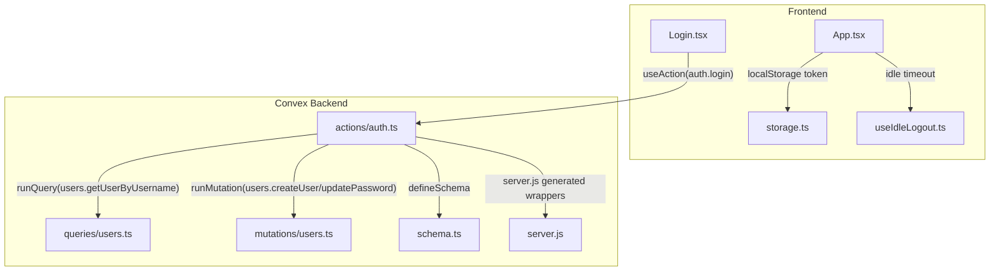
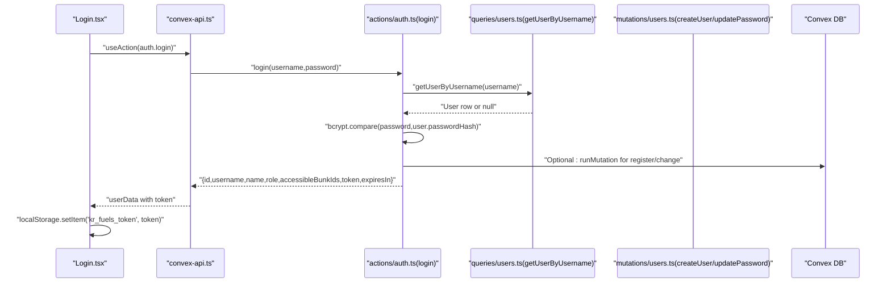
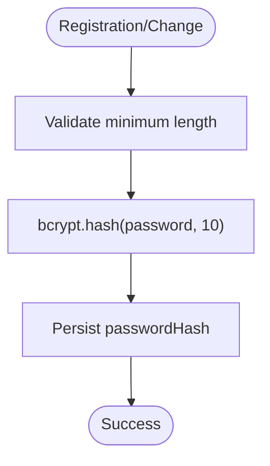
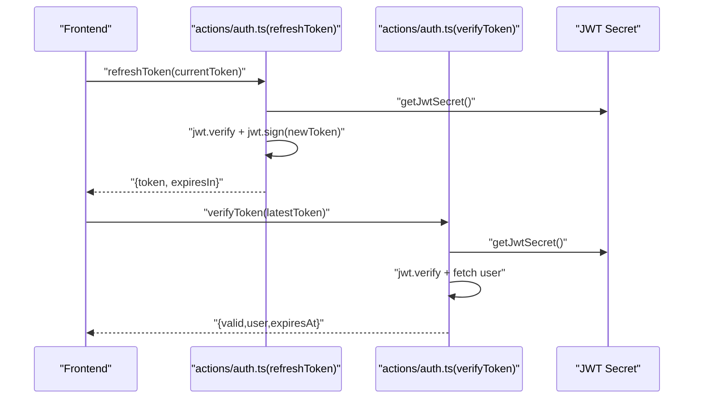
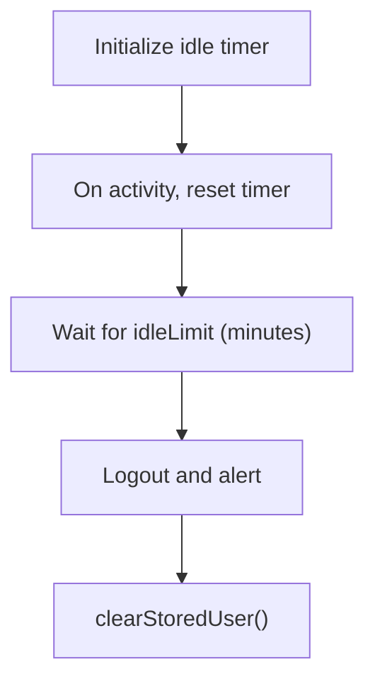
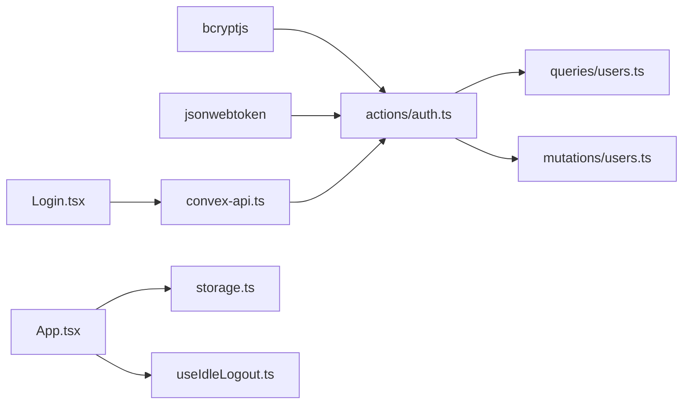

# Security Implementation

<cite>
**Referenced Files in This Document**
- [auth.ts](file://convex/actions/auth.ts)
- [users.ts](file://convex/mutations/users.ts)
- [users.ts](file://convex/queries/users.ts)
- [schema.ts](file://convex/schema.ts)
- [storage.ts](file://apps/lib/storage.ts)
- [useIdleLogout.ts](file://apps/hooks/useIdleLogout.ts)
- [Login.tsx](file://apps/pages/Login.tsx)
- [convex-api.ts](file://apps/convex-api.ts)
- [App.tsx](file://apps/App.tsx)
- [types.ts](file://apps/types.ts)
- [server.js](file://convex/_generated/server.js)
- [package.json](file://convex/package.json)
</cite>

## Table of Contents
1. [Introduction](#introduction)
2. [Project Structure](#project-structure)
3. [Core Components](#core-components)
4. [Architecture Overview](#architecture-overview)
5. [Detailed Component Analysis](#detailed-component-analysis)
6. [Dependency Analysis](#dependency-analysis)
7. [Performance Considerations](#performance-considerations)
8. [Troubleshooting Guide](#troubleshooting-guide)
9. [Conclusion](#conclusion)
10. [Appendices](#appendices)

## Introduction
This document describes the security implementation of the KR-FUELS backend and frontend. It focuses on password security (bcrypt hashing, validation rules, and constant-time comparison), authentication (JWT lifecycle, token verification, and refresh), access control (role-based permissions and bunk-level access), input validation, SQL injection prevention, XSS protections, error handling, audit trails, idle logout, and operational best practices. The backend is implemented with Convex actions and queries, while the frontend persists tokens and user state in local storage and enforces idle timeouts.

## Project Structure
Security-critical logic spans the backend Convex actions and schema, and the frontend’s token persistence and idle logout hooks. The following diagram maps the primary security-relevant modules.



**Diagram sources**
- [Login.tsx](file://apps/pages/Login.tsx#L28-L56)
- [storage.ts](file://apps/lib/storage.ts#L26-L33)
- [useIdleLogout.ts](file://apps/hooks/useIdleLogout.ts#L10-L31)
- [App.tsx](file://apps/App.tsx#L38-L45)
- [auth.ts](file://convex/actions/auth.ts#L31-L81)
- [users.ts](file://convex/queries/users.ts#L4-L12)
- [users.ts](file://convex/mutations/users.ts#L13-L41)
- [schema.ts](file://convex/schema.ts#L23-L29)
- [server.js](file://convex/_generated/server.js#L72-L72)

**Section sources**
- [auth.ts](file://convex/actions/auth.ts#L1-L266)
- [users.ts](file://convex/queries/users.ts#L1-L35)
- [users.ts](file://convex/mutations/users.ts#L1-L81)
- [schema.ts](file://convex/schema.ts#L1-L85)
- [storage.ts](file://apps/lib/storage.ts#L1-L34)
- [useIdleLogout.ts](file://apps/hooks/useIdleLogout.ts#L1-L33)
- [Login.tsx](file://apps/pages/Login.tsx#L1-L167)
- [convex-api.ts](file://apps/convex-api.ts#L1-L35)
- [App.tsx](file://apps/App.tsx#L26-L58)
- [types.ts](file://apps/types.ts#L1-L56)
- [server.js](file://convex/_generated/server.js#L1-L94)
- [package.json](file://convex/package.json#L1-L10)

## Core Components
- Password hashing and validation: bcrypt hashing with 10 rounds during registration/change; constant-time comparison during login.
- Authentication: JWT issuance with 24-hour expiry; token verification and refresh actions; environment-secret retrieval for signing.
- Access control: Role-based permissions (admin, super_admin) and bunk-level access via a junction table; frontend filters visible bunks per user.
- Input validation: Strongly typed arguments via Convex values; password length checks; role union validation.
- Persistence: Tokens stored in browser localStorage; sensitive keys managed via a constants module.
- Idle logout: Frontend idle detection with configurable timeout; automatic logout and alert.
- Error handling: Generic messages to avoid leaking sensitive details; explicit error propagation from backend.

**Section sources**
- [auth.ts](file://convex/actions/auth.ts#L105-L111)
- [auth.ts](file://convex/actions/auth.ts#L46-L47)
- [auth.ts](file://convex/actions/auth.ts#L60-L68)
- [auth.ts](file://convex/actions/auth.ts#L178-L227)
- [auth.ts](file://convex/actions/auth.ts#L232-L265)
- [schema.ts](file://convex/schema.ts#L23-L29)
- [schema.ts](file://convex/schema.ts#L34-L40)
- [storage.ts](file://apps/lib/storage.ts#L1-L34)
- [useIdleLogout.ts](file://apps/hooks/useIdleLogout.ts#L10-L31)
- [Login.tsx](file://apps/pages/Login.tsx#L30-L56)

## Architecture Overview
The authentication flow integrates frontend actions with backend Convex actions. The sequence below shows login, token issuance, and subsequent verification.



**Diagram sources**
- [Login.tsx](file://apps/pages/Login.tsx#L28-L56)
- [convex-api.ts](file://apps/convex-api.ts#L7-L11)
- [auth.ts](file://convex/actions/auth.ts#L31-L81)
- [users.ts](file://convex/queries/users.ts#L4-L12)
- [users.ts](file://convex/mutations/users.ts#L13-L41)

## Detailed Component Analysis

### Password Security
- Hashing: Registration and password change actions hash passwords using bcrypt with 10 rounds before persisting.
- Validation: Minimum length checks are enforced prior to hashing.
- Comparison: Login uses constant-time comparison to mitigate timing attacks.
- Storage: Password hashes are stored in the users table; raw passwords are not persisted.



**Diagram sources**
- [auth.ts](file://convex/actions/auth.ts#L105-L111)
- [auth.ts](file://convex/actions/auth.ts#L156-L162)
- [users.ts](file://convex/mutations/users.ts#L21-L29)

**Section sources**
- [auth.ts](file://convex/actions/auth.ts#L105-L111)
- [auth.ts](file://convex/actions/auth.ts#L156-L162)
- [users.ts](file://convex/mutations/users.ts#L21-L29)
- [schema.ts](file://convex/schema.ts#L23-L29)

### Authentication Security
- JWT lifecycle: Issuance with 24-hour expiry; environment-secret retrieval; token refresh with renewed expiry.
- Verification: Dedicated action decodes and validates tokens, re-fetches user data, and returns expiration info.
- Token handling: Frontend stores tokens in localStorage; helpers manage retrieval and clearing.



**Diagram sources**
- [auth.ts](file://convex/actions/auth.ts#L232-L265)
- [auth.ts](file://convex/actions/auth.ts#L178-L227)
- [storage.ts](file://apps/lib/storage.ts#L26-L33)

**Section sources**
- [auth.ts](file://convex/actions/auth.ts#L16-L25)
- [auth.ts](file://convex/actions/auth.ts#L60-L68)
- [auth.ts](file://convex/actions/auth.ts#L178-L227)
- [auth.ts](file://convex/actions/auth.ts#L232-L265)
- [storage.ts](file://apps/lib/storage.ts#L26-L33)

### Access Control and RBAC
- Roles: Users have roles admin or super_admin.
- Bunk-level access: A junction table grants specific bunk access to users; frontend filters visible bunks based on user role and accessible bunk IDs.
- Enforcement: Frontend logic restricts navigation and data display; backend schema defines the relationship.

```mermaid
classDiagram
class User {
+string username
+string passwordHash
+string name
+enum role
+number createdAt
}
class UserBunkAccess {
+id userId
+id bunkId
}
User ||..o{ UserBunkAccess : "has many"
```

**Diagram sources**
- [schema.ts](file://convex/schema.ts#L23-L29)
- [schema.ts](file://convex/schema.ts#L34-L40)

**Section sources**
- [schema.ts](file://convex/schema.ts#L23-L29)
- [schema.ts](file://convex/schema.ts#L34-L40)
- [App.tsx](file://apps/App.tsx#L47-L54)
- [types.ts](file://apps/types.ts#L9-L15)

### Input Validation and Injection Prevention
- Strong typing: Arguments validated via Convex values; only permitted roles are accepted.
- Sanitization: Username and name are trimmed before persistence.
- Injection prevention: Backend uses Convex database APIs; no raw SQL; queries leverage indexes and deterministic operations.

**Section sources**
- [auth.ts](file://convex/actions/auth.ts#L88-L94)
- [auth.ts](file://convex/actions/auth.ts#L114-L120)
- [users.ts](file://convex/mutations/users.ts#L14-L20)
- [users.ts](file://convex/queries/users.ts#L4-L12)
- [schema.ts](file://convex/schema.ts#L23-L29)

### XSS Protection
- Frontend rendering: No dynamic HTML insertion; form values bound to controlled inputs; errors rendered as plain text.
- Token storage: Tokens are stored in localStorage; ensure HTTPS and secure headers to mitigate theft.

**Section sources**
- [Login.tsx](file://apps/pages/Login.tsx#L100-L138)
- [storage.ts](file://apps/lib/storage.ts#L1-L34)

### Error Handling Without Information Leakage
- Backend: Throws generic messages for invalid credentials and token errors; distinguishes expired vs invalid tokens.
- Frontend: Displays user-friendly messages without exposing stack traces.

**Section sources**
- [auth.ts](file://convex/actions/auth.ts#L42-L50)
- [auth.ts](file://convex/actions/auth.ts#L220-L225)
- [Login.tsx](file://apps/pages/Login.tsx#L51-L55)

### Security Audit Trails
- Timestamps: Users and other entities include creation timestamps for auditability.
- Token expiry: Expiration returned on login and refresh for monitoring.

**Section sources**
- [schema.ts](file://convex/schema.ts#L23-L29)
- [auth.ts](file://convex/actions/auth.ts#L76-L79)
- [auth.ts](file://convex/actions/auth.ts#L256-L260)

### Idle Logout and Session Timeout Handling
- Idle detection: Event listeners on mousemove, mousedown, keydown, touchstart, scroll, click.
- Timeout: Configurable minutes; on expiry, invokes logout callback and alerts the user.
- Frontend logout: Clears stored user and token from localStorage.



**Diagram sources**
- [useIdleLogout.ts](file://apps/hooks/useIdleLogout.ts#L10-L31)
- [storage.ts](file://apps/lib/storage.ts#L20-L24)
- [App.tsx](file://apps/App.tsx#L40-L43)

**Section sources**
- [useIdleLogout.ts](file://apps/hooks/useIdleLogout.ts#L10-L31)
- [storage.ts](file://apps/lib/storage.ts#L20-L24)
- [App.tsx](file://apps/App.tsx#L40-L43)

### Data Encryption and Secure Communication
- At-rest: Passwords are hashed with bcrypt; no plaintext secrets stored.
- In-transit: Use HTTPS/TLS in production deployments to protect tokens and data exchange.
- Secrets: JWT secret is loaded from environment variables; ensure secure secret rotation procedures.

**Section sources**
- [auth.ts](file://convex/actions/auth.ts#L19-L25)
- [auth.ts](file://convex/actions/auth.ts#L110-L111)
- [package.json](file://convex/package.json#L6-L8)

## Dependency Analysis
The authentication actions depend on queries and mutations for user data and on bcrypt/jwt libraries. The frontend depends on Convex actions and localStorage utilities.



**Diagram sources**
- [auth.ts](file://convex/actions/auth.ts#L6-L8)
- [users.ts](file://convex/queries/users.ts#L1-L35)
- [users.ts](file://convex/mutations/users.ts#L1-L81)
- [Login.tsx](file://apps/pages/Login.tsx#L28-L56)
- [convex-api.ts](file://apps/convex-api.ts#L7-L11)
- [storage.ts](file://apps/lib/storage.ts#L1-L34)
- [useIdleLogout.ts](file://apps/hooks/useIdleLogout.ts#L1-L33)

**Section sources**
- [auth.ts](file://convex/actions/auth.ts#L6-L8)
- [users.ts](file://convex/queries/users.ts#L1-L35)
- [users.ts](file://convex/mutations/users.ts#L1-L81)
- [Login.tsx](file://apps/pages/Login.tsx#L28-L56)
- [convex-api.ts](file://apps/convex-api.ts#L7-L11)
- [storage.ts](file://apps/lib/storage.ts#L1-L34)
- [useIdleLogout.ts](file://apps/hooks/useIdleLogout.ts#L1-L33)

## Performance Considerations
- Hashing cost: bcrypt 10 rounds provide strong security with reasonable performance; adjust rounds carefully for hardware capacity.
- Index usage: Queries rely on indexed fields (username, user/bunk indices) to minimize latency.
- Token refresh: Prefer refresh tokens sparingly; excessive refreshes increase load.

[No sources needed since this section provides general guidance]

## Troubleshooting Guide
- Invalid credentials: Login throws a generic error; check username existence and password hash match.
- Token errors: verifyToken distinguishes expired vs invalid; ensure JWT secret is configured.
- Idle logout: Confirm event listeners and timer cleanup; verify callback clears localStorage.
- Storage issues: Wrap localStorage operations in try/catch; clearStoredUser removes all related keys.

**Section sources**
- [auth.ts](file://convex/actions/auth.ts#L42-L50)
- [auth.ts](file://convex/actions/auth.ts#L220-L225)
- [useIdleLogout.ts](file://apps/hooks/useIdleLogout.ts#L16-L21)
- [storage.ts](file://apps/lib/storage.ts#L7-L14)
- [storage.ts](file://apps/lib/storage.ts#L20-L24)

## Conclusion
KR-FUELS implements robust backend security with bcrypt-based password hashing, JWT-based authentication, role-based access control, and frontend safeguards like idle logout and localStorage token handling. The design leverages Convex’s type safety and deterministic execution to reduce risk. For production, enforce HTTPS, rotate secrets, and monitor token lifecycles.

[No sources needed since this section summarizes without analyzing specific files]

## Appendices

### Security Best Practices
- Enforce HTTPS/TLS for all endpoints and asset delivery.
- Rotate JWT secrets periodically; store in secure secret managers.
- Limit token scopes and refresh frequency; consider short-lived access tokens with long-lived refresh tokens.
- Add rate limiting and IP allowlisting at the ingress layer.
- Regularly audit access logs and monitor for suspicious activity.

[No sources needed since this section provides general guidance]

### Common Vulnerability Prevention
- Injection: Avoid raw SQL; rely on Convex database APIs.
- XSS: Render all user-visible content as text; sanitize only when injecting HTML.
- CSRF: Not applicable for SPA token-based auth; still ensure SameSite cookies if using cookies.
- Insecure Direct Object References: Enforce role and bunk-level access checks on all write operations.

[No sources needed since this section provides general guidance]

### Security Testing Approaches
- Unit/integration tests for bcrypt hashing and JWT verification.
- End-to-end flows for login, token refresh, and idle logout.
- Penetration testing for token interception and replay.
- Static analysis for hardcoded secrets and unsafe patterns.

[No sources needed since this section provides general guidance]