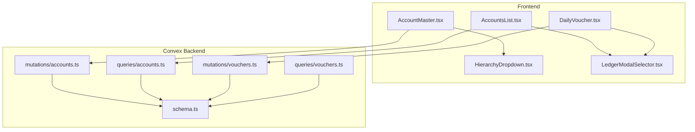
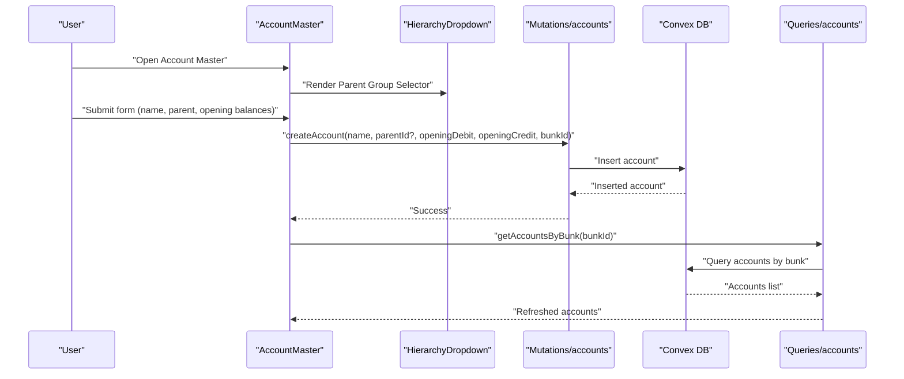
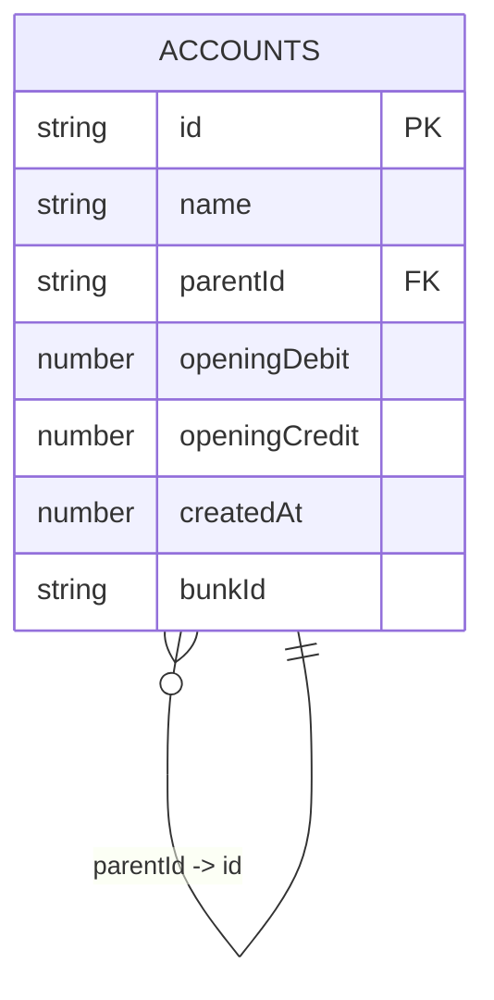
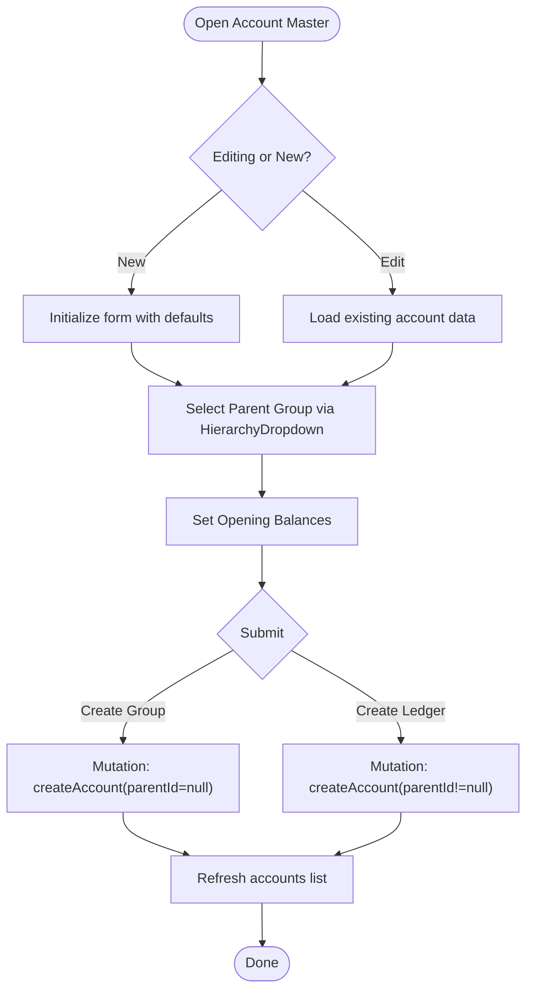
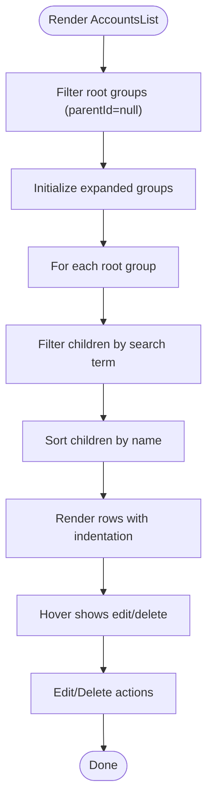
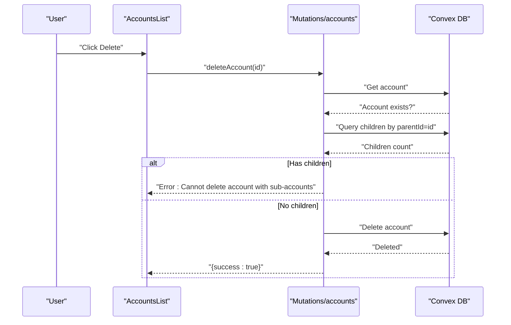
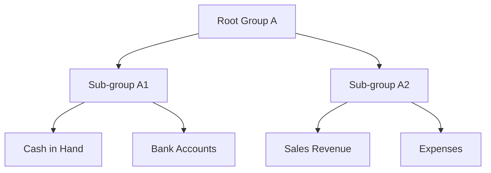
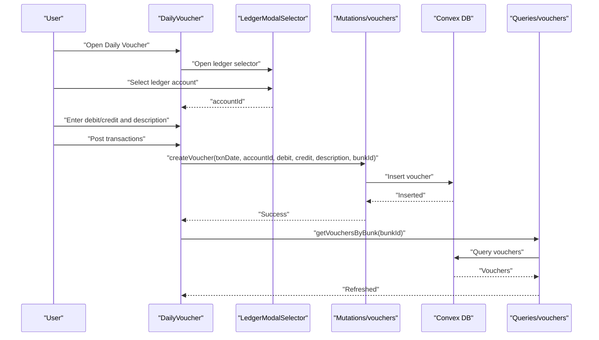
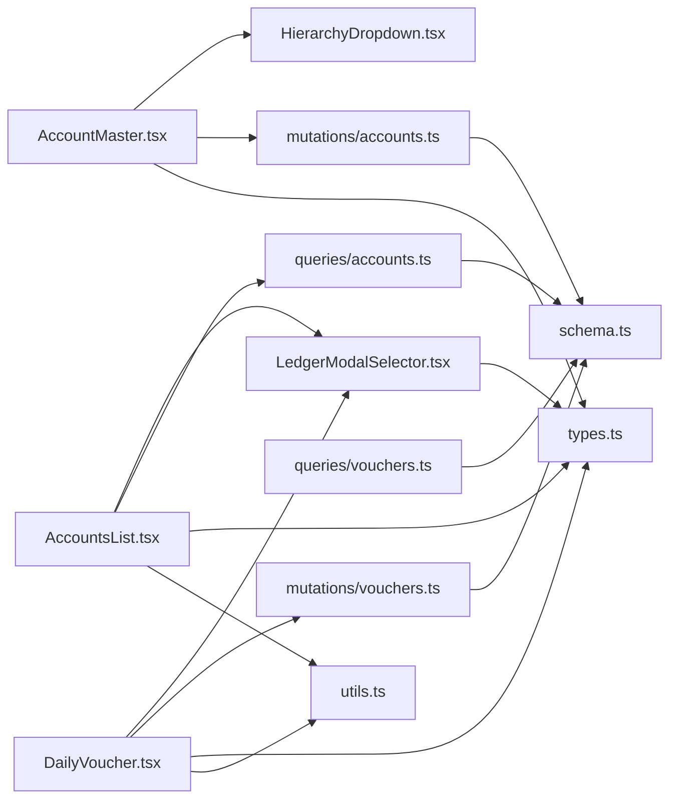

# Chart of Accounts Management

<cite>
**Referenced Files in This Document**
- [AccountMaster.tsx](file://apps/pages/AccountMaster.tsx)
- [AccountsList.tsx](file://apps/pages/AccountsList.tsx)
- [HierarchyDropdown.tsx](file://apps/components/HierarchyDropdown.tsx)
- [LedgerModalSelector.tsx](file://apps/components/LedgerModalSelector.tsx)
- [accounts.ts (mutations)](file://convex/mutations/accounts.ts)
- [accounts.ts (queries)](file://convex/queries/accounts.ts)
- [vouchers.ts (mutations)](file://convex/mutations/vouchers.ts)
- [vouchers.ts (queries)](file://convex/queries/vouchers.ts)
- [schema.ts](file://convex/schema.ts)
- [types.ts](file://apps/types.ts)
- [utils.ts](file://apps/utils.ts)
- [DailyVoucher.tsx](file://apps/pages/DailyVoucher.tsx)
</cite>

## Table of Contents
1. [Introduction](#introduction)
2. [Project Structure](#project-structure)
3. [Core Components](#core-components)
4. [Architecture Overview](#architecture-overview)
5. [Detailed Component Analysis](#detailed-component-analysis)
6. [Dependency Analysis](#dependency-analysis)
7. [Performance Considerations](#performance-considerations)
8. [Troubleshooting Guide](#troubleshooting-guide)
9. [Conclusion](#conclusion)
10. [Appendices](#appendices)

## Introduction
This document describes the Chart of Accounts Management system used in the fuel station accounting module. It explains the hierarchical account structure with parent-child relationships, account grouping mechanisms, and ledger account organization. It documents the account creation workflow (group vs ledger differentiation, opening balance setup), the account listing interface (filtering, sorting, search), modification and deletion processes, data validation rules, typical fuel station account structures, account relationship diagrams, best practices, bulk operations, reorganization workflows, and integration with the voucher posting system.

## Project Structure
The system is organized into:
- Frontend pages and components for account management and voucher posting
- Convex backend mutations and queries for persistence and retrieval
- Shared types and utilities for consistent data modeling and formatting

**Diagram sources**
- [AccountMaster.tsx](file://apps/pages/AccountMaster.tsx#L1-L228)
- [AccountsList.tsx](file://apps/pages/AccountsList.tsx#L1-L254)
- [HierarchyDropdown.tsx](file://apps/components/HierarchyDropdown.tsx#L1-L138)
- [LedgerModalSelector.tsx](file://apps/components/LedgerModalSelector.tsx#L1-L182)
- [accounts.ts (mutations)](file://convex/mutations/accounts.ts#L1-L63)
- [accounts.ts (queries)](file://convex/queries/accounts.ts#L1-L19)
- [vouchers.ts (mutations)](file://convex/mutations/vouchers.ts#L1-L59)
- [vouchers.ts (queries)](file://convex/queries/vouchers.ts#L1-L19)
- [schema.ts](file://convex/schema.ts#L1-L85)

**Section sources**
- [AccountMaster.tsx](file://apps/pages/AccountMaster.tsx#L1-L228)
- [AccountsList.tsx](file://apps/pages/AccountsList.tsx#L1-L254)
- [HierarchyDropdown.tsx](file://apps/components/HierarchyDropdown.tsx#L1-L138)
- [LedgerModalSelector.tsx](file://apps/components/LedgerModalSelector.tsx#L1-L182)
- [accounts.ts (mutations)](file://convex/mutations/accounts.ts#L1-L63)
- [accounts.ts (queries)](file://convex/queries/accounts.ts#L1-L19)
- [vouchers.ts (mutations)](file://convex/mutations/vouchers.ts#L1-L59)
- [vouchers.ts (queries)](file://convex/queries/vouchers.ts#L1-L19)
- [schema.ts](file://convex/schema.ts#L1-L85)

## Core Components
- AccountMaster: Form-based account creation and editing with group selection and opening balances.
- AccountsList: Hierarchical listing with search, expand/collapse, and inline edit/delete.
- HierarchyDropdown: Select parent group with recursive tree rendering.
- LedgerModalSelector: Modal-based ledger picker with search and hierarchical display.
- Mutations and Queries: CRUD operations for accounts and vouchers, with safety checks and indexes.
- Types and Utilities: Shared models and helpers for formatting and calculations.

**Section sources**
- [AccountMaster.tsx](file://apps/pages/AccountMaster.tsx#L1-L228)
- [AccountsList.tsx](file://apps/pages/AccountsList.tsx#L1-L254)
- [HierarchyDropdown.tsx](file://apps/components/HierarchyDropdown.tsx#L1-L138)
- [LedgerModalSelector.tsx](file://apps/components/LedgerModalSelector.tsx#L1-L182)
- [accounts.ts (mutations)](file://convex/mutations/accounts.ts#L1-L63)
- [accounts.ts (queries)](file://convex/queries/accounts.ts#L1-L19)
- [vouchers.ts (mutations)](file://convex/mutations/vouchers.ts#L1-L59)
- [vouchers.ts (queries)](file://convex/queries/vouchers.ts#L1-L19)
- [types.ts](file://apps/types.ts#L1-L56)
- [utils.ts](file://apps/utils.ts#L1-L69)

## Architecture Overview
The system follows a client-server architecture:
- Frontend pages and components manage UI state and user interactions.
- Convex mutations enforce data validation and write operations.
- Convex queries provide read access with indexes for performance.
- The schema defines the self-referencing accounts table and cross-table relationships.

**Diagram sources**
- [AccountMaster.tsx](file://apps/pages/AccountMaster.tsx#L46-L56)
- [HierarchyDropdown.tsx](file://apps/components/HierarchyDropdown.tsx#L1-L138)
- [accounts.ts (mutations)](file://convex/mutations/accounts.ts#L4-L22)
- [accounts.ts (queries)](file://convex/queries/accounts.ts#L4-L12)

## Detailed Component Analysis

### Hierarchical Account Model
The accounts table is self-referencing with a parent-child relationship:
- parentId references another account id (nullable), forming a tree.
- Indexes support efficient lookups by bunk and by parent.
- Each account has openingDebit and openingCredit for historical balances.

**Diagram sources**
- [schema.ts](file://convex/schema.ts#L45-L54)

**Section sources**
- [schema.ts](file://convex/schema.ts#L45-L54)
- [types.ts](file://apps/types.ts#L17-L25)

### Account Creation Workflow
- Group vs Ledger differentiation:
  - Creating a group sets parentId to null.
  - Creating a ledger requires selecting a parent group (non-null).
- Opening balance setup:
  - Separate fields for openingDebit and openingCredit.
  - On submit, the system persists these values.
- Hierarchy navigation:
  - HierarchyDropdown renders only groups (root and sub-groups) for selection.
  - A modal allows creating a new group inline and auto-selecting it.

**Diagram sources**
- [AccountMaster.tsx](file://apps/pages/AccountMaster.tsx#L28-L56)
- [HierarchyDropdown.tsx](file://apps/components/HierarchyDropdown.tsx#L33-L44)
- [accounts.ts (mutations)](file://convex/mutations/accounts.ts#L4-L22)

**Section sources**
- [AccountMaster.tsx](file://apps/pages/AccountMaster.tsx#L16-L75)
- [HierarchyDropdown.tsx](file://apps/components/HierarchyDropdown.tsx#L16-L44)
- [accounts.ts (mutations)](file://convex/mutations/accounts.ts#L4-L22)

### Account Listing Interface
- Filtering and search:
  - AccountsList filters children by search term while preserving hierarchy.
  - Searches are case-insensitive substring matches on account names.
- Sorting:
  - Children are sorted alphabetically by name.
- Navigation:
  - Expand/collapse groups; clicking a group header toggles visibility of its children.
  - Inline edit and delete actions appear on hover.
- Group balance calculation:
  - Recursively sums openingDebit minus openingCredit for all descendants.

**Diagram sources**
- [AccountsList.tsx](file://apps/pages/AccountsList.tsx#L39-L127)
- [utils.ts](file://apps/utils.ts#L41-L51)

**Section sources**
- [AccountsList.tsx](file://apps/pages/AccountsList.tsx#L24-L127)
- [utils.ts](file://apps/utils.ts#L41-L51)

### Modification and Deletion Safeguards
- Update:
  - Validates existence of the account before patching.
  - Updates name, parentId, and balances atomically.
- Delete:
  - Prevents deletion of accounts that have sub-accounts.
  - Throws an error if children exist; otherwise deletes the account.

**Diagram sources**
- [AccountsList.tsx](file://apps/pages/AccountsList.tsx#L53-L62)
- [accounts.ts (mutations)](file://convex/mutations/accounts.ts#L45-L61)

**Section sources**
- [accounts.ts (mutations)](file://convex/mutations/accounts.ts#L24-L43)
- [accounts.ts (mutations)](file://convex/mutations/accounts.ts#L45-L61)

### Data Validation Rules
- Account name is required.
- Opening balances are numeric; one side must be zero when the other is set.
- Parent selection is optional; null implies a group.
- Deletion disallows accounts with children.

**Section sources**
- [AccountMaster.tsx](file://apps/pages/AccountMaster.tsx#L46-L56)
- [accounts.ts (mutations)](file://convex/mutations/accounts.ts#L4-L22)
- [accounts.ts (mutations)](file://convex/mutations/accounts.ts#L45-L61)

### Typical Fuel Station Account Structures
Recommended structure for a fuel station:
- Root Groups
  - Assets
    - Current Assets
      - Cash in Hand
      - Bank Accounts
      - Inventory (Fuel)
    - Fixed Assets
      - Land & Building
      - Equipment
  - Liabilities
    - Current Liabilities
      - Short-term Loans
      - Accounts Payable
    - Long-term Liabilities
      - Term Loans
  - Income
    - Sales Revenue
    - Interest Income
  - Expenses
    - Cost of Goods Sold
    - Staff Salaries
    - Rent & Taxes
    - Maintenance
- Opening balances are set at the start of the financial year for each ledger.

[No sources needed since this section provides general guidance]

### Account Relationship Diagrams
- Self-referencing hierarchy with root groups and sub-ledgers.
- Parent-child relationships enable roll-up reporting and group balances.

[No sources needed since this diagram shows conceptual structure]

### Best Practices for Maintaining Hierarchies
- Keep group names concise and consistent.
- Avoid deep nesting; limit to 3–4 levels for readability.
- Use opening balances carefully; ensure they reflect historical balances.
- Regularly reconcile group balances against ledger totals.
- Do not delete accounts with transactions; move them under a replacement group if needed.

[No sources needed since this section provides general guidance]

### Bulk Operations and Reorganization
- Bulk operations:
  - Use the AccountsList to quickly navigate and edit multiple ledgers.
  - Reorganize by changing parentId via the HierarchyDropdown during edit.
- Reorganization workflow:
  - Select target group in HierarchyDropdown.
  - Save changes; the account moves under the new parent.
  - Verify group balances and report impact.

**Section sources**
- [AccountsList.tsx](file://apps/pages/AccountsList.tsx#L106-L121)
- [HierarchyDropdown.tsx](file://apps/components/HierarchyDropdown.tsx#L56-L59)

### Integration with Voucher Posting System
- Voucher posting links transactions to ledger accounts:
  - DailyVoucher uses LedgerModalSelector to pick an account.
  - Each voucher records debit/credit against the selected account.
- Ledger calculation:
  - The utils helper computes running balances for a ledger over a date range.
- Cross-table relationships:
  - Vouchers reference accounts via accountId.
  - Both tables are scoped by bunkId for multi-location support.

**Diagram sources**
- [DailyVoucher.tsx](file://apps/pages/DailyVoucher.tsx#L34-L150)
- [LedgerModalSelector.tsx](file://apps/components/LedgerModalSelector.tsx#L18-L116)
- [vouchers.ts (mutations)](file://convex/mutations/vouchers.ts#L4-L24)
- [vouchers.ts (queries)](file://convex/queries/vouchers.ts#L4-L12)

**Section sources**
- [DailyVoucher.tsx](file://apps/pages/DailyVoucher.tsx#L26-L150)
- [LedgerModalSelector.tsx](file://apps/components/LedgerModalSelector.tsx#L18-L116)
- [vouchers.ts (mutations)](file://convex/mutations/vouchers.ts#L4-L24)
- [vouchers.ts (queries)](file://convex/queries/vouchers.ts#L4-L12)
- [utils.ts](file://apps/utils.ts#L27-L64)

## Dependency Analysis
- Frontend depends on shared types and utilities.
- AccountMaster and AccountsList depend on HierarchyDropdown and LedgerModalSelector.
- Backend mutations and queries depend on the schema’s indexes for performance.
- Voucher posting depends on account selection and ledger calculation utilities.

**Diagram sources**
- [AccountMaster.tsx](file://apps/pages/AccountMaster.tsx#L1-L228)
- [AccountsList.tsx](file://apps/pages/AccountsList.tsx#L1-L254)
- [HierarchyDropdown.tsx](file://apps/components/HierarchyDropdown.tsx#L1-L138)
- [LedgerModalSelector.tsx](file://apps/components/LedgerModalSelector.tsx#L1-L182)
- [accounts.ts (mutations)](file://convex/mutations/accounts.ts#L1-L63)
- [accounts.ts (queries)](file://convex/queries/accounts.ts#L1-L19)
- [vouchers.ts (mutations)](file://convex/mutations/vouchers.ts#L1-L59)
- [vouchers.ts (queries)](file://convex/queries/vouchers.ts#L1-L19)
- [schema.ts](file://convex/schema.ts#L1-L85)
- [types.ts](file://apps/types.ts#L1-L56)
- [utils.ts](file://apps/utils.ts#L1-L69)

**Section sources**
- [types.ts](file://apps/types.ts#L1-L56)
- [utils.ts](file://apps/utils.ts#L1-L69)
- [schema.ts](file://convex/schema.ts#L1-L85)

## Performance Considerations
- Indexes:
  - accounts.by_bunk and accounts.by_parent enable fast lookups for hierarchical rendering and filtering.
  - vouchers.by_bunk_and_date and vouchers.by_account optimize daily posting and reporting.
- Rendering:
  - AccountsList uses memoization and local state to minimize re-renders.
  - Hierarchical dropdowns and selectors sort and filter in-memory for responsiveness.
- Data volume:
  - Prefer grouping and limiting search scopes to reduce DOM and query sizes.

[No sources needed since this section provides general guidance]

## Troubleshooting Guide
- Cannot delete an account:
  - Cause: The account has sub-accounts.
  - Resolution: Move or delete child accounts first.
- Parent selection issues:
  - Ensure the selected parent is a group (parentId=null) and not a ledger.
  - Use the HierarchyDropdown to select a valid parent.
- Opening balances mismatch:
  - Verify openingDebit and openingCredit values.
  - Recalculate group balances to confirm totals.
- Voucher posting errors:
  - Ensure each row has a valid account and either debit or credit set.
  - Confirm the date and amount formats.

**Section sources**
- [accounts.ts (mutations)](file://convex/mutations/accounts.ts#L45-L61)
- [HierarchyDropdown.tsx](file://apps/components/HierarchyDropdown.tsx#L33-L44)
- [DailyVoucher.tsx](file://apps/pages/DailyVoucher.tsx#L111-L150)

## Conclusion
The Chart of Accounts Management system provides a robust, hierarchical model for organizing fuel station ledgers. It supports intuitive creation and editing, safe deletion safeguards, and seamless integration with the voucher posting workflow. By following best practices for hierarchy design and leveraging the provided components and utilities, administrators can maintain accurate financial records and produce reliable reports.

## Appendices

### API Definitions
- Mutations
  - createAccount: Creates a new account with name, optional parent, opening balances, and bunk association.
  - updateAccount: Updates an existing account’s name, parent, and balances.
  - deleteAccount: Deletes an account only if it has no children.
- Queries
  - getAccountsByBunk: Retrieves all accounts for a given bunk.
  - getAllAccounts: Retrieves all accounts (global scope).
  - getVouchersByBunk: Retrieves all vouchers for a given bunk.
  - getAllVouchers: Retrieves all vouchers (global scope).

**Section sources**
- [accounts.ts (mutations)](file://convex/mutations/accounts.ts#L4-L61)
- [accounts.ts (queries)](file://convex/queries/accounts.ts#L4-L18)
- [vouchers.ts (mutations)](file://convex/mutations/vouchers.ts#L4-L57)
- [vouchers.ts (queries)](file://convex/queries/vouchers.ts#L4-L18)