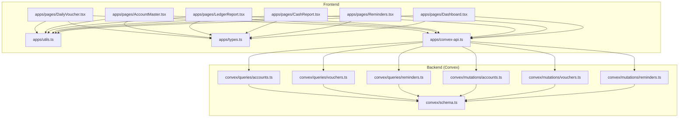
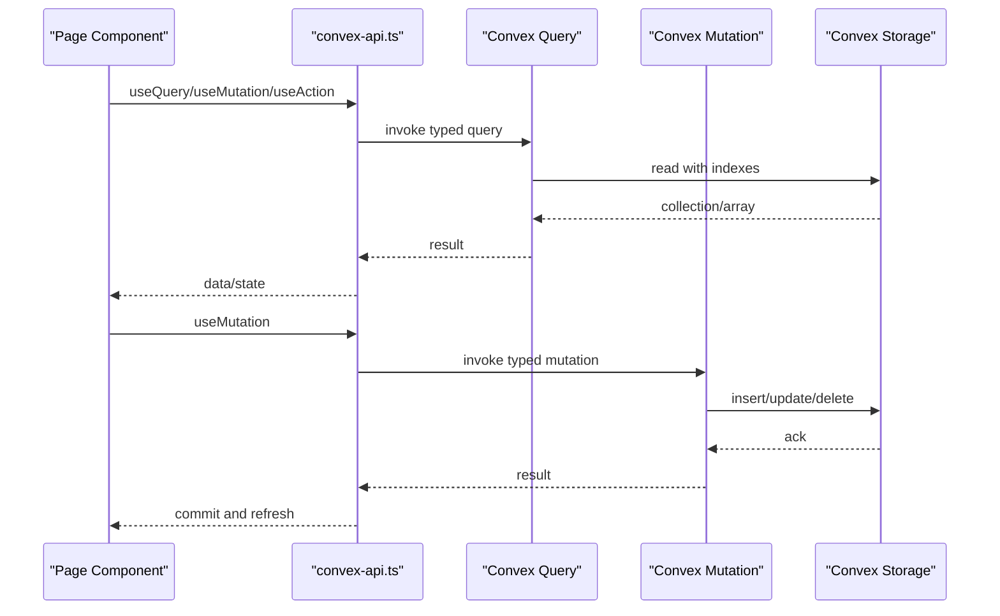
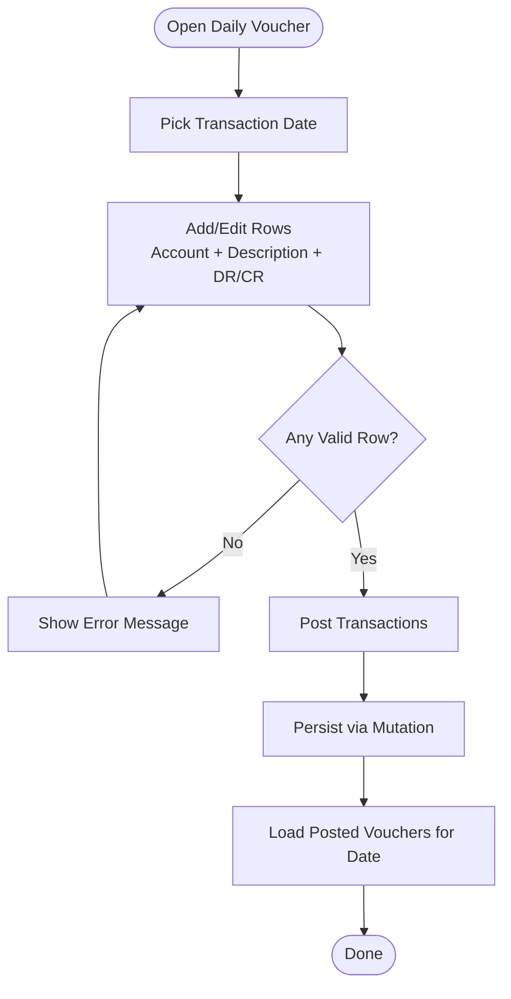
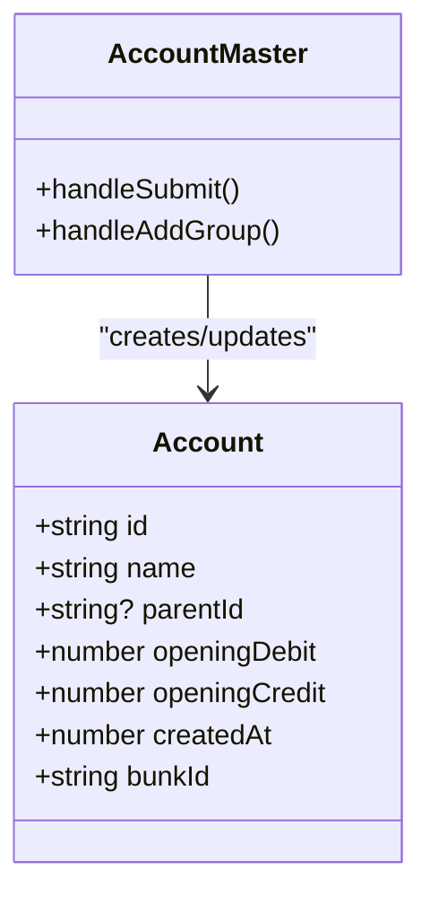
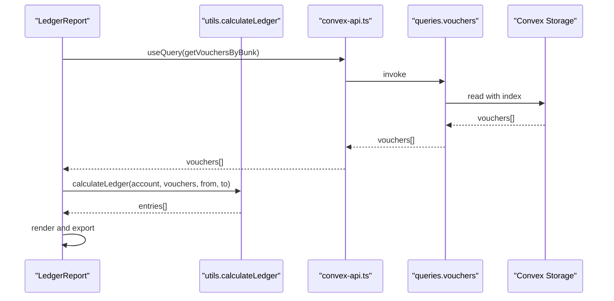
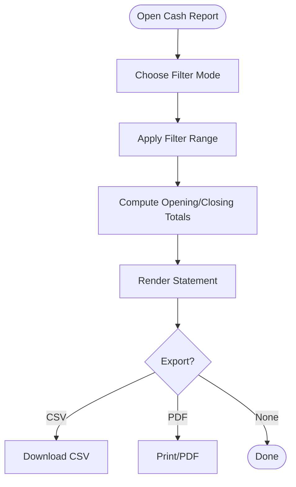
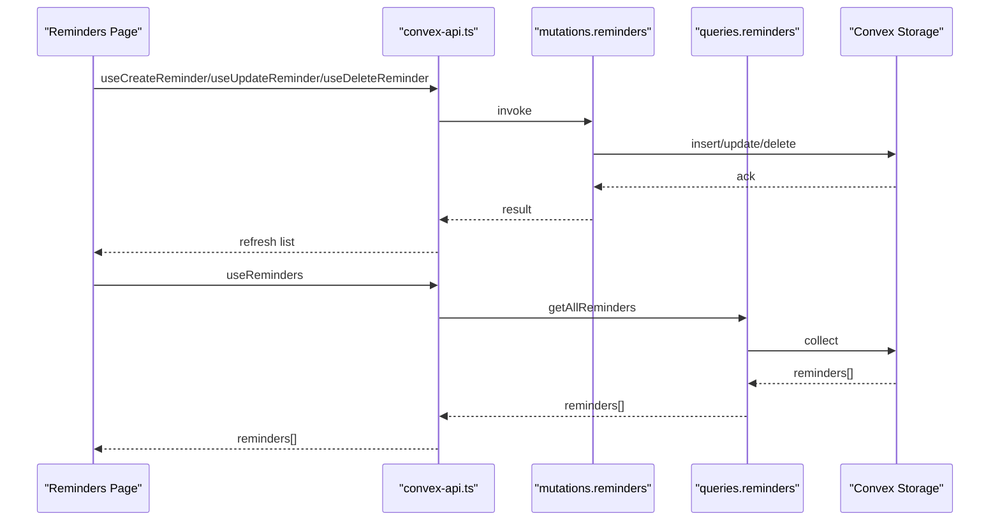
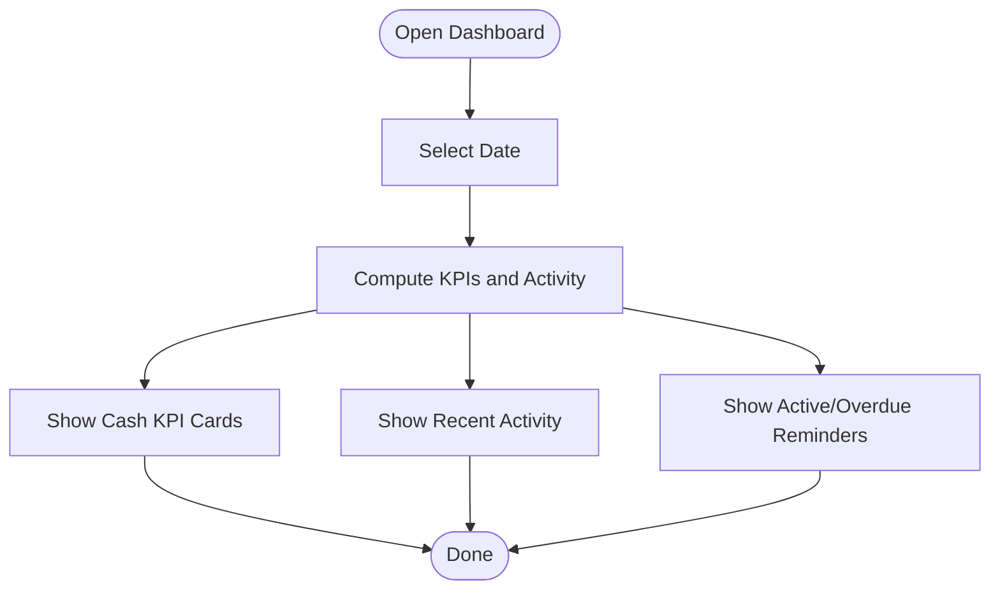
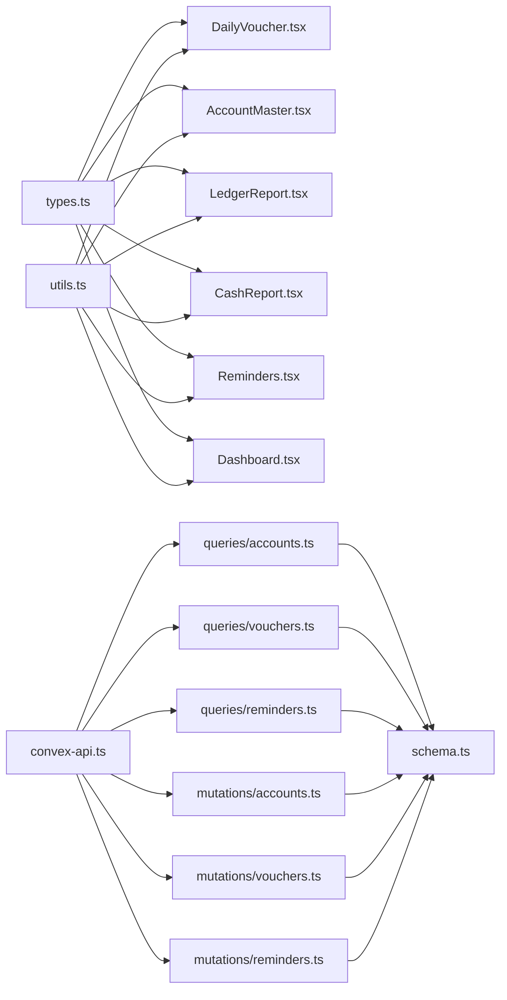
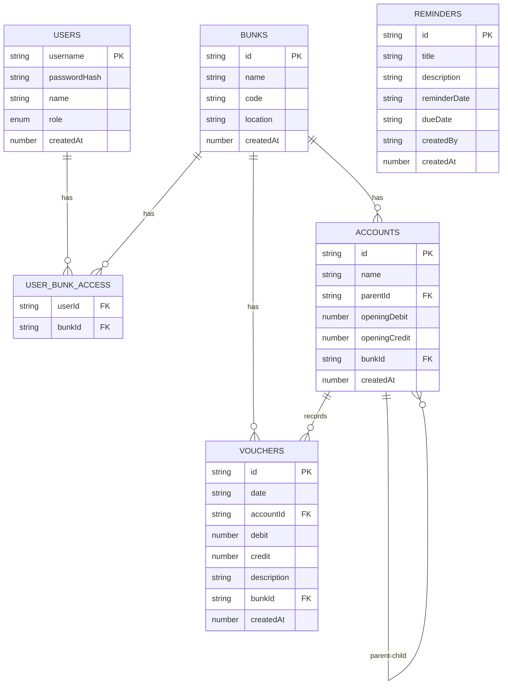

# Core Features

<cite>
**Referenced Files in This Document**
- [README.md](file://README.md)
- [schema.ts](file://convex/schema.ts)
- [accounts.ts](file://convex/mutations/accounts.ts)
- [vouchers.ts](file://convex/mutations/vouchers.ts)
- [reminders.ts](file://convex/mutations/reminders.ts)
- [accounts.ts](file://convex/queries/accounts.ts)
- [vouchers.ts](file://convex/queries/vouchers.ts)
- [reminders.ts](file://convex/queries/reminders.ts)
- [types.ts](file://apps/types.ts)
- [utils.ts](file://apps/utils.ts)
- [convex-api.ts](file://apps/convex-api.ts)
- [DailyVoucher.tsx](file://apps/pages/DailyVoucher.tsx)
- [AccountMaster.tsx](file://apps/pages/AccountMaster.tsx)
- [LedgerReport.tsx](file://apps/pages/LedgerReport.tsx)
- [CashReport.tsx](file://apps/pages/CashReport.tsx)
- [Reminders.tsx](file://apps/pages/Reminders.tsx)
- [Dashboard.tsx](file://apps/pages/Dashboard.tsx)
</cite>

## Table of Contents
1. [Introduction](#introduction)
2. [Project Structure](#project-structure)
3. [Core Components](#core-components)
4. [Architecture Overview](#architecture-overview)
5. [Detailed Component Analysis](#detailed-component-analysis)
6. [Dependency Analysis](#dependency-analysis)
7. [Performance Considerations](#performance-considerations)
8. [Troubleshooting Guide](#troubleshooting-guide)
9. [Conclusion](#conclusion)
10. [Appendices](#appendices)

## Introduction
KR-FUELS is a modern fuel station accounting and operations platform built with a React frontend and a Convex backend. It focuses on:
- Daily voucher processing with batch entry and real-time validation
- Hierarchical chart of accounts with parent-child relationships and opening balances
- Financial reporting (ledger and cash statements) with export capabilities
- Operational reminders and task management
- Dashboard analytics for quick visibility

The system migrates from PostgreSQL to Convex, leveraging typed queries and mutations for robust data operations.

**Section sources**
- [README.md](file://README.md#L1-L13)

## Project Structure
The project is organized into:
- Frontend (React + TypeScript): Pages, components, hooks, utilities, and Convex API bindings
- Backend (Convex): Schema, queries, and mutations for data access and persistence

**Diagram sources**
- [DailyVoucher.tsx](file://apps/pages/DailyVoucher.tsx#L1-L336)
- [AccountMaster.tsx](file://apps/pages/AccountMaster.tsx#L1-L228)
- [LedgerReport.tsx](file://apps/pages/LedgerReport.tsx#L1-L257)
- [CashReport.tsx](file://apps/pages/CashReport.tsx#L1-L604)
- [Reminders.tsx](file://apps/pages/Reminders.tsx#L1-L388)
- [Dashboard.tsx](file://apps/pages/Dashboard.tsx#L1-L219)
- [utils.ts](file://apps/utils.ts#L1-L69)
- [types.ts](file://apps/types.ts#L1-L56)
- [convex-api.ts](file://apps/convex-api.ts#L1-L33)
- [schema.ts](file://convex/schema.ts#L1-L85)
- [accounts.ts](file://convex/queries/accounts.ts#L1-L19)
- [vouchers.ts](file://convex/queries/vouchers.ts#L1-L19)
- [reminders.ts](file://convex/queries/reminders.ts#L1-L71)
- [accounts.ts](file://convex/mutations/accounts.ts#L1-L63)
- [vouchers.ts](file://convex/mutations/vouchers.ts#L1-L59)
- [reminders.ts](file://convex/mutations/reminders.ts#L1-L116)

**Section sources**
- [schema.ts](file://convex/schema.ts#L1-L85)
- [DailyVoucher.tsx](file://apps/pages/DailyVoucher.tsx#L1-L336)
- [AccountMaster.tsx](file://apps/pages/AccountMaster.tsx#L1-L228)
- [LedgerReport.tsx](file://apps/pages/LedgerReport.tsx#L1-L257)
- [CashReport.tsx](file://apps/pages/CashReport.tsx#L1-L604)
- [Reminders.tsx](file://apps/pages/Reminders.tsx#L1-L388)
- [Dashboard.tsx](file://apps/pages/Dashboard.tsx#L1-L219)
- [utils.ts](file://apps/utils.ts#L1-L69)
- [types.ts](file://apps/types.ts#L1-L56)
- [convex-api.ts](file://apps/convex-api.ts#L1-L33)

## Core Components
- Daily Voucher: Batch transaction entry with real-time totals and cash tally logic
- Chart of Accounts: Hierarchical master with parent-child groups and opening balances
- Ledger Report: Consolidated ledger per account or group with export
- Cash Report: Periodic cash statement with multiple filter modes and export
- Reminders: Task and reminder management with CRUD operations
- Dashboard: Real-time cash KPIs, recent activity, and reminders

**Section sources**
- [DailyVoucher.tsx](file://apps/pages/DailyVoucher.tsx#L1-L336)
- [AccountMaster.tsx](file://apps/pages/AccountMaster.tsx#L1-L228)
- [LedgerReport.tsx](file://apps/pages/LedgerReport.tsx#L1-L257)
- [CashReport.tsx](file://apps/pages/CashReport.tsx#L1-L604)
- [Reminders.tsx](file://apps/pages/Reminders.tsx#L1-L388)
- [Dashboard.tsx](file://apps/pages/Dashboard.tsx#L1-L219)

## Architecture Overview
The system follows a client-driven architecture with Convex as the backend-as-a-service:
- Frontend pages call Convex queries and mutations via typed hooks
- Queries fetch collections and apply indexes for efficient reads
- Mutations enforce validation and write operations
- Utilities encapsulate formatting and ledger calculations
- Types define the shared data contracts

**Diagram sources**
- [convex-api.ts](file://apps/convex-api.ts#L1-L33)
- [accounts.ts](file://convex/queries/accounts.ts#L1-L19)
- [vouchers.ts](file://convex/queries/vouchers.ts#L1-L19)
- [reminders.ts](file://convex/queries/reminders.ts#L1-L71)
- [accounts.ts](file://convex/mutations/accounts.ts#L1-L63)
- [vouchers.ts](file://convex/mutations/vouchers.ts#L1-L59)
- [reminders.ts](file://convex/mutations/reminders.ts#L1-L116)

## Detailed Component Analysis

### Daily Voucher Workflow
End-to-end process for entering and posting daily transactions:
- Select transaction date
- Add/remove rows with account, description, DR/CR fields
- Real-time totals and closing cash calculation
- Validation and posting to backend
- Navigation guard for unsaved changes

**Diagram sources**
- [DailyVoucher.tsx](file://apps/pages/DailyVoucher.tsx#L111-L150)
- [vouchers.ts](file://convex/mutations/vouchers.ts#L1-L59)

**Section sources**
- [DailyVoucher.tsx](file://apps/pages/DailyVoucher.tsx#L1-L336)
- [vouchers.ts](file://convex/mutations/vouchers.ts#L1-L59)

### Chart of Accounts Management
Hierarchical account structure with parent-child groups and opening balances:
- Create account groups or leaf accounts
- Set parent group and opening balances
- Prevent deletion of accounts with sub-accounts
- Fetch accounts per location (bunk)

**Diagram sources**
- [AccountMaster.tsx](file://apps/pages/AccountMaster.tsx#L1-L228)
- [accounts.ts](file://convex/mutations/accounts.ts#L1-L63)
- [accounts.ts](file://convex/queries/accounts.ts#L1-L19)

**Section sources**
- [AccountMaster.tsx](file://apps/pages/AccountMaster.tsx#L1-L228)
- [accounts.ts](file://convex/mutations/accounts.ts#L1-L63)
- [accounts.ts](file://convex/queries/accounts.ts#L1-L19)
- [schema.ts](file://convex/schema.ts#L43-L54)

### Ledger Report
Consolidated ledger for a selected account or group across a date range:
- Select account (including groups)
- Choose from/to dates
- Compute opening balances across descendants
- Generate entries with running balance and export to CSV/PDF

**Diagram sources**
- [LedgerReport.tsx](file://apps/pages/LedgerReport.tsx#L1-L257)
- [utils.ts](file://apps/utils.ts#L27-L64)
- [vouchers.ts](file://convex/queries/vouchers.ts#L1-L19)

**Section sources**
- [LedgerReport.tsx](file://apps/pages/LedgerReport.tsx#L1-L257)
- [utils.ts](file://apps/utils.ts#L27-L64)
- [vouchers.ts](file://convex/queries/vouchers.ts#L1-L19)

### Cash Report
Periodic cash statement with multiple filter modes:
- Daily, Monthly, YTD, Financial Year, Custom
- Opening/closing cash computation using prior balances and voucher effects
- Export to CSV/PDF and print-friendly layout

**Diagram sources**
- [CashReport.tsx](file://apps/pages/CashReport.tsx#L1-L604)

**Section sources**
- [CashReport.tsx](file://apps/pages/CashReport.tsx#L1-L604)

### Reminders and Task Management
Task and reminder lifecycle:
- Create, edit, delete reminders with title, description, reminder date, due date
- Stats: total, active (now), upcoming
- Sorting and filtering for dashboard integration

**Diagram sources**
- [Reminders.tsx](file://apps/pages/Reminders.tsx#L1-L388)
- [reminders.ts](file://convex/mutations/reminders.ts#L1-L116)
- [reminders.ts](file://convex/queries/reminders.ts#L1-L71)

**Section sources**
- [Reminders.tsx](file://apps/pages/Reminders.tsx#L1-L388)
- [reminders.ts](file://convex/mutations/reminders.ts#L1-L116)
- [reminders.ts](file://convex/queries/reminders.ts#L1-L71)

### Dashboard Analytics
Real-time cash KPIs, recent activity, and reminders:
- Select date (navigation)
- Compute opening, inflow, outflow, closing cash
- Group activity and average transaction value
- Reminders panel with urgency indicators

**Diagram sources**
- [Dashboard.tsx](file://apps/pages/Dashboard.tsx#L1-L219)

**Section sources**
- [Dashboard.tsx](file://apps/pages/Dashboard.tsx#L1-L219)

## Dependency Analysis
Key relationships:
- Pages depend on typed Convex hooks from apps/convex-api.ts
- Queries/mutations depend on schema-defined tables and indexes
- Reports rely on shared utility functions for formatting and calculations
- Types are shared across frontend and backend contracts

**Diagram sources**
- [types.ts](file://apps/types.ts#L1-L56)
- [utils.ts](file://apps/utils.ts#L1-L69)
- [convex-api.ts](file://apps/convex-api.ts#L1-L33)
- [accounts.ts](file://convex/queries/accounts.ts#L1-L19)
- [vouchers.ts](file://convex/queries/vouchers.ts#L1-L19)
- [reminders.ts](file://convex/queries/reminders.ts#L1-L71)
- [accounts.ts](file://convex/mutations/accounts.ts#L1-L63)
- [vouchers.ts](file://convex/mutations/vouchers.ts#L1-L59)
- [reminders.ts](file://convex/mutations/reminders.ts#L1-L116)
- [schema.ts](file://convex/schema.ts#L1-L85)

**Section sources**
- [types.ts](file://apps/types.ts#L1-L56)
- [utils.ts](file://apps/utils.ts#L1-L69)
- [convex-api.ts](file://apps/convex-api.ts#L1-L33)
- [schema.ts](file://convex/schema.ts#L1-L85)

## Performance Considerations
- Indexes: Queries leverage indexes (e.g., by_bunk, by_parent, by_bunk_and_date, by_due_date) to reduce scan costs.
- Memoization: Frontend pages use useMemo for derived computations (totals, report data) to avoid unnecessary re-computation.
- Sorting and filtering: Reports sort and filter in-memory; consider pagination or server-side aggregation for very large datasets.
- Rendering: Large tables are paginated via scroll containers; virtualization could further improve performance for thousands of rows.
- Network: Use optimistic updates with proper error rollback for mutations to improve perceived latency.

[No sources needed since this section provides general guidance]

## Troubleshooting Guide
Common issues and resolutions:
- Posting empty rows: The daily voucher validates that at least one row has a valid account and either DR or CR amount before posting.
- Deleting posted transactions: Confirmation dialog prevents accidental deletions; ensure you have backups or audit logs if needed.
- Unsafely navigating away: A hashchange listener prompts to save or cancel navigation when there are unsaved changes.
- Reminder date validation: Mutations enforce non-empty title and valid date formats (YYYY-MM-DD).
- Account deletion: Cannot delete an account that has sub-accounts; remove children first.

**Section sources**
- [DailyVoucher.tsx](file://apps/pages/DailyVoucher.tsx#L111-L150)
- [DailyVoucher.tsx](file://apps/pages/DailyVoucher.tsx#L165-L190)
- [reminders.ts](file://convex/mutations/reminders.ts#L23-L34)
- [accounts.ts](file://convex/mutations/accounts.ts#L50-L57)

## Conclusion
KR-FUELS delivers a cohesive set of core features tailored for fuel station accounting and operations:
- Robust daily voucher processing with real-time validation and cash tally logic
- Flexible hierarchical chart of accounts with opening balances
- Comprehensive financial reporting with export capabilities
- Practical reminders and task management
- Insightful dashboard analytics

The architecture cleanly separates concerns with typed Convex APIs, shared types, and utility functions, enabling maintainability and extensibility.

[No sources needed since this section summarizes without analyzing specific files]

## Appendices

### Data Model Overview

**Diagram sources**
- [schema.ts](file://convex/schema.ts#L11-L84)

### UI Interaction Patterns
- Modal dialogs for adding/editing reminders and creating account groups
- Sticky headers for filters and summary cards
- Hover actions on table rows (edit/delete)
- Print-friendly layouts for reports
- Date pickers with fallbacks for cross-browser compatibility

**Section sources**
- [Reminders.tsx](file://apps/pages/Reminders.tsx#L191-L382)
- [AccountMaster.tsx](file://apps/pages/AccountMaster.tsx#L89-L136)
- [CashReport.tsx](file://apps/pages/CashReport.tsx#L339-L503)
- [LedgerReport.tsx](file://apps/pages/LedgerReport.tsx#L136-L191)