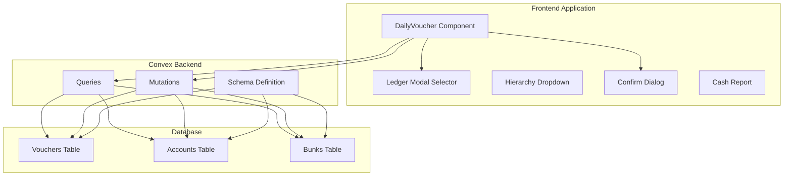
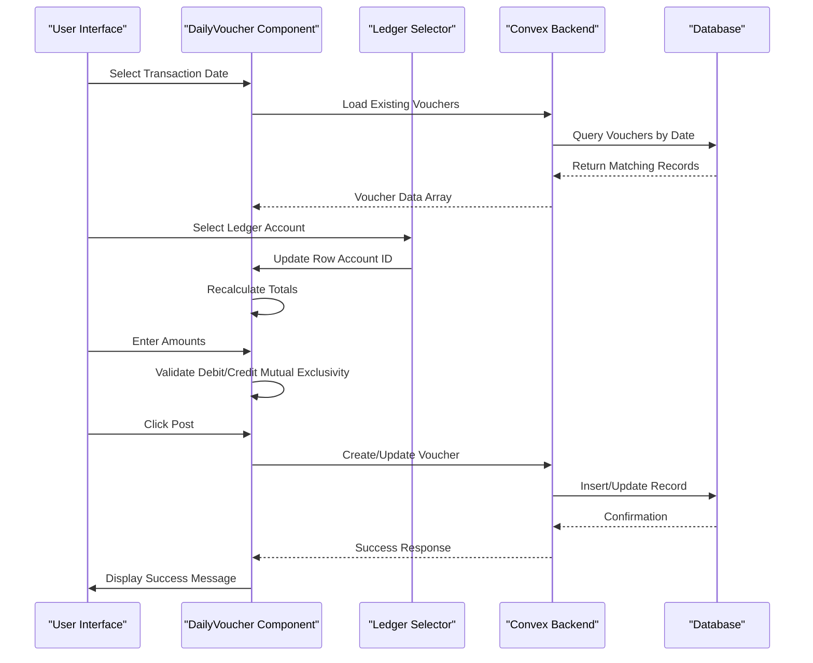
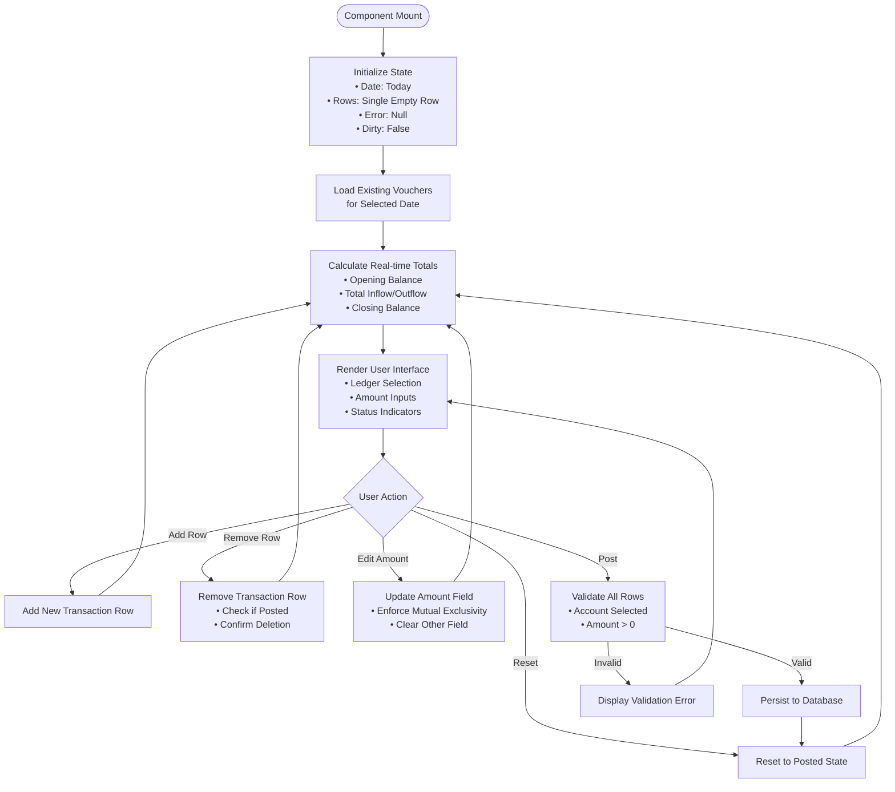
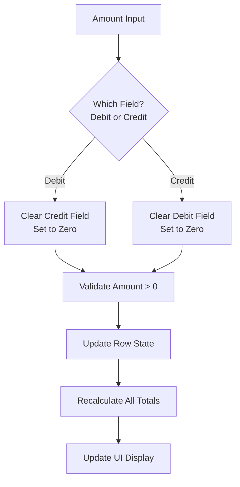
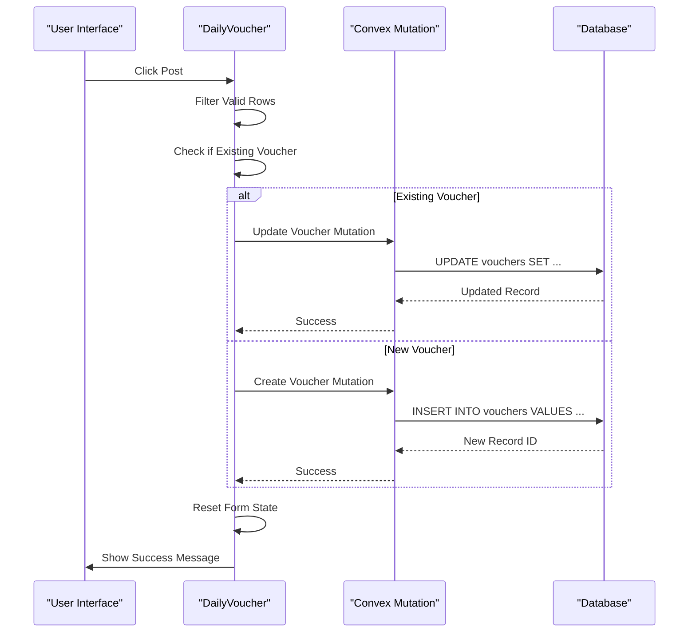
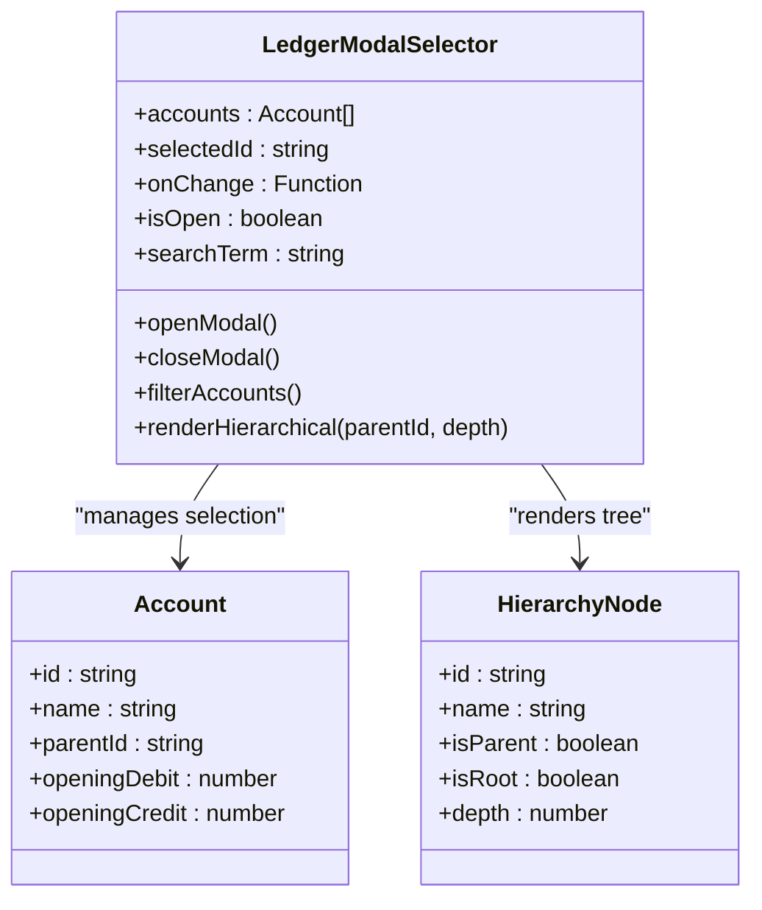
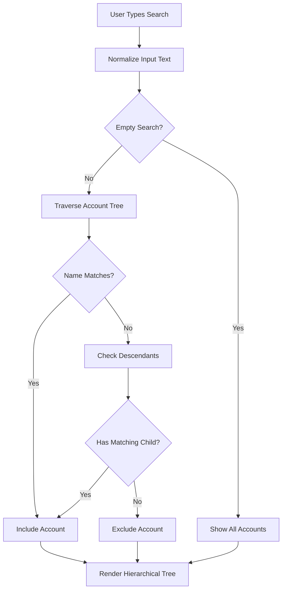
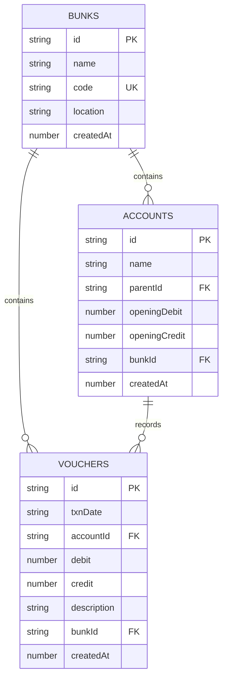
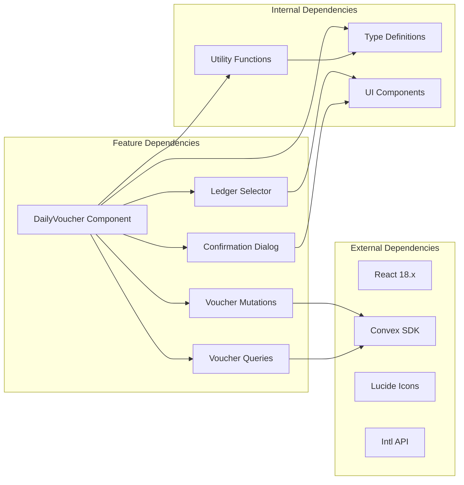

# Daily Voucher Processing

<cite>
**Referenced Files in This Document**
- [DailyVoucher.tsx](file://apps/pages/DailyVoucher.tsx)
- [LedgerModalSelector.tsx](file://apps/components/LedgerModalSelector.tsx)
- [HierarchyDropdown.tsx](file://apps/components/HierarchyDropdown.tsx)
- [ConfirmDialog.tsx](file://apps/components/ConfirmDialog.tsx)
- [vouchers.ts](file://convex/mutations/vouchers.ts)
- [vouchers.ts](file://convex/queries/vouchers.ts)
- [schema.ts](file://convex/schema.ts)
- [types.ts](file://apps/types.ts)
- [utils.ts](file://apps/utils.ts)
- [CashReport.tsx](file://apps/pages/CashReport.tsx)
- [App.tsx](file://apps/App.tsx)
</cite>

## Table of Contents
1. [Introduction](#introduction)
2. [Project Structure](#project-structure)
3. [Core Components](#core-components)
4. [Architecture Overview](#architecture-overview)
5. [Detailed Component Analysis](#detailed-component-analysis)
6. [Dependency Analysis](#dependency-analysis)
7. [Performance Considerations](#performance-considerations)
8. [Troubleshooting Guide](#troubleshooting-guide)
9. [Conclusion](#conclusion)

## Introduction
The Daily Voucher Processing feature enables fuel station operators to record daily cash transactions using a double-entry accounting system. It provides a comprehensive interface for managing batch transaction rows, real-time validation, and posting operations while maintaining strict debit/credit accounting principles. The system tracks opening balances, calculates inflows/outflows, and computes closing cash balances with immediate visual feedback.

## Project Structure
The Daily Voucher feature is built as a React component integrated with a Convex backend database. The architecture follows a clear separation of concerns with dedicated components for UI, data management, and persistence.

**Diagram sources**
- [DailyVoucher.tsx](file://apps/pages/DailyVoucher.tsx#L1-L336)
- [schema.ts](file://convex/schema.ts#L59-L69)
- [vouchers.ts](file://convex/queries/vouchers.ts#L1-L19)

**Section sources**
- [DailyVoucher.tsx](file://apps/pages/DailyVoucher.tsx#L1-L336)
- [App.tsx](file://apps/App.tsx#L251-L251)

## Core Components
The Daily Voucher feature consists of several interconnected components that work together to provide a seamless transaction recording experience:

### Primary Data Structures
The system operates on two fundamental data structures:

**Batch Row Structure**: Each transaction entry maintains:
- Unique identifier for row management
- Ledger account reference
- Transaction description
- Debit and credit amounts (mutually exclusive)

**Voucher Structure**: Persistent transaction records contain:
- Date of transaction
- Account linkage
- Debit/credit values
- Description/narration
- Bunk association for multi-location support

### Real-time Calculation Engine
The component implements sophisticated real-time calculations:
- **Opening Balance**: Sum of all ledger account opening balances
- **Total Inflow**: Sum of all credit entries
- **Total Outflow**: Sum of all debit entries  
- **Closing Balance**: Opening + Inflow - Outflow with proper sign handling

**Section sources**
- [DailyVoucher.tsx](file://apps/pages/DailyVoucher.tsx#L18-L62)
- [types.ts](file://apps/types.ts#L17-L36)

## Architecture Overview
The Daily Voucher system follows a modern React + Convex architecture with clear separation between presentation, business logic, and data persistence layers.

**Diagram sources**
- [DailyVoucher.tsx](file://apps/pages/DailyVoucher.tsx#L111-L150)
- [vouchers.ts](file://convex/mutations/vouchers.ts#L4-L59)

The system enforces double-entry accounting principles where each transaction must have equal debit and credit values, with automatic mutual exclusivity between debit and credit fields.

## Detailed Component Analysis

### DailyVoucher Component
The main component orchestrates the entire transaction workflow with comprehensive state management and validation logic.

#### State Management Architecture

**Diagram sources**
- [DailyVoucher.tsx](file://apps/pages/DailyVoucher.tsx#L38-L150)

#### Double-Entry Accounting Implementation
The system implements strict double-entry principles through intelligent field validation:

**Diagram sources**
- [DailyVoucher.tsx](file://apps/pages/DailyVoucher.tsx#L89-L100)

#### Transaction Posting Workflow
The posting process handles both creation and updates of voucher records:

**Diagram sources**
- [DailyVoucher.tsx](file://apps/pages/DailyVoucher.tsx#L111-L150)
- [vouchers.ts](file://convex/mutations/vouchers.ts#L26-L47)

**Section sources**
- [DailyVoucher.tsx](file://apps/pages/DailyVoucher.tsx#L34-L190)

### Ledger Modal Selector Component
The Ledger Modal Selector provides hierarchical account selection with advanced filtering capabilities.

#### Hierarchical Navigation Logic

**Diagram sources**
- [LedgerModalSelector.tsx](file://apps/components/LedgerModalSelector.tsx#L18-L116)
- [types.ts](file://apps/types.ts#L17-L25)

#### Search and Filtering Mechanism
The component implements intelligent search that traverses the account hierarchy to find matching nodes:

**Diagram sources**
- [LedgerModalSelector.tsx](file://apps/components/LedgerModalSelector.tsx#L62-L67)

**Section sources**
- [LedgerModalSelector.tsx](file://apps/components/LedgerModalSelector.tsx#L18-L182)

### Data Persistence Layer
The Convex backend provides robust data persistence with proper indexing and validation.

#### Database Schema Design
The schema defines three primary tables with appropriate relationships:

**Diagram sources**
- [schema.ts](file://convex/schema.ts#L13-L69)

#### Mutation Operations
The system provides three core mutation operations for voucher management:

**Create Voucher**: Inserts new transaction records with proper validation
**Update Voucher**: Modifies existing transaction data atomically  
**Delete Voucher**: Removes transaction records with existence checks

**Section sources**
- [vouchers.ts](file://convex/mutations/vouchers.ts#L4-L59)
- [schema.ts](file://convex/schema.ts#L59-L69)

## Dependency Analysis
The Daily Voucher feature has well-defined dependencies that support maintainability and scalability.

**Diagram sources**
- [App.tsx](file://apps/App.tsx#L1-L266)
- [DailyVoucher.tsx](file://apps/pages/DailyVoucher.tsx#L1-L16)

The dependency graph shows clear separation between UI components, business logic, and data access layers, enabling independent development and testing.

**Section sources**
- [App.tsx](file://apps/App.tsx#L1-L266)
- [DailyVoucher.tsx](file://apps/pages/DailyVoucher.tsx#L1-L16)

## Performance Considerations
The system implements several optimization strategies for handling large transaction volumes efficiently.

### Memory Management
- **Lazy Loading**: Vouchers are loaded only when the date changes
- **State Optimization**: Memoized calculations prevent unnecessary re-computations
- **Component Isolation**: Individual row updates don't trigger full re-renders

### Computational Efficiency
- **Real-time Calculations**: Totals computed using reduce operations with O(n) complexity
- **Hierarchical Search**: Optimized tree traversal with early termination
- **Event Delegation**: Efficient event handling for large transaction tables

### Database Optimization
- **Indexed Queries**: Vouchers queried by bunk and date combination
- **Batch Operations**: Multiple row updates processed in single mutation calls
- **Selective Loading**: Only relevant data loaded for current date

## Troubleshooting Guide

### Common Validation Errors
**Missing Account Selection**: Ensure a valid ledger account is selected before posting
**Invalid Amount Values**: Amounts must be numeric and greater than zero
**Debit/Credit Conflict**: Only one field (debit or credit) can have a value at a time
**Unsaved Changes Warning**: Confirm navigation when leaving with unsaved changes

### Error Resolution Strategies
1. **Validation Error Messages**: Clear, actionable messages guide users to fix issues
2. **Form State Recovery**: Automatic restoration of previous valid state on errors
3. **Transaction Rollback**: Failed mutations don't persist partial changes
4. **Audit Trail**: All operations logged for debugging and compliance

### Performance Issues
**Large Transaction Batches**: 
- Use pagination for viewing historical data
- Consider batch posting for multiple entries
- Monitor browser memory usage during bulk operations

**Slow Account Selection**:
- Verify hierarchical data structure integrity
- Check network connectivity for remote databases
- Consider caching frequently accessed accounts

**Section sources**
- [DailyVoucher.tsx](file://apps/pages/DailyVoucher.tsx#L111-L150)
- [vouchers.ts](file://convex/mutations/vouchers.ts#L36-L38)

## Conclusion
The Daily Voucher Processing feature provides a robust, scalable solution for fuel station accounting needs. Its implementation demonstrates strong adherence to double-entry accounting principles while offering an intuitive user experience. The modular architecture ensures maintainability and extensibility, while comprehensive validation and error handling provide reliability in production environments.

Key strengths include:
- **Double-entry Compliance**: Automatic enforcement of accounting principles
- **Real-time Feedback**: Immediate calculation updates and validation
- **Hierarchical Organization**: Structured account management with search capabilities
- **Multi-location Support**: Bunk-based organization for chain operations
- **Performance Optimization**: Efficient state management and database operations

The system successfully balances functional completeness with user-friendly design, making it suitable for daily operational use in fuel station environments.