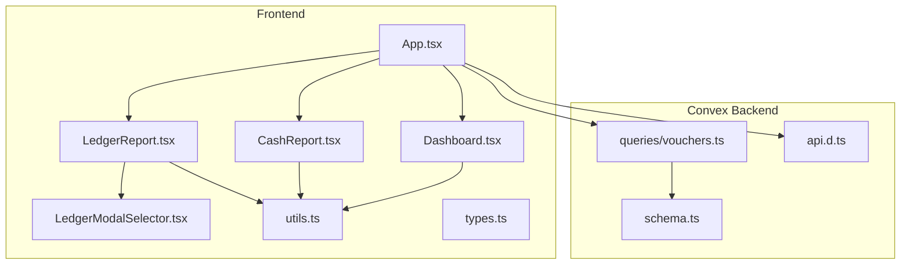
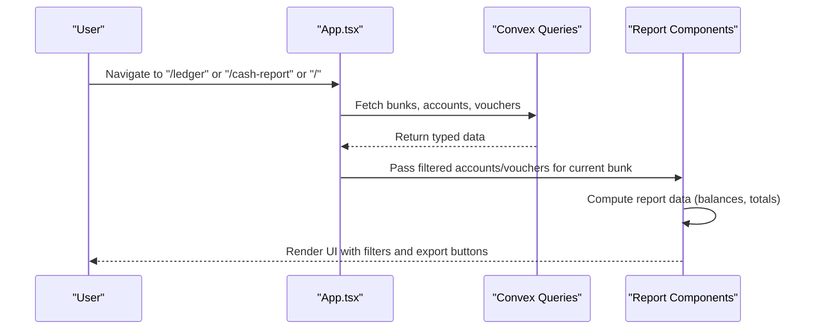
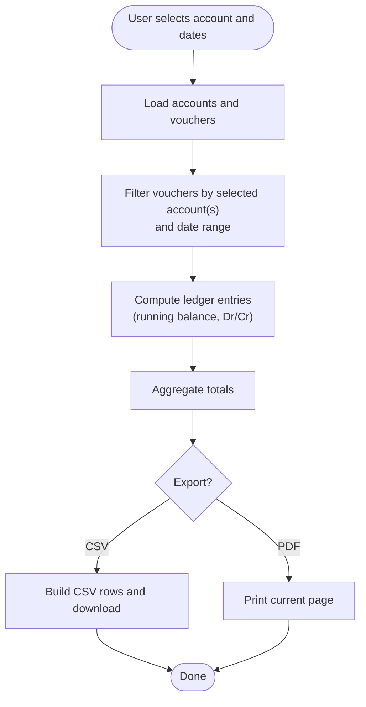
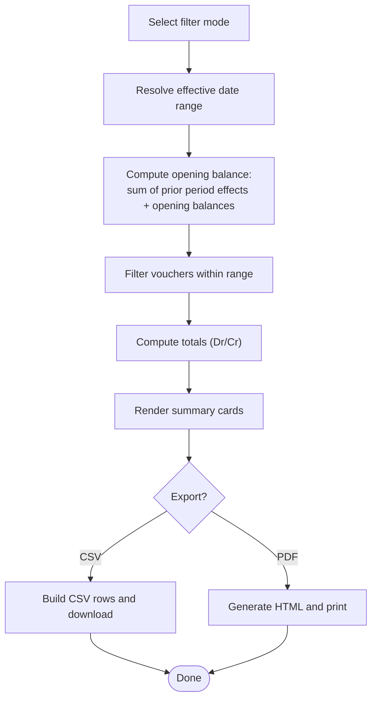
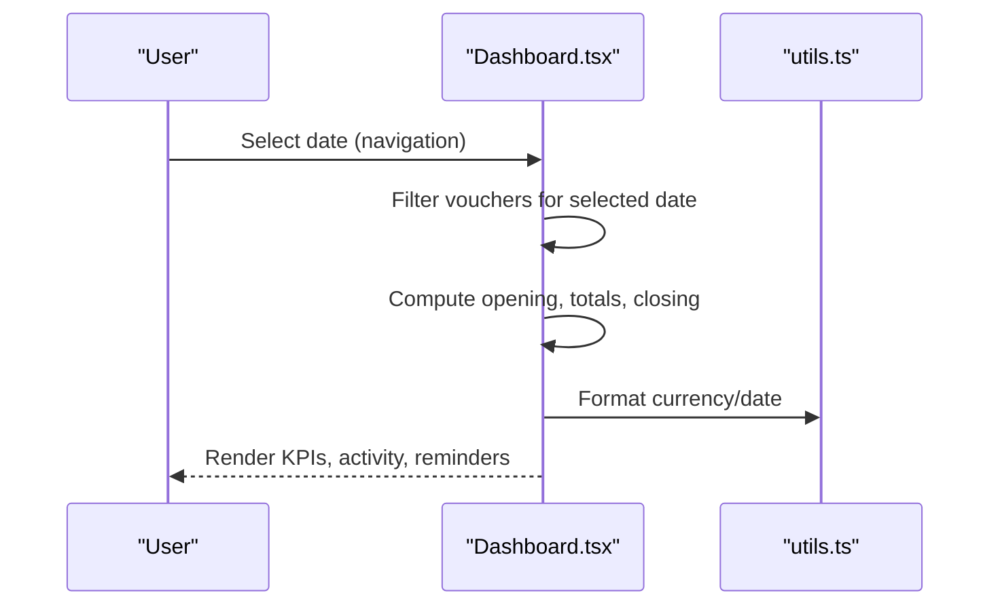
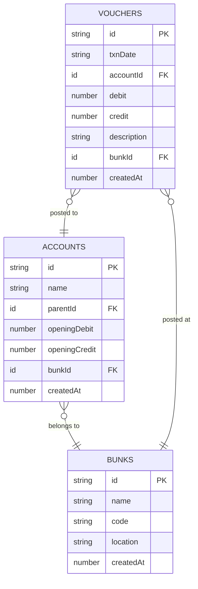
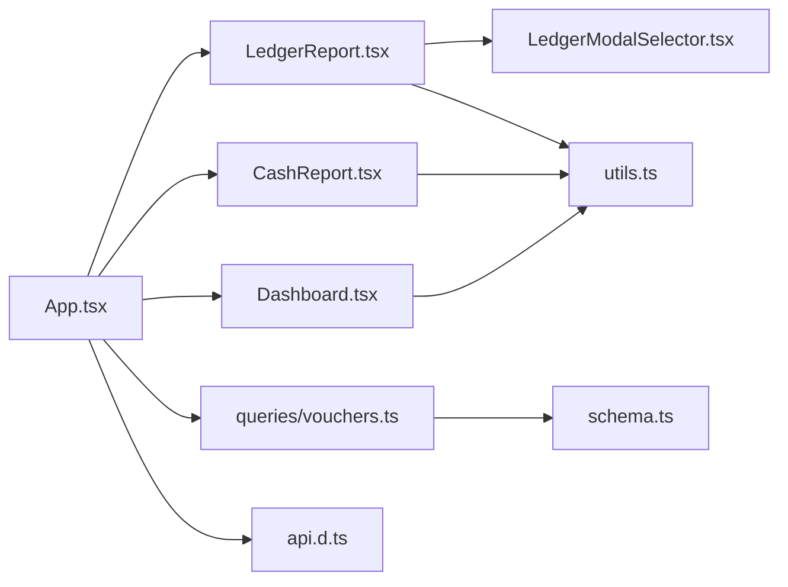

# Financial Reporting System

<cite>
**Referenced Files in This Document**
- [App.tsx](file://apps/App.tsx)
- [LedgerReport.tsx](file://apps/pages/LedgerReport.tsx)
- [CashReport.tsx](file://apps/pages/CashReport.tsx)
- [Dashboard.tsx](file://apps/pages/Dashboard.tsx)
- [LedgerModalSelector.tsx](file://apps/components/LedgerModalSelector.tsx)
- [utils.ts](file://apps/utils.ts)
- [types.ts](file://apps/types.ts)
- [schema.ts](file://convex/schema.ts)
- [vouchers.ts](file://convex/queries/vouchers.ts)
- [api.d.ts](file://convex/_generated/api.d.ts)
- [README.md](file://README.md)
- [metadata.json](file://apps/metadata.json)
</cite>

## Table of Contents
1. [Introduction](#introduction)
2. [Project Structure](#project-structure)
3. [Core Components](#core-components)
4. [Architecture Overview](#architecture-overview)
5. [Detailed Component Analysis](#detailed-component-analysis)
6. [Dependency Analysis](#dependency-analysis)
7. [Performance Considerations](#performance-considerations)
8. [Troubleshooting Guide](#troubleshooting-guide)
9. [Conclusion](#conclusion)
10. [Appendices](#appendices)

## Introduction
This document describes the Financial Reporting System for KR-FUELS, focusing on ledger reports, cash statements, and dashboard analytics. It explains report generation workflows, including date range selection, account filtering, and export capabilities. It also covers dashboard analytics with KPIs, trends, and summaries, and details cash report calculations including opening balances, daily transactions, and closing cash. Finally, it outlines ledger report features, export formats, and integration considerations with external accounting systems.

## Project Structure
The system is a React single-page application integrated with a Convex backend. Pages implement report and analytics views, while shared utilities and types support calculations and formatting. Convex defines the data model and exposes queries/mutations used by the frontend.

**Diagram sources**
- [App.tsx](file://apps/App.tsx#L216-L262)
- [LedgerReport.tsx](file://apps/pages/LedgerReport.tsx#L1-L257)
- [CashReport.tsx](file://apps/pages/CashReport.tsx#L1-L604)
- [Dashboard.tsx](file://apps/pages/Dashboard.tsx#L1-L219)
- [LedgerModalSelector.tsx](file://apps/components/LedgerModalSelector.tsx#L1-L182)
- [utils.ts](file://apps/utils.ts#L1-L69)
- [types.ts](file://apps/types.ts#L1-L56)
- [schema.ts](file://convex/schema.ts#L1-L85)
- [vouchers.ts](file://convex/queries/vouchers.ts#L1-L19)
- [api.d.ts](file://convex/_generated/api.d.ts#L1-L76)

**Section sources**
- [App.tsx](file://apps/App.tsx#L216-L262)
- [schema.ts](file://convex/schema.ts#L9-L84)
- [vouchers.ts](file://convex/queries/vouchers.ts#L4-L18)
- [api.d.ts](file://convex/_generated/api.d.ts#L32-L60)

## Core Components
- Ledger Report: Filters by account and date range, computes running ledger balances, and supports CSV export and PDF printing.
- Cash Report: Provides daily/monthly/YTD/financial year/custom views, computes opening/closing cash, and supports CSV export and PDF printing.
- Dashboard: Shows daily cash KPIs, recent activity, and reminders with navigation controls.
- Shared Utilities: Currency and date formatting, ledger calculation engine, and hierarchy helpers.
- Data Model: Hierarchical chart of accounts and transactional vouchers with Convex indices for efficient queries.

**Section sources**
- [LedgerReport.tsx](file://apps/pages/LedgerReport.tsx#L13-L75)
- [CashReport.tsx](file://apps/pages/CashReport.tsx#L15-L261)
- [Dashboard.tsx](file://apps/pages/Dashboard.tsx#L26-L81)
- [utils.ts](file://apps/utils.ts#L27-L64)
- [types.ts](file://apps/types.ts#L17-L55)
- [schema.ts](file://convex/schema.ts#L44-L69)

## Architecture Overview
The frontend fetches data via Convex queries, constructs per-bunk datasets, and renders report components. Reports compute balances and totals client-side using shared utilities. Exports are handled locally (CSV download) or via browser print/popup windows (PDF).

**Diagram sources**
- [App.tsx](file://apps/App.tsx#L22-L114)
- [vouchers.ts](file://convex/queries/vouchers.ts#L4-L18)
- [LedgerReport.tsx](file://apps/pages/LedgerReport.tsx#L49-L75)
- [CashReport.tsx](file://apps/pages/CashReport.tsx#L233-L261)
- [Dashboard.tsx](file://apps/pages/Dashboard.tsx#L50-L81)

## Detailed Component Analysis

### Ledger Report
The Ledger Report page enables:
- Account selection via a hierarchical modal selector supporting groups and sub-ledgers.
- Date range selection with calendar pickers.
- Computation of running balances using a ledger calculation engine.
- Export to CSV and print to PDF.

**Diagram sources**
- [LedgerReport.tsx](file://apps/pages/LedgerReport.tsx#L13-L111)
- [LedgerModalSelector.tsx](file://apps/components/LedgerModalSelector.tsx#L18-L116)
- [utils.ts](file://apps/utils.ts#L27-L64)

Key features and behaviors:
- Hierarchical account selection with optional group inclusion.
- Consolidation of descendant accounts for aggregated reporting.
- Running balance computed before and during the selected period.
- Export to CSV with standardized headers and formatting.
- Print-friendly layout with a print header.

**Section sources**
- [LedgerReport.tsx](file://apps/pages/LedgerReport.tsx#L13-L111)
- [LedgerModalSelector.tsx](file://apps/components/LedgerModalSelector.tsx#L18-L116)
- [utils.ts](file://apps/utils.ts#L27-L64)

### Cash Report
The Cash Report provides:
- Multiple filter modes: daily, monthly, YTD, financial year, and custom date range.
- Calculation of opening balance from prior period and account opening balances.
- Period transactions sorted by date with totals for inflow/outflow.
- Summary cards for opening, inflow, outflow, and closing cash.
- Export to CSV and print to PDF.

**Diagram sources**
- [CashReport.tsx](file://apps/pages/CashReport.tsx#L15-L261)
- [utils.ts](file://apps/utils.ts#L4-L18)

Cash computation highlights:
- Opening balance derived from prior vouchers and account openingDebit/openingCredit.
- Standard cash accounting: CR column treated as cash inflow; DR column as cash outflow.
- Closing cash equals opening plus inflows minus outflows.

**Section sources**
- [CashReport.tsx](file://apps/pages/CashReport.tsx#L15-L261)
- [utils.ts](file://apps/utils.ts#L4-L18)

### Dashboard Analytics
The Dashboard presents:
- Daily cash KPIs: opening, inflow, outflow, and closing cash.
- Recent activity table with account and transaction amounts.
- Reminders panel with active and due-today counts and sorting.

**Diagram sources**
- [Dashboard.tsx](file://apps/pages/Dashboard.tsx#L26-L81)
- [utils.ts](file://apps/utils.ts#L4-L18)

**Section sources**
- [Dashboard.tsx](file://apps/pages/Dashboard.tsx#L26-L81)
- [utils.ts](file://apps/utils.ts#L4-L18)

### Data Model and Report Inputs
The Convex schema defines accounts and vouchers with appropriate indices for efficient querying. The frontend composes per-bunk datasets for rendering reports.

**Diagram sources**
- [schema.ts](file://convex/schema.ts#L13-L69)

**Section sources**
- [schema.ts](file://convex/schema.ts#L13-L69)
- [types.ts](file://apps/types.ts#L17-L36)

## Dependency Analysis
- App orchestrates data fetching and routing, passing per-bunk filtered data to report components.
- Report components depend on shared utilities for formatting and ledger calculations.
- Convex queries provide typed collections for accounts and vouchers.
- The modal selector depends on the account hierarchy to enable flexible filtering.

**Diagram sources**
- [App.tsx](file://apps/App.tsx#L22-L114)
- [LedgerReport.tsx](file://apps/pages/LedgerReport.tsx#L1-L11)
- [CashReport.tsx](file://apps/pages/CashReport.tsx#L1-L11)
- [Dashboard.tsx](file://apps/pages/Dashboard.tsx#L1-L24)
- [LedgerModalSelector.tsx](file://apps/components/LedgerModalSelector.tsx#L1-L4)
- [utils.ts](file://apps/utils.ts#L1-L2)
- [vouchers.ts](file://convex/queries/vouchers.ts#L1-L19)
- [schema.ts](file://convex/schema.ts#L1-L85)
- [api.d.ts](file://convex/_generated/api.d.ts#L32-L60)

**Section sources**
- [App.tsx](file://apps/App.tsx#L22-L114)
- [vouchers.ts](file://convex/queries/vouchers.ts#L4-L18)
- [api.d.ts](file://convex/_generated/api.d.ts#L32-L60)

## Performance Considerations
- Client-side filtering and aggregation: Reports filter and sort local arrays. For large datasets, consider server-side pagination or pre-aggregation.
- Memoization: useMemo is used to avoid recomputing report data when inputs are unchanged.
- Rendering optimization: Large tables should leverage virtualization for improved scroll performance.
- Export generation: CSV/PDF generation runs in the browser; for very large datasets, consider streaming or server-side generation.
- Data loading: Convex queries return full collections; consider scoped queries by date range or account to reduce payload size.

[No sources needed since this section provides general guidance]

## Troubleshooting Guide
Common issues and resolutions:
- No transaction records found: Ensure the selected account has descendants or the date range includes transactions.
- Empty cash report: Verify the selected period and that vouchers exist for the current bunk.
- Export not working: Confirm browser allows downloads and pop-ups; CSV/PDF generation occurs in the browser.
- Incorrect balances: Check account opening balances and ensure prior period transactions are included in the calculation.

**Section sources**
- [LedgerReport.tsx](file://apps/pages/LedgerReport.tsx#L228-L234)
- [CashReport.tsx](file://apps/pages/CashReport.tsx#L581-L585)

## Conclusion
The Financial Reporting System delivers practical, real-time reporting for KR-FUELS with intuitive filters, accurate cash and ledger computations, and convenient exports. The modular architecture and shared utilities support maintainability and extensibility. For larger datasets, consider backend enhancements for pagination, indexing, and pre-aggregation.

[No sources needed since this section summarizes without analyzing specific files]

## Appendices

### Report Workflows and Examples
- Ledger Report
  - Configure: Select an account (including groups), choose From/To dates.
  - Example: Generate a monthly ledger for "Petrol Sales" for April 2025.
  - Export: Download CSV or print PDF.
- Cash Report
  - Configure: Choose daily/monthly/YTD/financial year/custom; apply filter popup.
  - Example: View cash statement for Q4 FY 2024–2025.
  - Export: Download CSV or print PDF.
- Dashboard
  - Configure: Navigate to the desired date; view KPIs and recent activity.
  - Example: Compare cash movement for today vs. yesterday.

**Section sources**
- [LedgerReport.tsx](file://apps/pages/LedgerReport.tsx#L13-L111)
- [CashReport.tsx](file://apps/pages/CashReport.tsx#L15-L261)
- [Dashboard.tsx](file://apps/pages/Dashboard.tsx#L26-L81)

### Export Formats and Integrations
- Export Formats
  - CSV: Ledger and Cash reports support CSV downloads with standardized headers.
  - PDF: Cash report generates a printable HTML document; Ledger uses browser print.
- External Accounting Systems
  - CSV exports can be imported into spreadsheets or ERPs for reconciliation.
  - Consider adding structured exports (e.g., JSON/XML) for programmatic integrations.

**Section sources**
- [LedgerReport.tsx](file://apps/pages/LedgerReport.tsx#L80-L111)
- [CashReport.tsx](file://apps/pages/CashReport.tsx#L263-L286)

### Real-time Data Synchronization
- Current state: Frontend fetches data via Convex queries; updates occur on navigation or refresh.
- Recommendations: Introduce reactive subscriptions or polling for near-real-time updates; cache invalidated on mutation completion.

**Section sources**
- [App.tsx](file://apps/App.tsx#L22-L114)
- [api.d.ts](file://convex/_generated/api.d.ts#L32-L60)

### Getting Started
- Prerequisites: Node.js
- Steps:
  - Install dependencies
  - Run the development server

**Section sources**
- [README.md](file://README.md#L3-L11)