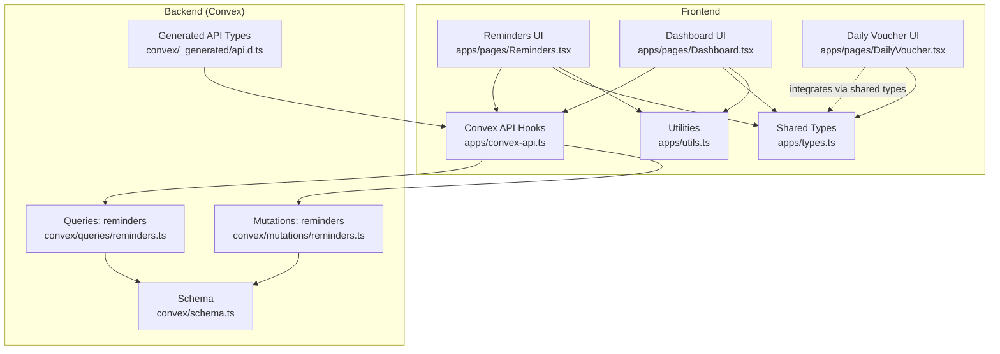
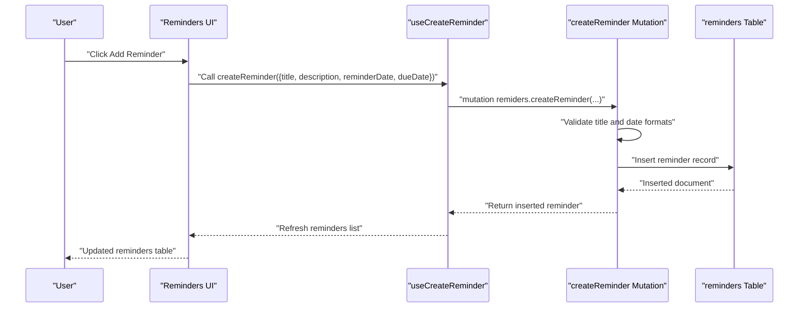
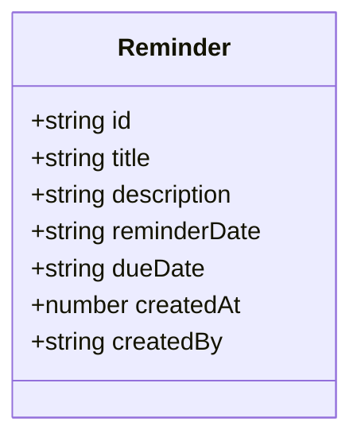
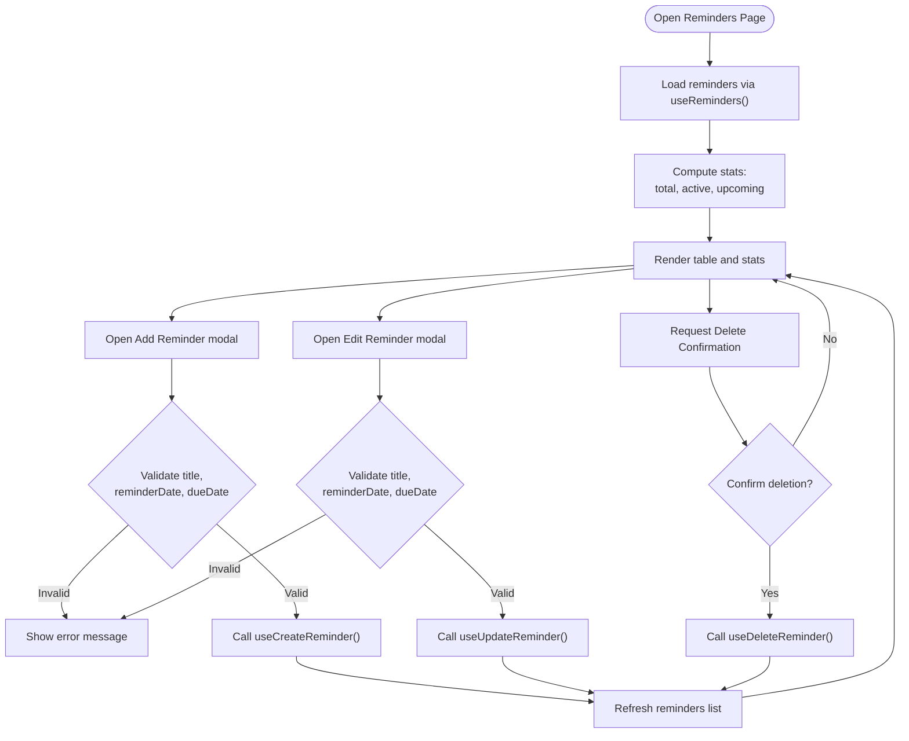
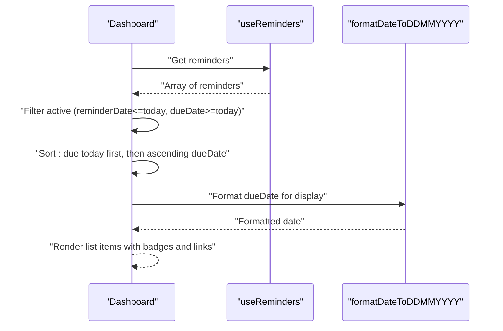
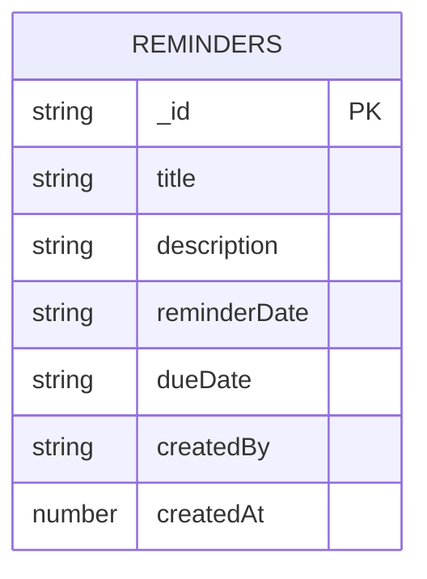
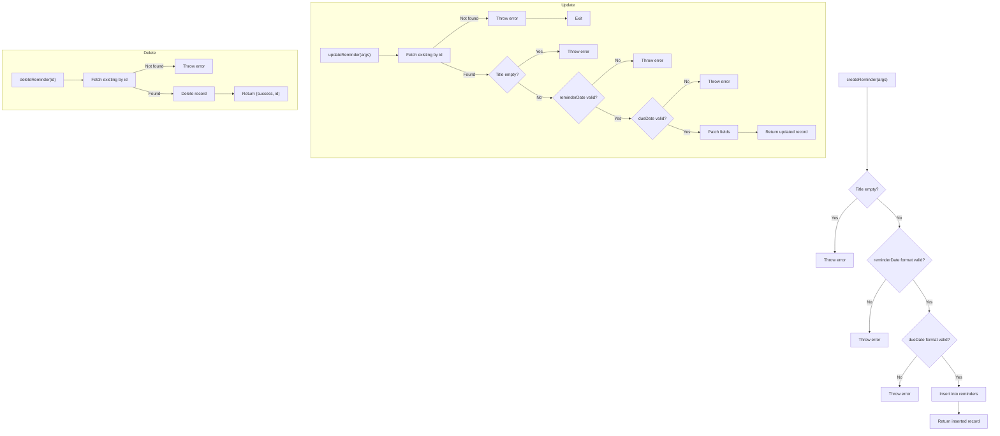
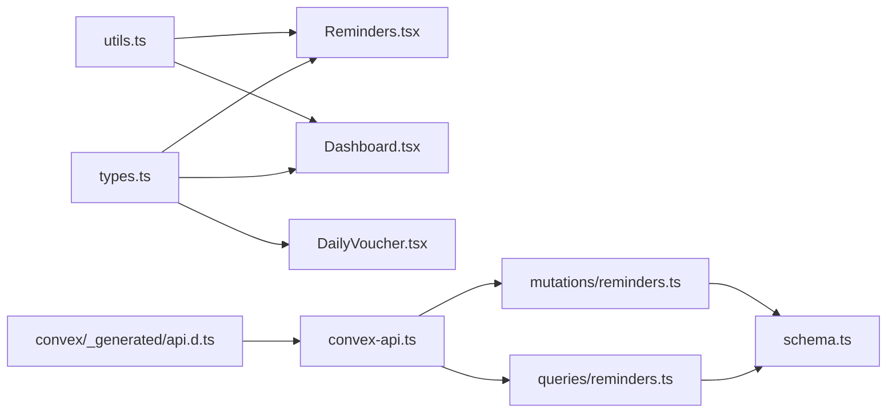

# Reminders and Task Management

<cite>
**Referenced Files in This Document**
- [Reminders.tsx](file://apps/pages/Reminders.tsx)
- [Dashboard.tsx](file://apps/pages/Dashboard.tsx)
- [DailyVoucher.tsx](file://apps/pages/DailyVoucher.tsx)
- [convex-api.ts](file://apps/convex-api.ts)
- [types.ts](file://apps/types.ts)
- [reminders.ts (mutations)](file://convex/mutations/reminders.ts)
- [reminders.ts (queries)](file://convex/queries/reminders.ts)
- [schema.ts](file://convex/schema.ts)
- [api.d.ts](file://convex/_generated/api.d.ts)
- [utils.ts](file://apps/utils.ts)
- [README.md](file://README.md)
</cite>

## Table of Contents
1. [Introduction](#introduction)
2. [Project Structure](#project-structure)
3. [Core Components](#core-components)
4. [Architecture Overview](#architecture-overview)
5. [Detailed Component Analysis](#detailed-component-analysis)
6. [Dependency Analysis](#dependency-analysis)
7. [Performance Considerations](#performance-considerations)
8. [Troubleshooting Guide](#troubleshooting-guide)
9. [Conclusion](#conclusion)
10. [Appendices](#appendices)

## Introduction
This document describes the Reminders and Task Management system for KR-FUELS, focusing on how reminders are created, tracked, filtered, and integrated with the daily voucher workflow. It explains the task lifecycle from creation to completion, overdue handling, and how reminders appear on the dashboard. It also outlines the current limitations around automation, recurring tasks, and data retention for completed tasks, and suggests practical strategies for fuel station operations.

## Project Structure
The reminders system spans three layers:
- Frontend UI pages for viewing and editing reminders
- Convex backend for data persistence and queries
- Shared types and utilities for consistent data modeling and formatting

**Diagram sources**
- [Reminders.tsx](file://apps/pages/Reminders.tsx#L1-L388)
- [Dashboard.tsx](file://apps/pages/Dashboard.tsx#L1-L219)
- [DailyVoucher.tsx](file://apps/pages/DailyVoucher.tsx#L1-L336)
- [convex-api.ts](file://apps/convex-api.ts#L1-L33)
- [types.ts](file://apps/types.ts#L1-L56)
- [reminders.ts (mutations)](file://convex/mutations/reminders.ts#L1-L116)
- [reminders.ts (queries)](file://convex/queries/reminders.ts#L1-L71)
- [schema.ts](file://convex/schema.ts#L1-L85)
- [api.d.ts](file://convex/_generated/api.d.ts#L1-L76)
- [utils.ts](file://apps/utils.ts#L1-L69)

**Section sources**
- [Reminders.tsx](file://apps/pages/Reminders.tsx#L1-L388)
- [Dashboard.tsx](file://apps/pages/Dashboard.tsx#L1-L219)
- [DailyVoucher.tsx](file://apps/pages/DailyVoucher.tsx#L1-L336)
- [convex-api.ts](file://apps/convex-api.ts#L1-L33)
- [types.ts](file://apps/types.ts#L1-L56)
- [reminders.ts (mutations)](file://convex/mutations/reminders.ts#L1-L116)
- [reminders.ts (queries)](file://convex/queries/reminders.ts#L1-L71)
- [schema.ts](file://convex/schema.ts#L1-L85)
- [api.d.ts](file://convex/_generated/api.d.ts#L1-L76)
- [utils.ts](file://apps/utils.ts#L1-L69)
- [README.md](file://README.md#L1-L13)

## Core Components
- Reminder entity: title, description, reminderDate, dueDate, createdBy, createdAt
- UI pages:
  - Reminders page for listing, adding, editing, and deleting reminders
  - Dashboard widget showing active and due-today reminders
  - Daily Voucher page for financial transaction recording
- Backend:
  - Queries: fetch all reminders, upcoming reminders (next 7 days), overdue reminders
  - Mutations: create, update, delete reminders
  - Schema: reminders table with indexes on dueDate and reminderDate

Key behaviors:
- Creation validates non-empty title and date formats (YYYY-MM-DD)
- Active reminders are those where reminderDate ≤ today and dueDate ≥ today
- Upcoming reminders are those where reminderDate is in the future
- Overdue reminders are those where dueDate < today

**Section sources**
- [types.ts](file://apps/types.ts#L47-L56)
- [Reminders.tsx](file://apps/pages/Reminders.tsx#L23-L37)
- [reminders.ts (queries)](file://convex/queries/reminders.ts#L12-L27)
- [reminders.ts (queries)](file://convex/queries/reminders.ts#L33-L50)
- [reminders.ts (queries)](file://convex/queries/reminders.ts#L56-L70)
- [reminders.ts (mutations)](file://convex/mutations/reminders.ts#L12-L48)
- [reminders.ts (mutations)](file://convex/mutations/reminders.ts#L53-L93)
- [reminders.ts (mutations)](file://convex/mutations/reminders.ts#L98-L115)
- [schema.ts](file://convex/schema.ts#L74-L84)

## Architecture Overview
The reminders feature follows a straightforward client-server pattern:
- React components call Convex hooks to read/write reminders
- Convex queries and mutations enforce basic validation and return normalized data
- The dashboard consumes reminders to display active/due-today items

**Diagram sources**
- [Reminders.tsx](file://apps/pages/Reminders.tsx#L39-L46)
- [convex-api.ts](file://apps/convex-api.ts#L17-L18)
- [reminders.ts (mutations)](file://convex/mutations/reminders.ts#L12-L48)
- [schema.ts](file://convex/schema.ts#L74-L84)

**Section sources**
- [Reminders.tsx](file://apps/pages/Reminders.tsx#L39-L46)
- [convex-api.ts](file://apps/convex-api.ts#L17-L18)
- [reminders.ts (mutations)](file://convex/mutations/reminders.ts#L12-L48)
- [schema.ts](file://convex/schema.ts#L74-L84)

## Detailed Component Analysis

### Reminder Entity Model
The Reminder type defines the shape of reminder records used across the app.

**Diagram sources**
- [types.ts](file://apps/types.ts#L47-L56)

**Section sources**
- [types.ts](file://apps/types.ts#L47-L56)

### Reminders Page (Task Creation and Editing)
The Reminders page provides:
- Stats: total, active now, upcoming
- Table listing reminders with edit/delete actions
- Modal forms to add and edit reminders
- Validation: title, reminderDate, dueDate are required

**Diagram sources**
- [Reminders.tsx](file://apps/pages/Reminders.tsx#L39-L86)
- [convex-api.ts](file://apps/convex-api.ts#L14-L19)

**Section sources**
- [Reminders.tsx](file://apps/pages/Reminders.tsx#L6-L38)
- [Reminders.tsx](file://apps/pages/Reminders.tsx#L62-L86)
- [convex-api.ts](file://apps/convex-api.ts#L14-L19)

### Dashboard Integration (Task Tracking and Notifications)
The dashboard displays:
- Counts for active reminders and due-today reminders
- A scrollable list of active reminders, prioritized by due date
- Visual indicators: red for due today, green for active

**Diagram sources**
- [Dashboard.tsx](file://apps/pages/Dashboard.tsx#L151-L211)
- [utils.ts](file://apps/utils.ts#L12-L18)

**Section sources**
- [Dashboard.tsx](file://apps/pages/Dashboard.tsx#L151-L211)
- [utils.ts](file://apps/utils.ts#L12-L18)

### Reminder Queries and Indexing
The backend provides three primary query functions:
- getAllReminders: returns all reminders sorted by dueDate
- getUpcomingReminders: returns reminders due within the next 7 days
- getOverdueReminders: returns reminders whose dueDate is in the past

Indexes:
- by_due_date: supports overdue queries
- by_reminder_date: supports upcoming queries

**Diagram sources**
- [schema.ts](file://convex/schema.ts#L74-L84)

**Section sources**
- [reminders.ts (queries)](file://convex/queries/reminders.ts#L12-L27)
- [reminders.ts (queries)](file://convex/queries/reminders.ts#L33-L50)
- [reminders.ts (queries)](file://convex/queries/reminders.ts#L56-L70)
- [schema.ts](file://convex/schema.ts#L74-L84)

### Reminder Mutations (Create, Update, Delete)
- Validation ensures:
  - Non-empty title
  - Dates match YYYY-MM-DD format
- Create adds createdBy and createdAt
- Update patches fields and returns the updated record
- Delete removes the record and returns success

**Diagram sources**
- [reminders.ts (mutations)](file://convex/mutations/reminders.ts#L12-L48)
- [reminders.ts (mutations)](file://convex/mutations/reminders.ts#L53-L93)
- [reminders.ts (mutations)](file://convex/mutations/reminders.ts#L98-L115)

**Section sources**
- [reminders.ts (mutations)](file://convex/mutations/reminders.ts#L12-L48)
- [reminders.ts (mutations)](file://convex/mutations/reminders.ts#L53-L93)
- [reminders.ts (mutations)](file://convex/mutations/reminders.ts#L98-L115)

### Daily Voucher Workflow Integration
While reminders are not automatically generated from vouchers, the system supports operational integration:
- The Daily Voucher page manages cash flow and transaction posting
- Operators can link reminders to voucher deadlines (e.g., filing deadlines, approvals)
- The dashboard surfaces reminders to raise awareness during daily operations

[No sources needed since this section synthesizes existing behaviors without quoting specific code]

## Dependency Analysis
- Frontend depends on Convex-generated API types and hooks
- Queries rely on schema indexes for efficient filtering
- UI components depend on shared types and formatting utilities

**Diagram sources**
- [types.ts](file://apps/types.ts#L1-L56)
- [utils.ts](file://apps/utils.ts#L1-L69)
- [convex-api.ts](file://apps/convex-api.ts#L1-L33)
- [reminders.ts (queries)](file://convex/queries/reminders.ts#L1-L71)
- [reminders.ts (mutations)](file://convex/mutations/reminders.ts#L1-L116)
- [schema.ts](file://convex/schema.ts#L1-L85)
- [api.d.ts](file://convex/_generated/api.d.ts#L1-L76)

**Section sources**
- [convex-api.ts](file://apps/convex-api.ts#L1-L33)
- [api.d.ts](file://convex/_generated/api.d.ts#L57-L60)
- [reminders.ts (queries)](file://convex/queries/reminders.ts#L12-L27)
- [reminders.ts (mutations)](file://convex/mutations/reminders.ts#L12-L48)
- [schema.ts](file://convex/schema.ts#L74-L84)

## Performance Considerations
- Index usage:
  - by_due_date and by_reminder_date enable efficient filtering for overdue and upcoming queries
- Sorting:
  - Queries sort by dueDate to present chronological order
- Client-side filtering:
  - The Reminders page computes active/upcoming counts client-side for quick rendering
- Recommendations:
  - Consider pagination for very large reminder sets
  - Debounce frequent filter updates on the UI
  - Cache frequently accessed reminder lists in memory if appropriate

[No sources needed since this section provides general guidance]

## Troubleshooting Guide
Common issues and resolutions:
- Validation errors on create/update:
  - Ensure title is not empty and dates are in YYYY-MM-DD format
- Reminder not found on update/delete:
  - Verify the reminder id exists in the database
- Unexpected empty lists:
  - Confirm timezone assumptions; the system uses local ISO date strings
- Formatting inconsistencies:
  - Use formatDateToDDMMYYYY for consistent display formatting

**Section sources**
- [reminders.ts (mutations)](file://convex/mutations/reminders.ts#L23-L34)
- [reminders.ts (mutations)](file://convex/mutations/reminders.ts#L65-L68)
- [reminders.ts (mutations)](file://convex/mutations/reminders.ts#L106-L109)
- [utils.ts](file://apps/utils.ts#L12-L18)

## Conclusion
The Reminders and Task Management system provides a solid foundation for task visibility and basic lifecycle operations. It enables operators to track active and due reminders directly from the dashboard, supports manual creation and editing, and offers query primitives for upcoming and overdue items. While automation and recurring tasks are not implemented, the modular design allows incremental enhancements to support advanced scheduling and integrations with workflows like daily vouchers.

[No sources needed since this section summarizes without analyzing specific files]

## Appendices

### Typical Operational Reminders for Fuel Stations
- Monthly inventory reconciliation due dates
- Tax filing deadlines aligned with voucher periods
- Equipment maintenance schedules linked to operational cycles
- Approval workflows for expense vouchers

[No sources needed since this section provides general guidance]

### Task Categorization Strategies
- By functional area (Accounts, Inventory, Taxes)
- By urgency (Critical, High, Medium, Low)
- By responsible party (Team member, Department)
- By frequency (Daily, Weekly, Monthly, One-time)

[No sources needed since this section provides general guidance]

### Integration with Daily Voucher Workflows
- Link reminders to voucher posting deadlines
- Use dashboard reminders to prompt completion of pre/posting steps
- Flag overdue reminders on the dashboard for escalation

[No sources needed since this section synthesizes existing behaviors without quoting specific code]

### Notification Preferences and Automation Possibilities
- Current state:
  - No built-in push/email notifications
  - Dashboard highlights active and due-today reminders
- Suggested enhancements:
  - Introduce notification channels (email, in-app)
  - Add recurring task templates for periodic activities
  - Implement automated due-date reminders based on configurable offsets

[No sources needed since this section provides forward-looking suggestions]

### Data Retention Policies for Completed Tasks
- Current state:
  - No explicit retention policy for reminders
  - Deletions remove records permanently
- Recommended policy:
  - Archive completed reminders after 90–180 days
  - Maintain minimal metadata for audit trails
  - Provide admin controls to purge archived records

[No sources needed since this section provides general guidance]