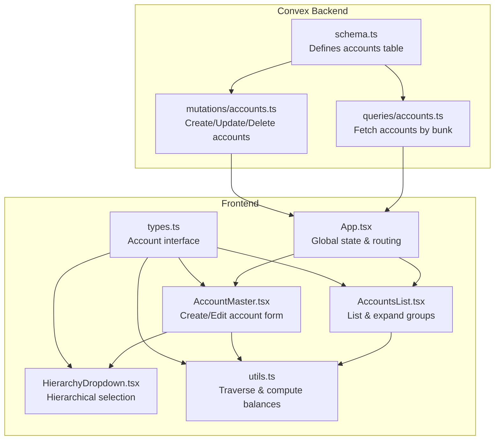
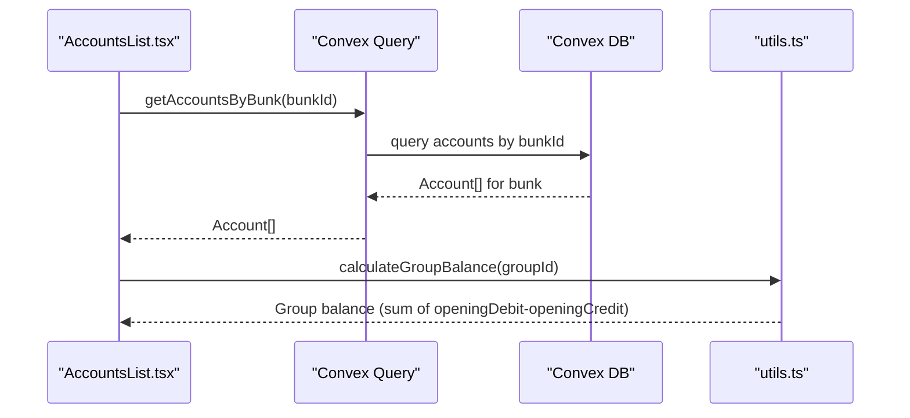
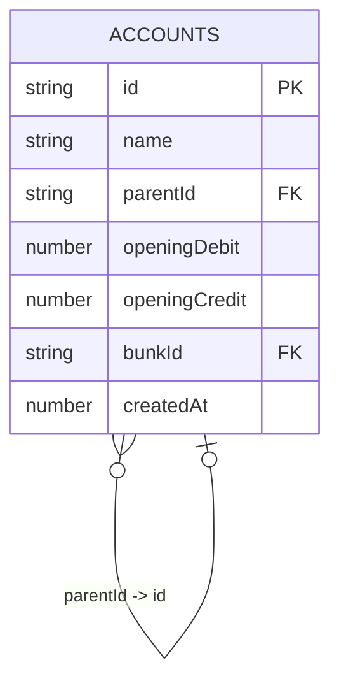
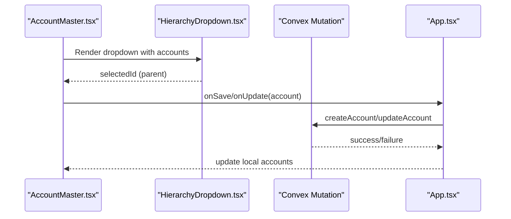
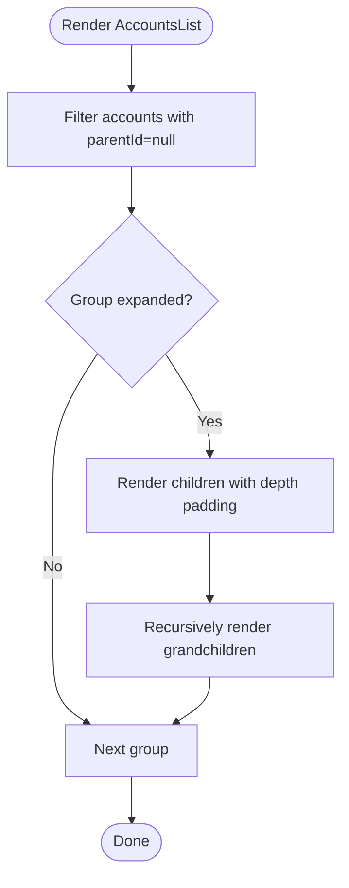
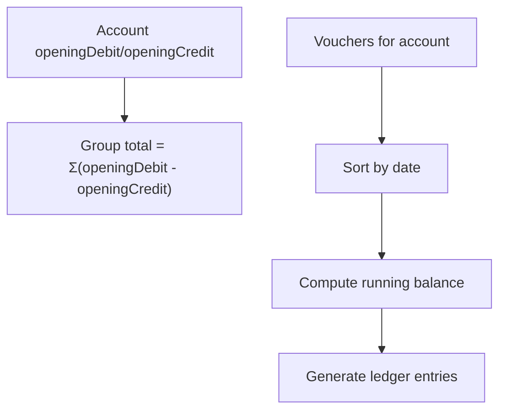
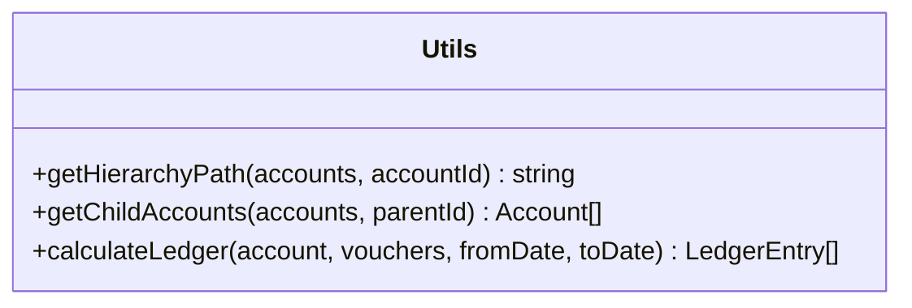
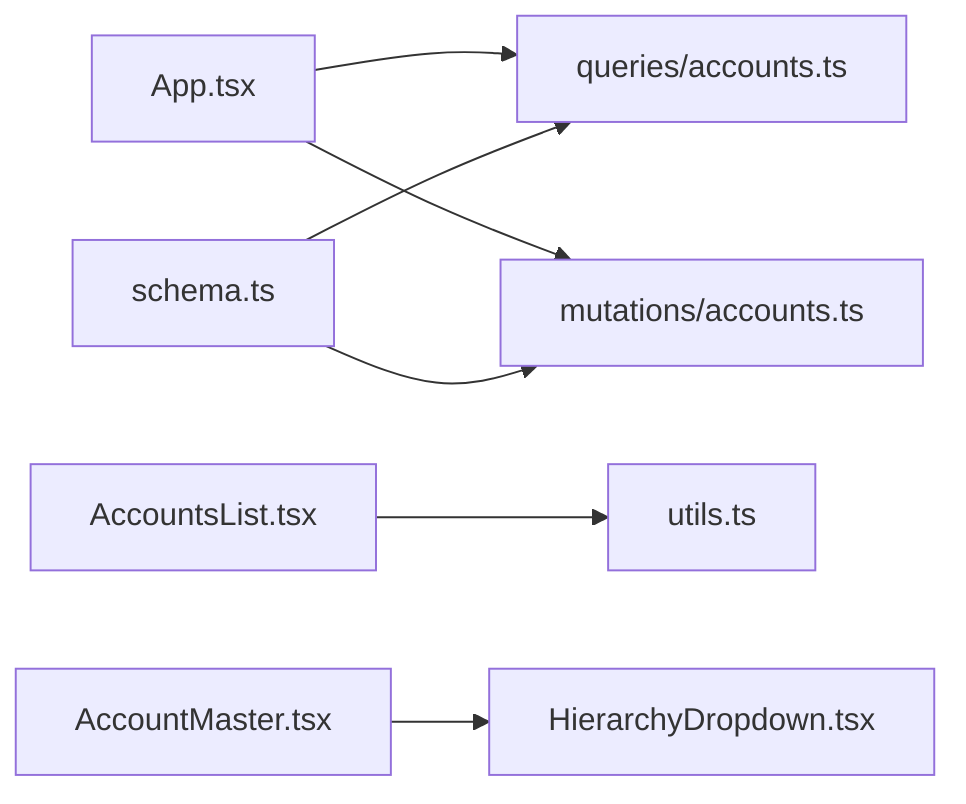

# Account Hierarchy

<cite>
**Referenced Files in This Document**
- [schema.ts](file://convex/schema.ts)
- [accounts.ts](file://convex/mutations/accounts.ts)
- [accounts.ts](file://convex/queries/accounts.ts)
- [App.tsx](file://apps/App.tsx)
- [AccountMaster.tsx](file://apps/pages/AccountMaster.tsx)
- [AccountsList.tsx](file://apps/pages/AccountsList.tsx)
- [HierarchyDropdown.tsx](file://apps/components/HierarchyDropdown.tsx)
- [utils.ts](file://apps/utils.ts)
- [types.ts](file://apps/types.ts)
</cite>

## Table of Contents
1. [Introduction](#introduction)
2. [Project Structure](#project-structure)
3. [Core Components](#core-components)
4. [Architecture Overview](#architecture-overview)
5. [Detailed Component Analysis](#detailed-component-analysis)
6. [Dependency Analysis](#dependency-analysis)
7. [Performance Considerations](#performance-considerations)
8. [Troubleshooting Guide](#troubleshooting-guide)
9. [Conclusion](#conclusion)

## Introduction
This document explains the hierarchical chart of accounts system in KR-FUELS. It focuses on the self-referencing account structure, where accounts form a parent-child hierarchy via the parentId field. It documents how this supports traditional accounting hierarchies (groups as parents and ledger accounts as children), how openingDebit and openingCredit establish balances, and how bunkId ensures location-specific account hierarchies. Practical examples demonstrate creating account groups, adding child accounts, and navigating the hierarchy. Utility functions for traversal, balance calculations, and validation are covered, along with common account management scenarios such as reclassifying accounts, transferring child accounts, and maintaining integrity during modifications.

## Project Structure
The account hierarchy spans both the backend Convex schema and the frontend React application:
- Backend schema defines the accounts table with self-referencing parentId, openingDebit/openingCredit, and bunkId.
- Frontend pages and components manage creation, editing, deletion, and display of accounts, including hierarchical navigation and balance computation.
- Utilities provide traversal helpers and ledger calculations.

**Diagram sources**
- [schema.ts](file://convex/schema.ts#L43-L54)
- [accounts.ts](file://convex/queries/accounts.ts#L4-L12)
- [accounts.ts](file://convex/mutations/accounts.ts#L4-L61)
- [App.tsx](file://apps/App.tsx#L23-L99)
- [AccountsList.tsx](file://apps/pages/AccountsList.tsx#L24-L251)
- [AccountMaster.tsx](file://apps/pages/AccountMaster.tsx#L16-L227)
- [HierarchyDropdown.tsx](file://apps/components/HierarchyDropdown.tsx#L16-L137)
- [utils.ts](file://apps/utils.ts#L20-L68)
- [types.ts](file://apps/types.ts#L17-L25)

**Section sources**
- [schema.ts](file://convex/schema.ts#L43-L54)
- [accounts.ts](file://convex/queries/accounts.ts#L4-L12)
- [accounts.ts](file://convex/mutations/accounts.ts#L4-L61)
- [App.tsx](file://apps/App.tsx#L23-L99)
- [AccountsList.tsx](file://apps/pages/AccountsList.tsx#L24-L251)
- [AccountMaster.tsx](file://apps/pages/AccountMaster.tsx#L16-L227)
- [HierarchyDropdown.tsx](file://apps/components/HierarchyDropdown.tsx#L16-L137)
- [utils.ts](file://apps/utils.ts#L20-L68)
- [types.ts](file://apps/types.ts#L17-L25)

## Core Components
- Accounts table with self-referencing parentId enables hierarchical grouping.
- Opening balances (openingDebit, openingCredit) support double-entry accounting initialization.
- bunkId ties accounts to specific fuel station locations, enforcing location-scoped hierarchies.
- Frontend pages provide CRUD operations and hierarchical views.
- Utilities offer traversal and balance computation helpers.

Key backend schema fields:
- name: Account title
- parentId: Self-reference to parent group (nullable)
- openingDebit: Initial debit balance
- openingCredit: Initial credit balance
- bunkId: Location identifier
- createdAt: Timestamp

**Section sources**
- [schema.ts](file://convex/schema.ts#L45-L51)
- [types.ts](file://apps/types.ts#L17-L25)

## Architecture Overview
The system integrates Convex backend with React frontend:
- Convex schema defines the accounts table and indexes for efficient queries.
- Queries fetch accounts filtered by bunkId.
- Mutations create, update, and delete accounts with validation.
- Frontend components render hierarchical lists, forms, and dropdowns.
- Utilities compute balances and traverse the hierarchy.

**Diagram sources**
- [accounts.ts](file://convex/queries/accounts.ts#L4-L12)
- [AccountsList.tsx](file://apps/pages/AccountsList.tsx#L41-L51)
- [utils.ts](file://apps/utils.ts#L20-L25)

## Detailed Component Analysis

### Accounts Table and Self-Referencing Hierarchy
- Self-referencing design: parentId references another account id, forming a tree where null indicates top-level groups.
- Indexes: by_bunk and by_parent enable efficient filtering and traversal.
- Location scoping: bunkId ensures hierarchies are isolated per fuel station.

**Diagram sources**
- [schema.ts](file://convex/schema.ts#L45-L51)

**Section sources**
- [schema.ts](file://convex/schema.ts#L45-L54)

### Frontend Account Management Pages
- AccountsList.tsx renders grouped accounts, expands/collapses groups, computes balances, and provides actions.
- AccountMaster.tsx handles creating/editing accounts, including parent selection via HierarchyDropdown.tsx and opening balance inputs.
- App.tsx orchestrates global state, routes, and Convex integration.

**Diagram sources**
- [AccountMaster.tsx](file://apps/pages/AccountMaster.tsx#L16-L75)
- [HierarchyDropdown.tsx](file://apps/components/HierarchyDropdown.tsx#L16-L137)
- [accounts.ts](file://convex/mutations/accounts.ts#L4-L43)
- [App.tsx](file://apps/App.tsx#L116-L143)

**Section sources**
- [AccountsList.tsx](file://apps/pages/AccountsList.tsx#L24-L251)
- [AccountMaster.tsx](file://apps/pages/AccountMaster.tsx#L16-L227)
- [HierarchyDropdown.tsx](file://apps/components/HierarchyDropdown.tsx#L16-L137)
- [App.tsx](file://apps/App.tsx#L116-L143)

### Hierarchical Navigation and Tree Traversal
- HierarchyDropdown.tsx builds a hierarchical selector from available groups, excluding the current account id when editing.
- AccountsList.tsx traverses the tree to render nested rows and compute group totals.
- utils.ts provides recursive traversal and child retrieval helpers.

**Diagram sources**
- [AccountsList.tsx](file://apps/pages/AccountsList.tsx#L186-L241)
- [HierarchyDropdown.tsx](file://apps/components/HierarchyDropdown.tsx#L61-L91)
- [utils.ts](file://apps/utils.ts#L66-L68)

**Section sources**
- [HierarchyDropdown.tsx](file://apps/components/HierarchyDropdown.tsx#L33-L44)
- [AccountsList.tsx](file://apps/pages/AccountsList.tsx#L70-L127)
- [utils.ts](file://apps/utils.ts#L20-L25)
- [utils.ts](file://apps/utils.ts#L66-L68)

### Balance Calculation and Double-Entry Initialization
- Opening balances: openingDebit and openingCredit initialize account balances.
- Group balance: sum of (openingDebit - openingCredit) across the group tree.
- Ledger calculation: running balance computed from vouchers within a date range.

**Diagram sources**
- [AccountsList.tsx](file://apps/pages/AccountsList.tsx#L41-L51)
- [utils.ts](file://apps/utils.ts#L27-L64)

**Section sources**
- [AccountsList.tsx](file://apps/pages/AccountsList.tsx#L41-L51)
- [utils.ts](file://apps/utils.ts#L27-L64)

### Practical Examples

#### Creating an Account Group
- Use the "New Account Group" modal in AccountMaster.tsx to create a top-level group (parentId null).
- The form sets openingDebit and openingCredit to zero and assigns bunkId from the current location.

**Section sources**
- [AccountMaster.tsx](file://apps/pages/AccountMaster.tsx#L58-L75)

#### Adding a Child Account Under a Group
- From AccountsList.tsx, click "Register New Account in Group" under a group.
- The form preselects the group as parentId and opens AccountMaster.tsx for ledger creation.

**Section sources**
- [AccountsList.tsx](file://apps/pages/AccountsList.tsx#L228-L236)
- [AccountMaster.tsx](file://apps/pages/AccountMaster.tsx#L31-L38)

#### Navigating the Hierarchy
- Use HierarchyDropdown.tsx to select a parent group when creating or editing an account.
- AccountsList.tsx displays groups and nested ledgers with indentation and expand/collapse controls.

**Section sources**
- [HierarchyDropdown.tsx](file://apps/components/HierarchyDropdown.tsx#L61-L91)
- [AccountsList.tsx](file://apps/pages/AccountsList.tsx#L186-L241)

### Utility Functions for Account Management
- Hierarchy path: getHierarchyPath returns a human-readable path from root to account.
- Child retrieval: getChildAccounts filters accounts by parentId.
- Ledger calculation: calculateLedger computes running balances for a given period.

**Diagram sources**
- [utils.ts](file://apps/utils.ts#L20-L25)
- [utils.ts](file://apps/utils.ts#L66-L68)
- [utils.ts](file://apps/utils.ts#L27-L64)

**Section sources**
- [utils.ts](file://apps/utils.ts#L20-L25)
- [utils.ts](file://apps/utils.ts#L66-L68)
- [utils.ts](file://apps/utils.ts#L27-L64)

### Common Account Management Scenarios

#### Reclassifying Accounts
- Change an account’s parentId to move it under a different group while preserving opening balances.
- Validation: ensure the target group exists and the account is not a parent itself.

Implementation note: Use updateAccount mutation with a new parentId.

**Section sources**
- [accounts.ts](file://convex/mutations/accounts.ts#L24-L43)

#### Transferring Child Accounts
- To move children from one parent to another, update each child’s parentId to the new group.
- Integrity: verify no child accounts remain under the old parent after transfer.

Implementation note: Iterate over children and call updateAccount for each.

**Section sources**
- [utils.ts](file://apps/utils.ts#L66-L68)
- [accounts.ts](file://convex/mutations/accounts.ts#L24-L43)

#### Maintaining Account Integrity During Modifications
- Prevent deleting accounts that still have children: the deleteAccount mutation checks for sub-accounts and blocks deletion.
- Ensure bunkId remains consistent when moving accounts across locations.

**Section sources**
- [accounts.ts](file://convex/mutations/accounts.ts#L45-L61)

## Dependency Analysis
- AccountsList.tsx depends on utils.ts for traversal and balance computation.
- AccountMaster.tsx depends on HierarchyDropdown.tsx for parent selection.
- App.tsx integrates Convex queries and mutations for account CRUD and maintains current bunk context.
- schema.ts defines the data model and indexes that enable efficient queries.

**Diagram sources**
- [App.tsx](file://apps/App.tsx#L23-L29)
- [accounts.ts](file://convex/queries/accounts.ts#L4-L12)
- [accounts.ts](file://convex/mutations/accounts.ts#L4-L61)
- [AccountsList.tsx](file://apps/pages/AccountsList.tsx#L24-L251)
- [utils.ts](file://apps/utils.ts#L20-L68)
- [AccountMaster.tsx](file://apps/pages/AccountMaster.tsx#L16-L227)
- [HierarchyDropdown.tsx](file://apps/components/HierarchyDropdown.tsx#L16-L137)
- [schema.ts](file://convex/schema.ts#L43-L54)

**Section sources**
- [App.tsx](file://apps/App.tsx#L23-L29)
- [accounts.ts](file://convex/queries/accounts.ts#L4-L12)
- [accounts.ts](file://convex/mutations/accounts.ts#L4-L61)
- [AccountsList.tsx](file://apps/pages/AccountsList.tsx#L24-L251)
- [utils.ts](file://apps/utils.ts#L20-L68)
- [AccountMaster.tsx](file://apps/pages/AccountMaster.tsx#L16-L227)
- [HierarchyDropdown.tsx](file://apps/components/HierarchyDropdown.tsx#L16-L137)
- [schema.ts](file://convex/schema.ts#L43-L54)

## Performance Considerations
- Index usage: by_bunk and by_parent indexes optimize fetching accounts by location and by parent.
- Rendering: AccountsList.tsx sorts and filters children per group to keep UI responsive.
- Recursive traversal: Balance computations and hierarchy rendering are O(n) over the number of accounts in scope.

[No sources needed since this section provides general guidance]

## Troubleshooting Guide
- Cannot delete an account: The system prevents deletion if the account has sub-accounts. Remove or reassign children first.
- Parent selection issues: Ensure the selected parent is a group (parentId null) and not a ledger account.
- Balances appear incorrect: Verify openingDebit and openingCredit values and confirm bunkId alignment with the intended location.

**Section sources**
- [accounts.ts](file://convex/mutations/accounts.ts#L45-L61)
- [HierarchyDropdown.tsx](file://apps/components/HierarchyDropdown.tsx#L42-L44)

## Conclusion
KR-FUELS implements a robust hierarchical chart of accounts with a self-referencing structure, location-scoped hierarchies via bunkId, and double-entry initialization through openingDebit and openingCredit. The frontend provides intuitive tools for creating groups, adding child accounts, and navigating the hierarchy, while utilities support traversal and balance calculations. The backend enforces integrity through validation and indexes, enabling scalable and maintainable account management.