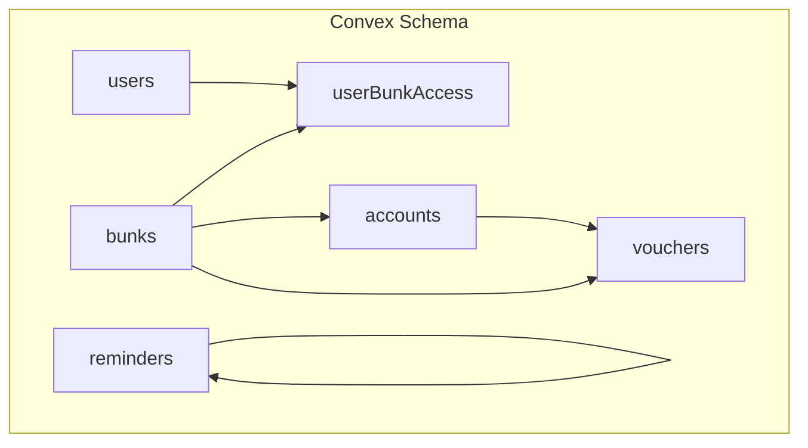
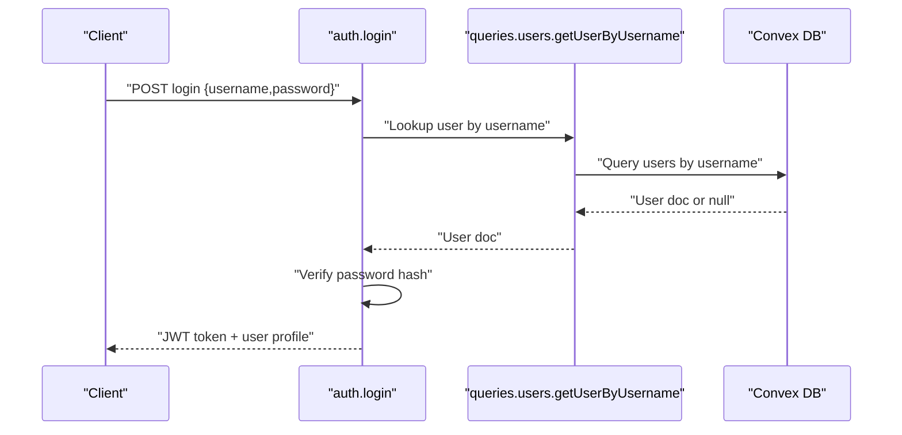
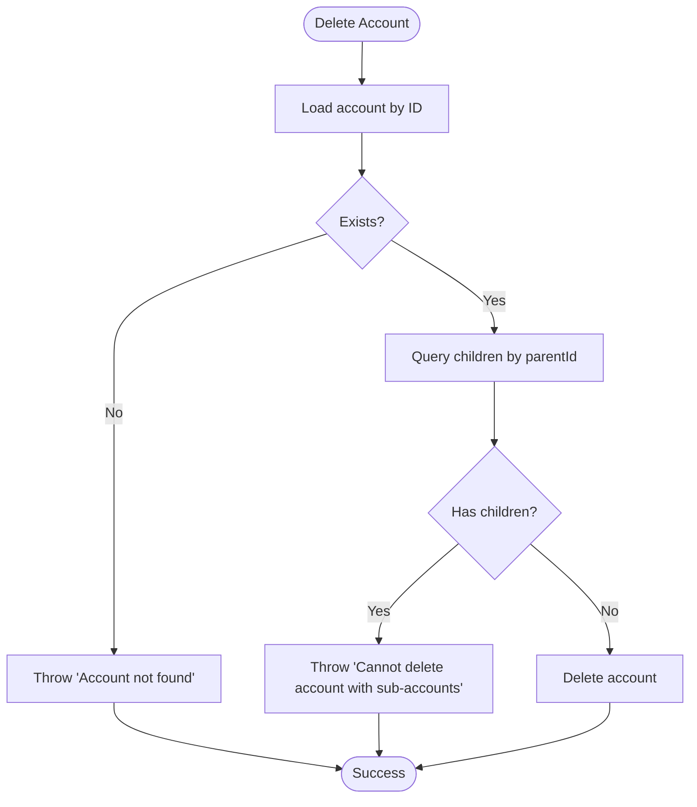
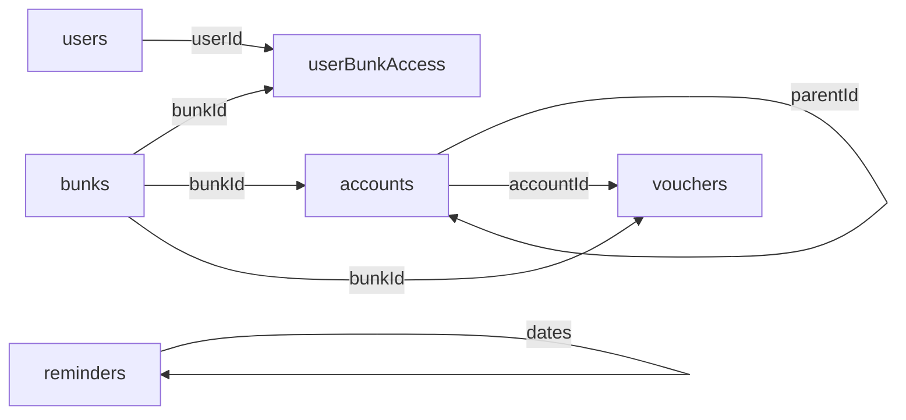

# Data Integrity & Constraints

<cite>
**Referenced Files in This Document**
- [schema.ts](file://convex/schema.ts)
- [dataModel.d.ts](file://convex/_generated/dataModel.d.ts)
- [accounts.ts](file://convex/mutations/accounts.ts)
- [bunks.ts](file://convex/mutations/bunks.ts)
- [users.ts](file://convex/mutations/users.ts)
- [vouchers.ts](file://convex/mutations/vouchers.ts)
- [reminders.ts](file://convex/mutations/reminders.ts)
- [auth.ts](file://convex/actions/auth.ts)
- [accounts.ts](file://convex/queries/accounts.ts)
- [bunks.ts](file://convex/queries/bunks.ts)
- [users.ts](file://convex/queries/users.ts)
- [vouchers.ts](file://convex/queries/vouchers.ts)
- [reminders.ts](file://convex/queries/reminders.ts)
</cite>

## Table of Contents
1. [Introduction](#introduction)
2. [Project Structure](#project-structure)
3. [Core Components](#core-components)
4. [Architecture Overview](#architecture-overview)
5. [Detailed Component Analysis](#detailed-component-analysis)
6. [Dependency Analysis](#dependency-analysis)
7. [Performance Considerations](#performance-considerations)
8. [Troubleshooting Guide](#troubleshooting-guide)
9. [Conclusion](#conclusion)

## Introduction
This document explains the data integrity mechanisms and business rules embedded in the KR-FUELS schema. It covers field-level validations, data types, constraints, unique indexes, referential integrity enforced via Convex’s type system, business rules such as mandatory fields and date formats, indexing strategies, and how the schema enforces consistency and prevents orphaned records. It also highlights atomic operation semantics and examples of constraint violations and their prevention.

## Project Structure
The schema defines six tables: bunks, users, userBunkAccess, accounts, vouchers, and reminders. Each table is defined with typed fields and indexes optimized for common query patterns. Mutations and queries enforce business rules and maintain referential integrity at the application boundary.

**Diagram sources**
- [schema.ts](file://convex/schema.ts#L13-L83)

**Section sources**
- [schema.ts](file://convex/schema.ts#L1-L85)

## Core Components
- bunks: Fuel station locations with a unique, indexed code and a location string. Indexed by code for fast lookup.
- users: Administrators with a unique, indexed username, role enum, and password hash. Indexed by username for login and lookup.
- userBunkAccess: Many-to-many junction between users and bunks, indexed for efficient filtering by user or bunk and combined user+bunk lookups.
- accounts: Hierarchical chart of accounts with self-referencing parent-child relationships, indexed by bunk and by parent to support hierarchy traversal and filtering.
- vouchers: Daily transactions with a date string in 'YYYY-MM-DD', foreign keys to accounts and bunks, and numeric debit/credit fields, indexed by bunk+date and by account.
- reminders: Task reminders with title, description, and two date fields in 'YYYY-MM-DD' format, indexed by due date and reminder date.

Key constraints and indexes:
- Unique indexes: username (users), code (bunks).
- Foreign keys: userBunkAccess.userId -> users._id, userBunkAccess.bunkId -> bunks._id, accounts.bunkId -> bunks._id, accounts.parentId -> accounts._id (self-reference), vouchers.accountId -> accounts._id, vouchers.bunkId -> bunks._id.
- Business rule enforcement: date formats validated in reminders; hierarchical deletion checks in accounts; cascading deletions in userBunkAccess and bunks.

**Section sources**
- [schema.ts](file://convex/schema.ts#L13-L83)
- [dataModel.d.ts](file://convex/_generated/dataModel.d.ts#L10-L61)

## Architecture Overview
The schema leverages Convex’s type system to enforce referential integrity. Foreign key types ensure that only valid document IDs can be inserted into relationship fields. Indexes enable efficient reads by common filters. Mutations and queries implement additional business rules and consistency checks.

**Diagram sources**
- [auth.ts](file://convex/actions/auth.ts#L31-L81)
- [users.ts](file://convex/queries/users.ts#L4-L12)

## Detailed Component Analysis

### bunks table
- Fields and types: name (string), code (string), location (string), createdAt (number).
- Unique/indexed constraints:
  - Unique index on code via index definition.
  - Index on code for fast lookups.
- Business rules:
  - Code must be unique; attempting to insert duplicates will fail at the index level.
- Referential integrity:
  - accounts.bunkId references bunks._id.
  - userBunkAccess.bunkId references bunks._id.
- Example constraint violation:
  - Inserting a bunk with an existing code triggers a unique constraint failure.
- Prevention:
  - Validate uniqueness before insert; use upsert patterns if supported by your client.

**Section sources**
- [schema.ts](file://convex/schema.ts#L13-L18)
- [bunks.ts](file://convex/mutations/bunks.ts#L4-L18)

### users table
- Fields and types: username (string), passwordHash (string), name (string), role (enum: admin, super_admin), createdAt (number).
- Unique/indexed constraints:
  - Unique index on username via index definition.
  - Index on username for login and lookup.
- Business rules:
  - Username must be unique.
  - Role must be one of the allowed literals.
- Referential integrity:
  - userBunkAccess.userId references users._id.
- Authentication flow:
  - Login action retrieves user by username, verifies password hash, and returns a signed JWT.
- Example constraint violation:
  - Creating a user with an existing username fails due to unique index.
- Prevention:
  - Check existence before creation; normalize username input.

**Section sources**
- [schema.ts](file://convex/schema.ts#L23-L29)
- [auth.ts](file://convex/actions/auth.ts#L31-L81)
- [users.ts](file://convex/mutations/users.ts#L13-L41)

### userBunkAccess junction
- Fields and types: userId (id of users), bunkId (id of bunks).
- Indexes:
  - by_user(userId)
  - by_bunk(bunkId)
  - by_user_and_bunk(userId, bunkId)
- Business rules:
  - Enforces many-to-many relationship between users and bunks.
  - Cascades on deletion: deleting a user removes their access rows; deleting a bunk removes access rows for that bunk.
- Referential integrity:
  - userId -> users._id
  - bunkId -> bunks._id
- Example constraint violation:
  - Inserting a row with a non-existent userId or bunkId fails due to foreign key type constraints.
- Prevention:
  - Validate IDs exist before insertion; use batch operations carefully.

**Section sources**
- [schema.ts](file://convex/schema.ts#L34-L40)
- [bunks.ts](file://convex/mutations/bunks.ts#L20-L36)
- [users.ts](file://convex/mutations/users.ts#L63-L80)

### accounts table (self-referencing hierarchy)
- Fields and types: name (string), parentId (optional id of accounts), openingDebit (number), openingCredit (number), bunkId (id of bunks), createdAt (number).
- Indexes:
  - by_bunk(bunkId)
  - by_parent(parentId)
- Business rules:
  - Self-referencing via parentId supports hierarchical organization under bunkId.
  - Deletion disallows removal of accounts that have children (no orphans).
- Referential integrity:
  - parentId -> accounts._id (self-reference)
  - bunkId -> bunks._id
- Example constraint violation:
  - Deleting an account with sub-accounts throws an error.
- Prevention:
  - Recursively delete children or reassign before deletion.

**Diagram sources**
- [accounts.ts](file://convex/mutations/accounts.ts#L45-L61)

**Section sources**
- [schema.ts](file://convex/schema.ts#L45-L54)
- [accounts.ts](file://convex/mutations/accounts.ts#L45-L61)

### vouchers table
- Fields and types: txnDate (string), accountId (id of accounts), debit (number), credit (number), description (string), bunkId (id of bunks), createdAt (number).
- Indexes:
  - by_bunk_and_date(bunkId, txnDate)
  - by_account(accountId)
- Business rules:
  - txnDate and dueDate must follow 'YYYY-MM-DD' format in related modules (enforced in reminders).
  - Debits and credits are numeric amounts; ensure mutual exclusivity at application level if required.
- Referential integrity:
  - accountId -> accounts._id
  - bunkId -> bunks._id
- Example constraint violation:
  - Inserting a voucher with a non-existent accountId or bunkId fails due to foreign key type constraints.
- Prevention:
  - Validate IDs exist before insert; ensure date strings match required format.

**Section sources**
- [schema.ts](file://convex/schema.ts#L59-L69)
- [vouchers.ts](file://convex/mutations/vouchers.ts#L4-L24)

### reminders table
- Fields and types: title (string), description (string), reminderDate (string), dueDate (string), createdBy (string), createdAt (number).
- Indexes:
  - by_due_date(dueDate)
  - by_reminder_date(reminderDate)
- Business rules:
  - Title is required (trimmed).
  - reminderDate and dueDate must be in 'YYYY-MM-DD' format; otherwise, mutation throws an error.
- Example constraint violation:
  - Passing an invalid date format for reminderDate or dueDate triggers a validation error.
- Prevention:
  - Validate date format on the client or action layer; enforce trimming of title/description.

**Section sources**
- [schema.ts](file://convex/schema.ts#L74-L83)
- [reminders.ts](file://convex/mutations/reminders.ts#L12-L48)

## Dependency Analysis
The schema enforces referential integrity through typed foreign key fields. Mutations and queries implement additional business rules and cascading deletes. Authentication actions depend on users and userBunkAccess to authorize access to bunks.

**Diagram sources**
- [schema.ts](file://convex/schema.ts#L13-L83)

**Section sources**
- [schema.ts](file://convex/schema.ts#L13-L83)
- [users.ts](file://convex/mutations/users.ts#L32-L37)
- [bunks.ts](file://convex/mutations/bunks.ts#L25-L32)

## Performance Considerations
- Index selection:
  - bunks: code index for fast lookup by bunk code.
  - users: username index for login and user lookup.
  - userBunkAccess: separate indices per column and composite index for user+bunk joins.
  - accounts: by_bunk and by_parent indices to filter by location and traverse hierarchy efficiently.
  - vouchers: composite index by bunk+date to support daily rollups and date-range queries; account index for transaction history.
  - reminders: dueDate and reminderDate indices for overdue/upcoming filtering.
- Query patterns:
  - Use withIndex(...) in queries to leverage single-column or composite indexes.
  - Prefer equality filters on indexed fields for optimal performance.
- Atomicity:
  - Mutations operate atomically within a single function; cross-document consistency requires careful ordering and error handling.

[No sources needed since this section provides general guidance]

## Troubleshooting Guide
Common constraint violations and prevention strategies:
- Unique constraint failures:
  - Duplicate username: Ensure username does not exist before creating a user.
  - Duplicate bunk code: Ensure code is unique before inserting a bunk.
- Foreign key type errors:
  - Non-existent userId or bunkId in userBunkAccess: Validate IDs exist prior to insert.
  - Non-existent accountId or bunkId in vouchers: Validate IDs exist prior to insert.
- Hierarchical deletion errors:
  - Attempting to delete an account with sub-accounts: Recursively delete children or reassign parentId.
- Date format errors:
  - Invalid 'YYYY-MM-DD' in reminders: Validate and normalize dates before insert/update.

Operational tips:
- Use queries with explicit indexes (e.g., by_username, by_code, by_bunk_and_date) to avoid full scans.
- For bulk inserts/deletes, batch operations while preserving referential integrity.

**Section sources**
- [users.ts](file://convex/mutations/users.ts#L13-L41)
- [bunks.ts](file://convex/mutations/bunks.ts#L20-L36)
- [accounts.ts](file://convex/mutations/accounts.ts#L45-L61)
- [reminders.ts](file://convex/mutations/reminders.ts#L23-L34)

## Conclusion
The KR-FUELS schema enforces robust data integrity through typed foreign keys, unique indexes, and targeted business rule validations. Convex’s type system prevents orphaned records and invalid relationships at the schema level, while mutations and queries add application-layer safeguards such as hierarchical checks, cascading deletes, and strict date format enforcement. Proper indexing aligns with common query patterns, ensuring performance and scalability.