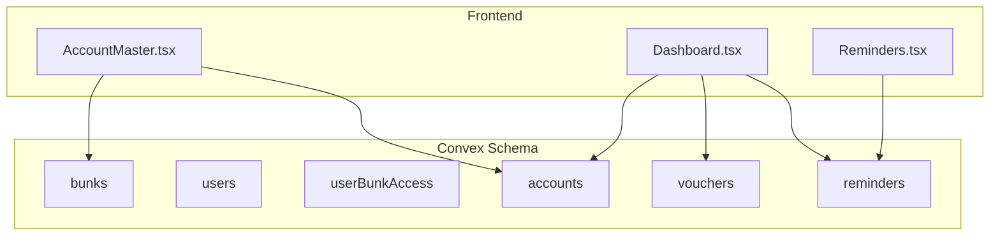
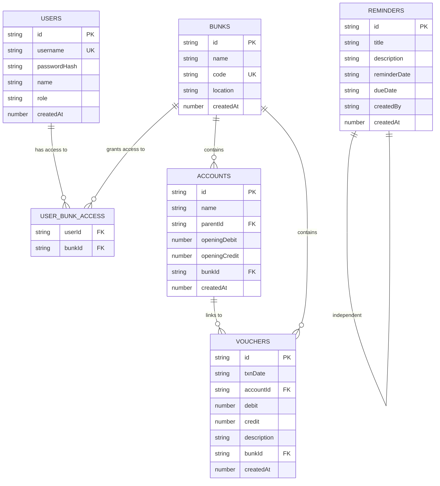
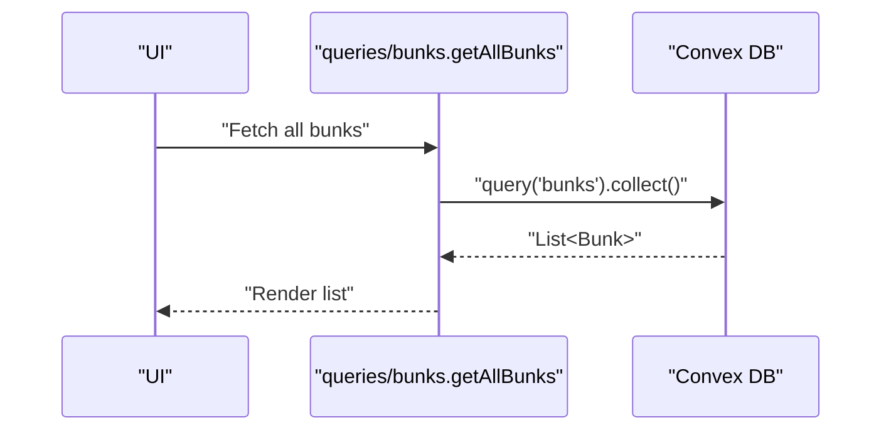
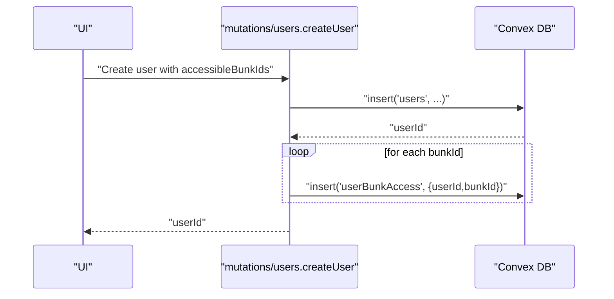
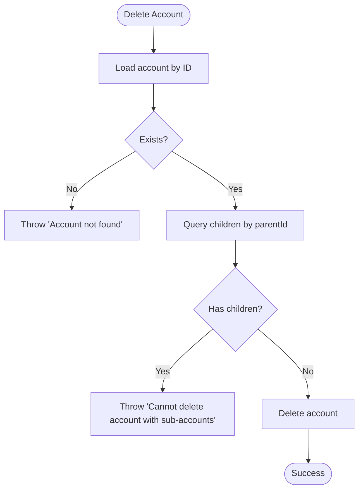
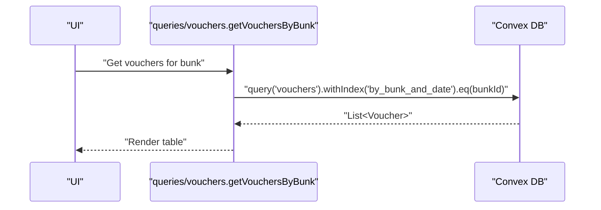
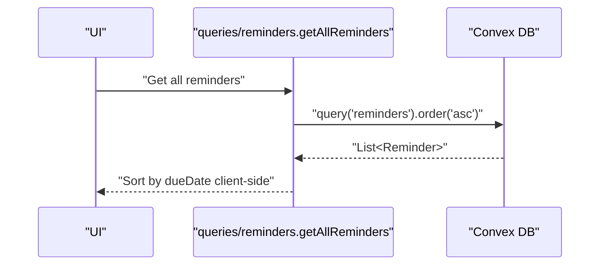
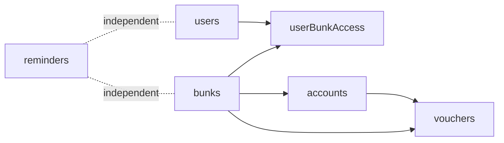

# Database Schema

<cite>
**Referenced Files in This Document**
- [schema.ts](file://convex/schema.ts)
- [accounts.ts](file://convex/mutations/accounts.ts)
- [bunks.ts](file://convex/mutations/bunks.ts)
- [users.ts](file://convex/mutations/users.ts)
- [vouchers.ts](file://convex/mutations/vouchers.ts)
- [reminders.ts](file://convex/mutations/reminders.ts)
- [accounts.ts](file://convex/queries/accounts.ts)
- [bunks.ts](file://convex/queries/bunks.ts)
- [users.ts](file://convex/queries/users.ts)
- [vouchers.ts](file://convex/queries/vouchers.ts)
- [reminders.ts](file://convex/queries/reminders.ts)
- [AccountMaster.tsx](file://apps/pages/AccountMaster.tsx)
- [Dashboard.tsx](file://apps/pages/Dashboard.tsx)
- [Reminders.tsx](file://apps/pages/Reminders.tsx)
- [types.ts](file://apps/types.ts)
</cite>

## Table of Contents
1. [Introduction](#introduction)
2. [Project Structure](#project-structure)
3. [Core Components](#core-components)
4. [Architecture Overview](#architecture-overview)
5. [Detailed Component Analysis](#detailed-component-analysis)
6. [Dependency Analysis](#dependency-analysis)
7. [Performance Considerations](#performance-considerations)
8. [Troubleshooting Guide](#troubleshooting-guide)
9. [Conclusion](#conclusion)
10. [Appendices](#appendices)

## Introduction
This document describes the database schema for KR-FUELS, implemented with Convex. It covers six main logical collections: bunks, users, userBunkAccess (many-to-many), accounts (self-referencing hierarchy), vouchers (daily transactions), and reminders. It explains field definitions, data types, indexes, relationships, integrity constraints, and business logic embedded in the schema. It also documents data access patterns, query optimization strategies, and operational considerations such as data lifecycle, backups, and migrations.

## Project Structure
The schema is defined declaratively in Convex and complemented by typed frontend components and page-level views that consume the data.

**Diagram sources**
- [schema.ts](file://convex/schema.ts#L9-L84)
- [AccountMaster.tsx](file://apps/pages/AccountMaster.tsx#L1-L228)
- [Dashboard.tsx](file://apps/pages/Dashboard.tsx#L1-L219)
- [Reminders.tsx](file://apps/pages/Reminders.tsx#L1-L388)

**Section sources**
- [schema.ts](file://convex/schema.ts#L1-L85)
- [types.ts](file://apps/types.ts#L1-L56)

## Core Components
This section defines each collection, its fields, data types, and constraints.

- bunks
  - Purpose: Fuel station locations.
  - Fields:
    - name: string
    - code: string (unique, indexed)
    - location: string
    - createdAt: number (Unix ms)
  - Indexes: by_code(code)

- users
  - Purpose: Administrators and super-admins.
  - Fields:
    - username: string (unique, indexed)
    - passwordHash: string (bcrypt hash)
    - name: string
    - role: union of "admin" | "super_admin"
    - createdAt: number (Unix ms)
  - Indexes: by_username(username)

- userBunkAccess (junction table)
  - Purpose: Location-specific access control for users.
  - Fields:
    - userId: id("users")
    - bunkId: id("bunks")
  - Indexes: by_user(userId), by_bunk(bunkId), by_user_and_bunk(userId,bunkId)

- accounts (chart of accounts)
  - Purpose: Hierarchical ledger structure per location.
  - Fields:
    - name: string
    - parentId: optional id("accounts") (self-reference)
    - openingDebit: number
    - openingCredit: number
    - bunkId: id("bunks")
    - createdAt: number (Unix ms)
  - Indexes: by_bunk(bunkId), by_parent(parentId)

- vouchers (daily transactions)
  - Purpose: Daily transaction entries linked to accounts and locations.
  - Fields:
    - txnDate: string (ISO-like "YYYY-MM-DD")
    - accountId: id("accounts")
    - debit: number
    - credit: number
    - description: string
    - bunkId: id("bunks")
    - createdAt: number (Unix ms)
  - Indexes: by_bunk_and_date(bunkId,txnDate), by_account(accountId)

- reminders
  - Purpose: Task and reminder items.
  - Fields:
    - title: string
    - description: string
    - reminderDate: string (ISO "YYYY-MM-DD")
    - dueDate: string (ISO "YYYY-MM-DD")
    - createdBy: string (username)
    - createdAt: number (Unix ms)
  - Indexes: by_due_date(dueDate), by_reminder_date(reminderDate)

Constraints and validation observed in mutations/queries:
- Unique constraints enforced via indexes (code, username).
- Self-referencing constraint via optional parentId in accounts.
- Referential integrity enforced by Convex through typed IDs and index usage.
- Business rules validated in mutations (e.g., account deletion disallows children, voucher updates require existence, user creation grants access via junction table).

**Section sources**
- [schema.ts](file://convex/schema.ts#L13-L83)
- [users.ts](file://convex/mutations/users.ts#L13-L41)
- [accounts.ts](file://convex/mutations/accounts.ts#L4-L62)
- [vouchers.ts](file://convex/mutations/vouchers.ts#L4-L58)
- [reminders.ts](file://convex/mutations/reminders.ts#L12-L47)

## Architecture Overview
The schema enforces location-scoped access control via a many-to-many relationship between users and bunks. Accounts are hierarchical and scoped to a bunk. Vouchers link to accounts and are scoped to a bunk. Reminders are independent of locations but support date-based filtering.

**Diagram sources**
- [schema.ts](file://convex/schema.ts#L13-L83)

## Detailed Component Analysis

### Bunks
- Purpose: Store fuel station metadata.
- Access patterns:
  - Read all bunks via query.
- Integrity:
  - code is unique and indexed.
- Typical operations:
  - Create bunk.
  - Delete bunk cascades removal of associated userBunkAccess records.

**Diagram sources**
- [bunks.ts](file://convex/queries/bunks.ts#L11-L15)

**Section sources**
- [schema.ts](file://convex/schema.ts#L13-L18)
- [bunks.ts](file://convex/mutations/bunks.ts#L4-L37)
- [bunks.ts](file://convex/queries/bunks.ts#L11-L15)

### Users and Location Access Control
- Purpose: Manage administrators and enforce location-specific access.
- Access patterns:
  - Lookup user by username (unique).
  - List user’s accessible bunks via junction table.
- Integrity:
  - username is unique and indexed.
  - Access granted via userBunkAccess records.
- Typical operations:
  - Create user with array of bunk IDs; inserts junction records.
  - Update password.
  - Delete user removes junction records then user.

**Diagram sources**
- [users.ts](file://convex/mutations/users.ts#L13-L41)

**Section sources**
- [schema.ts](file://convex/schema.ts#L23-L39)
- [users.ts](file://convex/mutations/users.ts#L13-L81)
- [users.ts](file://convex/queries/users.ts#L4-L34)

### Accounts (Hierarchical Chart of Accounts)
- Purpose: Hierarchical ledger groups and subgroups per location.
- Access patterns:
  - List accounts by bunk.
  - Retrieve all accounts.
- Integrity:
  - Self-referencing via optional parentId.
  - Indexed by bunk and parent for efficient traversal.
- Typical operations:
  - Create account with optional parentId.
  - Update account details.
  - Delete account disallows deletion if it has children.

**Diagram sources**
- [accounts.ts](file://convex/mutations/accounts.ts#L45-L62)

**Section sources**
- [schema.ts](file://convex/schema.ts#L45-L54)
- [accounts.ts](file://convex/mutations/accounts.ts#L4-L62)
- [accounts.ts](file://convex/queries/accounts.ts#L4-L18)

### Vouchers (Daily Transactions)
- Purpose: Daily transaction entries linked to accounts and locations.
- Access patterns:
  - List vouchers by bunk.
  - Retrieve all vouchers.
- Integrity:
  - Indexed by bunk+date and account for fast lookup.
- Typical operations:
  - Create voucher.
  - Update voucher (requires existing).
  - Delete voucher.

**Diagram sources**
- [vouchers.ts](file://convex/queries/vouchers.ts#L4-L12)

**Section sources**
- [schema.ts](file://convex/schema.ts#L59-L69)
- [vouchers.ts](file://convex/mutations/vouchers.ts#L4-L58)
- [vouchers.ts](file://convex/queries/vouchers.ts#L4-L18)

### Reminders
- Purpose: Task and reminder items with date-based filtering.
- Access patterns:
  - List all reminders.
  - Compute upcoming and overdue sets client-side using date filters.
- Integrity:
  - Indexed by dueDate and reminderDate for efficient filtering.
- Validation:
  - Mutations enforce non-empty title and ISO date formats.

**Diagram sources**
- [reminders.ts](file://convex/queries/reminders.ts#L12-L26)

**Section sources**
- [schema.ts](file://convex/schema.ts#L74-L83)
- [reminders.ts](file://convex/mutations/reminders.ts#L12-L47)
- [reminders.ts](file://convex/queries/reminders.ts#L12-L70)

### Frontend Usage Patterns
- AccountMaster.tsx
  - Uses Account model and supports creating/updating accounts with optional parentId.
  - Integrates with hierarchy dropdown for parent selection.
- Dashboard.tsx
  - Computes daily totals and balances using accounts and vouchers.
  - Filters vouchers by selected date and aggregates activity by parent account.
- Reminders.tsx
  - Lists reminders and computes stats for active/upcoming/due-today.

**Section sources**
- [AccountMaster.tsx](file://apps/pages/AccountMaster.tsx#L16-L75)
- [Dashboard.tsx](file://apps/pages/Dashboard.tsx#L50-L81)
- [Reminders.tsx](file://apps/pages/Reminders.tsx#L39-L86)
- [types.ts](file://apps/types.ts#L17-L55)

## Dependency Analysis
Relationships and dependencies among collections:

- users ↔ userBunkAccess: many-to-many via junction table.
- bunks → accounts: one-to-many (per location).
- accounts → vouchers: one-to-many (per account).
- bunks → vouchers: one-to-many (per location).
- reminders: independent of other collections.

**Diagram sources**
- [schema.ts](file://convex/schema.ts#L13-L83)

**Section sources**
- [schema.ts](file://convex/schema.ts#L13-L83)

## Performance Considerations
Indexing strategy and query optimization:
- bunks: by_code(code) — constant-time lookup by code.
- users: by_username(username) — constant-time lookup by username.
- userBunkAccess: by_user(userId), by_bunk(bunkId), by_user_and_bunk(userId,bunkId) — efficient joins and filtering by user or bunk.
- accounts: by_bunk(bunkId), by_parent(parentId) — efficient per-location retrieval and hierarchy scans.
- vouchers: by_bunk_and_date(bunkId,txnDate), by_account(accountId) — efficient per-location and per-account queries.
- reminders: by_due_date(dueDate), by_reminder_date(reminderDate) — efficient overdue and upcoming computations.

Query optimization tips:
- Prefer index-backed filters (e.g., filter by bunkId, userId, or accountId).
- Use composite indexes (e.g., bunkId+txnDate) to avoid scanning entire tables.
- Minimize client-side sorting when server-side ordering is sufficient (as seen with reminders.getAllReminders).
- For hierarchical traversal, leverage by_parent index to build trees efficiently.

[No sources needed since this section provides general guidance]

## Troubleshooting Guide
Common issues and resolutions:
- Duplicate username or code:
  - Symptom: Insertion fails due to uniqueness.
  - Resolution: Ensure unique values; rely on indexes for enforcement.
- Deleting account with children:
  - Symptom: Mutation throws an error.
  - Resolution: Move or delete child accounts first.
- Updating/deleting non-existent records:
  - Symptom: Errors thrown for missing IDs.
  - Resolution: Check existence before update/delete or handle errors gracefully.
- Reminder date validation:
  - Symptom: Errors for invalid date formats.
  - Resolution: Ensure "YYYY-MM-DD" format on client and server.

**Section sources**
- [accounts.ts](file://convex/mutations/accounts.ts#L45-L62)
- [vouchers.ts](file://convex/mutations/vouchers.ts#L36-L57)
- [reminders.ts](file://convex/mutations/reminders.ts#L23-L34)

## Conclusion
The KR-FUELS schema organizes business data around locations (bunks), users with scoped access, a hierarchical chart of accounts, daily transactions, and reminders. Strong indexing and typed IDs enable efficient queries and maintain referential integrity. The frontend components demonstrate practical usage patterns for accounts, dashboards, and reminders, while mutations embed essential business rules such as access control and account hierarchy constraints.

[No sources needed since this section summarizes without analyzing specific files]

## Appendices

### Field Reference and Data Types
- bunks: name(string), code(string, unique), location(string), createdAt(number)
- users: username(string, unique), passwordHash(string), name(string), role(literal union), createdAt(number)
- userBunkAccess: userId(id), bunkId(id)
- accounts: name(string), parentId(optional id), openingDebit(number), openingCredit(number), bunkId(id), createdAt(number)
- vouchers: txnDate(string), accountId(id), debit(number), credit(number), description(string), bunkId(id), createdAt(number)
- reminders: title(string), description(string), reminderDate(string), dueDate(string), createdBy(string), createdAt(number)

**Section sources**
- [schema.ts](file://convex/schema.ts#L13-L83)
- [types.ts](file://apps/types.ts#L2-L55)

### Example Query Patterns
- Get all bunks
  - Source: [bunks.ts](file://convex/queries/bunks.ts#L11-L15)
- Get user by username
  - Source: [users.ts](file://convex/queries/users.ts#L4-L11)
- Get user’s accessible bunks
  - Source: [users.ts](file://convex/queries/users.ts#L14-L22)
- Get accounts by bunk
  - Source: [accounts.ts](file://convex/queries/accounts.ts#L4-L12)
- Get vouchers by bunk
  - Source: [vouchers.ts](file://convex/queries/vouchers.ts#L4-L12)
- Get all reminders
  - Source: [reminders.ts](file://convex/queries/reminders.ts#L12-L26)
- Get upcoming reminders (client-side filtered)
  - Source: [reminders.ts](file://convex/queries/reminders.ts#L33-L49)
- Get overdue reminders (client-side filtered)
  - Source: [reminders.ts](file://convex/queries/reminders.ts#L56-L69)

**Section sources**
- [bunks.ts](file://convex/queries/bunks.ts#L11-L15)
- [users.ts](file://convex/queries/users.ts#L4-L34)
- [accounts.ts](file://convex/queries/accounts.ts#L4-L18)
- [vouchers.ts](file://convex/queries/vouchers.ts#L4-L18)
- [reminders.ts](file://convex/queries/reminders.ts#L12-L70)

### Data Lifecycle, Backups, and Migration
- Data lifecycle:
  - Creation timestamps stored as createdAt (Unix ms) for auditability.
  - Deletion cascades through junction table cleanup (users and bunks).
- Backups:
  - Convex provides managed persistence; consult platform documentation for backup policies.
- Migrations:
  - Add new indexes or fields via defineTable and re-run schema generation.
  - For breaking changes, introduce new tables and phased data copy strategies.

[No sources needed since this section provides general guidance]