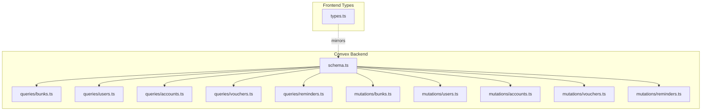
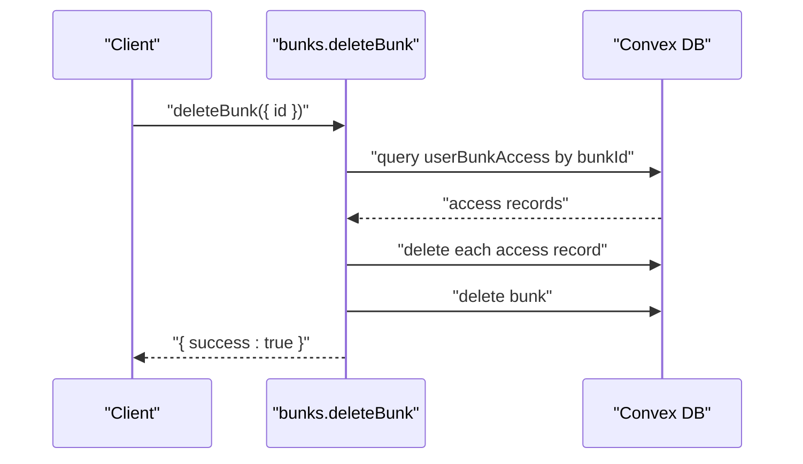
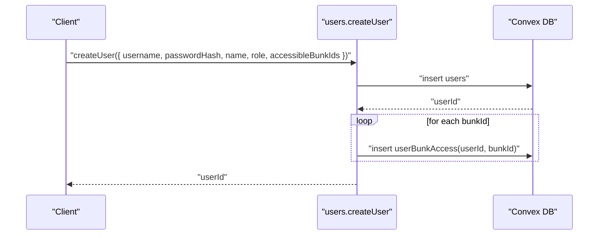
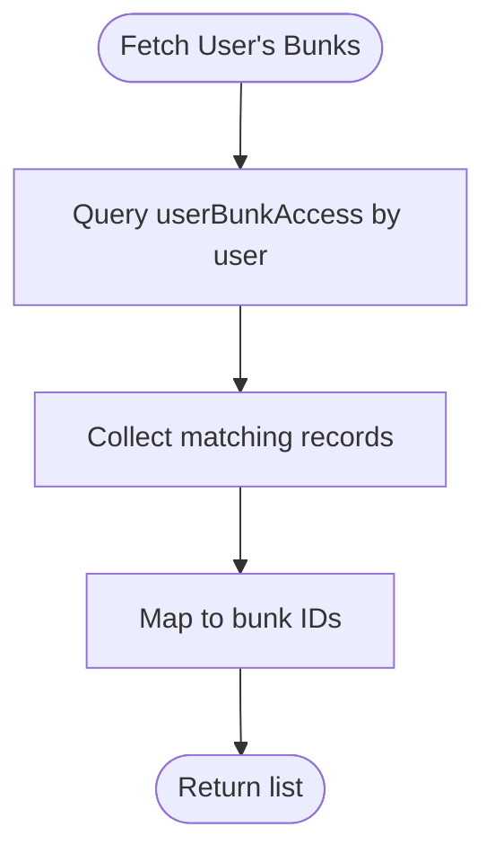
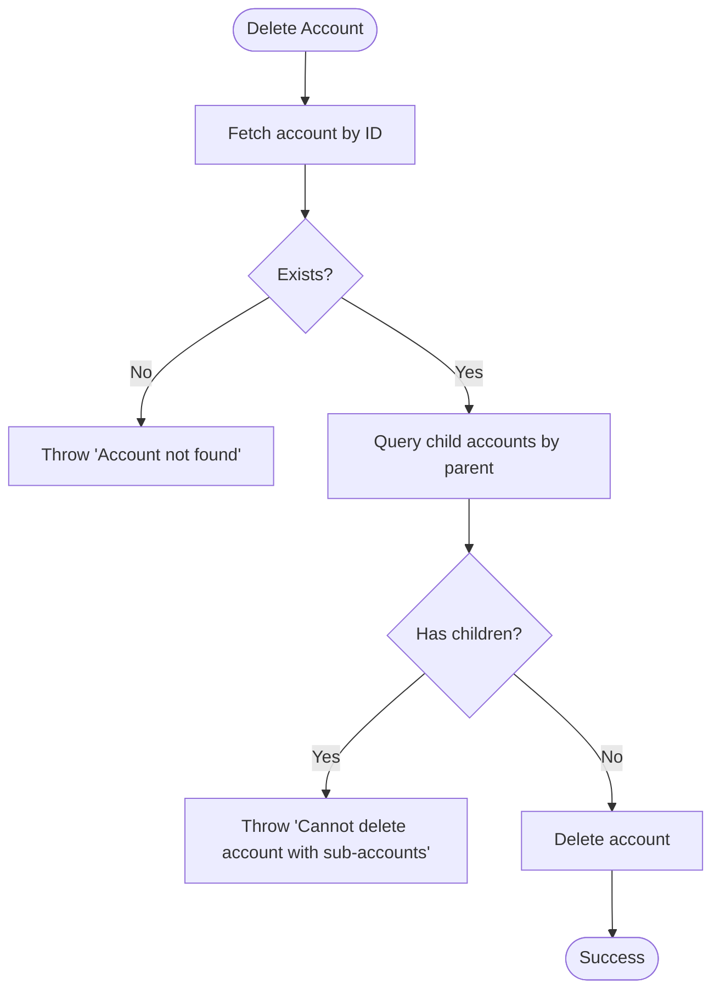
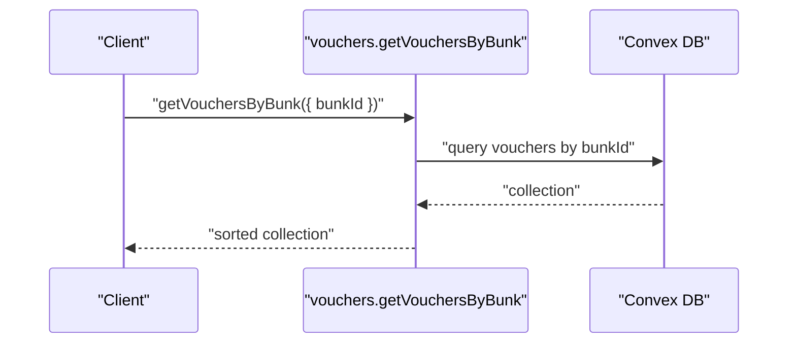
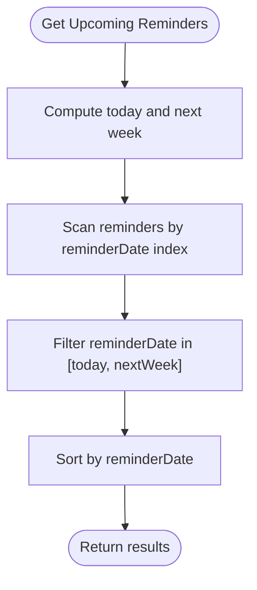
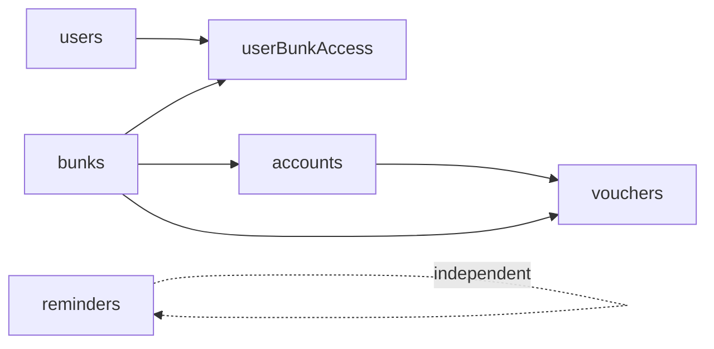

# Schema Overview

<cite>
**Referenced Files in This Document**
- [schema.ts](file://convex/schema.ts)
- [bunks.ts](file://convex/mutations/bunks.ts)
- [users.ts](file://convex/mutations/users.ts)
- [accounts.ts](file://convex/mutations/accounts.ts)
- [vouchers.ts](file://convex/mutations/vouchers.ts)
- [reminders.ts](file://convex/mutations/reminders.ts)
- [bunks.ts](file://convex/queries/bunks.ts)
- [users.ts](file://convex/queries/users.ts)
- [accounts.ts](file://convex/queries/accounts.ts)
- [vouchers.ts](file://convex/queries/vouchers.ts)
- [reminders.ts](file://convex/queries/reminders.ts)
- [types.ts](file://apps/types.ts)
- [README.md](file://README.md)
</cite>

## Table of Contents
1. [Introduction](#introduction)
2. [Project Structure](#project-structure)
3. [Core Components](#core-components)
4. [Architecture Overview](#architecture-overview)
5. [Detailed Component Analysis](#detailed-component-analysis)
6. [Dependency Analysis](#dependency-analysis)
7. [Performance Considerations](#performance-considerations)
8. [Migration Considerations](#migration-considerations)
9. [Troubleshooting Guide](#troubleshooting-guide)
10. [Conclusion](#conclusion)

## Introduction
This document provides a comprehensive schema overview for the KR-FUELS database design, focusing on the six-collection architecture that supports a multi-location fuel station accounting system. The schema defines the collections for bunks (locations), users, user-bunk access, accounts (chart of accounts), vouchers (daily transactions), and reminders. It explains the design philosophy behind migrating from a traditional relational model to Convex’s serverless, document-based architecture, and details the indexing strategy that enables efficient reads and writes across the collections.

## Project Structure
The backend is implemented in Convex, with schema definitions, typed queries, and typed mutations organized under the convex directory. Frontend TypeScript types mirror the backend entities to ensure type safety across the stack. The repository includes a minimal README for local development.



**Diagram sources**
- [schema.ts](file://convex/schema.ts#L1-L85)
- [bunks.ts](file://convex/queries/bunks.ts#L1-L16)
- [users.ts](file://convex/queries/users.ts#L1-L35)
- [accounts.ts](file://convex/queries/accounts.ts#L1-L19)
- [vouchers.ts](file://convex/queries/vouchers.ts#L1-L19)
- [reminders.ts](file://convex/queries/reminders.ts#L1-L71)
- [bunks.ts](file://convex/mutations/bunks.ts#L1-L37)
- [users.ts](file://convex/mutations/users.ts#L1-L81)
- [accounts.ts](file://convex/mutations/accounts.ts#L1-L63)
- [vouchers.ts](file://convex/mutations/vouchers.ts#L1-L59)
- [reminders.ts](file://convex/mutations/reminders.ts#L1-L116)
- [types.ts](file://apps/types.ts#L1-L56)

**Section sources**
- [README.md](file://README.md#L1-L13)
- [schema.ts](file://convex/schema.ts#L1-L85)

## Core Components
This section describes each collection, its purpose, and how it fits into the overall system.

- Bunks
  - Purpose: Represents fuel station locations with unique codes and geographic details.
  - Key fields: name, code (unique), location, createdAt.
  - Indexes: by_code on code.
  - Typical operations: create, delete, list.

- Users
  - Purpose: Stores administrative users with roles and credentials.
  - Key fields: username (unique), passwordHash, name, role, createdAt.
  - Indexes: by_username on username.
  - Typical operations: create, update password, delete; lookup by username.

- User-Bunk Access (Junction)
  - Purpose: Manages many-to-many access between users and bunks.
  - Key fields: userId, bunkId.
  - Indexes: by_user, by_bunk, by_user_and_bunk.
  - Typical operations: grant/revoke access; fetch user’s bunks; bulk cleanup on delete.

- Accounts (Chart of Accounts)
  - Purpose: Hierarchical chart of accounts per location (self-referencing via parentId).
  - Key fields: name, parentId (optional), openingDebit, openingCredit, bunkId, createdAt.
  - Indexes: by_bunk, by_parent.
  - Typical operations: create, update, delete with child-account checks; list by location.

- Vouchers (Daily Transactions)
  - Purpose: Daily transaction entries linked to accounts and locations.
  - Key fields: txnDate, accountId, debit, credit, description, bunkId, createdAt.
  - Indexes: by_bunk_and_date (composite), by_account.
  - Typical operations: create, update, delete; list by location/date.

- Reminders
  - Purpose: Task and reminder items with reminder and due dates.
  - Key fields: title, description, reminderDate, dueDate, createdBy, createdAt.
  - Indexes: by_due_date, by_reminder_date.
  - Typical operations: create, update, delete; list all; upcoming and overdue filters.

**Section sources**
- [schema.ts](file://convex/schema.ts#L11-L83)
- [types.ts](file://apps/types.ts#L2-L56)

## Architecture Overview
The system follows a document-based, serverless architecture centered around Convex. Collections are modeled as documents with explicit indexes to optimize frequent queries. The design emphasizes:
- Atomic mutations for write operations.
- Typed queries and mutations for type safety.
- Strategic composite and single-field indexes to accelerate reads.
- Clear separation of concerns: bunks for locations, users for identities, junction for access, accounts for ledger structure, vouchers for transactions, reminders for tasks.

```mermaid
erDiagram
BUNKS {
string id PK
string name
string code UK
string location
number createdAt
}
USERS {
string id PK
string username UK
string passwordHash
string name
enum role
number createdAt
}
USER_BUNK_ACCESS {
string id PK
string userId FK
string bunkId FK
}
ACCOUNTS {
string id PK
string name
string parentId FK
number openingDebit
number openingCredit
string bunkId FK
number createdAt
}
VOUCHERS {
string id PK
string txnDate
string accountId FK
number debit
number credit
string description
string bunkId FK
number createdAt
}
REMINDERS {
string id PK
string title
string description
string reminderDate
string dueDate
string createdBy
number createdAt
}
BUNKS ||--o{ USER_BUNK_ACCESS : "has access"
USERS ||--o{ USER_BUNK_ACCESS : "grants access"
BUNKS ||--o{ ACCOUNTS : "contains"
ACCOUNTS ||--o{ VOUCHERS : "records transactions"
BUNKS ||--o{ VOUCHERS : "hosts transactions"
REMINDERS <|.. REMINDERS : "self-managed"
```

**Diagram sources**
- [schema.ts](file://convex/schema.ts#L11-L83)
- [types.ts](file://apps/types.ts#L2-L56)

## Detailed Component Analysis

### Bunks Collection
Purpose: Centralize fuel station location data with unique identification and timestamps.
Key operations:
- Create bunk inserts a document with name, code, location, and createdAt.
- Delete bunk removes the bunk and cascades deletion of associated user-bunk access records.



**Diagram sources**
- [bunks.ts](file://convex/mutations/bunks.ts#L20-L37)

**Section sources**
- [schema.ts](file://convex/schema.ts#L11-L18)
- [bunks.ts](file://convex/mutations/bunks.ts#L1-L37)

### Users Collection
Purpose: Manage administrative users with role-based access and credential hashing.
Key operations:
- Create user inserts a user document and grants access to selected bunks via junction records.
- Update password patches the passwordHash field.
- Delete user removes all associated access records before deleting the user.



**Diagram sources**
- [users.ts](file://convex/mutations/users.ts#L13-L41)

**Section sources**
- [schema.ts](file://convex/schema.ts#L21-L29)
- [users.ts](file://convex/mutations/users.ts#L1-L81)

### User-Bunk Access (Junction)
Purpose: Enable many-to-many relationships between users and bunks.
Indexes: by_user, by_bunk, by_user_and_bunk.
Queries: fetch access records by user or by bunk; list all access.



**Diagram sources**
- [users.ts](file://convex/queries/users.ts#L14-L22)

**Section sources**
- [schema.ts](file://convex/schema.ts#L32-L40)
- [users.ts](file://convex/queries/users.ts#L1-L35)

### Accounts (Chart of Accounts)
Purpose: Hierarchical ledger structure per location with opening balances.
Indexes: by_bunk, by_parent.
Constraints: Prevent deletion of an account that has child accounts.



**Diagram sources**
- [accounts.ts](file://convex/mutations/deleteAccount)

**Section sources**
- [schema.ts](file://convex/schema.ts#L43-L54)
- [accounts.ts](file://convex/mutations/accounts.ts#L1-L63)

### Vouchers (Daily Transactions)
Purpose: Record daily financial transactions against accounts, with location scoping.
Indexes: by_bunk_and_date (composite), by_account.
Queries: list vouchers by bunk; order by date for reporting.



**Diagram sources**
- [vouchers.ts](file://convex/queries/vouchers.ts#L4-L12)

**Section sources**
- [schema.ts](file://convex/schema.ts#L57-L69)
- [vouchers.ts](file://convex/queries/vouchers.ts#L1-L19)

### Reminders
Purpose: Track tasks and reminders with reminderDate and dueDate.
Indexes: by_due_date, by_reminder_date.
Queries: list all, upcoming (next 7 days), overdue.



**Diagram sources**
- [reminders.ts](file://convex/queries/reminders.ts#L33-L49)

**Section sources**
- [schema.ts](file://convex/schema.ts#L72-L83)
- [reminders.ts](file://convex/queries/reminders.ts#L1-L71)

## Dependency Analysis
This section maps how collections depend on each other and how queries/mutations traverse relationships.



**Diagram sources**
- [schema.ts](file://convex/schema.ts#L11-L83)

**Section sources**
- [schema.ts](file://convex/schema.ts#L11-L83)

## Performance Considerations
Indexing strategy and performance optimizations:
- Single-field indexes
  - bunks.by_code: fast lookup by unique code.
  - users.by_username: fast lookup by unique username.
  - userBunkAccess.by_user, by_bunk: efficient access control queries.
  - accounts.by_bunk: filter accounts by location.
  - accounts.by_parent: navigate hierarchy efficiently.
  - vouchers.by_account: locate all transactions for an account.
  - reminders.by_due_date, by_reminder_date: filter overdue and upcoming reminders.
- Composite indexes
  - userBunkAccess.by_user_and_bunk: unique access checks and joins.
  - vouchers.by_bunk_and_date: efficient date-range scans per location.
- Atomic mutations
  - Ensures consistency during multi-step operations (e.g., user creation and access grants).
- Query ordering and filtering
  - Vouchers and reminders queries sort/filter client-side after index-backed scans to minimize server load.

**Section sources**
- [schema.ts](file://convex/schema.ts#L11-L83)
- [users.ts](file://convex/mutations/users.ts#L13-L41)
- [bunks.ts](file://convex/mutations/bunks.ts#L20-L37)
- [accounts.ts](file://convex/mutations/accounts.ts#L45-L61)
- [vouchers.ts](file://convex/queries/vouchers.ts#L4-L12)
- [reminders.ts](file://convex/queries/reminders.ts#L33-L69)

## Migration Considerations
Design philosophy and rationale for moving from PostgreSQL to Convex:
- Document-first modeling
  - Collections are modeled as documents with explicit indexes, aligning with Convex’s document store paradigm.
- Atomicity and consistency
  - Mutations are atomic, preventing partial writes and simplifying transactional logic.
- Typed APIs
  - Queries and mutations are strongly typed, reducing runtime errors and improving developer experience.
- Index-driven performance
  - Strategic single-field and composite indexes enable efficient reads without expensive joins.
- Reduced operational overhead
  - Serverless execution eliminates database administration tasks, scaling automatically with workload.
- Relationship modeling
  - Foreign keys are represented as string IDs with indexes, avoiding joins while preserving referential integrity through application logic.

[No sources needed since this section provides general guidance]

## Troubleshooting Guide
Common issues and resolutions:
- Duplicate username or code
  - Symptom: Insertion fails due to uniqueness constraint.
  - Resolution: Ensure unique usernames and codes before insert; verify by_index lookups.
- Access denied
  - Symptom: User cannot access a bunk.
  - Resolution: Verify userBunkAccess records exist for the user-bunk pair.
- Cannot delete account with sub-accounts
  - Symptom: Deletion throws an error.
  - Resolution: Move or delete child accounts first.
- Voucher date mismatch
  - Symptom: Unexpected results when filtering by date.
  - Resolution: Use the by_bunk_and_date index and ensure date format matches the stored string format.
- Reminder date validation
  - Symptom: Validation errors on create/update.
  - Resolution: Ensure reminderDate and dueDate follow the 'YYYY-MM-DD' format.

**Section sources**
- [users.ts](file://convex/mutations/users.ts#L13-L41)
- [bunks.ts](file://convex/mutations/bunks.ts#L20-L37)
- [accounts.ts](file://convex/mutations/accounts.ts#L45-L61)
- [vouchers.ts](file://convex/queries/vouchers.ts#L4-L12)
- [reminders.ts](file://convex/queries/reminders.ts#L33-L69)

## Conclusion
The KR-FUELS schema leverages Convex’s document model and indexing capabilities to build a scalable, type-safe, and operationally simple backend for a multi-location fuel station accounting system. The six-collection design cleanly separates identity, access control, ledger structure, transactions, and task management, while strategic indexes ensure high-performance reads. The migration from PostgreSQL embraces a serverless, document-centric approach that prioritizes developer productivity, atomicity, and operational simplicity.