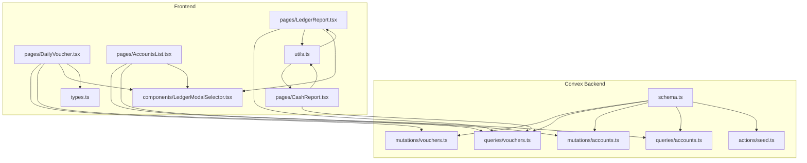
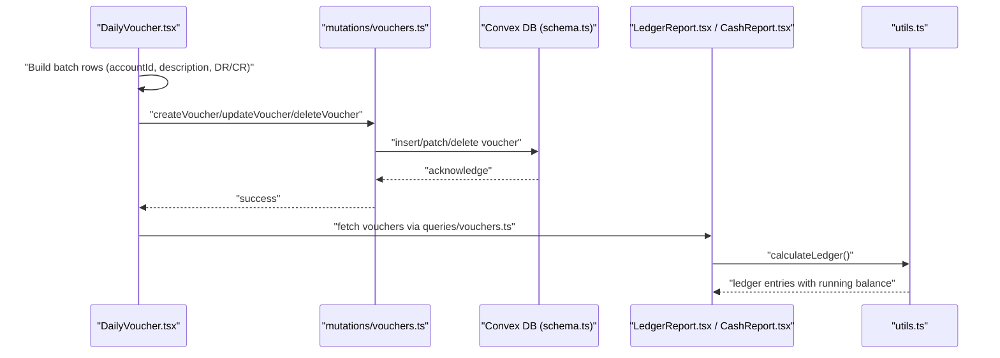
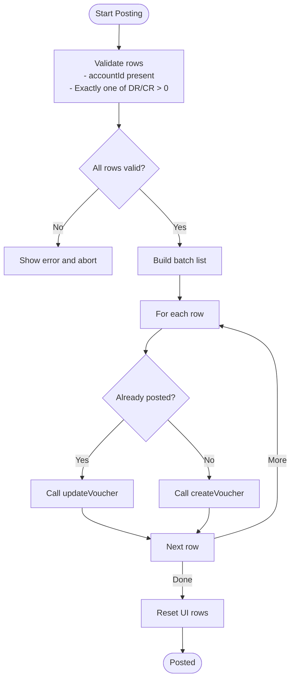
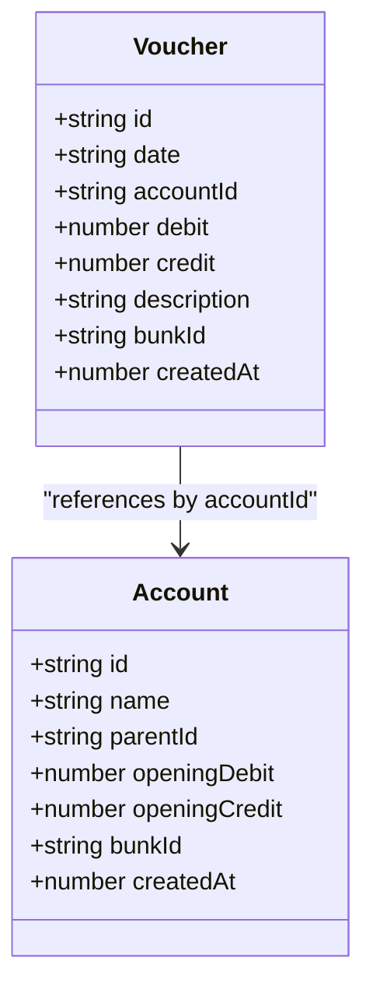
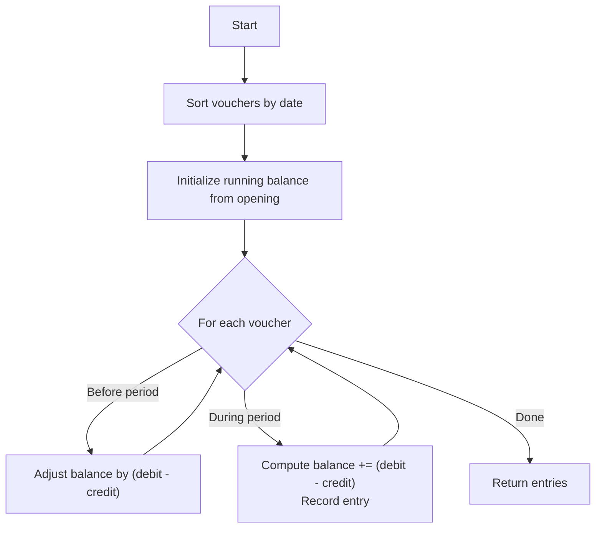
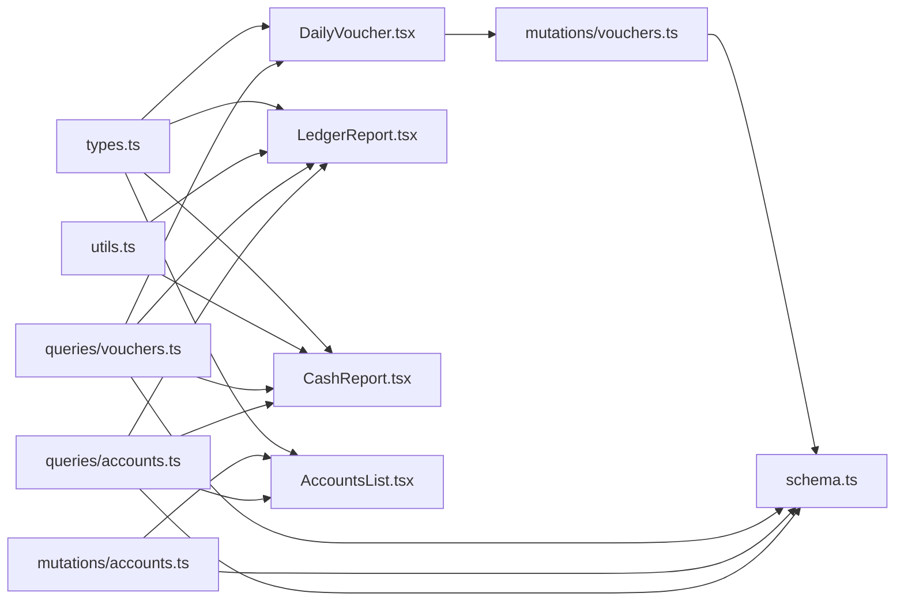

# Transaction Processing

<cite>
**Referenced Files in This Document**
- [schema.ts](file://convex/schema.ts)
- [vouchers.ts](file://convex/mutations/vouchers.ts)
- [vouchers.ts](file://convex/queries/vouchers.ts)
- [accounts.ts](file://convex/mutations/accounts.ts)
- [accounts.ts](file://convex/queries/accounts.ts)
- [DailyVoucher.tsx](file://apps/pages/DailyVoucher.tsx)
- [LedgerReport.tsx](file://apps/pages/LedgerReport.tsx)
- [CashReport.tsx](file://apps/pages/CashReport.tsx)
- [AccountsList.tsx](file://apps/pages/AccountsList.tsx)
- [LedgerModalSelector.tsx](file://apps/components/LedgerModalSelector.tsx)
- [types.ts](file://apps/types.ts)
- [utils.ts](file://apps/utils.ts)
- [seed.ts](file://convex/actions/seed.ts)
</cite>

## Table of Contents
1. [Introduction](#introduction)
2. [Project Structure](#project-structure)
3. [Core Components](#core-components)
4. [Architecture Overview](#architecture-overview)
5. [Detailed Component Analysis](#detailed-component-analysis)
6. [Dependency Analysis](#dependency-analysis)
7. [Performance Considerations](#performance-considerations)
8. [Troubleshooting Guide](#troubleshooting-guide)
9. [Conclusion](#conclusion)
10. [Appendices](#appendices)

## Introduction
This document explains the voucher-based transaction processing system used for daily accounting at fuel station locations (“bunks”). It covers the voucher collection structure, the double-entry accounting model, indexing strategy for efficient queries, the relationship between vouchers and accounts, typical transaction types, validation rules, balance calculations, batch posting, and audit trail considerations.

## Project Structure
The system is split into:
- Convex backend schema and server-side logic (mutations, queries, actions)
- Frontend pages and components for data entry, reporting, and account management
- Shared TypeScript types and utility functions

**Diagram sources**
- [schema.ts](file://convex/schema.ts#L9-L84)
- [vouchers.ts](file://convex/mutations/vouchers.ts#L1-L59)
- [vouchers.ts](file://convex/queries/vouchers.ts#L1-L19)
- [accounts.ts](file://convex/mutations/accounts.ts#L1-L63)
- [accounts.ts](file://convex/queries/accounts.ts#L1-L19)
- [seed.ts](file://convex/actions/seed.ts#L1-L268)
- [DailyVoucher.tsx](file://apps/pages/DailyVoucher.tsx#L1-L336)
- [LedgerReport.tsx](file://apps/pages/LedgerReport.tsx#L1-L257)
- [CashReport.tsx](file://apps/pages/CashReport.tsx#L1-L604)
- [AccountsList.tsx](file://apps/pages/AccountsList.tsx#L1-L254)
- [LedgerModalSelector.tsx](file://apps/components/LedgerModalSelector.tsx#L1-L182)
- [types.ts](file://apps/types.ts#L1-L56)
- [utils.ts](file://apps/utils.ts#L1-L69)

**Section sources**
- [schema.ts](file://convex/schema.ts#L9-L84)
- [DailyVoucher.tsx](file://apps/pages/DailyVoucher.tsx#L1-L336)
- [LedgerReport.tsx](file://apps/pages/LedgerReport.tsx#L1-L257)
- [CashReport.tsx](file://apps/pages/CashReport.tsx#L1-L604)
- [AccountsList.tsx](file://apps/pages/AccountsList.tsx#L1-L254)
- [LedgerModalSelector.tsx](file://apps/components/LedgerModalSelector.tsx#L1-L182)
- [types.ts](file://apps/types.ts#L1-L56)
- [utils.ts](file://apps/utils.ts#L1-L69)
- [seed.ts](file://convex/actions/seed.ts#L1-L268)

## Core Components
- Vouchers: Daily transaction records with date, account reference, debit/credit amounts, description, and associated bunk.
- Accounts: Chart of accounts with hierarchical grouping, opening debit/credit balances, and bunk association.
- Queries: Retrieve vouchers per bunk and accounts per bunk.
- Mutations: Create, update, and delete vouchers and accounts.
- UI Pages: Daily voucher entry, ledger report, cash statement, and accounts list.
- Utilities: Ledger calculation, currency/date formatting, hierarchy traversal.

Key data model fields:
- Voucher: txnDate, accountId, debit, credit, description, bunkId, createdAt
- Account: name, parentId, openingDebit, openingCredit, bunkId, createdAt

**Section sources**
- [schema.ts](file://convex/schema.ts#L59-L69)
- [types.ts](file://apps/types.ts#L27-L36)
- [accounts.ts](file://convex/mutations/accounts.ts#L4-L22)
- [vouchers.ts](file://convex/mutations/vouchers.ts#L4-L24)

## Architecture Overview
End-to-end flow for posting a voucher batch and generating reports:

**Diagram sources**
- [DailyVoucher.tsx](file://apps/pages/DailyVoucher.tsx#L111-L150)
- [vouchers.ts](file://convex/mutations/vouchers.ts#L4-L59)
- [vouchers.ts](file://convex/queries/vouchers.ts#L4-L12)
- [utils.ts](file://apps/utils.ts#L27-L64)
- [LedgerReport.tsx](file://apps/pages/LedgerReport.tsx#L49-L75)

## Detailed Component Analysis

### Voucher Collection and Double-Entry Accounting
- Structure: Each voucher holds a transaction date, references an account by ID, and includes debit and credit amounts along with a description. Vouchers are associated with a bunk and include a creation timestamp.
- Double-entry model: Every transaction must have equal debits and credits. The UI enforces that each row has either a debit or a credit (mutually exclusive non-zero values) and that totals must balance before posting.
- Balance impact: Each voucher updates the referenced account’s ledger. The running balance is computed as prior balance plus (debit minus credit) for each transaction in chronological order.

**Diagram sources**
- [DailyVoucher.tsx](file://apps/pages/DailyVoucher.tsx#L111-L150)
- [vouchers.ts](file://convex/mutations/vouchers.ts#L26-L59)

**Section sources**
- [schema.ts](file://convex/schema.ts#L59-L69)
- [types.ts](file://apps/types.ts#L27-L36)
- [DailyVoucher.tsx](file://apps/pages/DailyVoucher.tsx#L111-L150)
- [vouchers.ts](file://convex/mutations/vouchers.ts#L4-L59)

### Indexing Strategy for Efficient Queries
- Vouchers:
  - Composite index by bunkId and txnDate to efficiently fetch all vouchers for a bunk within a date range.
  - Index by accountId to support per-account queries.
- Accounts:
  - Index by bunkId to fetch chart of accounts per location.
  - Index by parentId to traverse hierarchical structure.

These indices enable:
- Daily voucher listing per bunk
- Ledger and cash reports filtered by date ranges
- Hierarchical account browsing and selection

**Section sources**
- [schema.ts](file://convex/schema.ts#L13-L18)
- [schema.ts](file://convex/schema.ts#L44-L54)
- [schema.ts](file://convex/schema.ts#L59-L69)
- [vouchers.ts](file://convex/queries/vouchers.ts#L4-L12)
- [accounts.ts](file://convex/queries/accounts.ts#L4-L12)

### Relationship Between Vouchers and Accounts
- Each voucher references an account by ID, linking the transaction to a specific ledger in the chart of accounts.
- Accounts are hierarchical; the UI supports selecting leaf-level accounts for posting while allowing group headers in selection mode.
- Reports can consolidate by parent account to show aggregated activity.

**Diagram sources**
- [types.ts](file://apps/types.ts#L27-L36)
- [schema.ts](file://convex/schema.ts#L44-L54)
- [schema.ts](file://convex/schema.ts#L59-L69)

**Section sources**
- [types.ts](file://apps/types.ts#L17-L36)
- [LedgerModalSelector.tsx](file://apps/components/LedgerModalSelector.tsx#L44-L116)
- [LedgerReport.tsx](file://apps/pages/LedgerReport.tsx#L47-L75)

### Examples of Common Transaction Types
- Cash receipts: Debit cash/bank account, credit sales account(s).
- Payments: Credit cash/bank account, debit expense or supplier accounts.
- Expense entries: Debit expense accounts, credit cash/bank.
- Transfer transactions: Debit one cash/bank account, credit another cash/bank account.

These are modeled as debit/credit pairs in voucher rows. The tally convention used in the UI treats cash as an asset; increases in cash via CR entries and decreases via DR entries.

**Section sources**
- [DailyVoucher.tsx](file://apps/pages/DailyVoucher.tsx#L58-L62)
- [seed.ts](file://convex/actions/seed.ts#L146-L232)

### Transaction Validation Rules and Balance Calculation
- Validation:
  - Each row requires a valid account selection.
  - Only one of debit or credit may be non-zero per row.
  - At least one row must be present with valid data before posting.
- Balance calculation:
  - Ledger entries compute a running balance as prior balance plus (debit minus credit) for each transaction in date order.
  - Cash report computes opening balance as prior-period adjustments plus opening balances, then closing balance equals opening plus total credits minus total debits.

**Diagram sources**
- [utils.ts](file://apps/utils.ts#L27-L64)
- [CashReport.tsx](file://apps/pages/CashReport.tsx#L233-L261)

**Section sources**
- [DailyVoucher.tsx](file://apps/pages/DailyVoucher.tsx#L111-L150)
- [utils.ts](file://apps/utils.ts#L27-L64)
- [CashReport.tsx](file://apps/pages/CashReport.tsx#L233-L261)

### Batch Processing Capabilities
- The UI allows building a batch of rows, adding/removing entries, and posting all at once.
- Posting iterates over rows, calling create or update depending on whether the row corresponds to an existing voucher.
- The UI prevents accidental navigation with unsaved changes and prompts to post before leaving.

**Section sources**
- [DailyVoucher.tsx](file://apps/pages/DailyVoucher.tsx#L34-L150)

### Transaction Reversal Procedures
- The current schema and mutations do not include built-in reversal entries or voiding logic. To reverse a transaction, record a correcting journal entry with reversed debit/credit amounts on the same date and accounts.

[No sources needed since this section provides general guidance]

### Audit Trail Considerations
- Each voucher includes a creation timestamp, enabling basic audit trail tracking.
- For stronger audit trails, consider adding fields such as modifiedBy, revisionNumber, and storing previous versions of edited vouchers.

**Section sources**
- [schema.ts](file://convex/schema.ts#L59-L69)
- [vouchers.ts](file://convex/mutations/vouchers.ts#L13-L23)

## Dependency Analysis
- Frontend pages depend on shared types and utilities for consistent data modeling and formatting.
- UI pages rely on Convex queries to fetch data and mutations to write changes.
- Reports depend on ledger calculation utilities to derive balances and summaries.

**Diagram sources**
- [types.ts](file://apps/types.ts#L1-L56)
- [utils.ts](file://apps/utils.ts#L1-L69)
- [DailyVoucher.tsx](file://apps/pages/DailyVoucher.tsx#L1-L336)
- [LedgerReport.tsx](file://apps/pages/LedgerReport.tsx#L1-L257)
- [CashReport.tsx](file://apps/pages/CashReport.tsx#L1-L604)
- [AccountsList.tsx](file://apps/pages/AccountsList.tsx#L1-L254)
- [vouchers.ts](file://convex/queries/vouchers.ts#L1-L19)
- [accounts.ts](file://convex/queries/accounts.ts#L1-L19)
- [accounts.ts](file://convex/mutations/accounts.ts#L1-L63)
- [schema.ts](file://convex/schema.ts#L9-L84)

**Section sources**
- [types.ts](file://apps/types.ts#L1-L56)
- [utils.ts](file://apps/utils.ts#L1-L69)
- [DailyVoucher.tsx](file://apps/pages/DailyVoucher.tsx#L1-L336)
- [LedgerReport.tsx](file://apps/pages/LedgerReport.tsx#L1-L257)
- [CashReport.tsx](file://apps/pages/CashReport.tsx#L1-L604)
- [AccountsList.tsx](file://apps/pages/AccountsList.tsx#L1-L254)
- [vouchers.ts](file://convex/queries/vouchers.ts#L1-L19)
- [accounts.ts](file://convex/queries/accounts.ts#L1-L19)
- [accounts.ts](file://convex/mutations/accounts.ts#L1-L63)
- [schema.ts](file://convex/schema.ts#L9-L84)

## Performance Considerations
- Use the composite index on vouchers by bunkId and txnDate to efficiently filter large datasets by date range.
- Prefer fetching only necessary fields in queries and avoid unnecessary sorting on the client when the backend can pre-filter.
- Batch operations in the UI reduce network round-trips; ensure client-side validation minimizes failed mutations.

[No sources needed since this section provides general guidance]

## Troubleshooting Guide
- Posting fails with “no valid transaction data”: Ensure at least one row has a valid account and a non-zero debit or credit.
- Editing posted vouchers: Confirm deletion prompt appears before removing posted entries.
- Ledger shows unexpected balances: Verify the date range filters and that the correct account (or consolidated group) is selected.

**Section sources**
- [DailyVoucher.tsx](file://apps/pages/DailyVoucher.tsx#L111-L150)
- [LedgerReport.tsx](file://apps/pages/LedgerReport.tsx#L47-L75)

## Conclusion
The system implements a practical voucher-based double-entry framework with strong indexing for efficient querying, robust UI for batch posting, and comprehensive reporting utilities. While reversal logic is not built-in, the design supports correcting entries and maintains an audit trail through timestamps.

[No sources needed since this section summarizes without analyzing specific files]

## Appendices

### Appendix A: Typical Transaction Patterns
- Cash receipt: Debit Cash/Bank, Credit Sales
- Payment: Credit Cash/Bank, Debit Expenses/Suppliers
- Transfer: Debit Bank A, Credit Bank B

**Section sources**
- [seed.ts](file://convex/actions/seed.ts#L190-L232)
- [DailyVoucher.tsx](file://apps/pages/DailyVoucher.tsx#L58-L62)

### Appendix B: Sample Data Generation
- Initial accounts and vouchers are seeded per bunk for demonstration and testing.

**Section sources**
- [seed.ts](file://convex/actions/seed.ts#L130-L261)