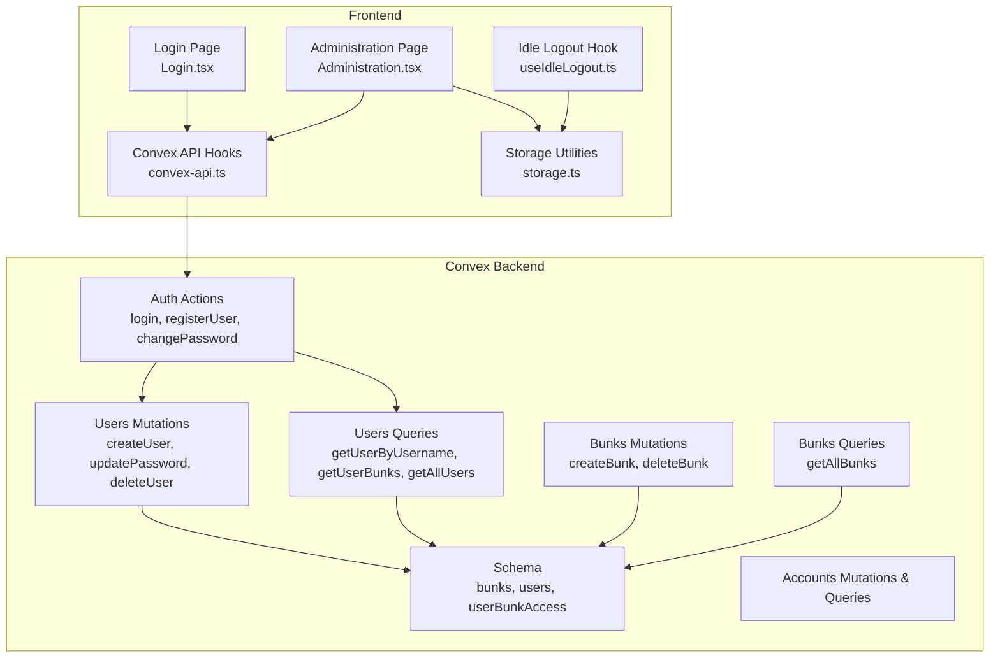
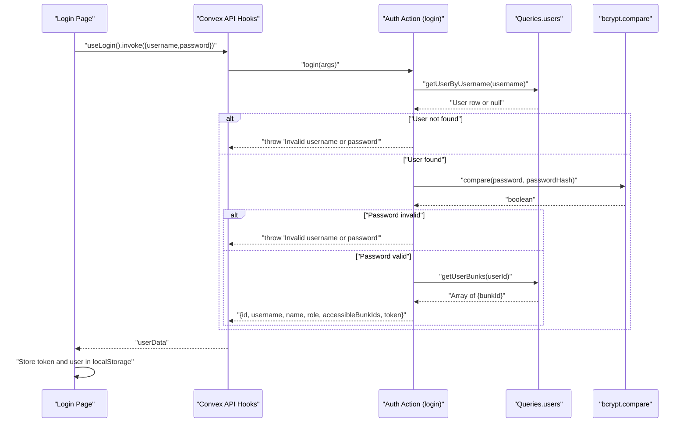
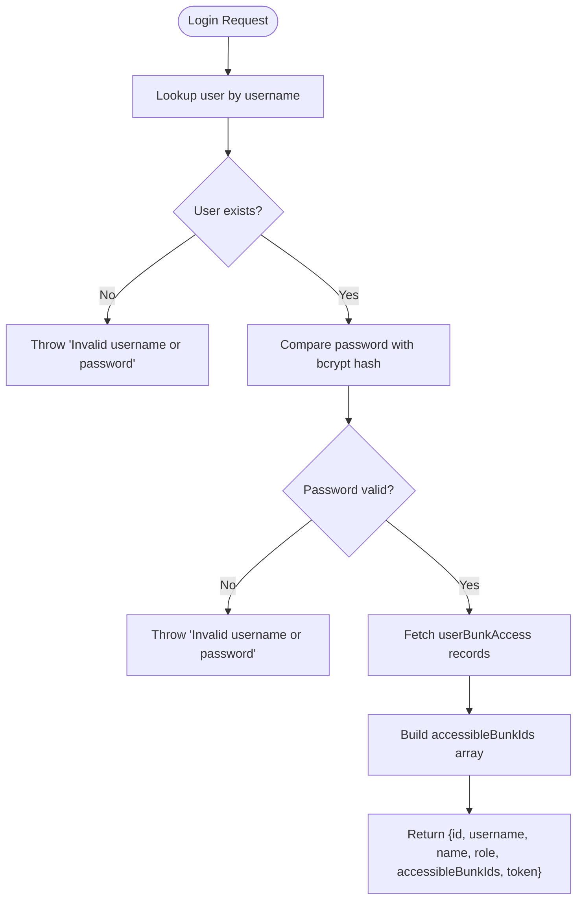
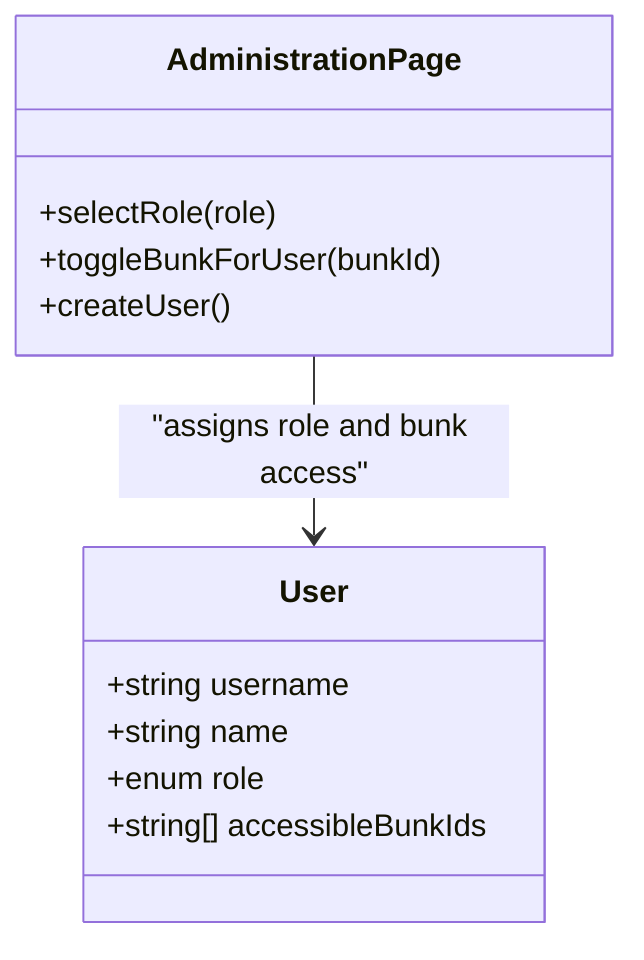
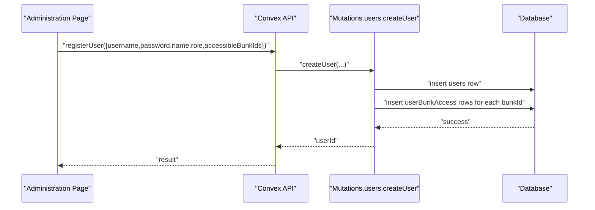
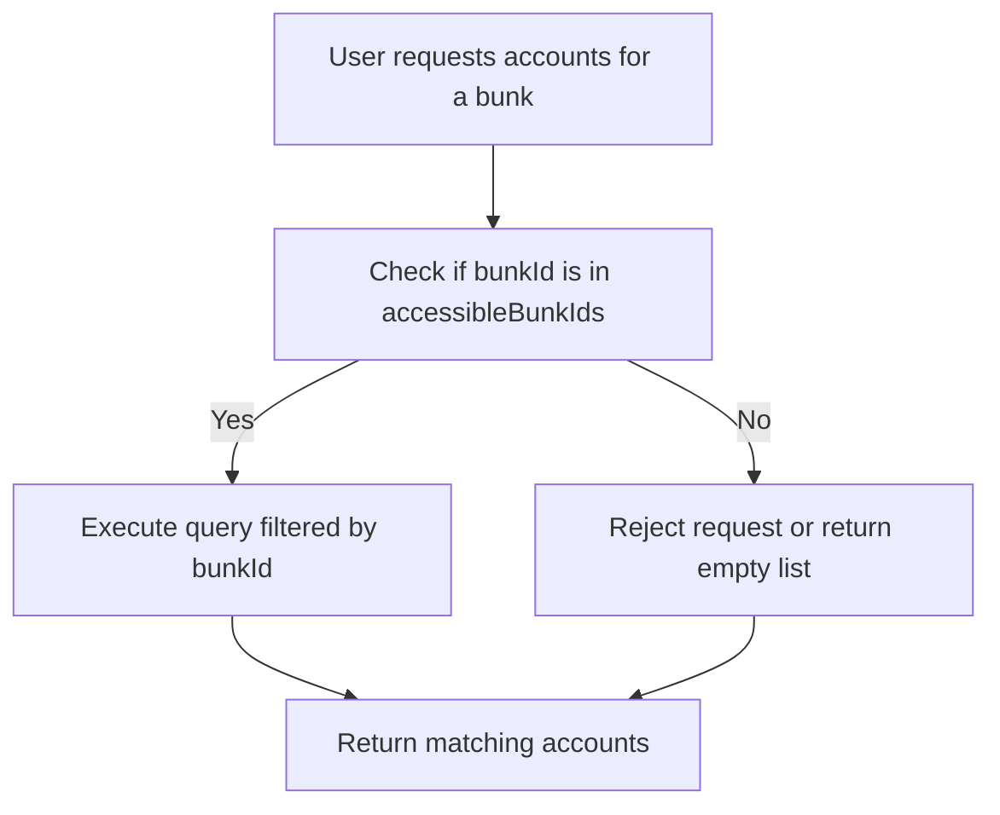
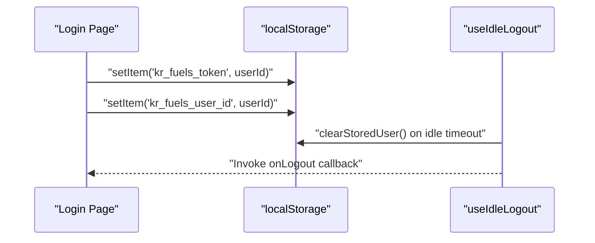
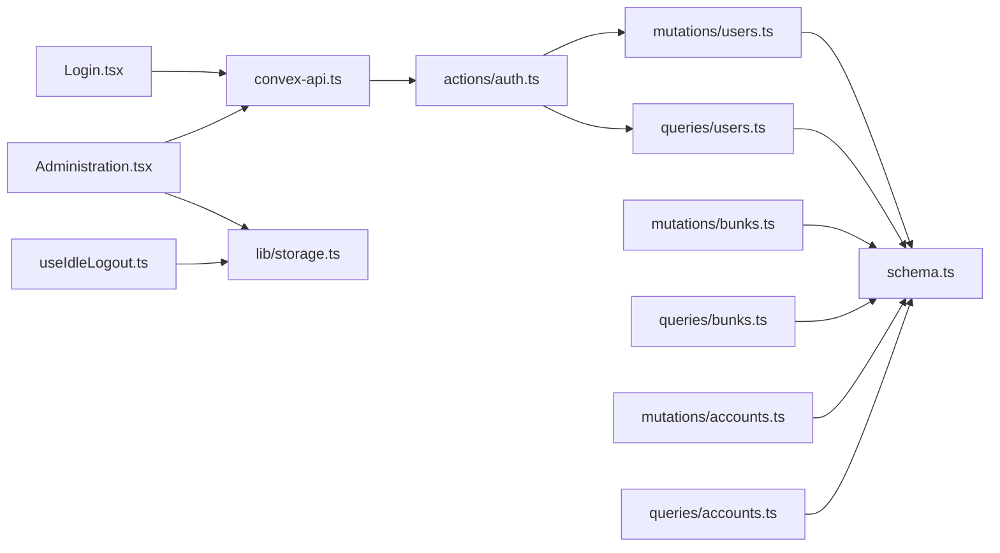

# User Access Control

<cite>
**Referenced Files in This Document**
- [schema.ts](file://convex/schema.ts)
- [auth.ts](file://convex/actions/auth.ts)
- [users.ts](file://convex/mutations/users.ts)
- [users.ts](file://convex/queries/users.ts)
- [bunks.ts](file://convex/mutations/bunks.ts)
- [bunks.ts](file://convex/queries/bunks.ts)
- [accounts.ts](file://convex/mutations/accounts.ts)
- [accounts.ts](file://convex/queries/accounts.ts)
- [Login.tsx](file://apps/pages/Login.tsx)
- [useIdleLogout.ts](file://apps/hooks/useIdleLogout.ts)
- [storage.ts](file://apps/lib/storage.ts)
- [convex-api.ts](file://apps/convex-api.ts)
- [Administration.tsx](file://apps/pages/Administration.tsx)
- [types.ts](file://apps/types.ts)
</cite>

## Table of Contents
1. [Introduction](#introduction)
2. [Project Structure](#project-structure)
3. [Core Components](#core-components)
4. [Architecture Overview](#architecture-overview)
5. [Detailed Component Analysis](#detailed-component-analysis)
6. [Dependency Analysis](#dependency-analysis)
7. [Performance Considerations](#performance-considerations)
8. [Security Considerations](#security-considerations)
9. [Troubleshooting Guide](#troubleshooting-guide)
10. [Conclusion](#conclusion)
11. [Appendices](#appendices)

## Introduction
This document explains the user management and access control system centered around two core collections: users and userBunkAccess. It details role-based access control with admin and super_admin roles, the many-to-many relationship between users and bunks (fuel stations), and the authentication pipeline including username/password validation, bcrypt-based password hashing, and session management. It also documents how location-specific access is enforced via the user-bunk relationship to prevent cross-station data leakage, and provides examples of user creation, role assignment, location access provisioning, and access revocation. Security considerations such as password policies, session timeout handling, and audit logging for access control changes are addressed.

## Project Structure
The system is implemented using Convex for backend logic and React for the frontend. The database schema defines three primary tables:
- bunks: Fuel station locations
- users: Application users with roles and credentials
- userBunkAccess: Junction table implementing many-to-many access between users and bunks



**Diagram sources**
- [schema.ts](file://convex/schema.ts#L13-L40)
- [auth.ts](file://convex/actions/auth.ts#L18-L56)
- [users.ts](file://convex/mutations/users.ts#L13-L41)
- [users.ts](file://convex/queries/users.ts#L4-L22)
- [bunks.ts](file://convex/mutations/bunks.ts#L4-L36)
- [bunks.ts](file://convex/queries/bunks.ts#L11-L15)
- [accounts.ts](file://convex/mutations/accounts.ts#L4-L21)
- [accounts.ts](file://convex/queries/accounts.ts#L4-L12)
- [Login.tsx](file://apps/pages/Login.tsx#L22-L56)
- [convex-api.ts](file://apps/convex-api.ts#L7-L9)
- [useIdleLogout.ts](file://apps/hooks/useIdleLogout.ts#L10-L21)
- [storage.ts](file://apps/lib/storage.ts#L1-L34)
- [Administration.tsx](file://apps/pages/Administration.tsx#L70-L101)

**Section sources**
- [schema.ts](file://convex/schema.ts#L13-L40)
- [Login.tsx](file://apps/pages/Login.tsx#L22-L56)
- [convex-api.ts](file://apps/convex-api.ts#L7-L9)
- [Administration.tsx](file://apps/pages/Administration.tsx#L70-L101)

## Core Components
- Users collection: Stores usernames, bcrypt hashes, display names, roles (admin or super_admin), and timestamps. Indexed by username for fast lookup.
- Bunks collection: Stores fuel station metadata (name, code, location) with a unique code and creation timestamp.
- userBunkAccess junction: Links users to bunks via userId and bunkId, with composite and single-field indexes optimized for lookups.
- Authentication actions: Provide login, registration, and password change with bcrypt hashing and validation.
- User management mutations: Create, update password, and delete users; grant/revoke bunk access during creation/deletion.
- Frontend login flow: Captures credentials, invokes the login action, stores a lightweight token, and persists user identity.
- Session timeout hook: Logs out inactive users after a configurable period.

**Section sources**
- [schema.ts](file://convex/schema.ts#L13-L40)
- [auth.ts](file://convex/actions/auth.ts#L18-L56)
- [users.ts](file://convex/mutations/users.ts#L13-L41)
- [users.ts](file://convex/mutations/users.ts#L63-L80)
- [Login.tsx](file://apps/pages/Login.tsx#L22-L56)
- [useIdleLogout.ts](file://apps/hooks/useIdleLogout.ts#L10-L21)

## Architecture Overview
The authentication and access control architecture enforces location-based isolation by binding users to specific bunks through the userBunkAccess table. On login, the system validates credentials, retrieves the user’s accessible bunk IDs, and returns a minimal token containing the user’s identity and accessible locations. Subsequent operations filter data by these bunk IDs to prevent cross-station data leakage.



**Diagram sources**
- [Login.tsx](file://apps/pages/Login.tsx#L22-L56)
- [convex-api.ts](file://apps/convex-api.ts#L7)
- [auth.ts](file://convex/actions/auth.ts#L18-L56)
- [users.ts](file://convex/queries/users.ts#L4-L22)

## Detailed Component Analysis

### Database Schema and Relationships
The schema defines three core tables and their indexes:
- bunks: name, code (unique), location, createdAt
- users: username (unique), passwordHash, name, role, createdAt
- userBunkAccess: userId, bunkId with indexes by_user, by_bunk, and by_user_and_bunk

```mermaid
erDiagram
BUNKS {
string _id PK
string name
string code UK
string location
number createdAt
}
USERS {
string _id PK
string username UK
string passwordHash
string name
enum role
number createdAt
}
USER_BUNK_ACCESS {
string _id PK
id users.FK
id bunks.FK
}
USERS ||--o{ USER_BUNK_ACCESS : "has access to"
BUNKS ||--o{ USER_BUNK_ACCESS : "grants access to"
```

**Diagram sources**
- [schema.ts](file://convex/schema.ts#L13-L40)

**Section sources**
- [schema.ts](file://convex/schema.ts#L13-L40)

### Authentication Pipeline
- Username/password validation: The login action fetches a user by username and compares the provided password against the stored bcrypt hash.
- Accessible bunks resolution: After successful authentication, the system queries the userBunkAccess table to build the list of bunk IDs the user can access.
- Token issuance: The action returns a minimal token equal to the user ID along with role and accessible bunk IDs.



**Diagram sources**
- [auth.ts](file://convex/actions/auth.ts#L18-L56)
- [users.ts](file://convex/queries/users.ts#L14-L22)

**Section sources**
- [auth.ts](file://convex/actions/auth.ts#L18-L56)
- [users.ts](file://convex/queries/users.ts#L4-L22)

### Role-Based Access Control (RBAC)
- Roles: admin and super_admin are supported in the schema and actions.
- Behavior: The frontend Administration page allows selecting a role during user creation. super_admin is represented as “Global Access” in the UI, while admin users require explicit bunk selection.
- Enforcement: Location-specific access is enforced by filtering downstream operations (e.g., accounts, vouchers) by the user’s accessibleBunkIds returned on login.



**Diagram sources**
- [Administration.tsx](file://apps/pages/Administration.tsx#L103-L101)
- [types.ts](file://apps/types.ts#L9-L15)

**Section sources**
- [Administration.tsx](file://apps/pages/Administration.tsx#L103-L101)
- [types.ts](file://apps/types.ts#L9-L15)

### Many-to-Many Relationship Between Users and Bunks
- Creation: The createUser mutation inserts a user and then iterates over accessibleBunkIds to insert corresponding userBunkAccess records.
- Deletion: The deleteUser mutation removes all userBunkAccess records for the user before deleting the user.
- Querying: getUserBunks returns all bunk IDs associated with a given user.



**Diagram sources**
- [Administration.tsx](file://apps/pages/Administration.tsx#L70-L83)
- [auth.ts](file://convex/actions/auth.ts#L62-L104)
- [users.ts](file://convex/mutations/users.ts#L13-L41)

**Section sources**
- [users.ts](file://convex/mutations/users.ts#L13-L41)
- [users.ts](file://convex/mutations/users.ts#L63-L80)
- [users.ts](file://convex/queries/users.ts#L14-L22)

### Location-Specific Access Enforcement
- Filtering pattern: Downstream operations (e.g., accounts, vouchers) should filter by bunkId using the user’s accessibleBunkIds to prevent cross-station data leakage.
- Example enforcement points:
  - Accounts listing: getAccountsByBunk filters by bunkId.
  - Vouchers listing: queries can filter by bunkId and date to restrict visibility to authorized locations.



**Diagram sources**
- [accounts.ts](file://convex/queries/accounts.ts#L4-L12)
- [accounts.ts](file://convex/mutations/accounts.ts#L4-L22)

**Section sources**
- [accounts.ts](file://convex/queries/accounts.ts#L4-L12)
- [accounts.ts](file://convex/mutations/accounts.ts#L4-L22)

### Session Management
- Token storage: The Login page stores a lightweight token (user ID) and user identity in localStorage upon successful login.
- Session timeout: The useIdleLogout hook listens to activity events and triggers logout after a configurable idle threshold (default 30 minutes).
- Cleanup: The storage utilities provide helpers to clear stored user data and tokens.



**Diagram sources**
- [Login.tsx](file://apps/pages/Login.tsx#L38-L50)
- [useIdleLogout.ts](file://apps/hooks/useIdleLogout.ts#L10-L21)
- [storage.ts](file://apps/lib/storage.ts#L20-L24)

**Section sources**
- [Login.tsx](file://apps/pages/Login.tsx#L38-L50)
- [useIdleLogout.ts](file://apps/hooks/useIdleLogout.ts#L10-L21)
- [storage.ts](file://apps/lib/storage.ts#L20-L24)

### Examples

- Create a user with admin role and grant access to specific bunks:
  - Use the registerUser action with role set to admin and accessibleBunkIds containing the target bunk IDs.
  - The action validates the password length, hashes the password with bcrypt, and creates the user with granted bunk access.

- Assign a super_admin role:
  - Set role to super_admin during user creation. The UI represents this as “Global Access,” indicating no explicit bunk selection is required.

- Provision location access for an existing admin user:
  - Add bunk IDs to the user’s accessibleBunkIds and re-run the user creation flow or extend the mutation to support updating access.

- Revoke access for a user:
  - Remove bunk IDs from the user’s accessibleBunkIds and re-run the user creation flow or implement a dedicated mutation to delete specific userBunkAccess records.

- Change a user’s password:
  - Use the changePassword action to validate the old password and update with a new bcrypt-hashed password.

**Section sources**
- [auth.ts](file://convex/actions/auth.ts#L62-L104)
- [auth.ts](file://convex/actions/auth.ts#L109-L147)
- [users.ts](file://convex/mutations/users.ts#L13-L41)
- [Administration.tsx](file://apps/pages/Administration.tsx#L70-L101)

## Dependency Analysis
The following diagram shows key dependencies among modules involved in authentication and access control:



**Diagram sources**
- [Login.tsx](file://apps/pages/Login.tsx#L22-L56)
- [convex-api.ts](file://apps/convex-api.ts#L7-L9)
- [auth.ts](file://convex/actions/auth.ts#L18-L56)
- [users.ts](file://convex/queries/users.ts#L4-L22)
- [users.ts](file://convex/mutations/users.ts#L13-L41)
- [bunks.ts](file://convex/mutations/bunks.ts#L4-L36)
- [bunks.ts](file://convex/queries/bunks.ts#L11-L15)
- [accounts.ts](file://convex/mutations/accounts.ts#L4-L22)
- [accounts.ts](file://convex/queries/accounts.ts#L4-L12)
- [Administration.tsx](file://apps/pages/Administration.tsx#L70-L101)
- [storage.ts](file://apps/lib/storage.ts#L1-L34)
- [useIdleLogout.ts](file://apps/hooks/useIdleLogout.ts#L10-L21)

**Section sources**
- [schema.ts](file://convex/schema.ts#L13-L40)
- [auth.ts](file://convex/actions/auth.ts#L18-L56)
- [users.ts](file://convex/mutations/users.ts#L13-L41)
- [users.ts](file://convex/queries/users.ts#L4-L22)
- [bunks.ts](file://convex/mutations/bunks.ts#L4-L36)
- [bunks.ts](file://convex/queries/bunks.ts#L11-L15)
- [accounts.ts](file://convex/mutations/accounts.ts#L4-L22)
- [accounts.ts](file://convex/queries/accounts.ts#L4-L12)
- [Administration.tsx](file://apps/pages/Administration.tsx#L70-L101)
- [storage.ts](file://apps/lib/storage.ts#L1-L34)
- [useIdleLogout.ts](file://apps/hooks/useIdleLogout.ts#L10-L21)

## Performance Considerations
- Index usage: The schema includes indexes on username, userBunkAccess by_user, by_bunk, and by_user_and_bunk, optimizing lookups for login and access checks.
- Bcrypt cost: The hashing uses 10 rounds; consider tuning based on hardware and latency requirements.
- Query efficiency: Fetching accessible bunks on login is O(n) where n is the number of bunks a user can access; keep access lists reasonable per user.
- Frontend caching: Persist user identity and accessible bunk IDs in localStorage to avoid repeated network calls after login.

[No sources needed since this section provides general guidance]

## Security Considerations
- Password policies:
  - Enforce minimum length and complexity in the registration action.
  - Consider adding entropy checks and disallowing common passwords.
- Token handling:
  - The current token equals the user ID; consider issuing short-lived JWTs with expiration for stronger session control.
  - Avoid storing sensitive data in localStorage; rotate tokens server-side when feasible.
- Session timeout:
  - The idle logout hook clears stored user data after inactivity; ensure all sensitive operations require a valid session.
- Audit logging:
  - Track user creation, deletion, role changes, and access modifications for compliance and incident response.
- Data isolation:
  - Always filter data by bunkId using the user’s accessibleBunkIds to prevent unauthorized cross-station access.

[No sources needed since this section provides general guidance]

## Troubleshooting Guide
- Login fails with invalid credentials:
  - Verify the username exists and the password matches the bcrypt hash.
  - Check that the user has bunk access; a user with no access records will still fail login if the system expects at least one bunk.
- Registration errors:
  - Username already exists: Choose a unique username.
  - Password too short: Ensure the password meets the minimum length requirement.
- Access denied:
  - Confirm the user’s accessibleBunkIds include the requested bunk ID.
  - Ensure downstream queries filter by bunkId.
- Session issues:
  - If auto-logout occurs unexpectedly, review the idle timeout configuration and event listeners.
  - Clear localStorage to reset session state if corrupted.

**Section sources**
- [auth.ts](file://convex/actions/auth.ts#L29-L37)
- [auth.ts](file://convex/actions/auth.ts#L76-L78)
- [auth.ts](file://convex/actions/auth.ts#L81-L83)
- [useIdleLogout.ts](file://apps/hooks/useIdleLogout.ts#L10-L21)
- [storage.ts](file://apps/lib/storage.ts#L20-L24)

## Conclusion
The system implements a straightforward yet effective RBAC model with admin and super_admin roles and enforces location-specific access through a many-to-many relationship between users and bunks. Authentication relies on bcrypt-hashed passwords and a lightweight token, while session management includes idle timeout handling. By consistently filtering data by the user’s accessible bunk IDs, the system prevents cross-station data leakage. Extending the design with JWTs, stronger audit logging, and granular permissions would further enhance security and operability.

[No sources needed since this section summarizes without analyzing specific files]

## Appendices

### Appendix A: Example Workflows

- User creation with admin role and selected bunks:
  - Call registerUser with role=admin and accessibleBunkIds set to the desired bunk IDs.
  - The action validates the password, hashes it, and grants access to the specified bunks.

- Assigning super_admin:
  - Set role=super_admin during user creation; the UI indicates global access.

- Revoking access:
  - Remove bunk IDs from the user’s accessibleBunkIds and re-run the user creation flow or implement a mutation to delete specific userBunkAccess records.

- Changing password:
  - Invoke changePassword with the user ID, old password, and new password; the action validates the old password and updates the bcrypt hash.

**Section sources**
- [auth.ts](file://convex/actions/auth.ts#L62-L104)
- [auth.ts](file://convex/actions/auth.ts#L109-L147)
- [users.ts](file://convex/mutations/users.ts#L13-L41)
- [Administration.tsx](file://apps/pages/Administration.tsx#L70-L101)