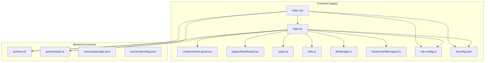
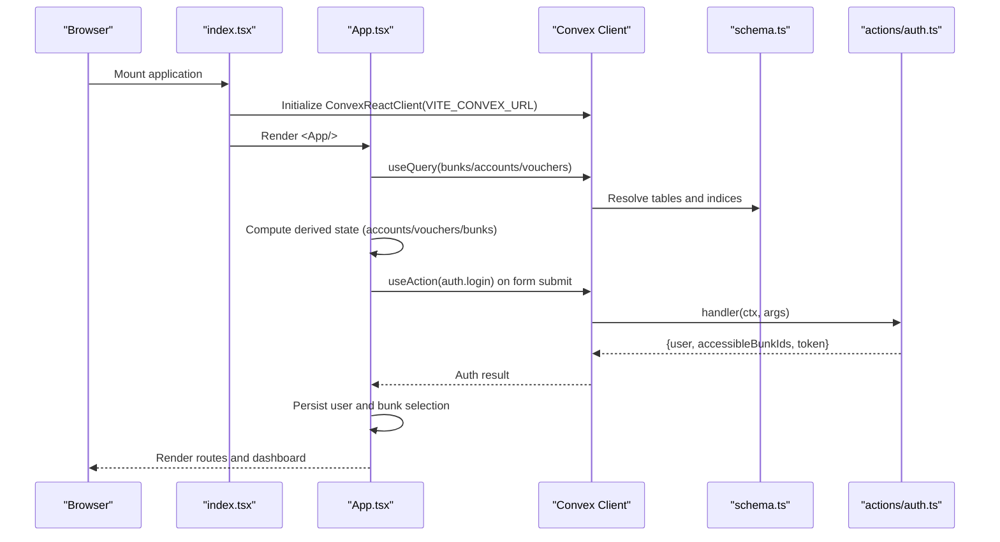
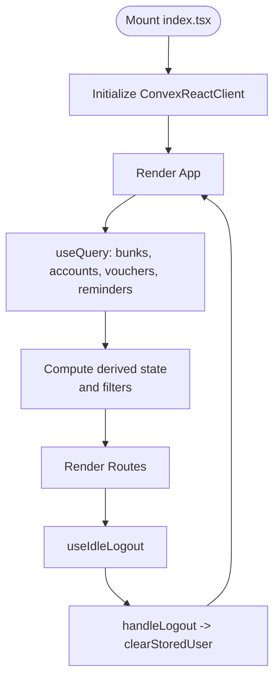
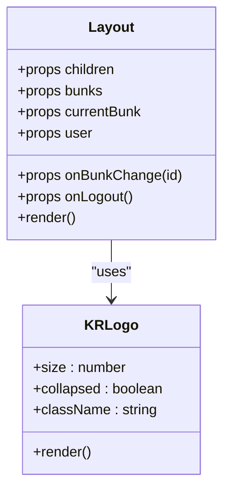
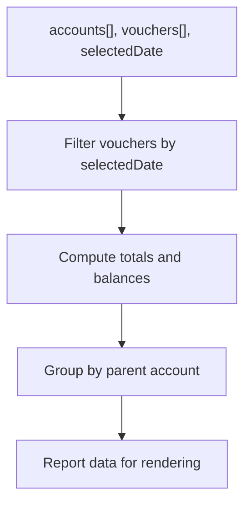
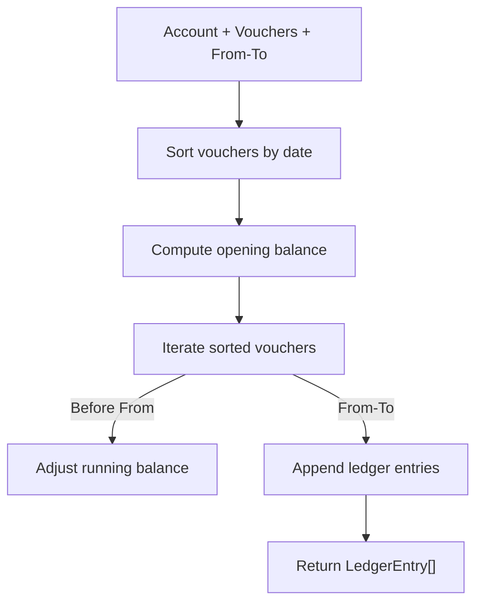
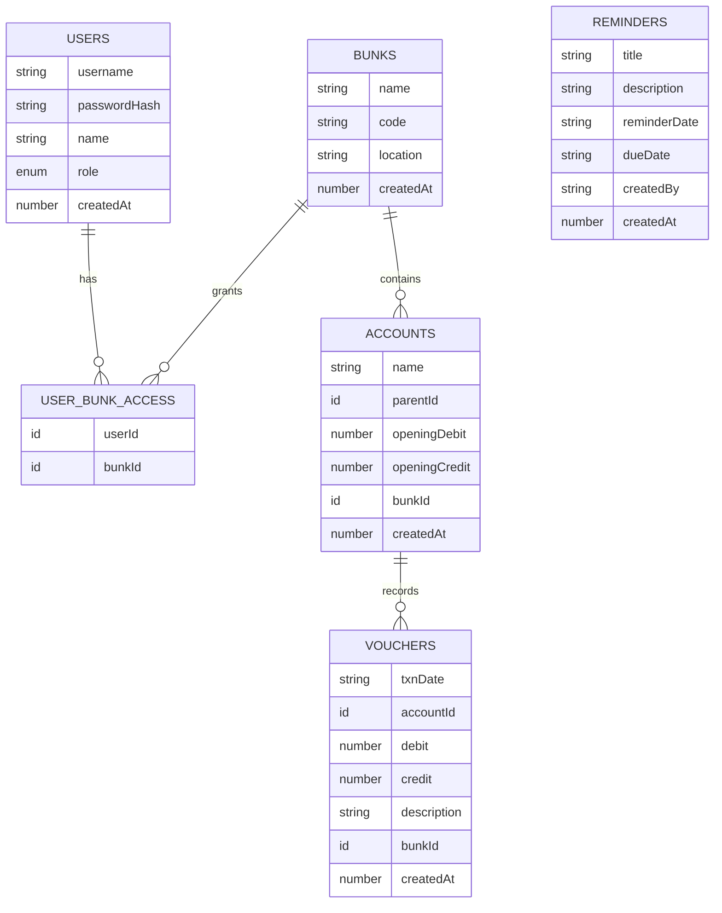
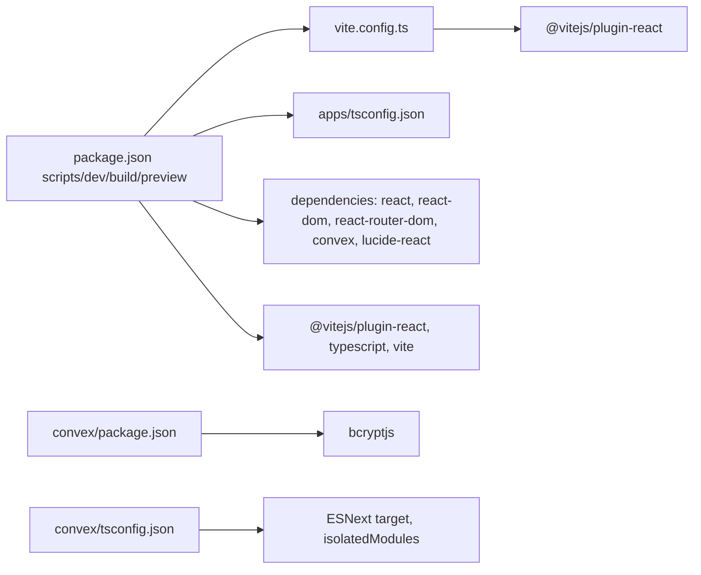

# Development Guidelines

<cite>
**Referenced Files in This Document**
- [package.json](file://package.json)
- [README.md](file://README.md)
- [apps/vite.config.ts](file://apps/vite.config.ts)
- [apps/tsconfig.json](file://apps/tsconfig.json)
- [apps/index.tsx](file://apps/index.tsx)
- [apps/App.tsx](file://apps/App.tsx)
- [apps/types.ts](file://apps/types.ts)
- [apps/utils.ts](file://apps/utils.ts)
- [apps/metadata.json](file://apps/metadata.json)
- [apps/convex-api.ts](file://apps/convex-api.ts)
- [apps/components/Layout.tsx](file://apps/components/Layout.tsx)
- [apps/pages/Dashboard.tsx](file://apps/pages/Dashboard.tsx)
- [apps/lib/storage.ts](file://apps/lib/storage.ts)
- [apps/hooks/useIdleLogout.ts](file://apps/hooks/useIdleLogout.ts)
- [convex/package.json](file://convex/package.json)
- [convex/tsconfig.json](file://convex/tsconfig.json)
- [convex/schema.ts](file://convex/schema.ts)
- [convex/actions/auth.ts](file://convex/actions/auth.ts)
</cite>

## Table of Contents
1. [Introduction](#introduction)
2. [Project Structure](#project-structure)
3. [Core Components](#core-components)
4. [Architecture Overview](#architecture-overview)
5. [Detailed Component Analysis](#detailed-component-analysis)
6. [Dependency Analysis](#dependency-analysis)
7. [Performance Considerations](#performance-considerations)
8. [Testing Strategies](#testing-strategies)
9. [Build Configuration and Development Workflow](#build-configuration-and-development-workflow)
10. [Code Review Guidelines and Contribution Standards](#code-review-guidelines-and-contribution-standards)
11. [Security Best Practices](#security-best-practices)
12. [Deployment and Production Readiness](#deployment-and-production-readiness)
13. [Extending Functionality](#extending-functionality)
14. [Troubleshooting Guide](#troubleshooting-guide)
15. [Conclusion](#conclusion)

## Introduction
This document provides comprehensive development guidelines for KR-FUELS contributors and maintainers. It covers code organization, TypeScript usage, testing strategies, build configuration with Vite, development workflow, debugging techniques, code review and contribution standards, performance optimization, security practices, deployment, and extension guidance. The goal is to ensure consistent, maintainable, and scalable development across the frontend and backend.

## Project Structure
The project follows a dual-package layout:
- Frontend (React + Vite) under apps/
- Backend (Convex) under convex/

Key characteristics:
- Single-page application built with React and routed via react-router-dom.
- State and persistence handled via Convex (queries, mutations, actions).
- Shared TypeScript types defined centrally for type safety.
- Utilities for formatting and ledger calculations.
- Local storage helpers for user session and preferences.
- Sidebar layout with collapsible navigation and per-user bunk selection.

**Diagram sources**
- [apps/index.tsx](file://apps/index.tsx#L1-L23)
- [apps/App.tsx](file://apps/App.tsx#L1-L266)
- [apps/components/Layout.tsx](file://apps/components/Layout.tsx#L1-L311)
- [apps/pages/Dashboard.tsx](file://apps/pages/Dashboard.tsx#L1-L219)
- [apps/types.ts](file://apps/types.ts#L1-L56)
- [apps/utils.ts](file://apps/utils.ts#L1-L69)
- [apps/lib/storage.ts](file://apps/lib/storage.ts#L1-L34)
- [apps/hooks/useIdleLogout.ts](file://apps/hooks/useIdleLogout.ts#L1-L33)
- [apps/vite.config.ts](file://apps/vite.config.ts#L1-L16)
- [apps/tsconfig.json](file://apps/tsconfig.json#L1-L24)
- [convex/schema.ts](file://convex/schema.ts#L1-L85)
- [convex/actions/auth.ts](file://convex/actions/auth.ts#L1-L148)

**Section sources**
- [package.json](file://package.json#L1-L26)
- [README.md](file://README.md#L1-L13)
- [apps/vite.config.ts](file://apps/vite.config.ts#L1-L16)
- [apps/tsconfig.json](file://apps/tsconfig.json#L1-L24)
- [apps/index.tsx](file://apps/index.tsx#L1-L23)
- [apps/App.tsx](file://apps/App.tsx#L1-L266)
- [apps/types.ts](file://apps/types.ts#L1-L56)
- [apps/utils.ts](file://apps/utils.ts#L1-L69)
- [apps/lib/storage.ts](file://apps/lib/storage.ts#L1-L34)
- [apps/hooks/useIdleLogout.ts](file://apps/hooks/useIdleLogout.ts#L1-L33)
- [convex/schema.ts](file://convex/schema.ts#L1-L85)
- [convex/actions/auth.ts](file://convex/actions/auth.ts#L1-L148)

## Core Components
- Application shell and routing: [apps/App.tsx](file://apps/App.tsx#L21-L262)
- Root initialization and Convex provider: [apps/index.tsx](file://apps/index.tsx#L7-L22)
- Shared types: [apps/types.ts](file://apps/types.ts#L2-L56)
- Formatting and ledger utilities: [apps/utils.ts](file://apps/utils.ts#L4-L69)
- Persistent storage helpers: [apps/lib/storage.ts](file://apps/lib/storage.ts#L1-L34)
- Idle logout hook: [apps/hooks/useIdleLogout.ts](file://apps/hooks/useIdleLogout.ts#L10-L32)
- Layout with navigation and user controls: [apps/components/Layout.tsx](file://apps/components/Layout.tsx#L71-L311)
- Dashboard page: [apps/pages/Dashboard.tsx](file://apps/pages/Dashboard.tsx#L26-L219)
- Convex API facade: [apps/convex-api.ts](file://apps/convex-api.ts#L1-L33)
- Convex schema: [convex/schema.ts](file://convex/schema.ts#L9-L84)
- Authentication actions: [convex/actions/auth.ts](file://convex/actions/auth.ts#L18-L56)

**Section sources**
- [apps/App.tsx](file://apps/App.tsx#L1-L266)
- [apps/index.tsx](file://apps/index.tsx#L1-L23)
- [apps/types.ts](file://apps/types.ts#L1-L56)
- [apps/utils.ts](file://apps/utils.ts#L1-L69)
- [apps/lib/storage.ts](file://apps/lib/storage.ts#L1-L34)
- [apps/hooks/useIdleLogout.ts](file://apps/hooks/useIdleLogout.ts#L1-L33)
- [apps/components/Layout.tsx](file://apps/components/Layout.tsx#L1-L311)
- [apps/pages/Dashboard.tsx](file://apps/pages/Dashboard.tsx#L1-L219)
- [apps/convex-api.ts](file://apps/convex-api.ts#L1-L33)
- [convex/schema.ts](file://convex/schema.ts#L1-L85)
- [convex/actions/auth.ts](file://convex/actions/auth.ts#L1-L148)

## Architecture Overview
KR-FUELS is a single-page React application powered by Convex for backend logic and data. The frontend initializes a Convex client and renders routes protected by login state. Data flows from Convex queries and mutations into React state, while user actions trigger Convex actions and mutations. Utilities compute derived data (e.g., ledger entries) and formatting helpers standardize display.

**Diagram sources**
- [apps/index.tsx](file://apps/index.tsx#L7-L22)
- [apps/App.tsx](file://apps/App.tsx#L21-L262)
- [convex/schema.ts](file://convex/schema.ts#L9-L84)
- [convex/actions/auth.ts](file://convex/actions/auth.ts#L18-L56)

## Detailed Component Analysis

### Application Shell and Routing
- Initializes Convex provider and mounts the app.
- Orchestrates global state from Convex queries and exposes CRUD operations via Convex mutations.
- Manages user login/logout, idle timeout, and bunk selection.
- Renders routes for dashboard, accounts, ledgers, cash reports, reminders, and administration.

**Diagram sources**
- [apps/index.tsx](file://apps/index.tsx#L7-L22)
- [apps/App.tsx](file://apps/App.tsx#L21-L262)
- [apps/hooks/useIdleLogout.ts](file://apps/hooks/useIdleLogout.ts#L10-L32)
- [apps/lib/storage.ts](file://apps/lib/storage.ts#L20-L24)

**Section sources**
- [apps/index.tsx](file://apps/index.tsx#L1-L23)
- [apps/App.tsx](file://apps/App.tsx#L1-L266)
- [apps/hooks/useIdleLogout.ts](file://apps/hooks/useIdleLogout.ts#L1-L33)
- [apps/lib/storage.ts](file://apps/lib/storage.ts#L1-L34)

### Layout and Navigation
- Collapsible sidebar with grouped navigation items.
- Active route highlighting and responsive behavior.
- Bunk selector dropdown bound to user access.
- Profile dropdown with logout action.

**Diagram sources**
- [apps/components/Layout.tsx](file://apps/components/Layout.tsx#L71-L311)

**Section sources**
- [apps/components/Layout.tsx](file://apps/components/Layout.tsx#L1-L311)

### Dashboard Page
- Computes daily statistics from accounts and vouchers.
- Displays recent activity and reminders.
- Supports date navigation and highlights due reminders.

**Diagram sources**
- [apps/pages/Dashboard.tsx](file://apps/pages/Dashboard.tsx#L50-L81)

**Section sources**
- [apps/pages/Dashboard.tsx](file://apps/pages/Dashboard.tsx#L1-L219)

### Utilities and Ledger Calculation
- Currency formatting for INR.
- Date formatting helpers.
- Hierarchical path resolution for accounts.
- Ledger computation with opening balances and running totals.

**Diagram sources**
- [apps/utils.ts](file://apps/utils.ts#L27-L64)

**Section sources**
- [apps/utils.ts](file://apps/utils.ts#L1-L69)

### Convex Schema and Authentication
- Defines tables for bunks, users, user-bunk access, accounts, vouchers, and reminders.
- Indexes optimized for common queries.
- Authentication actions implement login, registration, and password change with bcrypt.

**Diagram sources**
- [convex/schema.ts](file://convex/schema.ts#L13-L84)

**Section sources**
- [convex/schema.ts](file://convex/schema.ts#L1-L85)
- [convex/actions/auth.ts](file://convex/actions/auth.ts#L1-L148)

## Dependency Analysis
- Frontend dependencies include React, React DOM, react-router-dom, Convex SDK, and Lucide icons.
- Vite plugin for React is configured; server runs on port 5173 with allowed hosts.
- TypeScript strictness enabled with isolated modules and JSX transform.
- Convex runtime uses Node.js for actions (bcrypt) and ESNext for schema and functions.

**Diagram sources**
- [package.json](file://package.json#L6-L24)
- [apps/vite.config.ts](file://apps/vite.config.ts#L5-L15)
- [apps/tsconfig.json](file://apps/tsconfig.json#L3-L20)
- [convex/package.json](file://convex/package.json#L6-L8)
- [convex/tsconfig.json](file://convex/tsconfig.json#L16-L22)

**Section sources**
- [package.json](file://package.json#L1-L26)
- [apps/vite.config.ts](file://apps/vite.config.ts#L1-L16)
- [apps/tsconfig.json](file://apps/tsconfig.json#L1-L24)
- [convex/package.json](file://convex/package.json#L1-L10)
- [convex/tsconfig.json](file://convex/tsconfig.json#L1-L27)

## Performance Considerations
- Prefer memoization for derived computations (useMemo) to avoid unnecessary recalculations.
- Keep heavy computations off the UI thread; leverage Convex for data aggregation where possible.
- Minimize re-renders by passing stable callbacks and avoiding inline object/function creation in render props.
- Use virtualized lists for large datasets when extending pages.
- Optimize images and icons; consider lazy loading for non-critical assets.
- Monitor bundle size with Vite’s built-in preview and analyze with profiling tools.

## Testing Strategies
- Unit tests: Use a testing framework aligned with Vite (e.g., Vitest) to test pure functions in utils.ts and small React components in isolation.
- Integration tests: Validate end-to-end flows using a browser automation tool; simulate user actions and assert DOM state and network calls.
- Mock data management: Centralize fixtures in a dedicated folder; use factories to generate realistic test data for accounts, vouchers, and reminders.
- Convex tests: Leverage Convex’s testing utilities to validate schema correctness, query results, and mutation side effects.
- Snapshot tests: Capture rendered UI snapshots for regression detection, especially for complex pages like Dashboard and Reports.
- Continuous integration: Add automated checks for linting, type-checking, unit tests, and integration tests on pull requests.

## Build Configuration and Development Workflow
- Development: Run the Vite dev server from the apps directory; environment variable VITE_CONVEX_URL must be set.
- Build: TypeScript compiles to JS, followed by Vite bundling for production.
- Preview: Serve the production build locally to validate performance and asset loading.
- Environment variables: Define VITE_CONVEX_URL in your environment; configure allowed hosts in vite.config.ts.
- Debugging: Enable React DevTools, use browser debugger, and inspect Convex logs. For Convex actions, log intermediate values and validate arguments.

**Section sources**
- [package.json](file://package.json#L6-L10)
- [apps/vite.config.ts](file://apps/vite.config.ts#L7-L13)
- [apps/index.tsx](file://apps/index.tsx#L8-L8)

## Code Review Guidelines and Contribution Standards
- Naming: Use descriptive names for files, functions, and types; follow PascalCase for components, camelCase for hooks/utilities.
- File organization: Feature-based grouping under apps/components, apps/pages, apps/hooks, apps/lib; keep shared types in apps/types.ts.
- Interfaces: Define clear, minimal interfaces; avoid optional fields unless truly nullable; prefix internal Convex IDs with underscores in typed wrappers.
- Hooks: Encapsulate side effects in custom hooks; expose stable callbacks via useCallback; manage timers and event listeners with cleanup.
- Mutations and Queries: Keep handlers pure; delegate side effects to actions/mutations; validate inputs early and fail fast.
- Accessibility: Ensure semantic HTML, ARIA attributes where needed, keyboard navigation support.
- Pull Requests: Include a summary, screenshots for UI changes, and links to related issues; request reviews from maintainers; ensure CI passes.

## Security Best Practices
- Authentication: Use bcrypt for password hashing; avoid storing plain-text passwords; return tokens securely and invalidate sessions on logout.
- Input validation: Validate and sanitize all inputs on both frontend and backend; enforce length and format constraints.
- Authorization: Enforce role-based access control; restrict administrative routes; limit accessible bunks per user.
- Secrets: Store sensitive keys in environment variables; never commit secrets to the repository.
- Transport: Use HTTPS in production; configure secure cookies and CSP headers.
- Logging: Avoid logging sensitive data; redact PII and tokens in logs.

**Section sources**
- [convex/actions/auth.ts](file://convex/actions/auth.ts#L18-L56)
- [apps/lib/storage.ts](file://apps/lib/storage.ts#L26-L33)
- [apps/App.tsx](file://apps/App.tsx#L40-L45)

## Deployment and Production Readiness
- Environment configuration: Set VITE_CONVEX_URL and any other environment variables for the target environment.
- Allowed hosts: Configure allowedHosts in vite.config.ts for development environments requiring external access.
- Static hosting: Build the app and serve the dist folder via your preferred static host or CDN.
- Monitoring: Add error tracking and performance monitoring; monitor Convex function latency and errors.
- Backups: Ensure database backups are scheduled and tested regularly.
- Rollback: Maintain versioned releases and a documented rollback procedure.

**Section sources**
- [apps/vite.config.ts](file://apps/vite.config.ts#L7-L13)
- [apps/index.tsx](file://apps/index.tsx#L8-L8)

## Extending Functionality
- Adding a new page: Create a new component under apps/pages, add a route in App.tsx, and integrate with Layout navigation.
- New Convex table: Extend schema.ts with a new table and appropriate indices; generate types via Convex CLI; implement queries and mutations.
- New feature area: Introduce a new hook under apps/hooks for reusable logic; add utilities under apps/utils for domain-specific computations.
- Type safety: Update apps/types.ts with new interfaces; ensure Convex action/mutation signatures align with types.
- Styling: Use Tailwind utilities consistently; avoid global styles; encapsulate component-specific styles.

## Troubleshooting Guide
- Login failures: Verify username/password; check bcrypt comparison and user existence; confirm accessible bunks query results.
- Data not loading: Inspect useQuery return values; ensure Convex URL is set; verify schema indices match queries.
- Idle logout: Confirm event listeners are attached and timer is cleared on unmount; adjust idleMinutes as needed.
- Storage issues: Validate localStorage availability; handle parse errors gracefully; clear tokens on logout.
- Build errors: Check TypeScript strict mode violations; ensure JSX transform and module resolution settings; confirm Vite plugins are installed.

**Section sources**
- [convex/actions/auth.ts](file://convex/actions/auth.ts#L23-L55)
- [apps/App.tsx](file://apps/App.tsx#L22-L32)
- [apps/hooks/useIdleLogout.ts](file://apps/hooks/useIdleLogout.ts#L13-L31)
- [apps/lib/storage.ts](file://apps/lib/storage.ts#L7-L24)

## Conclusion
These guidelines establish a consistent foundation for developing KR-FUELS. By adhering to the outlined conventions—code organization, TypeScript discipline, testing, build and deployment practices, security, and performance—you can ensure a robust, maintainable, and scalable application. Regular code reviews and adherence to contribution standards will preserve code quality as the project evolves.