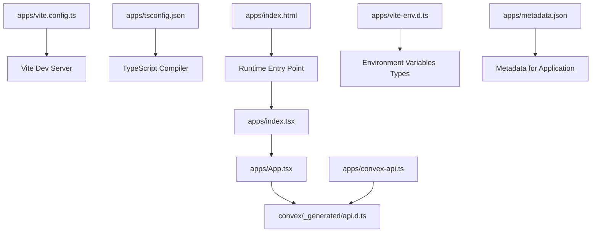
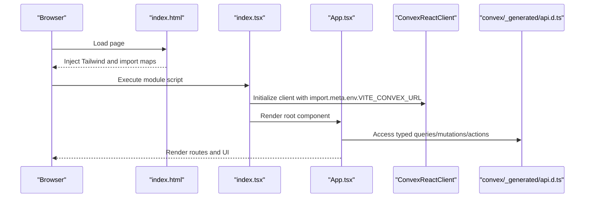
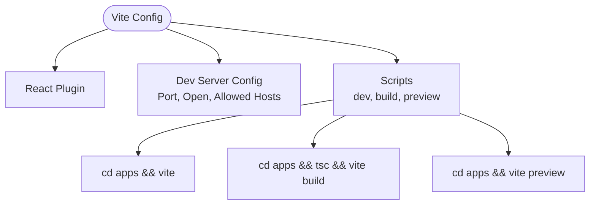
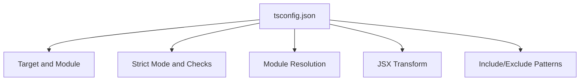
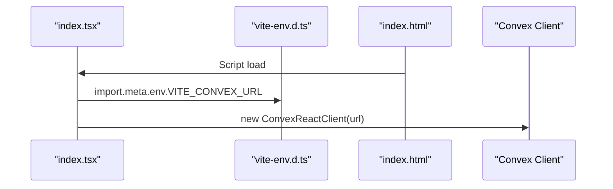
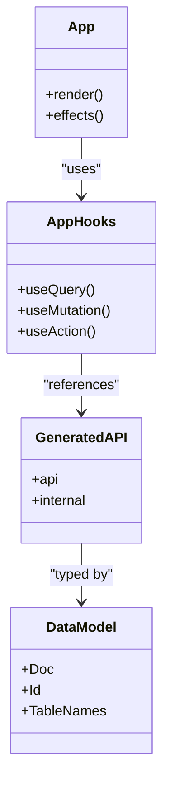
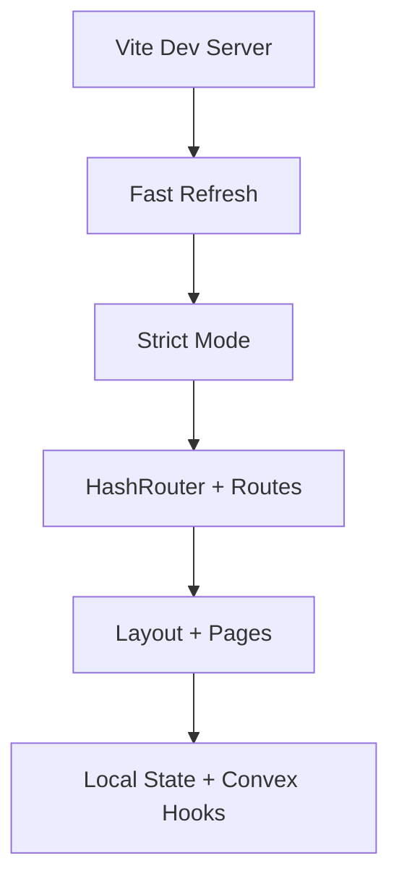
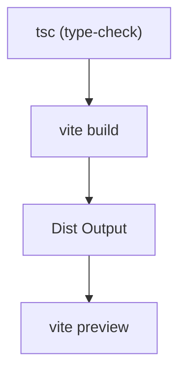
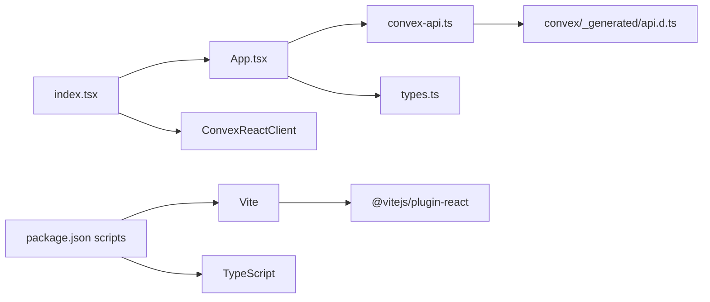

# Build Configuration

<cite>
**Referenced Files in This Document**
- [vite.config.ts](file://apps/vite.config.ts)
- [tsconfig.json](file://apps/tsconfig.json)
- [package.json](file://package.json)
- [index.html](file://apps/index.html)
- [index.tsx](file://apps/index.tsx)
- [App.tsx](file://apps/App.tsx)
- [convex-api.ts](file://apps/convex-api.ts)
- [metadata.json](file://apps/metadata.json)
- [vite-env.d.ts](file://apps/vite-env.d.ts)
- [types.ts](file://apps/types.ts)
- [schema.ts](file://convex/schema.ts)
- [api.d.ts](file://convex/_generated/api.d.ts)
- [dataModel.d.ts](file://convex/_generated/dataModel.d.ts)
</cite>

## Table of Contents
1. [Introduction](#introduction)
2. [Project Structure](#project-structure)
3. [Core Components](#core-components)
4. [Architecture Overview](#architecture-overview)
5. [Detailed Component Analysis](#detailed-component-analysis)
6. [Dependency Analysis](#dependency-analysis)
7. [Performance Considerations](#performance-considerations)
8. [Troubleshooting Guide](#troubleshooting-guide)
9. [Conclusion](#conclusion)
10. [Appendices](#appendices)

## Introduction
This document describes the build configuration for the KR-FUELS Vite-based React application. It covers Vite configuration, TypeScript settings, Convex integration via generated API types, environment variable handling, development server setup, and deployment preparation. It also outlines performance optimization techniques, code splitting strategies, and troubleshooting guidance.

## Project Structure
The build system centers around a single Vite application under apps/. Key configuration and entry points:
- Vite configuration defines plugins and development server behavior.
- TypeScript configuration controls compile-time behavior and strictness.
- The HTML template sets up the runtime environment and imports external modules via import maps.
- The React entry initializes Convex client integration and mounts the root component.
- Convex-generated types and API utilities power type-safe data access.

**Diagram sources**
- [vite.config.ts](file://apps/vite.config.ts#L1-L16)
- [tsconfig.json](file://apps/tsconfig.json#L1-L24)
- [index.html](file://apps/index.html#L1-L133)
- [index.tsx](file://apps/index.tsx#L1-L23)
- [App.tsx](file://apps/App.tsx#L1-L266)
- [convex-api.ts](file://apps/convex-api.ts#L1-L33)
- [api.d.ts](file://convex/_generated/api.d.ts#L1-L76)
- [vite-env.d.ts](file://apps/vite-env.d.ts#L1-L10)
- [metadata.json](file://apps/metadata.json#L1-L5)

**Section sources**
- [vite.config.ts](file://apps/vite.config.ts#L1-L16)
- [tsconfig.json](file://apps/tsconfig.json#L1-L24)
- [index.html](file://apps/index.html#L1-L133)
- [index.tsx](file://apps/index.tsx#L1-L23)
- [App.tsx](file://apps/App.tsx#L1-L266)
- [convex-api.ts](file://apps/convex-api.ts#L1-L33)
- [api.d.ts](file://convex/_generated/api.d.ts#L1-L76)
- [vite-env.d.ts](file://apps/vite-env.d.ts#L1-L10)
- [metadata.json](file://apps/metadata.json#L1-L5)

## Core Components
- Vite configuration
  - Plugin: React Fast Refresh and JSX transform.
  - Development server: Port, auto-open browser, allowed hosts for remote access.
- TypeScript configuration
  - Modern target and module resolution.
  - Strict mode enabled with practical defaults.
  - No emit for type-checking only.
- Environment variables
  - Typed Vite import.meta.env for Convex URL.
- Convex integration
  - Generated API types and data model types.
  - App-level hooks for queries, mutations, and actions.
- HTML template
  - Tailwind CDN, theme configuration, print styles, and import maps for modern ESM delivery.

**Section sources**
- [vite.config.ts](file://apps/vite.config.ts#L5-L15)
- [tsconfig.json](file://apps/tsconfig.json#L3-L20)
- [vite-env.d.ts](file://apps/vite-env.d.ts#L3-L9)
- [api.d.ts](file://convex/_generated/api.d.ts#L32-L76)
- [dataModel.d.ts](file://convex/_generated/dataModel.d.ts#L11-L61)
- [index.html](file://apps/index.html#L12-L127)
- [index.tsx](file://apps/index.tsx#L4-L8)

## Architecture Overview
The build pipeline integrates Vite, React, TypeScript, and Convex. The runtime loads React and related libraries via import maps, initializes the Convex client using a typed environment variable, and renders the application routes. Convex-generated types ensure type-safe access to backend functions.

**Diagram sources**
- [index.html](file://apps/index.html#L115-L127)
- [index.tsx](file://apps/index.tsx#L4-L8)
- [App.tsx](file://apps/App.tsx#L16-L17)
- [api.d.ts](file://convex/_generated/api.d.ts#L32-L76)

## Detailed Component Analysis

### Vite Configuration
- Plugins
  - React plugin enables JSX transform and Fast Refresh.
- Development server
  - Port is set to a common development value.
  - Auto-open browser on startup.
  - Allowed hosts list supports remote access during development.
- Build targets and scripts
  - Scripts orchestrate TypeScript type-check and Vite build for production.

**Diagram sources**
- [vite.config.ts](file://apps/vite.config.ts#L5-L15)
- [package.json](file://package.json#L6-L10)

**Section sources**
- [vite.config.ts](file://apps/vite.config.ts#L5-L15)
- [package.json](file://package.json#L6-L10)

### TypeScript Configuration
- Compiler options
  - Targets modern JavaScript environments.
  - Strict mode enabled with pragmatic allowances.
  - Module resolution uses Node strategy.
  - JSX configured for React.
- Include/exclude
  - Includes all TS/TSX files under the apps directory.
  - Excludes node_modules.

**Diagram sources**
- [tsconfig.json](file://apps/tsconfig.json#L3-L22)

**Section sources**
- [tsconfig.json](file://apps/tsconfig.json#L3-L22)

### Environment Variables and Runtime Setup
- Typed environment interface
  - VITE_CONVEX_URL is declared for use in the React entry.
- Runtime initialization
  - Convex client is constructed using the environment variable.
- HTML import maps
  - External libraries are loaded via ESM CDN links for fast iteration.

**Diagram sources**
- [vite-env.d.ts](file://apps/vite-env.d.ts#L3-L9)
- [index.tsx](file://apps/index.tsx#L4-L8)
- [index.html](file://apps/index.html#L115-L127)

**Section sources**
- [vite-env.d.ts](file://apps/vite-env.d.ts#L3-L9)
- [index.tsx](file://apps/index.tsx#L4-L8)
- [index.html](file://apps/index.html#L115-L127)

### Convex Integration and API Generation
- Generated API types
  - api.d.ts exposes a strongly-typed api object for public functions.
  - dataModel.d.ts provides table and ID types derived from schema.ts.
- App-level hooks
  - convex-api.ts wraps Convex hooks for queries, mutations, and actions.
- Frontend usage
  - App.tsx consumes generated types and hooks to fetch and mutate data.

**Diagram sources**
- [api.d.ts](file://convex/_generated/api.d.ts#L32-L76)
- [dataModel.d.ts](file://convex/_generated/dataModel.d.ts#L20-L61)
- [convex-api.ts](file://apps/convex-api.ts#L1-L33)
- [App.tsx](file://apps/App.tsx#L16-L32)

**Section sources**
- [api.d.ts](file://convex/_generated/api.d.ts#L32-L76)
- [dataModel.d.ts](file://convex/_generated/dataModel.d.ts#L20-L61)
- [convex-api.ts](file://apps/convex-api.ts#L1-L33)
- [App.tsx](file://apps/App.tsx#L16-L32)
- [schema.ts](file://convex/schema.ts#L1-L85)

### Development Workflow and Hot Module Replacement
- React Fast Refresh
  - Enabled via the React plugin in Vite.
- Strict Mode rendering
  - Root component is wrapped in React.StrictMode.
- Routing and layout
  - HashRouter and route definitions enable navigation without a backend router.
- Idle logout and state management
  - Hooks and local storage manage user session and bunk selection.

**Diagram sources**
- [vite.config.ts](file://apps/vite.config.ts#L6-L6)
- [index.tsx](file://apps/index.tsx#L17-L22)
- [App.tsx](file://apps/App.tsx#L2-L262)

**Section sources**
- [vite.config.ts](file://apps/vite.config.ts#L6-L6)
- [index.tsx](file://apps/index.tsx#L17-L22)
- [App.tsx](file://apps/App.tsx#L2-L262)

### Build Targets and Deployment Preparation
- Build command
  - TypeScript type-check followed by Vite build produces optimized assets.
- Preview
  - Local preview of built assets.
- Metadata
  - metadata.json provides application name and description for platform integrations.

**Diagram sources**
- [package.json](file://package.json#L6-L10)
- [metadata.json](file://apps/metadata.json#L1-L5)

**Section sources**
- [package.json](file://package.json#L6-L10)
- [metadata.json](file://apps/metadata.json#L1-L5)

## Dependency Analysis
- Internal dependencies
  - App imports Convex hooks and generated API types.
  - App types define domain interfaces used across components.
- External dependencies
  - React, React DOM, React Router Dom, Lucide React, Convex SDK.
- Tooling dependencies
  - Vite, @vitejs/plugin-react, TypeScript.

**Diagram sources**
- [App.tsx](file://apps/App.tsx#L16-L17)
- [convex-api.ts](file://apps/convex-api.ts#L1-L33)
- [api.d.ts](file://convex/_generated/api.d.ts#L32-L76)
- [types.ts](file://apps/types.ts#L1-L56)
- [index.tsx](file://apps/index.tsx#L4-L8)
- [package.json](file://package.json#L11-L26)
- [vite.config.ts](file://apps/vite.config.ts#L6-L6)

**Section sources**
- [App.tsx](file://apps/App.tsx#L16-L17)
- [convex-api.ts](file://apps/convex-api.ts#L1-L33)
- [api.d.ts](file://convex/_generated/api.d.ts#L32-L76)
- [types.ts](file://apps/types.ts#L1-L56)
- [index.tsx](file://apps/index.tsx#L4-L8)
- [package.json](file://package.json#L11-L26)
- [vite.config.ts](file://apps/vite.config.ts#L6-L6)

## Performance Considerations
- Code splitting
  - Route-based lazy loading can be introduced by dynamically importing page components to reduce initial bundle size.
- Tree shaking and module resolution
  - Keep moduleResolution as Node and use ESNext modules to maximize dead-code elimination.
- Asset optimization
  - Enable Vite’s default minification and asset inlining for images/fonts as appropriate.
- Bundle analysis
  - Use a Vite plugin for bundle visualization (e.g., vite-bundle-analyzer) to inspect dependencies and optimize large imports.
- Strict mode and checks
  - Maintain strict TypeScript settings to catch performance-impacting issues early.

[No sources needed since this section provides general guidance]

## Troubleshooting Guide
- Missing Convex URL
  - Ensure VITE_CONVEX_URL is present in the environment; otherwise, the Convex client initialization will fail.
- Remote access issues
  - Verify allowed hosts in Vite config match the hostname being used for development.
- Import map errors
  - Confirm import map versions align with installed library versions.
- Type errors after Convex schema changes
  - Re-run Convex dev to regenerate api.d.ts and dataModel.d.ts.
- Build failures
  - Run type-check first; resolve TS errors before building with Vite.

**Section sources**
- [vite-env.d.ts](file://apps/vite-env.d.ts#L3-L9)
- [vite.config.ts](file://apps/vite.config.ts#L7-L12)
- [index.html](file://apps/index.html#L115-L127)
- [api.d.ts](file://convex/_generated/api.d.ts#L7-L7)
- [dataModel.d.ts](file://convex/_generated/dataModel.d.ts#L7-L7)

## Conclusion
The KR-FUELS build configuration leverages Vite for a fast development experience, TypeScript for strong typing, and Convex for backend integration. The setup is minimal and extensible—ready for code splitting, bundle analysis, and production optimizations while maintaining a smooth developer workflow.

[No sources needed since this section summarizes without analyzing specific files]

## Appendices
- Environment variables reference
  - VITE_CONVEX_URL: Convex backend URL used at runtime.
- Paths and aliases
  - No explicit path aliases are configured; absolute imports are used within the apps directory.

**Section sources**
- [vite-env.d.ts](file://apps/vite-env.d.ts#L3-L9)
- [index.tsx](file://apps/index.tsx#L8-L8)