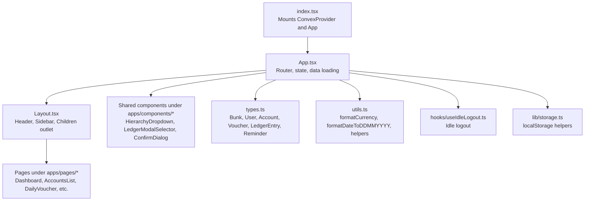
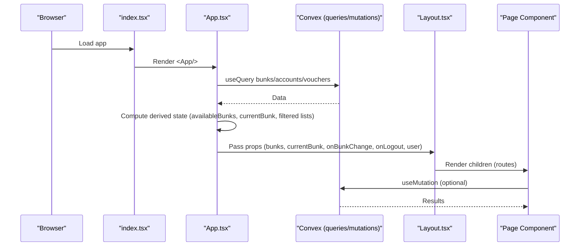
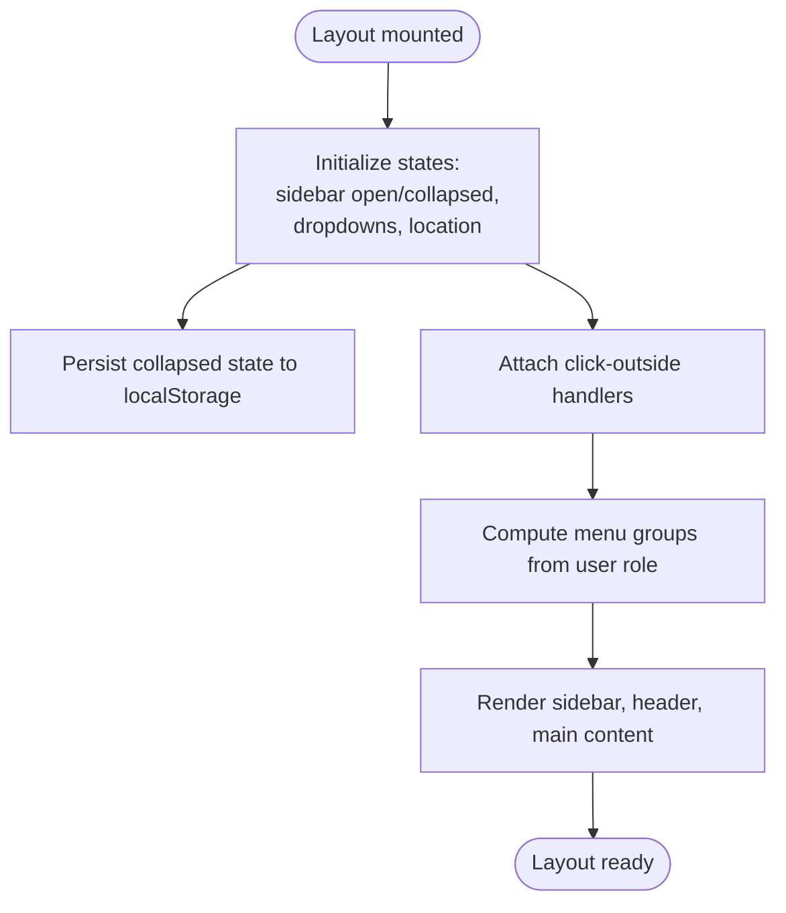
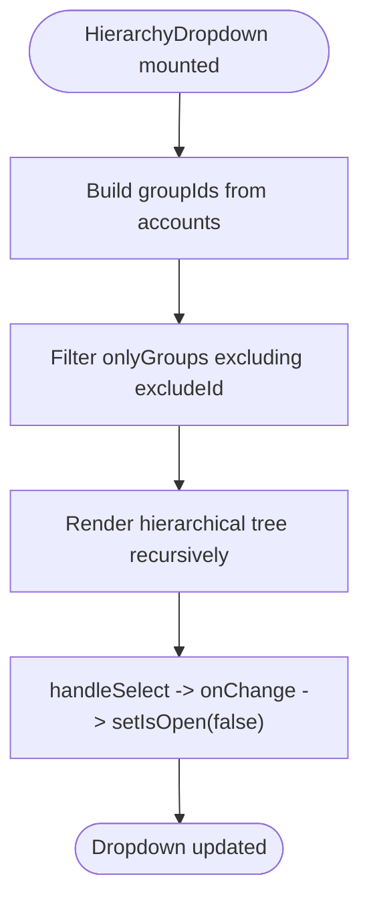
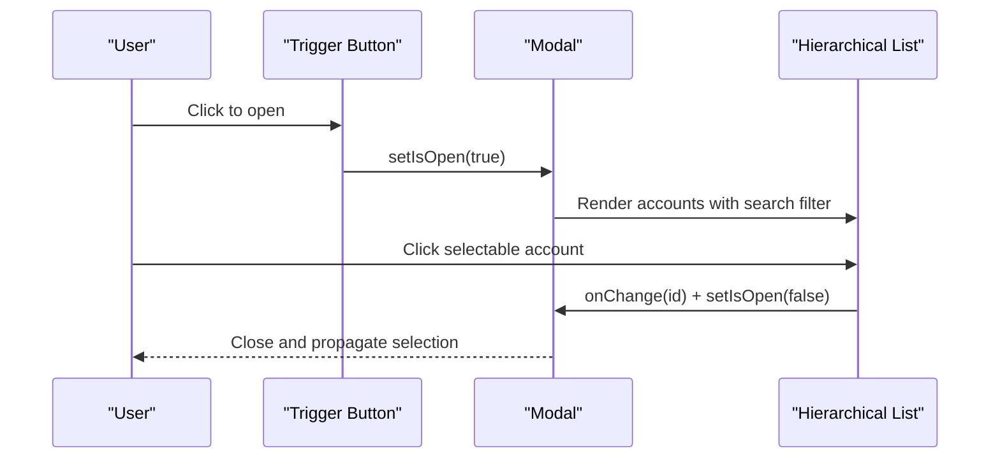
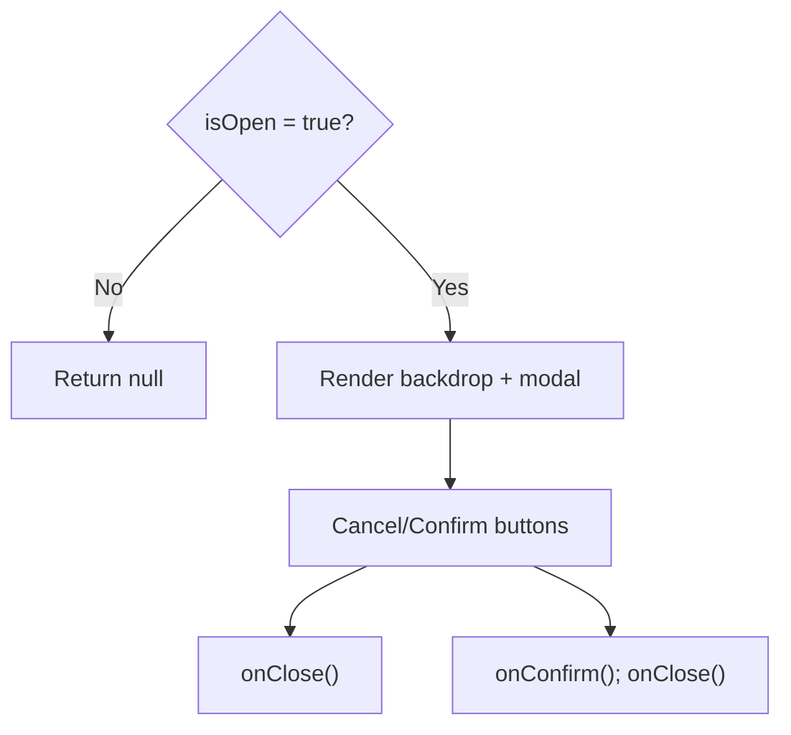
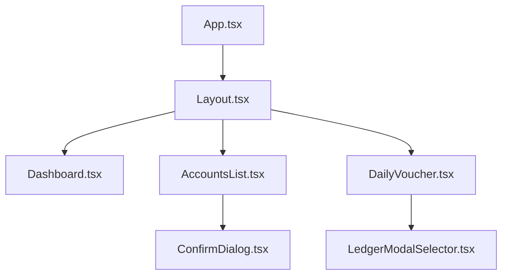
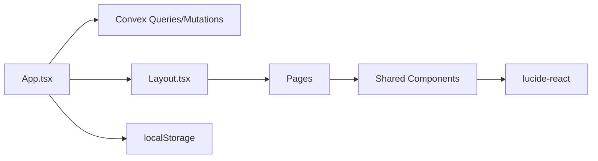

# Component Structure

<cite>
**Referenced Files in This Document**
- [Layout.tsx](file://apps/components/Layout.tsx)
- [HierarchyDropdown.tsx](file://apps/components/HierarchyDropdown.tsx)
- [ConfirmDialog.tsx](file://apps/components/ConfirmDialog.tsx)
- [LedgerModalSelector.tsx](file://apps/components/LedgerModalSelector.tsx)
- [App.tsx](file://apps/App.tsx)
- [Dashboard.tsx](file://apps/pages/Dashboard.tsx)
- [DailyVoucher.tsx](file://apps/pages/DailyVoucher.tsx)
- [AccountsList.tsx](file://apps/pages/AccountsList.tsx)
- [Login.tsx](file://apps/pages/Login.tsx)
- [types.ts](file://apps/types.ts)
- [utils.ts](file://apps/utils.ts)
- [index.tsx](file://apps/index.tsx)
- [useIdleLogout.ts](file://apps/hooks/useIdleLogout.ts)
- [storage.ts](file://apps/lib/storage.ts)
</cite>

## Table of Contents
1. [Introduction](#introduction)
2. [Project Structure](#project-structure)
3. [Core Components](#core-components)
4. [Architecture Overview](#architecture-overview)
5. [Detailed Component Analysis](#detailed-component-analysis)
6. [Dependency Analysis](#dependency-analysis)
7. [Performance Considerations](#performance-considerations)
8. [Troubleshooting Guide](#troubleshooting-guide)
9. [Conclusion](#conclusion)
10. [Appendices](#appendices)

## Introduction
This document describes the React component structure of KR-FUELS with a focus on the Layout component as the main orchestrator and the reusable UI components that compose the application. It explains component composition patterns, prop drilling strategies, state management integration, lifecycle and rendering optimization, styling and responsiveness, accessibility, testing and debugging strategies, and extension/customization guidelines. The goal is to help developers understand how the system is organized and how to extend it safely and efficiently.

## Project Structure
KR-FUELS organizes its frontend under apps/. The main orchestration occurs in App.tsx, which renders routes and passes data and callbacks down to pages and shared components. The Layout component wraps page content and provides global navigation, user controls, and bunk selection. Shared UI components live under apps/components/, while page-specific components live under apps/pages/.

**Diagram sources**
- [index.tsx](file://apps/index.tsx#L1-L23)
- [App.tsx](file://apps/App.tsx#L1-L266)
- [Layout.tsx](file://apps/components/Layout.tsx#L1-L311)
- [types.ts](file://apps/types.ts#L1-L56)
- [utils.ts](file://apps/utils.ts#L1-L69)
- [useIdleLogout.ts](file://apps/hooks/useIdleLogout.ts#L1-L33)
- [storage.ts](file://apps/lib/storage.ts#L1-L34)

**Section sources**
- [index.tsx](file://apps/index.tsx#L1-L23)
- [App.tsx](file://apps/App.tsx#L1-L266)

## Core Components
This section focuses on the main orchestrator and reusable UI components.

- Layout
  - Purpose: Provides global layout, navigation, user/profile dropdown, bunk selection, and renders page children.
  - Props: children, bunks, currentBunk, onBunkChange, onLogout, user.
  - Responsibilities: Sidebar menu generation, active state detection, click-outside handlers, local persistence of sidebar collapse state, header controls.
  - Composition: Uses Lucide icons, react-router-dom Link, and internal dropdowns for bunk and profile.

- HierarchyDropdown
  - Purpose: Renders a hierarchical dropdown for selecting grouped accounts, excluding a specific id if needed.
  - Props: accounts, selectedId, onChange, excludeId?, label?, placeholder?, required?.
  - Composition: Builds nested tree recursively, handles click-outside, optional HTML5 required field via hidden input.

- LedgerModalSelector
  - Purpose: Modal-based selector for ledger accounts with search and grouping options.
  - Props: accounts, selectedId, onChange, label, placeholder?, compact?, labelClassName?, triggerHeight?, allowGroups?.
  - Composition: Modal overlay, search input, hierarchical rendering, selectable vs non-selectable nodes, focused input on open.

- ConfirmDialog
  - Purpose: Confirmation dialog with destructive option and customizable labels.
  - Props: isOpen, onClose, onConfirm, title, message, confirmLabel?, cancelLabel?, isDestructive?.
  - Composition: Backdrop, centered modal, action buttons, close button.

**Section sources**
- [Layout.tsx](file://apps/components/Layout.tsx#L62-L311)
- [HierarchyDropdown.tsx](file://apps/components/HierarchyDropdown.tsx#L6-L138)
- [LedgerModalSelector.tsx](file://apps/components/LedgerModalSelector.tsx#L6-L182)
- [ConfirmDialog.tsx](file://apps/components/ConfirmDialog.tsx#L5-L82)

## Architecture Overview
The runtime architecture centers around App.tsx, which manages application-wide state, loads data from Convex, computes derived data, and passes props to Layout and pages. Layout composes the shell and exposes children slots for page content. Shared components encapsulate reusable UI patterns.

**Diagram sources**
- [index.tsx](file://apps/index.tsx#L1-L23)
- [App.tsx](file://apps/App.tsx#L1-L266)
- [Layout.tsx](file://apps/components/Layout.tsx#L1-L311)

## Detailed Component Analysis

### Layout Component
- Orchestration
  - Manages sidebar open/collapse state and persists it to localStorage.
  - Generates menu groups dynamically based on user role.
  - Handles click-outside for dropdowns using refs and event listeners.
  - Computes active nav item based on current route.
- Props and Drilling
  - Receives bunks, currentBunk, onBunkChange, onLogout, user from App.tsx.
  - Passes children to render page content.
- Lifecycle and Rendering
  - Uses memoized menu groups to avoid re-rendering on unrelated updates.
  - Uses refs for DOM access to implement click-outside behavior.
- Accessibility
  - Uses semantic elements (button, nav, div with roles), keyboard-accessible dropdowns, and aria-friendly labels.
- Styling and Responsiveness
  - Tailwind-based responsive layout with mobile-first design, collapsible sidebar, and animated transitions.
- Extension Patterns
  - Add new menu groups conditionally based on user role.
  - Extend dropdowns to support additional actions or filters.

**Diagram sources**
- [Layout.tsx](file://apps/components/Layout.tsx#L71-L135)

**Section sources**
- [Layout.tsx](file://apps/components/Layout.tsx#L71-L311)

### HierarchyDropdown Component
- Composition Pattern
  - Accepts a flat account list and builds a tree via recursion.
  - Filters to include only root and parent group ids to limit visible nodes.
- Props and Validation
  - Supports required flag via hidden input to integrate with form validation.
- Rendering Optimization
  - Memoizes selected account lookup and group id sets.
- Accessibility
  - Keyboard navigable via click; visually indicates selection and depth.

**Diagram sources**
- [HierarchyDropdown.tsx](file://apps/components/HierarchyDropdown.tsx#L24-L91)

**Section sources**
- [HierarchyDropdown.tsx](file://apps/components/HierarchyDropdown.tsx#L1-L138)

### LedgerModalSelector Component
- Composition Pattern
  - Modal wrapper with search input and hierarchical list.
  - allowGroups toggles whether groups are selectable.
- Props and UX
  - Compact mode, custom label class, trigger height, placeholder.
- Rendering Optimization
  - Memoizes parent ids and uses recursive rendering with search filtering.
- Accessibility
  - Focus management on open, clear visual feedback for selection.

**Diagram sources**
- [LedgerModalSelector.tsx](file://apps/components/LedgerModalSelector.tsx#L18-L178)

**Section sources**
- [LedgerModalSelector.tsx](file://apps/components/LedgerModalSelector.tsx#L1-L182)

### ConfirmDialog Component
- Composition Pattern
  - Controlled via isOpen prop; triggers onConfirm and onClose callbacks.
- Styling and UX
  - Destructive vs non-destructive variants; backdrop click closes.
- Accessibility
  - Centered modal with close button; integrates with page-level dialogs.

**Diagram sources**
- [ConfirmDialog.tsx](file://apps/components/ConfirmDialog.tsx#L16-L79)

**Section sources**
- [ConfirmDialog.tsx](file://apps/components/ConfirmDialog.tsx#L1-L82)

### Page Components and Integration
- Dashboard
  - Uses memoized report calculations and date navigation.
  - Displays summary cards, recent activity table, and reminders.
- DailyVoucher
  - Batch editing rows with debit/credit mutual exclusivity, totals computation, and posting logic.
  - Integrates LedgerModalSelector for ledger selection.
- AccountsList
  - Hierarchical display with expand/collapse, search, and delete confirmation via ConfirmDialog.

**Diagram sources**
- [App.tsx](file://apps/App.tsx#L216-L262)
- [Dashboard.tsx](file://apps/pages/Dashboard.tsx#L26-L219)
- [AccountsList.tsx](file://apps/pages/AccountsList.tsx#L24-L254)
- [DailyVoucher.tsx](file://apps/pages/DailyVoucher.tsx#L34-L336)
- [LedgerModalSelector.tsx](file://apps/components/LedgerModalSelector.tsx#L18-L182)
- [ConfirmDialog.tsx](file://apps/components/ConfirmDialog.tsx#L16-L82)

**Section sources**
- [Dashboard.tsx](file://apps/pages/Dashboard.tsx#L26-L219)
- [DailyVoucher.tsx](file://apps/pages/DailyVoucher.tsx#L34-L336)
- [AccountsList.tsx](file://apps/pages/AccountsList.tsx#L24-L254)

## Dependency Analysis
- Data Flow
  - App.tsx fetches data via Convex hooks and derives availableBunks, currentBunk, and filtered lists for the current bunk.
  - Layout receives bunks and currentBunk and exposes onBunkChange and onLogout callbacks.
  - Pages receive domain-specific props (accounts, vouchers) and callbacks for mutations.
- Component Coupling
  - Layout depends on routing and user context; pages depend on shared components for common UI patterns.
  - Shared components are self-contained and accept all necessary data via props.
- External Dependencies
  - Convex for backend queries and mutations.
  - lucide-react for icons.
  - localStorage for persistence of UI and auth state.

**Diagram sources**
- [App.tsx](file://apps/App.tsx#L1-L266)
- [Layout.tsx](file://apps/components/Layout.tsx#L1-L311)
- [index.tsx](file://apps/index.tsx#L1-L23)

**Section sources**
- [App.tsx](file://apps/App.tsx#L1-L266)
- [index.tsx](file://apps/index.tsx#L1-L23)

## Performance Considerations
- Memoization
  - Use useMemo for derived data (e.g., menu groups, report calculations, filtered lists) to prevent unnecessary re-renders.
- Event Handling
  - Attach click-outside handlers once and clean up on unmount to avoid leaks.
- Rendering Optimization
  - Recursive rendering of hierarchical lists should be kept shallow; consider virtualization for very large datasets.
- Lazy Loading
  - Consider lazy-loading heavy pages or modals to reduce initial bundle size.
- Styling
  - Prefer Tailwind utilities for consistent, maintainable styles; avoid excessive inline styles.
- Accessibility
  - Ensure focus management and keyboard navigation for dropdowns and modals.

[No sources needed since this section provides general guidance]

## Troubleshooting Guide
- Idle Logout
  - useIdleLogout monitors user activity and triggers onLogout after a configured timeout. Verify event listeners are attached and cleared properly.
- Storage
  - storage.ts centralizes localStorage keys. Ensure tokens and user data are cleared on logout.
- Routing and Navigation
  - Layout uses react-router-dom Link and navigation guards in pages (e.g., DailyVoucher hashchange). Validate route paths and guards.
- Data Synchronization
  - App.tsx maps Convex data to internal types. Verify shape and presence of required fields before passing to components.
- Styling Issues
  - Responsive breakpoints and animations rely on Tailwind classes. Check for conflicting styles and ensure z-index stacking for overlays.

**Section sources**
- [useIdleLogout.ts](file://apps/hooks/useIdleLogout.ts#L1-L33)
- [storage.ts](file://apps/lib/storage.ts#L1-L34)
- [App.tsx](file://apps/App.tsx#L76-L114)
- [DailyVoucher.tsx](file://apps/pages/DailyVoucher.tsx#L165-L190)

## Conclusion
KR-FUELS employs a clear separation of concerns: App.tsx manages application state and data, Layout orchestrates the shell and navigation, and shared components encapsulate reusable UI patterns. Props are passed explicitly to minimize coupling, with memoization and lifecycle cleanup supporting performance and stability. The component ecosystem supports extension through additional menu groups, modal selectors, and confirmation dialogs, enabling rapid feature development while maintaining consistency and accessibility.

[No sources needed since this section summarizes without analyzing specific files]

## Appendices

### Component Lifecycle and Rendering Optimization Checklist
- Use useEffect for side effects and cleanup.
- Use useMemo for expensive computations and derived data.
- Use refs for DOM interactions (e.g., click-outside).
- Keep recursive rendering efficient; consider pagination or virtualization.
- Ensure controlled components (modals, dropdowns) manage open/close state internally.

[No sources needed since this section provides general guidance]

### Accessibility Best Practices
- Provide labels and aria attributes for interactive elements.
- Manage focus for modals and dropdowns.
- Ensure keyboard navigation support.
- Use semantic HTML and proper contrast ratios.

[No sources needed since this section provides general guidance]

### Testing Strategies
- Unit tests for pure functions in utils.ts.
- Component tests for shared components focusing on prop-driven rendering and user interactions.
- Integration tests for page components validating data flow from App.tsx to UI.
- Snapshot tests for static layouts; interaction tests for dynamic components.

[No sources needed since this section provides general guidance]

### Debugging Approaches
- Enable React DevTools Profiler to identify expensive renders.
- Use console logging strategically in useEffect and callbacks.
- Validate prop shapes against types.ts.
- Inspect localStorage keys for persisted state.

[No sources needed since this section provides general guidance]

### Maintenance Guidelines
- Centralize shared logic in utilities and hooks.
- Keep shared components generic via props.
- Document prop contracts and behavior.
- Regularly review memoization and event handler cleanup.

[No sources needed since this section provides general guidance]