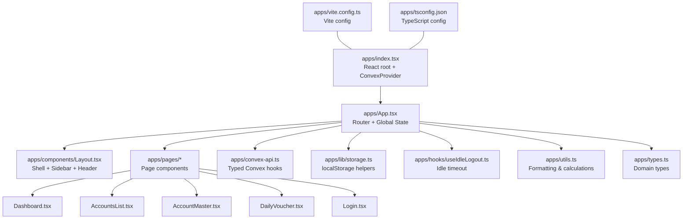
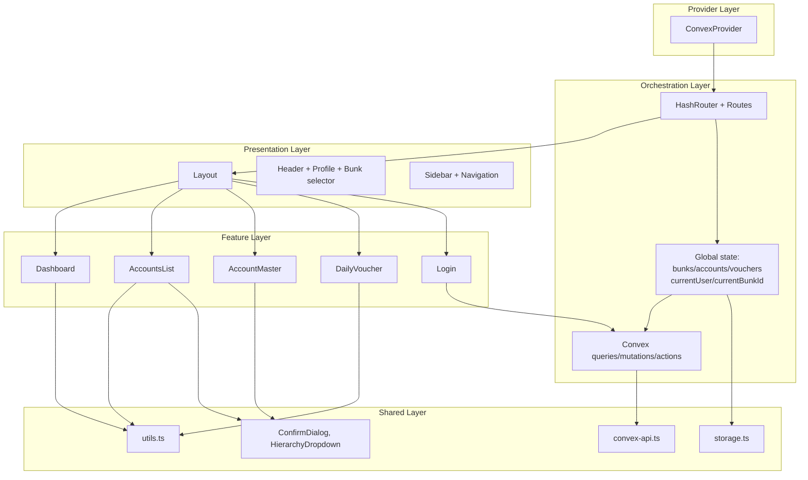
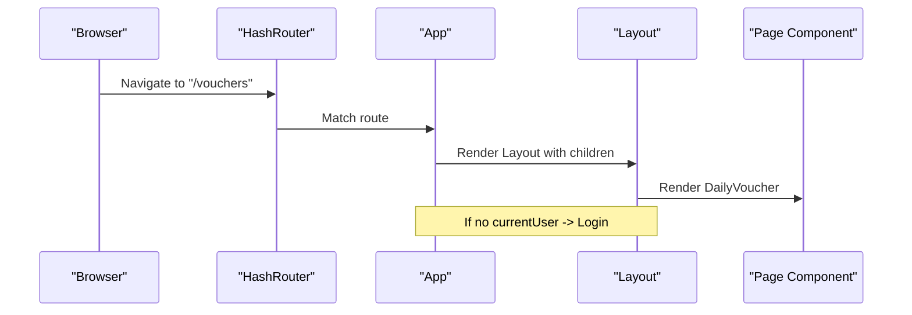
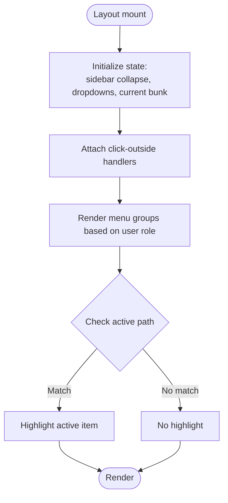
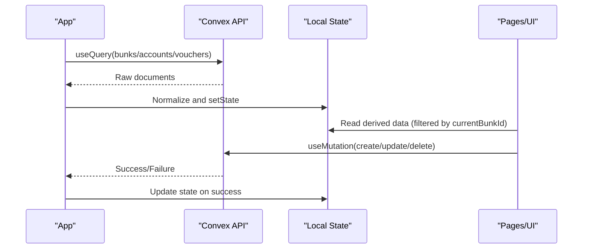
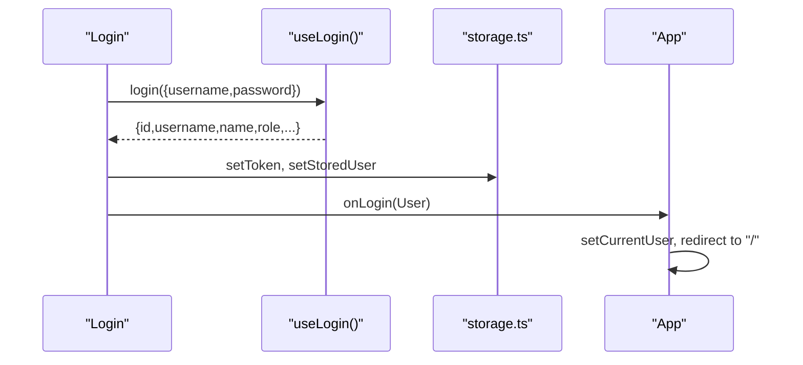
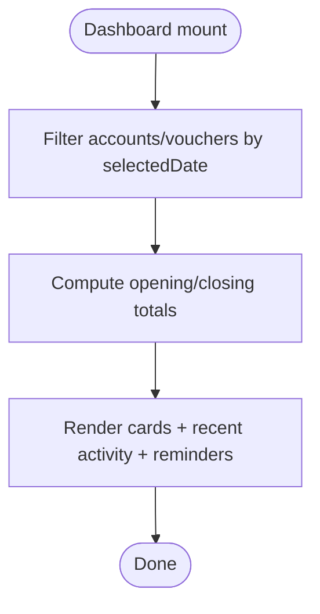
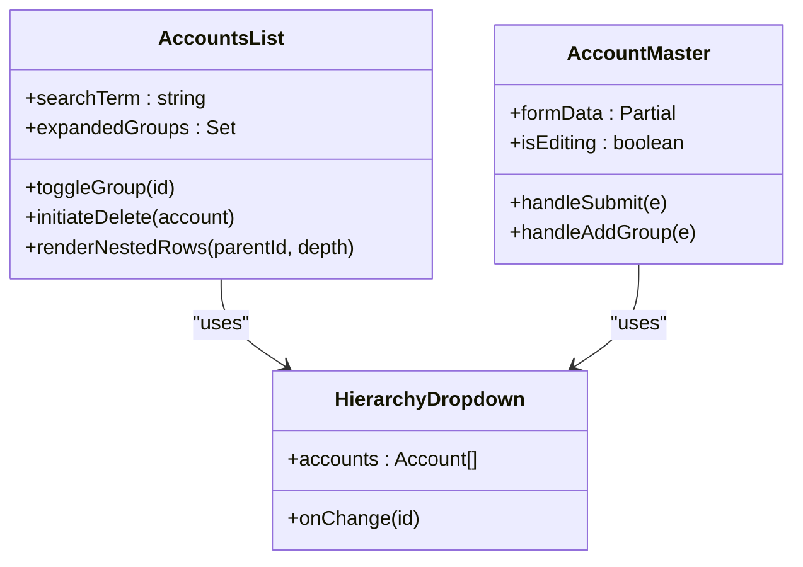
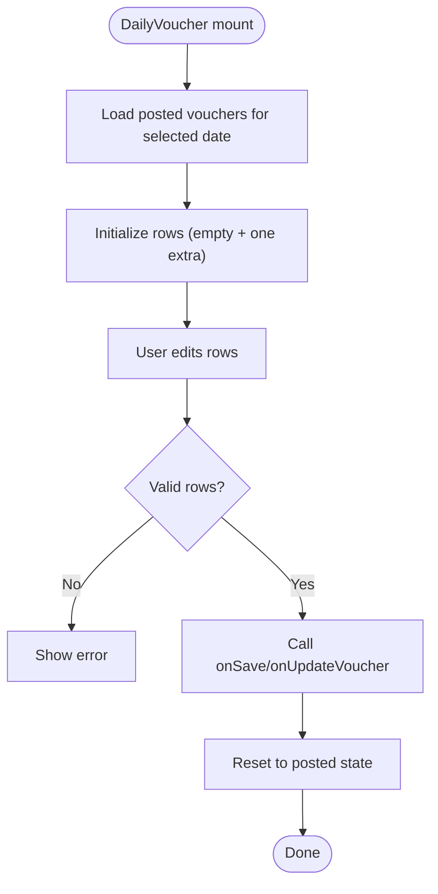
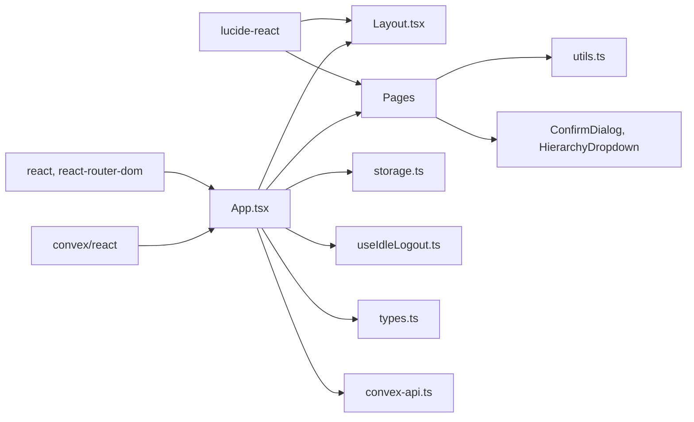

# Frontend Architecture

<cite>
**Referenced Files in This Document**
- [apps/index.tsx](file://apps/index.tsx)
- [apps/App.tsx](file://apps/App.tsx)
- [apps/vite.config.ts](file://apps/vite.config.ts)
- [apps/tsconfig.json](file://apps/tsconfig.json)
- [apps/types.ts](file://apps/types.ts)
- [apps/lib/storage.ts](file://apps/lib/storage.ts)
- [apps/hooks/useIdleLogout.ts](file://apps/hooks/useIdleLogout.ts)
- [apps/utils.ts](file://apps/utils.ts)
- [apps/convex-api.ts](file://apps/convex-api.ts)
- [apps/components/Layout.tsx](file://apps/components/Layout.tsx)
- [apps/pages/Login.tsx](file://apps/pages/Login.tsx)
- [apps/pages/Dashboard.tsx](file://apps/pages/Dashboard.tsx)
- [apps/pages/AccountsList.tsx](file://apps/pages/AccountsList.tsx)
- [apps/pages/AccountMaster.tsx](file://apps/pages/AccountMaster.tsx)
- [apps/pages/DailyVoucher.tsx](file://apps/pages/DailyVoucher.tsx)
- [apps/components/ConfirmDialog.tsx](file://apps/components/ConfirmDialog.tsx)
- [apps/components/HierarchyDropdown.tsx](file://apps/components/HierarchyDropdown.tsx)
</cite>

## Table of Contents
1. [Introduction](#introduction)
2. [Project Structure](#project-structure)
3. [Core Components](#core-components)
4. [Architecture Overview](#architecture-overview)
5. [Detailed Component Analysis](#detailed-component-analysis)
6. [Dependency Analysis](#dependency-analysis)
7. [Performance Considerations](#performance-considerations)
8. [Troubleshooting Guide](#troubleshooting-guide)
9. [Conclusion](#conclusion)
10. [Appendices](#appendices)

## Introduction
This document describes the frontend architecture of the KR-FUELS React 19 application. It covers the component hierarchy, layout orchestration, routing and navigation, state management (local and Convex-backed), reusable UI patterns, styling and responsiveness, accessibility, build configuration with Vite and TypeScript, performance optimization, testing and debugging approaches, and guidance for extending the system while maintaining code quality.

## Project Structure
The frontend is organized around a small set of directories and files:
- apps/index.tsx initializes the React root and wraps the app in Convex’s provider.
- apps/App.tsx defines the router, global state, and routes to page components.
- apps/components contains shared UI scaffolding and dialogs.
- apps/pages contains page-level components for dashboards, forms, and lists.
- apps/hooks contains reusable React hooks (e.g., idle logout).
- apps/lib contains storage helpers for user/session persistence.
- apps/utils contains shared formatting and calculation utilities.
- apps/convex-api.ts exposes typed Convex hooks for actions, queries, and mutations.
- apps/types.ts defines domain interfaces used across the app.
- apps/vite.config.ts configures Vite dev server and plugins.
- apps/tsconfig.json configures TypeScript strictness and JSX transform.

**Diagram sources**
- [apps/index.tsx](file://apps/index.tsx#L1-L23)
- [apps/App.tsx](file://apps/App.tsx#L1-L266)
- [apps/components/Layout.tsx](file://apps/components/Layout.tsx#L1-L311)
- [apps/pages/Dashboard.tsx](file://apps/pages/Dashboard.tsx#L1-L219)
- [apps/pages/AccountsList.tsx](file://apps/pages/AccountsList.tsx#L1-L254)
- [apps/pages/AccountMaster.tsx](file://apps/pages/AccountMaster.tsx#L1-L228)
- [apps/pages/DailyVoucher.tsx](file://apps/pages/DailyVoucher.tsx#L1-L336)
- [apps/pages/Login.tsx](file://apps/pages/Login.tsx#L1-L167)
- [apps/convex-api.ts](file://apps/convex-api.ts#L1-L33)
- [apps/lib/storage.ts](file://apps/lib/storage.ts#L1-L34)
- [apps/hooks/useIdleLogout.ts](file://apps/hooks/useIdleLogout.ts#L1-L33)
- [apps/utils.ts](file://apps/utils.ts#L1-L69)
- [apps/types.ts](file://apps/types.ts#L1-L56)
- [apps/vite.config.ts](file://apps/vite.config.ts#L1-L16)
- [apps/tsconfig.json](file://apps/tsconfig.json#L1-L24)

**Section sources**
- [apps/index.tsx](file://apps/index.tsx#L1-L23)
- [apps/App.tsx](file://apps/App.tsx#L1-L266)
- [apps/vite.config.ts](file://apps/vite.config.ts#L1-L16)
- [apps/tsconfig.json](file://apps/tsconfig.json#L1-L24)

## Core Components
- Root initialization: The React root mounts under a ConvexProvider, enabling Convex hooks across the app.
- App shell: Orchestrates routing, global state, user session, and Convex data synchronization.
- Layout: Provides the persistent header, collapsible sidebar, and main content area with nested routes.
- Pages: Feature-specific screens for dashboards, account management, daily vouchers, and login.
- Shared UI: Reusable components like ConfirmDialog and HierarchyDropdown.
- Utilities: Formatting, calculations, and typed Convex hooks.

Key implementation patterns:
- Props-driven composition: Layout receives bunks, current bunk, user, and callbacks.
- Local state with controlled effects: Data fetched via Convex is normalized and stored locally for filtering and rendering.
- Event-driven updates: Mutations update Convex; local state reflects changes via effects.

**Section sources**
- [apps/index.tsx](file://apps/index.tsx#L1-L23)
- [apps/App.tsx](file://apps/App.tsx#L1-L266)
- [apps/components/Layout.tsx](file://apps/components/Layout.tsx#L1-L311)
- [apps/pages/Dashboard.tsx](file://apps/pages/Dashboard.tsx#L1-L219)
- [apps/pages/AccountsList.tsx](file://apps/pages/AccountsList.tsx#L1-L254)
- [apps/pages/AccountMaster.tsx](file://apps/pages/AccountMaster.tsx#L1-L228)
- [apps/pages/DailyVoucher.tsx](file://apps/pages/DailyVoucher.tsx#L1-L336)
- [apps/pages/Login.tsx](file://apps/pages/Login.tsx#L1-L167)
- [apps/components/ConfirmDialog.tsx](file://apps/components/ConfirmDialog.tsx#L1-L82)
- [apps/components/HierarchyDropdown.tsx](file://apps/components/HierarchyDropdown.tsx#L1-L138)
- [apps/convex-api.ts](file://apps/convex-api.ts#L1-L33)
- [apps/lib/storage.ts](file://apps/lib/storage.ts#L1-L34)
- [apps/hooks/useIdleLogout.ts](file://apps/hooks/useIdleLogout.ts#L1-L33)
- [apps/utils.ts](file://apps/utils.ts#L1-L69)
- [apps/types.ts](file://apps/types.ts#L1-L56)

## Architecture Overview
The frontend follows a layered pattern:
- Provider layer: ConvexProvider at the root.
- Orchestration layer: App manages routing, user session, and global data.
- Presentation layer: Layout composes page components.
- Feature layer: Page components encapsulate domain logic and UI.
- Shared layer: Utilities, typed Convex hooks, and reusable UI components.

**Diagram sources**
- [apps/index.tsx](file://apps/index.tsx#L1-L23)
- [apps/App.tsx](file://apps/App.tsx#L1-L266)
- [apps/components/Layout.tsx](file://apps/components/Layout.tsx#L1-L311)
- [apps/pages/Dashboard.tsx](file://apps/pages/Dashboard.tsx#L1-L219)
- [apps/pages/AccountsList.tsx](file://apps/pages/AccountsList.tsx#L1-L254)
- [apps/pages/AccountMaster.tsx](file://apps/pages/AccountMaster.tsx#L1-L228)
- [apps/pages/DailyVoucher.tsx](file://apps/pages/DailyVoucher.tsx#L1-L336)
- [apps/pages/Login.tsx](file://apps/pages/Login.tsx#L1-L167)
- [apps/convex-api.ts](file://apps/convex-api.ts#L1-L33)
- [apps/lib/storage.ts](file://apps/lib/storage.ts#L1-L34)
- [apps/utils.ts](file://apps/utils.ts#L1-L69)
- [apps/components/ConfirmDialog.tsx](file://apps/components/ConfirmDialog.tsx#L1-L82)
- [apps/components/HierarchyDropdown.tsx](file://apps/components/HierarchyDropdown.tsx#L1-L138)

## Detailed Component Analysis

### Routing and Navigation
- Hash routing is used for simplicity and compatibility.
- Protected navigation: The app renders Login when no user is present; otherwise it renders Layout with nested routes.
- Dynamic routes: AccountMaster supports both create and edit modes via URL params.
- Role-based visibility: Administration route is shown only for super_admin.

**Diagram sources**
- [apps/App.tsx](file://apps/App.tsx#L1-L266)
- [apps/components/Layout.tsx](file://apps/components/Layout.tsx#L1-L311)
- [apps/pages/DailyVoucher.tsx](file://apps/pages/DailyVoucher.tsx#L1-L336)
- [apps/pages/Login.tsx](file://apps/pages/Login.tsx#L1-L167)

**Section sources**
- [apps/App.tsx](file://apps/App.tsx#L1-L266)

### Layout Orchestration
- Persistent header with user profile dropdown, active bunk selection, and mobile sidebar toggle.
- Collapsible sidebar with grouped navigation items and active-state highlighting.
- Local persistence for sidebar collapse state and current bunk selection.
- Responsive breakpoints for desktop vs. mobile layouts.

**Diagram sources**
- [apps/components/Layout.tsx](file://apps/components/Layout.tsx#L1-L311)

**Section sources**
- [apps/components/Layout.tsx](file://apps/components/Layout.tsx#L1-L311)

### Global State Management
- Convex-backed data: Queries for bunks, accounts, vouchers, reminders are loaded at the root.
- Local normalization: Raw Convex documents are mapped to domain types and stored in React state.
- Derived state: Computed filters (e.g., accounts/vouchers per bunk) and availability logic (e.g., accessible bunks per role).
- Session state: Current user and current bunk are persisted in localStorage and React state.
- Mutations: CRUD operations for accounts and vouchers are executed via Convex mutations; errors are surfaced to the user.

**Diagram sources**
- [apps/App.tsx](file://apps/App.tsx#L1-L266)
- [apps/convex-api.ts](file://apps/convex-api.ts#L1-L33)
- [apps/types.ts](file://apps/types.ts#L1-L56)

**Section sources**
- [apps/App.tsx](file://apps/App.tsx#L1-L266)
- [apps/convex-api.ts](file://apps/convex-api.ts#L1-L33)
- [apps/lib/storage.ts](file://apps/lib/storage.ts#L1-L34)

### Login Flow
- Uses a Convex action to authenticate and receive user metadata.
- Stores tokens and user info in localStorage.
- Converts Convex user shape to internal User type and invokes onLogin.

**Diagram sources**
- [apps/pages/Login.tsx](file://apps/pages/Login.tsx#L1-L167)
- [apps/convex-api.ts](file://apps/convex-api.ts#L1-L33)
- [apps/lib/storage.ts](file://apps/lib/storage.ts#L1-L34)
- [apps/App.tsx](file://apps/App.tsx#L1-L266)

**Section sources**
- [apps/pages/Login.tsx](file://apps/pages/Login.tsx#L1-L167)
- [apps/convex-api.ts](file://apps/convex-api.ts#L1-L33)
- [apps/lib/storage.ts](file://apps/lib/storage.ts#L1-L34)

### Dashboard
- Computes daily statistics from filtered accounts and vouchers.
- Supports date navigation with local state and date picker.
- Renders recent activity and reminders with sorting and badges.

**Diagram sources**
- [apps/pages/Dashboard.tsx](file://apps/pages/Dashboard.tsx#L1-L219)
- [apps/utils.ts](file://apps/utils.ts#L1-L69)

**Section sources**
- [apps/pages/Dashboard.tsx](file://apps/pages/Dashboard.tsx#L1-L219)
- [apps/utils.ts](file://apps/utils.ts#L1-L69)

### Accounts List and Account Master
- AccountsList: Hierarchical tree view with expand/collapse, search, and batch actions.
- AccountMaster: Form with HierarchyDropdown for parent group selection, optional modal to create new groups, and save/edit flows.

**Diagram sources**
- [apps/pages/AccountsList.tsx](file://apps/pages/AccountsList.tsx#L1-L254)
- [apps/pages/AccountMaster.tsx](file://apps/pages/AccountMaster.tsx#L1-L228)
- [apps/components/HierarchyDropdown.tsx](file://apps/components/HierarchyDropdown.tsx#L1-L138)

**Section sources**
- [apps/pages/AccountsList.tsx](file://apps/pages/AccountsList.tsx#L1-L254)
- [apps/pages/AccountMaster.tsx](file://apps/pages/AccountMaster.tsx#L1-L228)
- [apps/components/HierarchyDropdown.tsx](file://apps/components/HierarchyDropdown.tsx#L1-L138)

### Daily Voucher
- Batch entry form with dynamic rows, debit/credit mutual exclusivity, and real-time totals.
- Persists posted vouchers and supports editing existing entries.
- Handles unsaved changes with hashchange guard.

**Diagram sources**
- [apps/pages/DailyVoucher.tsx](file://apps/pages/DailyVoucher.tsx#L1-L336)

**Section sources**
- [apps/pages/DailyVoucher.tsx](file://apps/pages/DailyVoucher.tsx#L1-L336)

### Reusable UI Components
- ConfirmDialog: Centralized confirmation dialog with destructive option.
- HierarchyDropdown: Recursive hierarchical selection with click-outside behavior.

**Section sources**
- [apps/components/ConfirmDialog.tsx](file://apps/components/ConfirmDialog.tsx#L1-L82)
- [apps/components/HierarchyDropdown.tsx](file://apps/components/HierarchyDropdown.tsx#L1-L138)

## Dependency Analysis
- Runtime dependencies: React 19, react-router-dom, lucide-react, convex/react.
- Build dependencies: Vite, @vitejs/plugin-react, TypeScript.
- Internal dependencies:
  - App depends on Layout, pages, typed Convex hooks, storage, and utils.
  - Pages depend on shared UI components and utils.
  - Convex hooks abstract Convex API usage.

**Diagram sources**
- [apps/App.tsx](file://apps/App.tsx#L1-L266)
- [apps/components/Layout.tsx](file://apps/components/Layout.tsx#L1-L311)
- [apps/pages/Dashboard.tsx](file://apps/pages/Dashboard.tsx#L1-L219)
- [apps/pages/AccountsList.tsx](file://apps/pages/AccountsList.tsx#L1-L254)
- [apps/pages/AccountMaster.tsx](file://apps/pages/AccountMaster.tsx#L1-L228)
- [apps/pages/DailyVoucher.tsx](file://apps/pages/DailyVoucher.tsx#L1-L336)
- [apps/convex-api.ts](file://apps/convex-api.ts#L1-L33)
- [apps/lib/storage.ts](file://apps/lib/storage.ts#L1-L34)
- [apps/hooks/useIdleLogout.ts](file://apps/hooks/useIdleLogout.ts#L1-L33)
- [apps/utils.ts](file://apps/utils.ts#L1-L69)
- [apps/types.ts](file://apps/types.ts#L1-L56)

**Section sources**
- [apps/App.tsx](file://apps/App.tsx#L1-L266)
- [apps/convex-api.ts](file://apps/convex-api.ts#L1-L33)

## Performance Considerations
- Memoization: useMemo is used for derived computations (e.g., dashboard stats, filtered accounts/vouchers) to avoid unnecessary recalculations.
- Local state normalization: Convex data is normalized and stored locally to reduce prop drilling and improve re-render locality.
- Conditional rendering: Loading spinners and guards prevent rendering heavy components until data is ready.
- Event handling: Controlled inputs and single-source-of-truth rows minimize redundant renders.
- Bundle size: Vite with React plugin enables fast dev builds; consider lazy-loading large pages if needed.
- Accessibility: Prefer semantic HTML, focus management, and keyboard navigation in interactive components.

[No sources needed since this section provides general guidance]

## Troubleshooting Guide
- Idle logout: The useIdleLogout hook resets an inactivity timer on user events; if logout occurs unexpectedly, verify event listeners and idle threshold.
- Session persistence: If user appears logged out, check localStorage keys and ensure setStoredUser/clearStoredUser are called appropriately.
- Convex errors: Alerts surface mutation/query errors; inspect network tab and Convex action logs.
- Navigation warnings: DailyVoucher warns on unsaved changes during hash navigation; ensure isDirty is toggled correctly.

**Section sources**
- [apps/hooks/useIdleLogout.ts](file://apps/hooks/useIdleLogout.ts#L1-L33)
- [apps/lib/storage.ts](file://apps/lib/storage.ts#L1-L34)
- [apps/pages/DailyVoucher.tsx](file://apps/pages/DailyVoucher.tsx#L1-L336)

## Conclusion
KR-FUELS employs a clean separation of concerns with a Convex-backed orchestration layer, a reusable Layout shell, and feature-focused page components. Strong typing via typed Convex hooks, memoization, and local normalization yield a responsive and maintainable frontend. The architecture supports extension with new pages, reusable components, and incremental improvements to UX and performance.

[No sources needed since this section summarizes without analyzing specific files]

## Appendices

### Build Configuration and Development Workflow
- Vite: Fast dev server, hot module replacement, and configured port and allowed hosts.
- TypeScript: Strict compiler options, ESNext target, isolated modules, and JSX transform.
- Environment: Convex URL is read from environment variables.

**Section sources**
- [apps/vite.config.ts](file://apps/vite.config.ts#L1-L16)
- [apps/tsconfig.json](file://apps/tsconfig.json#L1-L24)
- [apps/index.tsx](file://apps/index.tsx#L1-L23)

### Testing Approaches and Debugging Tools
- Unit tests: Use React Testing Library with Jest or Vitest to test component rendering, event handlers, and state transitions.
- Convex actions/queries: Mock Convex hooks or use a test Convex backend to validate data flows.
- Debugging: Leverage React DevTools, Redux DevTools (if adopted), and browser network panel to inspect Convex calls and state updates.

[No sources needed since this section provides general guidance]

### Extending the Frontend
- Add a new page: Create a new component under apps/pages, register a route in App, and integrate with Layout.
- Introduce a reusable component: Place it under apps/components, export a typed interface, and document its props/events.
- Integrate a new Convex entity: Define types in apps/types.ts, add typed hooks in apps/convex-api.ts, and wire them in App or page components.
- Maintain code quality: Enforce TypeScript strict mode, use useMemo/useCallback judiciously, and keep components focused and testable.

[No sources needed since this section provides general guidance]