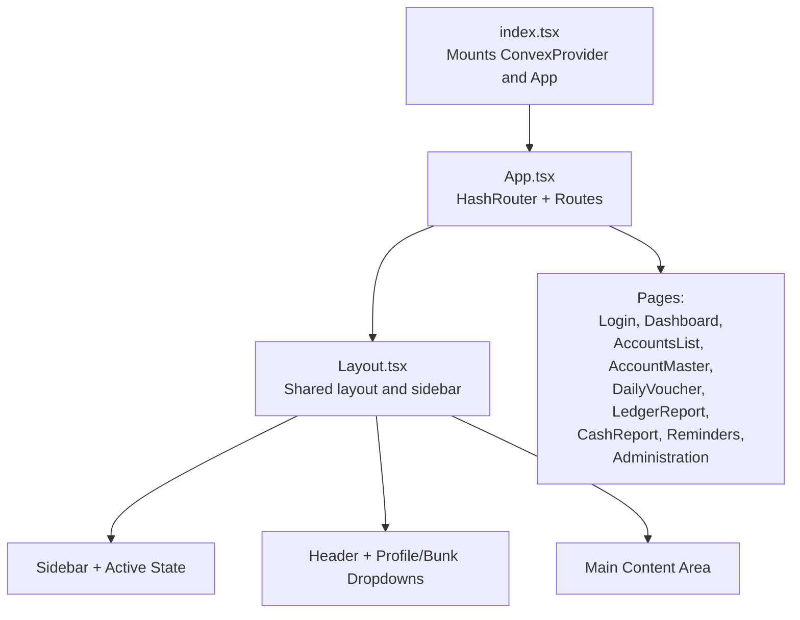
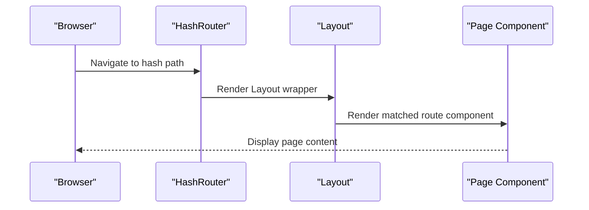
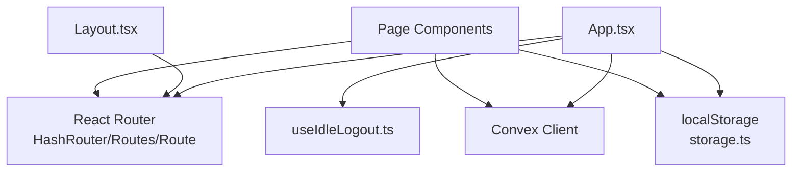

# Routing and Navigation

<cite>
**Referenced Files in This Document**
- [App.tsx](file://apps/App.tsx)
- [index.tsx](file://apps/index.tsx)
- [Layout.tsx](file://apps/components/Layout.tsx)
- [Login.tsx](file://apps/pages/Login.tsx)
- [Dashboard.tsx](file://apps/pages/Dashboard.tsx)
- [AccountsList.tsx](file://apps/pages/AccountsList.tsx)
- [AccountMaster.tsx](file://apps/pages/AccountMaster.tsx)
- [DailyVoucher.tsx](file://apps/pages/DailyVoucher.tsx)
- [LedgerReport.tsx](file://apps/pages/LedgerReport.tsx)
- [CashReport.tsx](file://apps/pages/CashReport.tsx)
- [Reminders.tsx](file://apps/pages/Reminders.tsx)
- [Administration.tsx](file://apps/pages/Administration.tsx)
- [types.ts](file://apps/types.ts)
- [storage.ts](file://apps/lib/storage.ts)
- [useIdleLogout.ts](file://apps/hooks/useIdleLogout.ts)
</cite>

## Table of Contents
1. [Introduction](#introduction)
2. [Project Structure](#project-structure)
3. [Core Components](#core-components)
4. [Architecture Overview](#architecture-overview)
5. [Detailed Component Analysis](#detailed-component-analysis)
6. [Dependency Analysis](#dependency-analysis)
7. [Performance Considerations](#performance-considerations)
8. [Troubleshooting Guide](#troubleshooting-guide)
9. [Conclusion](#conclusion)

## Introduction
This document explains the routing and navigation system of the KR-FUELS application. It covers the React Router configuration using HashRouter, route definitions for all application pages, role-based access control, navigation patterns, route parameters handling, programmatic navigation, layout integration, and state management. It also outlines performance considerations, lazy loading strategies, and SEO-related notes, along with examples of custom navigation components and testing approaches.

## Project Structure
The application uses a single-page application (SPA) architecture with client-side routing via React Router’s HashRouter. The main entry point initializes Convex and renders the root App component, which defines all routes and integrates a shared Layout component.

**Diagram sources**
- [index.tsx](file://apps/index.tsx#L1-L23)
- [App.tsx](file://apps/App.tsx#L1-L266)
- [Layout.tsx](file://apps/components/Layout.tsx#L1-L311)

**Section sources**
- [index.tsx](file://apps/index.tsx#L1-L23)
- [App.tsx](file://apps/App.tsx#L1-L266)

## Core Components
- HashRouter: Configured in the root App component to enable hash-based URLs suitable for static hosting.
- Routes: Defined under a single Routes block with explicit paths for each page and a catch-all redirect to the home page.
- Layout: Wraps all routes and provides the persistent sidebar, header, and main content area.
- Authentication: Login page handles user credentials and stores user data; App enforces authentication by rendering Login when no user is present.
- Role-based access: Certain routes (e.g., Administration) are conditionally rendered based on user role.

Key routing highlights:
- Hash-based URLs: Ensures compatibility with static hosts and simplifies deployment.
- Conditional rendering: The Administration route is included only when the user has super_admin role.
- Catch-all route: Any unmatched path navigates back to the home page.

**Section sources**
- [App.tsx](file://apps/App.tsx#L216-L262)
- [Layout.tsx](file://apps/components/Layout.tsx#L102-L125)

## Architecture Overview
The routing architecture centers around a single HashRouter instance that mounts the Layout component. The Layout composes the sidebar navigation, header controls, and the main content area. Each route renders a dedicated page component, passing down shared state and callbacks.

**Diagram sources**
- [App.tsx](file://apps/App.tsx#L216-L262)
- [Layout.tsx](file://apps/components/Layout.tsx#L136-L309)

## Detailed Component Analysis

### HashRouter and Route Definitions
- HashRouter is initialized at the root level, enabling hash-based routing.
- Routes include:
  - Home: Dashboard
  - Accounts: AccountsList
  - Account Master: AccountMaster (with optional :id param)
  - Vouchers: DailyVoucher
  - Reports: LedgerReport, CashReport
  - Utilities: Reminders
  - Administration: Conditionally rendered for super_admin
  - Catch-all: Redirect to home

Route parameters:
- AccountMaster supports an :id parameter for edit mode.
- AccountMaster supports a parentId query parameter for preselection.

Programmatic navigation:
- useNavigate is used in AccountsList and AccountMaster to navigate between pages.
- useSearchParams is used in AccountMaster to read query parameters.

Protected routes:
- Authentication guard: App renders Login when no user is stored.
- Role-based guard: Administration route is included only for super_admin.

**Section sources**
- [App.tsx](file://apps/App.tsx#L225-L258)
- [AccountsList.tsx](file://apps/pages/AccountsList.tsx#L25-L160)
- [AccountMaster.tsx](file://apps/pages/AccountMaster.tsx#L17-L56)

### Layout and Navigation Patterns
- Sidebar menu groups:
  - Overview, Transactions, Masters, Reports, Reminders
  - System group appears only for super_admin
- Active state detection:
  - getIsActive compares current path with menu paths, including special handling for nested routes (e.g., accounts and account-master/:id).
- Persistent controls:
  - Bunk selector dropdown allows switching the current bunk
  - Profile dropdown provides logout action
- Collapsible sidebar with persisted collapse state in localStorage

Navigation patterns:
- useLocation is used to compute active states
- useNavigate is used for programmatic navigation within components
- useSearchParams is used to read query parameters

**Section sources**
- [Layout.tsx](file://apps/components/Layout.tsx#L102-L132)
- [Layout.tsx](file://apps/components/Layout.tsx#L221-L258)
- [Layout.tsx](file://apps/components/Layout.tsx#L280-L298)

### Authentication and Role-Based Routing
- Login page:
  - Accepts username/password
  - Calls backend login action
  - Stores user and token in localStorage
  - Invokes onLogin to set currentUser in App
- App-level guard:
  - Renders Login when no user is present
  - Uses getStoredUser and setStoredUser helpers
- Role-based visibility:
  - Administration route shown only for super_admin
  - Layout menu groups adapt to user role

Idle logout:
- useIdleLogout monitors activity and triggers logout after inactivity

**Section sources**
- [Login.tsx](file://apps/pages/Login.tsx#L22-L56)
- [App.tsx](file://apps/App.tsx#L38-L45)
- [App.tsx](file://apps/App.tsx#L255-L257)
- [storage.ts](file://apps/lib/storage.ts#L7-L24)
- [useIdleLogout.ts](file://apps/hooks/useIdleLogout.ts#L10-L32)

### Route Parameters and Programmatic Navigation Examples
- Parameterized route:
  - AccountMaster path supports :id for editing
  - useParams reads the id; useSearchParams reads parentId
- Programmatic navigation:
  - AccountsList navigates to AccountMaster for new or edit actions
  - AccountMaster navigates back to AccountsList after save
  - DailyVoucher uses hashchange listener to prompt saving before navigation

**Section sources**
- [App.tsx](file://apps/App.tsx#L250-L251)
- [AccountMaster.tsx](file://apps/pages/AccountMaster.tsx#L17-L56)
- [AccountsList.tsx](file://apps/pages/AccountsList.tsx#L107-L160)
- [DailyVoucher.tsx](file://apps/pages/DailyVoucher.tsx#L165-L190)

### Dynamic Route Generation and Conditional Rendering
- Dynamic menu groups:
  - Layout builds menu items based on user role
- Conditional route inclusion:
  - Administration route included only for super_admin
- Bunk-aware navigation:
  - App computes availableBunks and currentBunk
  - Layout passes onBunkChange to update current bunk

**Section sources**
- [Layout.tsx](file://apps/components/Layout.tsx#L102-L125)
- [App.tsx](file://apps/App.tsx#L47-L64)
- [App.tsx](file://apps/App.tsx#L218-L224)

### Navigation State Management
- Shared state:
  - currentUser, bunks, accounts, vouchers, currentBunkId
  - Persisted in localStorage for session continuity
- Cross-component communication:
  - Layout receives onBunkChange and onLogout handlers
  - Pages receive props for data and callbacks

**Section sources**
- [App.tsx](file://apps/App.tsx#L34-L74)
- [Layout.tsx](file://apps/components/Layout.tsx#L62-L69)

### Breadcrumb Implementation
- Current implementation does not include a dedicated breadcrumb component.
- Navigation relies on the sidebar and header breadcrumbs are implicit via the active menu item and page titles.

[No sources needed since this section summarizes the current state without analyzing specific files]

### SEO Considerations
- Hash-based routing is used; search engines may not index hash fragments effectively.
- Recommendation: Consider migrating to BrowserRouter with server-side rendering or implementing a service worker to support deep linking if SEO becomes a requirement.

[No sources needed since this section provides general guidance]

### Custom Navigation Components
- KRLogo and KRLogoFull: Branding components used in layouts and login screens
- HierarchyDropdown: Used in AccountMaster to select parent groups
- LedgerModalSelector: Used in multiple pages to select ledger accounts
- ConfirmDialog: Used across pages for destructive actions

**Section sources**
- [Layout.tsx](file://apps/components/Layout.tsx#L22-L60)
- [Login.tsx](file://apps/pages/Login.tsx#L11-L20)
- [AccountMaster.tsx](file://apps/pages/AccountMaster.tsx#L6-L7)
- [AccountsList.tsx](file://apps/pages/AccountsList.tsx#L17-L17)
- [DailyVoucher.tsx](file://apps/pages/DailyVoucher.tsx#L16-L16)
- [LedgerReport.tsx](file://apps/pages/LedgerReport.tsx#L5-L5)

### Navigation Testing Approaches
- Unit tests for route guards:
  - Verify Login renders when no user is present
  - Verify Administration route is rendered only for super_admin
- Integration tests for navigation:
  - Simulate user interactions (sidebar clicks, dropdown selections)
  - Assert that active states update correctly
- Parameterized route tests:
  - Navigate to AccountMaster with :id and verify edit mode
  - Navigate with parentId query parameter and verify preselection
- Programmatic navigation tests:
  - Trigger useNavigate calls and assert route transitions
- Idle logout tests:
  - Simulate inactivity events and verify logout callback invocation

[No sources needed since this section provides general guidance]

## Dependency Analysis
The routing system depends on:
- React Router for HashRouter, Routes, Route, and programmatic navigation
- Convex for authentication and data fetching
- Local storage for user/session persistence
- Custom hooks for idle logout

**Diagram sources**
- [App.tsx](file://apps/App.tsx#L1-L17)
- [index.tsx](file://apps/index.tsx#L4-L21)
- [storage.ts](file://apps/lib/storage.ts#L1-L34)
- [useIdleLogout.ts](file://apps/hooks/useIdleLogout.ts#L1-L33)

**Section sources**
- [App.tsx](file://apps/App.tsx#L1-L17)
- [index.tsx](file://apps/index.tsx#L4-L21)
- [storage.ts](file://apps/lib/storage.ts#L1-L34)
- [useIdleLogout.ts](file://apps/hooks/useIdleLogout.ts#L1-L33)

## Performance Considerations
- Hash-based routing avoids server configuration overhead but can increase bundle size slightly due to router overhead.
- Lazy loading strategies:
  - Split large pages into separate chunks
  - Use React.lazy and Suspense for heavy components
  - Defer non-critical routes until needed
- Bundle optimization:
  - Tree shaking and code splitting reduce initial load
  - Minimize re-renders by memoizing derived data (e.g., availableBunks, currentBunk)
- Idle logout:
  - Prevents stale sessions and reduces unnecessary network calls

[No sources needed since this section provides general guidance]

## Troubleshooting Guide
Common issues and resolutions:
- Login failures:
  - Verify token and user storage keys
  - Check backend login action response
- Role-based access errors:
  - Ensure user role is correctly stored and evaluated
  - Confirm conditional route rendering logic
- Navigation not updating active state:
  - Verify getIsActive logic for nested routes
  - Ensure useLocation is used consistently
- Parameter handling:
  - Confirm useParams and useSearchParams usage
  - Validate route parameter types and defaults
- Idle logout:
  - Adjust idleMinutes threshold
  - Ensure event listeners are attached and cleaned up

**Section sources**
- [Login.tsx](file://apps/pages/Login.tsx#L30-L56)
- [App.tsx](file://apps/App.tsx#L255-L257)
- [Layout.tsx](file://apps/components/Layout.tsx#L127-L132)
- [AccountMaster.tsx](file://apps/pages/AccountMaster.tsx#L17-L56)
- [useIdleLogout.ts](file://apps/hooks/useIdleLogout.ts#L10-L32)

## Conclusion
KR-FUELS employs a clean, hash-based routing strategy integrated with a shared Layout and role-aware conditional rendering. The system supports programmatic navigation, route parameters, and persistent state across sessions. While the current implementation focuses on simplicity and static hosting compatibility, future enhancements could include lazy loading, SSR, and a dedicated breadcrumb component to improve performance and UX.