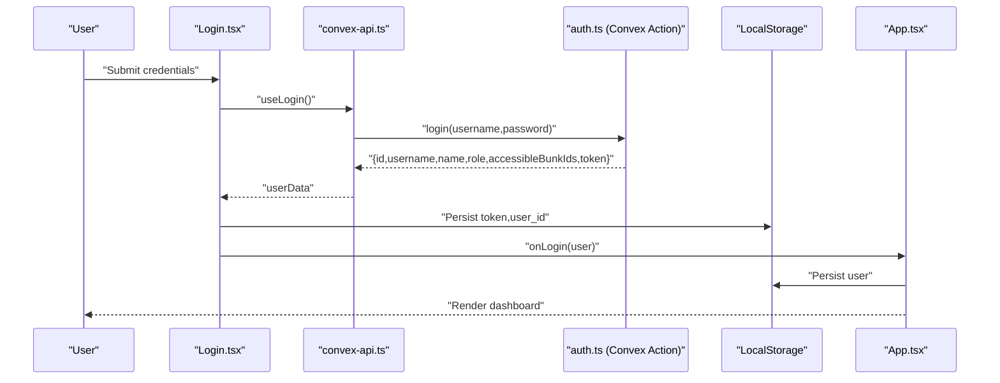
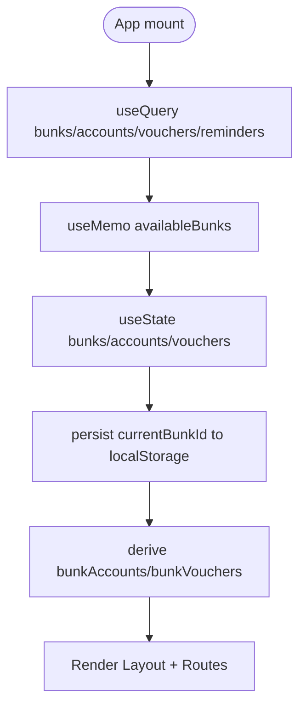
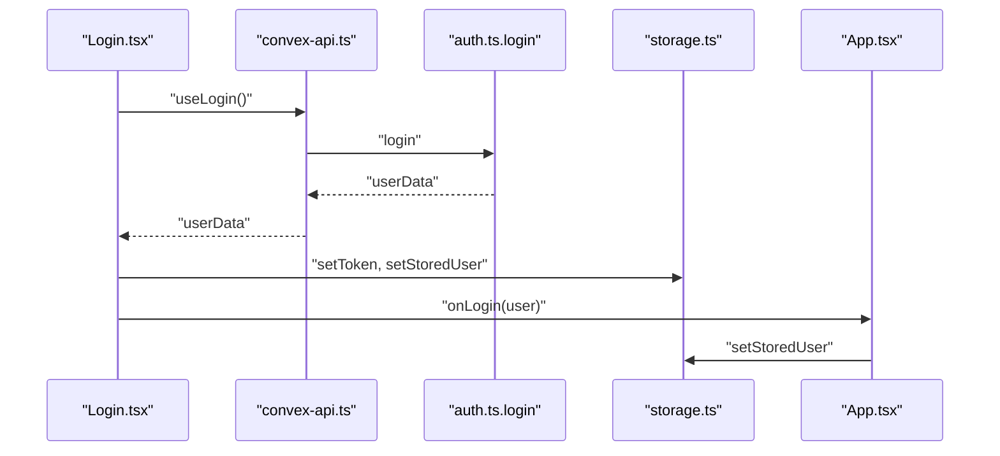
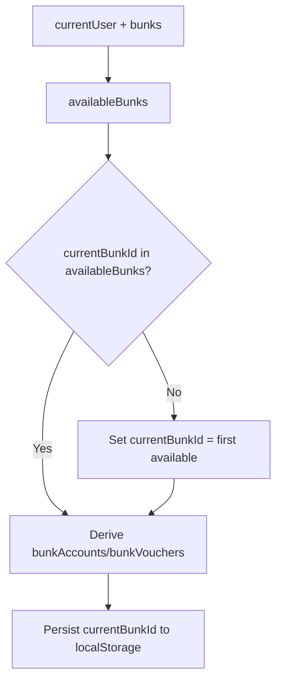
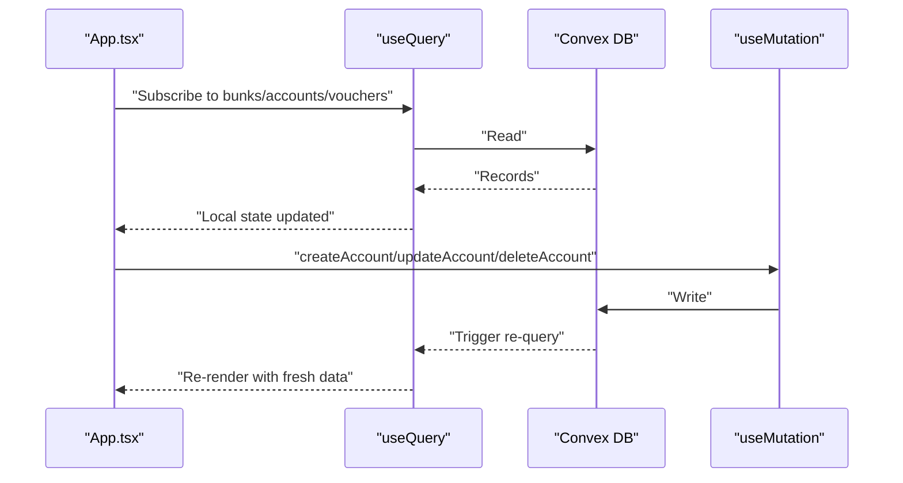
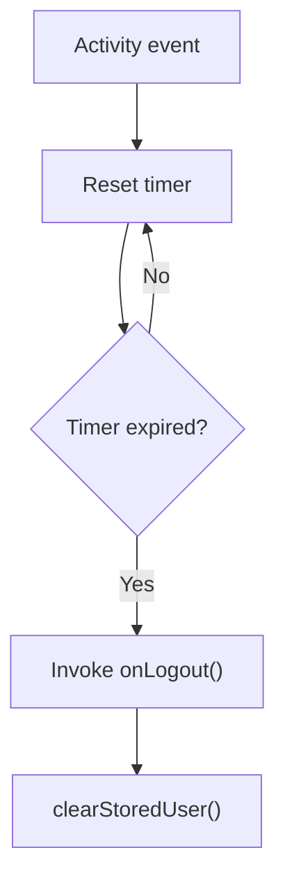
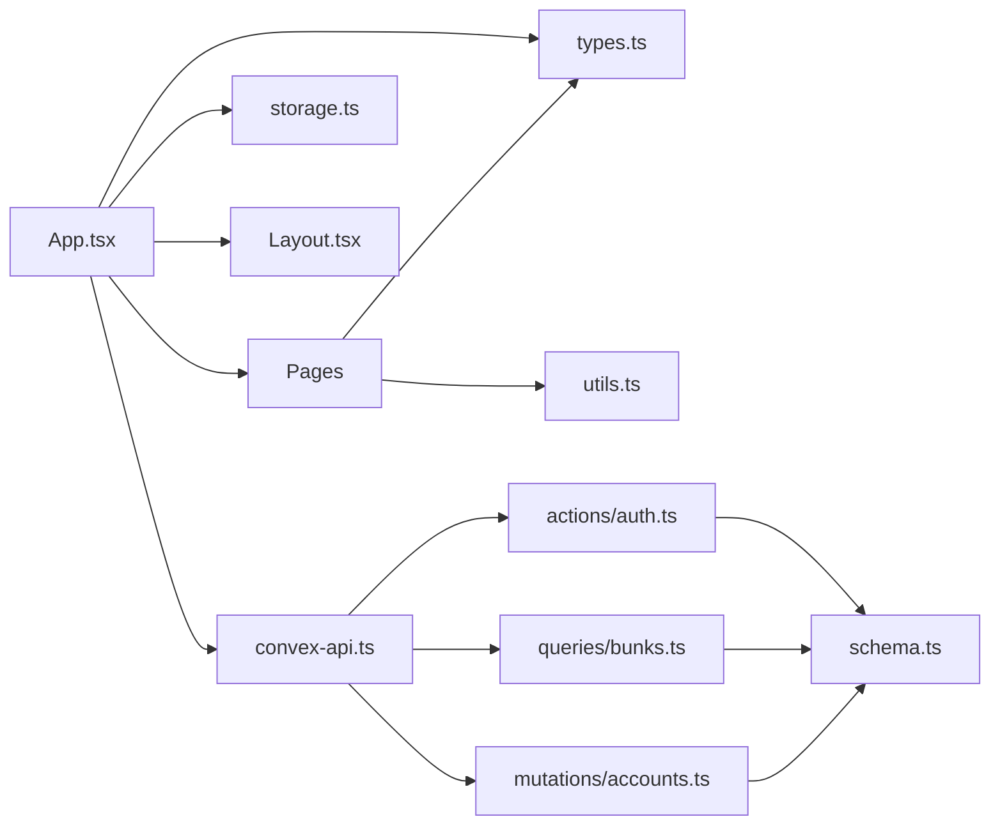
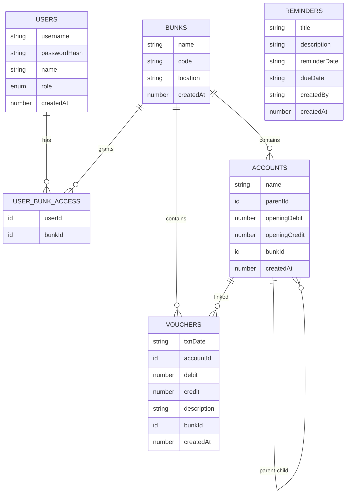

# State Management

<cite>
**Referenced Files in This Document**
- [App.tsx](file://apps/App.tsx)
- [Login.tsx](file://apps/pages/Login.tsx)
- [Layout.tsx](file://apps/components/Layout.tsx)
- [Dashboard.tsx](file://apps/pages/Dashboard.tsx)
- [AccountsList.tsx](file://apps/pages/AccountsList.tsx)
- [DailyVoucher.tsx](file://apps/pages/DailyVoucher.tsx)
- [useIdleLogout.ts](file://apps/hooks/useIdleLogout.ts)
- [storage.ts](file://apps/lib/storage.ts)
- [convex-api.ts](file://apps/convex-api.ts)
- [types.ts](file://apps/types.ts)
- [utils.ts](file://apps/utils.ts)
- [schema.ts](file://convex/schema.ts)
- [auth.ts](file://convex/actions/auth.ts)
- [bunks.ts](file://convex/queries/bunks.ts)
- [accounts.ts](file://convex/mutations/accounts.ts)
</cite>

## Table of Contents
1. [Introduction](#introduction)
2. [Project Structure](#project-structure)
3. [Core Components](#core-components)
4. [Architecture Overview](#architecture-overview)
5. [Detailed Component Analysis](#detailed-component-analysis)
6. [Dependency Analysis](#dependency-analysis)
7. [Performance Considerations](#performance-considerations)
8. [Troubleshooting Guide](#troubleshooting-guide)
9. [Conclusion](#conclusion)
10. [Appendices](#appendices)

## Introduction
This document explains the hybrid state management approach used in the KR-FUELS frontend. It combines:
- React hooks for component and global state (useState, useEffect, useMemo, useCallback)
- Convex reactive queries and mutations for backend-driven state
- Local storage persistence for user sessions and UI preferences

It covers global state patterns, component state isolation, synchronization between frontend and backend, authentication state, bunk selection, caching strategies, persistence and idle logout, debugging techniques, performance optimization, and testing approaches.

## Project Structure
The frontend is organized around a single-page application with route-based pages, shared layout, reusable components, and typed models. Convex provides the backend data access layer with strongly typed queries and mutations.

```mermaid
graph TB
subgraph "Frontend"
APP["App.tsx<br/>Global state & routing"]
LAYOUT["Layout.tsx<br/>Header, sidebar, bunk selector"]
LOGIN["Login.tsx<br/>Authentication form"]
DASHBOARD["Dashboard.tsx<br/>Aggregations & reminders"]
ACCOUNTS["AccountsList.tsx<br/>Tree & balances"]
VOUCHER["DailyVoucher.tsx<br/>Batch posting & totals"]
STORAGE["storage.ts<br/>localStorage helpers"]
IDLE["useIdleLogout.ts<br/>Idle timeout hook"]
CONVEX_API["convex-api.ts<br/>Convex hooks"]
TYPES["types.ts<br/>Domain models"]
UTILS["utils.ts<br/>Formatting & calculations"]
end
subgraph "Backend (Convex)"
SCHEMA["schema.ts<br/>Tables & indices"]
AUTH["actions/auth.ts<br/>login/register/changePassword"]
QBUNKS["queries/bunks.ts<br/>getAllBunks"]
MACCOUNTS["mutations/accounts.ts<br/>create/update/delete"]
end
APP --> LAYOUT
APP --> LOGIN
APP --> DASHBOARD
APP --> ACCOUNTS
APP --> VOUCHER
APP --> STORAGE
APP --> IDLE
APP --> CONVEX_API
APP --> TYPES
APP --> UTILS
APP --> SCHEMA
APP --> AUTH
APP --> QBUNKS
APP --> MACCOUNTS
```

**Diagram sources**
- [App.tsx](file://apps/App.tsx#L21-L266)
- [Layout.tsx](file://apps/components/Layout.tsx#L71-L311)
- [Login.tsx](file://apps/pages/Login.tsx#L22-L167)
- [Dashboard.tsx](file://apps/pages/Dashboard.tsx#L26-L219)
- [AccountsList.tsx](file://apps/pages/AccountsList.tsx#L24-L254)
- [DailyVoucher.tsx](file://apps/pages/DailyVoucher.tsx#L34-L336)
- [storage.ts](file://apps/lib/storage.ts#L1-L34)
- [useIdleLogout.ts](file://apps/hooks/useIdleLogout.ts#L10-L33)
- [convex-api.ts](file://apps/convex-api.ts#L1-L33)
- [types.ts](file://apps/types.ts#L1-L56)
- [utils.ts](file://apps/utils.ts#L1-L69)
- [schema.ts](file://convex/schema.ts#L1-L85)
- [auth.ts](file://convex/actions/auth.ts#L18-L56)
- [bunks.ts](file://convex/queries/bunks.ts#L11-L16)
- [accounts.ts](file://convex/mutations/accounts.ts#L4-L63)

**Section sources**
- [App.tsx](file://apps/App.tsx#L1-L266)
- [types.ts](file://apps/types.ts#L1-L56)
- [schema.ts](file://convex/schema.ts#L1-L85)

## Core Components
- Global state container: App.tsx orchestrates:
  - Convex queries for bunks, accounts, vouchers, reminders
  - Local state for current user, bunk list, accounts, vouchers, current bunk
  - Handlers for CRUD operations via Convex mutations
  - Idle logout integration and persistence of current bunk
- Authentication: Login.tsx handles credentials, calls Convex login action, persists tokens/users, and notifies App.tsx to switch UI
- Layout: Layout.tsx manages sidebar state, bunk dropdown, and profile dropdown; persists sidebar collapse preference
- Pages:
  - Dashboard.tsx computes daily summaries and reminders
  - AccountsList.tsx renders hierarchical accounts and balances
  - DailyVoucher.tsx maintains batch rows, totals, and posting lifecycle
- Hooks and persistence:
  - useIdleLogout.ts implements idle timeout
  - storage.ts centralizes localStorage keys and operations
- Convex integration:
  - convex-api.ts exposes typed hooks for queries and mutations
  - Backend schema defines tables and indices

**Section sources**
- [App.tsx](file://apps/App.tsx#L21-L266)
- [Login.tsx](file://apps/pages/Login.tsx#L22-L167)
- [Layout.tsx](file://apps/components/Layout.tsx#L71-L311)
- [Dashboard.tsx](file://apps/pages/Dashboard.tsx#L26-L219)
- [AccountsList.tsx](file://apps/pages/AccountsList.tsx#L24-L254)
- [DailyVoucher.tsx](file://apps/pages/DailyVoucher.tsx#L34-L336)
- [useIdleLogout.ts](file://apps/hooks/useIdleLogout.ts#L10-L33)
- [storage.ts](file://apps/lib/storage.ts#L1-L34)
- [convex-api.ts](file://apps/convex-api.ts#L1-L33)

## Architecture Overview
The state architecture blends React hooks with Convex’s reactive queries and mutations. App.tsx subscribes to Convex queries and mirrors the data into local state. Mutations update backend state, which triggers re-execution of queries and automatic UI updates. Local storage persists user identity, token, current bunk, and UI preferences.

**Diagram sources**
- [Login.tsx](file://apps/pages/Login.tsx#L30-L56)
- [convex-api.ts](file://apps/convex-api.ts#L7-L10)
- [auth.ts](file://convex/actions/auth.ts#L18-L56)
- [storage.ts](file://apps/lib/storage.ts#L16-L24)
- [App.tsx](file://apps/App.tsx#L67-L70)

## Detailed Component Analysis

### Global State Orchestration (App.tsx)
- Reactive subscriptions:
  - useQuery for bunks, accounts, vouchers, reminders
  - useMutation for create/update/delete operations
- Local state mirroring:
  - bunks, accounts, vouchers arrays transformed from Convex records
  - currentUser hydrated from localStorage
- Derived state:
  - availableBunks filtered by user role/access
  - currentBunkId persisted to localStorage
  - bunkAccounts and bunkVouchers derived from currentBunkId
- Handlers:
  - CRUD handlers call Convex mutations and surface errors via alerts
- Routing and layout:
  - Protected routes gated by currentUser
  - Layout receives bunks, currentBunk, onBunkChange, onLogout, user

**Diagram sources**
- [App.tsx](file://apps/App.tsx#L22-L114)
- [App.tsx](file://apps/App.tsx#L47-L65)
- [App.tsx](file://apps/App.tsx#L72-L114)

**Section sources**
- [App.tsx](file://apps/App.tsx#L21-L266)

### Authentication State Management
- Login page:
  - Captures username/password
  - Calls useLogin action, stores token and user_id
  - Converts Convex user to internal User type and invokes onLogin
- App-level:
  - getStoredUser hydration
  - setStoredUser on login
  - clearStoredUser on logout
  - useIdleLogout integration
- Backend:
  - login action validates credentials, fetches accessible bunks, returns safe user payload

**Diagram sources**
- [Login.tsx](file://apps/pages/Login.tsx#L30-L56)
- [convex-api.ts](file://apps/convex-api.ts#L7-L10)
- [auth.ts](file://convex/actions/auth.ts#L18-L56)
- [storage.ts](file://apps/lib/storage.ts#L16-L24)
- [App.tsx](file://apps/App.tsx#L67-L70)

**Section sources**
- [Login.tsx](file://apps/pages/Login.tsx#L22-L167)
- [auth.ts](file://convex/actions/auth.ts#L18-L56)
- [storage.ts](file://apps/lib/storage.ts#L1-L34)
- [App.tsx](file://apps/App.tsx#L38-L45)

### Bunk Selection State
- App.tsx:
  - availableBunks computed from currentUser and bunks
  - currentBunkId stored in localStorage and state
  - useEffect ensures currentBunkId stays within availableBunks
  - bunkAccounts/bunkVouchers derived via useMemo
- Layout.tsx:
  - Bunk dropdown triggers onBunkChange
  - Persists sidebar collapse state to localStorage

**Diagram sources**
- [App.tsx](file://apps/App.tsx#L47-L65)
- [App.tsx](file://apps/App.tsx#L72-L74)
- [Layout.tsx](file://apps/components/Layout.tsx#L221-L259)

**Section sources**
- [App.tsx](file://apps/App.tsx#L47-L65)
- [App.tsx](file://apps/App.tsx#L72-L74)
- [Layout.tsx](file://apps/components/Layout.tsx#L221-L259)

### Data Caching Strategies and Backend Synchronization
- Convex reactive queries:
  - useQuery for bunks, accounts, vouchers, reminders
  - Automatic cache invalidation and re-render when backend changes
- Local mirroring:
  - useEffect transforms Convex records into domain models and sets local state
- Mutation handlers:
  - CRUD operations performed via useMutation
  - UI reflects updates immediately due to reactive subscriptions

**Diagram sources**
- [App.tsx](file://apps/App.tsx#L22-L114)
- [accounts.ts](file://convex/mutations/accounts.ts#L4-L63)
- [bunks.ts](file://convex/queries/bunks.ts#L11-L16)

**Section sources**
- [App.tsx](file://apps/App.tsx#L22-L114)
- [accounts.ts](file://convex/mutations/accounts.ts#L4-L63)
- [bunks.ts](file://convex/queries/bunks.ts#L11-L16)

### Component State Isolation Patterns
- Dashboard.tsx:
  - Owns date selection and computes reportData via useMemo
- AccountsList.tsx:
  - Owns search term, expanded groups, and deletion dialog state
- DailyVoucher.tsx:
  - Owns rows, totals, dirty flag, and hashchange navigation guard
- Layout.tsx:
  - Owns sidebar/collapse/profile/bunk dropdown open states
- Benefits:
  - Clear ownership reduces cross-component coupling
  - Derived computations isolated per component

**Section sources**
- [Dashboard.tsx](file://apps/pages/Dashboard.tsx#L26-L82)
- [AccountsList.tsx](file://apps/pages/AccountsList.tsx#L24-L68)
- [DailyVoucher.tsx](file://apps/pages/DailyVoucher.tsx#L34-L191)
- [Layout.tsx](file://apps/components/Layout.tsx#L71-L100)

### State Transformation Patterns
- From Convex to domain models:
  - Transform fields (e.g., txnDate -> date, _id -> id) during useEffect
- Derived computations:
  - useMemo for derived arrays and aggregated values
- Hierarchical rendering:
  - getChildAccounts and recursive rendering in AccountsList.tsx
  - getHierarchyPath for display

**Section sources**
- [App.tsx](file://apps/App.tsx#L72-L114)
- [utils.ts](file://apps/utils.ts#L27-L69)
- [AccountsList.tsx](file://apps/pages/AccountsList.tsx#L64-L76)

### Session Management and Idle Logout
- Session:
  - Token and user stored in localStorage via storage.ts
  - App hydrates currentUser on mount
- Idle logout:
  - useIdleLogout listens to activity events
  - On timeout, invokes onLogout and shows alert

**Diagram sources**
- [useIdleLogout.ts](file://apps/hooks/useIdleLogout.ts#L10-L33)
- [storage.ts](file://apps/lib/storage.ts#L20-L24)
- [App.tsx](file://apps/App.tsx#L40-L45)

**Section sources**
- [storage.ts](file://apps/lib/storage.ts#L1-L34)
- [useIdleLogout.ts](file://apps/hooks/useIdleLogout.ts#L10-L33)
- [App.tsx](file://apps/App.tsx#L40-L45)

### State Persistence Mechanisms
- User identity and token:
  - getStoredUser/setStoredUser/clearStoredUser
  - Token setter supports nulling
- UI preferences:
  - Sidebar collapse state persisted to localStorage
  - Current bunk persisted to localStorage
- Page-level:
  - DailyVoucher uses hashchange to prevent accidental navigation with unsaved changes

**Section sources**
- [storage.ts](file://apps/lib/storage.ts#L1-L34)
- [Layout.tsx](file://apps/components/Layout.tsx#L73-L86)
- [App.tsx](file://apps/App.tsx#L72-L74)
- [DailyVoucher.tsx](file://apps/pages/DailyVoucher.tsx#L165-L191)

### State Testing Approaches
- Unit tests for pure helpers:
  - formatCurrency, formatDateToDDMMYYYY, getHierarchyPath, calculateLedger
- Component tests:
  - Mock Convex hooks with mock implementations returning test data
  - Test derived computations via useMemo by asserting output given inputs
  - Simulate user interactions (e.g., bunk change, posting transactions)
- Integration tests:
  - Wrap components with Convex providers and test end-to-end flows (login, idle timeout, CRUD)

**Section sources**
- [utils.ts](file://apps/utils.ts#L4-L69)
- [convex-api.ts](file://apps/convex-api.ts#L1-L33)

## Dependency Analysis
- Frontend dependencies:
  - App.tsx depends on Convex hooks, storage, types, and pages
  - Pages depend on types, utils, and shared components
- Backend dependencies:
  - Queries and mutations depend on schema definitions
  - Actions depend on query/mutation APIs

**Diagram sources**
- [App.tsx](file://apps/App.tsx#L1-L266)
- [convex-api.ts](file://apps/convex-api.ts#L1-L33)
- [storage.ts](file://apps/lib/storage.ts#L1-L34)
- [types.ts](file://apps/types.ts#L1-L56)
- [utils.ts](file://apps/utils.ts#L1-L69)
- [auth.ts](file://convex/actions/auth.ts#L1-L148)
- [bunks.ts](file://convex/queries/bunks.ts#L1-L16)
- [accounts.ts](file://convex/mutations/accounts.ts#L1-L63)
- [schema.ts](file://convex/schema.ts#L1-L85)

**Section sources**
- [App.tsx](file://apps/App.tsx#L1-L266)
- [convex-api.ts](file://apps/convex-api.ts#L1-L33)
- [schema.ts](file://convex/schema.ts#L1-L85)

## Performance Considerations
- Prefer useMemo for derived computations:
  - Dashboard reportData, AccountsList stats, DailyVoucher totals
- Minimize re-renders:
  - useCallback for event handlers passed to children
  - Stable refs for callbacks in effects (e.g., handlePostRef)
- Efficient filtering/sorting:
  - Filter by currentBunkId; avoid unnecessary recomputations
- Large dataset strategies:
  - Virtualize long lists (not implemented yet)
  - Paginate or limit initial fetch sizes
  - Debounce heavy computations
- Memory management:
  - Clear timeouts and listeners in cleanup
  - Avoid retaining large intermediate arrays longer than needed

**Section sources**
- [Dashboard.tsx](file://apps/pages/Dashboard.tsx#L50-L81)
- [AccountsList.tsx](file://apps/pages/AccountsList.tsx#L64-L68)
- [DailyVoucher.tsx](file://apps/pages/DailyVoucher.tsx#L51-L56)
- [DailyVoucher.tsx](file://apps/pages/DailyVoucher.tsx#L162-L191)
- [useIdleLogout.ts](file://apps/hooks/useIdleLogout.ts#L27-L31)

## Troubleshooting Guide
- Login fails:
  - Verify credentials and ensure Convex login action returns user data
  - Check token and user persistence in localStorage
- Data not updating:
  - Confirm useQuery subscriptions are active and not blocked by errors
  - Ensure mutations are called and backend writes succeed
- Bunk mismatch:
  - Verify availableBunks derivation and useEffect resetting currentBunkId
  - Check localStorage current bunk value alignment
- Idle logout unexpected:
  - Adjust idleMinutes parameter in useIdleLogout
  - Ensure cleanup removes event listeners and timeouts

**Section sources**
- [Login.tsx](file://apps/pages/Login.tsx#L30-L56)
- [auth.ts](file://convex/actions/auth.ts#L18-L56)
- [storage.ts](file://apps/lib/storage.ts#L16-L24)
- [App.tsx](file://apps/App.tsx#L47-L65)
- [useIdleLogout.ts](file://apps/hooks/useIdleLogout.ts#L10-L33)

## Conclusion
KR-FUELS employs a clean hybrid state strategy: Convex reactive queries drive global data, React hooks manage component and derived state, and localStorage persists identity and UI preferences. The approach scales well for hierarchical accounts, daily voucher batching, and role-based bunk access while maintaining responsiveness and reliability.

## Appendices

### Data Model Overview

**Diagram sources**
- [schema.ts](file://convex/schema.ts#L13-L84)