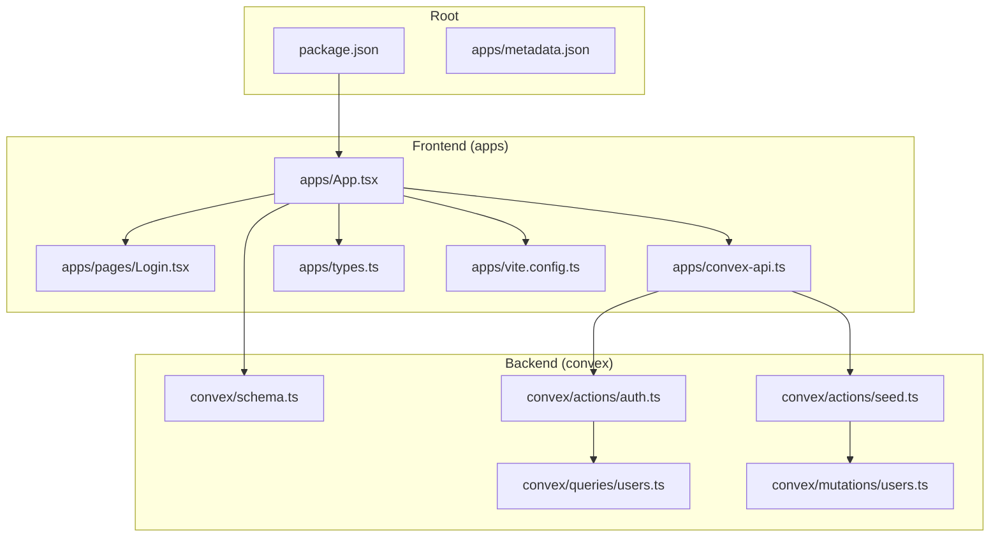
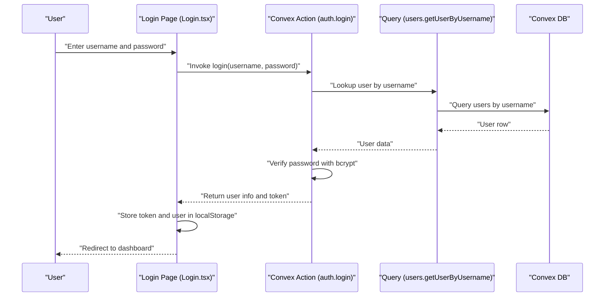
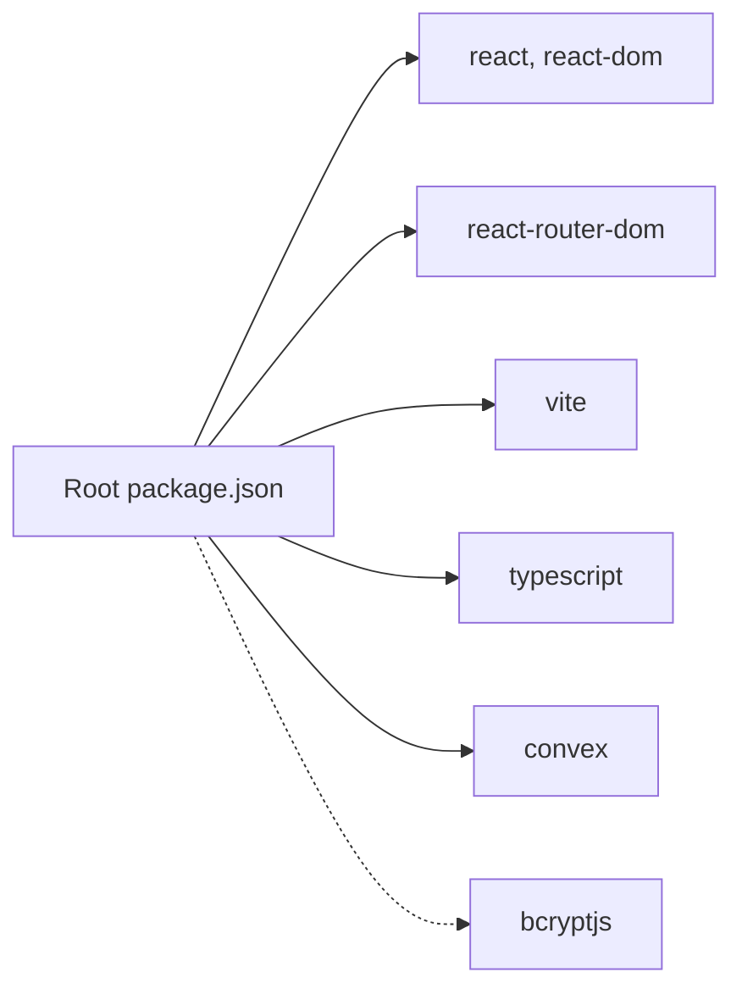
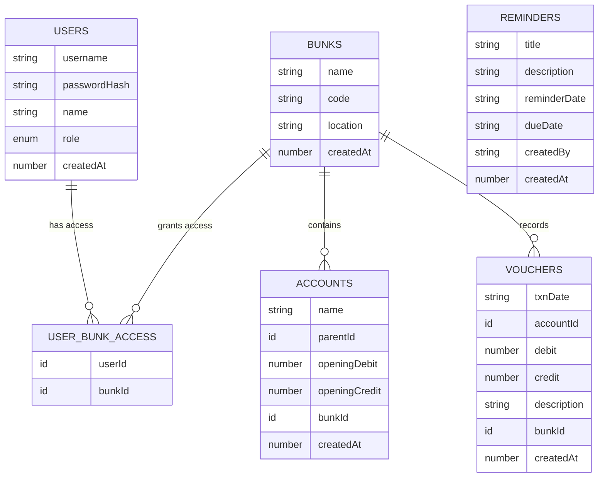

# Getting Started

<cite>
**Referenced Files in This Document**
- [README.md](file://README.md)
- [package.json](file://package.json)
- [apps/vite.config.ts](file://apps/vite.config.ts)
- [apps/App.tsx](file://apps/App.tsx)
- [apps/pages/Login.tsx](file://apps/pages/Login.tsx)
- [apps/convex-api.ts](file://apps/convex-api.ts)
- [apps/types.ts](file://apps/types.ts)
- [convex/schema.ts](file://convex/schema.ts)
- [convex/actions/auth.ts](file://convex/actions/auth.ts)
- [convex/actions/seed.ts](file://convex/actions/seed.ts)
- [convex/queries/users.ts](file://convex/queries/users.ts)
- [convex/mutations/users.ts](file://convex/mutations/users.ts)
</cite>

## Table of Contents
1. [Introduction](#introduction)
2. [Project Structure](#project-structure)
3. [Core Components](#core-components)
4. [Architecture Overview](#architecture-overview)
5. [Detailed Component Analysis](#detailed-component-analysis)
6. [Dependency Analysis](#dependency-analysis)
7. [Performance Considerations](#performance-considerations)
8. [Troubleshooting Guide](#troubleshooting-guide)
9. [Conclusion](#conclusion)
10. [Appendices](#appendices)

## Introduction
This guide helps you install, configure, and run KR-FUELS locally. It covers prerequisites, installation, development server setup, project structure, initial Convex backend configuration, database initialization, first-time login and navigation, common development commands, and troubleshooting.

## Project Structure
KR-FUELS is a React single-page application bundled with Vite and integrated with a Convex backend. The repository is organized into:
- apps: Frontend application (React + Vite), pages, components, hooks, and Convex client bindings
- convex: Convex backend schema, queries, mutations, and actions
- Root-level configuration files for scripts, dependencies, and metadata

**Diagram sources**
- [package.json](file://package.json#L1-L26)
- [apps/App.tsx](file://apps/App.tsx#L1-L266)
- [apps/pages/Login.tsx](file://apps/pages/Login.tsx#L1-L167)
- [apps/convex-api.ts](file://apps/convex-api.ts#L1-L33)
- [apps/vite.config.ts](file://apps/vite.config.ts#L1-L16)
- [convex/schema.ts](file://convex/schema.ts#L1-L85)
- [convex/actions/auth.ts](file://convex/actions/auth.ts#L1-L148)
- [convex/actions/seed.ts](file://convex/actions/seed.ts#L1-L268)
- [convex/queries/users.ts](file://convex/queries/users.ts#L1-L35)
- [convex/mutations/users.ts](file://convex/mutations/users.ts#L1-L81)

**Section sources**
- [README.md](file://README.md#L1-L13)
- [package.json](file://package.json#L1-L26)
- [apps/vite.config.ts](file://apps/vite.config.ts#L1-L16)

## Core Components
- Frontend (React + Vite)
  - Entry point initializes routing, layout, and Convex client bindings
  - Login page handles authentication and stores session tokens
  - Convex API wrappers simplify frontend-backend interactions
- Backend (Convex)
  - Schema defines tables and indexes for bunks, users, user-bunk access, accounts, vouchers, and reminders
  - Authentication actions implement login, registration, and password change
  - Seed actions initialize bunks and users, and populate dummy data

Key responsibilities:
- apps/App.tsx orchestrates state, routing, and Convex data fetching
- apps/pages/Login.tsx manages credentials and triggers authentication
- apps/convex-api.ts exposes typed hooks for Convex actions and queries
- convex/schema.ts defines the data model and indexes
- convex/actions/auth.ts implements authentication logic
- convex/actions/seed.ts seeds initial data and dummy transactions

**Section sources**
- [apps/App.tsx](file://apps/App.tsx#L1-L266)
- [apps/pages/Login.tsx](file://apps/pages/Login.tsx#L1-L167)
- [apps/convex-api.ts](file://apps/convex-api.ts#L1-L33)
- [convex/schema.ts](file://convex/schema.ts#L1-L85)
- [convex/actions/auth.ts](file://convex/actions/auth.ts#L1-L148)
- [convex/actions/seed.ts](file://convex/actions/seed.ts#L1-L268)

## Architecture Overview
The frontend communicates with Convex via generated APIs. Authentication is handled by Convex actions, and the frontend persists minimal session data in local storage.

**Diagram sources**
- [apps/pages/Login.tsx](file://apps/pages/Login.tsx#L30-L56)
- [convex/actions/auth.ts](file://convex/actions/auth.ts#L18-L56)
- [convex/queries/users.ts](file://convex/queries/users.ts#L4-L12)

## Detailed Component Analysis

### Prerequisites
- Node.js: Required to run the development server and build scripts
- npm: Package manager used for installing dependencies and running scripts

Install dependencies and run the development server as documented in the repository’s README.

**Section sources**
- [README.md](file://README.md#L3-L11)

### Installation and Setup
- Install dependencies
  - Run the standard install command to fetch frontend and backend dependencies
- Start the development server
  - Scripts are configured to launch Vite from the apps directory

Common scripts:
- dev: Starts the Vite dev server for the frontend
- build: Compiles TypeScript and builds the frontend bundle
- preview: Serves the built frontend locally

**Section sources**
- [README.md](file://README.md#L8-L11)
- [package.json](file://package.json#L6-L10)

### Development Server and Local Environment
- Vite configuration
  - Port defaults to 5173
  - Auto-open browser on startup
  - Allowed hosts include a specific domain for remote access support

Local environment tips:
- Ensure port 5173 is free
- If using a proxy or tunnel, confirm allowed hosts match your environment

**Section sources**
- [apps/vite.config.ts](file://apps/vite.config.ts#L7-L13)

### Project Structure and Key Directories
- apps/
  - App.tsx: Application shell, routing, and global state
  - pages/: Feature pages (Login, Dashboard, Accounts, Vouchers, Reports)
  - components/: Shared UI components
  - hooks/: Custom hooks (e.g., idle logout)
  - lib/: Utilities (e.g., storage helpers)
  - convex-api.ts: Typed Convex hooks for actions and queries
  - types.ts: TypeScript interfaces for domain entities
  - vite.config.ts: Vite server and plugin configuration
- convex/
  - schema.ts: Convex database schema and indexes
  - actions/: Server actions (auth, seed)
  - queries/: Read operations for users and reminders
  - mutations/: Write operations for users and other entities

**Section sources**
- [apps/App.tsx](file://apps/App.tsx#L1-L266)
- [apps/convex-api.ts](file://apps/convex-api.ts#L1-L33)
- [apps/types.ts](file://apps/types.ts#L1-L56)
- [convex/schema.ts](file://convex/schema.ts#L1-L85)

### Convex Backend Configuration and Database Initialization
- Schema overview
  - Tables: bunks, users, userBunkAccess, accounts, vouchers, reminders
  - Indexes enable efficient lookups by username, code, and relationships
- Authentication
  - Login verifies credentials using bcrypt
  - Registration hashes passwords and grants bunk access
- Seed data
  - Creates fuel station locations (bunks)
  - Seeds 4 initial users with predefined credentials
  - Generates dummy chart of accounts, vouchers, and reminders

Initial setup steps:
1. Build and deploy Convex schema
2. Run the seed action to create bunks and users
3. Optionally run the dummy data seed for realistic transactions

Note: The seed action prevents duplicate user creation and logs the generated credentials.

**Section sources**
- [convex/schema.ts](file://convex/schema.ts#L9-L84)
- [convex/actions/auth.ts](file://convex/actions/auth.ts#L18-L104)
- [convex/actions/seed.ts](file://convex/actions/seed.ts#L13-L124)

### First-Time User Guidance
- Default credentials (from seed)
  - admin1/admin123 (admin, access to all bunks)
  - admin2/admin123 (admin, access to first bunk only)
  - superadmin/super123 (super_admin, access to all bunks)
  - manager/manager123 (admin, access to second bunk only)
- Login procedure
  - Enter username and password on the login screen
  - On success, the app stores a token and user data in local storage
- Basic navigation
  - After login, the dashboard displays summary metrics
  - Navigate using the sidebar: Accounts, Vouchers, Ledger, Cash Report, Reminders
  - Administration is available only to super_admin

Important: Change default passwords immediately after first login.

**Section sources**
- [apps/pages/Login.tsx](file://apps/pages/Login.tsx#L30-L56)
- [apps/App.tsx](file://apps/App.tsx#L201-L214)
- [convex/actions/seed.ts](file://convex/actions/seed.ts#L63-L108)

### Common Development Commands
- npm run dev: Launch the Vite dev server
- npm run build: Compile TypeScript and build the frontend
- npm run preview: Serve the production build locally

These commands are defined in the root package.json scripts.

**Section sources**
- [package.json](file://package.json#L6-L10)

### Troubleshooting Guide
- Cannot start dev server
  - Ensure Node.js is installed and npm install has completed
  - Check that port 5173 is available
- Login fails
  - Verify credentials match seeded users
  - Confirm Convex backend is deployed and schema is up to date
- Blank screen after login
  - Check browser console for errors
  - Ensure Convex client is initialized and reachable
- Remote access issues
  - Confirm allowed hosts in Vite config match your environment

**Section sources**
- [apps/vite.config.ts](file://apps/vite.config.ts#L7-L13)
- [apps/pages/Login.tsx](file://apps/pages/Login.tsx#L51-L56)
- [apps/App.tsx](file://apps/App.tsx#L205-L214)

## Dependency Analysis
Frontend and backend dependencies are declared in the root package.json and the Convex package.json. The frontend depends on React, React Router, Vite, and Convex client libraries. The Convex backend adds bcrypt for password hashing.

**Diagram sources**
- [package.json](file://package.json#L11-L24)
- [convex/package.json](file://convex/package.json#L6-L8)

**Section sources**
- [package.json](file://package.json#L11-L24)
- [convex/package.json](file://convex/package.json#L6-L8)

## Performance Considerations
- Keep the number of concurrent Convex queries reasonable; batch reads/writes when possible
- Use indexes defined in the schema (e.g., by_username, by_code) to optimize lookups
- Avoid unnecessary re-renders by memoizing derived data in the app shell

## Conclusion
You now have the essentials to install KR-FUELS, start the development server, configure the Convex backend, seed initial data, log in, and navigate the application. Refer to the sections above for detailed steps and troubleshooting tips.

## Appendices

### Data Model Overview
The Convex schema defines the core entities and relationships used by the application.

**Diagram sources**
- [convex/schema.ts](file://convex/schema.ts#L13-L84)