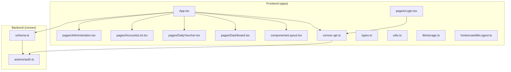
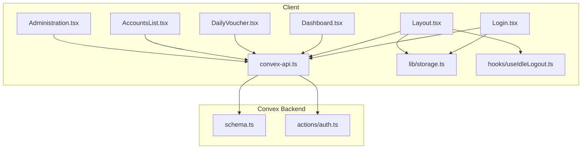
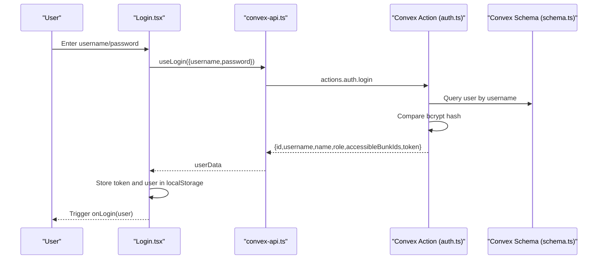
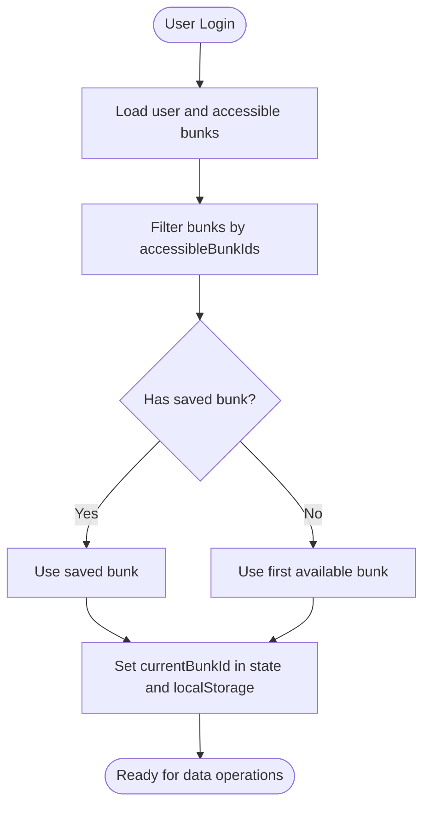
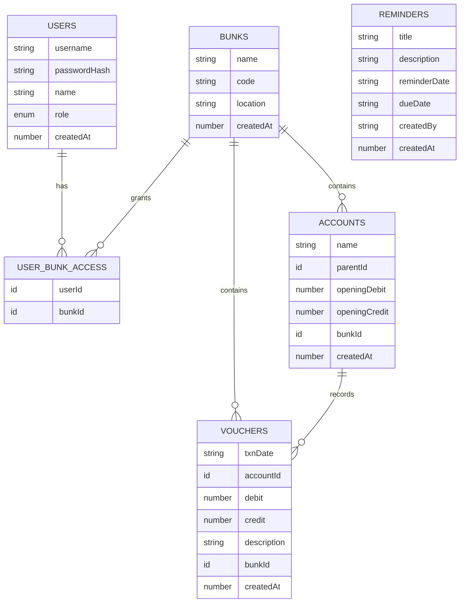
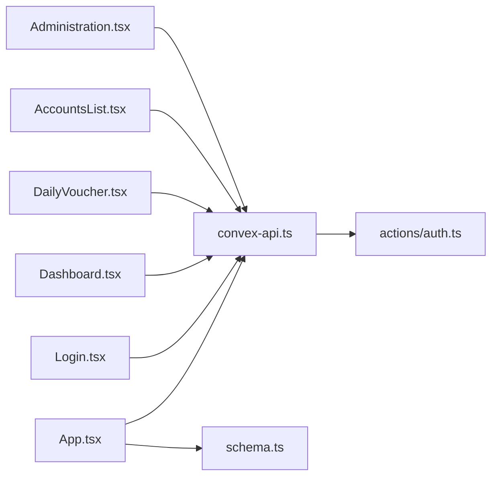

# Project Overview

<cite>
**Referenced Files in This Document**
- [README.md](file://README.md)
- [package.json](file://package.json)
- [App.tsx](file://apps/App.tsx)
- [types.ts](file://apps/types.ts)
- [schema.ts](file://convex/schema.ts)
- [auth.ts](file://convex/actions/auth.ts)
- [convex-api.ts](file://apps/convex-api.ts)
- [Login.tsx](file://apps/pages/Login.tsx)
- [storage.ts](file://apps/lib/storage.ts)
- [Layout.tsx](file://apps/components/Layout.tsx)
- [Dashboard.tsx](file://apps/pages/Dashboard.tsx)
- [DailyVoucher.tsx](file://apps/pages/DailyVoucher.tsx)
- [AccountsList.tsx](file://apps/pages/AccountsList.tsx)
- [Administration.tsx](file://apps/pages/Administration.tsx)
- [useIdleLogout.ts](file://apps/hooks/useIdleLogout.ts)
- [utils.ts](file://apps/utils.ts)
</cite>

## Table of Contents
1. [Introduction](#introduction)
2. [Project Structure](#project-structure)
3. [Core Components](#core-components)
4. [Architecture Overview](#architecture-overview)
5. [Detailed Component Analysis](#detailed-component-analysis)
6. [Dependency Analysis](#dependency-analysis)
7. [Performance Considerations](#performance-considerations)
8. [Troubleshooting Guide](#troubleshooting-guide)
9. [Conclusion](#conclusion)

## Introduction
KR-FUELS is a multi-location fuel station accounting management system designed to streamline daily accounting operations across several fuel station locations. Its purpose is to provide a centralized, secure, and efficient platform for managing ledgers, posting daily vouchers, generating cash and ledger reports, and maintaining administrative controls for super-admins.

Core value proposition for fuel station operators:
- Centralized multi-location accounting with per-bunk isolation and access control
- Real-time dashboards and reminders to improve visibility and operational discipline
- Batched daily voucher posting with immediate cash balance reconciliation
- Hierarchical chart of accounts with drill-down reporting capabilities
- Secure administration with role-based permissions and idle session management

Key differentiators:
- Built-in idle logout and lightweight authentication tailored for branch environments
- Convex serverless backend for simplified deployment and automatic scaling
- Strong typing via TypeScript across frontend and backend for reliability
- Intuitive UI flows for daily operations (posting, editing, deleting) with safety checks

Target audience:
- Fuel station managers who oversee daily cash operations and require quick insights
- Accounting staff responsible for maintaining ledgers and preparing reports
- Administrators who manage users, stations, and access permissions

## Project Structure
The project follows a dual-repository layout:
- Frontend (apps): React 19 application with TypeScript, Convex hooks, and routing
- Backend (convex): Convex schema, queries, mutations, and actions

**Diagram sources**
- [App.tsx](file://apps/App.tsx#L1-L266)
- [Login.tsx](file://apps/pages/Login.tsx#L1-L167)
- [Layout.tsx](file://apps/components/Layout.tsx#L1-L311)
- [Dashboard.tsx](file://apps/pages/Dashboard.tsx#L1-L219)
- [DailyVoucher.tsx](file://apps/pages/DailyVoucher.tsx#L1-L336)
- [AccountsList.tsx](file://apps/pages/AccountsList.tsx#L1-L254)
- [Administration.tsx](file://apps/pages/Administration.tsx#L1-L376)
- [convex-api.ts](file://apps/convex-api.ts#L1-L33)
- [types.ts](file://apps/types.ts#L1-L56)
- [utils.ts](file://apps/utils.ts#L1-L69)
- [storage.ts](file://apps/lib/storage.ts#L1-L34)
- [useIdleLogout.ts](file://apps/hooks/useIdleLogout.ts#L1-L33)
- [schema.ts](file://convex/schema.ts#L1-L85)
- [auth.ts](file://convex/actions/auth.ts#L1-L148)

**Section sources**
- [README.md](file://README.md#L1-L13)
- [package.json](file://package.json#L1-L26)
- [App.tsx](file://apps/App.tsx#L1-L266)
- [schema.ts](file://convex/schema.ts#L1-L85)

## Core Components
- Application shell and routing: Orchestrates pages, user state, and Convex data bindings
- Authentication and session: Lightweight username/password login with local token storage and idle logout
- Multi-location context: Bunk selection with per-user access control
- Feature pages: Dashboard, Daily Voucher, Accounts List, Ledger Reports, Cash Reports, Reminders, Administration
- Utilities: Currency and date formatting, ledger calculation helpers, hierarchy traversal

**Section sources**
- [App.tsx](file://apps/App.tsx#L1-L266)
- [Login.tsx](file://apps/pages/Login.tsx#L1-L167)
- [Layout.tsx](file://apps/components/Layout.tsx#L1-L311)
- [Dashboard.tsx](file://apps/pages/Dashboard.tsx#L1-L219)
- [DailyVoucher.tsx](file://apps/pages/DailyVoucher.tsx#L1-L336)
- [AccountsList.tsx](file://apps/pages/AccountsList.tsx#L1-L254)
- [Administration.tsx](file://apps/pages/Administration.tsx#L1-L376)
- [convex-api.ts](file://apps/convex-api.ts#L1-L33)
- [types.ts](file://apps/types.ts#L1-L56)
- [utils.ts](file://apps/utils.ts#L1-L69)
- [storage.ts](file://apps/lib/storage.ts#L1-L34)
- [useIdleLogout.ts](file://apps/hooks/useIdleLogout.ts#L1-L33)

## Architecture Overview
KR-FUELS integrates a React 19 frontend with a Convex serverless backend. The frontend uses Convex React hooks to query and mutate data, while the backend defines a typed schema and implements actions and mutations for authentication and data operations.

**Diagram sources**
- [Login.tsx](file://apps/pages/Login.tsx#L1-L167)
- [Layout.tsx](file://apps/components/Layout.tsx#L1-L311)
- [Dashboard.tsx](file://apps/pages/Dashboard.tsx#L1-L219)
- [DailyVoucher.tsx](file://apps/pages/DailyVoucher.tsx#L1-L336)
- [AccountsList.tsx](file://apps/pages/AccountsList.tsx#L1-L254)
- [Administration.tsx](file://apps/pages/Administration.tsx#L1-L376)
- [convex-api.ts](file://apps/convex-api.ts#L1-L33)
- [storage.ts](file://apps/lib/storage.ts#L1-L34)
- [useIdleLogout.ts](file://apps/hooks/useIdleLogout.ts#L1-L33)
- [schema.ts](file://convex/schema.ts#L1-L85)
- [auth.ts](file://convex/actions/auth.ts#L1-L148)

## Detailed Component Analysis

### Technology Stack
- Frontend: React 19, TypeScript, Convex React hooks, React Router, Lucide icons
- Backend: Convex serverless platform with typed schema and Node.js actions
- Build and tooling: Vite, TypeScript compiler, npm scripts

Practical implications:
- Rapid iteration with hot module replacement during development
- Strong typing reduces runtime errors and improves maintainability
- Convex simplifies backend operations with schema-driven queries and mutations

**Section sources**
- [package.json](file://package.json#L1-L26)
- [App.tsx](file://apps/App.tsx#L1-L266)
- [schema.ts](file://convex/schema.ts#L1-L85)

### Authentication Flow
The system uses a simple username/password login with bcrypt on the server side. On successful login, the client stores a minimal token and user metadata in localStorage and transitions to the main application shell.

**Diagram sources**
- [Login.tsx](file://apps/pages/Login.tsx#L1-L167)
- [convex-api.ts](file://apps/convex-api.ts#L1-L33)
- [auth.ts](file://convex/actions/auth.ts#L1-L148)
- [schema.ts](file://convex/schema.ts#L1-L85)

**Section sources**
- [Login.tsx](file://apps/pages/Login.tsx#L1-L167)
- [convex-api.ts](file://apps/convex-api.ts#L1-L33)
- [auth.ts](file://convex/actions/auth.ts#L1-L148)
- [storage.ts](file://apps/lib/storage.ts#L1-L34)

### Multi-Bunk Access Control
Users’ accessible bunks are determined by a many-to-many relationship stored in the schema. The application filters available bunks and sets the current bunk context for data operations.

**Diagram sources**
- [App.tsx](file://apps/App.tsx#L1-L266)
- [schema.ts](file://convex/schema.ts#L1-L85)

**Section sources**
- [App.tsx](file://apps/App.tsx#L1-L266)
- [schema.ts](file://convex/schema.ts#L1-L85)

### Database Schema Design
The schema defines six main tables with appropriate indexing for performance and access patterns typical of fuel station accounting.

**Diagram sources**
- [schema.ts](file://convex/schema.ts#L1-L85)

**Section sources**
- [schema.ts](file://convex/schema.ts#L1-L85)

### Feature Categories and Workflows
- Daily Voucher Posting
  - Users compose batched DR/CR entries for a selected date
  - System enforces mutual exclusivity of DR/CR per row and validates account selection
  - Posted vouchers update cash balances and can be edited or deleted retroactively
  - Practical example: Recording diesel sales with contra accounts and verifying closing cash

- Accounts Management
  - Hierarchical chart of accounts with opening balances
  - Group expansion/collapse and nested rendering
  - Creation, updates, and deletion with safety checks (no sub-accounts allowed for deletion)

- Reporting
  - Dashboard: Opening/closing cash, inflow/outflow totals, recent activity, reminders
  - Ledger Report: Dr/Cr entries with running balance for a selected account and date range
  - Cash Report: Day-level reconciliation and summary statistics

- Administration
  - Manage fuel stations (bunks) and user accounts
  - Assign per-bunk access to branch admins
  - Super admin global access and unrestricted permissions

- Security and UX
  - Idle logout after inactivity
  - Local storage persistence for user, token, and current bunk
  - Role-based navigation and restricted access to administration

**Section sources**
- [DailyVoucher.tsx](file://apps/pages/DailyVoucher.tsx#L1-L336)
- [AccountsList.tsx](file://apps/pages/AccountsList.tsx#L1-L254)
- [Dashboard.tsx](file://apps/pages/Dashboard.tsx#L1-L219)
- [Administration.tsx](file://apps/pages/Administration.tsx#L1-L376)
- [useIdleLogout.ts](file://apps/hooks/useIdleLogout.ts#L1-L33)
- [storage.ts](file://apps/lib/storage.ts#L1-L34)
- [utils.ts](file://apps/utils.ts#L1-L69)

## Dependency Analysis
Frontend-to-backend dependency mapping highlights how the React app consumes Convex-generated APIs and actions.

**Diagram sources**
- [App.tsx](file://apps/App.tsx#L1-L266)
- [Login.tsx](file://apps/pages/Login.tsx#L1-L167)
- [Dashboard.tsx](file://apps/pages/Dashboard.tsx#L1-L219)
- [DailyVoucher.tsx](file://apps/pages/DailyVoucher.tsx#L1-L336)
- [AccountsList.tsx](file://apps/pages/AccountsList.tsx#L1-L254)
- [Administration.tsx](file://apps/pages/Administration.tsx#L1-L376)
- [convex-api.ts](file://apps/convex-api.ts#L1-L33)
- [auth.ts](file://convex/actions/auth.ts#L1-L148)
- [schema.ts](file://convex/schema.ts#L1-L85)

**Section sources**
- [App.tsx](file://apps/App.tsx#L1-L266)
- [convex-api.ts](file://apps/convex-api.ts#L1-L33)
- [auth.ts](file://convex/actions/auth.ts#L1-L148)
- [schema.ts](file://convex/schema.ts#L1-L85)

## Performance Considerations
- Use indexes strategically: the schema already indexes frequently queried fields (e.g., by_code, by_username, by_bunk_and_date)
- Minimize re-renders: leverage useMemo and useCallback in the app shell for derived data (e.g., available bunks, current bunk accounts)
- Pagination and filtering: apply server-side filtering for large datasets (e.g., reminders, vouchers) to reduce payload sizes
- Debounce user inputs: consider debouncing search/filter operations in lists to avoid excessive recomputation

[No sources needed since this section provides general guidance]

## Troubleshooting Guide
Common issues and resolutions:
- Login failures: Verify username exists and password meets minimum length; check bcrypt comparison errors
- No data displayed: Ensure bunks are loaded and a valid current bunk is selected; confirm user has access to the selected bunk
- Idle logout: Adjust idle timeout or disable auto-logout for long sessions; verify event listeners are attached
- Voucher posting errors: Ensure a valid ledger account is selected, a bunk is chosen, and DR/CR are mutually exclusive per row

**Section sources**
- [auth.ts](file://convex/actions/auth.ts#L1-L148)
- [App.tsx](file://apps/App.tsx#L1-L266)
- [useIdleLogout.ts](file://apps/hooks/useIdleLogout.ts#L1-L33)
- [DailyVoucher.tsx](file://apps/pages/DailyVoucher.tsx#L1-L336)

## Conclusion
KR-FUELS delivers a focused, scalable solution for multi-location fuel station accounting. By combining React 19, TypeScript, and Convex, it achieves a clean separation of concerns, strong typing, and simplified backend operations. The system’s emphasis on daily voucher posting, hierarchical accounts, and administrative controls aligns with real-world needs in fuel station environments, while the idle logout and access control features enhance security and usability.