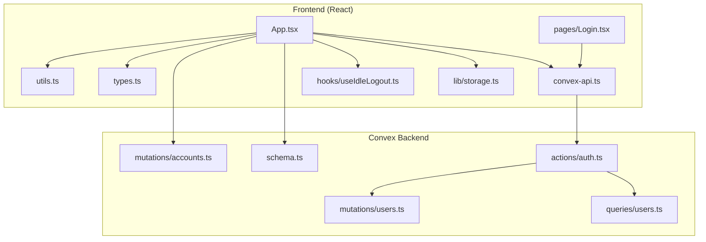
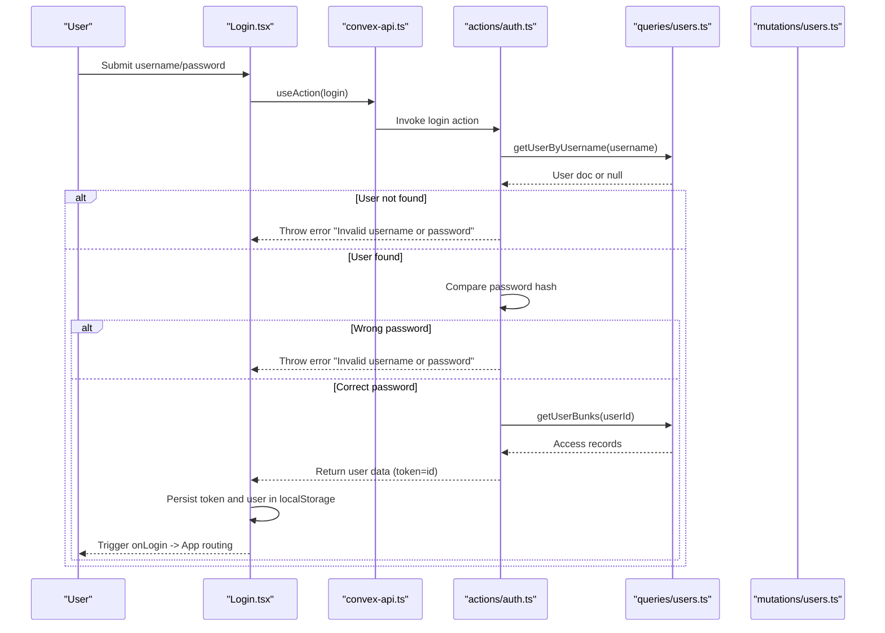
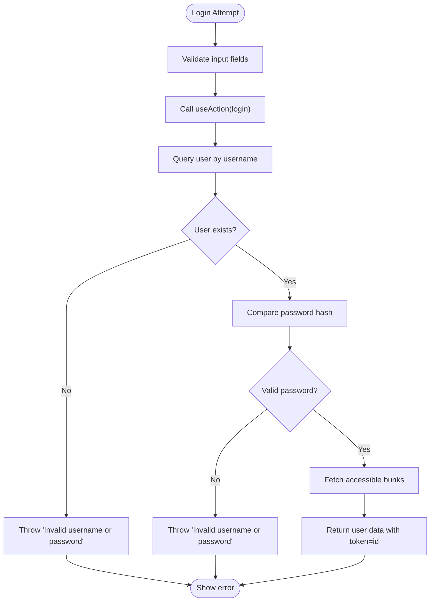
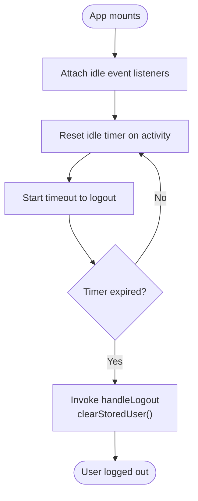
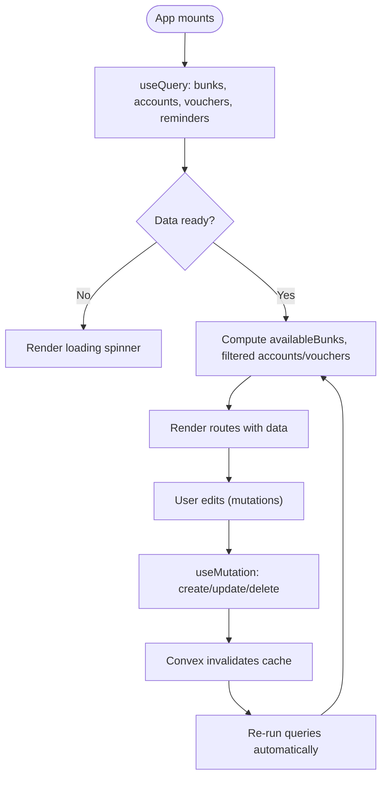
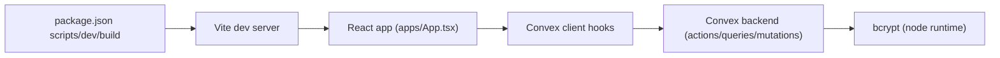

# Troubleshooting & FAQ

<cite>
**Referenced Files in This Document**
- [README.md](file://README.md)
- [package.json](file://package.json)
- [apps/App.tsx](file://apps/App.tsx)
- [apps/pages/Login.tsx](file://apps/pages/Login.tsx)
- [apps/hooks/useIdleLogout.ts](file://apps/hooks/useIdleLogout.ts)
- [apps/lib/storage.ts](file://apps/lib/storage.ts)
- [apps/convex-api.ts](file://apps/convex-api.ts)
- [apps/types.ts](file://apps/types.ts)
- [apps/utils.ts](file://apps/utils.ts)
- [convex/actions/auth.ts](file://convex/actions/auth.ts)
- [convex/schema.ts](file://convex/schema.ts)
- [convex/mutations/users.ts](file://convex/mutations/users.ts)
- [convex/queries/users.ts](file://convex/queries/users.ts)
- [convex/mutations/accounts.ts](file://convex/mutations/accounts.ts)
</cite>

## Table of Contents
1. [Introduction](#introduction)
2. [Project Structure](#project-structure)
3. [Core Components](#core-components)
4. [Architecture Overview](#architecture-overview)
5. [Detailed Component Analysis](#detailed-component-analysis)
6. [Dependency Analysis](#dependency-analysis)
7. [Performance Considerations](#performance-considerations)
8. [Troubleshooting Guide](#troubleshooting-guide)
9. [Conclusion](#conclusion)
10. [Appendices](#appendices)

## Introduction
This document provides a comprehensive troubleshooting guide and FAQ for KR-FUELS. It focuses on diagnosing and resolving authentication issues (login failures, session timeouts, password changes), data synchronization and performance problems, error handling scenarios, development environment setup, and debugging techniques for frontend, backend, and database connectivity. It also covers security-related topics, access control, and data integrity, along with frequently asked questions about system capabilities and compatibility.

## Project Structure
KR-FUELS is a React application bundled with Vite and integrated with Convex for backend logic and schema-driven data. The frontend handles routing, user state, and data synchronization via Convex hooks. Authentication is handled by Convex actions, while local storage persists user sessions and preferences.

**Diagram sources**
- [apps/App.tsx](file://apps/App.tsx#L1-L266)
- [apps/pages/Login.tsx](file://apps/pages/Login.tsx#L1-L167)
- [apps/hooks/useIdleLogout.ts](file://apps/hooks/useIdleLogout.ts#L1-L33)
- [apps/lib/storage.ts](file://apps/lib/storage.ts#L1-L34)
- [apps/convex-api.ts](file://apps/convex-api.ts#L1-L33)
- [apps/types.ts](file://apps/types.ts#L1-L56)
- [apps/utils.ts](file://apps/utils.ts#L1-L69)
- [convex/actions/auth.ts](file://convex/actions/auth.ts#L1-L148)
- [convex/schema.ts](file://convex/schema.ts#L1-L85)
- [convex/queries/users.ts](file://convex/queries/users.ts#L1-L35)
- [convex/mutations/users.ts](file://convex/mutations/users.ts#L1-L81)
- [convex/mutations/accounts.ts](file://convex/mutations/accounts.ts#L1-L63)

**Section sources**
- [README.md](file://README.md#L1-L13)
- [package.json](file://package.json#L1-L26)
- [apps/App.tsx](file://apps/App.tsx#L1-L266)
- [apps/pages/Login.tsx](file://apps/pages/Login.tsx#L1-L167)
- [apps/hooks/useIdleLogout.ts](file://apps/hooks/useIdleLogout.ts#L1-L33)
- [apps/lib/storage.ts](file://apps/lib/storage.ts#L1-L34)
- [apps/convex-api.ts](file://apps/convex-api.ts#L1-L33)
- [apps/types.ts](file://apps/types.ts#L1-L56)
- [apps/utils.ts](file://apps/utils.ts#L1-L69)
- [convex/actions/auth.ts](file://convex/actions/auth.ts#L1-L148)
- [convex/schema.ts](file://convex/schema.ts#L1-L85)
- [convex/queries/users.ts](file://convex/queries/users.ts#L1-L35)
- [convex/mutations/users.ts](file://convex/mutations/users.ts#L1-L81)
- [convex/mutations/accounts.ts](file://convex/mutations/accounts.ts#L1-L63)

## Core Components
- Frontend routing and state: App orchestrates routes, user state, and data synchronization from Convex queries. It manages bunk selection, account filtering, and voucher operations.
- Authentication flow: Login page triggers a Convex action to authenticate users, stores a minimal token and user object in local storage, and transitions to the dashboard.
- Idle logout: A reusable hook monitors user activity and logs out after a configured period of inactivity.
- Local storage: Persists user profile, token, and current bunk selection.
- Convex schema and actions: Defines the data model and implements authentication, registration, and password change logic.

Key implementation references:
- [App initialization and routing](file://apps/App.tsx#L21-L262)
- [Login form and action invocation](file://apps/pages/Login.tsx#L30-L56)
- [Idle logout hook](file://apps/hooks/useIdleLogout.ts#L10-L31)
- [Local storage helpers](file://apps/lib/storage.ts#L1-L34)
- [Convex action exports](file://apps/convex-api.ts#L7-L9)
- [Authentication action handlers](file://convex/actions/auth.ts#L18-L56)
- [Schema definitions](file://convex/schema.ts#L9-L84)

**Section sources**
- [apps/App.tsx](file://apps/App.tsx#L21-L262)
- [apps/pages/Login.tsx](file://apps/pages/Login.tsx#L30-L56)
- [apps/hooks/useIdleLogout.ts](file://apps/hooks/useIdleLogout.ts#L10-L31)
- [apps/lib/storage.ts](file://apps/lib/storage.ts#L1-L34)
- [apps/convex-api.ts](file://apps/convex-api.ts#L7-L9)
- [convex/actions/auth.ts](file://convex/actions/auth.ts#L18-L56)
- [convex/schema.ts](file://convex/schema.ts#L9-L84)

## Architecture Overview
The system follows a client-driven architecture with Convex backend functions:
- Frontend (React + Vite) renders pages and manages user state.
- Convex actions handle authentication and sensitive operations.
- Queries and mutations manage data access and persistence.
- Local storage maintains lightweight session state.

**Diagram sources**
- [apps/pages/Login.tsx](file://apps/pages/Login.tsx#L30-L56)
- [apps/convex-api.ts](file://apps/convex-api.ts#L7-L9)
- [convex/actions/auth.ts](file://convex/actions/auth.ts#L18-L56)
- [convex/queries/users.ts](file://convex/queries/users.ts#L4-L12)
- [convex/mutations/users.ts](file://convex/mutations/users.ts#L13-L41)

## Detailed Component Analysis

### Authentication Flow and Troubleshooting
Common issues:
- Invalid username or password
- User not found
- Incorrect current password during change
- Weak/new password validation errors

Resolution steps:
- Verify credentials against the stored user record and password hash.
- Ensure the user exists and has access to at least one bunk.
- Enforce minimum password length during registration and change operations.
- Confirm the client displays the thrown error message to the user.

**Diagram sources**
- [apps/pages/Login.tsx](file://apps/pages/Login.tsx#L30-L56)
- [convex/actions/auth.ts](file://convex/actions/auth.ts#L18-L56)
- [convex/queries/users.ts](file://convex/queries/users.ts#L4-L12)

**Section sources**
- [apps/pages/Login.tsx](file://apps/pages/Login.tsx#L30-L56)
- [convex/actions/auth.ts](file://convex/actions/auth.ts#L18-L56)
- [convex/queries/users.ts](file://convex/queries/users.ts#L4-L12)

### Session Timeout and Idle Logout
Symptoms:
- Unexpected logout after inactivity.
- Alert indicating idle timeout expiry.

Root cause:
- Idle detection resets a timer on activity events; on timeout, the logout handler clears stored user and token.

Resolution:
- Adjust idle threshold if needed.
- Ensure the idle event listeners are attached and timers are cleared on unmount.

**Diagram sources**
- [apps/hooks/useIdleLogout.ts](file://apps/hooks/useIdleLogout.ts#L10-L31)
- [apps/App.tsx](file://apps/App.tsx#L40-L45)
- [apps/lib/storage.ts](file://apps/lib/storage.ts#L20-L24)

**Section sources**
- [apps/hooks/useIdleLogout.ts](file://apps/hooks/useIdleLogout.ts#L10-L31)
- [apps/App.tsx](file://apps/App.tsx#L40-L45)
- [apps/lib/storage.ts](file://apps/lib/storage.ts#L20-L24)

### Data Synchronization and Performance
Symptoms:
- Blank loading screen while fetching data.
- Slow rendering of lists or reports.
- Inconsistent data after edits.

Root causes:
- Initial fetch of bunks, accounts, vouchers, and reminders.
- Filtering and memoization of data per bunk.
- Network latency and optimistic updates.

Resolution:
- Confirm Convex queries resolve and data arrives.
- Verify memoized computations and filtered arrays.
- Reduce unnecessary re-renders by passing stable props.
- Monitor UI responsiveness and consider pagination or virtualization for large datasets.

**Diagram sources**
- [apps/App.tsx](file://apps/App.tsx#L22-L114)
- [apps/App.tsx](file://apps/App.tsx#L116-L197)

**Section sources**
- [apps/App.tsx](file://apps/App.tsx#L22-L114)
- [apps/App.tsx](file://apps/App.tsx#L116-L197)

### Error Handling Scenarios
Common errors and diagnostics:
- Account deletion fails if sub-accounts exist.
- Voucher posting requires a valid account and bunk selection.
- General mutation errors surface via alerts.

Resolution:
- Validate prerequisites before mutations.
- Inspect thrown error messages and display user-friendly feedback.
- Use console/network inspection to capture underlying causes.

**Section sources**
- [convex/mutations/accounts.ts](file://convex/mutations/accounts.ts#L45-L61)
- [apps/App.tsx](file://apps/App.tsx#L153-L174)

### Security and Access Control
- Authentication uses bcrypt for password hashing and returns a minimal token equal to the user ID.
- Access control is enforced by restricting visible bunks to the user’s accessible bunk IDs.
- Registration enforces role and password constraints.

Recommendations:
- Rotate tokens periodically if extending the design.
- Audit accessible bunk assignments.
- Enforce strong password policies and consider rate limiting.

**Section sources**
- [convex/actions/auth.ts](file://convex/actions/auth.ts#L18-L56)
- [convex/mutations/users.ts](file://convex/mutations/users.ts#L13-L41)
- [apps/App.tsx](file://apps/App.tsx#L47-L54)

### Database Connectivity and Schema Integrity
- Convex schema defines tables and indexes for users, accounts, vouchers, reminders, and junction tables.
- Queries leverage indexes for efficient lookups.
- Mutations enforce referential constraints and data validity.

Diagnostics:
- Verify table existence and indexes.
- Check query filters and indexes used.
- Ensure mutation preconditions (e.g., “not found” checks) are met.

**Section sources**
- [convex/schema.ts](file://convex/schema.ts#L9-L84)
- [convex/queries/users.ts](file://convex/queries/users.ts#L4-L22)
- [convex/mutations/accounts.ts](file://convex/mutations/accounts.ts#L32-L61)

## Dependency Analysis
Runtime and build dependencies:
- Frontend: React, React Router, Convex client, Vite, TypeScript.
- Backend logic: bcrypt for password hashing in Convex actions.

**Diagram sources**
- [package.json](file://package.json#L6-L10)
- [apps/convex-api.ts](file://apps/convex-api.ts#L1-L3)
- [convex/actions/auth.ts](file://convex/actions/auth.ts#L6-L7)

**Section sources**
- [package.json](file://package.json#L6-L24)
- [apps/convex-api.ts](file://apps/convex-api.ts#L1-L3)
- [convex/actions/auth.ts](file://convex/actions/auth.ts#L6-L7)

## Performance Considerations
- Minimize heavy computations in render; use memoization and stable references.
- Debounce or throttle frequent updates.
- Prefer incremental loading for large lists.
- Monitor network requests and optimize query scopes.

[No sources needed since this section provides general guidance]

## Troubleshooting Guide

### Authentication Problems
- Login fails with “Invalid username or password”
  - Verify the username exists and the password matches the stored hash.
  - Confirm the action throws the expected error and the UI displays it.
  - Steps:
    - Check user existence via the username index.
    - Validate password comparison.
    - Ensure accessible bunks are returned for the user.
  - References:
    - [apps/pages/Login.tsx](file://apps/pages/Login.tsx#L30-L56)
    - [convex/actions/auth.ts](file://convex/actions/auth.ts#L18-L56)
    - [convex/queries/users.ts](file://convex/queries/users.ts#L4-L12)

- Session timeouts unexpectedly
  - The idle logout hook resets a timer on activity; on expiry, it invokes the logout handler.
  - Steps:
    - Confirm idle events are attached and timer cleared on unmount.
    - Adjust the idle threshold if necessary.
  - References:
    - [apps/hooks/useIdleLogout.ts](file://apps/hooks/useIdleLogout.ts#L10-L31)
    - [apps/App.tsx](file://apps/App.tsx#L40-L45)
    - [apps/lib/storage.ts](file://apps/lib/storage.ts#L20-L24)

- Password change issues
  - Current password must be correct; new password must meet length requirements.
  - Steps:
    - Validate old password via hash comparison.
    - Enforce new password length.
    - Update the stored password hash.
  - References:
    - [convex/actions/auth.ts](file://convex/actions/auth.ts#L109-L147)
    - [convex/mutations/users.ts](file://convex/mutations/users.ts#L47-L58)

### Data Synchronization and Performance
- App shows loading spinner indefinitely
  - Steps:
    - Confirm Convex queries resolve and data arrives.
    - Check for network errors or slow indexes.
  - References:
    - [apps/App.tsx](file://apps/App.tsx#L205-L214)

- Voucher posting fails
  - Steps:
    - Ensure a valid account is selected and a bunk is chosen.
    - Catch and display mutation errors.
  - References:
    - [apps/App.tsx](file://apps/App.tsx#L153-L174)

- Account deletion blocked
  - Steps:
    - Verify no sub-accounts exist under the target account.
    - Remove children first or restructure hierarchy.
  - References:
    - [convex/mutations/accounts.ts](file://convex/mutations/accounts.ts#L45-L61)

### Error Handling Scenarios
- Clear error messages and user feedback
  - Steps:
    - Display thrown error messages from actions/mutations.
    - Use alerts or toast notifications for visibility.
  - References:
    - [apps/App.tsx](file://apps/App.tsx#L126-L128)
    - [apps/App.tsx](file://apps/App.tsx#L140-L142)
    - [apps/App.tsx](file://apps/App.tsx#L148-L150)
    - [apps/App.tsx](file://apps/App.tsx#L171-L173)
    - [apps/App.tsx](file://apps/App.tsx#L179-L181)
    - [apps/App.tsx](file://apps/App.tsx#L194-L196)

### Development Environment Setup
- Running locally
  - Steps:
    - Install dependencies.
    - Start the dev server.
  - References:
    - [README.md](file://README.md#L8-L11)
    - [package.json](file://package.json#L6-L10)

- Build and preview
  - Steps:
    - Build the app.
    - Preview the production bundle.
  - References:
    - [package.json](file://package.json#L8-L9)

### Debugging Techniques
- Frontend debugging
  - Inspect React DevTools to verify state and props.
  - Check local storage keys for user and token.
  - References:
    - [apps/lib/storage.ts](file://apps/lib/storage.ts#L1-L34)
    - [apps/App.tsx](file://apps/App.tsx#L38-L70)

- Backend debugging
  - Use Convex CLI to inspect tables and indexes.
  - Add logging in actions/queries for visibility.
  - References:
    - [convex/schema.ts](file://convex/schema.ts#L9-L84)
    - [convex/actions/auth.ts](file://convex/actions/auth.ts#L18-L56)

- Database connectivity
  - Ensure Convex dev server is running and reachable.
  - Validate query indexes and filters.
  - References:
    - [convex/queries/users.ts](file://convex/queries/users.ts#L4-L22)

### Security and Access Control
- Access control issues
  - Steps:
    - Confirm user’s accessible bunk IDs.
    - Restrict UI and data to allowed bunks.
  - References:
    - [apps/App.tsx](file://apps/App.tsx#L47-L54)

- Data integrity
  - Steps:
    - Enforce referential constraints in mutations.
    - Validate inputs before writes.
  - References:
    - [convex/mutations/accounts.ts](file://convex/mutations/accounts.ts#L32-L61)

### Frequently Asked Questions
- Supported browsers
  - The app uses modern web APIs and React. Test on recent Chrome, Firefox, Safari, and Edge.
  - [No sources needed since this section provides general guidance]

- Mobile compatibility
  - The UI uses responsive design. Validate on tablets and phones; report layout or interaction issues.
  - [No sources needed since this section provides general guidance]

- Integration possibilities
  - Convex enables serverless functions and schema-defined data. Extend actions/queries for integrations.
  - [No sources needed since this section provides general guidance]

- System limitations
  - Current design supports a small set of predefined users and simple access control. Scale by adding roles, permissions, and audit logs.
  - [No sources needed since this section provides general guidance]

## Conclusion
This guide consolidates actionable steps to troubleshoot KR-FUELS across authentication, session management, data synchronization, performance, and development setup. By following the diagnostic flows and leveraging the referenced components, both technical and non-technical users can identify root causes, gather sufficient evidence, and escalate issues effectively.

## Appendices
- Gathering diagnostic information
  - Browser console logs and network tab traces.
  - Local storage inspection for user and token.
  - Convex logs and schema inspection.
  - [No sources needed since this section provides general guidance]