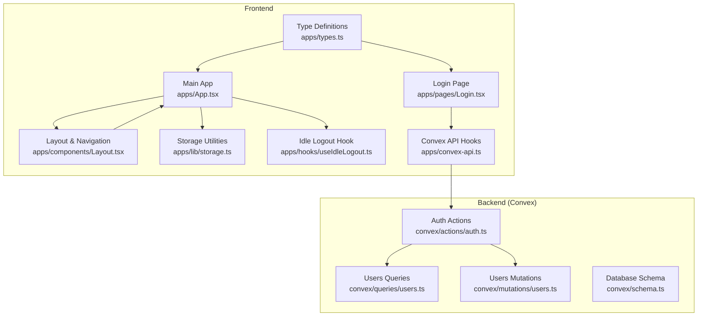
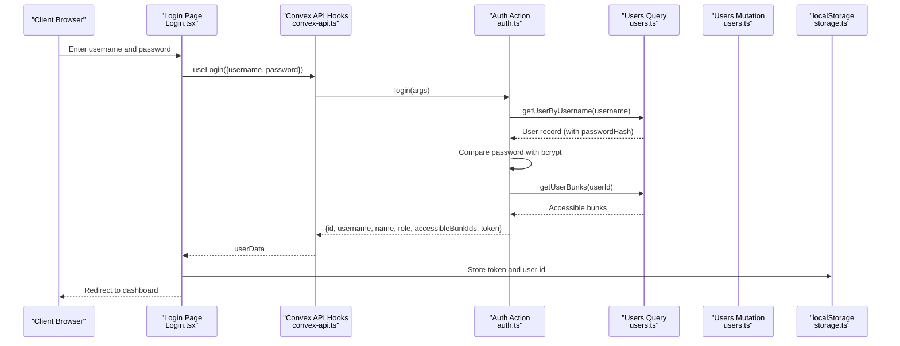
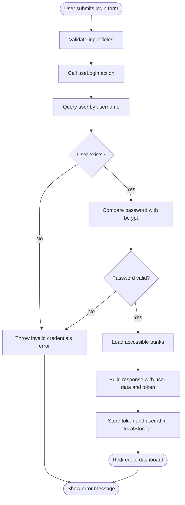
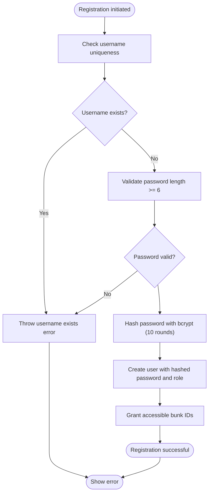
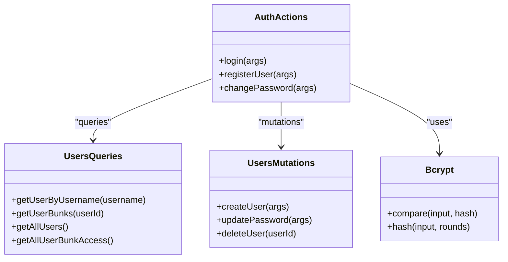
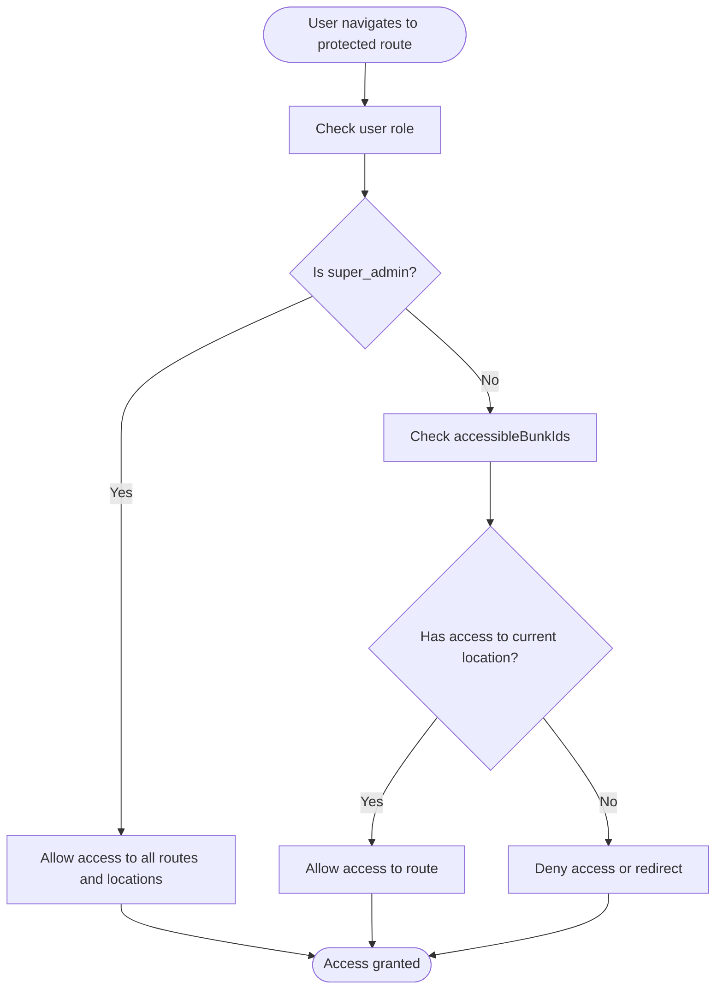
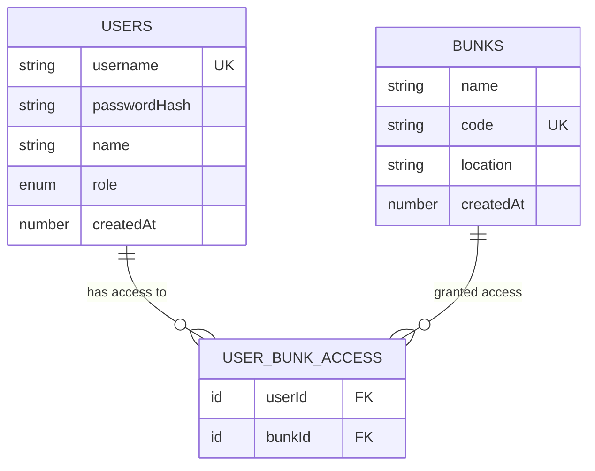
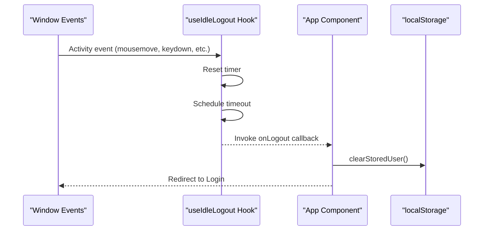
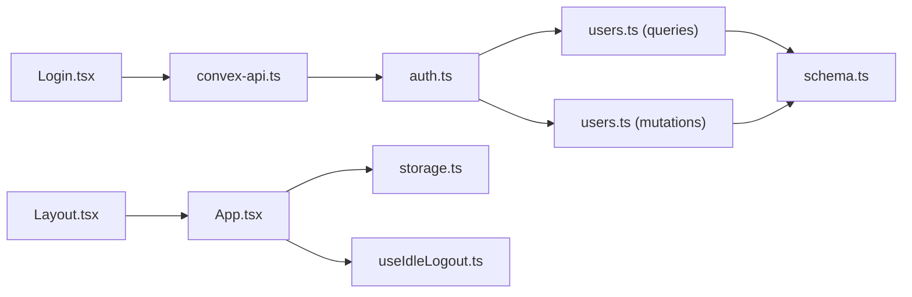

# Authentication and Access Control

<cite>
**Referenced Files in This Document**
- [Login.tsx](file://apps/pages/Login.tsx)
- [auth.ts](file://convex/actions/auth.ts)
- [schema.ts](file://convex/schema.ts)
- [useIdleLogout.ts](file://apps/hooks/useIdleLogout.ts)
- [storage.ts](file://apps/lib/storage.ts)
- [types.ts](file://apps/types.ts)
- [convex-api.ts](file://apps/convex-api.ts)
- [users.ts](file://convex/queries/users.ts)
- [users.ts](file://convex/mutations/users.ts)
- [App.tsx](file://apps/App.tsx)
- [Layout.tsx](file://apps/components/Layout.tsx)
</cite>

## Table of Contents
1. [Introduction](#introduction)
2. [Project Structure](#project-structure)
3. [Core Components](#core-components)
4. [Architecture Overview](#architecture-overview)
5. [Detailed Component Analysis](#detailed-component-analysis)
6. [Dependency Analysis](#dependency-analysis)
7. [Performance Considerations](#performance-considerations)
8. [Troubleshooting Guide](#troubleshooting-guide)
9. [Conclusion](#conclusion)
10. [Appendices](#appendices)

## Introduction
This document provides comprehensive authentication and access control documentation for KR-FUELS. It covers the complete login process, user registration workflow, password security measures, role-based access control (RBAC), location-specific access control, and session persistence. It also includes step-by-step tutorials for user onboarding, password reset procedures, and account security best practices, along with troubleshooting guidance and production deployment considerations.

## Project Structure
The authentication and access control system spans both the frontend React application and the Convex backend:

- Frontend components manage user input, session storage, idle logout, and route protection.
- Convex actions handle authentication logic, password hashing, and user management.
- Database schema defines users, locations (bunks), and access control relationships.

**Diagram sources**
- [Login.tsx](file://apps/pages/Login.tsx#L1-L167)
- [App.tsx](file://apps/App.tsx#L1-L266)
- [Layout.tsx](file://apps/components/Layout.tsx#L1-L311)
- [storage.ts](file://apps/lib/storage.ts#L1-L34)
- [useIdleLogout.ts](file://apps/hooks/useIdleLogout.ts#L1-L33)
- [types.ts](file://apps/types.ts#L1-L56)
- [convex-api.ts](file://apps/convex-api.ts#L1-L33)
- [auth.ts](file://convex/actions/auth.ts#L1-L148)
- [users.ts](file://convex/queries/users.ts#L1-L35)
- [users.ts](file://convex/mutations/users.ts#L1-L81)
- [schema.ts](file://convex/schema.ts#L1-L85)

**Section sources**
- [Login.tsx](file://apps/pages/Login.tsx#L1-L167)
- [App.tsx](file://apps/App.tsx#L1-L266)
- [Layout.tsx](file://apps/components/Layout.tsx#L1-L311)
- [storage.ts](file://apps/lib/storage.ts#L1-L34)
- [useIdleLogout.ts](file://apps/hooks/useIdleLogout.ts#L1-L33)
- [types.ts](file://apps/types.ts#L1-L56)
- [convex-api.ts](file://apps/convex-api.ts#L1-L33)
- [auth.ts](file://convex/actions/auth.ts#L1-L148)
- [users.ts](file://convex/queries/users.ts#L1-L35)
- [users.ts](file://convex/mutations/users.ts#L1-L81)
- [schema.ts](file://convex/schema.ts#L1-L85)

## Core Components
- Authentication Actions: Handle login, user registration, and password changes using bcrypt hashing.
- User Management: Create, update, and delete users with role-based access and location permissions.
- Session Management: Persist tokens and user data in localStorage and enforce idle timeouts.
- Access Control: Role-based permissions (admin, super_admin) and location-specific access via accessibleBunkIds.
- Frontend Integration: Login form, navigation, and route protection.

**Section sources**
- [auth.ts](file://convex/actions/auth.ts#L1-L148)
- [users.ts](file://convex/mutations/users.ts#L1-L81)
- [storage.ts](file://apps/lib/storage.ts#L1-L34)
- [useIdleLogout.ts](file://apps/hooks/useIdleLogout.ts#L1-L33)
- [App.tsx](file://apps/App.tsx#L1-L266)

## Architecture Overview
The authentication architecture follows a client-server model with secure password handling on the backend:

**Diagram sources**
- [Login.tsx](file://apps/pages/Login.tsx#L30-L56)
- [convex-api.ts](file://apps/convex-api.ts#L7-L9)
- [auth.ts](file://convex/actions/auth.ts#L18-L56)
- [users.ts](file://convex/queries/users.ts#L4-L22)
- [storage.ts](file://apps/lib/storage.ts#L26-L33)

## Detailed Component Analysis

### Login Process
The login process validates username/email, authenticates the password using bcrypt, and manages token-based session:

- Username/Email Input: The login form accepts either username or email.
- Credential Validation: The backend queries the user by username and compares the provided password against the stored bcrypt hash.
- Access Control: The backend retrieves accessible bunk IDs for the user to enable location-specific access control.
- Token Management: On successful authentication, the frontend stores a simple token (user ID) and user metadata in localStorage.

**Diagram sources**
- [Login.tsx](file://apps/pages/Login.tsx#L30-L56)
- [auth.ts](file://convex/actions/auth.ts#L18-L56)
- [users.ts](file://convex/queries/users.ts#L4-L22)
- [storage.ts](file://apps/lib/storage.ts#L26-L33)

**Section sources**
- [Login.tsx](file://apps/pages/Login.tsx#L22-L56)
- [auth.ts](file://convex/actions/auth.ts#L18-L56)
- [users.ts](file://convex/queries/users.ts#L4-L22)
- [storage.ts](file://apps/lib/storage.ts#L26-L33)

### User Registration Workflow
The registration process creates new users with validated passwords and assigns roles and accessible locations:

- Username Uniqueness: Checks for existing usernames before creation.
- Password Security: Validates minimum length and hashes the password using bcrypt with 10 rounds.
- Role Assignment: Supports admin and super_admin roles.
- Location Permissions: Assigns accessible bunk IDs during user creation.
- Persistence: Stores the hashed password and user metadata in the database.

**Diagram sources**
- [auth.ts](file://convex/actions/auth.ts#L62-L104)
- [users.ts](file://convex/mutations/users.ts#L13-L41)

**Section sources**
- [auth.ts](file://convex/actions/auth.ts#L62-L104)
- [users.ts](file://convex/mutations/users.ts#L13-L41)

### Password Security Measures
- bcrypt Hashing: Passwords are hashed using bcryptjs with 10 rounds on the server-side.
- No Plain Text Storage: The frontend receives only the hashed password; the backend handles hashing.
- Password Change: Requires verification of the old password and enforces a minimum length for the new password.

**Diagram sources**
- [auth.ts](file://convex/actions/auth.ts#L1-L148)
- [users.ts](file://convex/queries/users.ts#L1-L35)
- [users.ts](file://convex/mutations/users.ts#L1-L81)

**Section sources**
- [auth.ts](file://convex/actions/auth.ts#L33-L37)
- [auth.ts](file://convex/actions/auth.ts#L85-L86)
- [auth.ts](file://convex/actions/auth.ts#L125-L129)
- [auth.ts](file://convex/actions/auth.ts#L136-L137)

### Role-Based Access Control (RBAC)
- Roles: admin and super_admin.
- Super Admin Privileges: Can access administration routes and all locations.
- Admin Access: Restricted to accessible locations defined by accessibleBunkIds.

**Diagram sources**
- [App.tsx](file://apps/App.tsx#L255-L257)
- [App.tsx](file://apps/App.tsx#L47-L54)

**Section sources**
- [App.tsx](file://apps/App.tsx#L255-L257)
- [App.tsx](file://apps/App.tsx#L47-L54)
- [types.ts](file://apps/types.ts#L9-L15)

### Location-Specific Access Control
- Access Model: Many-to-many relationship between users and locations via userBunkAccess.
- Dynamic Filtering: The frontend filters available locations based on user role and accessibleBunkIds.
- Current Location Persistence: The current location selection is persisted in localStorage.

**Diagram sources**
- [schema.ts](file://convex/schema.ts#L23-L40)
- [users.ts](file://convex/queries/users.ts#L14-L22)

**Section sources**
- [schema.ts](file://convex/schema.ts#L23-L40)
- [users.ts](file://convex/queries/users.ts#L14-L22)
- [App.tsx](file://apps/App.tsx#L47-L54)
- [storage.ts](file://apps/lib/storage.ts#L70-L74)

### Session Persistence and Automatic Logout
- Token Storage: The frontend stores a simple token (user ID) and user metadata in localStorage upon successful login.
- Idle Timeout: An idle logout hook monitors user activity and logs out after a configurable period of inactivity.
- Logout Mechanism: Clears stored user data and tokens, then triggers navigation to the login page.

**Diagram sources**
- [useIdleLogout.ts](file://apps/hooks/useIdleLogout.ts#L10-L31)
- [App.tsx](file://apps/App.tsx#L40-L45)
- [storage.ts](file://apps/lib/storage.ts#L20-L24)

**Section sources**
- [storage.ts](file://apps/lib/storage.ts#L26-L33)
- [useIdleLogout.ts](file://apps/hooks/useIdleLogout.ts#L10-L31)
- [App.tsx](file://apps/App.tsx#L40-L45)

### Step-by-Step Tutorials

#### User Onboarding Tutorial
1. Navigate to the login page.
2. Enter username or email and password.
3. Submit the form to authenticate.
4. Upon success, the system stores the token and redirects to the dashboard.
5. Select the appropriate location from the dropdown if multiple locations are accessible.

**Section sources**
- [Login.tsx](file://apps/pages/Login.tsx#L30-L56)
- [App.tsx](file://apps/App.tsx#L67-L70)

#### Password Reset Procedure
- Current Implementation: The system does not include a dedicated password reset flow.
- Available Alternative: Use the password change action to update the password after verifying the old password.
- Steps:
  1. Navigate to the profile dropdown in the header.
  2. Click "Sign Out" to log out.
  3. Re-login with the current credentials.
  4. Use the password change action to set a new password.

**Section sources**
- [auth.ts](file://convex/actions/auth.ts#L109-L147)
- [Layout.tsx](file://apps/components/Layout.tsx#L286-L296)

#### Account Security Best Practices
- Strong Passwords: Enforce minimum length and complexity.
- Regular Updates: Encourage periodic password changes.
- Idle Timeout: Utilize the built-in idle logout to prevent unauthorized access.
- Secure Storage: Rely on localStorage for session persistence; ensure HTTPS in production.

**Section sources**
- [auth.ts](file://convex/actions/auth.ts#L80-L83)
- [auth.ts](file://convex/actions/auth.ts#L131-L134)
- [useIdleLogout.ts](file://apps/hooks/useIdleLogout.ts#L10-L21)

## Dependency Analysis
The authentication system exhibits clear separation of concerns:

- Frontend depends on Convex API hooks for authentication actions.
- Backend actions depend on queries and mutations for user data.
- Database schema defines the relationships enabling RBAC and location access control.

**Diagram sources**
- [Login.tsx](file://apps/pages/Login.tsx#L1-L167)
- [convex-api.ts](file://apps/convex-api.ts#L1-L33)
- [auth.ts](file://convex/actions/auth.ts#L1-L148)
- [users.ts](file://convex/queries/users.ts#L1-L35)
- [users.ts](file://convex/mutations/users.ts#L1-L81)
- [schema.ts](file://convex/schema.ts#L1-L85)
- [App.tsx](file://apps/App.tsx#L1-L266)
- [storage.ts](file://apps/lib/storage.ts#L1-L34)
- [useIdleLogout.ts](file://apps/hooks/useIdleLogout.ts#L1-L33)
- [Layout.tsx](file://apps/components/Layout.tsx#L1-L311)

**Section sources**
- [convex-api.ts](file://apps/convex-api.ts#L7-L9)
- [auth.ts](file://convex/actions/auth.ts#L18-L56)
- [users.ts](file://convex/queries/users.ts#L4-L22)
- [schema.ts](file://convex/schema.ts#L23-L40)

## Performance Considerations
- Bcrypt Rounds: Using 10 rounds balances security and performance; adjust based on hardware capabilities.
- Index Usage: Ensure database indexes on username and access control tables are utilized for efficient lookups.
- Idle Timeout: Configure appropriate idle minutes to minimize session hijacking risk while maintaining usability.

## Troubleshooting Guide
Common authentication issues and resolutions:

- Invalid Credentials: Ensure username/email and password match the stored records. Verify bcrypt comparison logic.
- Username Already Exists: Choose a unique username during registration.
- Password Too Short: Enforce minimum length validation before hashing.
- Access Denied: Confirm the user has accessibleBunkIds for the target location.
- Idle Logout: Adjust idle minutes or disable idle logout if needed for testing.

**Section sources**
- [auth.ts](file://convex/actions/auth.ts#L29-L37)
- [auth.ts](file://convex/actions/auth.ts#L76-L78)
- [auth.ts](file://convex/actions/auth.ts#L80-L83)
- [useIdleLogout.ts](file://apps/hooks/useIdleLogout.ts#L10-L21)

## Conclusion
KR-FUELS implements a straightforward yet secure authentication and access control system. The backend securely handles password hashing and user management, while the frontend provides intuitive login, session persistence, and idle logout. Role-based and location-specific access control ensures appropriate permissions, and the modular design allows for future enhancements such as password reset workflows.

## Appendices

### Production Deployment Considerations
- Transport Security: Use HTTPS to protect data in transit.
- Token Security: Consider rotating tokens and adding expiration; currently, the token is a simple user ID.
- Environment Variables: Store bcrypt rounds and idle timeout in environment variables.
- Logging: Implement structured logging for authentication events without exposing sensitive data.
- Rate Limiting: Add rate limiting to prevent brute force attacks on login attempts.