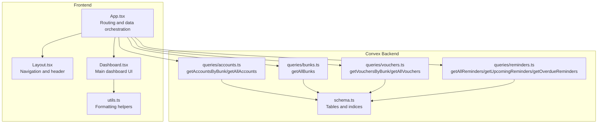
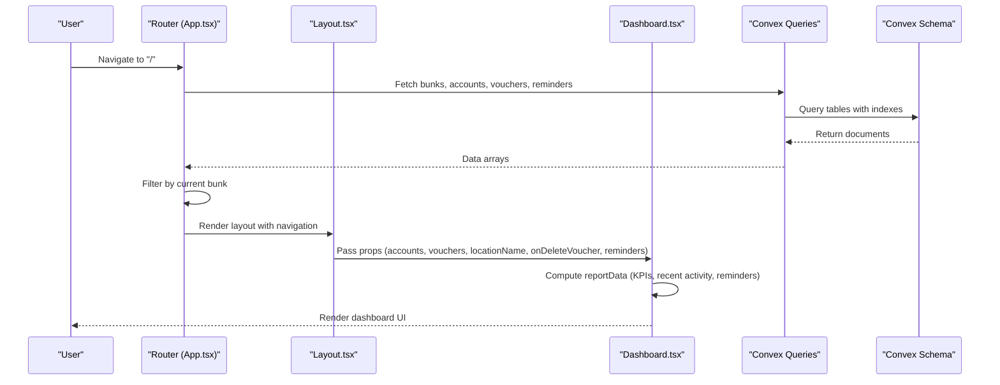
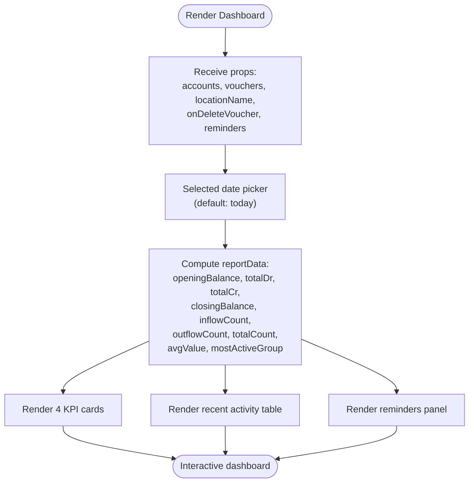
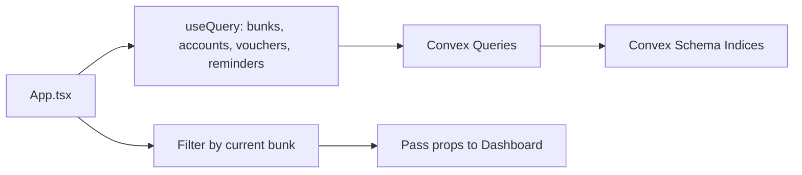
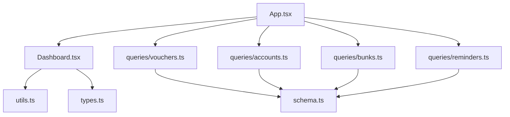
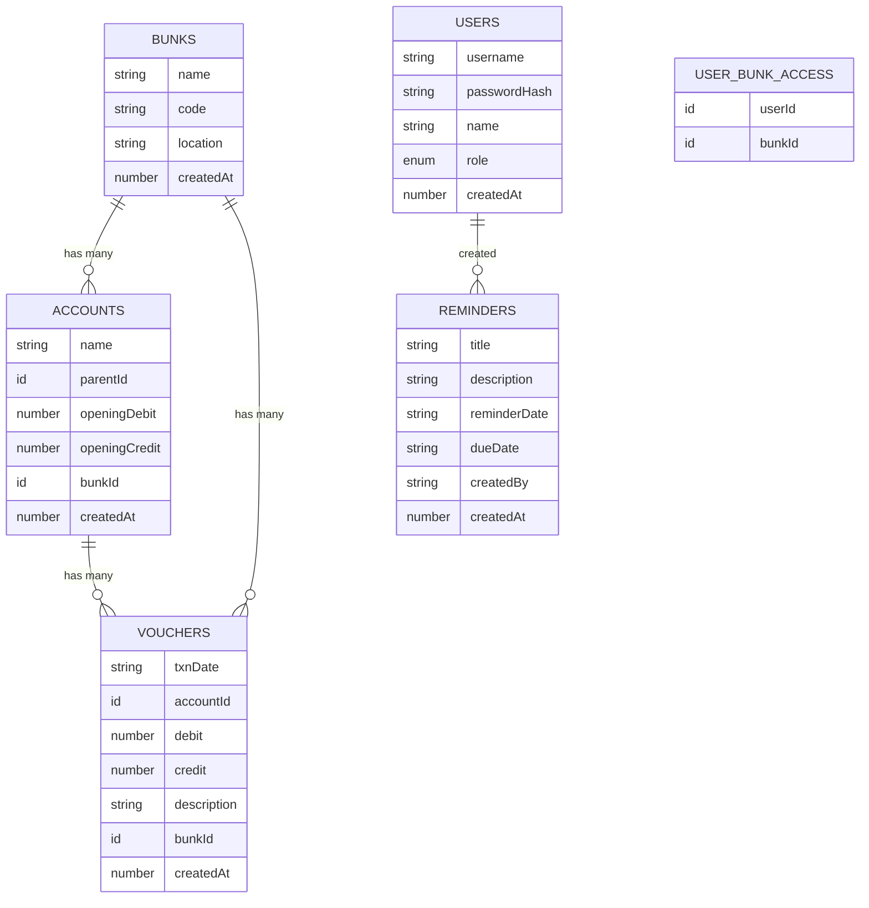

# Dashboard and Analytics

<cite>
**Referenced Files in This Document**
- [Dashboard.tsx](file://apps/pages/Dashboard.tsx)
- [App.tsx](file://apps/App.tsx)
- [Layout.tsx](file://apps/components/Layout.tsx)
- [utils.ts](file://apps/utils.ts)
- [LedgerReport.tsx](file://apps/pages/LedgerReport.tsx)
- [CashReport.tsx](file://apps/pages/CashReport.tsx)
- [Reminders.tsx](file://apps/pages/Reminders.tsx)
- [convex-api.ts](file://apps/convex-api.ts)
- [schema.ts](file://convex/schema.ts)
- [queries/accounts.ts](file://convex/queries/accounts.ts)
- [queries/bunks.ts](file://convex/queries/bunks.ts)
- [queries/vouchers.ts](file://convex/queries/vouchers.ts)
- [queries/reminders.ts](file://convex/queries/reminders.ts)
- [types.ts](file://apps/types.ts)
- [README.md](file://README.md)
</cite>

## Table of Contents
1. [Introduction](#introduction)
2. [Project Structure](#project-structure)
3. [Core Components](#core-components)
4. [Architecture Overview](#architecture-overview)
5. [Detailed Component Analysis](#detailed-component-analysis)
6. [Dependency Analysis](#dependency-analysis)
7. [Performance Considerations](#performance-considerations)
8. [Troubleshooting Guide](#troubleshooting-guide)
9. [Conclusion](#conclusion)
10. [Appendices](#appendices)

## Introduction
This document describes the dashboard and analytics capabilities of KR-FUELS, focusing on the main dashboard interface, key performance indicators, real-time-like updates, and summary statistics. It explains the analytics widgets, charts, and metrics displayed on the dashboard, details data aggregation patterns, and outlines how dashboard components integrate with underlying data sources. Guidance is included for interpreting dashboard metrics, identifying trends, and making data-driven decisions. Customization options for dashboard layouts and widget configurations are documented, along with performance considerations for large datasets and real-time data updates. Troubleshooting guidance is provided for dashboard loading issues and data synchronization problems.

## Project Structure
The dashboard is part of a React application integrated with Convex for backend data access. The main dashboard page composes:
- Summary cards for financial KPIs
- Recent activity table
- Reminders panel with active/due indicators

Routing and layout are handled by the application shell, while data is fetched via Convex queries and transformed for rendering.

**Diagram sources**
- [App.tsx](file://apps/App.tsx#L1-L266)
- [Layout.tsx](file://apps/components/Layout.tsx#L1-L311)
- [Dashboard.tsx](file://apps/pages/Dashboard.tsx#L1-L219)
- [utils.ts](file://apps/utils.ts#L1-L69)
- [schema.ts](file://convex/schema.ts#L1-L85)
- [queries/accounts.ts](file://convex/queries/accounts.ts#L1-L19)
- [queries/bunks.ts](file://convex/queries/bunks.ts#L1-L16)
- [queries/vouchers.ts](file://convex/queries/vouchers.ts#L1-L19)
- [queries/reminders.ts](file://convex/queries/reminders.ts#L1-L71)

**Section sources**
- [App.tsx](file://apps/App.tsx#L1-L266)
- [Layout.tsx](file://apps/components/Layout.tsx#L1-L311)
- [Dashboard.tsx](file://apps/pages/Dashboard.tsx#L1-L219)
- [utils.ts](file://apps/utils.ts#L1-L69)
- [schema.ts](file://convex/schema.ts#L1-L85)
- [queries/accounts.ts](file://convex/queries/accounts.ts#L1-L19)
- [queries/bunks.ts](file://convex/queries/bunks.ts#L1-L16)
- [queries/vouchers.ts](file://convex/queries/vouchers.ts#L1-L19)
- [queries/reminders.ts](file://convex/queries/reminders.ts#L1-L71)

## Core Components
- Dashboard page: Renders summary KPIs, recent activity, and reminders.
- Data orchestration: App component fetches and transforms data from Convex, filters by selected bunk, and passes props to the dashboard.
- Formatting utilities: Currency and date formatting helpers used across dashboards and reports.
- Reports: Ledger and Cash reports provide deeper analytics and export capabilities.

Key responsibilities:
- Dashboard.tsx: Computes daily totals, inflow/outflow counts, average transaction value, and identifies the most active group.
- App.tsx: Loads bunks, accounts, vouchers, and reminders; applies bunk-level filtering; exposes CRUD operations for vouchers.
- utils.ts: Provides currency and date formatting, ledger calculation, hierarchy traversal, and child account retrieval.

**Section sources**
- [Dashboard.tsx](file://apps/pages/Dashboard.tsx#L1-L219)
- [App.tsx](file://apps/App.tsx#L1-L266)
- [utils.ts](file://apps/utils.ts#L1-L69)
- [LedgerReport.tsx](file://apps/pages/LedgerReport.tsx#L1-L257)
- [CashReport.tsx](file://apps/pages/CashReport.tsx#L1-L604)

## Architecture Overview
The dashboard integrates frontend components with Convex queries and mutations. The App component orchestrates data fetching and filtering, while the Dashboard consumes computed props to render summaries and lists.

**Diagram sources**
- [App.tsx](file://apps/App.tsx#L1-L266)
- [Layout.tsx](file://apps/components/Layout.tsx#L1-L311)
- [Dashboard.tsx](file://apps/pages/Dashboard.tsx#L1-L219)
- [schema.ts](file://convex/schema.ts#L1-L85)
- [queries/bunks.ts](file://convex/queries/bunks.ts#L1-L16)
- [queries/accounts.ts](file://convex/queries/accounts.ts#L1-L19)
- [queries/vouchers.ts](file://convex/queries/vouchers.ts#L1-L19)
- [queries/reminders.ts](file://convex/queries/reminders.ts#L1-L71)

## Detailed Component Analysis

### Dashboard Page
The dashboard displays:
- Summary KPIs: Opening balance, total inflow, total outflow, closing cash.
- Recent activity: Chronologically sorted transactions for the selected date.
- Reminders: Active and due reminders with prioritized sorting.

**Diagram sources**
- [Dashboard.tsx](file://apps/pages/Dashboard.tsx#L1-L219)

Key computations:
- Opening balance: Sum of opening balances for ledger accounts plus past voucher effects up to the selected date.
- Closing balance: Opening balance plus total inflow minus total outflow.
- Most active group: Aggregates transaction counts by parent account and selects the highest.

Real-time behavior:
- The dashboard reacts to date selection and re-computes summaries instantly.
- Voucher deletion triggers a re-fetch of vouchers via Convex, updating the dashboard after mutation completion.

Interpretation guidance:
- Opening and closing balances reflect cash position at the start and end of the day.
- Inflow vs outflow show liquidity movement; sustained outflows exceeding inflows may indicate cash strain.
- Average transaction value helps assess typical transaction size; spikes may indicate bulk receipts or payments.
- Most active group highlights operational focus areas.

**Section sources**
- [Dashboard.tsx](file://apps/pages/Dashboard.tsx#L1-L219)
- [utils.ts](file://apps/utils.ts#L1-L69)

### Data Aggregation Patterns
- Per-day aggregation: Filters vouchers by selected date; computes totals and sorts by creation time.
- Historical aggregation: Uses opening balances and cumulative past voucher effects to derive opening/closing positions.
- Group-level aggregation: Counts transactions per parent account to determine the most active group.

Performance characteristics:
- Filtering and reduction occur client-side on loaded datasets.
- Memoization prevents recomputation on unrelated prop changes.

**Section sources**
- [Dashboard.tsx](file://apps/pages/Dashboard.tsx#L50-L81)
- [utils.ts](file://apps/utils.ts#L27-L64)

### Integration with Data Sources
- Bunks: Loaded once and used to compute available locations and persist current selection.
- Accounts: Fetched globally and filtered by current bunk; used to resolve account names and parent groups.
- Vouchers: Fetched globally and filtered by current bunk and selected date; supports deletion via mutation.
- Reminders: Fetched globally and filtered client-side for active/due status and sorting.

**Diagram sources**
- [App.tsx](file://apps/App.tsx#L1-L266)
- [queries/bunks.ts](file://convex/queries/bunks.ts#L1-L16)
- [queries/accounts.ts](file://convex/queries/accounts.ts#L1-L19)
- [queries/vouchers.ts](file://convex/queries/vouchers.ts#L1-L19)
- [queries/reminders.ts](file://convex/queries/reminders.ts#L1-L71)
- [schema.ts](file://convex/schema.ts#L1-L85)

**Section sources**
- [App.tsx](file://apps/App.tsx#L21-L266)
- [schema.ts](file://convex/schema.ts#L1-L85)
- [queries/bunks.ts](file://convex/queries/bunks.ts#L1-L16)
- [queries/accounts.ts](file://convex/queries/accounts.ts#L1-L19)
- [queries/vouchers.ts](file://convex/queries/vouchers.ts#L1-L19)
- [queries/reminders.ts](file://convex/queries/reminders.ts#L1-L71)

### Analytics Widgets and Metrics
- Summary cards: Display opening balance, total inflow, total outflow, and closing cash with directional indicators.
- Recent activity table: Lists transactions with account and amount, sorted by creation time.
- Reminders panel: Shows active and due reminders with badges and prioritized order.

Metrics interpretation:
- Inflow/Outflow: Compare over time to detect seasonal or cyclical patterns.
- Average transaction value: Monitor volatility; deviations may signal special events.
- Most active group: Track shifts in operational focus across periods.

**Section sources**
- [Dashboard.tsx](file://apps/pages/Dashboard.tsx#L100-L214)

### Real-Time Updates and Performance Monitoring
- Real-time-like updates: After deleting a voucher, the dashboard reflects the change immediately upon successful mutation completion.
- Performance monitoring: The dashboard relies on client-side computation; heavy datasets may benefit from server-side aggregation or pagination.

Recommendations:
- For very large datasets, consider server-side aggregation endpoints.
- Debounce date selections and limit visible recent activity rows.
- Use virtualized lists for long transaction histories.

**Section sources**
- [App.tsx](file://apps/App.tsx#L176-L182)
- [Dashboard.tsx](file://apps/pages/Dashboard.tsx#L40-L48)

### Customization Options
- Location switching: Users can switch between bunks; the dashboard automatically filters data by the selected location.
- Date navigation: Users can move forward/backward within valid date bounds; today’s date is protected from future navigation.
- Widget visibility: The dashboard currently renders fixed widgets; adding toggles would require state persistence and layout reconfiguration.

**Section sources**
- [App.tsx](file://apps/App.tsx#L56-L65)
- [Layout.tsx](file://apps/components/Layout.tsx#L221-L259)
- [Dashboard.tsx](file://apps/pages/Dashboard.tsx#L34-L48)

### Reporting and Export Capabilities
While the dashboard focuses on daily summaries, related reports provide deeper analytics:
- Ledger Report: Consolidates transactions for a selected account or group over a date range, with export to CSV/PDF.
- Cash Report: Computes opening, inflow, outflow, and closing balances for configurable periods (daily, monthly, YTD, financial year, custom), with export and print support.

These reports complement the dashboard by enabling trend analysis and historical comparisons.

**Section sources**
- [LedgerReport.tsx](file://apps/pages/LedgerReport.tsx#L1-L257)
- [CashReport.tsx](file://apps/pages/CashReport.tsx#L1-L604)

## Dependency Analysis
The dashboard depends on:
- Convex queries for bunks, accounts, vouchers, and reminders.
- Local formatting utilities for currency and dates.
- Types for consistent data modeling across components.

**Diagram sources**
- [Dashboard.tsx](file://apps/pages/Dashboard.tsx#L1-L219)
- [utils.ts](file://apps/utils.ts#L1-L69)
- [types.ts](file://apps/types.ts#L1-L56)
- [App.tsx](file://apps/App.tsx#L1-L266)
- [queries/vouchers.ts](file://convex/queries/vouchers.ts#L1-L19)
- [queries/accounts.ts](file://convex/queries/accounts.ts#L1-L19)
- [queries/bunks.ts](file://convex/queries/bunks.ts#L1-L16)
- [queries/reminders.ts](file://convex/queries/reminders.ts#L1-L71)
- [schema.ts](file://convex/schema.ts#L1-L85)

**Section sources**
- [Dashboard.tsx](file://apps/pages/Dashboard.tsx#L1-L219)
- [App.tsx](file://apps/App.tsx#L1-L266)
- [schema.ts](file://convex/schema.ts#L1-L85)

## Performance Considerations
- Client-side filtering and aggregation: Efficient for moderate datasets but may degrade with very large volumes.
- Index usage: Convex queries leverage indexes on bunks, accounts, vouchers, and reminders to speed reads.
- Memoization: React.memo and useMemo reduce unnecessary recalculations in dashboard computations.
- Recommendations:
  - Consider server-side aggregation for KPIs and large datasets.
  - Paginate or cap recent activity rows.
  - Defer heavy computations to background threads or Web Workers if needed.

[No sources needed since this section provides general guidance]

## Troubleshooting Guide
Common issues and resolutions:
- Dashboard not loading:
  - Ensure prerequisites are installed and the app runs locally.
  - Verify network connectivity to Convex backend.
- No data displayed:
  - Confirm that bunks, accounts, and vouchers are loaded; the app shows a spinner until data is ready.
  - Check that the current bunk has associated accounts and vouchers.
- Date navigation disabled:
  - Navigation to future dates is intentionally disabled; select today or a previous date.
- Deleting a voucher does not update immediately:
  - Wait for the mutation to complete; the dashboard re-renders after successful deletion.
- Reminders panel shows unexpected counts:
  - Active reminders are those whose reminder date is less than or equal to today and due date is greater than or equal to today.
  - Due-today reminders are highlighted distinctly.

**Section sources**
- [README.md](file://README.md#L1-L13)
- [App.tsx](file://apps/App.tsx#L205-L214)
- [Dashboard.tsx](file://apps/pages/Dashboard.tsx#L40-L48)
- [queries/reminders.ts](file://convex/queries/reminders.ts#L12-L27)

## Conclusion
The KR-FUELS dashboard provides a concise, actionable overview of daily cash movements and operational reminders. Its integration with Convex enables fast reads and straightforward mutations, while client-side computations keep the UI responsive. For larger datasets and advanced analytics, consider extending server-side aggregations and adding export/reporting features aligned with the existing Ledger and Cash reports.

[No sources needed since this section summarizes without analyzing specific files]

## Appendices

### Data Model Overview
The dashboard interacts with the following Convex tables and indices:

**Diagram sources**
- [schema.ts](file://convex/schema.ts#L1-L85)