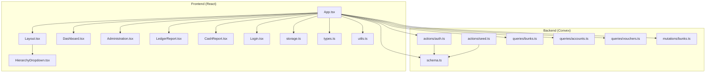
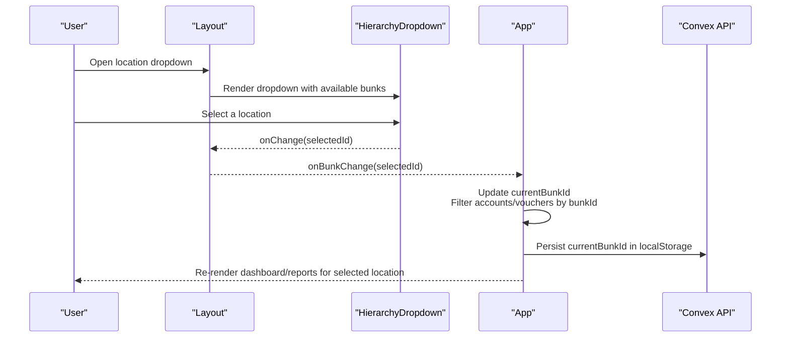
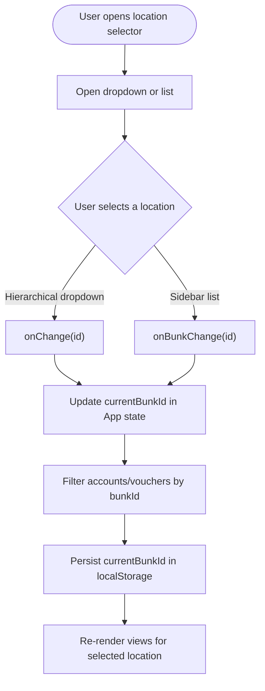
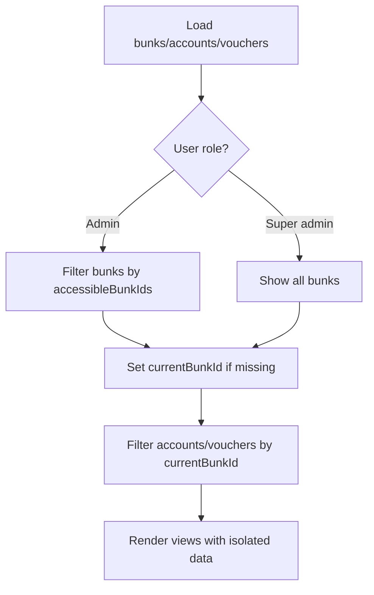
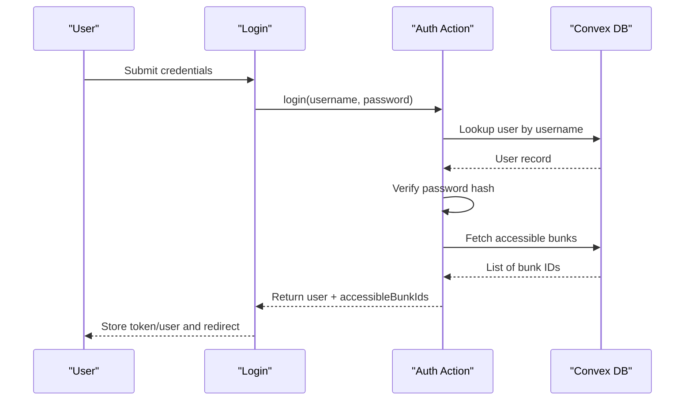
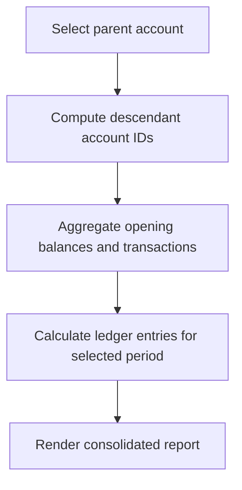
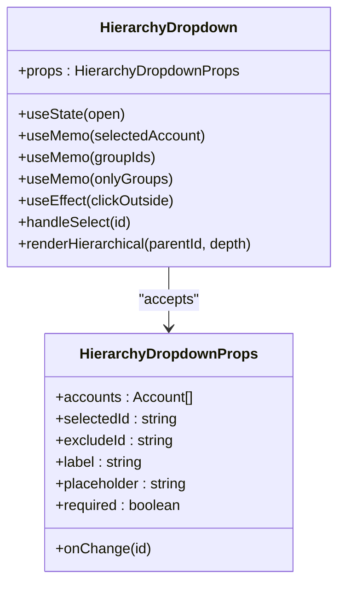
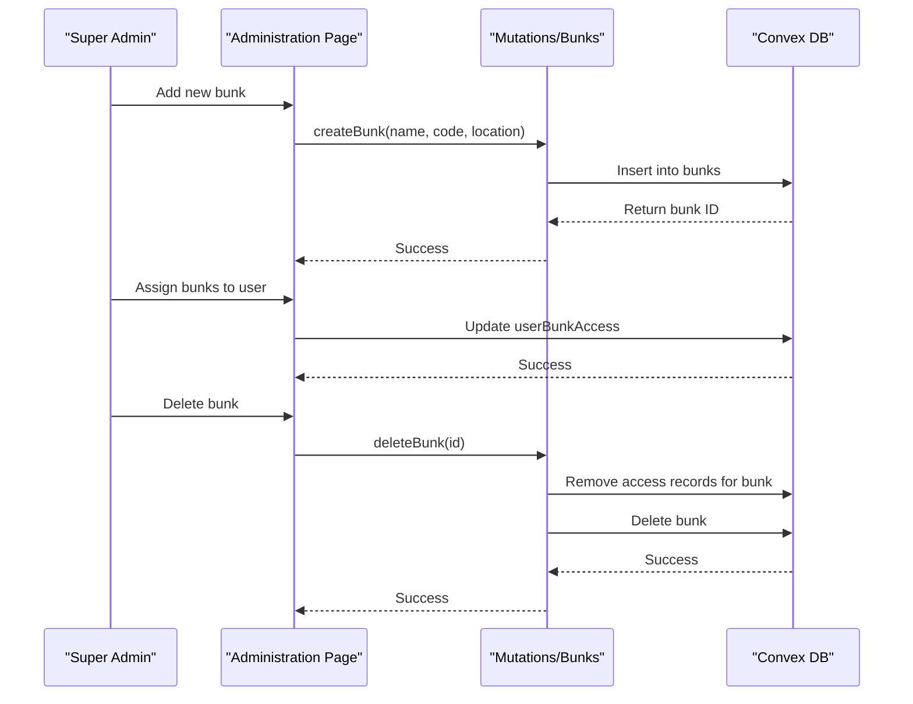
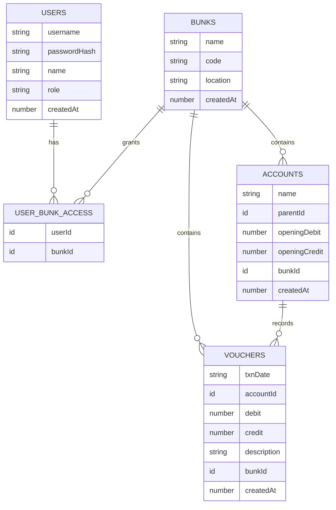
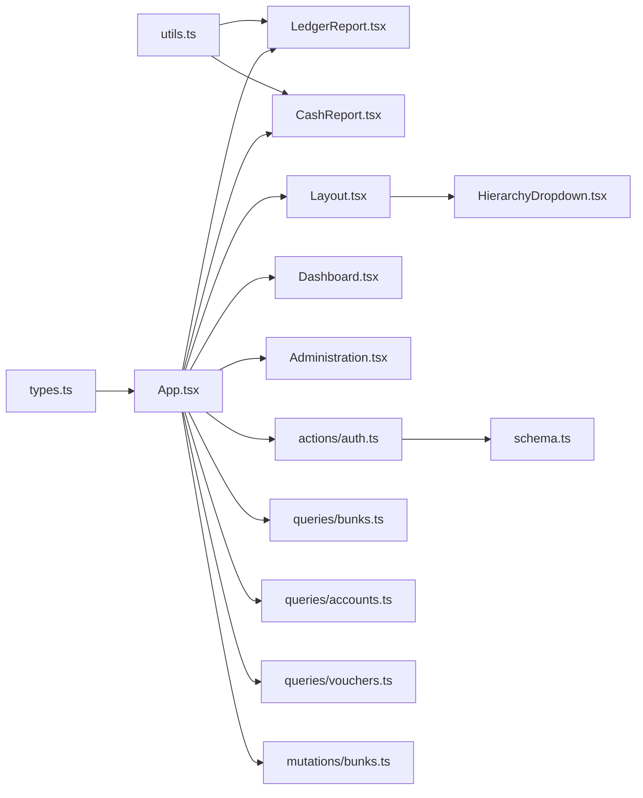

# Multi-location Management

<cite>
**Referenced Files in This Document**
- [App.tsx](file://apps/App.tsx)
- [Layout.tsx](file://apps/components/Layout.tsx)
- [HierarchyDropdown.tsx](file://apps/components/HierarchyDropdown.tsx)
- [Dashboard.tsx](file://apps/pages/Dashboard.tsx)
- [Administration.tsx](file://apps/pages/Administration.tsx)
- [LedgerReport.tsx](file://apps/pages/LedgerReport.tsx)
- [CashReport.tsx](file://apps/pages/CashReport.tsx)
- [Login.tsx](file://apps/pages/Login.tsx)
- [storage.ts](file://apps/lib/storage.ts)
- [schema.ts](file://convex/schema.ts)
- [auth.ts](file://convex/actions/auth.ts)
- [bunks.ts](file://convex/mutations/bunks.ts)
- [accounts.ts](file://convex/queries/accounts.ts)
- [vouchers.ts](file://convex/queries/vouchers.ts)
- [seed.ts](file://convex/actions/seed.ts)
- [types.ts](file://apps/types.ts)
- [utils.ts](file://apps/utils.ts)
</cite>

## Table of Contents
1. [Introduction](#introduction)
2. [Project Structure](#project-structure)
3. [Core Components](#core-components)
4. [Architecture Overview](#architecture-overview)
5. [Detailed Component Analysis](#detailed-component-analysis)
6. [Dependency Analysis](#dependency-analysis)
7. [Performance Considerations](#performance-considerations)
8. [Troubleshooting Guide](#troubleshooting-guide)
9. [Conclusion](#conclusion)

## Introduction
This document explains KR-FUELS multi-location management capabilities. It covers how users with access to multiple fuel station locations navigate between locations, how data is filtered per location, and how user permissions restrict access to sensitive information. It also documents cross-location reporting features, consolidated analytics, the hierarchical dropdown component for location selection, and administrative user management across multiple sites. Finally, it describes location-specific configuration options and how the system maintains data integrity across different operational units.

## Project Structure
KR-FUELS is a React + Convex application with a clear separation of concerns:
- Frontend (React) under apps/: components, pages, hooks, and utilities
- Backend (Convex) under convex/: schema, queries, mutations, and actions
- Types and shared utilities bridge the frontend and backend

**Diagram sources**
- [App.tsx](file://apps/App.tsx#L1-L266)
- [Layout.tsx](file://apps/components/Layout.tsx#L1-L311)
- [HierarchyDropdown.tsx](file://apps/components/HierarchyDropdown.tsx#L1-L138)
- [Dashboard.tsx](file://apps/pages/Dashboard.tsx#L1-L219)
- [Administration.tsx](file://apps/pages/Administration.tsx#L1-L376)
- [LedgerReport.tsx](file://apps/pages/LedgerReport.tsx#L1-L257)
- [CashReport.tsx](file://apps/pages/CashReport.tsx#L1-L604)
- [Login.tsx](file://apps/pages/Login.tsx#L1-L167)
- [storage.ts](file://apps/lib/storage.ts#L1-L34)
- [schema.ts](file://convex/schema.ts#L1-L85)
- [auth.ts](file://convex/actions/auth.ts#L1-L148)
- [seed.ts](file://convex/actions/seed.ts#L1-L45)
- [bunks.ts](file://convex/mutations/bunks.ts#L1-L36)
- [accounts.ts](file://convex/queries/accounts.ts#L1-L18)
- [vouchers.ts](file://convex/queries/vouchers.ts#L1-L18)

**Section sources**
- [App.tsx](file://apps/App.tsx#L1-L266)
- [schema.ts](file://convex/schema.ts#L1-L85)

## Core Components
- Location selection and navigation:
  - Hierarchical dropdown for selecting locations with nested groups
  - Sidebar location selector integrated into the global layout
- Data isolation and filtering:
  - Current location context drives filtering of accounts and vouchers
  - Permission-aware visibility of locations
- Administrative controls:
  - Create/delete fuel stations (bunks)
  - Manage user access to specific bunks
- Reporting and analytics:
  - Consolidated ledger and cash reports across selected accounts within a location
  - Cross-location reporting via hierarchical account aggregation

**Section sources**
- [HierarchyDropdown.tsx](file://apps/components/HierarchyDropdown.tsx#L1-L138)
- [Layout.tsx](file://apps/components/Layout.tsx#L216-L259)
- [App.tsx](file://apps/App.tsx#L47-L74)
- [Administration.tsx](file://apps/pages/Administration.tsx#L1-L376)
- [LedgerReport.tsx](file://apps/pages/LedgerReport.tsx#L49-L75)
- [CashReport.tsx](file://apps/pages/CashReport.tsx#L233-L261)

## Architecture Overview
The system enforces location-based data isolation while enabling cross-location reporting through hierarchical account aggregation. Authentication integrates with Convex actions, and permissions are enforced client-side based on user roles and access grants.

**Diagram sources**
- [Layout.tsx](file://apps/components/Layout.tsx#L221-L259)
- [HierarchyDropdown.tsx](file://apps/components/HierarchyDropdown.tsx#L16-L59)
- [App.tsx](file://apps/App.tsx#L56-L74)

## Detailed Component Analysis

### Location Selection and Navigation
- Hierarchical dropdown:
  - Accepts a flat list of accounts and renders a tree of groups
  - Supports exclusion of specific IDs and required field behavior
  - Clicking an item triggers onChange and closes the dropdown
- Sidebar location selector:
  - Presents a list of accessible bunks
  - Highlights the currently selected location
  - Triggers onBunkChange to update the context

**Diagram sources**
- [HierarchyDropdown.tsx](file://apps/components/HierarchyDropdown.tsx#L16-L59)
- [Layout.tsx](file://apps/components/Layout.tsx#L221-L259)
- [App.tsx](file://apps/App.tsx#L56-L74)

**Section sources**
- [HierarchyDropdown.tsx](file://apps/components/HierarchyDropdown.tsx#L1-L138)
- [Layout.tsx](file://apps/components/Layout.tsx#L216-L259)
- [App.tsx](file://apps/App.tsx#L47-L74)

### Data Filtering and Isolation
- Available locations:
  - Super admin sees all bunks
  - Regular admin sees only assigned bunks via accessibleBunkIds
- Active data:
  - Accounts and vouchers are filtered to currentBunkId
  - Dashboard and reports operate on filtered datasets
- Persistence:
  - currentBunkId is stored in localStorage to maintain context across sessions

**Diagram sources**
- [App.tsx](file://apps/App.tsx#L47-L74)
- [App.tsx](file://apps/App.tsx#L64-L65)
- [storage.ts](file://apps/lib/storage.ts#L1-L34)

**Section sources**
- [App.tsx](file://apps/App.tsx#L47-L74)
- [App.tsx](file://apps/App.tsx#L64-L65)
- [storage.ts](file://apps/lib/storage.ts#L1-L34)

### User Permissions and Administrative Controls
- Authentication:
  - Login action verifies credentials and returns accessible bunks
  - Passwords are hashed with bcrypt on the server
- User management:
  - Super admin can create/delete users and assign bunk access
  - Branch admin can only manage access to their permitted bunks
- Access enforcement:
  - Client-side filtering ensures users only see permitted bunks
  - Backend indices enforce data integrity and efficient queries

**Diagram sources**
- [Login.tsx](file://apps/pages/Login.tsx#L30-L56)
- [auth.ts](file://convex/actions/auth.ts#L18-L56)

**Section sources**
- [Login.tsx](file://apps/pages/Login.tsx#L1-L167)
- [auth.ts](file://convex/actions/auth.ts#L1-L148)
- [Administration.tsx](file://apps/pages/Administration.tsx#L1-L376)

### Cross-location Reporting and Consolidation
- Consolidated ledger:
  - Selecting a parent account aggregates descendant accounts
  - Opening balances and transactions are summed across descendants
- Cash report:
  - Operates on filtered vouchers for the current location
  - Provides summary cards and transaction listings for the selected period
- Hierarchical aggregation:
  - Utilities compute descendant account IDs and consolidate balances

**Diagram sources**
- [LedgerReport.tsx](file://apps/pages/LedgerReport.tsx#L49-L75)
- [utils.ts](file://apps/utils.ts#L27-L64)

**Section sources**
- [LedgerReport.tsx](file://apps/pages/LedgerReport.tsx#L1-L257)
- [CashReport.tsx](file://apps/pages/CashReport.tsx#L1-L604)
- [utils.ts](file://apps/utils.ts#L27-L64)

### Hierarchical Dropdown Component
The hierarchical dropdown renders a nested tree of groups and supports selection with visual feedback and keyboard-friendly behavior.

**Diagram sources**
- [HierarchyDropdown.tsx](file://apps/components/HierarchyDropdown.tsx#L6-L14)

**Section sources**
- [HierarchyDropdown.tsx](file://apps/components/HierarchyDropdown.tsx#L1-L138)

### Administrative User Management Across Sites
- Create/delete fuel stations:
  - Super admin creates/deletes bunks; deletion removes associated access records
- Manage user access:
  - Assign/unassign specific bunks to branch admins
  - View current access per user
- Security:
  - Passwords are hashed before storage
  - Username uniqueness is enforced

**Diagram sources**
- [Administration.tsx](file://apps/pages/Administration.tsx#L42-L65)
- [Administration.tsx](file://apps/pages/Administration.tsx#L94-L101)
- [bunks.ts](file://convex/mutations/bunks.ts#L20-L36)

**Section sources**
- [Administration.tsx](file://apps/pages/Administration.tsx#L1-L376)
- [bunks.ts](file://convex/mutations/bunks.ts#L1-L36)

### Location-specific Configuration Options
- Bunk metadata:
  - Name, code, and location are stored per bunk
  - Codes are indexed for fast lookup
- Access control:
  - Many-to-many relationship between users and bunks
  - Indices optimize lookups by user and by bunk
- Data integrity:
  - Foreign keys link accounts and vouchers to bunks
  - Indexes on bunkId and date enable efficient filtering

**Diagram sources**
- [schema.ts](file://convex/schema.ts#L13-L83)

**Section sources**
- [schema.ts](file://convex/schema.ts#L1-L85)
- [seed.ts](file://convex/actions/seed.ts#L13-L45)

## Dependency Analysis
- Frontend depends on Convex-generated APIs for queries and mutations
- Authentication relies on bcrypt hashing on the server
- Data filtering depends on indices for bunkId and date ranges
- Administrative actions depend on user roles and access matrices

**Diagram sources**
- [types.ts](file://apps/types.ts#L1-L56)
- [utils.ts](file://apps/utils.ts#L1-L69)
- [App.tsx](file://apps/App.tsx#L1-L266)
- [auth.ts](file://convex/actions/auth.ts#L1-L148)
- [schema.ts](file://convex/schema.ts#L1-L85)
- [accounts.ts](file://convex/queries/accounts.ts#L1-L18)
- [vouchers.ts](file://convex/queries/vouchers.ts#L1-L18)
- [bunks.ts](file://convex/mutations/bunks.ts#L1-L36)

**Section sources**
- [App.tsx](file://apps/App.tsx#L1-L266)
- [auth.ts](file://convex/actions/auth.ts#L1-L148)
- [schema.ts](file://convex/schema.ts#L1-L85)

## Performance Considerations
- Efficient filtering:
  - Use indices on bunkId and date ranges to minimize scan costs
  - Memoization prevents unnecessary recomputation of filtered datasets
- Rendering:
  - Large tables should leverage virtualization for better UX
- Authentication:
  - bcrypt hashing occurs server-side to avoid heavy client workloads

## Troubleshooting Guide
- Location not visible:
  - Ensure user has access to the bunk; super admins can see all bunks
  - Verify currentBunkId is persisted in localStorage
- No data shown:
  - Confirm currentBunkId matches an existing bunk
  - Check that accounts and vouchers exist for the selected bunk
- Login errors:
  - Verify username and password; ensure bcrypt compatibility
  - Confirm user exists and accessible bunks are returned
- Administrative actions fail:
  - Ensure sufficient privileges (super admin required for certain operations)
  - Validate input parameters and unique constraints (e.g., bunk code)

**Section sources**
- [App.tsx](file://apps/App.tsx#L47-L74)
- [storage.ts](file://apps/lib/storage.ts#L1-L34)
- [auth.ts](file://convex/actions/auth.ts#L18-L56)
- [Administration.tsx](file://apps/pages/Administration.tsx#L42-L65)

## Conclusion
KR-FUELS provides robust multi-location management with strong data isolation per location, permission-driven access, and flexible reporting. The hierarchical dropdown and sidebar location selector streamline navigation, while consolidated reporting enables cross-account insights within a location. Administrative controls ensure secure management of users and bunks, and the schema enforces data integrity across operational units.