# User Guide

<cite>
**Referenced Files in This Document**
- [README.md](file://README.md)
- [App.tsx](file://apps/App.tsx)
- [Login.tsx](file://apps/pages/Login.tsx)
- [Layout.tsx](file://apps/components/Layout.tsx)
- [Dashboard.tsx](file://apps/pages/Dashboard.tsx)
- [Administration.tsx](file://apps/pages/Administration.tsx)
- [DailyVoucher.tsx](file://apps/pages/DailyVoucher.tsx)
- [AccountsList.tsx](file://apps/pages/AccountsList.tsx)
- [AccountMaster.tsx](file://apps/pages/AccountMaster.tsx)
- [LedgerReport.tsx](file://apps/pages/LedgerReport.tsx)
- [CashReport.tsx](file://apps/pages/CashReport.tsx)
- [schema.ts](file://convex/schema.ts)
- [storage.ts](file://apps/lib/storage.ts)
- [convex-api.ts](file://apps/convex-api.ts)
- [types.ts](file://apps/types.ts)
</cite>

## Table of Contents
1. [Introduction](#introduction)
2. [Project Structure](#project-structure)
3. [Core Components](#core-components)
4. [Architecture Overview](#architecture-overview)
5. [Detailed Component Analysis](#detailed-component-analysis)
6. [Dependency Analysis](#dependency-analysis)
7. [Performance Considerations](#performance-considerations)
8. [Troubleshooting Guide](#troubleshooting-guide)
9. [Conclusion](#conclusion)
10. [Appendices](#appendices)

## Introduction
KR-FUELS is a station accounting platform designed for multi-location fuel station management. It provides a secure, role-based interface for managing chart of accounts, posting daily vouchers, generating ledger and cash reports, and administering users and locations. This user guide explains how to log in, navigate the system, manage accounts and transactions, and use analytics and reporting features. It also covers role-based access control, multi-location management, and common workflows for both new and experienced users.

## Project Structure
The application is organized into:
- Frontend (React + Convex client):
  - Pages: Login, Dashboard, Accounts, Vouchers, Reports, Administration
  - Components: Layout, reusable selectors and dialogs
  - Utilities: Storage helpers, typed data models
- Backend (Convex):
  - Schema defining bunks, users, accounts, vouchers, reminders, and junction table for user-bunk access
  - Queries, Mutations, and Actions for data operations

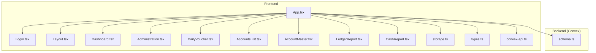

**Diagram sources**
- [App.tsx](file://apps/App.tsx#L1-L266)
- [Login.tsx](file://apps/pages/Login.tsx#L1-L167)
- [Layout.tsx](file://apps/components/Layout.tsx#L1-L311)
- [Dashboard.tsx](file://apps/pages/Dashboard.tsx#L1-L219)
- [Administration.tsx](file://apps/pages/Administration.tsx#L1-L376)
- [DailyVoucher.tsx](file://apps/pages/DailyVoucher.tsx#L1-L336)
- [AccountsList.tsx](file://apps/pages/AccountsList.tsx#L1-L254)
- [AccountMaster.tsx](file://apps/pages/AccountMaster.tsx#L1-L228)
- [LedgerReport.tsx](file://apps/pages/LedgerReport.tsx#L1-L257)
- [CashReport.tsx](file://apps/pages/CashReport.tsx#L1-L604)
- [storage.ts](file://apps/lib/storage.ts#L1-L34)
- [convex-api.ts](file://apps/convex-api.ts#L1-L33)
- [schema.ts](file://convex/schema.ts#L1-L85)

**Section sources**
- [README.md](file://README.md#L1-L13)
- [App.tsx](file://apps/App.tsx#L1-L266)

## Core Components
- Authentication and routing:
  - Login page triggers backend authentication and stores user session locally.
  - App orchestrates routes, user state, and role-gated access to administration.
- Navigation and layout:
  - Sidebar organizes menus by functional areas; profile dropdown supports logout.
  - Bunk selector allows switching between accessible locations.
- Data and permissions:
  - Types define User, Account, Voucher, LedgerEntry, Reminder.
  - Storage utilities persist user, token, and current bunk.
  - Convex API wrappers encapsulate backend calls.

Key responsibilities:
- App.tsx: Central state, role-aware bunk filtering, route protection, and data synchronization.
- Layout.tsx: Navigation, bunk switching, and user profile actions.
- storage.ts: Local persistence for user session and current bunk.
- convex-api.ts: Typed hooks for authentication and reminders.

**Section sources**
- [App.tsx](file://apps/App.tsx#L1-L266)
- [Layout.tsx](file://apps/components/Layout.tsx#L1-L311)
- [storage.ts](file://apps/lib/storage.ts#L1-L34)
- [convex-api.ts](file://apps/convex-api.ts#L1-L33)
- [types.ts](file://apps/types.ts#L1-L56)

## Architecture Overview
The system follows a client-driven architecture with Convex backend:
- Frontend (React) renders UI and manages user sessions.
- Convex schema defines entities and indexes.
- Frontend uses Convex hooks to query and mutate data.
- Authentication is handled via Convex actions; tokens and user info are stored in local storage.

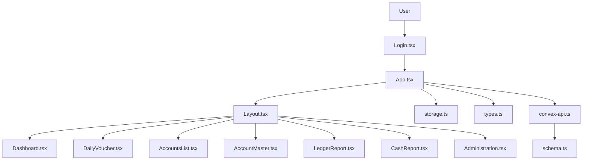

**Diagram sources**
- [Login.tsx](file://apps/pages/Login.tsx#L1-L167)
- [App.tsx](file://apps/App.tsx#L1-L266)
- [Layout.tsx](file://apps/components/Layout.tsx#L1-L311)
- [Dashboard.tsx](file://apps/pages/Dashboard.tsx#L1-L219)
- [DailyVoucher.tsx](file://apps/pages/DailyVoucher.tsx#L1-L336)
- [AccountsList.tsx](file://apps/pages/AccountsList.tsx#L1-L254)
- [AccountMaster.tsx](file://apps/pages/AccountMaster.tsx#L1-L228)
- [LedgerReport.tsx](file://apps/pages/LedgerReport.tsx#L1-L257)
- [CashReport.tsx](file://apps/pages/CashReport.tsx#L1-L604)
- [Administration.tsx](file://apps/pages/Administration.tsx#L1-L376)
- [storage.ts](file://apps/lib/storage.ts#L1-L34)
- [types.ts](file://apps/types.ts#L1-L56)
- [convex-api.ts](file://apps/convex-api.ts#L1-L33)
- [schema.ts](file://convex/schema.ts#L1-L85)

## Detailed Component Analysis

### Authentication and Session Management
- Login flow:
  - User enters credentials and submits form.
  - Frontend calls Convex login action, receives user data and token, persists them, and sets current user state.
- Logout:
  - Profile dropdown triggers logout; user state cleared and local storage cleaned.
- Idle timeout:
  - App integrates idle logout hook to automatically sign out inactive users.

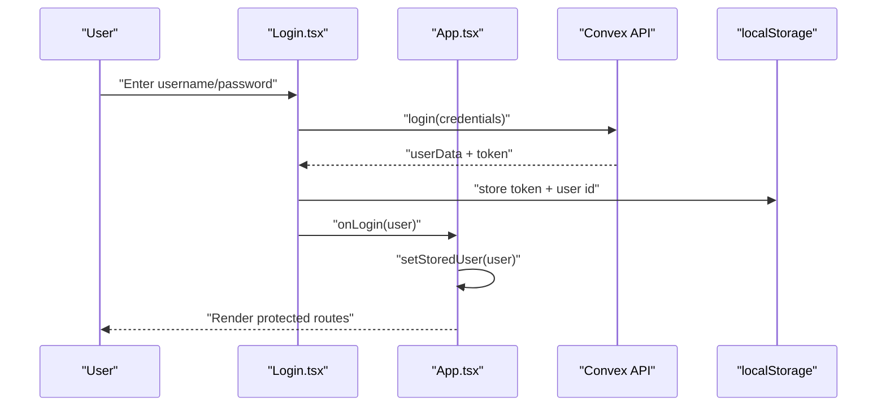

**Diagram sources**
- [Login.tsx](file://apps/pages/Login.tsx#L30-L56)
- [App.tsx](file://apps/App.tsx#L67-L70)
- [storage.ts](file://apps/lib/storage.ts#L16-L24)

**Section sources**
- [Login.tsx](file://apps/pages/Login.tsx#L1-L167)
- [App.tsx](file://apps/App.tsx#L40-L45)
- [storage.ts](file://apps/lib/storage.ts#L1-L34)

### Role-Based Access Control (RBAC)
- Roles:
  - admin: Access limited to assigned bunks via user-bunk junction.
  - super_admin: Full global access to all bunks and administration.
- Route gating:
  - Administration route is conditionally rendered only for super_admin.
- Bunk visibility:
  - availableBunks computed based on user role and accessible bunk IDs.

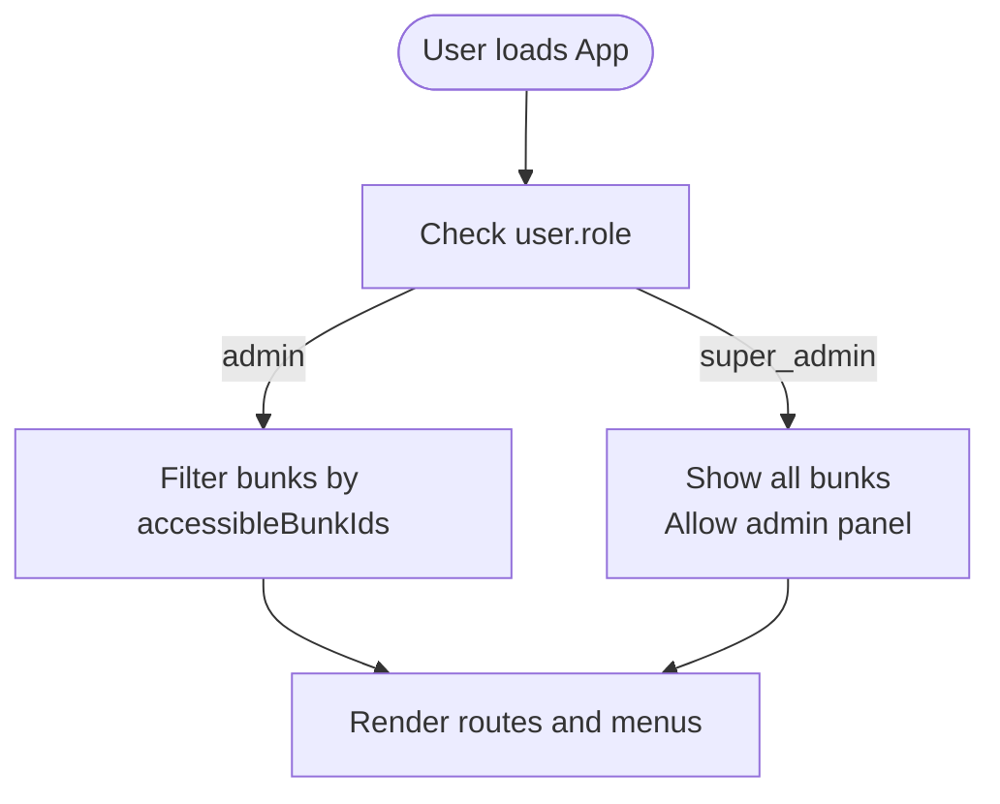

**Diagram sources**
- [App.tsx](file://apps/App.tsx#L47-L54)
- [App.tsx](file://apps/App.tsx#L255-L257)
- [schema.ts](file://convex/schema.ts#L34-L40)

**Section sources**
- [App.tsx](file://apps/App.tsx#L47-L54)
- [App.tsx](file://apps/App.tsx#L255-L257)
- [schema.ts](file://convex/schema.ts#L23-L29)
- [schema.ts](file://convex/schema.ts#L34-L40)

### Multi-Location Management and Bunk Selection
- Bunk selection:
  - Header dropdown lists all accessible bunks; selecting updates current bunk and persists selection.
- Location-scoped data:
  - Accounts and vouchers are filtered by current bunk ID.
- Cross-location reporting:
  - Ledger report supports selecting descendant accounts under a chosen group, enabling aggregated views across sub-ledgers.

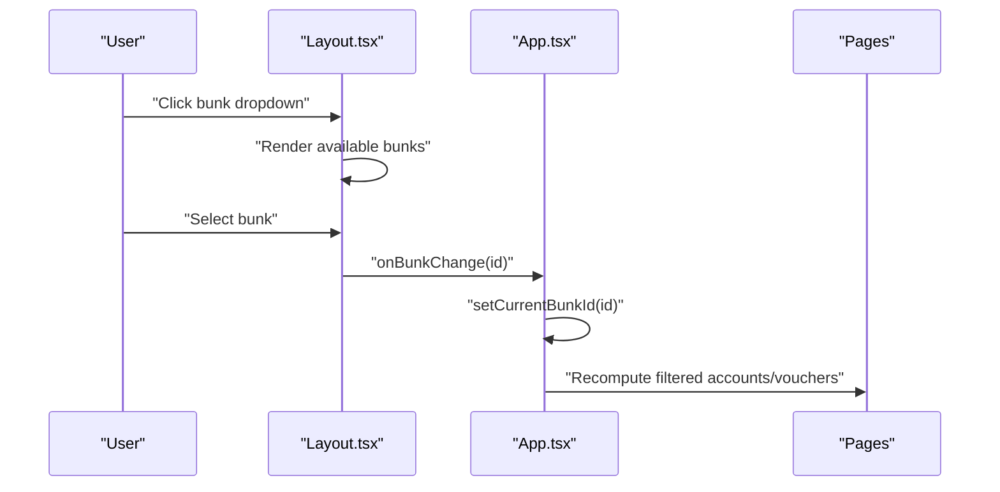

**Diagram sources**
- [Layout.tsx](file://apps/components/Layout.tsx#L221-L258)
- [App.tsx](file://apps/App.tsx#L56-L62)
- [App.tsx](file://apps/App.tsx#L64-L65)

**Section sources**
- [Layout.tsx](file://apps/components/Layout.tsx#L221-L258)
- [App.tsx](file://apps/App.tsx#L56-L65)

### Dashboard and Analytics
- Features:
  - Date navigation, opening/closing cash balances, inflow/outflow summaries, recent activity table, and reminders widget.
- Data computation:
  - Opening balances, prior movements, and daily totals derived from accounts and vouchers.
- Reminders:
  - Active and due reminders grouped and color-coded.

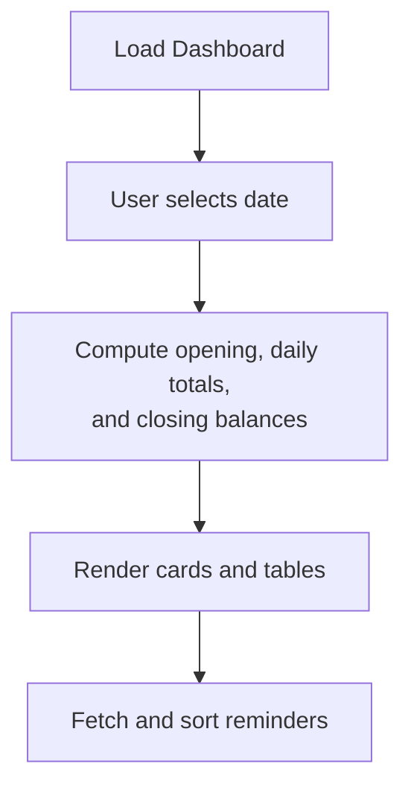

**Diagram sources**
- [Dashboard.tsx](file://apps/pages/Dashboard.tsx#L50-L81)
- [Dashboard.tsx](file://apps/pages/Dashboard.tsx#L171-L211)

**Section sources**
- [Dashboard.tsx](file://apps/pages/Dashboard.tsx#L1-L219)

### Voucher Entry Workflow (Daily Voucher)
- Functionality:
  - Batch entry of multiple lines per day; auto-computation of totals and closing cash.
  - Posting saves new vouchers; editing updates existing ones; deletion removes posted entries after confirmation.
- Validation:
  - Ensures a valid ledger account and bunk are selected before posting.
- Persistence:
  - Uses Convex mutations to create/update/delete vouchers.

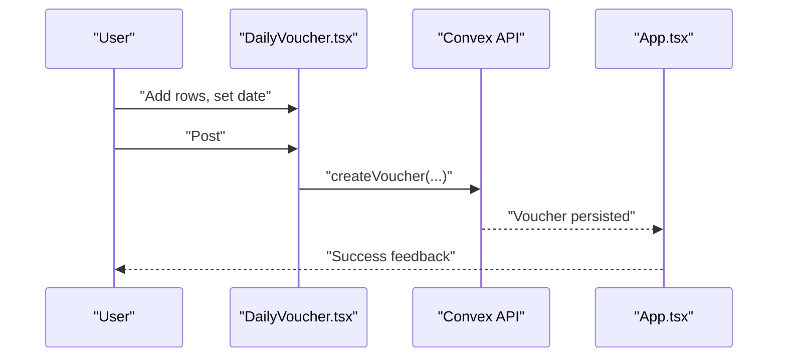

**Diagram sources**
- [DailyVoucher.tsx](file://apps/pages/DailyVoucher.tsx#L111-L150)
- [App.tsx](file://apps/App.tsx#L153-L174)

**Section sources**
- [DailyVoucher.tsx](file://apps/pages/DailyVoucher.tsx#L1-L336)
- [App.tsx](file://apps/App.tsx#L153-L174)

### Chart of Accounts Management
- Accounts list:
  - Hierarchical grouping with expand/collapse, search, and quick actions to edit or delete.
  - Calculates group-level balances recursively.
- Account master:
  - Create or edit ledger accounts; supports selecting parent group and setting opening balances.
- Administration:
  - Super admin can create new bunks and manage users with role and access controls.

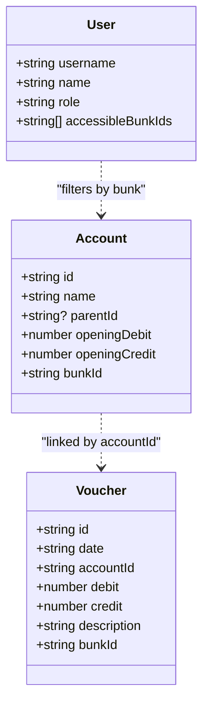

**Diagram sources**
- [types.ts](file://apps/types.ts#L9-L36)
- [AccountsList.tsx](file://apps/pages/AccountsList.tsx#L39-L51)
- [AccountMaster.tsx](file://apps/pages/AccountMaster.tsx#L16-L38)

**Section sources**
- [AccountsList.tsx](file://apps/pages/AccountsList.tsx#L1-L254)
- [AccountMaster.tsx](file://apps/pages/AccountMaster.tsx#L1-L228)
- [Administration.tsx](file://apps/pages/Administration.tsx#L1-L376)
- [types.ts](file://apps/types.ts#L1-L56)

### Reporting and Export
- Ledger report:
  - Select account (including groups), date range, export to CSV or print.
- Cash report:
  - Multiple filters (daily, monthly, YTD, financial year, custom), export to CSV or PDF generation, print support.

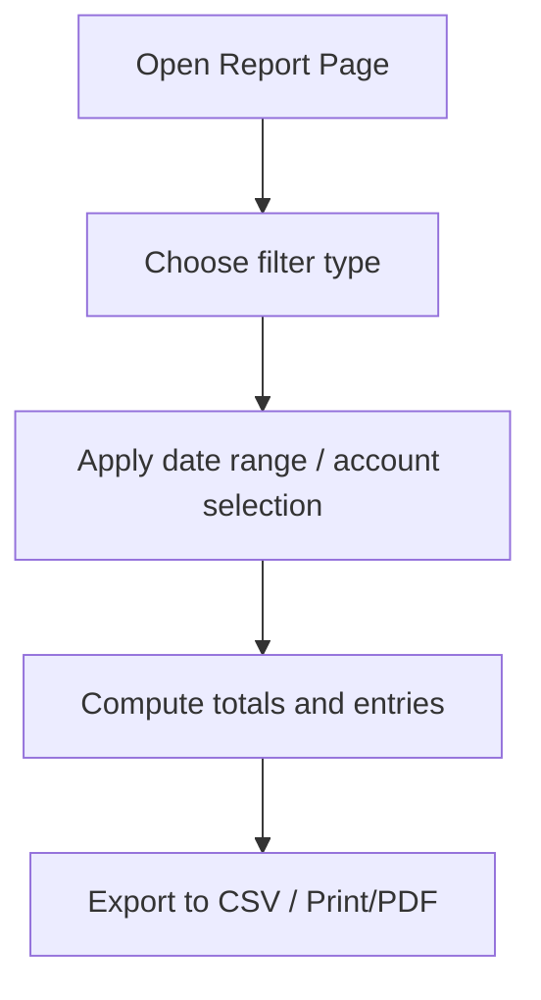

**Diagram sources**
- [LedgerReport.tsx](file://apps/pages/LedgerReport.tsx#L49-L75)
- [CashReport.tsx](file://apps/pages/CashReport.tsx#L233-L261)
- [CashReport.tsx](file://apps/pages/CashReport.tsx#L263-L286)

**Section sources**
- [LedgerReport.tsx](file://apps/pages/LedgerReport.tsx#L1-L257)
- [CashReport.tsx](file://apps/pages/CashReport.tsx#L1-L604)

### Administration (Super Admin)
- Manage bunks:
  - Create/delete fuel stations with name, code, and location.
- Manage users:
  - Create users with role and accessible bunks; delete users.
- Access control:
  - Super admin has unrestricted access; admins are restricted to assigned bunks.

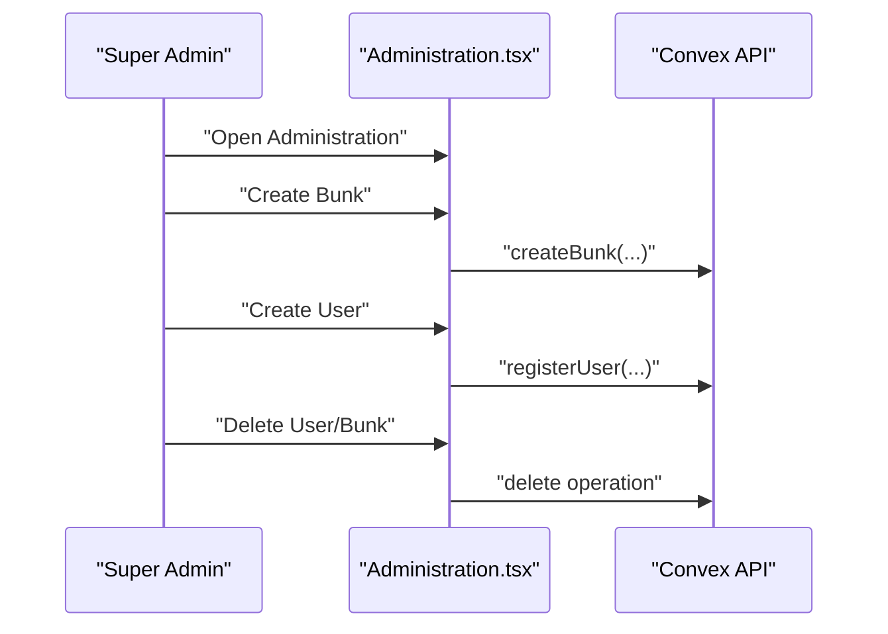

**Diagram sources**
- [Administration.tsx](file://apps/pages/Administration.tsx#L42-L65)
- [Administration.tsx](file://apps/pages/Administration.tsx#L67-L92)
- [Administration.tsx](file://apps/pages/Administration.tsx#L103-L114)

**Section sources**
- [Administration.tsx](file://apps/pages/Administration.tsx#L1-L376)
- [schema.ts](file://convex/schema.ts#L13-L40)

## Dependency Analysis
- Frontend dependencies:
  - App depends on Convex hooks, storage utilities, and types.
  - Pages depend on shared components and Convex API wrappers.
- Backend dependencies:
  - Entities and indexes defined centrally; queries/mutations/actions consume schema.
- Coupling:
  - Strong separation between UI and data access via Convex hooks.
  - Minimal circular dependencies; role and access logic centralized in App.

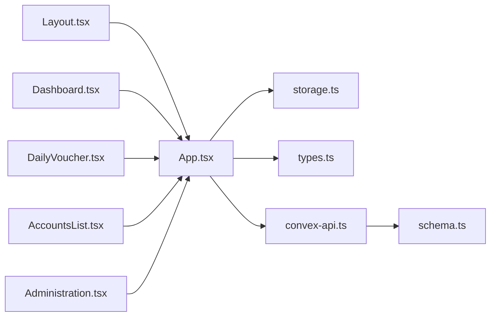

**Diagram sources**
- [App.tsx](file://apps/App.tsx#L1-L266)
- [Layout.tsx](file://apps/components/Layout.tsx#L1-L311)
- [Dashboard.tsx](file://apps/pages/Dashboard.tsx#L1-L219)
- [DailyVoucher.tsx](file://apps/pages/DailyVoucher.tsx#L1-L336)
- [AccountsList.tsx](file://apps/pages/AccountsList.tsx#L1-L254)
- [Administration.tsx](file://apps/pages/Administration.tsx#L1-L376)
- [storage.ts](file://apps/lib/storage.ts#L1-L34)
- [convex-api.ts](file://apps/convex-api.ts#L1-L33)
- [schema.ts](file://convex/schema.ts#L1-L85)

**Section sources**
- [App.tsx](file://apps/App.tsx#L1-L266)
- [convex-api.ts](file://apps/convex-api.ts#L1-L33)
- [schema.ts](file://convex/schema.ts#L1-L85)

## Performance Considerations
- Client-side filtering:
  - Filtering accounts and vouchers by current bunk occurs in memory; ensure reasonable dataset sizes for responsiveness.
- Computed summaries:
  - Totals and balances recomputed on change; memoization prevents unnecessary recalculations.
- Rendering:
  - Large tables paginated implicitly by virtualized scrolling; consider virtualization for very large datasets.
- Network:
  - Use Convex caching and batching where possible; avoid redundant queries by leveraging existing state.

## Troubleshooting Guide
Common issues and resolutions:
- Login fails:
  - Verify credentials; check network connectivity; ensure backend is reachable.
  - Clear browser cache and retry.
- No data displayed:
  - Confirm a bunk is selected; if none appears, contact a super admin to grant access.
- Cannot post vouchers:
  - Ensure a ledger account and bunk are selected; check for validation messages.
- Reports show no data:
  - Adjust date range or account filters; ensure transactions exist in the selected period.
- Idle logout:
  - Re-login; sessions are cleared automatically after inactivity.

Help resources:
- Contact your system administrator (super admin) for user and access management.
- Use the reminders widget on the dashboard to track deadlines.

**Section sources**
- [Login.tsx](file://apps/pages/Login.tsx#L51-L55)
- [App.tsx](file://apps/App.tsx#L153-L174)
- [Dashboard.tsx](file://apps/pages/Dashboard.tsx#L171-L211)

## Conclusion
KR-FUELS provides a streamlined, role-aware interface for multi-location fuel station accounting. Administrators can manage users and locations; branch users can maintain accounts, post daily vouchers, and generate insightful reports. The dashboard offers a quick operational snapshot, while robust filtering and export capabilities support detailed analysis.

## Appendices

### Step-by-Step Tutorials

- Log in to KR-FUELS
  - Open the application, enter your username/email and password, and click Sign in.
  - On success, you are redirected to the Dashboard.

- Switch locations (bunks)
  - Use the location dropdown in the header to select another station.
  - Your selection is remembered for future sessions.

- Post daily vouchers
  - Navigate to Daily Voucher, select the transaction date, add rows with ledger account, narration, and amounts.
  - Click Post Transactions to save; use Reset to revert to posted entries.

- Manage chart of accounts
  - Go to Accounts List to view hierarchical groups and ledgers.
  - Use Account Master to create or edit accounts; set opening balances and parent groups.

- Generate reports
  - Ledger Report: Select an account (or group), choose a date range, and export/print.
  - Cash Report: Choose a filter (daily/monthly/YTD/financial year/custom), apply, and export/print.

- Administration (super admin)
  - Create and delete bunks; add users with roles and assigned bunks; remove users as needed.

**Section sources**
- [Login.tsx](file://apps/pages/Login.tsx#L30-L56)
- [Layout.tsx](file://apps/components/Layout.tsx#L221-L258)
- [DailyVoucher.tsx](file://apps/pages/DailyVoucher.tsx#L111-L150)
- [AccountsList.tsx](file://apps/pages/AccountsList.tsx#L155-L161)
- [AccountMaster.tsx](file://apps/pages/AccountMaster.tsx#L46-L56)
- [LedgerReport.tsx](file://apps/pages/LedgerReport.tsx#L80-L111)
- [CashReport.tsx](file://apps/pages/CashReport.tsx#L263-L286)
- [Administration.tsx](file://apps/pages/Administration.tsx#L42-L65)
- [Administration.tsx](file://apps/pages/Administration.tsx#L67-L92)