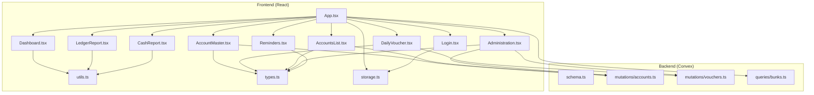
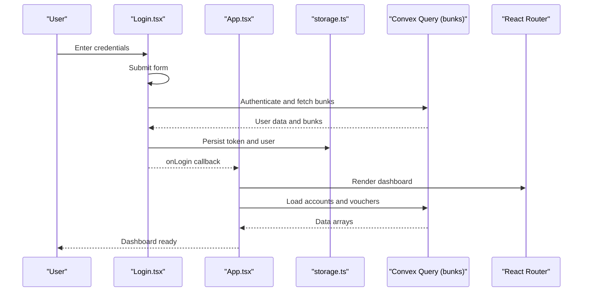
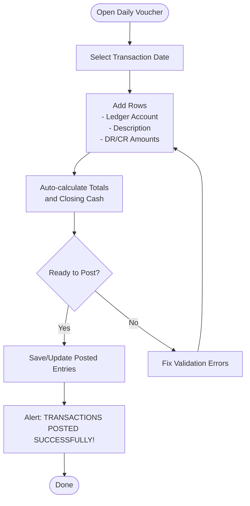
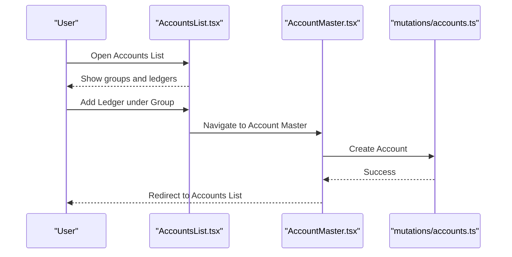
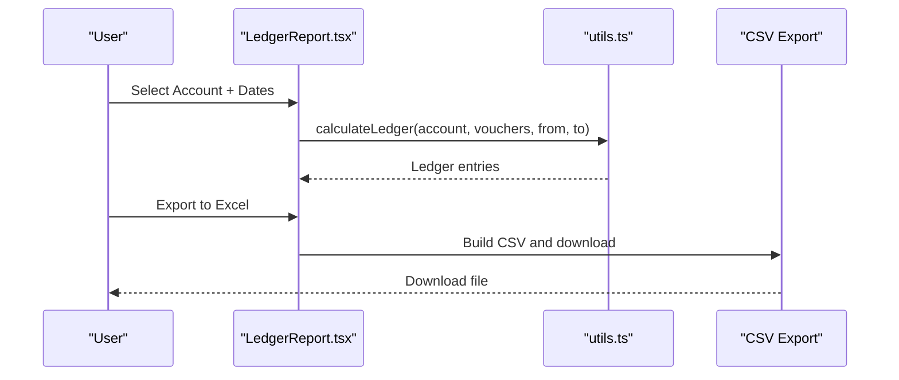
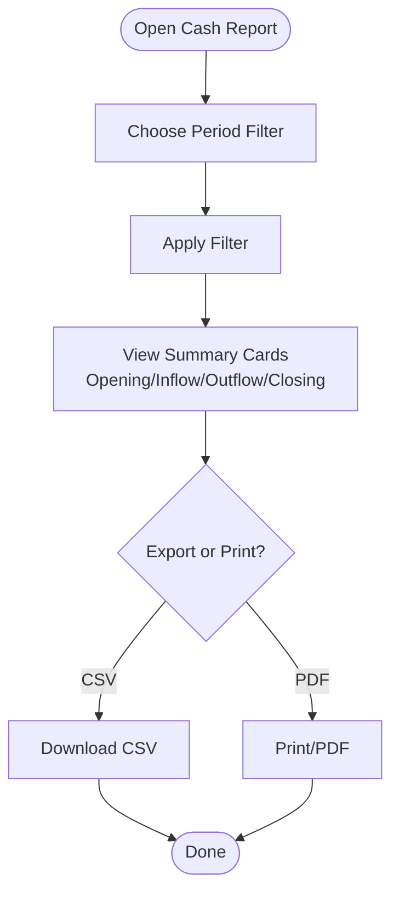
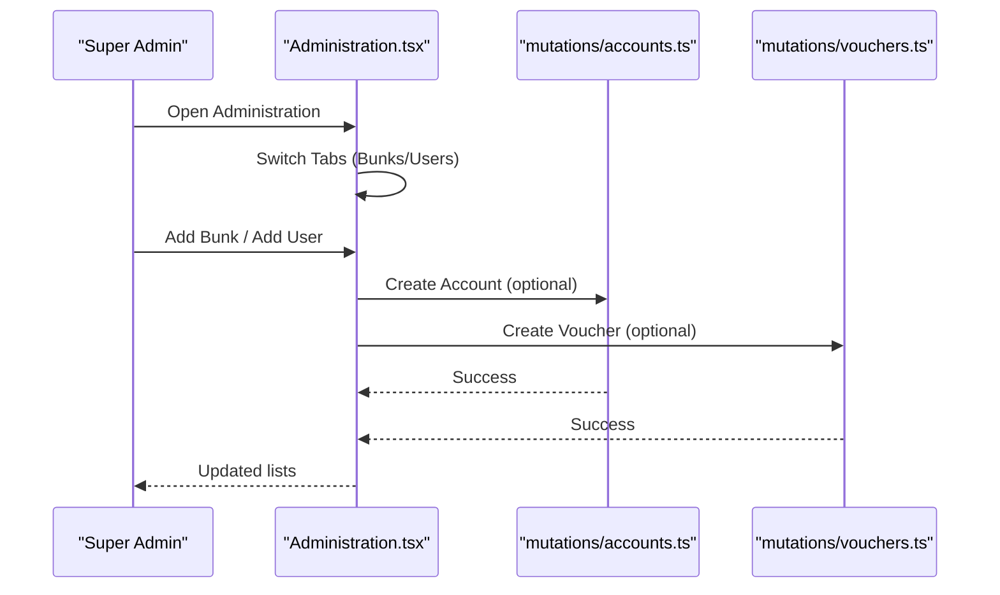
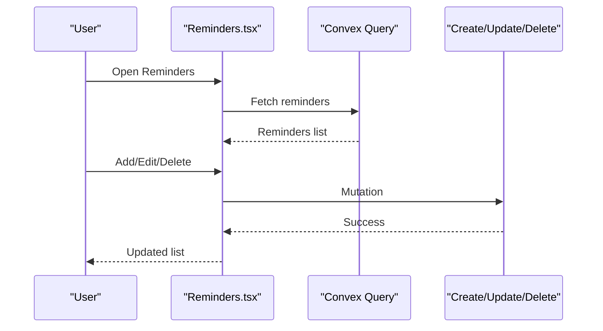
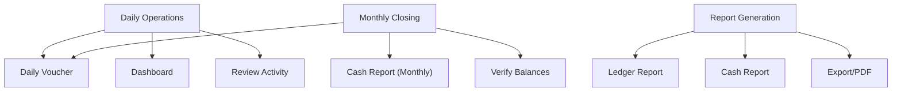
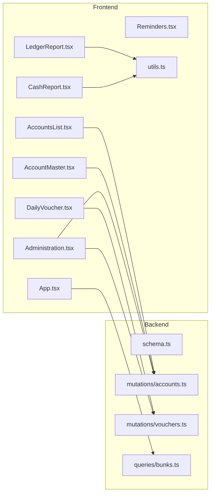

# User Workflows and Tutorials

<cite>
**Referenced Files in This Document**
- [README.md](file://README.md)
- [App.tsx](file://apps/App.tsx)
- [Login.tsx](file://apps/pages/Login.tsx)
- [Dashboard.tsx](file://apps/pages/Dashboard.tsx)
- [DailyVoucher.tsx](file://apps/pages/DailyVoucher.tsx)
- [AccountsList.tsx](file://apps/pages/AccountsList.tsx)
- [AccountMaster.tsx](file://apps/pages/AccountMaster.tsx)
- [LedgerReport.tsx](file://apps/pages/LedgerReport.tsx)
- [CashReport.tsx](file://apps/pages/CashReport.tsx)
- [Administration.tsx](file://apps/pages/Administration.tsx)
- [Reminders.tsx](file://apps/pages/Reminders.tsx)
- [types.ts](file://apps/types.ts)
- [utils.ts](file://apps/utils.ts)
- [storage.ts](file://apps/lib/storage.ts)
- [schema.ts](file://convex/schema.ts)
- [accounts.ts](file://convex/mutations/accounts.ts)
- [vouchers.ts](file://convex/mutations/vouchers.ts)
- [bunks.ts](file://convex/queries/bunks.ts)
</cite>

## Table of Contents
1. [Introduction](#introduction)
2. [Project Structure](#project-structure)
3. [Core Components](#core-components)
4. [Architecture Overview](#architecture-overview)
5. [Detailed Component Analysis](#detailed-component-analysis)
6. [Dependency Analysis](#dependency-analysis)
7. [Performance Considerations](#performance-considerations)
8. [Troubleshooting Guide](#troubleshooting-guide)
9. [Conclusion](#conclusion)
10. [Appendices](#appendices)

## Introduction
This document provides step-by-step user workflows and tutorials for KR-FUELS, a station accounting and reporting platform. It covers:
- Daily operations: logging in, navigating dashboards, entering daily vouchers, managing accounts, and reminders
- Account management: creating and organizing chart-of-accounts hierarchies
- Reporting: ledger reports and cash statements with export capabilities
- Financial analysis: understanding balances, inflows/outflows, and activity trends
- End-to-end scenarios: daily operations, monthly closing procedures, and report generation
- Onboarding: installation, first-time setup, and initial user guidance
- Troubleshooting: common user errors and frequently asked questions
- Productivity tips: keyboard shortcuts, best practices, and persona-specific guidance for operators, supervisors, and administrators

## Project Structure
KR-FUELS is a React single-page application with a Convex backend. The frontend handles routing, UI, and local state, while Convex manages data persistence and server-side logic.

**Diagram sources**
- [App.tsx](file://apps/App.tsx#L1-L266)
- [Login.tsx](file://apps/pages/Login.tsx#L1-L167)
- [Dashboard.tsx](file://apps/pages/Dashboard.tsx#L1-L219)
- [DailyVoucher.tsx](file://apps/pages/DailyVoucher.tsx#L1-L336)
- [AccountsList.tsx](file://apps/pages/AccountsList.tsx#L1-L254)
- [AccountMaster.tsx](file://apps/pages/AccountMaster.tsx#L1-L228)
- [LedgerReport.tsx](file://apps/pages/LedgerReport.tsx#L1-L257)
- [CashReport.tsx](file://apps/pages/CashReport.tsx#L1-L604)
- [Administration.tsx](file://apps/pages/Administration.tsx#L1-L376)
- [Reminders.tsx](file://apps/pages/Reminders.tsx#L1-L388)
- [utils.ts](file://apps/utils.ts#L1-L69)
- [types.ts](file://apps/types.ts#L1-L56)
- [storage.ts](file://apps/lib/storage.ts#L1-L34)
- [schema.ts](file://convex/schema.ts#L1-L85)
- [accounts.ts](file://convex/mutations/accounts.ts#L1-L63)
- [vouchers.ts](file://convex/mutations/vouchers.ts#L1-L59)
- [bunks.ts](file://convex/queries/bunks.ts#L1-L16)

**Section sources**
- [README.md](file://README.md#L1-L13)
- [App.tsx](file://apps/App.tsx#L1-L266)

## Core Components
- Authentication and session management via a login page and local storage utilities
- Dashboard for daily overview, recent activity, and reminders
- Daily voucher entry with batch editing, totals, and balance calculations
- Chart of accounts management with hierarchical grouping and opening balances
- Ledger and cash reports with filtering, export to CSV/PDF, and printing
- Administration module for managing fuel stations and users
- Reminders module for task tracking and deadlines

Key responsibilities:
- App routing and global state (accounts, vouchers, bunks, current user)
- Local storage for user session and current bunk selection
- Convex mutations and queries for CRUD operations and data retrieval
- Utility functions for currency/date formatting and ledger calculations

**Section sources**
- [App.tsx](file://apps/App.tsx#L1-L266)
- [Login.tsx](file://apps/pages/Login.tsx#L1-L167)
- [Dashboard.tsx](file://apps/pages/Dashboard.tsx#L1-L219)
- [DailyVoucher.tsx](file://apps/pages/DailyVoucher.tsx#L1-L336)
- [AccountsList.tsx](file://apps/pages/AccountsList.tsx#L1-L254)
- [AccountMaster.tsx](file://apps/pages/AccountMaster.tsx#L1-L228)
- [LedgerReport.tsx](file://apps/pages/LedgerReport.tsx#L1-L257)
- [CashReport.tsx](file://apps/pages/CashReport.tsx#L1-L604)
- [Administration.tsx](file://apps/pages/Administration.tsx#L1-L376)
- [Reminders.tsx](file://apps/pages/Reminders.tsx#L1-L388)
- [utils.ts](file://apps/utils.ts#L1-L69)
- [storage.ts](file://apps/lib/storage.ts#L1-L34)
- [schema.ts](file://convex/schema.ts#L1-L85)

## Architecture Overview
The system follows a client-driven architecture with Convex as the backend-as-a-service:
- Frontend routes and UI components
- Convex queries for read operations (bunks, accounts, vouchers, reminders)
- Convex mutations for write operations (create/update/delete)
- Local storage for user session and current bunk context

**Diagram sources**
- [Login.tsx](file://apps/pages/Login.tsx#L22-L56)
- [App.tsx](file://apps/App.tsx#L21-L114)
- [storage.ts](file://apps/lib/storage.ts#L16-L24)
- [bunks.ts](file://convex/queries/bunks.ts#L11-L15)

**Section sources**
- [App.tsx](file://apps/App.tsx#L21-L114)
- [Login.tsx](file://apps/pages/Login.tsx#L22-L56)
- [storage.ts](file://apps/lib/storage.ts#L16-L24)
- [bunks.ts](file://convex/queries/bunks.ts#L11-L15)

## Detailed Component Analysis

### Daily Voucher Entry Workflow
End-to-end steps for posting daily transactions:
1. Navigate to Daily Voucher
2. Select transaction date (defaults to today)
3. Add rows with ledger account, description, and amounts (DR/CR)
4. Validate totals and balances
5. Post transactions; confirm success
6. Optional: reset to posted entries or edit existing

**Diagram sources**
- [DailyVoucher.tsx](file://apps/pages/DailyVoucher.tsx#L111-L150)
- [DailyVoucher.tsx](file://apps/pages/DailyVoucher.tsx#L243-L247)
- [DailyVoucher.tsx](file://apps/pages/DailyVoucher.tsx#L322-L331)

**Section sources**
- [DailyVoucher.tsx](file://apps/pages/DailyVoucher.tsx#L1-L336)
- [utils.ts](file://apps/utils.ts#L27-L64)

### Account Management Workflow
Creating and organizing chart-of-accounts:
1. Go to Accounts List
2. Search and expand groups
3. Add new ledger under a group
4. Or create a new group and then add a ledger
5. Edit or delete ledgers (deletion blocked if children exist)

**Diagram sources**
- [AccountsList.tsx](file://apps/pages/AccountsList.tsx#L155-L161)
- [AccountMaster.tsx](file://apps/pages/AccountMaster.tsx#L46-L56)
- [accounts.ts](file://convex/mutations/accounts.ts#L4-L22)

**Section sources**
- [AccountsList.tsx](file://apps/pages/AccountsList.tsx#L1-L254)
- [AccountMaster.tsx](file://apps/pages/AccountMaster.tsx#L1-L228)
- [accounts.ts](file://convex/mutations/accounts.ts#L1-L63)

### Ledger Reporting Workflow
Generating and exporting ledger reports:
1. Open Ledger Report
2. Select account (including descendant accounts)
3. Choose date range
4. View movement summary and balances
5. Export to CSV or print/PDF

**Diagram sources**
- [LedgerReport.tsx](file://apps/pages/LedgerReport.tsx#L49-L75)
- [utils.ts](file://apps/utils.ts#L27-L64)
- [LedgerReport.tsx](file://apps/pages/LedgerReport.tsx#L80-L107)

**Section sources**
- [LedgerReport.tsx](file://apps/pages/LedgerReport.tsx#L1-L257)
- [utils.ts](file://apps/utils.ts#L27-L64)

### Cash Statement Workflow
Generating cash statements across multiple periods:
1. Open Cash Report
2. Choose filter: Daily, Monthly, YTD, Financial Year, Custom
3. Apply filter and view summary cards
4. Export to CSV or print/PDF

**Diagram sources**
- [CashReport.tsx](file://apps/pages/CashReport.tsx#L15-L51)
- [CashReport.tsx](file://apps/pages/CashReport.tsx#L233-L261)
- [CashReport.tsx](file://apps/pages/CashReport.tsx#L263-L286)
- [CashReport.tsx](file://apps/pages/CashReport.tsx#L53-L182)

**Section sources**
- [CashReport.tsx](file://apps/pages/CashReport.tsx#L1-L604)

### Administration Workflow
Managing fuel stations and users:
- Manage fuel stations (add/delete)
- Create admin/super-admin users
- Assign bunk access for branch admins
- View user directory with roles and permissions

**Diagram sources**
- [Administration.tsx](file://apps/pages/Administration.tsx#L20-L101)
- [Administration.tsx](file://apps/pages/Administration.tsx#L37-L92)
- [accounts.ts](file://convex/mutations/accounts.ts#L4-L22)
- [vouchers.ts](file://convex/mutations/vouchers.ts#L4-L24)

**Section sources**
- [Administration.tsx](file://apps/pages/Administration.tsx#L1-L376)
- [accounts.ts](file://convex/mutations/accounts.ts#L1-L63)
- [vouchers.ts](file://convex/mutations/vouchers.ts#L1-L59)

### Reminders Workflow
Tracking tasks and deadlines:
- Add reminders with title, description, reminder date, due date
- Edit or delete reminders
- View statistics (total, active now, upcoming)

**Diagram sources**
- [Reminders.tsx](file://apps/pages/Reminders.tsx#L6-L60)
- [Reminders.tsx](file://apps/pages/Reminders.tsx#L191-L267)
- [Reminders.tsx](file://apps/pages/Reminders.tsx#L270-L347)

**Section sources**
- [Reminders.tsx](file://apps/pages/Reminders.tsx#L1-L388)

### Conceptual Overview
Common user scenarios mapped to workflows:
- Daily Operations: Login → Dashboard → Daily Voucher → Post → Review Activity
- Monthly Closing: Daily Voucher → Cash Report (Monthly) → Verify Balances → Close Day
- Report Generation: Ledger Report / Cash Report → Filter → Export/PDF

[No sources needed since this diagram shows conceptual workflow, not actual code structure]

## Dependency Analysis
Frontend-to-backend dependencies and data flow:

**Diagram sources**
- [App.tsx](file://apps/App.tsx#L22-L32)
- [DailyVoucher.tsx](file://apps/pages/DailyVoucher.tsx#L153-L174)
- [AccountsList.tsx](file://apps/pages/AccountsList.tsx#L58-L62)
- [AccountMaster.tsx](file://apps/pages/AccountMaster.tsx#L46-L56)
- [LedgerReport.tsx](file://apps/pages/LedgerReport.tsx#L49-L75)
- [CashReport.tsx](file://apps/pages/CashReport.tsx#L233-L261)
- [Administration.tsx](file://apps/pages/Administration.tsx#L37-L41)
- [utils.ts](file://apps/utils.ts#L27-L64)
- [schema.ts](file://convex/schema.ts#L1-L85)
- [accounts.ts](file://convex/mutations/accounts.ts#L1-L63)
- [vouchers.ts](file://convex/mutations/vouchers.ts#L1-L59)
- [bunks.ts](file://convex/queries/bunks.ts#L1-L16)

**Section sources**
- [App.tsx](file://apps/App.tsx#L22-L32)
- [schema.ts](file://convex/schema.ts#L1-L85)

## Performance Considerations
- Minimize re-renders by using memoization for derived data (e.g., totals, balances)
- Efficient filtering and sorting of vouchers and accounts
- Debounce heavy operations (e.g., CSV exports) for large datasets
- Use virtualized lists for long tables when extending functionality
- Keep local state minimal and rely on Convex queries for consistency

[No sources needed since this section provides general guidance]

## Troubleshooting Guide
Common user errors and resolutions:
- Login fails: Verify username/password; check network connectivity; clear browser cache and retry
- Cannot post voucher: Ensure a valid ledger account is selected; confirm a bunk is selected; check date validity
- No transactions shown: Adjust date range or filter; verify current bunk selection
- Export fails: Try again with smaller date ranges; use desktop browsers for reliable downloads
- Account deletion blocked: Remove child accounts first; ensure no linked vouchers
- Admin access issues: Confirm role and assigned bunk access; super admins have global access

**Section sources**
- [Login.tsx](file://apps/pages/Login.tsx#L51-L55)
- [App.tsx](file://apps/App.tsx#L154-L161)
- [DailyVoucher.tsx](file://apps/pages/DailyVoucher.tsx#L111-L117)
- [accounts.ts](file://convex/mutations/accounts.ts#L45-L61)

## Conclusion
KR-FUELS streamlines daily accounting operations with intuitive workflows for voucher entry, account management, and robust reporting. By following the step-by-step tutorials and best practices outlined here, operators, supervisors, and administrators can efficiently manage station finances, maintain accurate records, and generate insightful reports.

[No sources needed since this section summarizes without analyzing specific files]

## Appendices

### Keyboard Shortcuts and Productivity Tips
- Use Tab/Shift+Tab to move between form fields
- Press Enter to submit forms where applicable
- Use arrow keys to navigate date pickers
- Use browser’s print shortcut (Ctrl+P) for PDF exports
- Keep the current bunk selected to avoid repeated selections
- Use “Reset” in Daily Voucher to revert to posted entries

[No sources needed since this section provides general guidance]

### First-Time User Onboarding
- Install prerequisites and run locally per repository instructions
- Create initial fuel stations and users via Administration
- Define chart-of-accounts hierarchy with opening balances
- Post sample daily vouchers to validate setup
- Generate reports to verify data accuracy

**Section sources**
- [README.md](file://README.md#L3-L12)
- [Administration.tsx](file://apps/pages/Administration.tsx#L42-L92)
- [AccountMaster.tsx](file://apps/pages/AccountMaster.tsx#L46-L75)
- [DailyVoucher.tsx](file://apps/pages/DailyVoucher.tsx#L111-L150)

### Persona-Specific Workflows
- Operators:
  - Focus on Daily Voucher entry and Dashboard review
  - Use Reminders for task tracking
- Supervisors:
  - Monitor Cash Reports and Ledger Reports
  - Validate account hierarchies and balances
- Administrators:
  - Manage fuel stations and users
  - Configure access and permissions
  - Maintain system data integrity

[No sources needed since this section provides general guidance]